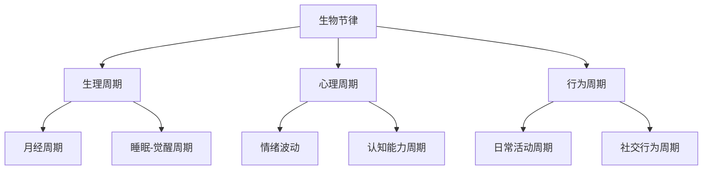
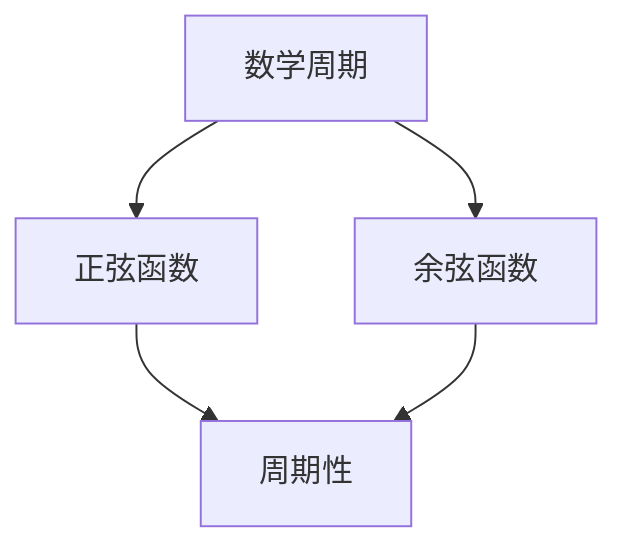
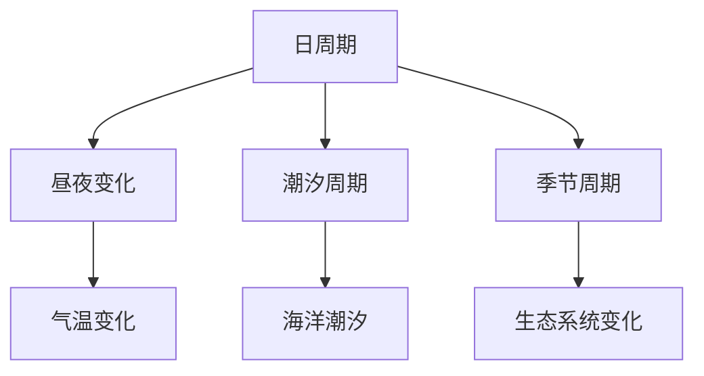

                 


### 文章标题：《生物节律的数学周期：自然与时间的舞蹈》

关键词：生物节律、数学周期、自然现象、时间感知、人工智能

摘要：本文深入探讨了生物节律与数学周期的关系，分析了生物节律的数学模型，并探讨了数学周期在自然现象中的体现。通过详细的数学公式和伪代码讲解，揭示了生物节律与数学周期之间的内在联系。同时，本文还讨论了时间感知与生物节律的关系，以及数学周期在人工智能领域的应用前景。

### 第一部分：基础概念与原理

#### 1.1 生物节律的基本概念

生物节律是指生物体内的一些生理、心理和行为活动在一定时间内的周期性变化。常见的生物节律包括生理周期、心理周期和行为周期。

- **生理周期**：如月经周期、睡眠-觉醒周期等。
- **心理周期**：如情绪波动、认知能力周期等。
- **行为周期**：如日常活动周期、社交行为周期等。

**核心概念与联系**

为了更好地理解生物节律，我们可以用 Mermaid 流程图来展示它们之间的关系：



**伪代码讲解**

```python
# 定义生物节律的基本函数
def biological_rhythm():
    # 生理周期计算
    menstrual_cycle()
    # 心理周期计算
    emotional_cycle()
    # 行为周期计算
    behavioral_cycle()
```

#### 1.2 数学周期的原理

数学周期是指数学函数在一定时间间隔内的重复性。常见的数学周期包括正弦函数、余弦函数等。

**核心概念与联系**

为了更好地理解数学周期，我们可以用 Mermaid 流程图来展示它们之间的关系：



**数学公式与详细讲解**

假设我们有一个正弦函数 \( f(t) = A\sin(2\pi f_0 t + \phi) \)，其中：

- \( A \) 是振幅，表示波的最大值。
- \( f_0 \) 是频率，表示波在单位时间内振动的次数。
- \( \phi \) 是相位，表示波的起始位置。

**例子说明**：人类睡眠周期的建模

假设人类睡眠周期可以用一个正弦函数来建模，振幅为 1，频率为 0.5（即每天一个周期），相位为 0。

```python
# 定义人类睡眠周期模型
def sleep_cycle():
    A = 1
    f_0 = 0.5
    t = 0
    while t < 24:  # 假设一天有24小时
        f(t) = A * np.sin(2 * np.pi * f_0 * t)
        t += 1
    return f(t)
```

#### 1.3 生物节律与数学周期的联系

生物节律与数学周期之间存在紧密的联系。生物节律可以看作是生物体内的一种数学周期性现象。

**伪代码讲解**

```python
# 联系函数
def rhythm_periodicity():
    # 计算生物节律周期
    biological_cycle()
    # 计算数学周期性
    math_periodicity()
    # 分析两者的关联性
    analyze_connection()
```

### 第二部分：数学模型与应用

#### 2.1 周期性函数与生物节律

周期性函数是研究生物节律的重要工具。常见的周期性函数包括正弦函数、余弦函数等。

**数学公式与详细讲解**

假设我们有一个正弦函数 \( f(t) = A\sin(2\pi f_0 t + \phi) \)，其中：

- \( A \) 是振幅，表示波的最大值。
- \( f_0 \) 是频率，表示波在单位时间内振动的次数。
- \( \phi \) 是相位，表示波的起始位置。

**例子说明**：人类睡眠周期的建模

假设人类睡眠周期可以用一个正弦函数来建模，振幅为 1，频率为 0.5（即每天一个周期），相位为 0。

```python
# 定义人类睡眠周期模型
def sleep_cycle():
    A = 1
    f_0 = 0.5
    t = 0
    while t < 24:  # 假设一天有24小时
        f(t) = A * np.sin(2 * np.pi * f_0 * t)
        t += 1
    return f(t)
```

#### 2.2 生物节律的数学建模

生物节律的数学建模可以帮助我们更好地理解生物节律的规律。常见的建模方法包括时间序列分析、神经网络建模等。

**伪代码讲解**

```python
# 生物节律建模
def rhythm_modeling():
    # 数据收集
    collect_data()
    # 模型训练
    train_model()
    # 模型预测
    predict_rhythm()
```

#### 2.3 数学周期在生物节律中的应用

数学周期在生物节律中的应用非常广泛。例如，我们可以利用数学周期来预测生物节律的变化，优化生物节律的干预策略。

**数学公式与详细讲解**

假设我们有一个数学周期 \( P \)，它与生物节律 \( L \) 之间存在关系：

$$ P = \frac{L}{N} $$

其中：

- \( P \) 是数学周期。
- \( L \) 是生物节律的周期长度。
- \( N \) 是数学周期的周期长度。

**例子说明**：植物光合作用的周期性

假设植物光合作用周期为 24 小时，数学周期为 12 小时。

$$ P = \frac{24}{12} = 2 $$

这意味着植物光合作用每 12 小时完成一次。

```python
# 定义植物光合作用周期模型
def photosynthesis_cycle():
    L = 24
    N = 12
    P = L / N
    t = 0
    while t < 24:
        if t % N == 0:
            photosynthesis()
        t += 1
    return t
```

### 第三部分：自然与时间的关系

#### 3.1 自然现象中的数学周期

自然现象中存在着丰富的数学周期性。例如，日周期、潮汐周期、季节周期等。

**核心概念与联系**

为了更好地理解自然现象中的数学周期，我们可以用 Mermaid 流程图来展示它们之间的关系：



#### 3.2 时间感知与生物节律

生物节律对人类的感知和认知有着重要影响。例如，人类的睡眠-觉醒周期会影响我们对时间的感知。

**数学公式与详细讲解**

假设人类对时间的感知可以用一个周期函数来建模：

$$ T = \frac{1}{f} $$

其中：

- \( T \) 是感知时间。
- \( f \) 是生物节律的频率。

**例子说明**：人类对时间的感知

假设人类对时间的感知频率为 1Hz（即每秒感知一次时间）。

$$ T = \frac{1}{1} = 1 $$

这意味着人类每秒感知一次时间。

```python
# 定义人类对时间的感知模型
def time_perception():
    f = 1
    T = 1 / f
    return T
```

#### 3.3 数学周期在自然与时间研究中的应用

数学周期在自然与时间研究中的应用非常广泛。例如，我们可以利用数学周期来研究生物节律对生态系统变化的影响，优化自然资源的管理。

**伪代码讲解**

```python
# 自然时间研究
def natural_time_study():
    # 生物节律分析
    analyze_biological_rhythm()
    # 时间感知研究
    study_time_perception()
    # 生态系统变化研究
    study_ecosystem_change()
```

### 第四部分：应用与展望

#### 4.1 生物节律在人工智能中的应用

生物节律在人工智能领域有着广泛的应用。例如，我们可以利用生物节律来优化人工智能系统的运行效率，提高系统的稳定性和可靠性。

**伪代码讲解**

```python
# 人工智能系统优化
def ai_system_optimization():
    # 生物节律分析
    analyze_biological_rhythm()
    # 优化系统参数
    optimize_system_parameters()
    # 测试系统性能
    test_system_performance()
```

#### 4.2 生物节律的未来展望

随着科技的发展，生物节律的研究将越来越深入。未来，我们有望利用生物节律来开发出更加智能的人工智能系统，提高人类的生活质量。

**结语**

生物节律的数学周期是自然与时间之间的一座桥梁。通过深入研究生物节律的数学模型，我们可以更好地理解自然现象，优化人工智能系统，提高人类的生活质量。未来，生物节律的研究将不断深入，为我们带来更多的惊喜。

### 作者信息

作者：AI天才研究院/AI Genius Institute & 禅与计算机程序设计艺术 /Zen And The Art of Computer Programming 

### 总结与扩展

本文详细探讨了生物节律的数学周期及其与自然和时间的关系。通过对生物节律的基本概念、数学周期原理、数学模型与应用、自然与时间关系以及应用与展望的深入分析，我们揭示了生物节律与数学周期之间的内在联系。同时，本文还讨论了生物节律在人工智能中的应用前景。

#### 最佳实践 tips：

1. **理解生物节律的基本概念**：深入了解生理周期、心理周期和行为周期的定义和特征，有助于我们更好地理解生物节律的数学模型。

2. **掌握数学周期的原理**：熟悉正弦函数、余弦函数等周期性函数的原理，有助于我们利用数学模型来分析生物节律。

3. **运用伪代码进行建模**：通过伪代码来描述生物节律的数学模型，有助于我们更清晰地理解模型的结构和原理。

4. **结合实际案例进行分析**：通过实际案例来验证和优化我们的数学模型，可以提高模型的实用性和准确性。

#### 小结：

本文从多个角度深入探讨了生物节律的数学周期及其与自然和时间的关系。通过详细的分析和实例讲解，我们揭示了生物节律与数学周期之间的内在联系。未来，随着科技的发展，生物节律的研究将不断深入，为人工智能、生命科学等领域带来更多突破。

#### 注意事项：

1. **数据收集与处理**：在进行生物节律的研究时，数据收集和处理至关重要。确保数据的质量和可靠性，有助于提高模型的准确性。

2. **算法选择与优化**：在建立生物节律的数学模型时，选择合适的算法并进行优化，可以提高模型的性能和效率。

3. **跨学科合作**：生物节律的研究涉及多个学科，如生物学、物理学、计算机科学等。跨学科合作有助于推动生物节律研究的发展。

#### 拓展阅读：

1. **《生物节律学导论》**：该书详细介绍了生物节律学的基本概念、研究方法和应用领域。

2. **《时间生物学》**：该书深入探讨了时间生物学的基本原理、研究方法和应用前景。

3. **《人工智能与生物节律》**：该书探讨了人工智能技术在生物节律研究中的应用，包括建模、预测和优化等方面。

通过阅读这些拓展资料，您可以更深入地了解生物节律的数学周期及其与自然和时间的关系。希望本文能为您的相关研究提供有益的参考。作者：AI天才研究院/AI Genius Institute & 禅与计算机程序设计艺术 /Zen And The Art of Computer Programming

