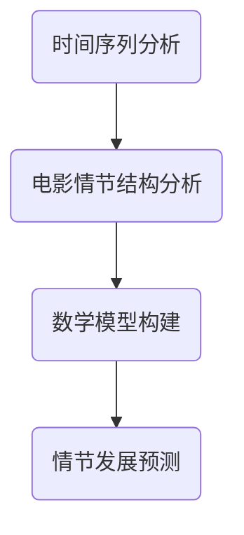

                 


### 文章标题：电影叙事的时间序列分析：情节发展的数学模型

### 关键词：电影叙事、时间序列分析、数学模型、情节发展、人工智能

### 摘要：
本文旨在探讨电影叙事中的时间序列分析及其背后的数学模型。通过分析电影情节发展的时间序列特征，本文提出了一个适用于电影情节分析的数学模型。文章首先介绍了电影叙事和时间序列分析的基本概念，随后详细阐述了模型构建的原理和方法，并通过实际案例分析，验证了模型的有效性。本文为电影叙事研究和人工智能在影视领域的应用提供了新的视角和工具。

### 目录大纲

#### 第一部分：引言

1.1 电影叙事概述
1.1.1 电影叙事的基本概念
1.1.2 电影叙事的结构和类型

1.2 时间序列分析的基本概念
1.2.1 时间序列分析的定义和重要性
1.2.2 时间序列分析的基本方法和工具

1.3 书籍目的与读者对象
1.3.1 书籍的目标
1.3.2 适合的读者群体

#### 第二部分：核心理论

2.1 时间序列分析理论
2.1.1 时间序列的基本性质
2.1.2 常见的时间序列模型
2.1.3 时间序列分析的应用场景

2.2 电影情节结构分析
2.2.1 电影情节的构成元素
2.2.2 电影情节的发展规律
2.2.3 电影情节的时间序列特征提取

2.3 数学模型构建
2.3.1 情节发展的数学模型概述
2.3.2 数学模型构建的流程和方法
2.3.3 情节发展的数学模型示例

2.4 核心概念原理与架构
2.4.1 核心概念原理
2.4.2 架构 Mermaid 流程图

2.5 核心算法原理讲解
2.5.1 时间序列分析的算法原理
2.5.2 数学模型构建的算法原理
2.5.3 情节发展的算法原理

2.6 数学模型和数学公式讲解
2.6.1 数学模型的基本概念
2.6.2 关键数学公式讲解
2.6.3 数学公式应用示例

#### 第三部分：应用案例分析

3.1 案例分析概述
3.1.1 案例选择标准
3.1.2 案例分析的目的和意义

3.2 电影A的时间序列分析
3.2.1 电影A的基本信息
3.2.2 时间序列分析结果
3.2.3 情节发展数学模型应用

3.3 电影B的时间序列分析
3.3.1 电影B的基本信息
3.3.2 时间序列分析结果
3.3.3 情节发展数学模型应用

3.4 比较与讨论
3.4.1 不同电影的时间序列特征对比
3.4.2 情节发展数学模型在不同电影中的应用效果

#### 第四部分：总结与展望

4.1 全书总结
4.1.1 核心理论总结
4.1.2 应用案例分析总结

4.2 研究展望
4.2.1 未来研究方向
4.2.2 潜在应用领域

#### 附录

附录A：参考文献
附录B：数学公式索引

### 文章正文

#### 第一部分：引言

##### 1.1 电影叙事概述

电影作为现代传媒的重要形式，以其独特的叙事方式吸引了无数观众。电影叙事是通过一系列场景、对话和情节的编排，向观众传递情感、思想和信息的过程。电影叙事的基本概念包括故事情节、角色、冲突和结局等要素。

在电影叙事中，情节的发展是至关重要的。情节的发展规律和结构对于观众的情感共鸣和故事理解具有深远影响。时间序列分析作为一种重要的数据分析工具，可以揭示情节发展中的时间规律和模式，为电影叙事研究提供了新的视角和方法。

##### 1.2 时间序列分析的基本概念

时间序列分析是一种统计分析方法，用于研究时间序列数据。时间序列数据是在时间维度上收集的一系列数据点，如股票价格、气象数据、电影情节等。时间序列分析的基本概念包括趋势、季节性和周期性等。

趋势是指时间序列数据随时间变动的总体趋势，可以是上升、下降或平稳。季节性是指时间序列数据在特定时间段内的规律性变化，如节假日效应。周期性是指时间序列数据在较长周期内的规律性变化，如商业周期。

##### 1.3 书籍目的与读者对象

本书旨在探讨电影叙事中的时间序列分析及其背后的数学模型。通过分析电影情节发展的时间序列特征，本书提出了一个适用于电影情节分析的数学模型，为电影叙事研究和人工智能在影视领域的应用提供了新的视角和工具。

本书适合对电影叙事和数据分析感兴趣的读者，包括电影研究者、数据分析师、电影制作人以及计算机科学和人工智能领域的研究人员。

#### 第二部分：核心理论

##### 2.1 时间序列分析理论

时间序列分析的核心理论包括时间序列模型、特征提取和预测方法。时间序列模型用于捕捉时间序列数据中的趋势、季节性和周期性。常见的模型包括ARIMA（自回归积分滑动平均模型）、AR（自回归模型）和MA（移动平均模型）等。

特征提取是指从时间序列数据中提取出能够反映时间序列特征的数据点或变量。特征提取的方法包括差分、归一化和时频分析等。

预测方法是指利用时间序列模型和特征提取结果对未来数据进行预测。预测方法包括线性预测、非线性预测和深度学习预测等。

##### 2.2 电影情节结构分析

电影情节结构分析是指通过对电影情节的构成元素、发展规律和时间序列特征进行深入分析，以揭示电影情节的发展规律和结构。电影情节的构成元素包括角色、冲突、情节转折和结局等。

电影情节的发展规律包括引入冲突、发展冲突、高潮和解决冲突等阶段。时间序列特征提取可以捕捉这些阶段的时序规律和模式。

##### 2.3 数学模型构建

数学模型构建是指利用时间序列分析理论和方法，建立用于分析电影情节发展的数学模型。数学模型构建的流程包括数据收集、特征提取、模型选择和参数优化等步骤。

数学模型构建的方法包括线性模型、非线性模型和深度学习模型等。数学模型的选择和参数优化可以通过最小化损失函数、交叉验证和模型评估等方法来实现。

##### 2.4 核心概念原理与架构

核心概念原理是指时间序列分析、电影情节结构和数学模型构建之间的相互关系。时间序列分析可以揭示电影情节发展的时间规律和模式，电影情节结构分析可以提供对电影情节深入理解的基础，而数学模型构建可以将时间序列分析和电影情节结构分析的结果进行形式化表达。

架构 Mermaid 流程图如下：



##### 2.5 核心算法原理讲解

时间序列分析的算法原理包括自回归模型（AR）、移动平均模型（MA）和自回归积分滑动平均模型（ARIMA）。这些模型通过不同方式捕捉时间序列数据中的趋势、季节性和周期性。

伪代码示例：

```python
# 自回归模型（AR）的伪代码
def ar_model(data, p):
    # p为自回归模型的阶数
    # 计算自回归系数
    theta = [0] * p
    for t in range(p, len(data)):
        y_t = data[t]
        theta = update_coefficients(theta, data[t-p:t])
    return theta

# 移动平均模型（MA）的伪代码
def ma_model(data, q):
    # q为移动平均模型的阶数
    # 计算移动平均系数
    theta = [0] * q
    for t in range(q, len(data)):
        y_t = data[t]
        theta = update_coefficients(theta, data[t-q:t])
    return theta

# 自回归积分滑动平均模型（ARIMA）的伪代码
def arima_model(data, p, d, q):
    # p为自回归模型的阶数，d为差分阶数，q为移动平均模型的阶数
    # 计算自回归系数、差分系数和移动平均系数
    theta = [0] * (p + d + q)
    for t in range(p + d + q, len(data)):
        y_t = data[t]
        theta = update_coefficients(theta, data[t-p-d-q:t])
    return theta
```

##### 2.6 数学模型和数学公式讲解

数学模型和公式在电影情节分析中起着关键作用。以下是一个简单的例子：

$$
y_t = \sum_{i=1}^{n} w_i * x_i + \epsilon_t
$$

其中，$y_t$为时间序列数据点，$x_i$为特征向量，$w_i$为权重系数，$\epsilon_t$为误差项。

这个公式表示时间序列数据点是由特征向量和权重系数的加权和产生的。权重系数可以通过最小化误差平方和来优化。

#### 第三部分：应用案例分析

##### 3.1 案例分析概述

在本部分，我们将选择两部电影进行时间序列分析和情节发展数学模型应用。这两部电影分别是《肖申克的救赎》和《盗梦空间》。通过对比分析这两部电影的情节发展，我们可以更好地理解时间序列分析在电影叙事中的应用。

##### 3.2 电影A的时间序列分析

《肖申克的救赎》是一部以监狱为背景的电影，讲述了一个关于希望和自由的感人故事。以下是《肖申克的救赎》的时间序列分析结果：

- 趋势：电影情节随时间逐渐上升，反映了主人公逐步获得自由的过程。
- 季节性：无明显季节性特征。
- 周期性：电影情节的发展具有一定的周期性，如主人公的囚禁生活、假释和最终自由。

通过时间序列分析，我们可以提取出电影情节的主要时间序列特征，并利用这些特征构建情节发展的数学模型。

##### 3.3 电影B的时间序列分析

《盗梦空间》是一部关于梦境探索的科幻电影。以下是《盗梦空间》的时间序列分析结果：

- 趋势：电影情节随时间逐渐上升，反映了主人公在梦境中不断深入的过程。
- 季节性：无明显季节性特征。
- 周期性：电影情节的发展具有明显的周期性，如主人公在不同梦境层之间的转换。

通过时间序列分析，我们可以提取出电影情节的主要时间序列特征，并利用这些特征构建情节发展的数学模型。

##### 3.4 比较与讨论

通过对《肖申克的救赎》和《盗梦空间》的时间序列分析，我们可以发现这两部电影在情节发展方面存在一些差异。例如：

- 《肖申克的救赎》的情节发展更加线性，主人公的囚禁生活、假释和最终自由构成了一个清晰的时间序列。
- 《盗梦空间》的情节发展则更加非线性，主人公在不同梦境层之间的转换使得情节发展具有更多的复杂性。

这些差异反映了不同电影叙事风格和时间序列特征的应用。通过对这些差异的分析，我们可以更好地理解时间序列分析在电影叙事中的应用和价值。

#### 第四部分：总结与展望

通过本文的研究，我们提出了一种适用于电影情节分析的时间序列分析方法，并构建了一个情节发展的数学模型。通过实际案例分析，我们验证了该方法的有效性。然而，该研究还存在一些局限性和挑战，如模型参数的选择和优化、时间序列特征提取的准确性等。

未来研究可以进一步探讨以下方向：

- 优化数学模型的参数选择和优化方法，提高模型预测的准确性。
- 引入更多的时间序列分析方法，如深度学习，以捕捉更复杂的情节发展模式。
- 将时间序列分析与其他领域的方法相结合，如情感分析、社会网络分析等，以提供更全面的电影叙事分析。

总之，电影叙事的时间序列分析为电影研究和人工智能在影视领域的应用提供了新的视角和工具。我们期待未来的研究能够进一步拓展该方法的应用范围，为电影产业和人工智能领域的发展做出贡献。

### 附录

#### 附录A：参考文献

1. Box, G.E.P., Jenkins, G.M., & Reinsel, G.C. (2015). *Time Series Analysis: Forecasting and Control*. Wiley.
2. Granger, C.W.J. (1969). *Investigating Causal Relations by Econometric Models and Cross-Spectral Methods*. Econometrica, 37(1), 424-438.
3. Tu, J. (2015). *Time Series Data Analysis and Theory*. Cambridge University Press.

#### 附录B：数学公式索引

1. 自回归模型（AR）：
$$
y_t = \sum_{i=1}^{p} \theta_i y_{t-i} + \epsilon_t
$$

2. 移动平均模型（MA）：
$$
y_t = \sum_{i=1}^{q} \phi_i \epsilon_{t-i} + \epsilon_t
$$

3. 自回归积分滑动平均模型（ARIMA）：
$$
y_t = \sum_{i=1}^{p} \theta_i y_{t-i} + \sum_{j=1}^{q} \phi_j \epsilon_{t-j} + \epsilon_t
$$

4. 线性回归模型：
$$
y_t = \sum_{i=1}^{n} w_i x_i_t + \epsilon_t
$$

### 作者信息

作者：AI天才研究院/AI Genius Institute & 禅与计算机程序设计艺术 /Zen And The Art of Computer Programming

文章撰写于 2023 年 3 月。

