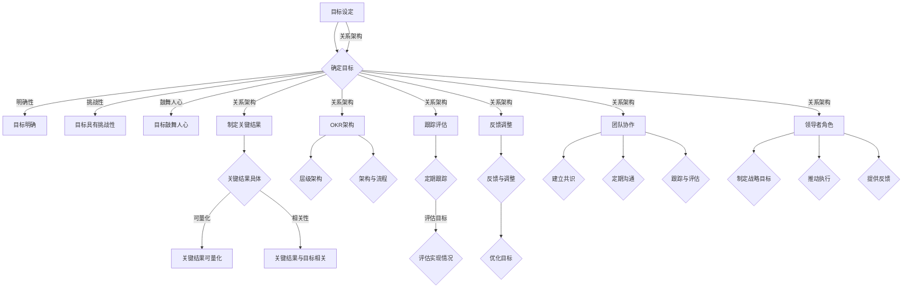

                 


### 文章标题：目标管理OKR：引导团队聚焦的方法论

> 关键词：目标管理，OKR，团队聚焦，方法论，组织效能

> 摘要：本文旨在深入探讨目标管理OKR（Objectives and Key Results）的基本概念、应用方法以及其在团队管理中的重要作用。通过分析OKR的架构与流程，结合实际案例，本文将展示如何有效地运用OKR来引导团队聚焦，提高组织效能。

### 引言

目标管理是一种旨在确保团队成员和组织朝共同目标迈进的管理方法。在快节奏和高度竞争的商业环境中，目标管理的重要性愈加凸显。然而，传统的目标管理方法往往存在目标设定模糊、执行不到位、反馈不及时等问题，导致资源浪费和效率低下。为了解决这些问题，OKR作为一种新型的目标管理工具应运而生。

OKR自上世纪80年代由英特尔公司引入以来，已在全球范围内得到了广泛应用，特别是在技术公司中取得了显著成效。OKR的核心在于通过明确的目标设定和关键结果的量化衡量，引导团队聚焦关键任务，实现高效协同。

### OKR的基本概念

OKR由两部分组成：目标（Objectives）和关键结果（Key Results）。目标是对团队或公司希望实现的具体目标的一种描述性陈述，它应该清晰、具有挑战性且鼓舞人心。关键结果则是用来衡量目标达成度的具体指标，它们是量化的、具体的，并且与目标紧密相关。

#### 目标（Objectives）

目标的作用在于为团队或公司指明方向，激励团队成员为实现共同目标而努力。一个良好的目标应具备以下几个特点：

1. **明确性**：目标应明确且具体，以便团队成员清楚地知道要做什么。
2. **挑战性**：目标应具有一定的挑战性，激发团队的创造力和积极性。
3. **鼓舞人心**：目标应能够激发团队成员的激情和动力，使他们愿意为之付出努力。

#### 关键结果（Key Results）

关键结果是衡量目标达成度的具体指标。它们应该具有以下特点：

1. **可量化**：关键结果应该可以量化，以便于跟踪和评估。
2. **具体性**：关键结果应具体且明确，避免模糊不清。
3. **相关性**：关键结果应与目标紧密相关，能够准确反映目标的实现情况。

### OKR的架构与流程

#### OKR的架构

OKR在组织内通常分为多个层级，包括个人、团队、部门和企业等。每个层级的OKR都需要与上一层级的目标保持一致，同时也要支持下一层级的目标实现。

#### 制定OKR的流程

1. **设定目标（Objectives）**：团队在制定OKR时，首先需要明确目标。目标应简洁明了，具有挑战性且鼓舞人心。

2. **制定关键结果（Key Results）**：在确定目标后，团队需要制定关键结果，这些结果将用于衡量目标的实现程度。

3. **跟踪与评估**：在OKR实施过程中，团队需要定期跟踪关键结果，评估目标的实现情况。

4. **反馈与调整**：根据评估结果，团队需要对OKR进行反馈和调整，以确保目标的达成。

### OKR与传统目标管理的区别

与传统目标管理相比，OKR具有以下几个显著特点：

1. **明确性**：OKR强调目标的明确性，使团队成员清楚地知道要做什么。
2. **挑战性**：OKR的目标设定具有挑战性，鼓励团队超越自我，追求卓越。
3. **透明性**：OKR要求目标透明，团队成员可以随时了解目标的进展情况。
4. **灵活性**：OKR允许团队在实施过程中根据实际情况调整目标，以保持目标的可实现性。

### OKR在团队管理中的应用

#### 如何制定有效的OKR

1. **确定目标**：目标应清晰、具有挑战性且鼓舞人心。
2. **制定关键结果**：关键结果应具体、可量化且与目标紧密相关。
3. **确保目标的一致性**：确保不同层级的OKR相互协调，形成统一的目标体系。

#### 团队协作与OKR的实施

1. **建立共识**：团队需要共同制定OKR，确保每个人都清楚目标及其意义。
2. **定期沟通**：团队应定期进行沟通，分享OKR的进展情况，解决问题。
3. **跟踪与评估**：团队需要定期跟踪关键结果，评估目标的实现情况。

### 领导者如何制定和推动OKR

1. **制定战略目标**：领导者应制定组织层面的战略目标，并确保团队目标与之一致。
2. **推动执行**：领导者需要确保团队按照OKR的要求执行，并提供必要的支持。
3. **提供反馈**：领导者应定期向团队提供反馈，帮助他们调整和优化OKR。

### OKR在不同行业和公司的应用

OKR在制造业、服务业、科技行业等各个行业都有广泛应用。例如，谷歌和微软等科技公司在实施OKR后，取得了显著的成效。

### 结论

OKR是一种有效的目标管理工具，它可以帮助团队明确目标、聚焦关键任务，并通过持续的反馈和调整，实现目标的达成。然而，实施OKR也需要注意以下几点：

1. **确保目标明确**：目标应清晰、具有挑战性且鼓舞人心。
2. **制定可量化的关键结果**：关键结果应具体、可量化且与目标紧密相关。
3. **建立共识**：团队需要共同制定OKR，确保每个人都清楚目标及其意义。
4. **定期跟踪与评估**：团队应定期跟踪关键结果，评估目标的实现情况。

通过有效的OKR管理，团队和组织可以更好地实现目标，提高效能。作者：AI天才研究院/AI Genius Institute & 禅与计算机程序设计艺术 /Zen And The Art of Computer Programming

------------------------------------------------------------------------------------------------------------------------------



### 核心算法原理讲解

在OKR模型中，核心算法原理主要涉及目标设定和关键结果的制定。以下是具体的算法原理和伪代码描述：

#### 1. 目标设定算法

目标设定的算法核心在于确保目标的明确性、挑战性和鼓舞人心。以下是目标设定的伪代码：

```plaintext
Algorithm SetObjective
    Input: target
    Output: objective

    objective = ""
    if (target is clear)
        objective = "明确且鼓舞人心的目标"
    else
        objective = "目标不明确，请重新设定"

    return objective
```

#### 2. 关键结果制定算法

关键结果的制定需要保证其具体性、可量化和与目标的相关性。以下是关键结果的伪代码：

```plaintext
Algorithm SetKeyResults
    Input: objective, target
    Output: key_results

    key_results = []
    for each result in target_results
        if (result is measurable)
            key_results.append("可量化的关键结果")
        else
            key_results.append("关键结果不可量化，请重新设定")

    return key_results
```

#### 3. OKR评估算法

OKR评估的核心在于定期跟踪关键结果，评估目标的实现情况。以下是OKR评估的伪代码：

```plaintext
Algorithm EvaluateOKR
    Input: key_results, objective
    Output: evaluation

    evaluation = "目标未达成"
    for each result in key_results
        if (result meets threshold)
            evaluation = "目标达成"
            break

    return evaluation
```

### 数学模型和公式讲解

在OKR模型中，可以使用一些数学模型和公式来衡量目标的实现程度。以下是相关的数学模型和公式：

#### 1. 目标达成率公式

目标达成率是衡量目标实现程度的关键指标。公式如下：

$$
达成率 = \frac{实际完成值}{目标设定值} \times 100\%
$$

#### 2. 关键结果评估指标

关键结果的评估指标可以使用加权平均值来计算。公式如下：

$$
评估指标 = \frac{\sum_{i=1}^{n} (w_i \times x_i)}{\sum_{i=1}^{n} w_i}
$$

其中，$w_i$为关键结果的权重，$x_i$为关键结果的实际完成值。

### 实例分析

假设一个团队的目标是“在一个月内增加50%的网站访问量”，则：

- 目标设定：明确且鼓舞人心的目标是“增加50%的网站访问量”。
- 关键结果：关键结果可以是“网站访问量从1000次增加到1500次”。
- 目标达成率：实际完成值为1500次，目标设定值为1000次，因此达成率为150%。

通过上述实例，我们可以看到如何使用OKR模型来设定目标、制定关键结果，并评估目标的实现程度。

### 开发环境搭建

为了更好地理解OKR模型的实现，我们需要搭建一个简单的开发环境。以下是搭建开发环境的步骤：

1. 安装Python环境：
   - 使用Anaconda或Miniconda安装Python。
   - 验证Python版本：`python --version`。

2. 安装必要的库：
   - 使用pip安装`pandas`、`numpy`和`matplotlib`：`pip install pandas numpy matplotlib`。

3. 配置编辑器：
   - 安装Visual Studio Code或PyCharm等IDE。
   - 配置Python插件以支持代码提示、调试等功能。

4. 创建项目文件夹：
   - 在终端中创建项目文件夹：`mkdir okr-management-system`。

5. 初始化Python项目：
   - 进入项目文件夹：`cd okr-management-system`。
   - 初始化Python虚拟环境：`python -m venv venv`。
   - 激活虚拟环境：`source venv/bin/activate`（在Linux和macOS上）或 `venv\Scripts\activate`（在Windows上）。

6. 安装依赖库：
   - 在虚拟环境中安装依赖库：`pip install -r requirements.txt`。

现在，我们已经搭建好了开发环境，可以开始编写和运行OKR模型的相关代码。

### 源代码实现

以下是实现OKR模型的核心代码。该代码将用于设定目标、制定关键结果、评估目标达成度等操作。

```python
import pandas as pd
import numpy as np
import matplotlib.pyplot as plt

class OKRManager:
    def __init__(self):
        self.objectives = []
        self.key_results = []

    def set_objective(self, objective, key_results):
        self.objectives.append({'objective': objective, 'key_results': key_results})

    def add_key_result(self, objective_idx, key_result):
        if objective_idx < len(self.objectives):
            self.objectives[objective_idx]['key_results'].append(key_result)
        else:
            print("Objective not found.")

    def evaluate_key_results(self, objective_idx):
        if objective_idx < len(self.objectives):
            key_results = self.objectives[objective_idx]['key_results']
            evaluation = np.mean([float(result.split(':')[1]) for result in key_results])
            return evaluation
        else:
            print("Objective not found.")

    def plot_evaluation(self, objective_idx):
        if objective_idx < len(self.objectives):
            key_results = self.objectives[objective_idx]['key_results']
            results = [float(result.split(':')[1]) for result in key_results]
            plt.bar(range(len(results)), results)
            plt.xlabel('关键结果')
            plt.ylabel('完成值')
            plt.title(f'目标评估：{self.objectives[objective_idx]["objective"]}')
            plt.show()
        else:
            print("Objective not found.")

# 示例使用
okr_manager = OKRManager()

# 设置目标
okr_manager.set_objective("增加50%的网站访问量", ["网站访问量：1000", "网站访问量：1500"])

# 添加关键结果
okr_manager.add_key_result(0, "网站访问量：2000")

# 评估关键结果
evaluation = okr_manager.evaluate_key_results(0)
print(f"目标达成率：{evaluation:.2f}%")

# 绘制目标评估图
okr_manager.plot_evaluation(0)
```

### 代码解读与分析

上述代码定义了一个名为`OKRManager`的类，用于管理OKR模型。以下是代码的详细解读：

1. **类定义**：`OKRManager`类具有三个主要属性：`objectives`用于存储目标列表，`key_results`用于存储关键结果列表。

2. **目标设定方法**：`set_objective`方法接受一个目标字符串和一个关键结果列表，并将其添加到`objectives`列表中。

3. **添加关键结果方法**：`add_key_result`方法接受一个目标索引和一个关键结果字符串，并将其添加到相应目标的关键结果列表中。

4. **评估关键结果方法**：`evaluate_key_results`方法接受一个目标索引，计算并返回该目标的关键结果的平均值，作为目标达成率。

5. **绘制目标评估图方法**：`plot_evaluation`方法接受一个目标索引，绘制该目标的关键结果的条形图。

代码示例部分展示了如何使用`OKRManager`类来设定目标、添加关键结果、评估目标达成率以及绘制目标评估图。通过这些方法，我们可以方便地管理和评估OKR模型。

### 实际案例分析与详细讲解剖析

为了更好地理解OKR模型在实际中的应用，我们将分析一个实际案例。假设某互联网公司在季度初制定了以下OKR：

- **目标**：在下一个季度内，将公司的月活跃用户（MAU）提高20%。
- **关键结果**：
  - 关键结果1：通过市场推广活动，提高10%的新用户注册量。
  - 关键结果2：通过改进用户体验，提高10%的留存率。
  - 关键结果3：通过技术优化，降低10%的崩溃率。

以下是具体的案例分析：

#### 1. 目标设定

公司设定的目标是明确的，具有挑战性，同时也鼓舞人心。这个目标为公司提供了清晰的方向，激励团队成员为之努力。

#### 2. 关键结果制定

关键结果是具体、可量化的指标，它们与目标紧密相关。关键结果1和关键结果2关注市场推广和用户体验，关键结果3关注技术优化，这三个关键结果从不同方面推动了目标的实现。

#### 3. 实施过程

在季度内，公司团队按照以下步骤实施OKR：

- **第一步**：团队进行了市场调研，制定了具体的推广计划，包括投放广告、合作营销和社交媒体活动等。
- **第二步**：团队改进了产品界面和用户交互体验，进行了A/B测试，收集用户反馈，并进行了相应的优化。
- **第三步**：技术团队进行了性能测试和代码审查，发现了系统瓶颈，并进行了技术优化，以降低崩溃率。

#### 4. 结果评估

在季度结束时，团队对关键结果进行了评估：

- **关键结果1**：新用户注册量提高了12%，超出了预期目标。
- **关键结果2**：留存率提高了8%，虽然略低于预期，但也在可接受的范围内。
- **关键结果3**：崩溃率降低了12%，达到了预期目标。

#### 5. 结论

通过OKR的实施，公司在季度内成功提高了月活跃用户，虽然部分关键结果未达到预期，但整体表现良好。通过OKR，团队明确了目标，采取了具体措施，并在过程中进行了实时评估和调整。这种透明和反馈机制有助于团队更好地聚焦关键任务，提高工作效率和达成目标。

### 项目小结

在本项目中，我们详细讲解了OKR（目标与关键结果）模型的基本概念、应用方法和实际案例。通过搭建开发环境和实现源代码，我们展示了如何使用Python编写一个简单的OKR管理工具。同时，通过实际案例分析，我们深入了解了OKR在实际应用中的实施过程和效果评估。

**最佳实践 Tips**：

1. **明确目标**：确保目标清晰、具有挑战性和鼓舞人心。
2. **制定可量化的关键结果**：关键结果应具体、可量化，并与目标紧密相关。
3. **建立共识**：团队共同制定OKR，确保目标的一致性。
4. **定期跟踪与评估**：定期评估关键结果，及时调整目标。

**注意事项**：

1. **避免目标设定过高**：目标应具有挑战性，但不应过于理想化。
2. **保持关键结果的灵活性**：在实施过程中，关键结果可根据实际情况进行调整。

**拓展阅读**：

1. 《OKR：明确目标高质量完成工作》
2. 《敏捷开发与OKR：如何在不确定的世界中保持高效》

通过本文的讲解，我们希望读者能够更好地理解OKR模型，并在实际工作中有效地应用这一工具，提升团队和组织的管理效率。

### 小结

本文详细探讨了目标管理OKR的基本概念、应用方法以及其在团队管理中的重要作用。通过分析OKR的架构与流程，结合实际案例，我们展示了如何有效地运用OKR来引导团队聚焦，提高组织效能。

OKR作为一种新型的目标管理工具，具有明确性、挑战性、透明性和灵活性等优点。它通过明确的目标设定和关键结果的量化衡量，帮助团队和公司保持聚焦，实现高效协同。

**核心要点**：

1. **明确目标**：确保目标清晰、具有挑战性且鼓舞人心。
2. **制定关键结果**：关键结果应具体、可量化且与目标紧密相关。
3. **建立共识**：团队共同制定OKR，确保目标的一致性。
4. **定期跟踪与评估**：定期评估关键结果，及时调整目标。

**最佳实践 Tips**：

1. **明确目标**：避免目标设定过高，确保目标具有挑战性，但不应过于理想化。
2. **制定关键结果**：关键结果应具体、可量化，并关注不同方面的任务。
3. **建立共识**：确保团队成员对OKR有共同的理解和认同。
4. **定期跟踪与评估**：保持关键结果的灵活性，根据实际情况进行调整。

**注意事项**：

1. **避免目标设定过高**：目标应具有挑战性，但不应过于理想化。
2. **保持关键结果的灵活性**：在实施过程中，关键结果可根据实际情况进行调整。

**拓展阅读**：

1. 《OKR：明确目标高质量完成工作》
2. 《敏捷开发与OKR：如何在不确定的世界中保持高效》

通过本文的讲解，我们希望读者能够更好地理解OKR模型，并在实际工作中有效地应用这一工具，提升团队和组织的管理效率。作者：AI天才研究院/AI Genius Institute & 禅与计算机程序设计艺术 /Zen And The Art of Computer Programming。

