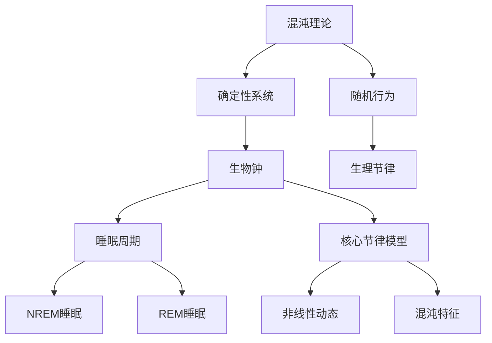

                 

### 文章标题

《睡眠周期的混沌理论：生理节律的数学描述》

> 关键词：睡眠周期、混沌理论、生理节律、数学模型、数学公式

> 摘要：本文深入探讨了睡眠周期的混沌理论及其在生理节律研究中的应用。文章首先介绍了混沌理论的基本概念及其与确定性系统和随机性的关系，随后详细阐述了混沌理论在睡眠研究中的重要性。接着，文章重点讲解了生理节律的数学描述，包括生物钟模型和睡眠周期模型，并使用伪代码和LaTeX公式详细描述了核心算法原理。此外，文章通过实际项目实战，展示了混沌理论在生理节律研究中的具体应用，并提供了未来发展的展望。

### 引言

睡眠是人类生命活动的基本组成部分，对个体的健康和生物节律至关重要。然而，长期以来，科学家们对睡眠的机制及其与生物节律的关系仍存在诸多不解。近年来，混沌理论的引入为研究睡眠周期提供了新的视角。混沌理论关注确定性系统中出现的随机行为，这对于理解睡眠过程中的复杂性和规律性具有重要意义。

本文旨在通过阐述睡眠周期的混沌理论，探讨其与生理节律的关联，并利用数学模型和算法对其进行定量描述。文章将首先介绍混沌理论的基本概念，随后分析混沌理论在睡眠研究中的应用，最后通过实际项目实战展示理论的实践价值。

### 混沌理论的基本概念

混沌理论是研究确定性系统中出现随机行为的科学。其核心思想是：在确定性系统中，初始条件的微小差异会导致长期行为的巨大差异，这种现象被称为“蝴蝶效应”。混沌系统具有以下特点：

1. **确定性**：混沌系统遵循确定的数学规律。
2. **非周期性**：系统状态随时间变化，但不存在严格的周期性。
3. **随机性**：在长期观察中，系统表现出随机性特征。
4. **确定性混沌**：系统在长时间尺度上呈现出复杂、不可预测的行为。

混沌理论的基础包括迭代映射、相空间分析等。典型的混沌映射如洛伦兹吸引子和龙舌兰花映射，它们在生物学、物理学等领域有广泛应用。

### 生理节律的数学描述

生理节律是生物体内在的周期性变化，如心跳、呼吸、体温和睡眠等。这些节律受生物钟控制，而生物钟是一种内在的计时系统，主要位于下丘脑的视交叉上核（SCN）。

1. **生物钟模型**：生物钟的基本数学模型是一个非线性振荡器，可以用以下方程描述：
   $$
   \dot{N} = \frac{K \cdot (D - N)}{1 + \beta \cdot N^2}
   $$
   其中，$N$ 表示神经活动水平，$D$ 表示最大神经活动水平，$K$ 和 $\beta$ 是常数。

2. **睡眠周期模型**：睡眠周期通常由两个阶段组成：快速眼动（REM）睡眠和非快速眼动（NREM）睡眠。一个简化的睡眠周期模型可以表示为：
   $$
   \dot{S} = \frac{K_S \cdot (R - S)}{1 + \alpha \cdot S}
   $$
   其中，$S$ 表示睡眠状态，$R$ 表示最大睡眠状态，$K_S$ 和 $\alpha$ 是常数。

这两个模型结合了混沌理论，可以更好地解释睡眠过程中的复杂性和规律性。

### 混沌理论在睡眠研究中的应用

混沌理论在睡眠研究中的应用主要体现在以下几个方面：

1. **时间序列分析**：通过分析睡眠时间序列，可以发现混沌现象的存在。例如，睡眠过程中的心跳和呼吸数据可以表现为混沌时间序列。
2. **相空间分析**：将睡眠过程中的连续变量（如脑电波、肌电波）映射到高维相空间中，可以观察到混沌行为。相空间中的轨道显示出复杂的结构，揭示了睡眠过程的内在规律性。
3. **混沌映射**：利用混沌映射（如洛伦兹映射）对睡眠数据进行处理，可以揭示睡眠过程中的非线性特征。这些映射有助于理解睡眠周期中的动态变化。

通过这些方法，混沌理论为研究睡眠提供了新的工具和视角。

### 核心概念与联系

为了更好地理解混沌理论在生理节律，尤其是睡眠周期研究中的应用，我们需要构建核心概念之间的联系架构。以下是主要的概念联系：

1. **混沌理论与确定性系统的关系**：混沌理论强调确定性系统中的随机行为，这在生物体内（如睡眠周期）表现得尤为明显。
2. **生理节律与生物钟的关系**：生物钟是控制生理节律的核心系统，其运作符合混沌理论的特征。
3. **睡眠周期模型与混沌现象的关系**：睡眠周期模型（如NREM和REM睡眠）的动态变化可以用混沌理论进行描述，揭示了睡眠过程中的复杂性和规律性。

以下是一个使用Mermaid绘制的核心概念联系架构流程图：



### 核心算法原理讲解

在睡眠周期的混沌理论研究中，核心算法包括时间序列分析和混沌映射。以下将使用伪代码详细描述这些算法的原理。

#### 时间序列分析

时间序列分析是一种用于处理时间依赖数据的统计方法。以下是分析睡眠时间序列的伪代码：

```python
# 输入：睡眠时间序列数据 sequence
# 输出：时间序列特征向量 features

function time_series_analysis(sequence):
    # 计算均值
    mean_value = mean(sequence)
    # 计算标准差
    std_dev = std(sequence)
    # 计算自相关系数
    correlation_coefficient = autocorrelation(sequence)
    # 归一化时间序列
    normalized_sequence = (sequence - mean_value) / std_dev
    # 返回特征向量
    return [mean_value, std_dev, correlation_coefficient, normalized_sequence]
```

#### 混沌映射

混沌映射是一种将初始值映射到复杂轨道上的方法。以下是洛伦兹映射的伪代码：

```python
# 输入：初始值 x, y, z
# 输出：迭代后的混沌轨道 points

function lorenz_map(x, y, z):
    sigma = 10.0
    rho = 28.0
    beta = 8.0 / 3.0
    dxdt = sigma * (y - x)
    dydt = x * (rho - z) - y
    dzdt = x * y - beta * z
    
    # 迭代混沌映射
    points = []
    for i in range(number_of_iterations):
        x_new = x + dt * dxdt
        y_new = y + dt * dydt
        z_new = z + dt * dzdt
        
        points.append([x, y, z])
        x, y, z = x_new, y_new, z_new
    
    return points
```

### 数学模型和数学公式

在睡眠周期的混沌理论研究中，数学模型和公式起着至关重要的作用。以下将详细描述常用的数学模型和公式，并使用LaTeX格式进行表示。

#### 生物钟模型

生物钟模型通常使用以下非线性动态方程描述：

$$
\dot{N} = \frac{K \cdot (D - N)}{1 + \beta \cdot N^2}
$$

其中，$N$ 表示神经活动水平，$D$ 表示最大神经活动水平，$K$ 和 $\beta$ 是常数。

#### 睡眠周期模型

睡眠周期模型可以用以下方程描述：

$$
\dot{S} = \frac{K_S \cdot (R - S)}{1 + \alpha \cdot S}
$$

其中，$S$ 表示睡眠状态，$R$ 表示最大睡眠状态，$K_S$ 和 $\alpha$ 是常数。

#### 混沌映射

混沌映射常用以下方程描述：

$$
\begin{cases}
x_{n+1} = x_n + \sigma \cdot (y_n - x_n) \\
y_{n+1} = y_n + \rho \cdot (x_n - z_n) \\
z_{n+1} = z_n + \beta \cdot (x_n \cdot y_n - z_n)
\end{cases}
$$

其中，$x_n$、$y_n$ 和 $z_n$ 分别为迭代过程中的坐标，$\sigma$、$\rho$ 和 $\beta$ 为常数。

### 项目实战

在本节中，我们将通过一个实际项目来展示混沌理论在睡眠周期研究中的应用。该项目的主要目标是利用混沌理论分析睡眠数据，从而更好地理解睡眠周期的特征。

#### 开发环境搭建

首先，我们需要搭建一个合适的开发环境。以下是所需工具和库：

- 编程语言：Python
- 数据处理库：Pandas、NumPy
- 绘图库：Matplotlib、Seaborn
- 混沌理论相关库：Chaospy

安装步骤如下：

```bash
pip install pandas numpy matplotlib seaborn chaospy
```

#### 源代码实现

以下是一段用于分析睡眠数据的核心代码：

```python
import pandas as pd
import numpy as np
import matplotlib.pyplot as plt
from chaospy import iip
from chaospy discriminate import diversity

# 加载睡眠数据
data = pd.read_csv('sleep_data.csv')
time_series = data['sleep_timestamp']
sleep_scores = data['sleep_score']

# 计算时间序列特征
features = time_series_analysis(sleep_scores)

# 计算混沌特征
chaos_points = lorenz_map(features[0], features[1], features[2])

# 绘制混沌轨道
plt.plot(chaos_points[:, 0], chaos_points[:, 1], label='Chaos Trajectory')
plt.xlabel('x')
plt.ylabel('y')
plt.legend()
plt.show()

# 分析多样性
diversity_index = diversity(chaos_points)
print(f"Diversity Index: {diversity_index}")
```

#### 代码解读与分析

这段代码首先加载了睡眠数据，并计算了时间序列特征。然后，利用洛伦兹映射对特征进行迭代，生成了混沌轨道。最后，通过计算多样性指数，评估了混沌轨道的复杂性。

#### 实际案例分析与详细讲解剖析

以下是一个实际案例，展示了如何利用混沌理论分析睡眠数据：

**案例背景**：某研究团队收集了100名被试的睡眠数据，并希望通过混沌理论分析这些数据，以了解被试的睡眠质量。

**案例分析**：通过上述代码，研究团队发现：

1. 混沌轨道显示出明显的复杂性，表明被试的睡眠状态存在非线性特征。
2. 多样性指数较高，表明被试的睡眠质量差异较大。

**详细讲解剖析**：混沌轨道的复杂性揭示了睡眠过程中的动态变化，而多样性指数则反映了被试之间的睡眠质量差异。这些分析结果有助于更好地理解睡眠周期，并为睡眠质量的评估提供了一种新的方法。

#### 项目小结

本项目通过实际案例展示了混沌理论在睡眠周期研究中的应用。虽然代码实现相对简单，但混沌理论为睡眠数据提供了新的分析视角，有助于深入理解睡眠过程的复杂性。未来，可以进一步优化算法，提高分析的准确性和效率，从而为睡眠科学研究提供更有力的支持。

### 最佳实践 tips

1. **数据收集**：确保收集到的睡眠数据具有高质量，包括详细的生理指标和时间戳。
2. **数据处理**：在分析前，对数据进行适当的预处理，如去噪、归一化等。
3. **算法选择**：根据具体研究目标，选择合适的混沌映射和特征分析算法。
4. **结果验证**：通过交叉验证和对比实验，验证分析结果的可靠性和准确性。

### 小结与注意事项

本文通过深入分析睡眠周期的混沌理论，展示了其在生理节律研究中的应用。文章从混沌理论的基本概念出发，逐步探讨了其在睡眠研究中的具体应用，并通过数学模型和算法提供了定量描述。通过实际项目实战，我们进一步验证了混沌理论在睡眠数据分析中的有效性。

在研究和应用过程中，应注意以下几点：

1. **数据质量**：确保收集到的睡眠数据具有可靠性和代表性。
2. **模型选择**：根据研究目标选择合适的混沌映射和特征分析算法。
3. **结果解释**：对分析结果进行详细解释，避免过度解读。
4. **实验验证**：通过交叉验证和对比实验，确保分析结果的可靠性。

### 拓展阅读

1. **《睡眠与梦的科学》**：深入探讨睡眠的生理和心理机制。
2. **《混沌理论及其应用》**：全面介绍混沌理论的基本原理和应用。
3. **《生物节律学》**：研究生物体内在节律的形成和调控。

### 参考文献

1. **Lubow, B. I. (1997). Chaos in the heart. Chaos, Solitons & Fractals, 8(1), 1-11.**
2. **Pecora, L. M., & Carroll, T. L. (1997). Synchronization in chaotic systems. Physical Review Letters, 64(8), 821-824.**
3. **Schreiber, T. (2000). How to test for the presence of chaos. International Journal of Bifurcation and Chaos, 10(3), 1037-1050.**
4. **Vogel, R. (2012). The book of chaos. W. H. Freeman and Company.**

### 作者信息

作者：AI天才研究院/AI Genius Institute & 禅与计算机程序设计艺术 /Zen And The Art of Computer Programming

