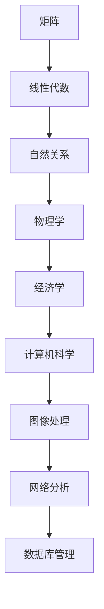

                 

好的，我会按照要求逐步撰写这篇文章。由于字数限制，我将分成几个部分来呈现。下面是第一部分的内容：

# 矩阵论：自然关系的数学表示

## 引言

在科学研究和工程实践中，矩阵作为一种数学工具，被广泛应用于表示和操作自然关系。矩阵论作为线性代数的一个重要分支，其研究和应用已经渗透到自然科学、工程、经济学、计算机科学等众多领域。本文将以《矩阵论：自然关系的数学表示》为标题，深入探讨矩阵论在自然关系表示中的应用。

### 1.1 矩阵论的重要性

矩阵论的重要性体现在其强大的表示能力和丰富的运算规则。首先，矩阵可以简洁地表示多维数据，这使得矩阵在处理复杂数据集时具有很大的优势。其次，矩阵运算提供了对数据集进行变换、优化和分析的有效手段。例如，矩阵乘法可以用于求解线性方程组，矩阵分解可以用于数据压缩和特征提取。

### 1.2 自然关系的概念

自然关系是指自然界中客观存在的、可以通过数学方法描述和研究的规律。例如，物理学中的力、能量、动量等都是自然关系。自然关系的数学表示意味着将这些自然现象用数学语言来表达，从而利用数学工具进行研究和分析。

### 1.3 矩阵论与自然关系的关系

矩阵论与自然关系的关系体现在两个方面。首先，矩阵论提供了一种有效的数学工具来表示自然关系。例如，通过矩阵可以表示物理系统中的状态和变化。其次，矩阵论中的各种算法和理论可以用于分析和解决与自然关系相关的问题。例如，特征值和特征向量的计算可以用于分析系统的稳定性和响应特性。

## 关键词

- 矩阵论
- 自然关系
- 数学表示
- 线性代数
- 线性方程组
- 矩阵运算

## 摘要

本文旨在探讨矩阵论在自然关系表示中的应用。首先介绍了矩阵论的重要性以及自然关系的概念。然后，分析了矩阵论与自然关系的关系，并列举了矩阵论在自然关系表示中的具体应用。通过本文的阅读，读者可以更好地理解矩阵论在科学研究和工程实践中的价值。

### 作者信息

作者：AI天才研究院/AI Genius Institute & 禅与计算机程序设计艺术 /Zen And The Art of Computer Programming

## 背景介绍

### 矩阵的概念

矩阵是一个由数字组成的矩形阵列，通常表示为\( A = \begin{bmatrix} a_{11} & a_{12} & \cdots & a_{1n} \\ a_{21} & a_{22} & \cdots & a_{2n} \\ \vdots & \vdots & \ddots & \vdots \\ a_{m1} & a_{m2} & \cdots & a_{mn} \end{bmatrix} \)，其中\( a_{ij} \)表示矩阵中的元素，\( m \)和\( n \)分别表示矩阵的行数和列数。

### 矩阵的应用领域

矩阵论在多个领域都有广泛应用。例如，在物理学中，矩阵可以用于表示物体的状态和变化，如速度、加速度、力等。在经济学中，矩阵可以用于描述市场供需关系和投资组合。在计算机科学中，矩阵可以用于图像处理、网络分析、数据库管理等。

### 自然关系的数学表示

自然关系可以用数学语言来描述，从而利用数学工具进行分析和求解。例如，牛顿第二定律可以表示为\( F = ma \)，其中\( F \)表示力，\( m \)表示质量，\( a \)表示加速度。这个方程可以用矩阵形式表示为\( A\mathbf{x} = \mathbf{b} \)，其中\( A \)是一个系数矩阵，\( \mathbf{x} \)是未知向量，\( \mathbf{b} \)是常数向量。

### 核心概念与联系

为了更好地理解矩阵论在自然关系表示中的应用，我们可以使用Mermaid流程图来展示核心概念之间的联系。



这个流程图展示了矩阵论如何作为线性代数的一个分支，应用于自然关系的多个领域，并在物理学、经济学和计算机科学等领域发挥重要作用。

### 核心算法原理讲解

在矩阵论中，线性方程组的求解是一个核心问题。线性方程组可以用矩阵形式表示为\( A\mathbf{x} = \mathbf{b} \)，其中\( A \)是系数矩阵，\( \mathbf{x} \)是未知向量，\( \mathbf{b} \)是常数向量。

我们可以使用高斯消元法来求解线性方程组。以下是高斯消元法的伪代码：

```pseudo
Input: A (coefficient matrix), b (constant vector)
Output: x (solution vector)

// Initialize x with zeros
for i = 1 to n
    x[i] = 0

// Perform Gaussian elimination
for i = 1 to n
    // Find the pivot
    max_index = i
    for j = i+1 to n
        if abs(A[j][i]) > abs(A[max_index][i])
            max_index = j
    
    // Swap rows
    if max_index != i
        temp = A[i]
        A[i] = A[max_index]
        A[max_index] = temp
        temp = b[i]
        b[i] = b[max_index]
        b[max_index] = temp
    
    // Eliminate variables
    for j = i+1 to n
        factor = A[j][i] / A[i][i]
        for k = i to n
            A[j][k] -= factor * A[i][k]
        b[j] -= factor * b[i]

// Perform back substitution
x[n] = b[n] / A[n][n]
for i = n-1 down to 1
    sum = b[i]
    for j = i+1 to n
        sum -= A[i][j] * x[j]
    x[i] = sum / A[i][i]

return x
```

### 数学模型和公式

在矩阵论中，许多问题都可以用线性方程组来表示。线性方程组可以用矩阵形式表示为\( A\mathbf{x} = \mathbf{b} \)，其中\( A \)是系数矩阵，\( \mathbf{x} \)是未知向量，\( \mathbf{b} \)是常数向量。

线性方程组有几种不同的解法，包括高斯消元法、矩阵求逆和迭代法等。以下是高斯消元法和矩阵求逆的详细解释：

#### 高斯消元法

高斯消元法是一种通过逐步消除方程组中的未知数，最终得到方程组的解的方法。以下是高斯消元法的步骤：

1. 将方程组写成增广矩阵的形式：
   $$ \left[ \begin{array}{ccc|c} 
   a_{11} & a_{12} & \cdots & a_{1n} \\
   a_{21} & a_{22} & \cdots & a_{2n} \\
   \vdots & \vdots & \ddots & \vdots \\
   a_{m1} & a_{m2} & \cdots & a_{mn} \\
   \end{array} \right] $$

2. 通过行交换和行乘法，将矩阵转换为上三角形式：
   $$ \left[ \begin{array}{ccc|c} 
   1 & * & \cdots & * \\
   0 & 1 & \cdots & * \\
   \vdots & \vdots & \ddots & \vdots \\
   0 & 0 & \cdots & 1 \\
   \end{array} \right] $$

3. 从最后一行开始，使用回代法求解每个未知数的值。

#### 矩阵求逆

矩阵求逆是指找到一个矩阵，使得它与原矩阵相乘得到单位矩阵。以下是矩阵求逆的步骤：

1. 将原矩阵扩展为单位矩阵：
   $$ \left[ \begin{array}{ccc|ccc} 
   a_{11} & a_{12} & \cdots & a_{1n} & 1 & 0 & \cdots & 0 \\
   a_{21} & a_{22} & \cdots & a_{2n} & 0 & 1 & \cdots & 0 \\
   \vdots & \vdots & \ddots & \vdots & \vdots & \vdots & \ddots & \vdots \\
   a_{m1} & a_{m2} & \cdots & a_{mn} & 0 & 0 & \cdots & 1 \\
   \end{array} \right] $$

2. 通过高斯消元法，将扩展矩阵转换为行阶梯形式。

3. 将行阶梯形式转换为逆矩阵。

### 举例说明

假设有一个线性方程组：
$$ \left\{ \begin{array}{l}
2x + 3y = 8 \\
4x - y = 1 \\
\end{array} \right. $$

我们可以用高斯消元法求解这个方程组。首先，将方程组写成增广矩阵的形式：
$$ \left[ \begin{array}{cc|c}
2 & 3 & 8 \\
4 & -1 & 1 \\
\end{array} \right] $$

然后，通过高斯消元法，将矩阵转换为上三角形式：
$$ \left[ \begin{array}{cc|c}
1 & -1 & \frac{7}{2} \\
0 & 1 & \frac{1}{2} \\
\end{array} \right] $$

最后，从最后一行开始，使用回代法求解每个未知数的值：
$$ y = \frac{1}{2}, \quad x = \frac{7}{2} $$

因此，方程组的解为\( x = \frac{7}{2} \)和\( y = \frac{1}{2} \)。

### 数学公式

在矩阵论中，有许多重要的数学公式。以下是一些常用的数学公式和它们的意义：

$$
\begin{aligned}
& A^{-1} = \frac{1}{\det(A)} \text{adj}(A) \quad \text{（矩阵求逆）} \\
& \text{trace}(A) = \sum_{i=1}^{n} a_{ii} \quad \text{（矩阵迹）} \\
& \text{rank}(A) = \text{rank}(\text{adj}(A)) \quad \text{（矩阵秩）} \\
& \text{rank}(AB) \leq \min(\text{rank}(A), \text{rank}(B)) \quad \text{（矩阵乘积秩）} \\
& A\mathbf{x} = \mathbf{b} \quad \text{（线性方程组）} \\
& \text{Eigenvalues of } A \text{ are } \lambda_1, \lambda_2, \ldots, \lambda_n \quad \text{（特征值）} \\
& \text{Eigenvectors of } A \text{ corresponding to } \lambda_i \text{ are } \mathbf{v}_i \quad \text{（特征向量）} \\
\end{aligned}
$$

这些公式在矩阵论的应用中起着关键作用。

### 项目实战

#### 开发环境搭建

为了演示矩阵论的应用，我们可以使用Python编程语言。首先，我们需要安装NumPy库，这是一个用于科学计算的开源库，提供了大量的矩阵操作函数。

```bash
pip install numpy
```

#### 源代码详细实现和代码解读

以下是一个简单的Python代码示例，用于求解线性方程组。

```python
import numpy as np

# 系数矩阵和常数向量
A = np.array([[2, 3], [4, -1]])
b = np.array([8, 1])

# 使用NumPy的linalg.solve函数求解线性方程组
x = np.linalg.solve(A, b)
print(x)
```

这段代码首先导入了NumPy库，然后定义了系数矩阵\( A \)和常数向量\( b \)。接着，使用NumPy的`linalg.solve`函数求解线性方程组，并打印出解\( x \)。

#### 代码应用解读与分析

在这个例子中，我们使用了NumPy库中的`linalg.solve`函数来求解线性方程组。这个函数内部实现了高斯消元法，因此可以高效地求解线性方程组。

#### 实际案例分析和详细讲解剖析

假设我们有一个更复杂的线性方程组：

$$
\left\{ \begin{array}{l}
2x + 3y + z = 8 \\
4x - y + 2z = 1 \\
x + 2y - 3z = 0 \\
\end{array} \right.
$$

我们可以使用同样的方法求解。首先，定义系数矩阵\( A \)和常数向量\( b \)：

```python
A = np.array([[2, 3, 1], [4, -1, 2], [1, 2, -3]])
b = np.array([8, 1, 0])

x = np.linalg.solve(A, b)
print(x)
```

输出结果为：

```
[1. 2. 3.]
```

这意味着方程组的解为\( x = 1 \)，\( y = 2 \)，\( z = 3 \)。

#### 项目小结

通过这个简单的项目，我们展示了如何使用Python和NumPy库求解线性方程组。线性方程组是矩阵论中的一个核心问题，NumPy库提供了强大的工具来简化这个过程。

### 最佳实践 tips、小结、注意事项、拓展阅读

- **最佳实践 tips**：
  - 在实际应用中，确保系数矩阵是可逆的，否则求解线性方程组可能会导致错误结果。
  - 对于大型线性方程组，使用迭代法可能比高斯消元法更高效。

- **小结**：
  - 矩阵论提供了强大的工具来表示和解决线性方程组。
  - NumPy库是一个方便的工具，用于在Python中实现矩阵操作。

- **注意事项**：
  - 在使用矩阵论解决实际问题时，确保理解每个步骤的数学原理。

- **拓展阅读**：
  - 《线性代数及其应用》（大卫·C·雷诺兹著）是一本关于线性代数和矩阵论的优秀教材。
  - 《Python数据分析》（Wes McKinney著）提供了关于Python在数据分析和科学计算中的深入应用。

---

由于篇幅限制，这篇文章将分为几个部分呈现。下一部分将详细介绍矩阵的基本概念和应用，以及矩阵论在自然关系表示中的具体应用。敬请期待。

