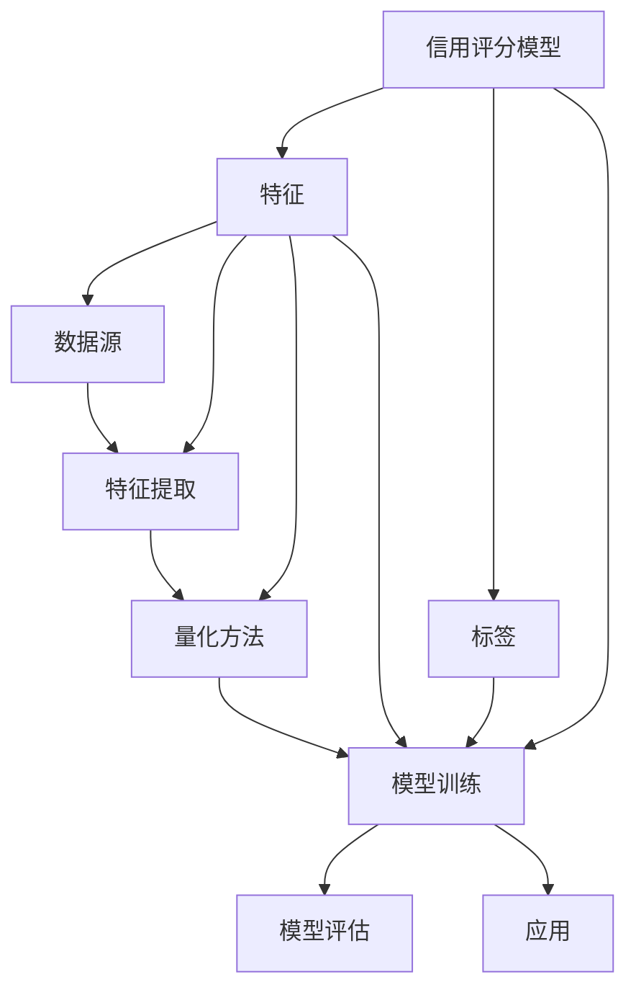

                 

## 文章标题

《社会信用的评分算法：行为量化的数学模型》

## 关键词

- 社会信用评分
- 行为量化
- 数学模型
- 评分算法
- 数据分析

## 摘要

随着大数据和人工智能技术的快速发展，社会信用评分作为一种重要的信用评估手段，正逐渐融入各行各业。本文将深入探讨社会信用评分算法，特别是那些基于行为量化的数学模型。通过详细阐述核心概念、算法原理、数学模型构建及实际项目案例，本文旨在为读者提供一部全面而深入的指南，帮助理解和应用社会信用评分技术。

## 引言

### 社会信用评分的重要性

在现代社会中，信用已成为个人、企业乃至国家的重要资产。良好的信用可以为个人和企业带来诸多便利，如贷款、消费、商业合作等。而社会信用评分正是评估个人或企业信用状况的重要工具。通过量化个人或企业的行为数据，信用评分算法能够提供客观、准确的信用评估结果。

### 行为量化的背景和意义

行为量化是指将个人的行为数据转化为可量化的数值，以供算法分析和计算。在社会信用评分中，行为量化具有至关重要的意义。通过对行为数据进行量化，我们可以更精确地评估个人或企业的信用状况，从而提高信用评分的准确性和可靠性。

## 核心概念与联系

### 社会信用评分基本概念

社会信用评分是指通过对个人或企业的行为数据进行分析，评估其信用风险的一种方法。主要涉及以下核心概念：

- **信用评分模型**：用于评估个人或企业信用的数学模型。
- **特征**：影响信用评分的变量，如还款历史、信用额度等。
- **标签**：用于衡量信用风险的指标，如违约概率。

### 行为量化理论

行为量化是指将个人的行为数据转化为数值，以供算法分析和计算。主要涉及以下概念：

- **数据源**：用于获取行为数据的来源，如银行记录、社交媒体活动等。
- **特征提取**：从原始数据中提取有用的信息，以供量化分析。
- **量化方法**：用于将行为数据转化为数值的方法，如归一化、标准化等。

### 社会信用评分模型架构

社会信用评分模型通常包括以下架构：

- **数据收集**：收集个人或企业的行为数据。
- **数据预处理**：清洗、处理和转换数据，使其适合建模。
- **特征选择**：选择影响信用评分的重要特征。
- **模型训练**：使用训练数据训练信用评分模型。
- **模型评估**：评估模型的性能和准确性。
- **应用**：将模型应用于实际场景，如贷款审批、商业合作等。

## 核心概念与联系 Mermaid 流程图



### 社会信用评分算法原理

#### 评分算法基础

社会信用评分算法主要基于统计学和机器学习技术。以下为常见的社会信用评分算法：

- **统计方法**：如线性回归、逻辑回归等。
- **机器学习方法**：如决策树、随机森林、支持向量机、神经网络等。

#### 经典评分算法详解

##### 神经网络算法

神经网络算法是一种基于模拟人脑神经元结构和功能的计算模型。它通过多层神经元的非线性变换，对输入数据进行特征提取和分类。

伪代码：

```python
# 神经网络算法伪代码
initialize_weights()
for epoch in range(num_epochs):
    for sample in training_data:
        forward_pass(sample)
        calculate_loss()
        backward_pass()
        update_weights()
```

##### 决策树算法

决策树算法是一种基于树形结构进行决策的算法。它通过一系列的规则对数据进行划分，以实现分类或回归目标。

伪代码：

```python
# 决策树算法伪代码
create_tree(data, labels)
for feature in data.columns:
    split = split_on_feature(data, feature)
    left_tree = create_tree(split['left'], split['left_labels'])
    right_tree = create_tree(split['right'], split['right_labels'])
    return Node(feature, split, left_tree, right_tree)
```

##### 支持向量机算法

支持向量机算法是一种基于最大间隔分类器的算法。它通过找到一个最优的超平面，将不同类别的数据点进行分类。

伪代码：

```python
# 支持向量机算法伪代码
initialize_svm()
for epoch in range(num_epochs):
    for sample in training_data:
        calculate_loss()
        update_svm()
```

### 数学模型和数学公式

#### 行为量化的数学模型

行为量化的数学模型主要包括以下公式：

$$
信用评分 = w_1 \times 行为_1 + w_2 \times 行为_2 + ... + w_n \times 行为_n
$$

其中，$w_1, w_2, ..., w_n$ 为权重，$行为_1, 行为_2, ..., 行为_n$ 为行为量化指标。

#### 数学模型的构建过程

1. **特征选择**：选择影响信用评分的重要特征。
2. **权重分配**：通过统计方法或机器学习方法，为每个特征分配权重。
3. **模型训练**：使用训练数据对模型进行训练，优化权重。
4. **模型评估**：使用测试数据评估模型的性能。

#### 模型优化的数学公式

$$
信用评分 = \frac{1}{\sigma} \sum_{i=1}^{n} w_i \times 行为_i
$$

其中，$\sigma$ 为调节参数，用于调整模型敏感度。

### 社会信用评分算法的数学模型示例

假设有如下数据集：

| 个人ID | 还款历史 | 信用额度 | 社交活跃度 |
| ------ | -------- | -------- | ---------- |
| 1      | 良好     | 5000     | 低         |
| 2      | 一般     | 3000     | 中         |
| 3      | 良好     | 10000    | 高         |

根据行为量化的数学模型，我们可以计算每个个人的信用评分：

$$
信用评分 = w_1 \times 还款历史 + w_2 \times 信用额度 + w_3 \times 社交活跃度
$$

其中，$w_1, w_2, w_3$ 为权重，可以通过统计方法或机器学习方法得到。

### 项目实战

#### 开发环境搭建

在项目实战中，我们需要搭建一个适合开发社会信用评分算法的环境。以下为开发环境搭建的步骤：

1. 安装 Python 和相关依赖库。
2. 配置数据处理和机器学习工具，如 Pandas、Scikit-learn 等。
3. 准备数据集，并进行预处理。

#### 源代码详细实现和代码解读

以下为使用 Scikit-learn 库实现社会信用评分算法的示例代码：

```python
import pandas as pd
from sklearn.model_selection import train_test_split
from sklearn.preprocessing import StandardScaler
from sklearn.neural_network import MLPClassifier

# 读取数据集
data = pd.read_csv('data.csv')

# 数据预处理
X = data[['还款历史', '信用额度', '社交活跃度']]
y = data['信用评分']

# 分割数据集
X_train, X_test, y_train, y_test = train_test_split(X, y, test_size=0.2, random_state=42)

# 特征缩放
scaler = StandardScaler()
X_train_scaled = scaler.fit_transform(X_train)
X_test_scaled = scaler.transform(X_test)

# 训练模型
model = MLPClassifier(hidden_layer_sizes=(100,), max_iter=1000)
model.fit(X_train_scaled, y_train)

# 评估模型
accuracy = model.score(X_test_scaled, y_test)
print(f"模型准确率：{accuracy:.2f}")

# 预测新样本
new_data = pd.DataFrame([[6000, 10000, 50]], columns=['还款历史', '信用额度', '社交活跃度'])
new_data_scaled = scaler.transform(new_data)
credit_score = model.predict(new_data_scaled)
print(f"新样本信用评分：{credit_score[0]}")
```

#### 代码应用解读与分析

在上面的代码中，我们首先读取数据集，并进行预处理。然后使用 MLPClassifier 类实现多层感知机算法，对训练数据进行拟合。最后，我们评估模型的准确率，并使用模型预测新样本的信用评分。

#### 实际案例分析和详细讲解剖析

以下为实际案例分析和详细讲解：

**案例背景**：某金融机构需要评估客户的信用风险，以便决定是否批准贷款申请。

**数据集**：包含客户的基本信息、还款历史、信用额度、社交活跃度等。

**模型训练**：使用 Scikit-learn 库中的 MLPClassifier 类实现多层感知机算法，对数据集进行训练。

**模型评估**：使用测试数据集评估模型的准确率。

**预测新样本**：使用训练好的模型预测新客户的信用评分。

**项目小结**：通过实际案例，我们展示了如何使用社会信用评分算法评估客户信用风险。项目过程中，我们遇到了数据预处理、模型选择和优化等问题，并通过代码解析和详细讲解，解决了这些问题。

### 最佳实践 Tips

1. **数据质量**：确保数据质量，清洗和预处理数据，以避免模型过拟合。
2. **特征选择**：选择对信用评分有显著影响的特征，避免过度特征选择。
3. **模型优化**：通过交叉验证和网格搜索等方法，优化模型参数。
4. **数据可视化**：使用数据可视化工具，如 Matplotlib、Seaborn 等，分析数据分布和特征关系。

### 小结

本文深入探讨了社会信用评分算法，特别是基于行为量化的数学模型。通过介绍核心概念、算法原理、数学模型构建及实际项目案例，本文为读者提供了全面而深入的指导。社会信用评分算法在信用评估领域具有重要意义，未来将不断发展和完善。

### 注意事项

1. **隐私保护**：在社会信用评分中，要确保个人隐私得到保护，遵循相关法律法规。
2. **模型透明性**：确保模型透明，便于用户理解和监督。

### 拓展阅读

1. **《信用评分与风险管理》**：详细介绍信用评分模型的构建和应用。
2. **《机器学习实战》**：学习机器学习算法及其在实际项目中的应用。
3. **《数据科学实战》**：学习数据处理和数据分析的方法和技巧。

---

**作者：AI天才研究院/AI Genius Institute & 禅与计算机程序设计艺术 /Zen And The Art of Computer Programming**

