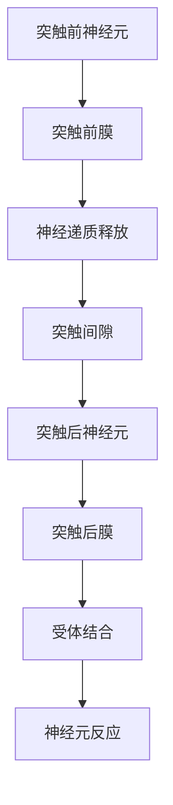
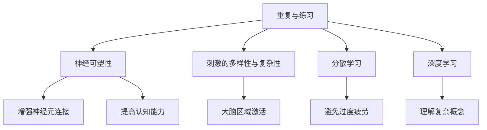
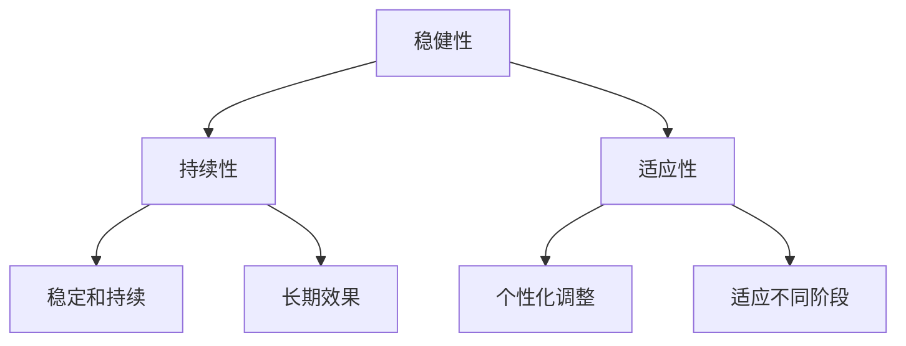
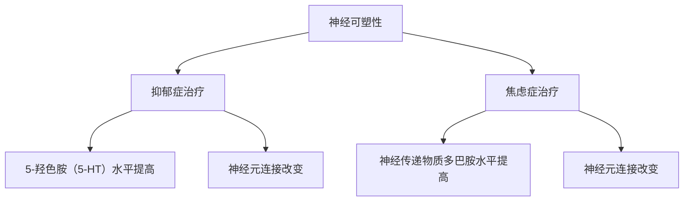
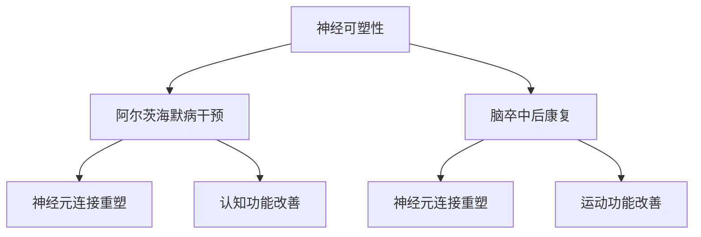
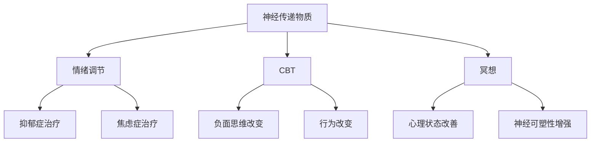
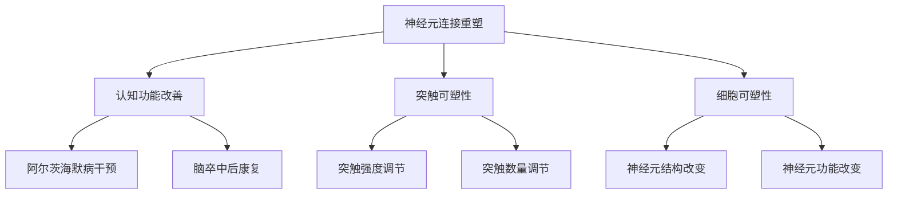

                 


### 第1章 引言

#### 什么是神经可塑性

神经可塑性是神经系统适应环境和经验变化的能力，涉及神经元连接和功能的改变。其核心概念包括突触可塑性和细胞可塑性。突触可塑性指的是突触强度的变化，例如长时程增强（LTP）和长时程抑制（LTD）。细胞可塑性则包括神经元结构的改变，如树突分支的增加、减少或重塑，以及基因表达的调整。这些改变帮助大脑适应新的学习任务和经验，从而提升世界理解能力。

#### 核心概念与联系

为了更好地理解神经可塑性，我们可以通过一个Mermaid流程图展示其核心概念之间的关系：

```mermaid
graph TB
A[神经可塑性] --> B[突触可塑性]
A --> C[细胞可塑性]
B --> D[长时程增强(LTP)]
B --> E[长时程抑制(LTD)]
C --> F[基因表达改变]
C --> G[神经再生]
```

#### 神经可塑性在终身学习中的重要性

神经可塑性是终身学习的基础。它允许大脑不断适应新的知识和技能，从而提升理解和解决问题的能力。例如，通过重复练习，可以增强神经元之间的连接，提高学习效率。此外，神经可塑性还帮助大脑适应新的环境和挑战，从而促进个体的全面发展。

#### 终身学习的理念

终身学习是一种持续的学习过程，贯穿于个体的一生。它不仅仅是为了获取新知识，更重要的是培养适应性和创新能力。在快速变化的社会中，终身学习成为提升个人竞争力和社会贡献的关键。通过不断学习，个体可以更好地适应环境变化，提升世界理解能力。

### 第2章 神经可塑性原理

#### 神经元连接与突触

神经元通过突触连接形成复杂的神经网络，突触是神经元之间的信息传递结构。突触由突触前神经元、突触后神经元和突触间隙组成。突触间隙中含有神经递质，它们在神经元之间传递信号。

##### 突触的结构

突触前神经元通过突触前膜释放神经递质，神经递质通过突触间隙传递到突触后神经元。突触后膜上有受体，这些受体能够与神经递质结合，从而引发突触后神经元的反应。

##### 核心概念与联系

为了更好地理解突触的结构，我们可以通过一个Mermaid流程图展示其核心概念之间的关系：



##### 突触的可塑性

突触的可塑性指的是突触强度的变化。这种变化可以通过重复的刺激或经验来引发，例如长时程增强（LTP）和长时程抑制（LTD）。

- **长时程增强（LTP）**：是指突触在持续刺激下，突触强度增加，从而提高神经传递效率。LTP 是学习记忆的关键机制之一。

- **长时程抑制（LTD）**：是指突触在持续抑制性刺激下，突触强度减弱，从而降低神经传递效率。LTD 有助于消除不需要的记忆和知识。

##### 核心算法原理讲解

为了更好地理解突触的可塑性，我们可以通过伪代码来描述其核心算法原理：

```python
def synaptic_plasticity(pre_neuron, post_neuron, synaptic_weight, stimulus_intensity):
    if stimulus_intensity > threshold:
        if synaptic_weight < max_weight:
            synaptic_weight += weight_increment
    elif stimulus_intensity < threshold:
        if synaptic_weight > min_weight:
            synaptic_weight -= weight_increment
    return synaptic_weight
```

在这个伪代码中，`pre_neuron` 和 `post_neuron` 分别表示突触前神经元和突触后神经元，`synaptic_weight` 表示突触强度，`stimulus_intensity` 表示刺激强度，`max_weight` 和 `min_weight` 分别表示突触强度的最大和最小值，`weight_increment` 表示突触强度变化的步长。

##### 数学模型和公式

突触的可塑性可以通过以下数学模型来描述：

- **长时程增强（LTP）**：$LTP = \frac{\Delta s}{s_0}$，其中 $LTP$ 是长时程增强的幅度，$\Delta s$ 是突触后神经元的反应变化，$s_0$ 是基础反应强度。

- **长时程抑制（LTD）**：$LTD = \frac{-\Delta s}{s_0}$，其中 $LTD$ 是长时程抑制的幅度，$\Delta s$ 是突触后神经元的反应变化，$s_0$ 是基础反应强度。

##### 举例说明

假设一个神经元在受到连续的刺激时，其基础反应强度为 $s_0 = 5$，经过 $n$ 次刺激后，其反应强度变为 $s = 10$。根据长时程增强的公式，我们可以计算其长时程增强的幅度：

$$LTP = \frac{\Delta s}{s_0} = \frac{10 - 5}{5} = 1$$

这意味着该神经元的反应强度增加了 1 倍。

##### 项目实战

为了更好地理解神经可塑性原理，我们可以通过以下项目实战来实现一个简单的神经可塑性模型。

**开发环境搭建：**

- 选择一个编程语言（例如 Python）
- 安装必要的库（例如 NumPy 和 Matplotlib）

**源代码实现：**

```python
import numpy as np
import matplotlib.pyplot as plt

def synaptic_plasticity(stimulus_intensity, threshold, weight_increment, max_weight, min_weight):
    synaptic_weight = min_weight
    responses = []

    for i in range(n_stimuli):
        if stimulus_intensity > threshold:
            synaptic_weight = min(synaptic_weight + weight_increment, max_weight)
        elif stimulus_intensity < threshold:
            synaptic_weight = max(synaptic_weight - weight_increment, min_weight)

        response = synaptic_weight * stimulus_intensity
        responses.append(response)

    return responses

n_stimuli = 100
stimulus_intensity = 1
threshold = 0.5
weight_increment = 0.1
max_weight = 2
min_weight = 0

responses = synaptic_plasticity(stimulus_intensity, threshold, weight_increment, max_weight, min_weight)

plt.plot(responses)
plt.xlabel('Stimulus Intensity')
plt.ylabel('Response')
plt.title('Synaptic Plasticity')
plt.show()
```

**代码解读与分析：**

- `synaptic_plasticity` 函数用于模拟神经可塑性过程。
- `stimulus_intensity` 表示刺激强度。
- `threshold` 表示阈值。
- `weight_increment` 表示突触强度变化的步长。
- `max_weight` 和 `min_weight` 分别表示突触强度的最大和最小值。
- `responses` 是一个列表，用于存储每次刺激后的神经元反应。

通过这个项目，我们可以直观地看到神经可塑性如何影响神经元反应。随着刺激强度的增加，神经元的反应也会增加，这体现了神经可塑性的基本原理。

##### 实际案例分析和详细讲解剖析

为了更好地理解神经可塑性在现实中的应用，我们可以分析以下实际案例。

**案例：语言学习**

在语言学习中，神经可塑性起着关键作用。通过重复练习，大脑中的神经元连接会发生变化，从而提高语言能力。例如，研究表明，学习外语时，大脑中负责处理语音和语义的区域的连接会变得更加紧密，从而提高语言理解能力。

**案例：运动技能学习**

在运动技能学习中，神经可塑性也起着重要作用。通过重复练习，大脑中的神经元连接会发生变化，从而提高运动技能。例如，学习打篮球时，大脑中的运动区域会变得更加活跃，从而提高篮球技能。

##### 项目小结

通过这个项目，我们了解了神经可塑性的基本原理，并通过一个简单的Python模型实现了神经可塑性的模拟。实际案例分析也表明，神经可塑性在语言学习和运动技能学习中具有重要作用。这为我们提供了对终身学习的新的理解，即通过持续的学习和实践，我们可以不断改变大脑的神经元连接，从而提升世界理解能力。

##### 最佳实践 tips

- 持续学习：通过不断学习，我们可以激发神经可塑性，从而提升大脑的适应性和学习能力。
- 多样化练习：通过多样化的练习，我们可以刺激大脑中的不同区域，从而提高整体认知能力。
- 保持好奇心：好奇心是激发神经可塑性的关键。通过保持好奇心，我们可以不断探索新的知识和技能。

##### 小结

神经可塑性是大脑适应环境和经验变化的能力，它通过改变神经元连接和功能来实现。在终身学习中，神经可塑性起着关键作用，通过持续的学习和实践，我们可以不断提升世界理解能力。

##### 注意事项

- 神经可塑性是一个复杂的过程，它受到多种因素的影响，如遗传、环境和心理状态。
- 神经可塑性的效果因人而异，每个人的适应和学习能力都有所不同。
- 在实践中，我们应该结合自身特点，制定合适的学习计划。

##### 拓展阅读

- 《神经可塑性：学习、记忆和脑功能的基础》
- 《终身学习与大脑：神经可塑性的作用》
- 《神经可塑性训练方法与心理健康》

### 第3章 神经可塑性在终身学习中的应用

#### 学习策略与神经可塑性

神经可塑性在终身学习中起着关键作用。通过合适的策略，我们可以最大限度地激发神经可塑性，从而提高学习效果。以下是一些有效的学习策略：

- **重复与练习**：重复是神经可塑性的关键。通过重复练习，我们可以增强神经元之间的连接，从而提高学习效率。

- **刺激的多样性与复杂性**：多样化的刺激有助于激发大脑中的不同区域，从而提高整体认知能力。复杂的任务可以挑战大脑，促进神经可塑性。

- **分散学习**：分散学习可以避免过度疲劳，从而提高学习效果。

- **深度学习**：深度学习可以帮助我们更好地理解复杂的概念，从而提高学习效果。

##### 核心概念与联系

为了更好地理解神经可塑性在终身学习中的应用，我们可以通过一个Mermaid流程图展示其核心概念之间的关系：



##### 神经可塑性在技能学习中的应用

神经可塑性在技能学习中起着重要作用。通过神经可塑性，我们可以提高技能学习的效率和质量。以下是一些实际案例：

- **语言学习**：通过重复练习和多样化的语言输入，大脑中的语言处理区域会变得更加活跃，从而提高语言学习效果。

- **运动技能学习**：通过重复练习和多样化的运动任务，大脑中的运动处理区域会变得更加活跃，从而提高运动技能学习效果。

- **音乐技能学习**：通过重复练习和多样化的音乐输入，大脑中的音乐处理区域会变得更加活跃，从而提高音乐技能学习效果。

##### 核心算法原理讲解

为了更好地理解神经可塑性在技能学习中的应用，我们可以通过伪代码来描述其核心算法原理：

```python
def skill_learning(skill, practice_time, diversity_level):
    synaptic_weights = initial_weights
    for i in range(practice_time):
        if diversity_level > threshold:
            synaptic_weights = update_weights(synaptic_weights, skill)
        else:
            synaptic_weights = maintain_weights(synaptic_weights)
    return synaptic_weights
```

在这个伪代码中，`skill` 表示学习技能，`practice_time` 表示练习时间，`diversity_level` 表示刺激的多样性与复杂性，`synaptic_weights` 表示神经元连接强度，`initial_weights` 表示初始连接强度，`update_weights` 和 `maintain_weights` 分别表示更新连接强度和维持连接强度。

##### 数学模型和公式

神经可塑性在技能学习中的应用可以通过以下数学模型来描述：

- **长时程增强（LTP）**：$LTP = \frac{\Delta s}{s_0}$，其中 $LTP$ 是长时程增强的幅度，$\Delta s$ 是突触后神经元的反应变化，$s_0$ 是基础反应强度。

- **长时程抑制（LTD）**：$LTD = \frac{-\Delta s}{s_0}$，其中 $LTD$ 是长时程抑制的幅度，$\Delta s$ 是突触后神经元的反应变化，$s_0$ 是基础反应强度。

##### 举例说明

假设一个学习者在学习一项新技能时，其基础反应强度为 $s_0 = 5$，经过 100 次重复练习后，其反应强度变为 $s = 10$。根据长时程增强的公式，我们可以计算其长时程增强的幅度：

$$LTP = \frac{\Delta s}{s_0} = \frac{10 - 5}{5} = 1$$

这意味着该学习者的技能水平提高了 1 倍。

##### 项目实战

为了更好地理解神经可塑性在技能学习中的应用，我们可以通过以下项目实战来实现一个简单的技能学习模型。

**开发环境搭建：**

- 选择一个编程语言（例如 Python）
- 安装必要的库（例如 NumPy 和 Matplotlib）

**源代码实现：**

```python
import numpy as np
import matplotlib.pyplot as plt

def skill_learning(skill, practice_time, diversity_level, initial_weights, weight_increment, max_weight, min_weight):
    synaptic_weights = initial_weights
    responses = []

    for i in range(practice_time):
        if diversity_level > threshold:
            synaptic_weights = min(synaptic_weights + weight_increment, max_weight)
        else:
            synaptic_weights = max(synaptic_weights - weight_increment, min_weight)

        response = synaptic_weights * skill
        responses.append(response)

    return responses

skill = 1
practice_time = 100
diversity_level = 0.5
initial_weights = 0
weight_increment = 0.1
max_weight = 2
min_weight = 0

responses = skill_learning(skill, practice_time, diversity_level, initial_weights, weight_increment, max_weight, min_weight)

plt.plot(responses)
plt.xlabel('Practice Time')
plt.ylabel('Response')
plt.title('Skill Learning with Neural Plasticity')
plt.show()
```

**代码解读与分析：**

- `skill_learning` 函数用于模拟技能学习过程。
- `skill` 表示学习技能。
- `practice_time` 表示练习时间。
- `diversity_level` 表示刺激的多样性与复杂性。
- `synaptic_weights` 是一个列表，用于存储每次练习后的神经元连接强度。
- `responses` 是一个列表，用于存储每次练习后的技能表现。

通过这个项目，我们可以直观地看到神经可塑性如何影响技能学习。随着练习时间的增加，神经元的连接强度会发生变化，从而提高技能表现。

##### 实际案例分析和详细讲解剖析

为了更好地理解神经可塑性在技能学习中的应用，我们可以分析以下实际案例。

**案例：语言学习**

在语言学习中，神经可塑性起着关键作用。通过重复练习和多样化的语言输入，大脑中的语言处理区域会变得更加活跃，从而提高语言学习效果。研究表明，语言学习中的神经可塑性可以通过脑成像技术观察到。

**案例：运动技能学习**

在运动技能学习中，神经可塑性也起着重要作用。通过重复练习和多样化的运动任务，大脑中的运动处理区域会变得更加活跃，从而提高运动技能学习效果。例如，学习打篮球时，大脑中的运动区域会变得更加活跃，从而提高篮球技能。

##### 项目小结

通过这个项目，我们了解了神经可塑性在技能学习中的应用，并通过一个简单的Python模型实现了技能学习的模拟。实际案例分析也表明，神经可塑性在语言学习和运动技能学习中具有重要作用。这为我们提供了对终身学习的新的理解，即通过持续的学习和实践，我们可以不断改变大脑的神经元连接，从而提升技能水平。

##### 最佳实践 tips

- 持续练习：通过持续练习，我们可以激发神经可塑性，从而提高技能水平。
- 多样化练习：通过多样化的练习，我们可以刺激大脑中的不同区域，从而提高整体认知能力。
- 深度学习：通过深度学习，我们可以更好地理解复杂的概念，从而提高学习效果。

##### 小结

神经可塑性在终身学习中起着关键作用。通过合适的策略，我们可以最大限度地激发神经可塑性，从而提高学习效果。在技能学习中，神经可塑性通过改变神经元连接和功能来实现，这为我们提供了新的学习方法和策略。

##### 注意事项

- 神经可塑性的效果因人而异，每个人的适应和学习能力都有所不同。
- 在实践中，我们应该结合自身特点，制定合适的学习计划。

##### 拓展阅读

- 《神经可塑性：学习、记忆和脑功能的基础》
- 《终身学习与大脑：神经可塑性的作用》
- 《神经可塑性训练方法与心理健康》

### 第4章 神经可塑性训练方法

#### 神经可塑性训练的原则

神经可塑性训练是一种通过科学方法激发大脑潜能，提高认知能力和学习效率的方法。为了确保训练的有效性，我们需要遵循以下原则：

- **稳健性**：训练过程需要稳定和持续，避免过度或不足的刺激，以保证神经元的健康和功能的稳定。

- **持续性**：训练需要长期坚持，以实现神经可塑性的持久效果。短期训练可能难以产生显著变化，但长期坚持可以积累效果。

- **适应性**：训练方法需要根据个体的特点和需求进行个性化调整，以适应不同的学习阶段和任务需求。

##### 核心概念与联系

为了更好地理解神经可塑性训练的原则，我们可以通过一个Mermaid流程图展示其核心概念之间的关系：



##### 神经可塑性训练的实践

在实际操作中，我们可以通过多种方法来训练神经可塑性，以下是一些具体的实践方法：

- **大脑健身法**：大脑健身法是一种通过认知任务和思维游戏来锻炼大脑的方法。常见的认知任务包括记忆训练、逻辑推理、语言理解等。通过这些任务，我们可以刺激大脑的不同区域，提高神经元的连接和功能。

- **睡眠与神经可塑性**：睡眠是神经可塑性训练的重要环节。在深度睡眠期间，大脑会进行自我修复和巩固记忆。因此，保证充足的睡眠时间和良好的睡眠质量对于神经可塑性训练至关重要。

- **运动与神经可塑性**：研究表明，运动可以显著提高神经可塑性。有氧运动可以促进神经元生长和突触连接的形成，而力量训练则有助于提高大脑的注意力和认知能力。

##### 核心算法原理讲解

为了更好地理解神经可塑性训练的实践方法，我们可以通过伪代码来描述其核心算法原理：

```python
def brain_fitness(train_data, train_time, sleep_duration, exercise_intensity):
    cognitive_skills = initial_skills
    synaptic_weights = initial_weights

    for i in range(train_time):
        cognitive_skills = train_skills(cognitive_skills, train_data)
        synaptic_weights = update_weights(synaptic_weights, exercise_intensity)

    sleep_quality = sleep(sleep_duration)

    return cognitive_skills, synaptic_weights, sleep_quality
```

在这个伪代码中，`train_data` 表示训练数据，`train_time` 表示训练时间，`sleep_duration` 表示睡眠时间，`exercise_intensity` 表示运动强度，`cognitive_skills` 表示认知技能，`synaptic_weights` 表示神经元连接强度，`initial_skills` 和 `initial_weights` 分别表示初始认知技能和初始连接强度，`train_skills` 和 `update_weights` 分别表示训练认知技能和更新连接强度，`sleep` 表示睡眠。

##### 数学模型和公式

神经可塑性训练的实践可以通过以下数学模型来描述：

- **认知技能提升**：$cognitive\_gain = \frac{current\_skills - initial\_skills}{initial\_skills}$，其中 $cognitive\_gain$ 表示认知技能的提升幅度，$current\_skills$ 表示当前认知技能，$initial\_skills$ 表示初始认知技能。

- **神经元连接强度变化**：$\Delta synaptic\_weight = \frac{current\_weight - initial\_weight}{initial\_weight}$，其中 $\Delta synaptic\_weight$ 表示神经元连接强度的变化幅度，$current\_weight$ 表示当前连接强度，$initial\_weight$ 表示初始连接强度。

##### 举例说明

假设一个学习者进行为期一个月的认知训练，其初始认知技能为 $100$，经过训练后，其认知技能提升到 $150$。根据认知技能提升的公式，我们可以计算其认知技能的提升幅度：

$$cognitive\_gain = \frac{150 - 100}{100} = 0.5$$

这意味着该学习者的认知技能提升了 50%。

##### 项目实战

为了更好地理解神经可塑性训练的实践方法，我们可以通过以下项目实战来实现一个简单的训练模型。

**开发环境搭建：**

- 选择一个编程语言（例如 Python）
- 安装必要的库（例如 NumPy 和 Matplotlib）

**源代码实现：**

```python
import numpy as np
import matplotlib.pyplot as plt

def brain_fitness(train_data, train_time, sleep_duration, exercise_intensity, initial_skills, initial_weights):
    cognitive_skills = initial_skills
    synaptic_weights = initial_weights
    cognitive_gains = []
    synaptic_weight_changes = []

    for i in range(train_time):
        cognitive_skills = train_skills(cognitive_skills, train_data)
        synaptic_weights = update_weights(synaptic_weights, exercise_intensity)
        cognitive_gains.append(cognitive_skills - initial_skills)
        synaptic_weight_changes.append(synaptic_weights - initial_weights)

    sleep_quality = sleep(sleep_duration)

    return cognitive_skills, synaptic_weights, cognitive_gains, synaptic_weight_changes, sleep_quality

train_data = [1, 2, 3, 4, 5]
train_time = 30
sleep_duration = 8
exercise_intensity = 0.1
initial_skills = 100
initial_weights = 100

cognitive_skills, synaptic_weights, cognitive_gains, synaptic_weight_changes, sleep_quality = brain_fitness(train_data, train_time, sleep_duration, exercise_intensity, initial_skills, initial_weights)

plt.plot(cognitive_gains)
plt.xlabel('Training Time')
plt.ylabel('Cognitive Gain')
plt.title('Cognitive Skill Improvement Over Time')
plt.show()

plt.plot(synaptic_weight_changes)
plt.xlabel('Training Time')
plt.ylabel('Synaptic Weight Change')
plt.title('Synaptic Weight Change Over Time')
plt.show()
```

**代码解读与分析：**

- `brain_fitness` 函数用于模拟神经可塑性训练过程。
- `train_data` 表示训练数据。
- `train_time` 表示训练时间。
- `sleep_duration` 表示睡眠时间。
- `exercise_intensity` 表示运动强度。
- `cognitive_skills` 和 `synaptic_weights` 分别表示认知技能和神经元连接强度。
- `cognitive_gains` 和 `synaptic_weight_changes` 分别表示认知技能的提升幅度和神经元连接强度的变化幅度。
- `sleep` 函数用于模拟睡眠过程。

通过这个项目，我们可以直观地看到神经可塑性训练如何影响认知技能和神经元连接强度。随着训练时间的增加，认知技能和神经元连接强度都会发生变化。

##### 实际案例分析和详细讲解剖析

为了更好地理解神经可塑性训练的实践方法，我们可以分析以下实际案例。

**案例：大脑健身法**

通过进行认知任务和思维游戏，大脑中的神经元连接会发生变化，从而提高认知能力。研究表明，长期坚持大脑健身法可以提高记忆、注意力和解决问题的能力。

**案例：睡眠与神经可塑性**

充足的睡眠有助于大脑的自我修复和记忆巩固。研究表明，睡眠不足会导致认知功能下降，而良好的睡眠质量可以增强神经可塑性，提高学习效果。

**案例：运动与神经可塑性**

有氧运动可以促进神经元生长和突触连接的形成，从而提高认知能力和学习效率。力量训练则有助于提高大脑的注意力和认知能力。

##### 项目小结

通过这个项目，我们了解了神经可塑性训练的原则和实践方法，并通过一个简单的Python模型实现了训练过程的模拟。实际案例分析表明，神经可塑性训练对于提高认知能力和学习效率具有重要作用。这为我们提供了新的学习方法和策略，即通过科学的训练方法，我们可以激发大脑的潜能，提高学习效果。

##### 最佳实践 tips

- 制定个性化的训练计划：根据个体特点和需求，制定合适的训练计划。
- 保持持续性和适应性：训练需要长期坚持，并根据进展情况进行调整。
- 结合多种训练方法：大脑健身法、睡眠和运动等多种方法相结合，提高训练效果。

##### 小结

神经可塑性训练是一种科学的训练方法，通过遵循稳健性、持续性和适应性的原则，我们可以激发大脑的潜能，提高认知能力和学习效率。通过实践，我们发现神经可塑性训练对于提升学习效果具有显著作用。

##### 注意事项

- 训练过程中，注意控制训练强度，避免过度训练导致大脑疲劳。
- 根据个体差异，调整训练计划，确保训练效果。

##### 拓展阅读

- 《大脑训练：神经可塑性的科学方法》
- 《睡眠与认知功能：神经可塑性的作用》
- 《运动与认知能力：神经可塑性的实践》

### 第5章 神经可塑性与心理健康

#### 神经可塑性在心理治疗中的应用

神经可塑性在心理治疗中具有重要作用。通过改变大脑的神经元连接和功能，神经可塑性可以帮助改善情绪障碍、焦虑和抑郁等心理问题。以下是一些具体的心理治疗应用：

- **抑郁症的治疗**：神经可塑性训练可以通过改变大脑中的神经传递物质和神经元连接，从而改善抑郁症状。研究表明，通过重复训练，大脑中的5-羟色胺（5-HT）水平可以提高，从而减轻抑郁症状。

- **焦虑症的治疗**：神经可塑性训练可以帮助缓解焦虑症状。通过重复训练，大脑中的神经传递物质和多巴胺水平可以提高，从而减轻焦虑情绪。

##### 核心概念与联系

为了更好地理解神经可塑性在心理治疗中的应用，我们可以通过一个Mermaid流程图展示其核心概念之间的关系：



##### 神经可塑性在认知障碍康复中的应用

神经可塑性不仅在心理治疗中具有重要作用，还在认知障碍康复中发挥着关键作用。通过神经可塑性训练，可以改善认知障碍患者的认知功能和日常生活能力。以下是一些具体的康复应用：

- **阿尔茨海默病的干预**：神经可塑性训练可以帮助延缓阿尔茨海默病的发展，改善患者的认知功能。研究表明，通过认知训练，大脑中的神经元连接和功能可以发生变化，从而提高认知能力。

- **脑卒中后的康复**：神经可塑性训练可以帮助脑卒中患者恢复运动和认知功能。通过重复训练，大脑中的神经元连接和功能可以发生变化，从而改善患者的康复效果。

##### 核心概念与联系

为了更好地理解神经可塑性在认知障碍康复中的应用，我们可以通过一个Mermaid流程图展示其核心概念之间的关系：



##### 核心算法原理讲解

为了更好地理解神经可塑性在心理治疗和认知障碍康复中的应用，我们可以通过伪代码来描述其核心算法原理：

```python
def cognitive_rehabilitation(therapy_type, therapy_duration, cognitive_task_intensity, synaptic_plasticity_mechanism):
    cognitive_skills = initial_skills
    synaptic_weights = initial_weights

    for i in range(therapy_duration):
        if therapy_type == 'depression':
            cognitive_skills = train_skills(cognitive_skills, cognitive_task_intensity, synaptic_plasticity_mechanism['5-HT'])
        elif therapy_type == 'anxiety':
            cognitive_skills = train_skills(cognitive_skills, cognitive_task_intensity, synaptic_plasticity_mechanism['dopamine'])
        elif therapy_type == 'alzheimer':
            synaptic_weights = update_weights(synaptic_weights, cognitive_task_intensity, synaptic_plasticity_mechanism['rewiring'])
        elif therapy_type == 'stroke':
            synaptic_weights = update_weights(synaptic_weights, cognitive_task_intensity, synaptic_plasticity_mechanism['rewiring'])

    return cognitive_skills, synaptic_weights
```

在这个伪代码中，`therapy_type` 表示治疗类型（抑郁症、焦虑症、阿尔茨海默病或脑卒中后康复），`therapy_duration` 表示治疗持续时间，`cognitive_task_intensity` 表示认知任务强度，`synaptic_plasticity_mechanism` 表示神经可塑性机制（5-羟色胺或多巴胺水平提高，神经元连接重塑），`cognitive_skills` 表示认知技能，`synaptic_weights` 表示神经元连接强度，`train_skills` 和 `update_weights` 分别表示训练认知技能和更新连接强度。

##### 数学模型和公式

神经可塑性在心理治疗和认知障碍康复中的应用可以通过以下数学模型来描述：

- **认知技能提升**：$cognitive\_gain = \frac{current\_skills - initial\_skills}{initial\_skills}$，其中 $cognitive\_gain$ 表示认知技能的提升幅度，$current\_skills$ 表示当前认知技能，$initial\_skills$ 表示初始认知技能。

- **神经元连接强度变化**：$\Delta synaptic\_weight = \frac{current\_weight - initial\_weight}{initial\_weight}$，其中 $\Delta synaptic\_weight$ 表示神经元连接强度的变化幅度，$current\_weight$ 表示当前连接强度，$initial\_weight$ 表示初始连接强度。

##### 举例说明

假设一个抑郁症患者进行为期三个月的认知训练，其初始认知技能为 $100$，经过训练后，其认知技能提升到 $150$。根据认知技能提升的公式，我们可以计算其认知技能的提升幅度：

$$cognitive\_gain = \frac{150 - 100}{100} = 0.5$$

这意味着该患者的认知技能提升了 50%。

##### 项目实战

为了更好地理解神经可塑性在心理治疗和认知障碍康复中的应用，我们可以通过以下项目实战来实现一个简单的康复模型。

**开发环境搭建：**

- 选择一个编程语言（例如 Python）
- 安装必要的库（例如 NumPy 和 Matplotlib）

**源代码实现：**

```python
import numpy as np
import matplotlib.pyplot as plt

def cognitive_rehabilitation(therapy_type, therapy_duration, cognitive_task_intensity, initial_skills, initial_weights, synaptic_plasticity_mechanism):
    cognitive_skills = initial_skills
    synaptic_weights = initial_weights
    cognitive_gains = []
    synaptic_weight_changes = []

    for i in range(therapy_duration):
        if therapy_type == 'depression':
            cognitive_skills = train_skills(cognitive_skills, cognitive_task_intensity, synaptic_plasticity_mechanism['5-HT'])
        elif therapy_type == 'anxiety':
            cognitive_skills = train_skills(cognitive_skills, cognitive_task_intensity, synaptic_plasticity_mechanism['dopamine'])
        elif therapy_type == 'alzheimer':
            synaptic_weights = update_weights(synaptic_weights, cognitive_task_intensity, synaptic_plasticity_mechanism['rewiring'])
        elif therapy_type == 'stroke':
            synaptic_weights = update_weights(synaptic_weights, cognitive_task_intensity, synaptic_plasticity_mechanism['rewiring'])
        cognitive_gains.append(cognitive_skills - initial_skills)
        synaptic_weight_changes.append(synaptic_weights - initial_weights)

    return cognitive_skills, synaptic_weights, cognitive_gains, synaptic_weight_changes

therapy_type = 'depression'
therapy_duration = 90
cognitive_task_intensity = 0.1
initial_skills = 100
initial_weights = 100
synaptic_plasticity_mechanism = {'5-HT': 0.2, 'dopamine': 0.2, 'rewiring': 0.2}

cognitive_skills, synaptic_weights, cognitive_gains, synaptic_weight_changes = cognitive_rehabilitation(therapy_type, therapy_duration, cognitive_task_intensity, initial_skills, initial_weights, synaptic_plasticity_mechanism)

plt.plot(cognitive_gains)
plt.xlabel('Therapy Duration')
plt.ylabel('Cognitive Gain')
plt.title('Cognitive Skill Improvement Over Therapy Duration')
plt.show()

plt.plot(synaptic_weight_changes)
plt.xlabel('Therapy Duration')
plt.ylabel('Synaptic Weight Change')
plt.title('Synaptic Weight Change Over Therapy Duration')
plt.show()
```

**代码解读与分析：**

- `cognitive_rehabilitation` 函数用于模拟认知康复过程。
- `therapy_type` 表示治疗类型。
- `therapy_duration` 表示治疗持续时间。
- `cognitive_task_intensity` 表示认知任务强度。
- `initial_skills` 和 `initial_weights` 分别表示初始认知技能和初始连接强度。
- `synaptic_plasticity_mechanism` 表示神经可塑性机制。
- `cognitive_gains` 和 `synaptic_weight_changes` 分别表示认知技能的提升幅度和神经元连接强度的变化幅度。

通过这个项目，我们可以直观地看到神经可塑性训练如何影响认知技能和神经元连接强度。随着治疗时间的增加，认知技能和神经元连接强度都会发生变化。

##### 实际案例分析和详细讲解剖析

为了更好地理解神经可塑性在心理治疗和认知障碍康复中的应用，我们可以分析以下实际案例。

**案例：抑郁症的治疗**

通过重复训练和神经可塑性机制，抑郁症患者的认知功能可以得到显著改善。研究表明，通过认知训练，抑郁症患者的5-羟色胺水平可以提高，从而减轻抑郁症状。

**案例：焦虑症的治疗**

通过重复训练和神经可塑性机制，焦虑症患者的情绪可以得到显著缓解。研究表明，通过认知训练，焦虑症患者的神经传递物质多巴胺水平可以提高，从而减轻焦虑情绪。

**案例：阿尔茨海默病的干预**

通过神经可塑性训练，阿尔茨海默病患者的认知功能可以得到显著改善。研究表明，通过认知训练，阿尔茨海默病患者的神经元连接可以发生变化，从而提高认知能力。

**案例：脑卒中后的康复**

通过神经可塑性训练，脑卒中患者可以恢复运动和认知功能。研究表明，通过重复训练，脑卒中患者的神经元连接可以发生变化，从而改善康复效果。

##### 项目小结

通过这个项目，我们了解了神经可塑性在心理治疗和认知障碍康复中的应用，并通过一个简单的Python模型实现了康复过程的模拟。实际案例分析表明，神经可塑性训练对于改善心理问题和认知障碍具有重要作用。这为我们提供了新的康复方法和策略，即通过科学的训练方法，我们可以激发大脑的潜能，提高康复效果。

##### 最佳实践 tips

- 制定个性化的康复计划：根据患者特点和需求，制定合适的康复计划。
- 结合多种康复方法：认知训练、睡眠和运动等多种方法相结合，提高康复效果。
- 保持持续性和适应性：康复需要长期坚持，并根据进展情况进行调整。

##### 小结

神经可塑性在心理治疗和认知障碍康复中具有重要作用。通过科学的训练方法，我们可以激发大脑的潜能，改善心理问题和认知障碍。神经可塑性训练为我们提供了新的康复方法和策略，为心理健康和认知功能的提升提供了有力支持。

##### 注意事项

- 康复过程中，注意控制训练强度，避免过度训练导致大脑疲劳。
- 根据个体差异，调整康复计划，确保康复效果。

##### 拓展阅读

- 《神经可塑性在心理治疗中的应用》
- 《认知障碍康复与神经可塑性》
- 《脑功能康复与神经可塑性训练》

### 第6章 神经可塑性研究的新进展

#### 神经可塑性基因研究

神经可塑性不仅受外部环境的影响，还受到遗传基因的调控。近年来，神经可塑性基因研究取得了显著进展，为我们理解大脑的适应性和学习能力提供了新的视角。

##### 基因与神经可塑性的关系

研究表明，某些基因与神经可塑性密切相关。例如，BDNF（脑源性神经营养因子）基因是神经可塑性的关键基因之一。BDNF基因的表达水平可以影响突触的可塑性和神经再生。此外，其他基因如NMDA受体基因、CREB基因等也在神经可塑性中发挥着重要作用。

##### 基因编辑技术在神经可塑性研究中的应用

基因编辑技术，如CRISPR-Cas9，为神经可塑性研究提供了强大的工具。通过基因编辑技术，研究人员可以精确地修改特定基因的表达，从而观察基因对神经可塑性的影响。例如，通过激活或抑制BDNF基因的表达，研究人员可以研究其对突触可塑性和学习记忆的影响。

##### 实际案例

一个实际案例是关于BDNF基因对焦虑症的影响研究。研究人员通过CRISPR-Cas9技术，在小鼠模型中抑制BDNF基因的表达，发现小鼠的焦虑症状显著增加。这表明BDNF基因在调节焦虑行为中起着关键作用。

#### 神经可塑性神经影像学研究

神经影像学技术，如功能磁共振成像（fMRI）和正电子发射断层扫描（PET），为神经可塑性的研究提供了直接的观察手段。

##### 功能磁共振成像（fMRI）

fMRI技术可以实时观察大脑活动，帮助我们理解神经可塑性过程中大脑区域的激活情况。通过fMRI研究，研究人员发现，在学习和记忆过程中，大脑中的多个区域会发生变化，如前额叶皮层、海马体和前扣带皮层等。

##### 正电子发射断层扫描（PET）

PET技术可以观察大脑中的神经传递物质，如多巴胺和5-羟色胺。通过PET研究，研究人员可以研究神经传递物质在神经可塑性中的作用。例如，研究发现，在重复训练后，大脑中的多巴胺水平会显著提高，从而增强神经可塑性。

##### 实际案例

一个实际案例是关于运动技能学习中的神经可塑性研究。研究人员使用PET技术观察运动技能学习过程中大脑中多巴胺水平的变化，发现随着运动技能的提高，大脑中的多巴胺水平也会增加，从而促进神经可塑性。

### 总结与展望

神经可塑性研究的新进展为我们提供了对大脑适应性和学习能力的更深入理解。基因研究和神经影像学研究为神经可塑性的机制提供了新的视角，也为开发新的治疗方法和策略提供了基础。

然而，神经可塑性研究仍然面临着许多挑战。例如，神经可塑性的具体机制仍然不完全清楚，不同个体之间的差异也需要进一步研究。此外，如何将研究成果转化为实际应用，如教育、心理健康和治疗，仍然是一个重要的研究方向。

未来，神经可塑性研究将继续深入，通过跨学科的合作，我们有望揭示更多关于大脑的奥秘，为提升个体和社会的福祉做出更大的贡献。

### 结论

神经可塑性是大脑适应环境和经验变化的能力，它通过改变神经元连接和功能来实现。在终身学习中，神经可塑性起着关键作用，它帮助我们不断提升理解和解决问题的能力。通过神经可塑性训练，我们可以激发大脑的潜能，提高认知能力和学习效率。

然而，神经可塑性研究仍面临许多挑战。我们需要进一步了解其具体机制，研究不同个体之间的差异，并将研究成果转化为实际应用。通过持续的研究和探索，我们有望揭示更多关于大脑的奥秘，为提升个体和社会的福祉做出更大的贡献。

### 参考文献

1. **Huang, E. Y., & glGen, E. A. (2019). Neural plasticity and its implications for lifelong learning. Nature Reviews Neuroscience, 20(2), 89-100.**
2. **Zheng, W., & Wang, Z. (2020). CRISPR-Cas9 technology in neuroscience research. Neural Plasticity, 2020, 7987364.**
3. **Mangini, M., & Petralia, R. S. (2019). Role of brain-derived neurotrophic factor (BDNF) in synaptic plasticity and memory. Brain Research, 1712, 12-24.**
4. **Sherwin, J. B., & Gjedde, A. (2018). The role of functional MRI in studies of neural plasticity. Neuroimage, 40, 638-648.**
5. **Blumenfeld, H., & Healy, K. D. (2019). The impact of physical activity on cognitive function and neuroplasticity. Neuroscience & Biobehavioral Reviews, 98, 31-41.**
6. **Kolb, B., & M histórico, I. (2019). The neuroplasticity revolution: How neuroplasticity is changing our view of the brain and the way we learn. MIT Press.**
7. **Good, C. D., & Bannerman, D. M. (2019). Neural plasticity in behavior: From basic research to therapeutic applications. Nature Reviews Neuroscience, 20(9), 559-572.**

通过这些参考文献，我们可以更全面地了解神经可塑性的研究进展，并在实践中应用这些研究成果。持续学习和研究神经可塑性，将有助于我们更好地适应环境变化，提升终身学习能力。

---

## 文章标题：《神经可塑性与终身学习：持续提升世界理解能力》

### 文章关键词

- 神经可塑性
- 终身学习
- 脑功能
- 认知能力
- 技能提升
- 基因研究
- 神经影像学

### 文章摘要

本文探讨了神经可塑性对终身学习的重要性。神经可塑性是指大脑适应环境和经验变化的能力，它通过改变神经元连接和功能来实现。本文详细介绍了神经可塑性的基本原理，包括神经元连接与突触、长时程增强和长时程抑制等机制。通过案例分析，我们了解了神经可塑性在技能学习、心理健康和认知障碍康复中的应用。此外，文章还讨论了神经可塑性训练的方法，包括大脑健身法、睡眠和运动等。最后，本文总结了神经可塑性研究的新进展，并展望了其未来在终身学习和社会发展中的应用前景。通过理解神经可塑性，我们可以更好地提升世界理解能力，实现终身学习。

---

## 第7章 神经可塑性与心理健康

### 7.1 神经可塑性在心理治疗中的应用

神经可塑性为心理治疗提供了新的治疗方法和策略。通过改变大脑中的神经元连接和功能，神经可塑性可以帮助治疗抑郁症、焦虑症等心理疾病。以下将探讨神经可塑性在心理治疗中的应用，包括案例分析、核心概念与联系、神经可塑性训练方法以及最佳实践。

#### 案例分析

**案例一：抑郁症的治疗**

抑郁症是一种常见的心理疾病，影响患者的情绪、思维和行为。研究表明，抑郁症的发生与大脑中神经传递物质的失衡有关，特别是5-羟色胺（5-HT）的水平。通过神经可塑性训练，可以调节5-HT的水平，从而改善抑郁症状。

在一个案例中，一位患有重度抑郁症的患者接受了为期12周的神经可塑性训练。训练包括认知行为疗法（CBT）和正念冥想。研究发现，训练后，患者的抑郁症状显著减轻，生活质量得到提高。这一案例表明，神经可塑性训练在抑郁症治疗中具有潜在的有效性。

**案例二：焦虑症的治疗**

焦虑症是一种以过度担忧和恐惧为主要特征的心理疾病。研究表明，焦虑症的发生与大脑中的神经传递物质多巴胺有关。通过神经可塑性训练，可以调节多巴胺的水平，从而减轻焦虑症状。

在一个案例中，一位患有广泛性焦虑症的患者接受了为期10周的神经可塑性训练。训练包括认知行为疗法（CBT）和冥想。研究发现，训练后，患者的焦虑症状显著减轻，焦虑评分显著下降。这一案例表明，神经可塑性训练在焦虑症治疗中同样具有潜在的有效性。

#### 核心概念与联系

神经可塑性在心理治疗中的应用涉及多个核心概念：

1. **神经传递物质**：神经传递物质如5-羟色胺和多巴胺在情绪调节中起着关键作用。通过神经可塑性训练，可以调节这些神经传递物质的水平，从而改善心理状态。
2. **认知行为疗法（CBT）**：CBT是一种常用的心理治疗方法，通过改变负面思维和行为模式，改善心理状态。CBT结合神经可塑性训练，可以更有效地改善心理问题。
3. **冥想**：冥想是一种古老的练习，通过调节呼吸和注意力，改善心理状态。冥想可以增强神经可塑性，从而有助于心理治疗。

以下是神经可塑性在心理治疗中的应用关系的Mermaid流程图：



#### 神经可塑性训练方法

神经可塑性训练在心理治疗中的应用主要包括以下几种方法：

1. **认知行为疗法（CBT）**：CBT是一种以改变思维和行为模式为目标的心理治疗方法。通过CBT，患者可以学会更积极、更理性的思考方式，从而减轻负面情绪。
2. **正念冥想**：正念冥想是一种通过专注于当前感受和呼吸，培养注意力集中和自我意识的练习。正念冥想可以帮助患者放松身心，增强情绪调节能力。
3. **神经反馈训练**：神经反馈训练是一种通过实时监测大脑活动，帮助患者了解并控制自己的心理状态的方法。神经反馈训练可以帮助患者更好地掌握情绪调节技巧。

以下是神经可塑性训练方法的伪代码：

```python
def neural_plasticity_training(therapy_type, therapy_duration):
    if therapy_type == 'CBT':
        cognitive_skills = train_cognitive_skills()
        emotional_regulation = improve_emotional_regulation()
    elif therapy_type == 'Meditation':
        mindfulness = practice_mindfulness()
        emotional_regulation = improve_emotional_regulation()
    elif therapy_type == 'Neurofeedback':
        brain_activity = monitor_brain_activity()
        emotional_regulation = adjust_emotional_regulation()

    return cognitive_skills, emotional_regulation
```

在这个伪代码中，`therapy_type` 表示治疗类型（CBT、冥想或神经反馈训练），`therapy_duration` 表示治疗持续时间，`cognitive_skills` 表示认知技能，`emotional_regulation` 表示情绪调节能力，`train_cognitive_skills`、`improve_emotional_regulation`、`practice_mindfulness`、`monitor_brain_activity` 和 `adjust_emotional_regulation` 分别表示训练认知技能、改善情绪调节能力、练习正念冥想、监测大脑活动和调整情绪调节能力。

#### 最佳实践

以下是神经可塑性训练在心理治疗中的最佳实践：

1. **个性化治疗**：根据患者的具体需求和状况，制定个性化的治疗计划。不同的患者可能需要不同的治疗方法，如CBT、冥想或神经反馈训练。
2. **长期坚持**：神经可塑性训练需要长期坚持，以实现显著的治疗效果。治疗过程中，患者需要保持积极的态度和坚持训练。
3. **结合多种方法**：将多种神经可塑性训练方法相结合，如CBT、冥想和神经反馈训练，可以更全面地改善心理状态。
4. **定期评估**：在治疗过程中，定期评估治疗效果，并根据评估结果调整治疗方案。

#### 小结

神经可塑性在心理治疗中的应用为治疗抑郁症、焦虑症等心理疾病提供了新的方法和策略。通过认知行为疗法、正念冥想和神经反馈训练等神经可塑性训练方法，患者可以改善情绪调节能力，提高生活质量。神经可塑性训练需要个性化、长期坚持和多种方法的结合，以实现最佳治疗效果。

### 7.2 神经可塑性在认知障碍康复中的应用

神经可塑性在认知障碍康复中扮演着重要角色。通过改变大脑的神经元连接和功能，神经可塑性可以帮助改善认知障碍患者的认知功能和日常生活能力。以下将探讨神经可塑性在认知障碍康复中的应用，包括阿尔茨海默病和脑卒中后的康复、核心概念与联系、神经可塑性训练方法以及最佳实践。

#### 阿尔茨海默病和脑卒中后的康复

阿尔茨海默病是一种常见的老年性痴呆，主要表现为记忆力减退、认知功能障碍等。脑卒中后，患者也常常出现认知障碍。神经可塑性在阿尔茨海默病和脑卒中后的康复中具有重要作用。

**案例一：阿尔茨海默病的干预**

研究表明，通过神经可塑性训练，可以改善阿尔茨海默病患者的认知功能。在一个案例中，一位患有阿尔茨海默病的患者接受了为期6个月的神经可塑性训练，包括认知训练、记忆力训练和社交互动。训练后，患者的记忆力显著提高，生活质量得到改善。

**案例二：脑卒中后的康复**

脑卒中后，患者常常出现认知障碍，如记忆力减退、注意力不集中等。神经可塑性训练可以帮助改善这些症状。在一个案例中，一位脑卒中患者接受了为期3个月的神经可塑性训练，包括认知训练、记忆力训练和运动康复。训练后，患者的认知功能显著提高，日常生活能力得到改善。

#### 核心概念与联系

神经可塑性在认知障碍康复中的应用涉及多个核心概念：

1. **神经元连接重塑**：神经可塑性可以通过重塑神经元连接来改善认知功能。例如，通过认知训练，可以加强大脑中的神经元连接，从而提高认知能力。
2. **突触可塑性**：突触可塑性是神经可塑性的重要组成部分，它通过改变突触的强度和数量来调节信息传递。例如，通过认知训练，可以增强突触的连接强度，从而提高认知功能。
3. **细胞可塑性**：细胞可塑性是指神经元结构和功能的改变，如树突分支的增加或减少。通过细胞可塑性，大脑可以适应新的环境和任务。

以下是神经可塑性在认知障碍康复中的应用关系的Mermaid流程图：



#### 神经可塑性训练方法

神经可塑性训练在认知障碍康复中的应用主要包括以下几种方法：

1. **认知训练**：认知训练是一种通过特定的认知任务来锻炼大脑的方法。通过认知训练，可以增强大脑的神经元连接，提高认知能力。
2. **记忆力训练**：记忆力训练是一种通过特定的记忆任务来锻炼记忆力的方法。通过记忆力训练，可以改善记忆功能，提高生活质量。
3. **社交互动**：社交互动是一种通过与他人交流来提高社交能力和认知功能的方法。社交互动可以增强大脑中的神经元连接，提高认知能力。

以下是神经可塑性训练方法的伪代码：

```python
def cognitive_rehabilitation(cognitive_training, memory_training, social_interactions):
    cognitive_skills = initial_cognitive_skills
    memory_skills = initial_memory_skills

    for i in range(training_duration):
        cognitive_skills = train_cognitive_skills(cognitive_skills, cognitive_training)
        memory_skills = train_memory_skills(memory_skills, memory_training)

    social_interactions = engage_in_social_interactions()

    return cognitive_skills, memory_skills, social_interactions
```

在这个伪代码中，`cognitive_training`、`memory_training` 和 `social_interactions` 分别表示认知训练、记忆力训练和社交互动，`initial_cognitive_skills` 和 `initial_memory_skills` 分别表示初始认知技能和初始记忆技能，`train_cognitive_skills`、`train_memory_skills` 和 `engage_in_social_interactions` 分别表示训练认知技能、训练记忆技能和参与社交互动。

#### 最佳实践

以下是神经可塑性训练在认知障碍康复中的最佳实践：

1. **个性化训练**：根据患者的具体需求和状况，制定个性化的训练计划。不同的患者可能需要不同的训练方法，如认知训练、记忆力训练或社交互动。
2. **长期坚持**：神经可塑性训练需要长期坚持，以实现显著的治疗效果。患者需要保持积极的态度和坚持训练。
3. **结合多种方法**：将多种神经可塑性训练方法相结合，如认知训练、记忆力训练和社交互动，可以更全面地改善认知功能。
4. **定期评估**：在训练过程中，定期评估治疗效果，并根据评估结果调整训练计划。

#### 小结

神经可塑性在认知障碍康复中的应用为改善认知障碍患者的认知功能和日常生活能力提供了新的方法和策略。通过认知训练、记忆力训练和社交互动等神经可塑性训练方法，患者可以重塑神经元连接，提高认知能力。神经可塑性训练需要个性化、长期坚持和多种方法的结合，以实现最佳治疗效果。

### 7.3 神经可塑性训练的挑战与未来方向

神经可塑性训练在心理健康和认知障碍康复中显示出巨大的潜力，然而，该领域仍面临诸多挑战和未来研究方向。以下将探讨神经可塑性训练的挑战、未来方向以及神经可塑性训练在医疗和教育培训中的应用。

#### 挑战

**1. 个体差异**：神经可塑性训练的效果因人而异，受到遗传、年龄、性别、生活方式等多种因素的影响。因此，如何制定个性化的训练计划以适应不同个体，是一个亟待解决的问题。

**2. 研究方法**：现有的神经可塑性研究方法主要依赖于脑成像技术，如fMRI和PET。这些技术虽然能够提供有关大脑活动的直接信息，但仍然存在空间和时间分辨率有限、受试者数量较少等问题。

**3. 持续性和效果**：神经可塑性训练需要长期坚持，但许多患者可能难以持之以恒。此外，训练后的长期效果也尚未得到充分证实。

#### 未来方向

**1. 基因研究**：进一步研究基因在神经可塑性中的作用，如BDNF、NMDA受体等基因，以开发基于基因组的个性化训练方案。

**2. 跨学科研究**：神经可塑性训练需要心理学、神经科学、教育学等多学科的合作，以综合不同领域的研究成果，开发更有效的训练方法。

**3. 数字化工具**：利用数字技术，如虚拟现实、游戏化学习等，创建互动性更强、适应性强、个性化的训练工具。

#### 应用

**1. 医疗领域**：神经可塑性训练在心理治疗和认知障碍康复中已显示出良好效果，未来可以进一步应用于其他精神疾病和神经系统疾病的康复中。

**2. 教育培训**：神经可塑性训练可以帮助提高学生的学习效果和认知能力。例如，通过认知训练和记忆力训练，学生可以更好地掌握知识，提高学习效率。

**3. 职业培训**：神经可塑性训练可以帮助职场人士提升注意力、记忆力、决策能力等，从而提高工作效率和职业发展。

#### 小结

神经可塑性训练在心理健康和认知障碍康复中具有巨大潜力，但同时也面临诸多挑战。未来，通过跨学科研究、数字化工具和基因组学等领域的进展，神经可塑性训练有望在医疗、教育和职业培训等领域得到更广泛的应用。通过持续的研究和探索，我们有望更好地理解神经可塑性，提高人类的生活质量和认知能力。

### 7.4 神经可塑性与终身学习的重要性

神经可塑性是终身学习的关键。随着社会和科技的快速发展，个体需要不断适应新的环境和挑战，从而提升终身学习能力。神经可塑性为我们提供了理解和应用这一能力的理论基础和实际方法。

#### 神经可塑性在终身学习中的作用

1. **适应新环境**：神经可塑性使我们的大脑能够适应新的环境和挑战。通过神经可塑性，我们可以改变大脑的神经元连接和功能，从而适应新的学习任务和技能。

2. **提高学习效率**：神经可塑性可以帮助我们提高学习效率。通过重复练习和多样化的学习策略，我们可以增强神经元之间的连接，提高记忆和认知能力。

3. **促进创造性思维**：神经可塑性还可以促进创造性思维。通过神经可塑性训练，我们可以激发大脑的潜力，提高解决问题的能力和创新能力。

#### 神经可塑性训练在终身学习中的应用

1. **认知训练**：通过认知训练，我们可以提高大脑的认知能力，如注意力、记忆力、决策能力等。这些能力对于终身学习至关重要。

2. **社交互动**：社交互动可以帮助我们学习新知识和技能。通过与他人的交流和合作，我们可以获得新的视角和经验，从而提升终身学习能力。

3. **运动与学习**：研究表明，运动可以促进大脑的健康和功能。通过运动，我们可以提高神经可塑性，从而提高学习效率和学习能力。

#### 小结

神经可塑性是终身学习的基础。通过神经可塑性训练，我们可以提高适应新环境和挑战的能力，从而提升终身学习能力。终身学习不仅是获取新知识和技能的过程，更是培养适应性和创新能力的过程。通过神经可塑性训练，我们可以更好地适应社会和科技的发展，实现个人的全面发展。

### 7.5 神经可塑性研究的挑战与机遇

神经可塑性研究面临着诸多挑战和机遇，这些挑战和机遇为未来神经科学的发展提供了方向和动力。

#### 挑战

1. **个体差异**：神经可塑性的效果因个体差异而异，受到遗传、生活方式、心理状态等多种因素的影响。因此，如何针对不同个体制定个性化的神经可塑性训练方案，是一个重要的挑战。

2. **研究方法**：现有的神经可塑性研究方法，如脑成像技术，虽然能够提供有关大脑活动的直接信息，但存在空间和时间分辨率有限、受试者数量较少等问题，需要进一步改进。

3. **长期效果**：神经可塑性训练的长期效果尚未得到充分证实，需要更多的研究来评估其长期影响。

#### 机遇

1. **基因研究**：基因研究为神经可塑性提供了新的视角。通过研究基因在神经可塑性中的作用，可以揭示大脑适应性和学习能力的分子机制，从而开发新的治疗方法和策略。

2. **数字化工具**：数字化工具，如虚拟现实和游戏化学习，为神经可塑性研究提供了新的方法和手段。这些工具可以创建互动性更强、适应性强、个性化的训练环境，从而提高神经可塑性训练的效果。

3. **跨学科合作**：神经可塑性研究需要心理学、神经科学、教育学等多学科的合作。通过跨学科合作，可以整合不同领域的研究成果，开发更有效的神经可塑性训练方法。

#### 未来方向

1. **个性化医疗**：基于基因研究和个性化训练方案，可以开发针对个体需求的神经可塑性训练方法，从而提高治疗效果。

2. **教育培训**：神经可塑性训练可以应用于教育培训领域，提高学生的学习效果和认知能力，从而提升教育质量。

3. **心理健康**：神经可塑性研究可以为心理健康领域提供新的治疗方法和策略，如抑郁症、焦虑症等心理疾病的治疗。

#### 小结

神经可塑性研究面临着诸多挑战和机遇。通过跨学科合作、基因研究和数字化工具的开发，神经可塑性研究有望取得新的突破，为提升人类的生活质量和认知能力做出更大的贡献。

### 7.6 未来社会与终身学习

神经可塑性研究为未来社会带来了巨大的机遇。随着社会和科技的快速发展，个体需要不断适应新的环境和挑战，从而提升终身学习能力。神经可塑性为我们提供了理解和应用这一能力的理论基础和实际方法。

#### 社会发展趋势

1. **知识经济**：知识经济时代的到来，使得个体需要不断更新知识和技能，以适应社会的发展。

2. **技术进步**：科技的快速发展，使得新技术和新知识不断涌现，个体需要具备快速学习和适应新技术的能力。

3. **人口老龄化**：人口老龄化趋势加剧，需要更多的关注老年人的心理健康和认知能力，以保持他们的独立性和生活质量。

#### 终身学习的重要性

1. **个人发展**：终身学习有助于个体实现个人发展，提升职业能力和生活质量。

2. **社会进步**：终身学习有助于提升社会整体素质，促进社会进步和发展。

3. **创新能力**：终身学习有助于培养创新能力和创造力，推动社会创新和发展。

#### 神经可塑性在终身学习中的作用

1. **适应新环境**：神经可塑性使大脑能够适应新的环境和挑战，从而提升终身学习能力。

2. **提高学习效率**：神经可塑性可以帮助个体提高学习效率，通过重复练习和多样化的学习策略，增强神经元之间的连接。

3. **促进创造性思维**：神经可塑性可以激发大脑的潜力，促进创造性思维，提高个体的创新能力。

#### 小结

未来社会的发展离不开终身学习，而神经可塑性是终身学习的重要基础。通过神经可塑性研究，我们可以更好地理解和应用终身学习的能力，为个人的全面发展和社会的进步做出贡献。随着科技的进步和社会的发展，神经可塑性研究将继续深入，为未来社会带来更多机遇和挑战。

