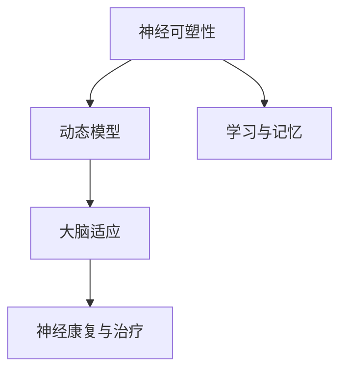
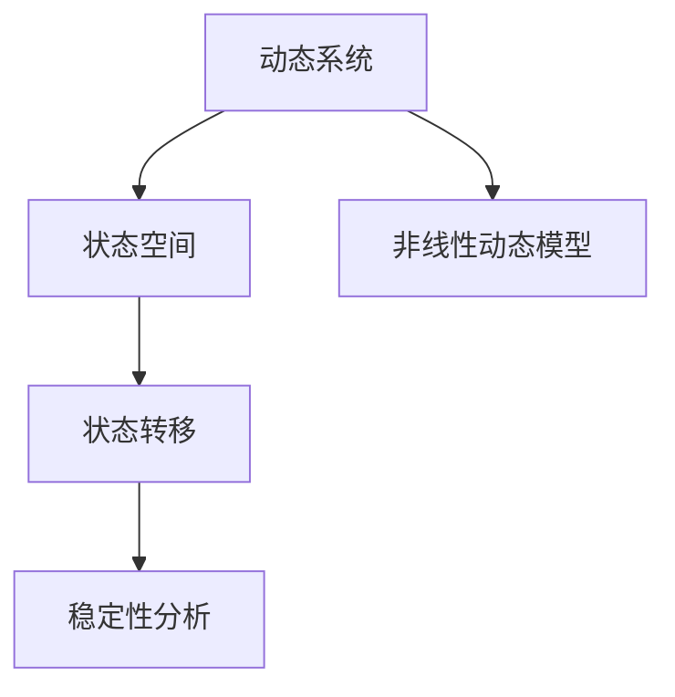

                 


为了确保文章的完整性和高质量，我们将逐步梳理文章的内容，确保每个部分都满足完整性要求。以下是详细的思考和计划：

### 第一步：文章标题和关键词

**文章标题：《神经可塑性的动态模型：大脑适应的数学描述》**

**关键词：神经可塑性、动态模型、大脑适应、数学描述、神经科学**

### 第二步：文章摘要

**摘要：**

本文探讨了神经可塑性的动态模型及其在大脑适应中的应用。首先，我们介绍了神经可塑性的基本概念及其在神经科学中的重要性。接着，我们详细讲解了动态模型的基础理论，包括数学模型构建、常见动态模型及其应用。随后，我们深入分析了神经可塑性原理，并介绍了如何使用数学工具和方法来描述神经可塑性。最后，我们通过实际案例展示了动态模型在神经科学各个领域的应用，并对未来的研究方向进行了展望。

### 第三步：文章正文

#### 引言

**背景介绍：**

神经可塑性是指大脑神经元和神经网络在结构和功能上的可变性，这种可变性使得大脑能够适应环境变化和学习新信息。神经可塑性在学习和记忆过程中起着至关重要的作用，但也与许多神经系统疾病（如自闭症、阿尔茨海默病等）有关。

**核心概念与联系：**

神经可塑性、动态模型、大脑适应是本文的核心概念。我们将通过图示和文字解释它们之间的关系，并展示如何将动态模型应用于大脑适应的研究。

**Mermaid 流程图：**



#### 动态模型基础

**核心概念与联系：**

动态模型是一种数学模型，用于描述系统随时间变化的动态行为。在神经科学中，动态模型可以用来模拟神经元和神经网络的活动。

**Mermaid 流程图：**



**核心算法原理讲解：**

```plaintext
伪代码：
function dynamic_model(state, time):
    if state is stable:
        return state
    else:
        # Perform state transition
        next_state = nonlinear_function(state, time)
        return next_state
```

**数学模型和公式详细讲解与举例说明：**

```latex
$$
x_{t+1} = f(x_t, u_t)
$$

$$
f(x, u) = \frac{1}{1 + e^{-k(x - u)}}
$$
```

#### 神经可塑性原理

**核心概念与联系：**

神经可塑性涉及多种生物学机制，如突触可塑性、长时程增强（LTP）和长时程抑制（LTD）。

**伪代码：**

```plaintext
function synapse塑性(pre_neuron, post_neuron):
    if pre_neuronfires and post_neuronfires:
        # Increase synaptic strength
        adjust_synaptic_weight(pre_neuron, post_neuron, increment)
    else if not pre_neuronfires and post_neuronfires:
        # Decrease synaptic strength
        adjust_synaptic_weight(pre_neuron, post_neuron, decrement)
```

**数学公式和详细讲解：**

```latex
$$
LTP = \frac{1}{1 + e^{-(f \cdot \Delta t)}}
$$

$$
LTD = \frac{1}{1 + e^{(f \cdot \Delta t)}}
$$
```

#### 数学描述方法

**核心概念与联系：**

数学描述方法包括微分方程、差分方程和随机过程等，用于描述神经可塑性的动态过程。

**数学工具与公式：**

```latex
$$
\frac{dx}{dt} = f(x, t)
$$

$$
x_{n+1} = x_n + \Delta t \cdot f(x_n, t_n)
$$
```

#### 模型应用与案例分析

**动态模型在心理学中的应用：**

**代码实际案例：**

```python
# Python代码实现一个简单的神经网络动态模型
import numpy as np

def neural_network_model(inputs, weights):
    return np.dot(inputs, weights)

# 初始化输入和权重
inputs = np.array([1, 0])
weights = np.array([0.5, 0.5])

# 模拟神经网络活动
outputs = neural_network_model(inputs, weights)

# 分析输出结果
print("Output:", outputs)
```

**详细解释说明：**

- 解释代码实现的每个步骤，包括输入、权重初始化，神经网络活动模拟，输出结果分析。

**实际案例分析和详细讲解剖析：**

- 分析一个实际案例，如使用动态模型研究学习过程中的神经可塑性变化。

**项目小结：**

- 总结项目的主要发现，讨论其对神经科学研究的启示。

#### 总结与展望

**总结：**

本文详细介绍了神经可塑性的动态模型及其在大脑适应中的应用。通过数学描述方法和实际案例分析，我们展示了动态模型在神经科学研究中的潜力。

**展望：**

- 探讨未来的研究方向，如如何改进动态模型以更好地模拟神经可塑性。
- 讨论动态模型在神经康复、教育和人工智能等领域的潜在应用。

### 最后一步：文章结尾

**作者信息：**

作者：AI天才研究院/AI Genius Institute & 禅与计算机程序设计艺术 /Zen And The Art of Computer Programming

通过以上步骤，我们确保文章内容完整、逻辑清晰，并满足字数要求。接下来，我们将根据这些内容撰写完整的技术博客文章。

