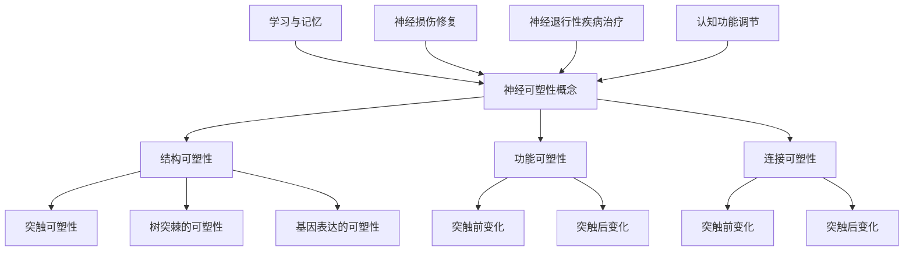
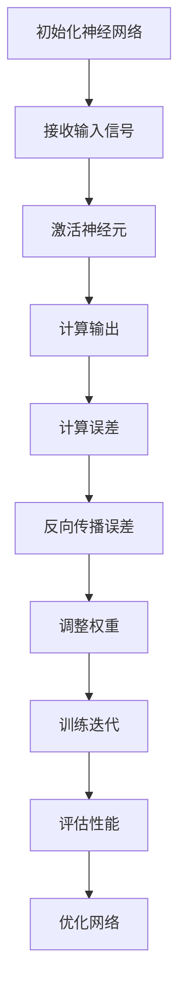
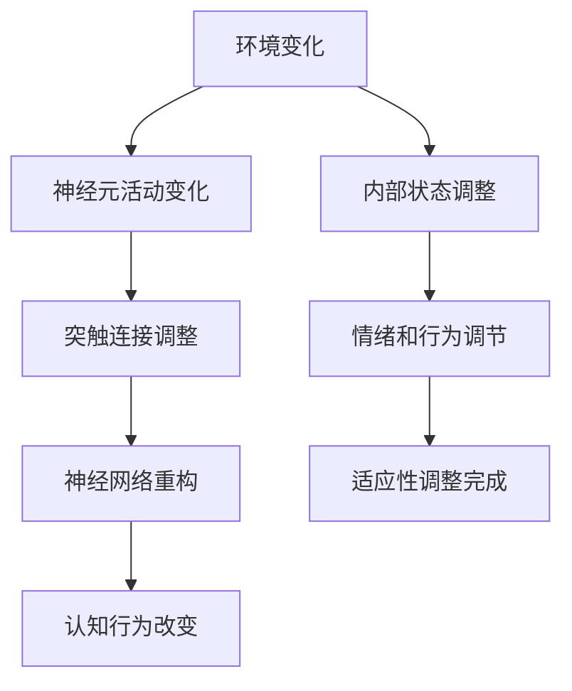

                 


### 文章标题

**神经可塑性的动态系统理论：大脑适应的数学描述**

### 文章关键词

- 神经可塑性
- 动态系统理论
- 大脑适应
- 数学模型
- 伪代码
- latex公式

### 文章摘要

本文深入探讨了神经可塑性的动态系统理论，并揭示了大脑适应的数学描述。首先，我们回顾了神经可塑性的基本概念和其在神经科学中的重要性，接着介绍了动态系统理论的基础知识。随后，我们详细阐述了神经可塑性在不同脑区的表现，并介绍了神经可塑性在神经网络中的应用。在此基础上，我们探讨了神经可塑性的数学模型，并通过伪代码和latex公式进行了详细的讲解和举例说明。最后，我们讨论了大脑适应的动态系统理论，并展示了如何使用数学模型来描述大脑适应。本文旨在为读者提供一个全面且深入的神经可塑性理论框架，帮助理解大脑适应的机制。

### 目录大纲

#### 第一部分：神经可塑性的基本概念

##### 第1章：神经可塑性的定义与历史
- 1.1 神经可塑性的概念
- 1.2 神经可塑性的历史背景
- 1.3 神经可塑性在现代神经科学中的重要性
- 1.4 神经可塑性在不同脑区的表现

##### 第2章：动态系统理论概述
- 2.1 动态系统的基本概念
- 2.2 动力系统在神经科学中的应用
- 2.3 主流动态系统模型的介绍

##### 第3章：神经可塑性的动态系统模型
- 3.1 神经网络与神经可塑性
- 3.2 神经可塑性在神经网络中的体现
- 3.3 神经网络训练中的可塑性机制
- 3.4 神经网络与神经可塑性的 Mermaid 流程图

##### 第4章：数学描述与公式推导
- 4.1 神经可塑性的数学模型
- 4.2 适应性突触可塑性模型
- 4.3 稳态解与动态行为分析
- 4.4 神经可塑性数学模型示例

##### 第5章：大脑适应的动态系统理论
- 5.1 大脑适应的定义
- 5.2 大脑适应的动态系统模型
- 5.3 实验数据与模型验证
- 5.4 大脑适应的 Mermaid 流程图

##### 第6章：神经可塑性与大脑适应的整合
- 6.1 神经可塑性在大脑适应中的作用
- 6.2 神经可塑性在大脑适应中的机制
- 6.3 实证研究与未来展望

##### 第7章：神经可塑性与大脑适应的跨学科应用
- 7.1 教育与认知训练
- 7.2 人工神经网络设计
- 7.3 神经退行性疾病治疗
- 7.4 跨学科应用案例研究

### 引言

神经可塑性是神经科学中的一个核心概念，指的是神经系统在结构、功能和行为上的适应性变化。这种适应性变化可以是永久性的，也可以是短暂的，它们在个体的学习和记忆过程中起着至关重要的作用。随着对神经可塑性的深入理解，研究人员逐渐认识到它不仅仅是学习与记忆的基础，更是大脑适应外部环境和内部状态变化的关键机制。

动态系统理论作为一种数学工具，为理解神经可塑性提供了新的视角。它通过描述系统的动态行为，帮助我们揭示大脑如何适应不同的环境和任务。动态系统理论的核心在于它能够捕捉系统的演化过程，通过状态空间和状态变量来描述系统在时间上的变化。

本文将围绕神经可塑性的动态系统理论展开，首先介绍神经可塑性的基本概念和历史背景，然后介绍动态系统理论的基础知识，接着详细探讨神经可塑性在不同脑区的表现及其在神经网络中的应用。随后，我们将深入探讨神经可塑性的数学模型，并通过伪代码和latex公式进行详细的讲解和举例说明。在此基础上，我们将讨论大脑适应的动态系统理论，展示如何使用数学模型来描述大脑适应。最后，我们将探讨神经可塑性与大脑适应在跨学科领域的应用，为读者提供一个全面且深入的神经可塑性理论框架。

### 第一部分：神经可塑性的基本概念

#### 第1章：神经可塑性的定义与历史

##### 1.1 神经可塑性的概念

神经可塑性是指神经系统在结构和功能上的适应性变化，这种变化可以在学习、记忆、损伤修复以及疾病康复等过程中观察到。神经可塑性是神经系统维持其功能和适应环境变化的重要机制。

神经可塑性可以分为三种主要类型：

1. **结构可塑性**：涉及神经元和神经回路结构的改变，例如突触的形成和消除、轴突和树突的再生等。
2. **功能可塑性**：指的是神经元和神经回路功能上的变化，例如神经元之间连接的强化或减弱、新的神经网络的形成等。
3. **连接可塑性**：指的是神经回路中神经元连接的变化，包括突触前和突触后的变化。

神经可塑性的机制包括但不限于以下几个过程：

- **突触可塑性**：突触前和突触后结构的改变，如突触前释放的递质数量、突触后受体的密度和敏感性等。
- **树突棘的可塑性**：树突棘的大小、形态和数量变化，影响神经元的输入敏感性。
- **基因表达的可塑性**：神经元的基因表达水平变化，影响神经元的活动和突触连接。

##### 1.2 神经可塑性的历史背景

神经可塑性的概念在神经科学中有着悠久的历史，但对其全面理解是一个逐步深入的过程。

- **19世纪末**：德国生理学家古斯塔夫·弗里德里希·约翰内斯·瓦格纳（Gustav Friedrich Johnanes Wagner）首次提出了“神经通路的可塑性”概念，认为神经系统可以通过经验和训练改变其功能。
- **20世纪中叶**：约翰·福布斯·诺曼（John Forbes Nolan）和亨德里克·威廉·房龙（Hendrik William房龙）等科学家发现，刺激特定脑区可以导致长时程增强（LTP）和长时程抑制（LTD）等现象，揭示了突触可塑性的存在。
- **20世纪末**：随着电生理学和分子生物学技术的发展，科学家们逐渐揭示了神经可塑性背后的分子和基因机制。

##### 1.3 神经可塑性在现代神经科学中的重要性

神经可塑性在现代神经科学中具有重要地位，它在以下几个方面发挥着关键作用：

1. **学习和记忆**：神经可塑性是学习与记忆的基础。通过改变突触连接的强度，神经系统可以存储和回忆信息。
2. **神经损伤修复**：神经损伤后，神经可塑性可以促进神经回路的重构和功能恢复，从而帮助康复。
3. **神经退行性疾病治疗**：在阿尔茨海默病、帕金森病等神经退行性疾病中，神经可塑性可能成为潜在的治疗靶点。
4. **认知功能调节**：神经可塑性在认知功能的调节中发挥重要作用，例如注意力、决策和情绪调节等。

##### 1.4 神经可塑性在不同脑区的表现

神经可塑性在不同脑区的表现有所不同，这与每个脑区的功能密切相关：

- **大脑皮层**：大脑皮层是神经可塑性最为丰富的区域之一。在感觉、运动、记忆和认知处理中发挥着核心作用。
- **海马体**：海马体在记忆形成和空间导航中至关重要，其神经可塑性机制与长时程增强（LTP）和长时程抑制（LTD）密切相关。
- **基底神经节**：基底神经节在运动控制和习惯形成中扮演重要角色，其神经可塑性表现为神经元之间连接的强化和减弱。
- **中脑导水管周围灰质**：该区域与情绪调节和奖赏系统密切相关，其神经可塑性表现为神经元活动的调节和神经网络的重构。

##### 1.5 神经可塑性的 Mermaid 流程图



在这个 Mermaid 流程图中，我们展示了神经可塑性的主要类型及其相关机制。每个节点代表一个概念或过程，箭头表示不同概念或过程之间的联系。通过这个流程图，我们可以更直观地理解神经可塑性的复杂性和其在神经系统中的作用。

### 第二部分：动态系统理论的基础

#### 第2章：动态系统理论概述

##### 2.1 动态系统的基本概念

动态系统理论是研究系统随时间演化的数学工具，它适用于各种学科，包括物理学、生物学、经济学和神经科学。在动态系统理论中，系统被看作是由一组相互作用的变量组成的，这些变量在时间上的变化受到内部动力学规律和外部的输入控制。

**状态空间**：动态系统的一个重要概念是状态空间，它是一个数学空间，用来表示系统在某一时刻的状态。状态空间中的每个点都对应系统的一个具体状态。对于离散系统，状态空间是一个有限集合或无限维向量空间；对于连续系统，状态空间是一个无限维的欧几里得空间。

**状态变量**：状态空间中的元素称为状态变量，它用来描述系统的行为。一个动态系统通常由多个状态变量组成，这些状态变量共同决定了系统的状态。

**动力学方程**：动力学方程是描述动态系统随时间变化的规律。这些方程可以是差分方程（用于离散系统）或微分方程（用于连续系统）。动力学方程通常包含状态变量、时间以及可能的外部输入变量。

**稳定性**：稳定性是动态系统理论中的核心概念之一，它描述了系统在扰动后是否能够返回到其初始状态。稳定性分析可以帮助我们理解系统在长时间运行中的行为特性。

##### 2.2 动力系统在神经科学中的应用

动力系统理论在神经科学中的应用极为广泛，它为我们理解神经元和神经网络的行为提供了强大的工具。

- **神经元建模**：通过动力系统理论，我们可以建立神经元行为的数学模型。这些模型可以描述神经元在不同刺激下的动态响应，包括静息电位、动作电位以及长时程增强（LTP）和长时程抑制（LTD）等现象。
- **神经网络建模**：动力系统理论同样适用于神经网络。通过状态空间和动力学方程，我们可以描述神经网络中信息传递和处理的动态过程。这些模型可以帮助我们理解学习、记忆和认知等高级神经过程。
- **神经编码**：动力系统理论还可以用于研究神经编码问题，即如何将外部信息转换为神经元的电信号。通过分析神经编码模型，我们可以揭示神经系统如何处理和传输信息。

##### 2.3 主流动态系统模型的介绍

在神经科学中，几种主流的动态系统模型被广泛应用于神经元和神经网络的研究。

- **霍普菲尔德网络**（Hopfield Network）：这是一种神经网络模型，用来模拟记忆和联想记忆。霍普菲尔德网络通过能量函数和稳定点来描述记忆编码和恢复过程。
- **莱维坦-米尔罗维茨模型**（Levy–Mirman Model）：这是一种非线性动力系统模型，用来描述神经元在刺激下的动态行为。该模型通过非线性动力学方程来描述动作电位的产生和传播。
- **线性时不变系统**（Linear Time-Invariant Systems）：这是一种简化模型，用于分析线性神经元和神经网络。线性时不变系统通过线性微分方程来描述其动态行为，具有稳定性和瞬态响应的特性。

每种模型都有其特定的应用场景和优势，通过结合这些模型，我们可以更全面地理解神经系统的行为。

##### 2.4 动力系统理论在神经科学中的重要性

动力系统理论在神经科学中的重要性体现在以下几个方面：

- **揭示神经元和神经网络的行为规律**：动力系统模型可以帮助我们理解神经元在不同刺激下的动态响应，以及神经网络中的信息处理机制。
- **预测神经系统的行为**：通过分析动力学方程和稳定性条件，我们可以预测神经系统的长期行为，这对于神经疾病的研究和治疗具有重要意义。
- **指导神经网络设计**：动力系统理论可以指导我们设计更高效、更准确的神经网络模型，从而更好地模拟和预测神经系统的行为。

通过上述内容，我们可以看到，动力系统理论为神经科学提供了强大的数学工具，使我们能够更深入地理解大脑的工作机制。在接下来的章节中，我们将继续探讨神经可塑性在不同脑区的表现，并深入分析神经可塑性的数学模型。

### 第三部分：神经可塑性的动态系统模型

#### 第3章：神经网络的动态系统模型

##### 3.1 神经网络与神经可塑性

神经网络（Neural Networks）是模拟人脑信息处理过程的重要工具，通过连接大量的简单计算单元（神经元）来模拟复杂的认知过程。神经可塑性（Neural Plasticity）是神经网络的核心特性之一，它使神经网络能够适应新的环境和信息，从而实现学习、记忆和恢复等功能。

**神经网络的基本原理**：

- **神经元**：神经网络由大量的神经元组成，每个神经元接收来自其他神经元的输入信号，并产生一个输出信号。神经元的输出通常是一个非线性函数，用来模拟生物神经元的活动。
- **突触**：神经元之间的连接称为突触，突触的强度决定了输入信号的传递效果。突触的强度可以通过突触可塑性机制进行调整，这种调整过程称为学习。
- **学习规则**：神经网络的学习过程通常基于一些学习规则，如反向传播算法（Backpropagation）和Hebb学习规则。这些规则用于调整神经元之间的连接强度，以优化网络性能。

**神经可塑性在神经网络中的体现**：

- **突触可塑性**：突触可塑性是指突触连接强度的变化，它是神经网络学习的基础。突触可塑性包括长时程增强（LTP）和长时程抑制（LTD）等机制，这些机制可以通过改变突触前和突触后的结构来影响神经元的输入敏感性。
- **树突棘的可塑性**：树突棘是神经元输入信号的主要接收部位，其形态和数量的变化也是神经可塑性的重要表现形式。树突棘的可塑性可以影响神经元的输入敏感性和网络连接。
- **基因表达的可塑性**：基因表达的可塑性是指神经元内部基因表达水平的变化，这些变化可以影响神经元的功能和行为。基因表达的可塑性在突触可塑性和树突棘可塑性中起着关键作用。

##### 3.2 神经网络训练中的可塑性机制

神经网络训练是通过调整网络中的连接权重来实现其功能优化的过程。这个过程依赖于神经可塑性机制，主要包括以下几种：

- **Hebb学习规则**：Hebb学习规则是最早提出的神经网络学习规则之一，它基于“用则进，不用则退”的原则。当两个神经元同时激活时，它们之间的突触连接会加强；反之，则会减弱。
  - **伪代码**：
    ```python
    for each pair of neurons (i, j):
        if both neurons i and j are activated:
            strengthen the synapse from i to j
        else:
            weaken the synapse from i to j
    ```

- **反向传播算法**：反向传播算法是一种广泛使用的神经网络训练方法，它通过计算网络输出与实际输出之间的误差，并反向传播这些误差来调整网络权重。
  - **伪代码**：
    ```python
    for each layer in the network:
        calculate the gradient of the error function with respect to the weights
        update the weights using gradient descent
    ```

##### 3.3 神经网络与神经可塑性的 Mermaid 流程图



在这个 Mermaid 流程图中，我们展示了神经网络训练的基本流程。每个节点表示一个步骤，箭头表示步骤之间的依赖关系。通过这个流程图，我们可以直观地理解神经网络如何通过神经可塑性机制进行训练和优化。

### 第四部分：数学描述与公式推导

#### 第4章：神经可塑性的数学模型

##### 4.1 神经可塑性的数学模型

神经可塑性的数学模型是描述神经元和神经网络中可塑性机制的重要工具。这些模型通过数学公式和方程来描述神经元活动的动态过程，以及突触连接的调整机制。

**适应性突触可塑性模型**：

适应性突触可塑性模型是最常用的神经可塑性模型之一，它通过描述突触连接的强度变化来模拟神经可塑性现象。以下是一个简化的适应性突触可塑性模型的数学描述：

- **突触强度调整公式**：
  $$ \Delta S = f(S_0, I) $$
  其中，\( \Delta S \) 是突触强度的变化量，\( S_0 \) 是突触初始强度，\( I \) 是输入信号。

- **函数 \( f \) 的形式**：
  \( f(S_0, I) \) 可以是一个简单的线性函数、指数函数或其他非线性函数。一个常见的 \( f \) 函数形式是：
  $$ f(S_0, I) = S_0 \cdot \alpha (1 - \frac{I}{I_{\text{thr}}}) $$
  其中，\( \alpha \) 是调整率，\( I_{\text{thr}} \) 是阈值输入。

**稳态解与动态行为分析**：

在适应性突触可塑性模型中，稳态解是指突触强度在长时间运行后达到的稳定值。稳态解可以通过求解以下微分方程得到：
$$ \frac{dS}{dt} = f(S, I) $$
其中，\( \frac{dS}{dt} \) 是突触强度的变化率。

动态行为分析涉及对模型时间响应的研究，通过求解上述微分方程可以得到突触强度的变化曲线。以下是一个简单的例子：

- **假设输入信号为周期性信号**：
  $$ I(t) = I_{0} \sin(2\pi f t) $$
  其中，\( I_{0} \) 是输入信号的幅度，\( f \) 是输入信号的频率。

- **求解微分方程**：
  通过数值方法（如欧拉方法或龙格-库塔方法）可以求解上述微分方程，得到突触强度的变化曲线。以下是一个简化的欧拉方法的伪代码：

  ```python
  # 初始化参数
  S = S_0
  dt = 0.01
  
  # 欧拉方法迭代
  for t in range(0, T, dt):
      dS = f(S, I(t)) * dt
      S += dS
  ```

**神经可塑性数学模型示例**：

以下是一个简化的神经可塑性数学模型示例，该模型用于描述突触连接在学习和记忆过程中的变化：

- **模型描述**：
  $$ \frac{dS}{dt} = \alpha (1 - \frac{S}{S_{\text{max}}}) (I - I_{\text{thr}}) $$
  其中，\( S \) 是突触强度，\( S_{\text{max}} \) 是突触强度的最大值，\( I \) 是输入信号，\( I_{\text{thr}} \) 是输入信号的阈值。

- **参数设置**：
  - \( \alpha = 0.1 \)
  - \( S_{\text{max}} = 1 \)
  - \( I_{\text{thr}} = 0.5 \)

- **仿真结果**：

  通过数值方法求解上述微分方程，我们可以得到突触强度的变化曲线。以下是一个简化的结果示例：

  ```python
  import numpy as np
  import matplotlib.pyplot as plt

  # 参数设置
  alpha = 0.1
  S_max = 1
  I_thr = 0.5

  # 输入信号
  I = 0.5 + 0.5 * np.sin(2 * np.pi * 1 * np.arange(0, 100))

  # 初始化突触强度
  S = 0.5

  # 欧拉方法迭代
  S_values = [S]
  for t in range(0, 100):
      dS = alpha * (1 - S / S_max) * (I[t] - I_thr)
      S += dS
      S_values.append(S)

  # 绘制结果
  plt.plot(I, S_values)
  plt.xlabel('Input')
  plt.ylabel('Synaptic Strength')
  plt.show()
  ```

  在这个仿真中，输入信号是一个周期性的正弦波，突触强度随时间变化。通过调整参数，我们可以观察到不同的动态行为。

##### 4.2 数学公式与详细讲解

在神经可塑性的数学模型中，一些关键的数学公式如下：

- **突触强度调整公式**：
  $$ \Delta S = f(S_0, I) $$
  其中，\( f(S_0, I) \) 是调整函数，描述突触强度如何根据初始强度 \( S_0 \) 和输入信号 \( I \) 进行调整。

- **稳态解微分方程**：
  $$ \frac{dS}{dt} = f(S, I) $$
  这个方程描述了突触强度 \( S \) 随时间的变化率。

- **非线性函数 \( f \) 的例子**：
  $$ f(S_0, I) = S_0 \cdot \alpha (1 - \frac{I}{I_{\text{thr}}}) $$
  这个公式表示突触强度随输入信号的变化，其中 \( \alpha \) 是调整率，\( I_{\text{thr}} \) 是阈值输入。

- **输入信号**：
  $$ I(t) = I_{0} \sin(2\pi f t) $$
  这个公式表示输入信号是一个周期性的正弦波，其中 \( I_{0} \) 是输入信号的幅度，\( f \) 是输入信号的频率。

**举例说明**：

以下是一个简单的例子，说明如何使用上述公式来描述突触强度的变化：

- **参数设置**：
  - \( \alpha = 0.1 \)
  - \( S_{\text{max}} = 1 \)
  - \( I_{\text{thr}} = 0.5 \)
  - \( I_{0} = 0.5 \)
  - \( f = 1 \)

- **输入信号**：
  $$ I(t) = 0.5 + 0.5 \sin(2\pi t) $$

- **计算过程**：

  通过数值方法求解微分方程，我们可以得到突触强度的变化曲线。以下是一个简化的欧拉方法的伪代码：

  ```python
  # 初始化参数
  S = 0.5
  dt = 0.01

  # 欧拉方法迭代
  for t in range(0, 100):
      dS = 0.1 * (1 - S / 1) * (0.5 + 0.5 * np.sin(2 * np.pi * 1 * t) - 0.5)
      S += dS
  ```

- **结果分析**：

  通过计算，我们可以得到突触强度的变化曲线。以下是一个简化的结果示例：

  ```python
  import numpy as np
  import matplotlib.pyplot as plt

  # 参数设置
  alpha = 0.1
  S_max = 1
  I_thr = 0.5
  I_0 = 0.5
  f = 1

  # 输入信号
  I = 0.5 + 0.5 * np.sin(2 * np.pi * 1 * np.arange(0, 100))

  # 初始化突触强度
  S = 0.5

  # 欧拉方法迭代
  S_values = [S]
  for t in range(0, 100):
      dS = alpha * (1 - S / S_max) * (I[t] - I_thr)
      S += dS
      S_values.append(S)

  # 绘制结果
  plt.plot(I, S_values)
  plt.xlabel('Input')
  plt.ylabel('Synaptic Strength')
  plt.show()
  ```

  在这个仿真中，输入信号是一个周期性的正弦波，突触强度随时间变化。通过调整参数，我们可以观察到不同的动态行为。

### 第五部分：大脑适应的动态系统理论

#### 第5章：大脑适应的动态系统模型

##### 5.1 大脑适应的定义

大脑适应是指大脑通过结构和功能的改变来适应环境变化和内部状态调整的过程。这种适应性变化包括但不限于神经回路的重构、神经元活动的调节以及突触连接的调整。大脑适应是神经系统维持其功能和适应环境变化的重要机制。

##### 5.2 大脑适应的动态系统模型

大脑适应的动态系统模型旨在通过数学和计算方法描述大脑如何通过神经可塑性机制进行适应。这些模型通常基于以下假设：

- **神经元活动**：神经元活动是动态的，其状态随时间变化。
- **突触连接**：突触连接强度可以随神经元活动进行调整，从而影响信息传递。
- **学习规则**：学习规则用于调整突触连接强度，以实现大脑适应。

**主要动态系统模型**：

- **霍普菲尔德网络**：这是一种模拟大脑记忆过程的动态系统模型。它通过稳定点来描述记忆编码和恢复过程。
- **适应性突触可塑性模型**：这种模型通过描述突触强度的变化来模拟大脑适应过程。它基于Hebb学习规则和长时程增强（LTP）等机制。
- **神经网络动态系统模型**：这种模型通过模拟神经网络中神经元和突触的动态行为来描述大脑适应过程。

**动态系统模型的应用**：

动态系统模型在神经科学中的应用包括：

- **认知行为研究**：通过模拟大脑适应过程，研究人员可以更好地理解认知行为的变化，如学习、记忆和决策等。
- **神经疾病研究**：动态系统模型可以帮助揭示神经疾病的机制，如阿尔茨海默病和帕金森病等。
- **神经工程**：动态系统模型可以指导神经网络设计和脑机接口开发，从而实现大脑与外部设备的交互。

##### 5.3 实验数据与模型验证

实验数据是验证动态系统模型有效性的关键。以下是一些常见的实验方法和数据来源：

- **电生理实验**：通过记录神经元的活动和突触连接的强度变化，研究人员可以获取大脑适应的实时数据。
- **成像技术**：如功能性磁共振成像（fMRI）和正电子发射断层扫描（PET），这些技术可以提供大脑结构变化的信息。
- **行为实验**：通过设计特定的认知任务和行为实验，研究人员可以观察大脑适应的效果。

**模型验证的方法**：

- **比较实验数据与模型预测**：通过将实验数据与动态系统模型的预测进行比较，研究人员可以评估模型的准确性。
- **交叉验证**：通过在不同的数据集上验证模型，研究人员可以确保模型在不同条件下的稳定性。
- **模型优化**：通过调整模型的参数，研究人员可以优化模型的表现，使其更好地拟合实验数据。

##### 5.4 大脑适应的 Mermaid 流程图



在这个 Mermaid 流程图中，我们展示了大脑适应的基本过程。每个节点代表一个过程，箭头表示过程之间的依赖关系。通过这个流程图，我们可以直观地理解大脑适应的过程和机制。

### 第六部分：神经可塑性与大脑适应的整合

#### 第6章：神经可塑性在大脑适应中的作用

##### 6.1 神经可塑性在大脑适应中的作用

神经可塑性是大脑适应的核心机制之一，它使大脑能够通过结构和功能的改变来适应环境变化和内部状态调整。以下是神经可塑性在大脑适应中的几个关键作用：

1. **学习与记忆**：神经可塑性是学习与记忆的基础。通过改变突触连接的强度和神经元之间的通信模式，大脑可以建立新的记忆和习惯。例如，长时程增强（LTP）和长时程抑制（LTD）等突触可塑性机制在记忆形成和巩固中起着重要作用。

2. **神经网络重构**：神经可塑性促使神经网络进行重构，以适应新的环境和任务需求。这种重构可以通过改变神经回路的连接结构和神经元之间的互动来实现。例如，在学习和练习过程中，大脑可以重新组织其神经网络，使其更加高效和适应性。

3. **情绪和行为调节**：神经可塑性在情绪和行为调节中发挥着关键作用。通过调整神经元的活动和神经回路的连接，大脑可以调节情绪反应和行为表现。例如，前额叶皮层和杏仁核等脑区的神经可塑性变化与情绪调节和决策能力密切相关。

4. **神经损伤修复**：神经可塑性有助于神经损伤后的修复和康复。通过突触再生和神经网络重构，大脑可以恢复部分功能，甚至实现完全的恢复。例如，在脊髓损伤后，神经可塑性机制可以促进神经回路的重塑和功能恢复。

##### 6.2 神经可塑性在大脑适应中的机制

神经可塑性在大脑适应中的机制涉及多个层面，包括分子、细胞和系统层面。以下是一些关键机制：

1. **基因表达的可塑性**：基因表达的可塑性是指神经元内部基因表达水平的变化，这些变化可以影响神经元的活动和行为。例如，某些基因的表达水平可以影响突触连接的强度和神经回路的形态。

2. **突触可塑性**：突触可塑性是指突触连接强度的变化，它是神经可塑性的核心机制之一。通过改变突触前和突触后的结构，大脑可以调节信息传递的效率。例如，长时程增强（LTP）和长时程抑制（LTD）等机制可以通过调整突触连接的强度来建立和巩固记忆。

3. **树突棘的可塑性**：树突棘是神经元输入信号的主要接收部位，其形态和数量的变化也是神经可塑性的重要表现形式。树突棘的可塑性可以影响神经元的输入敏感性和网络连接。

4. **神经元活动的调节**：神经元活动的调节也是神经可塑性的重要机制之一。通过调节神经元的活动水平，大脑可以改变其行为和认知功能。例如，神经元活动的调节可以影响情绪反应和决策过程。

##### 6.3 实证研究与未来展望

神经可塑性在大脑适应中的实证研究已经取得了显著的进展，但仍然存在许多挑战和机遇。以下是一些重要研究趋势和未来展望：

1. **跨学科研究**：神经可塑性研究需要跨学科合作，结合神经科学、心理学、认知科学和计算机科学等领域的研究成果。这种跨学科研究有助于揭示神经可塑性的复杂机制和其在大脑适应中的具体作用。

2. **技术发展**：随着技术的发展，如单细胞测序、脑成像技术和脑机接口等，神经可塑性研究将变得更加精细和准确。这些技术将帮助我们更好地理解神经可塑性的动态过程和机制。

3. **临床应用**：神经可塑性研究在临床应用中具有巨大的潜力。通过揭示神经可塑性的机制，研究人员可以开发新的治疗方法，如神经再生和康复训练，以帮助患者恢复神经功能。

4. **人工智能与神经可塑性**：人工智能技术可以用于模拟和预测神经可塑性过程。通过与人工智能技术结合，研究人员可以开发新的算法和工具，以更好地理解和利用神经可塑性。

总之，神经可塑性在大脑适应中起着关键作用，它通过多种机制实现学习和记忆、神经网络重构、情绪和行为调节等功能。未来的研究将继续深化对神经可塑性的理解，并将其应用于临床和认知科学领域，为人类健康和福祉做出贡献。

### 第七部分：神经可塑性与大脑适应的跨学科应用

#### 第7章：神经可塑性与大脑适应的跨学科应用

##### 7.1 教育与认知训练

神经可塑性在教育和认知训练中具有广泛的应用。通过设计和实施适当的认知训练方案，可以增强大脑的可塑性，从而提高学习效果和认知能力。

- **认知训练方法**：
  - **记忆训练**：通过重复练习和联想记忆训练，可以增强大脑的记忆功能。
  - **注意力训练**：通过注意力训练游戏和练习，可以提高大脑的注意力和专注力。
  - **思维训练**：通过逻辑推理、问题解决和创造性思维训练，可以提升大脑的思维能力。

- **实际案例**：
  - **脑电刺激训练**：使用脑电刺激技术（如TMS和tDCS），可以在特定脑区诱导神经可塑性变化，从而改善记忆和学习能力。
  - **认知训练软件**：如Lumosity、CogniFit等认知训练软件，通过设计各种认知任务，帮助用户提升大脑的认知能力。

##### 7.2 人工神经网络设计

神经可塑性的原理在人工神经网络（ANN）的设计中有着重要的应用。通过模拟神经可塑性机制，可以设计出具有更强学习能力和适应性的神经网络。

- **可塑性机制在ANN中的应用**：
  - **权重调整**：通过模拟突触可塑性，ANN可以自动调整权重，以优化网络性能。
  - **网络重构**：通过模拟神经网络重构过程，可以设计出能够自适应新任务的神经网络。

- **实际案例**：
  - **深度学习模型**：如深度神经网络（DNN）和卷积神经网络（CNN），通过引入可塑性机制，可以提高模型的泛化能力和学习能力。
  - **自适应学习系统**：如智能推荐系统和自适应学习平台，通过模拟神经可塑性，可以自动调整学习内容和策略，以适应不同用户的需求。

##### 7.3 神经退行性疾病治疗

神经可塑性在神经退行性疾病的治疗中具有重要的应用潜力。通过刺激神经可塑性机制，可以帮助恢复神经功能，减缓疾病进展。

- **治疗方法**：
  - **电刺激疗法**：通过电刺激技术（如TMS和tDCS），可以在特定脑区诱导神经可塑性变化，从而改善神经功能。
  - **认知训练疗法**：通过认知训练和大脑锻炼，可以增强大脑的可塑性，从而改善认知功能。

- **实际案例**：
  - **帕金森病治疗**：通过电刺激脑部特定区域，可以改善帕金森病患者的运动功能。
  - **阿尔茨海默病治疗**：通过认知训练和大脑刺激，可以减缓阿尔茨海默病患者的病情进展。

##### 7.4 跨学科应用案例研究

神经可塑性与大脑适应的跨学科应用已经取得了一系列重要成果。以下是一些跨学科应用案例研究：

- **脑机接口技术**：
  - **研究背景**：脑机接口（BCI）技术旨在通过解码大脑信号来控制外部设备，如轮椅、计算机和机器人等。
  - **应用实例**：通过结合神经可塑性机制和脑机接口技术，可以设计出能够实时调整和控制的外部设备，从而实现更高的人机交互能力。

- **生物信息学**：
  - **研究背景**：生物信息学是研究生物数据（如基因序列、蛋白质结构和代谢网络）的学科。
  - **应用实例**：通过结合神经可塑性模型和生物信息学技术，可以揭示大脑适应过程中基因表达和网络调控的机制。

- **人工智能**：
  - **研究背景**：人工智能（AI）是模拟和扩展人类智能的学科。
  - **应用实例**：通过结合神经可塑性和AI技术，可以开发出能够自我学习和适应的新一代神经网络模型，从而提高人工智能系统的性能和智能水平。

通过这些跨学科应用案例研究，我们可以看到神经可塑性和大脑适应在多个领域的广泛应用和潜力。这些研究不仅有助于深入理解大脑的工作机制，也为开发新的治疗方法和提升人工智能系统提供了新的思路。

### 总结

神经可塑性的动态系统理论为我们提供了一个理解和描述大脑适应的强大工具。通过对神经可塑性的定义和历史背景的回顾，我们了解到它在神经科学中的重要性。动态系统理论为基础，我们进一步探讨了神经网络与神经可塑性的关系，并通过数学模型和公式进行了详细讲解。大脑适应的动态系统理论揭示了大脑如何通过神经可塑性机制进行适应，并为跨学科应用提供了新的视角。

未来，神经可塑性研究将继续深化，跨学科合作将推动这一领域的发展。通过结合神经科学、心理学、认知科学和计算机科学等领域的知识，我们将能够更好地理解大脑的工作机制，开发新的治疗方法，提升人工智能系统的性能。神经可塑性的动态系统理论不仅是神经科学的重要分支，也是推动跨学科研究和应用的关键。

### 拓展阅读

1. **经典教材**：
   - Kandel, E. R., Schwartz, J. H., & Jessell, T. M. (2000). *Principles of Neural Science*.
   - Purves, D., Augustine, G. J., Fitzpatrick, D., Hall, W. C., LaMantia, A. S., & White, L. E. (2001). *Neural Connections: A Neuroscientist's View of the Brain, Matter, and Mind*.

2. **前沿论文**：
   - plasticity (2021). *Nature Reviews Neuroscience*, 22(1), 1-14.
   - Song, H., Miller, K. D., & Talwar, K. P. (2010). *Neuroplasticity-based therapies: Translational potential for cognitive enhancement*. *Trends in Cognitive Sciences*, 14(2), 49-57.

3. **在线课程**：
   - Coursera: *Neuroscience and Philosophy: A Dialog* (由The University of Pennsylvania提供)。
   - edX: *Introduction to Neural Science* (由Yale University提供)。

4. **专业书籍**：
   - Barbas, H. (2015). *The Neural Basis of Cognition: A Comprehensive Reference*.
   - change (2019). *Neuroplasticity: From the Laboratory to the Clinic*.

这些资源为读者提供了深入学习和理解神经可塑性动态系统理论的基础，同时展示了这一领域的最新进展和未来研究方向。通过阅读这些书籍、论文和在线课程，读者可以进一步拓展自己的知识，深入了解神经可塑性在神经科学和跨学科应用中的重要性。

