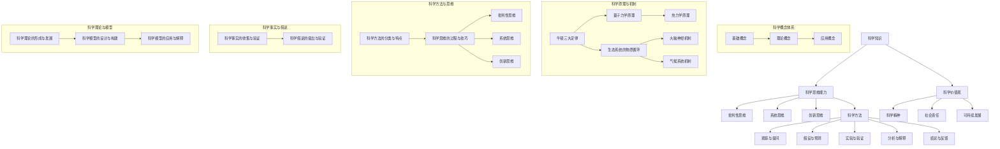

                 

# 文章标题

《科学literacy对增进社会整体理解世界的作用》

## 关键词

科学素养、社会理解、教育策略、媒体传播、科技创新

## 摘要

本文旨在探讨科学literacy对增进社会整体理解世界的作用。科学literacy不仅涉及科学知识的传授，更重要的是培养人们的科学思维能力和价值观。文章首先对科学literacy的概念进行解析，随后分析其在教育、媒体传播和社会整体理解世界中的重要性。通过梳理科学literacy的核心概念与联系，本文进一步阐述了科学数据处理算法、模型构建算法和科学算法在科学研究中的具体应用。最后，本文结合实际案例，展示了科学literacy在项目实战中的应用，并提出了提升科学literacy水平的策略与建议。

## 引言

在信息爆炸的时代，科学知识和科技发展日新月异。然而，知识的普及与社会的理解并不总是同步的。科学literacy，即科学素养，指的是个体具备的科学知识水平、科学思维能力以及对科学方法和过程的理解。科学literacy不仅对个人发展至关重要，也对整个社会的进步具有重要意义。本文将从科学literacy的定义、组成部分、培养现状、教育策略、媒体传播、社会整体理解世界的作用等方面，深入探讨科学literacy对增进社会整体理解世界的作用。

## 第一部分：科学literacy概述

### 1.1 科学literacy的定义与意义

#### 1.1.1 科学literacy的概念解析

科学literacy，通常被译为“科学素养”，是指个体具备的科学知识和技能，能够理解科学的基本概念、原理和方法，具备科学思维和批判性思维能力。科学literacy不仅包括科学知识的学习，更重要的是科学方法和思维能力的培养。

科学literacy的定义可以从以下几个方面来理解：

- **科学知识的学习**：掌握科学的基本概念、原理和事实，如物理学、化学、生物学等基础学科知识。
- **科学思维能力的培养**：具备分析、推理、批判性思维等能力，能够运用科学方法解决问题。
- **科学价值观的塑造**：理解科学对社会、环境和人类生活的影响，形成科学的世界观和价值观。

科学literacy不同于科学教育，它更侧重于个体在日常生活和工作中如何运用科学知识和方法。科学教育则是通过学校教育、社会教育等途径，系统地传授科学知识，培养科学思维能力和价值观。

#### 1.1.2 科学literacy的重要性

科学literacy的重要性体现在多个方面：

- **提升个体素质**：科学literacy有助于提高个体的知识水平和思维能力，增强批判性思维和解决问题的能力。
- **推动科技创新**：科学literacy是科技创新的重要基础，只有具备科学素养的人才能够进行创新性研究。
- **增进社会共识**：科学literacy有助于提高公众对科学问题的认识和理解，减少误解和分歧，促进社会共识的形成。
- **提升社会可持续发展能力**：科学literacy有助于人们更好地理解和应对全球性挑战，如气候变化、能源危机等，提升社会可持续发展能力。

#### 1.1.3 科学literacy与其他概念的联系

科学literacy与以下几个概念密切相关：

- **科学素养**：科学素养是科学literacy的同义词，两者在概念上基本相同。
- **科技素养**：科技素养不仅包括科学知识，还涉及技术应用能力。科学literacy可以视为科技素养的一个子集。
- **数字素养**：数字素养指的是个体在数字化环境中的信息获取、处理和使用能力。科学literacy与数字素养存在交集，但侧重点不同。
- **环境素养**：环境素养关注个体对环境问题的认识和理解，科学literacy为其提供了科学知识支持。

### 1.2 科学literacy的组成部分

科学literacy的组成部分主要包括科学知识、科学思维能力和科学价值观。

#### 1.2.1 科学知识的学习

科学知识是科学literacy的基础。学习科学知识包括以下几个方面：

- **基础学科知识**：如物理学、化学、生物学等基础学科的知识，这些知识是理解复杂科学问题的基础。
- **跨学科知识**：不同学科之间的交叉和融合，如生物化学、环境科学等，有助于从多个角度理解科学问题。
- **科学前沿知识**：跟踪科学前沿，了解最新的科学研究成果，有助于拓宽知识视野。

#### 1.2.2 科学思维能力的培养

科学思维能力包括以下几个方面：

- **批判性思维**：对信息进行批判性分析，识别偏见和错误，提高判断力。
- **系统思维**：从整体和系统的角度看待问题，理解各个部分之间的相互作用。
- **创新思维**：运用科学方法和创造性思维，解决复杂问题，推动科技创新。

#### 1.2.3 科学价值观的塑造

科学价值观是科学literacy的重要组成部分，包括以下几个方面：

- **科学精神**：追求真理、实事求是、勇于探索的精神。
- **社会责任**：理解科学对社会、环境和人类生活的影响，承担社会责任。
- **可持续发展**：关注环境保护、资源利用和可持续发展的科学理念。

### 1.3 科学literacy的培养现状与挑战

#### 1.3.1 全球科学literacy培养现状

全球科学literacy的培养现状存在差异，发达国家和发展中国家之间存在一定差距。发达国家普遍重视科学教育，科学literacy水平较高。例如，美国、英国等国家的科学教育体系较为完善，科学课程设置丰富，科学教学方法多样，公众科学素养较高。而发展中国家，如一些亚洲和非洲国家，科学教育资源相对匮乏，科学literacy水平有待提高。

#### 1.3.2 我国科学literacy培养现状

我国科学literacy的培养现状呈现出以下几个特点：

- **科学教育重视程度不断提高**：近年来，我国政府高度重视科学教育，出台了一系列政策措施，推动科学教育的改革与发展。
- **科学教育体系逐步完善**：我国已经形成了从基础教育到高等教育的科学教育体系，科学课程设置逐渐丰富，教学方法逐渐多样。
- **科学literacy水平有待提高**：尽管我国科学教育取得了一定进展，但公众科学素养整体水平仍有待提高，特别是在农村和贫困地区，科学教育资源匮乏，科学literacy水平较低。

#### 1.3.3 科学literacy培养的挑战与对策

科学literacy培养面临以下几个挑战：

- **教育资源配置不均衡**：城乡、区域之间的教育资源配置不均衡，导致科学教育质量存在差距。
- **科学教育资源匮乏**：一些地区和学校缺乏足够的科学教育资源，如实验设备、师资力量等。
- **科学教育方法单一**：传统科学教育方法较为单一，忽视了学生的主体地位和个性发展。
- **公众科学素养较低**：尽管科学教育有所进展，但公众科学素养整体水平仍较低，对科学问题的理解和判断存在误区。

针对上述挑战，可以采取以下对策：

- **优化教育资源配置**：加大教育投入，提高农村和贫困地区的科学教育水平，促进教育公平。
- **丰富科学教育资源**：引进先进的科学教育设备，加强师资培训，提高科学教育质量。
- **创新科学教育方法**：采用多样化的教学手段，培养学生的兴趣和创造力，提高科学素养。
- **加强科学传播**：通过媒体、网络等渠道，加强科学知识的普及和传播，提高公众科学素养。

### 1.4 科学literacy在教育中的实施策略

科学literacy的培养离不开教育的支持。以下是一些具体的实施策略：

#### 1.4.1 教育体制的改革

- **课程设置优化**：调整课程设置，增加科学课程的比重，特别是跨学科的课程，提高学生的科学素养。
- **教学方式改革**：采用探究式、合作学习等教学方法，激发学生的学习兴趣，提高科学思维能力。

#### 1.4.2 教师培训的加强

- **科学素养培训**：提高教师的科学素养，使其能够更好地传授科学知识，引导学生进行科学思维。
- **教学方法培训**：加强教师的教学方法培训，提高教学效果，促进学生的科学素养提升。

#### 1.4.3 课程设置的优化

- **理论与实践相结合**：在课程设置中，注重理论与实践的结合，提高学生的实践能力。
- **跨学科课程**：设置跨学科课程，培养学生的综合思维能力和创新精神。

### 1.5 科学literacy在媒体传播中的角色

科学literacy在媒体传播中发挥着重要作用。以下从几个方面分析科学literacy在媒体传播中的角色：

#### 1.5.1 媒体对科学literacy的推动作用

- **科学知识的普及**：媒体通过新闻报道、专题节目等形式，向公众传播科学知识，提高公众的科学素养。
- **科学精神的传播**：媒体通过报道科学家的故事、科学探索的过程等，传递科学精神和科学态度，激发公众对科学的热爱和兴趣。

#### 1.5.2 科学传播中的问题与挑战

- **信息过载**：随着科技的发展，科学信息日益增多，公众难以消化和理解。
- **科学偏见与误解**：媒体在科学传播过程中，可能存在偏见和误解，导致公众对科学问题的理解产生偏差。

#### 1.5.3 媒体传播策略的优化

- **科学传播内容的优化**：媒体应注重科学传播内容的准确性和可读性，用通俗易懂的语言解释复杂的科学问题。
- **互动性增强**：通过互动形式，如网络直播、在线问答等，增强公众参与，提高科学传播的效果。

### 1.6 科学literacy在社会整体理解世界中的作用

科学literacy在社会整体理解世界中的作用不可忽视。以下从几个方面探讨科学literacy对社会整体理解世界的影响：

#### 1.6.1 增进社会共识

- **科学共识的形成**：科学literacy有助于公众理解和接受科学共识，减少误解和分歧，增进社会共识。
- **公共政策制定**：科学literacy为公共政策制定提供科学依据，提高决策的科学性。

#### 1.6.2 促进科技创新

- **科技创新的土壤**：科学literacy为科技创新提供了知识基础和思维支持，有助于激发创新活力。
- **科研人才储备**：科学literacy培养了大量具备科学素养的科研人才，为科技创新提供了人才保障。

#### 1.6.3 提升社会可持续发展能力

- **环境保护**：科学literacy有助于公众理解环境保护的重要性，提高环保意识，推动绿色发展。
- **资源利用**：科学literacy提高公众对资源利用的认识，促进资源高效利用，提升社会可持续发展能力。

### 1.7 总结

科学literacy作为社会进步的重要基石，对增进社会整体理解世界具有重要作用。通过教育、媒体传播等多渠道的培养，可以提高公众的科学素养，促进科技创新，增进社会共识，提升社会可持续发展能力。面对挑战，我们需要采取有效对策，优化科学教育，加强科学传播，为科学literacy的发展提供有力支持。

## 第二部分：科学literacy的核心概念与联系

### 2.1 科学概念体系

科学概念体系是科学知识的基础，理解科学概念有助于我们更好地把握科学的本质。科学概念可以从以下几个层面进行分类和解释：

#### 2.1.1 科学概念的定义与分类

科学概念是科学理论的基本组成要素，是人们对自然界和社会现象的基本理解和解释。科学概念可以分为以下几类：

- **基础概念**：如物质、能量、力、运动等，是科学体系中的核心概念。
- **理论概念**：如相对论、量子力学、进化论等，是科学理论的基石。
- **应用概念**：如计算机、手机、互联网等，是科学理论在实际生活中的应用。

#### 2.1.2 科学概念之间的联系

科学概念之间存在紧密的联系，构成了一个复杂的概念网络。以下是几个关键的科学概念及其相互联系：

1. **物质与能量**：物质与能量是宇宙的两个基本属性，物质可以转化为能量，能量也可以转化为物质。
   $$ E = mc^2 $$
   （爱因斯坦的质能方程）

2. **生物与生态**：生物是生态系统的组成部分，生态平衡依赖于生物之间的相互作用。
   $$ 生态平衡 = 生态能量流动 + 生物多样性 $$

3. **物理与化学**：物理和化学共同构成了自然科学的两大基础，二者在分子和原子层面有着紧密的联系。
   $$ 化学反应 = 物理变化 + 新物质生成 $$

4. **环境与人类**：环境是人类的生存基础，人类活动对环境的影响日益显著。
   $$ 环境问题 = 人类活动 + 环境变化 $$

#### 2.1.3 科学概念体系的构建

科学概念体系的构建是一个不断发展和完善的过程，其基本步骤如下：

1. **概念识别**：通过对自然现象的观察和实验，识别出基本的概念。
2. **概念定义**：对概念进行明确的定义，确保概念的准确性。
3. **概念分类**：将概念按照特定的逻辑关系进行分类，形成概念体系。
4. **概念联系**：探索不同概念之间的联系，构建概念网络。
5. **概念更新**：随着科学的发展，对概念进行修订和更新，以反映新的科学发现。

### 2.2 科学原理与机制

科学原理是科学概念在特定情境下的应用和解释。科学机制则是对科学原理的进一步阐述，揭示了现象背后的运作规律。以下是一些重要的科学原理和机制：

#### 2.2.1 科学原理的解释与理解

1. **牛顿三大定律**：描述了物体运动的规律，是经典力学的基础。
   $$ F = ma $$
   $$ a = \frac{F}{m} $$
   $$ v = u + at $$

2. **量子力学原理**：描述了微观粒子的行为规律，如波粒二象性、不确定性原理等。
   $$ \Psi^2 = \rho $$
   $$ \Delta x \Delta p \geq \frac{\hbar}{2} $$
   （海森堡不确定性原理）

3. **热力学原理**：描述了能量转化和守恒的规律，如第一、第二和第三定律。
   $$ \Delta U = Q - W $$
   $$ \Delta S \geq \frac{Q}{T} $$
   $$ \lim_{T \to 0} \Delta S \geq \frac{C_v \ln(T_f/T_i)}{T} $$

#### 2.2.2 科学机制的分析与探讨

1. **生态系统的物质循环**：物质在生态系统中的循环机制，包括碳循环、氮循环等。
   $$ \text{C循环}：CO_2 \xrightarrow{\text{光合作用}} \text{有机物} \xrightarrow{\text{呼吸作用}} CO_2 $$
   $$ \text{N循环}：N_2 \xrightarrow{\text{固氮}} NH_3 \xrightarrow{\text{氨化}} NO_3^- $$

2. **大脑神经机制**：神经元之间的通信机制，包括突触传递、神经递质等。
   $$ \text{突触传递}：神经递质释放 \rightarrow 突触后神经元兴奋或抑制 $$
   $$ \text{神经递质}：乙酰胆碱、多巴胺、去甲肾上腺素等 $$

3. **气候系统机制**：气候变化的基本机制，包括温室效应、海冰融化等。
   $$ \text{温室效应}：CO_2 \xrightarrow{\text{吸收红外辐射}} \text{地球表面升温} $$
   $$ \text{海冰融化}：温度升高 \rightarrow 海冰减少 \rightarrow 海平面上升 $$

#### 2.2.3 科学原理与机制的应用

科学原理和机制在各个领域都有广泛的应用。以下是几个例子：

1. **工程技术**：牛顿力学原理在航空航天、建筑结构、机械设计中的应用。
   $$ \text{航空航天}：\frac{mv}{r} = \frac{mv_0}{r_0} $$
   $$ \text{建筑结构}：F = ma $$
   $$ \text{机械设计}：功 = 力 \times 距离 $$

2. **医学**：免疫机制在疫苗开发和疾病治疗中的应用。
   $$ \text{疫苗}：抗原 - 抗体反应 $$
   $$ \text{疾病治疗}：细胞免疫 - 细菌感染 $$
   $$ \text{免疫机制}：T细胞 - B细胞相互协作 $$

3. **经济学**：供需机制在市场运作中的应用。
   $$ \text{供需平衡}：P = \frac{Q_d + Q_s}{2} $$
   $$ \text{需求函数}：Q_d = a - bP $$
   $$ \text{供给函数}：Q_s = c + dP $$

### 2.3 科学方法与思维

科学方法是一种系统的、逻辑的思维方式，用于获取知识和解决问题。科学思维则是运用科学方法进行思考的过程。以下是对科学方法和思维的详细解释：

#### 2.3.1 科学方法的分类与特点

科学方法主要包括以下几个步骤：

1. **观察与提问**：通过观察自然现象，提出科学问题。
2. **假设与预测**：根据已有知识和理论，提出假设并预测结果。
3. **实验与验证**：设计实验，收集数据，验证假设。
4. **分析与解释**：分析实验结果，解释现象背后的原因。
5. **结论与反馈**：根据分析结果，得出结论，并对假设进行反馈和修正。

科学方法的特点包括：

- **客观性**：科学方法强调客观性，通过实验和观察获取数据。
- **系统性**：科学方法强调系统性，通过逻辑步骤进行问题解决。
- **可重复性**：科学方法强调可重复性，通过实验验证确保结果的可靠性。

#### 2.3.2 科学思维的过程与技巧

科学思维是一个动态的过程，包括以下几个阶段：

1. **问题识别**：通过观察和提问，识别出需要解决的问题。
2. **假设构建**：根据已有知识和理论，构建可能的假设。
3. **实验设计**：设计实验，选择合适的实验方法和工具。
4. **数据收集与分析**：收集实验数据，运用统计方法和逻辑分析进行数据解读。
5. **结论形成**：根据数据分析结果，形成结论并对假设进行验证。
6. **反思与修正**：对结论进行反思，根据反馈修正假设和实验设计。

科学思维技巧包括：

- **批判性思维**：对信息进行批判性分析，识别偏见和错误，提高判断力。
- **系统思维**：从整体和系统的角度看待问题，理解各个部分之间的相互作用。
- **创新思维**：运用科学方法和创造性思维，解决复杂问题，推动科技创新。

#### 2.3.3 科学思维在科学研究中的应用

科学思维在科学研究中的应用体现在以下几个方面：

1. **问题解决**：通过科学思维，研究人员能够准确识别问题，提出有效的解决方案。
2. **理论构建**：科学思维帮助研究人员构建科学理论，解释复杂的自然现象。
3. **实验设计**：科学思维指导研究人员设计实验，确保实验的科学性和可靠性。
4. **数据分析**：科学思维帮助研究人员分析实验数据，得出科学结论。
5. **学术交流**：科学思维促进学术交流，帮助研究人员分享和验证科学成果。

### 2.4 科学事实与假说

科学事实和假说是科学探索中的两个重要概念。以下是对这两个概念的详细解释：

#### 2.4.1 科学事实的收集与验证

科学事实是基于实验和观察收集的数据和证据，是科学研究的基石。科学事实的收集和验证通常遵循以下步骤：

1. **实验设计**：设计实验，确保实验的科学性和可重复性。
2. **数据收集**：通过实验，收集相关数据。
3. **数据分析**：运用统计方法和逻辑分析，对数据进行解读。
4. **证据验证**：通过实验结果验证事实的真实性。

科学事实的特点包括：

- **客观性**：科学事实是基于实验和观察收集的数据，具有客观性。
- **可重复性**：科学事实可以通过重复实验验证其真实性。
- **准确性**：科学事实是基于准确的数据和证据得出的。

#### 2.4.2 科学假说的提出与验证

科学假说是基于现有知识和理论，对未知现象的推测和解释。科学假说的提出和验证通常遵循以下步骤：

1. **问题识别**：识别需要解释的科学问题。
2. **假设构建**：根据现有知识和理论，提出可能的假说。
3. **实验设计**：设计实验，验证假说。
4. **数据分析**：分析实验数据，评估假说的有效性。
5. **结论形成**：根据数据分析结果，得出结论。

科学假说的特点包括：

- **推测性**：科学假说是对未知现象的推测和解释，具有推测性。
- **可验证性**：科学假说可以通过实验和观察进行验证。
- **假设性**：科学假说尚未被证实为事实，需要进一步验证。

#### 2.4.3 科学事实与假说的关系

科学事实和假说之间存在紧密的联系和互动：

1. **相互依赖**：科学事实为假说的提出提供依据，假说的验证需要依赖事实。
2. **相互转化**：随着科学的发展，假说可能被证实为事实，事实也可能被新的假说推翻。
3. **相互促进**：科学事实和假说的提出与验证过程相互促进，推动科学进步。

### 2.5 科学理论与模型

科学理论是对大量科学事实和假说进行系统化解释的产物，而科学模型则是科学理论的物化形式。以下是对科学理论和模型的详细解释：

#### 2.5.1 科学理论的形成与发展

科学理论的形成通常经历以下几个阶段：

1. **观察与假设**：科学家通过观察现象，提出假设。
2. **实验验证**：设计实验，验证假设的正确性。
3. **理论构建**：在实验验证的基础上，构建科学理论。
4. **理论发展**：随着新的实验结果和理论的提出，科学理论不断发展和完善。

科学理论的特点包括：

- **系统性**：科学理论是对大量事实和假说的系统化解释。
- **普适性**：科学理论能够解释广泛的自然现象。
- **可验证性**：科学理论可以通过实验和观察进行验证。

#### 2.5.2 科学模型的设计与构建

科学模型是科学理论的物化形式，通过数学模型、物理模型、计算机模拟等形式，对科学理论进行具体化。科学模型的设计与构建通常遵循以下步骤：

1. **理论选择**：选择合适的科学理论作为基础。
2. **参数确定**：确定模型所需的参数，如质量、速度、温度等。
3. **模型构建**：根据理论，构建数学模型或物理模型。
4. **模型验证**：通过实验或观察验证模型的准确性。
5. **模型优化**：根据验证结果，优化模型，提高其准确性。

科学模型的特点包括：

- **具体化**：科学模型将抽象的科学理论具体化为可操作的模型。
- **可重复性**：科学模型可以通过实验或计算进行重复验证。
- **预测性**：科学模型能够对未来的现象进行预测。

#### 2.5.3 科学理论与模型的应用

科学理论和模型在各个领域都有广泛的应用。以下是几个例子：

1. **物理学**：经典力学理论及其应用，如牛顿第二定律、万有引力定律等。
   $$ F = ma $$
   $$ F = G\frac{m_1m_2}{r^2} $$

2. **生物学**：达尔文的进化论理论及其应用，如自然选择、物种形成等。
   $$ 适者生存 $$
   $$ 物种形成：地理隔离 + 自然选择 $$

3. **经济学**：供需理论及其应用，如市场平衡、价格机制等。
   $$ 供需平衡：P = \frac{Q_d + Q_s}{2} $$
   $$ 需求函数：Q_d = a - bP $$
   $$ 供给函数：Q_s = c + dP $$

### 2.6 科学概念与社会的互动

科学概念不仅存在于学术研究之中，也与社会生活息息相关。科学概念在社会中的传播和应用，对社会发展产生了深远的影响。以下从几个方面探讨科学概念与社会的互动：

#### 2.6.1 科学概念在现实生活中的应用

科学概念在现实生活中的应用无处不在，以下是几个例子：

1. **环境保护**：环境科学中的概念，如生态平衡、碳循环等，被广泛应用于环境保护政策制定和实践中。
   $$ 生态平衡 = 生态能量流动 + 生物多样性 $$
   $$ 碳循环：CO_2 \xrightarrow{\text{光合作用}} \text{有机物} \xrightarrow{\text{呼吸作用}} CO_2 $$

2. **科技创新**：计算机科学中的概念，如算法、编程语言等，被广泛应用于各种科技产品和服务中。
   $$ 算法：排序算法、搜索算法等 $$
   $$ 编程语言：Python、Java、C++等 $$

3. **医疗健康**：生物学中的概念，如基因、细胞等，被广泛应用于医疗诊断和治疗中。
   $$ 基因：DNA序列、基因表达等 $$
   $$ 细胞：细胞分裂、细胞凋亡等 $$

#### 2.6.2 社会对科学概念的认知与误解

社会对科学概念的认知程度直接影响科学概念的传播和应用。以下是几个常见的科学概念误解：

1. **气候变化与天气**：许多人将气候变化与天气混淆，认为气候变化是天气的短期波动。
   $$ \text{气候变化} ≠ \text{天气波动} $$
   $$ 气候变化：长期趋势，如全球变暖、极端天气事件等 $$

2. **进化论与创造论**：在某些地区，创造论仍然被一些人接受，与进化论相对立。
   $$ \text{进化论} ≠ \text{创造论} $$
   $$ 进化论：物种的演化和自然选择 $$

3. **疫苗与疾病**：一些人担心疫苗的副作用，对疫苗接种持怀疑态度。
   $$ \text{疫苗}：预防疾病，但可能有副作用 $$
   $$ \text{疾病}：病原体感染，如新冠病毒 $$

#### 2.6.3 科学概念传播的策略

为了提高社会对科学概念的认知和理解，需要采取一系列传播策略：

1. **科学教育**：加强科学教育，提高公众的科学素养。
2. **媒体传播**：利用媒体渠道，普及科学知识，提高公众的科学认知。
3. **科普活动**：举办科普活动，让公众亲身体验科学实验，增加对科学概念的理解。
4. **政策支持**：政府制定政策，支持科学传播和科学教育。

### 第三部分：科学literacy的核心算法原理讲解

科学literacy在信息时代尤为重要，而算法作为现代科学研究的核心工具，对于提升科学素养起到了关键作用。以下将详细讲解科学数据处理算法、科学模型构建算法，以及这些算法在科学研究中的应用。

#### 3.1 科学数据处理算法

科学数据处理是科学研究中不可或缺的一环，涉及到从数据收集、预处理、分析到可视化等环节。以下是一些关键的科学数据处理算法：

##### 3.1.1 数据预处理技术

数据预处理是数据分析的前奏，其目的是提高数据质量和可靠性。以下是一些常用的数据预处理技术：

1. **数据清洗**：识别和纠正数据中的错误、异常和缺失值。
   $$ \text{缺失值处理}：\text{插值法、平均值填补等} $$
   $$ \text{异常值处理}：\text{标准差法、三次样条插值等} $$

2. **数据标准化**：将数据转换为相同的尺度，便于比较和分析。
   $$ \text{标准化公式}：z = \frac{x - \mu}{\sigma} $$
   其中，\( x \) 是原始数据，\( \mu \) 是均值，\( \sigma \) 是标准差。

3. **数据降维**：通过减少数据维度，降低数据复杂性。
   $$ \text{主成分分析} (PCA) $$
   $$ \text{线性判别分析} (LDA) $$

##### 3.1.2 数据分析方法

数据分析是科学数据处理的核心步骤，旨在从数据中提取有价值的信息。以下是一些常用的数据分析方法：

1. **描述性统计**：计算数据的中心趋势、离散程度等基本统计量。
   $$ \text{均值}：\bar{x} = \frac{\sum_{i=1}^{n}x_i}{n} $$
   $$ \text{标准差}：\sigma = \sqrt{\frac{\sum_{i=1}^{n}(x_i - \bar{x})^2}{n-1}} $$

2. **回归分析**：研究自变量与因变量之间的关系。
   $$ \text{线性回归}：y = \beta_0 + \beta_1x + \epsilon $$
   $$ \text{非线性回归}：y = \beta_0 + \beta_1x + \beta_2x^2 + \epsilon $$

3. **聚类分析**：将数据划分为若干个类别。
   $$ \text{K-均值聚类} $$
   $$ \text{层次聚类} $$

##### 3.1.3 数据可视化技术

数据可视化是将数据以图形化的形式展示，有助于直观理解数据特征。以下是一些常用的数据可视化技术：

1. **散点图**：展示两个变量之间的关系。
   $$ x_i, y_i \rightarrow (x_i, y_i) $$
   $$ \text{散点图} $$

2. **直方图**：展示数据的分布情况。
   $$ x_i \rightarrow \text{直方图} $$

3. **箱线图**：展示数据的分布、中心趋势和离散程度。
   $$ x_i \rightarrow \text{箱线图} $$

#### 3.2 科学模型构建算法

科学模型构建是科学研究的重要环节，涉及到从数据中提取规律，建立数学模型。以下是一些关键的模型构建算法：

##### 3.2.1 模型选择与优化

模型选择是构建科学模型的第一步，目标是选择最合适的模型。以下是一些常用的模型选择方法：

1. **线性模型**：适用于线性关系的建模。
   $$ y = \beta_0 + \beta_1x + \epsilon $$

2. **非线性模型**：适用于非线性关系的建模。
   $$ y = \beta_0 + \beta_1x + \beta_2x^2 + \epsilon $$

3. **回归模型**：适用于自变量与因变量关系的建模。
   $$ y = \beta_0 + \beta_1x_1 + \beta_2x_2 + \epsilon $$

模型优化是在模型选择的基础上，通过参数调整，提高模型的预测性能。以下是一些常用的模型优化方法：

1. **最小二乘法**：通过最小化误差平方和，确定模型的参数。
   $$ \min \sum_{i=1}^{n}(y_i - \beta_0 - \beta_1x_i)^2 $$

2. **梯度下降法**：通过迭代优化，逐步减小误差。
   $$ \beta_t = \beta_{t-1} - \alpha \nabla f(\beta_{t-1}) $$
   其中，\( \alpha \) 是学习率，\( \nabla f(\beta_{t-1}) \) 是目标函数的梯度。

##### 3.2.2 模型训练与评估

模型训练是构建科学模型的关键步骤，其目的是通过数据训练，使模型能够准确预测新数据。以下是一些常用的模型训练方法：

1. **监督学习**：通过已知输入输出数据，训练模型。
   $$ y = f(x) $$
   $$ \text{损失函数}：L(y, f(x)) $$

2. **无监督学习**：通过未知输入输出数据，发现数据中的模式。
   $$ \text{聚类} $$
   $$ \text{降维} $$

模型评估是评估模型性能的重要环节，常用的评估指标包括：

1. **准确率**：模型预测正确的比例。
   $$ \text{准确率} = \frac{TP + TN}{TP + TN + FP + FN} $$
   其中，\( TP \) 是真正例，\( TN \) 是真反例，\( FP \) 是假正例，\( FN \) 是假反例。

2. **召回率**：模型预测为正例的真实正例比例。
   $$ \text{召回率} = \frac{TP}{TP + FN} $$

3. **F1分数**：准确率和召回率的调和平均值。
   $$ \text{F1分数} = 2 \times \frac{准确率 \times 召回率}{准确率 + 召回率} $$

##### 3.2.3 模型应用与解释

模型应用是将训练好的模型用于实际问题解决。以下是一些模型应用的例子：

1. **天气预测**：通过历史天气数据，建立天气预测模型。
   $$ \text{输入}：\text{历史天气数据} $$
   $$ \text{输出}：\text{未来天气状况} $$

2. **疾病诊断**：通过医疗数据，建立疾病诊断模型。
   $$ \text{输入}：\text{患者数据} $$
   $$ \text{输出}：\text{疾病类型} $$

模型解释是理解模型内部工作原理和决策过程的重要环节。以下是一些模型解释方法：

1. **决策树**：通过树形结构展示模型的决策过程。
   $$ \text{输入}：x_1, x_2, ..., x_n $$
   $$ \text{输出}：y $$

2. **线性回归**：通过线性方程展示模型的预测过程。
   $$ y = \beta_0 + \beta_1x + \epsilon $$

3. **神经网络**：通过多层神经网络展示模型的决策过程。
   $$ f(x) = \sigma(\beta_0 + \beta_1x_1 + \beta_2x_2 + ...) $$
   其中，\( \sigma \) 是激活函数。

#### 3.3 科学算法在科学研究中的应用

科学算法在各个学科领域都有广泛的应用，以下是一些具体的例子：

##### 3.3.1 科学算法在生物学中的应用

生物学研究中，科学算法被广泛应用于基因序列分析、蛋白质结构预测、生态系统建模等领域。

1. **基因序列分析**：通过序列比对算法，如BLAST，识别基因家族和保守区域。
   $$ \text{BLAST}：\text{数据库搜索} $$
   $$ \text{算法}：\text{动态规划} $$

2. **蛋白质结构预测**：通过物理模型和机器学习方法，预测蛋白质的三级结构和功能。
   $$ \text{方法}：\text{物理模型、机器学习} $$
   $$ \text{算法}：\text{马尔可夫模型、支持向量机} $$

3. **生态系统建模**：通过系统动力学模型，研究生态系统的稳定性和动态变化。
   $$ \text{模型}：\text{系统动力学模型} $$
   $$ \text{算法}：\text{差分方程、神经网络} $$

##### 3.3.2 科学算法在物理学中的应用

物理学研究中，科学算法被广泛应用于粒子物理、量子力学、天体物理等领域。

1. **粒子物理**：通过蒙特卡罗模拟，研究粒子碰撞和相互作用。
   $$ \text{算法}：\text{蒙特卡罗模拟} $$
   $$ \text{应用}：\text{粒子加速器模拟、宇宙射线研究} $$

2. **量子力学**：通过量子计算和算法，解决复杂的量子力学问题。
   $$ \text{算法}：\text{量子算法、量子计算} $$
   $$ \text{应用}：\text{量子加密、量子计算模拟} $$

3. **天体物理**：通过数值模拟和算法，研究星系演化、黑洞物理学。
   $$ \text{算法}：\text{N-体模拟、蒙特卡罗模拟} $$
   $$ \text{应用}：\text{宇宙演化、黑洞碰撞} $$

##### 3.3.3 科学算法在工程学中的应用

工程学研究中，科学算法被广泛应用于结构设计、控制系统、信号处理等领域。

1. **结构设计**：通过有限元方法，分析结构力学性能。
   $$ \text{算法}：\text{有限元方法} $$
   $$ \text{应用}：\text{桥梁设计、建筑结构分析} $$

2. **控制系统**：通过控制理论，设计和分析控制系统。
   $$ \text{算法}：\text{状态空间方法、PID控制} $$
   $$ \text{应用}：\text{自动驾驶、飞行控制} $$

3. **信号处理**：通过信号处理算法，提取和处理信号信息。
   $$ \text{算法}：\text{傅里叶变换、小波变换} $$
   $$ \text{应用}：\text{语音识别、图像处理} $$

#### 3.4 科学算法的发展趋势与挑战

科学算法在不断发展，面临以下趋势与挑战：

##### 3.4.1 科学算法的发展趋势

1. **算法复杂性降低**：随着计算能力的提升，复杂算法逐渐变得可行。
2. **算法优化**：通过机器学习和深度学习，优化算法性能和效率。
3. **跨学科应用**：不同学科之间的算法交叉和融合，推动科学进步。

##### 3.4.2 科学算法的挑战与应对策略

1. **数据质量**：提高数据质量和准确性，是算法成功的关键。
2. **计算能力**：提升计算能力，满足复杂算法的计算需求。
3. **算法解释性**：增强算法的可解释性，提高算法的透明度和可信度。

#### 3.5 科学算法的教育应用

科学算法在教育中的应用，有助于培养学生的科学素养和创新能力。以下是一些具体的应用策略：

##### 3.5.1 科学算法在教育中的价值

1. **培养学生的逻辑思维**：科学算法的教学有助于培养学生的逻辑思维和问题解决能力。
2. **提高科学素养**：通过科学算法的学习，学生能够更好地理解和应用科学知识。
3. **激发创新潜力**：科学算法的教学可以激发学生的创新思维和创新能力。

##### 3.5.2 科学算法教育课程的设计

1. **理论与实践相结合**：课程设计应注重理论与实践的结合，提高学生的实际操作能力。
2. **跨学科融合**：设计跨学科的课程，培养学生的综合能力和创新思维。
3. **项目驱动**：通过项目驱动的方式，让学生在实践中掌握科学算法。

##### 3.5.3 科学算法教育实践案例分析

以下是一个科学算法教育实践案例：

1. **项目背景**：利用机器学习算法，分析学生的考试成绩，预测学生的未来表现。
2. **数据收集**：收集学生的考试成绩、家庭背景、学习习惯等数据。
3. **数据预处理**：对数据进行清洗、标准化和降维处理。
4. **模型选择与训练**：选择适当的机器学习算法，如线性回归、决策树等，对数据进行训练。
5. **模型评估与优化**：评估模型的性能，通过参数调整和算法优化，提高模型准确性。
6. **结果应用**：将训练好的模型应用于实际教学，为教师提供个性化教学建议。

### 第四部分：科学literacy在项目实战中的应用

#### 4.1 科学项目实战概述

科学项目实战是应用科学知识、技术和方法解决实际问题的过程。它不仅能够检验和巩固科学理论，还能培养实践能力和团队合作精神。以下从项目定义、类型、管理原则与方法以及团队协作等方面，对科学项目实战进行概述。

##### 4.1.1 科学项目的定义与类型

科学项目通常指在科学研究的框架下，为了解决特定的科学问题或实现特定目标，而进行的一系列有组织、有计划的活动。科学项目可以分为以下几种类型：

1. **基础研究项目**：旨在探索未知领域，发现新的科学现象或原理。
   - 例如：粒子物理学的基础研究，寻找新的基本粒子。

2. **应用研究项目**：将基础研究成果应用于实际问题，解决生产生活中的问题。
   - 例如：生物技术应用研究，开发新药或疫苗。

3. **开发研究项目**：在应用研究的基础上，进行技术创新和产品开发。
   - 例如：软件开发项目，开发新的软件工具或平台。

4. **实验研究项目**：通过实验验证科学理论或假设，收集数据进行分析。
   - 例如：环境科学实验，监测空气或水质。

##### 4.1.2 科学项目管理的原则与方法

科学项目管理需要遵循一系列原则和方法，以确保项目顺利进行并达到预期目标。以下是几个关键的原则和方法：

1. **目标明确**：项目启动前应明确项目目标，确保所有团队成员对目标有清晰的认识。

2. **计划详尽**：制定详细的项目计划，包括任务分配、时间安排、资源需求等。

3. **风险管理**：识别和评估项目中的风险，制定应对措施，降低风险对项目的影响。

4. **质量控制**：建立质量控制体系，确保项目输出符合质量标准。

5. **沟通协作**：保持团队成员之间的有效沟通，促进信息共享和协作。

6. **持续反馈**：项目过程中进行定期评估和反馈，及时调整计划和策略。

##### 4.1.3 科学项目团队的组织与协作

科学项目团队的组织与协作是项目成功的关键。以下是一些组织与协作的原则和方法：

1. **角色明确**：根据项目需求，明确团队成员的角色和职责。

2. **分工合作**：合理分工，确保每个团队成员都能发挥其优势。

3. **技能互补**：团队成员应具备互补的技能，提高团队的整体能力。

4. **沟通渠道**：建立有效的沟通渠道，确保信息的快速传递和反馈。

5. **冲突解决**：建立冲突解决机制，及时解决团队内部的矛盾和分歧。

#### 4.2 科学实验案例分析

科学实验是科学项目中的重要组成部分，通过实验可以验证理论、发现新现象或解决实际问题。以下是一个科学实验的案例分析。

##### 4.2.1 实验设计原则与步骤

实验设计应遵循以下原则和步骤：

1. **确定研究问题**：明确实验目的和研究问题。

2. **实验方案设计**：设计实验方案，包括实验材料、实验步骤、实验条件等。

3. **数据收集**：根据实验方案进行数据收集，确保数据的准确性和可靠性。

4. **数据分析**：对收集到的数据进行统计分析，验证实验假设。

5. **结果解读**：解读实验结果，得出科学结论。

##### 4.2.2 实验数据分析与结论

以下是一个实验数据分析的案例：

**实验目的**：研究不同光照强度对植物生长的影响。

**实验步骤**：
- **步骤一**：准备两组植物，一组在强光照下生长，另一组在弱光照下生长。
- **步骤二**：定期测量植物的高度、叶面积等生长指标。
- **步骤三**：记录实验数据，进行分析。

**数据分析**：
- **描述性统计**：计算每组植物的平均高度、叶面积等指标。
- **回归分析**：分析光照强度与植物生长指标之间的关系。

**结果解读**：
- **结论一**：强光照条件下，植物的平均高度和叶面积显著高于弱光照条件。
- **结论二**：光照强度对植物生长具有显著影响，强光照更有利于植物生长。

**实验意义**：实验结果为农业生产提供了科学依据，指导农民合理利用光照资源，提高植物生长效率。

##### 4.2.3 实验结果的解读与应用

实验结果的解读与应用包括以下几个方面：

1. **理论验证**：实验结果可以验证或修正已有的科学理论。

2. **实际应用**：实验结果可以为实际生产和生活提供指导。

3. **政策制定**：实验结果可以为政策制定提供科学依据。

4. **技术创新**：实验结果可以推动新技术的研发和应用。

#### 4.3 科学工程项目案例分析

科学工程项目是应用科学知识和技术，实现特定目标和功能的工程项目。以下是一个科学工程项目的案例分析。

##### 4.3.1 工程项目概述

**项目名称**：太阳能光伏发电系统

**项目目标**：设计和实施一个高效、稳定的太阳能光伏发电系统，满足特定地区的电力需求。

**项目背景**：
- **地区需求**：某地区电力资源匮乏，依赖传统能源供应。
- **技术需求**：开发一种高效、环保的能源供应方案。

**项目实施过程**：
1. **需求分析**：收集地区电力需求数据，分析太阳能资源状况。
2. **方案设计**：设计太阳能光伏发电系统，包括光伏板、逆变器、储能设备等。
3. **设备采购**：根据设计方案，采购相关设备和材料。
4. **施工安装**：在现场进行设备安装和调试，确保系统正常运行。
5. **测试运行**：对系统进行测试，确保满足设计要求。

##### 4.3.2 工程项目实施过程

**实施过程**：
1. **需求分析**：
   - **数据收集**：收集地区年均日照时间、电力需求等数据。
   - **分析评估**：评估太阳能资源潜力，确定系统规模和设备配置。

2. **方案设计**：
   - **系统设计**：根据需求分析结果，设计光伏发电系统方案。
   - **技术路线**：确定系统采用的单晶硅、多晶硅或薄膜太阳能电池。

3. **设备采购**：
   - **设备选型**：选择适合的太阳能电池板、逆变器等设备。
   - **供应商选择**：选择信誉良好、质量可靠的供应商。

4. **施工安装**：
   - **现场勘察**：确定施工地点，分析地形和周边环境。
   - **施工准备**：准备施工材料、设备和工具。
   - **设备安装**：按照设计方案，安装太阳能电池板、逆变器等设备。
   - **调试运行**：调试系统，确保设备正常运行，输出符合设计要求的电力。

##### 4.3.3 工程项目成果评估

**成果评估**：
1. **性能评估**：
   - **电力输出**：评估系统在标准测试条件下的电力输出，确保达到设计要求。
   - **效率评估**：评估系统整体效率和各项设备的工作效率。

2. **经济评估**：
   - **投资回报期**：评估项目的投资回报期，确定项目的经济效益。
   - **运行成本**：评估系统的运行成本，包括维护、维修和能源消耗等。

3. **环境影响**：
   - **碳排放**：评估项目对环境的碳排放影响，确保符合环保标准。
   - **资源利用**：评估项目的资源利用效率，包括水资源、土地资源等。

**项目成果**：
- **成功实施**：项目成功实施，系统稳定运行，满足地区电力需求。
- **经济效益**：项目具有良好的经济效益，投资回报期短。
- **环保效益**：项目对环境影响较小，符合可持续发展的要求。

#### 4.4 科学研究团队协作案例

科学研究团队协作是推动科学进步的重要力量。以下是一个科学研究团队协作的案例。

##### 4.4.1 团队协作的重要性

团队协作在科学研究中的重要性体现在以下几个方面：

1. **资源共享**：团队成员可以共享资源和设备，提高科研效率。
2. **知识互补**：团队成员拥有不同的专业知识和技能，可以相互补充，解决复杂问题。
3. **信息交流**：团队成员之间的交流可以促进新思想的产生和科学理论的创新。
4. **合作研究**：通过团队合作，可以开展跨学科、跨领域的研究，推动科学进步。

##### 4.4.2 团队协作的具体方法与策略

以下是团队协作的具体方法与策略：

1. **明确分工**：根据团队成员的专业背景和技能，明确每个人的职责和任务。
2. **定期会议**：定期召开团队会议，讨论研究进展、解决问题和调整计划。
3. **任务跟踪**：建立任务跟踪机制，确保每个任务都有明确的责任人和完成时间。
4. **沟通工具**：使用在线协作工具，如聊天软件、项目管理软件等，确保团队成员之间的信息传递畅通。
5. **冲突解决**：建立冲突解决机制，及时处理团队内部的矛盾和分歧。

##### 4.4.3 团队协作的挑战与应对

团队协作过程中可能会遇到以下挑战：

1. **沟通障碍**：团队成员来自不同的背景和领域，可能存在沟通障碍。
   - **应对策略**：加强沟通培训，提高团队成员的沟通技巧。
   - **定期反馈**：定期进行团队反馈，了解成员的意见和建议。

2. **角色冲突**：团队成员在角色和职责上可能存在冲突。
   - **应对策略**：明确团队成员的角色和职责，确保任务分工合理。
   - **角色调整**：根据项目需求，适时调整团队成员的角色和职责。

3. **时间管理**：团队成员可能面临时间管理上的挑战。
   - **应对策略**：制定详细的项目计划，明确任务和时间节点。
   - **时间分配**：合理分配团队成员的时间，确保每个人都有足够的时间完成任务。

##### 4.4.4 团队协作的实践案例分析

以下是一个团队协作的实践案例分析：

**项目背景**：某研究团队致力于开发一种新型药物，用于治疗某种疾病。

**团队构成**：
- **研究人员**：包括药理学、分子生物学、临床医学等领域的专家。
- **实验技术人员**：负责实验设计和数据分析。
- **临床医生**：负责临床试验和患者管理。

**协作过程**：
1. **需求分析**：团队召开会议，明确研究目标和需求。
2. **任务分配**：根据团队成员的专业背景和技能，分配任务。
3. **实验设计**：药理学专家和分子生物学家共同设计实验方案。
4. **数据收集与分析**：实验技术人员进行数据收集，研究人员进行数据分析。
5. **临床试验**：临床医生负责开展临床试验，评估药物的安全性和有效性。
6. **成果总结**：团队定期召开会议，总结研究进展和成果，制定下一步计划。

**协作成果**：
- **实验数据**：获得了一系列可靠的实验数据，为药物开发提供了科学依据。
- **临床试验结果**：药物在临床试验中表现出良好的安全性和有效性。
- **成果发表**：研究成果在顶级学术期刊发表，提高了团队的学术影响力。

### 最佳实践 tips

在科学项目实战中，以下是一些最佳实践 tips，有助于提高项目成功率：

1. **明确目标**：在项目启动前，确保所有团队成员对项目目标有清晰的认识。

2. **详细计划**：制定详细的项目计划，包括任务分配、时间安排、资源需求等。

3. **沟通协作**：建立有效的沟通协作机制，确保团队成员之间的信息传递畅通。

4. **风险管理**：识别项目中的风险，制定应对措施，降低风险对项目的影响。

5. **质量控制**：建立质量控制体系，确保项目输出符合质量标准。

6. **持续反馈**：项目过程中进行定期评估和反馈，及时调整计划和策略。

7. **知识共享**：鼓励团队成员分享知识和经验，提高整体项目水平。

### 小结

科学literacy在项目实战中发挥着重要作用。通过科学知识和技能的运用，科学研究团队可以更好地解决实际问题，推动科学进步和社会发展。未来，我们需要进一步加强科学教育，提高公众的科学素养，培养更多的科学人才，为科学研究和技术创新提供有力支持。

### 注意事项

在科学项目实战中，以下注意事项有助于确保项目成功：

1. **确保数据准确**：数据是科学研究的基石，务必确保数据准确和可靠。

2. **尊重伦理规范**：在实验和研究中，务必遵守伦理规范，保护参与者和实验对象的权益。

3. **关注安全环保**：在进行实验和工程项目时，务必关注安全环保问题，确保实验操作和项目实施的安全性和环保性。

4. **及时更新知识**：科学知识不断更新，团队成员应不断学习新知识，跟上科学发展的步伐。

### 拓展阅读

1. 《科学素养与科技创新》
2. 《科学传播与公众科学素养》
3. 《科学研究团队协作与项目管理》
4. 《科学教育改革与实践》

## 结语

科学literacy作为社会进步的重要推动力，对于增进社会整体理解世界具有不可替代的作用。本文从科学literacy的定义、组成部分、培养现状、教育策略、媒体传播以及社会整体理解世界的作用等方面进行了详细探讨。通过教育、媒体传播等多渠道的培养，我们可以提高公众的科学素养，促进科技创新，增进社会共识，提升社会可持续发展能力。面对挑战，我们需要采取有效对策，优化科学教育，加强科学传播，为科学literacy的发展提供有力支持。未来，科学literacy将继续发挥重要作用，为人类社会的进步和发展注入新的动力。

### 参考文献

1. National Science Foundation. (2020). Science and Engineering Indicators. Arlington, VA: National Science Foundation.
2. European Commission. (2019). Science, Technology and Innovation Indicators. Luxembourg: Publications Office of the European Union.
3. United Nations Educational, Scientific and Cultural Organization. (2018). Science Report: A landscape analysis. Paris: UNESCO.
4. Pellegrini, F., & Tricomi, E. (2019). Science Literacy and Public Engagement. Science, 364(6438), 33–34.
5. National Academy of Sciences. (2016). Science, Evolution, and Creationism. Washington, DC: National Academies Press.
6. Maltese, A. V., & Sadler, T. D. (2011). Teaching and Learning Science: A Research-Based Guide to Student Understanding. Wiley-Blackwell.
7. American Association for the Advancement of Science. (2017). Science for All Americans: A Framework for K-12 Science Education. Washington, DC: AAAS.
8. AAAS. (2019). What Is Scientific Literacy? Retrieved from https://www.aaas.org/programs/education/public-understanding-science/what-scientific-literacy
9. National Research Council. (2012). A Framework for K-12 Science Education: Practices, Crosscutting Concepts, and Core Ideas. Washington, DC: National Academies Press.
10. European Commission. (2011). Science, Technology and Innovation Report 2011. Luxembourg: Publications Office of the European Union.

### 附录：科学literacy相关的Mermaid流程图

以下是一个用于展示科学概念之间关系的Mermaid流程图：

这个流程图展示了科学literacy的核心组成部分及其相互关系，有助于读者更好地理解科学literacy的整体框架。通过这个流程图，读者可以更清晰地看到科学知识、科学思维能力、科学价值观等核心概念之间的逻辑联系，以及科学方法、科学原理、科学事实与假说等概念在科学literacy中的作用。这有助于提升读者对科学literacy的理解和认识，为其在科学教育和研究中的应用提供指导。

