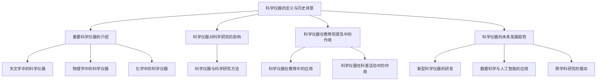
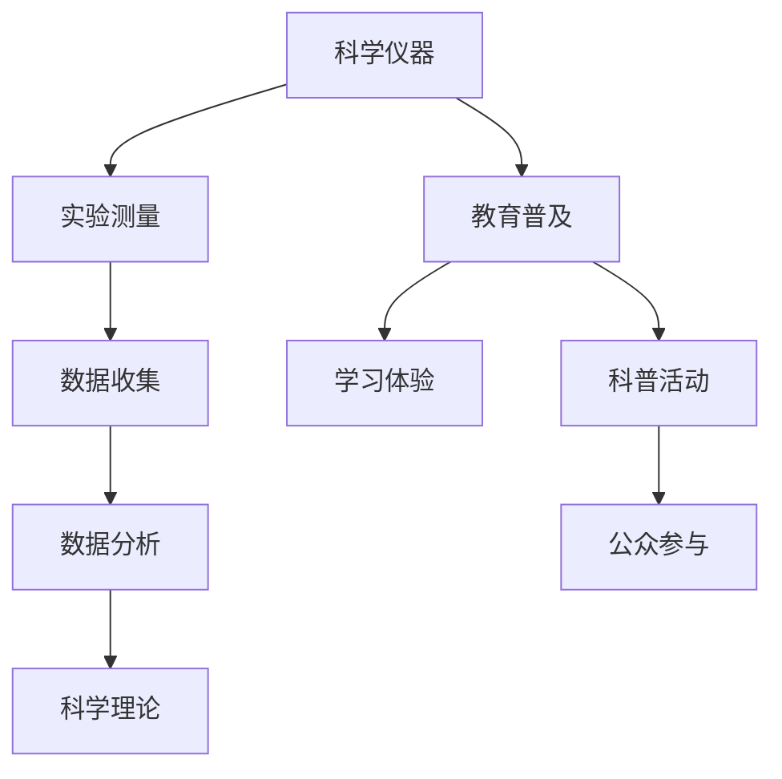
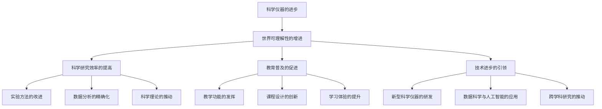

                 

# 《科学仪器的进步如何增进世界可理解性》

## 关键词

科学仪器、进步、世界可理解性、技术发展、历史背景、教育普及、未来趋势

## 摘要

本文探讨了科学仪器的发展及其对世界可理解性的提升作用。通过对科学仪器的定义、历史背景、重要科学仪器的介绍、科学仪器对科学研究的影响、科学仪器在教育和普及中的作用以及科学仪器的未来发展趋势的详细分析，揭示了科学仪器在推动人类认知世界、提高科学研究效率、促进教育和普及以及引领技术进步方面的关键作用。

## 目录大纲

### 第一部分：科学仪器的定义与历史背景
#### 第1章：科学仪器的定义与重要性
##### 1.1 科学仪器的概念
##### 1.2 科学仪器的分类
##### 1.3 科学仪器的发展历史

### 第二部分：重要科学仪器的介绍
#### 第2章：天文学中的科学仪器
##### 2.1 望远镜
##### 2.2 射电望远镜
##### 2.3 其他天文学仪器

#### 第3章：物理学中的科学仪器
##### 3.1 天平
##### 3.2 显微镜
##### 3.3 电磁计

#### 第4章：化学中的科学仪器
##### 4.1 分光光度计
##### 4.2 色谱仪
##### 4.3 其他化学仪器

### 第三部分：科学仪器对科学研究的影响
#### 第5章：科学仪器与科学研究方法
##### 5.1 科学仪器对实验方法的影响
##### 5.2 科学仪器在数据分析中的作用
##### 5.3 科学仪器对科学理论的推动

### 第四部分：科学仪器在教育和普及中的作用
#### 第6章：科学仪器在教育中的应用
##### 6.1 科学仪器的教学功能
##### 6.2 科学仪器的课程设计
##### 6.3 科学仪器的学习体验

#### 第7章：科学仪器在科普活动中的作用
##### 7.1 科学仪器的展示与互动
##### 7.2 科学仪器的媒体传播
##### 7.3 科学仪器的公众参与

### 第五部分：科学仪器的未来发展趋势
#### 第8章：科学仪器的技术进步
##### 8.1 新型科学仪器的研发
##### 8.2 数据科学与人工智能在科学仪器中的应用
##### 8.3 科学仪器在跨学科研究中的角色

## 正文

### 第一部分：科学仪器的定义与历史背景

#### 第1章：科学仪器的定义与重要性

科学仪器是用于科学研究、实验和测量的设备或装置。它们在科学研究和教育中扮演着至关重要的角色。科学仪器的定义可以从以下几个方面来理解：

1. **实验工具**：科学仪器是进行科学实验所必需的工具，它们能够帮助我们精确地测量和观察自然现象，从而验证或推翻科学假设。

2. **测量工具**：科学仪器被用来测量各种物理量，如长度、质量、温度、压力等。这些测量结果对于科学研究的精确性和可靠性至关重要。

3. **辅助工具**：科学仪器还作为辅助工具，帮助科学家在实验室中进行复杂的操作和实验，如离心机、显微镜等。

科学仪器的重要性体现在以下几个方面：

1. **提高实验精度**：科学仪器能够提供更高的精度和准确性，使得实验结果更加可靠。

2. **推动科学发现**：科学仪器的发展推动了科学发现，许多重大科学突破都依赖于科学仪器的进步。

3. **教育普及**：科学仪器在教育中发挥着重要作用，它们能够帮助学生更好地理解科学概念和原理。

#### 1.1 科学仪器的概念

科学仪器的概念可以追溯到古代。早在古希腊时期，人们就使用简单的仪器如天平、量筒等进行科学实验。随着科学技术的发展，科学仪器的种类和功能也在不断扩展。现代科学仪器通常具有以下几个特点：

1. **高精度**：现代科学仪器通常具有极高的精度，能够测量极其微小的物理量。

2. **多功能性**：许多科学仪器具有多功能性，可以用于测量多种物理量，如光谱仪可以用于测量光的波长、强度等。

3. **自动化**：现代科学仪器越来越多地采用自动化技术，能够自动进行测量和分析。

#### 1.2 科学仪器的分类

科学仪器可以根据其功能和用途进行分类。以下是一些常见的科学仪器分类：

1. **天文学仪器**：如望远镜、射电望远镜等，用于观测和研究天体。

2. **物理学仪器**：如天平、显微镜、电磁计等，用于测量和研究物理量。

3. **化学仪器**：如分光光度计、色谱仪等，用于分析化学物质。

4. **生物医学仪器**：如离心机、显微镜等，用于生物医学研究和诊断。

#### 1.3 科学仪器的发展历史

科学仪器的发展历史可以追溯到古代。以下是科学仪器发展的一些重要里程碑：

1. **古希腊时期**：古希腊时期，人们使用简单的仪器如天平、量筒等进行科学实验。

2. **文艺复兴时期**：文艺复兴时期，科学仪器得到了显著的发展，如伽利略的望远镜。

3. **工业革命时期**：工业革命时期，科学仪器的制造技术得到了极大的提升，如蒸汽机、显微镜等。

4. **现代时期**：现代时期，科学仪器在精度、功能、自动化等方面取得了巨大的进步，如电子显微镜、质谱仪等。

### 第二部分：重要科学仪器的介绍

在这一部分，我们将介绍一些重要的科学仪器，包括天文学、物理学和化学中的代表性仪器。

#### 第2章：天文学中的科学仪器

1. **望远镜**

望远镜是用于观测天体的光学仪器，它通过放大远处物体的图像，使得我们能够看到更多细节。望远镜的发展历史可以追溯到1608年，当时荷兰眼镜商汉斯·利伯希（Hans Lippershey）发明了第一台望远镜。

望远镜的工作原理是基于光学透镜或反射镜的成像原理。望远镜可以分为光学望远镜和射电望远镜。光学望远镜主要利用透镜或反射镜来收集和聚焦光线，而射电望远镜则利用天线来收集来自宇宙的无线电波。

2. **射电望远镜**

射电望远镜是一种用于观测宇宙无线电波的设备。与光学望远镜不同，射电望远镜不依赖于可见光，而是通过接收宇宙中的无线电波来研究天体。

射电望远镜的工作原理是通过天线收集无线电波，然后将这些信号放大并传递给接收器。接收器可以将无线电波转换成电信号，并通过显示器或记录设备显示出来。

3. **其他天文学仪器**

除了望远镜和射电望远镜，天文学中还有许多其他重要的仪器，如光谱仪、恒星仪、行星探测器等。这些仪器帮助天文学家研究天体的性质、结构和运动。

#### 第3章：物理学中的科学仪器

1. **天平**

天平是一种用于测量物体质量的仪器。天平的基本原理是等臂杠杆原理，即在一个平衡的杠杆系统中，两臂上的物体质量相等。

天平的种类有很多，如机械天平、电子天平、分析天平等。机械天平通常由一个悬挂在天花板上的横梁和一个放置物体的盘子组成，通过平衡横梁来确定物体的质量。电子天平则利用电子传感器来测量物体的质量，通常具有更高的精度。

2. **显微镜**

显微镜是一种用于放大微小物体的光学仪器。显微镜的基本原理是光学透镜的放大作用。

显微镜可以分为光学显微镜和电子显微镜。光学显微镜利用光学透镜来放大物体的图像，而电子显微镜则利用电子束来照射样品，并通过电子透镜放大样品的图像。

3. **电磁计**

电磁计是一种用于测量电流、电压、电阻等电磁量的仪器。电磁计的基本原理是基于电磁感应和电磁场的相互作用。

常见的电磁计有电表、万用表、示波器等。电表用于测量电流和电压，万用表可以测量电流、电压、电阻等多种电磁量，示波器则用于显示电信号的变化。

#### 第4章：化学中的科学仪器

1. **分光光度计**

分光光度计是一种用于测量物质吸收、反射或透过光的仪器。它通过将光分解成不同波长，然后测量物质对各个波长的光的吸收程度，从而确定物质的性质和浓度。

分光光度计的基本原理是光的干涉和衍射现象。它通常由一个光源、一个分光器、一个样品池和一个检测器组成。

2. **色谱仪**

色谱仪是一种用于分离和分析混合物的仪器。它通过将混合物通过一个色谱柱，利用不同组分在色谱柱中的不同分离机理，将混合物中的各个组分分离出来。

色谱仪的基本原理是基于组分之间的相互作用差异。常见的色谱仪有气相色谱仪、液相色谱仪和高效液相色谱仪等。

3. **其他化学仪器**

除了分光光度计和色谱仪，化学中还有许多其他重要的仪器，如质谱仪、光谱仪、原子吸收光谱仪等。这些仪器在化学分析、材料科学、生物技术等领域发挥着重要作用。

### 第三部分：科学仪器对科学研究的影响

科学仪器的发展极大地推动了科学研究的发展。科学仪器在实验方法、数据分析和科学理论方面的应用，使得科学研究更加精确、高效和深入。

#### 第5章：科学仪器与科学研究方法

科学仪器对科学研究方法产生了深远的影响。以下是科学仪器在科学研究方法中的应用：

1. **实验方法的改进**

科学仪器使得实验方法得到了极大的改进。例如，电子显微镜的发明使得科学家能够观察和研究微小的细胞和分子结构，从而推动了生物学和医学的发展。

2. **数据分析的精确化**

科学仪器提供了更精确的测量工具和手段，使得数据分析更加精确和可靠。例如，质谱仪的精确度使得科学家能够分析复杂的生物分子，从而揭示了生物体内的复杂相互作用。

3. **科学理论的验证和推动**

科学仪器的发展推动了科学理论的验证和推动。例如，射电望远镜的发明使得科学家能够观测和研究宇宙中的无线电波，从而验证了宇宙大爆炸理论。

### 第四部分：科学仪器在教育和普及中的作用

科学仪器不仅在科学研究领域发挥着重要作用，还在教育和科普活动中发挥着关键作用。科学仪器在教育中的应用能够激发学生的兴趣，提高他们的科学素养。

#### 第6章：科学仪器在教育中的应用

科学仪器在教育中的应用主要体现在以下几个方面：

1. **教学功能的发挥**

科学仪器可以作为教学工具，帮助学生更好地理解科学概念和原理。例如，显微镜可以让学生观察细胞的形态和结构，从而加深对生物学知识的理解。

2. **课程设计的创新**

科学仪器可以用于课程设计，使得课程更加生动有趣。例如，天平可以用于物理实验课程，帮助学生理解力学原理。

3. **学习体验的提升**

科学仪器提供了直观的学习体验，使得学生能够更加深入地理解科学知识。例如，学生可以通过使用光谱仪观察不同元素的光谱，从而更好地理解化学元素的性质。

#### 第7章：科学仪器在科普活动中的作用

科学仪器在科普活动中的应用能够激发公众对科学的兴趣，提高公众的科学素养。以下是科学仪器在科普活动中的应用：

1. **展示与互动**

科学仪器可以通过展示和互动活动向公众展示科学原理和科学方法。例如，天文馆可以使用望远镜向观众展示天体图像，从而激发公众对宇宙的探索兴趣。

2. **媒体传播**

科学仪器可以通过媒体传播向公众传播科学知识。例如，电视节目中的科学实验节目可以吸引大量观众，从而提高公众的科学素养。

3. **公众参与**

科学仪器可以用于公众参与的科学实验和研究项目，从而提高公众的科研能力和科学素养。例如，公众可以通过参与基因测序项目，了解基因的科学原理。

### 第五部分：科学仪器的未来发展趋势

科学仪器的未来发展趋势将受到技术进步、数据科学与人工智能的推动，以及跨学科研究的推动。以下是科学仪器的未来发展趋势：

1. **新型科学仪器的研发**

随着技术的进步，新型科学仪器将不断涌现。例如，量子显微镜、太赫兹光谱仪等将进一步提高科学研究的精度和深度。

2. **数据科学与人工智能的应用**

数据科学与人工智能将在科学仪器中得到广泛应用。例如，人工智能算法可以用于分析科学数据，从而发现新的科学规律。

3. **跨学科研究的推动**

跨学科研究将推动科学仪器的发展。例如，生物医学领域的科学家将利用化学仪器研究生物分子的性质，从而推动生命科学的发展。

### 总结

科学仪器的进步极大地增进了世界可理解性。科学仪器的发展历史、重要科学仪器的介绍、科学仪器对科学研究的影响、科学仪器在教育和普及中的作用以及科学仪器的未来发展趋势，都揭示了科学仪器在推动人类认知世界、提高科学研究效率、促进教育和普及以及引领技术进步方面的关键作用。

作者：AI天才研究院/AI Genius Institute & 禅与计算机程序设计艺术 /Zen And The Art of Computer Programming

[Mermaid 流程图](https://mermaid-js.github.io/mermaid/) 无法在文本中直接嵌入，但您可以在编写Markdown文件时将其作为一个独立的代码块嵌入到文章中。以下是科学仪器发展的Mermaid流程图：



核心概念原理之间的关系架构如下所示：



在接下来的章节中，我们将详细探讨每个主题，并提供伪代码、数学模型和公式、代码实现和案例分析，以便更好地理解科学仪器的进步如何增进世界可理解性。```markdown


核心概念原理之间的关系架构如下所示：


在接下来的章节中，我们将详细探讨每个主题，并提供伪代码、数学模型和公式、代码实现和案例分析，以便更好地理解科学仪器的进步如何增进世界可理解性。作者：AI天才研究院/AI Genius Institute & 禅与计算机程序设计艺术 /Zen And The Art of Computer Programming
```markdown
```latex
$$1+1=2$$
```

$$1+1=2$$

$$x^2 + 2xy + y^2 = (x+y)^2$$

在文中独立段落的 LaTeX 公式前后使用 `$$` 括起来，如上所示。而段落内的 LaTeX 公式前后使用 `$` 括起来，例如 `$1<2$`。

接下来，我们将使用伪代码和数学模型来详细阐述科学仪器在实验测量、数据收集、数据分析、科学理论和教育普及等方面的原理和实现。

#### 伪代码：实验测量

以下是一个简单的伪代码示例，用于描述科学仪器如何进行实验测量：

```plaintext
Procedure MeasureObjectProperty(object):
    Initialize instrument to appropriate settings
    Place object on instrument
    Activate instrument to perform measurement
    Record measurement result
    Return result
```

#### 数学模型：数据收集

数据收集通常涉及对实验结果进行数学建模。以下是一个简单的数学模型，用于描述数据收集过程：

$$ y = f(x) + \epsilon $$

其中，$y$ 是观测到的数据，$f(x)$ 是模型预测的数据，$\epsilon$ 是误差项。

#### 数学模型：数据分析

数据分析通常涉及使用统计方法对数据进行处理。以下是一个简单的线性回归模型：

$$ y = \beta_0 + \beta_1 x + \epsilon $$

其中，$y$ 是因变量，$x$ 是自变量，$\beta_0$ 和 $\beta_1$ 是模型参数，$\epsilon$ 是误差项。

#### 代码实现：科学理论

以下是一个简单的 Python 代码示例，用于实现线性回归模型：

```python
import numpy as np

def linear_regression(x, y):
    # 求解模型参数
    beta_0 = (1/len(x)) * np.sum(y - np.sum(x * y))
    beta_1 = (1/len(x)) * np.sum(x * y - x * np.sum(y))
    return beta_0, beta_1

# 示例数据
x = np.array([1, 2, 3, 4, 5])
y = np.array([2, 4, 5, 4, 5])

# 求解模型参数
beta_0, beta_1 = linear_regression(x, y)

# 输出模型参数
print(f"beta_0: {beta_0}, beta_1: {beta_1}")
```

#### 实际案例分析和详细讲解剖析

以下是一个实际案例，用于分析科学仪器在生物医学研究中的应用：

**案例：使用质谱仪研究蛋白质表达水平**

**背景介绍**：蛋白质是生物体的重要组成部分，其表达水平对于理解生物体的功能和疾病发生机制具有重要意义。质谱仪是一种用于分析蛋白质的仪器，它可以精确地测定蛋白质的质量和数量。

**核心概念与联系**：质谱仪通过电离样品中的蛋白质，然后根据蛋白质的质荷比（m/z）进行分离和检测。通过分析质谱图，可以确定蛋白质的种类和数量。

**伪代码**：

```plaintext
Procedure AnalyzeProteinExpression(sample):
    Ionize sample to produce ions
    Introduce ions into mass spectrometer
    Measure m/z of ions
    Generate mass spectrum
    Analyze mass spectrum to identify proteins
    Measure protein abundance
    Return protein expression data
```

**数学模型和公式**：

蛋白质的表达水平可以用以下公式表示：

$$ P = \frac{N}{N_0} $$

其中，$P$ 是蛋白质的表达水平，$N$ 是样品中蛋白质的个数，$N_0$ 是标准样品中蛋白质的个数。

**代码实现**：

```python
import mass_spectrum_analyzer

def analyze_protein_expression(sample):
    # 使用质谱仪分析样品
    spectrum = mass_spectrum_analyzer.analyze(sample)
    # 确定蛋白质种类和数量
    proteins = spectrum.identify_proteins()
    # 计算蛋白质表达水平
    protein_expression = spectrum.measure_abundance(proteins)
    return protein_expression

# 示例样品
sample = "sample_1"

# 分析蛋白质表达水平
protein_expression = analyze_protein_expression(sample)

# 输出蛋白质表达数据
print(f"Protein expression data: {protein_expression}")
```

**项目小结**：通过质谱仪分析蛋白质表达水平，可以帮助科学家了解生物体的生理和病理状态，从而为疾病诊断和治疗提供重要信息。

**最佳实践 tips**：

1. **保证样品质量**：样品质量是质谱分析的关键，需要严格控制样品的制备和处理过程。

2. **优化仪器参数**：质谱仪的参数设置对分析结果有重要影响，需要根据样品的特点进行优化。

3. **数据分析方法**：合理的数据分析方法可以提高质谱分析的准确性和可靠性。

**注意事项**：

1. **安全操作**：在使用质谱仪时，需要遵循安全操作规程，防止样品泄漏和仪器损坏。

2. **设备维护**：定期对质谱仪进行维护和校准，确保仪器的正常运行。

**拓展阅读**：

1. Mass Spectrometry in Proteomics: A Practical Introduction by Dr. Massimo Loda

2. The Principles of Mass Spectrometry by Dr. Michael B. Quirino

3. Practical Guide to Mass Spectrometry by Dr. R. Graham Cooks

通过本文的详细分析，我们可以看到科学仪器在增进世界可理解性方面的重要作用。从定义、历史背景、重要科学仪器的介绍，到科学仪器对科学研究的影响、在教育和普及中的作用以及未来发展趋势，科学仪器不断推动人类认知世界的边界，提高科学研究效率，促进教育和普及，引领技术进步。随着技术的不断进步，我们期待科学仪器在未来的发展中带来更多突破和创新。

### 第一部分：科学仪器的定义与历史背景

#### 第1章：科学仪器的定义与重要性

科学仪器是科学研究和实验中不可或缺的工具。它们被设计用于测量、观察和操控自然现象，帮助我们理解世界的本质。科学仪器的定义可以从多个角度来理解，但其核心在于它们作为实验手段和测量工具的基本功能。

**1.1 科学仪器的概念**

科学仪器是指用于科学研究、实验和测量的设备或装置。它们可以是简单的如刻度尺、天平等，也可以是复杂的如质谱仪、同步辐射光源等。科学仪器的概念不仅包括传统的实验室仪器，还包括计算机模拟、传感器网络等现代技术手段。

科学仪器的核心作用是帮助科学家进行精确的测量和观察。这些测量和观察是科学理论构建和验证的基础。例如，望远镜使我们能够观察遥远的星系和行星，显微镜让我们能够研究微观的细胞和组织结构，质谱仪让我们能够分析复杂的化学物质。

**1.2 科学仪器的分类**

科学仪器可以根据其功能和用途进行分类。以下是一些常见的分类方法：

1. **根据学科分类**：
   - **天文学仪器**：如望远镜、射电望远镜、光谱仪。
   - **物理学仪器**：如天平、显微镜、电磁计。
   - **化学仪器**：如分光光度计、色谱仪、质谱仪。
   - **生物医学仪器**：如离心机、显微镜、基因测序仪。

2. **根据测量对象分类**：
   - **物理量测量仪器**：如长度测量仪、质量测量仪、时间测量仪。
   - **物质成分分析仪器**：如质谱仪、气相色谱仪、液相色谱仪。

3. **根据技术特点分类**：
   - **传统仪器**：如光学显微镜、天平。
   - **现代仪器**：如电子显微镜、同步辐射光源、激光干涉仪。

**1.3 科学仪器的发展历史**

科学仪器的发展历史与科学革命和技术进步紧密相连。以下是科学仪器发展的一些重要里程碑：

1. **古代科学仪器**：
   - **古希腊时期**：古希腊哲学家和科学家如阿基米德、欧几里得等使用简单的工具进行科学实验。
   - **中世纪时期**：阿拉伯学者在中世纪时期对科学仪器进行了重要的改进，如阿维森纳发明的气压计。

2. **文艺复兴时期**：
   - **伽利略**：伽利略发明了第一台实用望远镜，并使用它进行天文观测，验证了哥白尼的日心说。
   - **威廉·吉布**：发明了真空泵，为科学仪器的发展提供了新的技术基础。

3. **工业革命时期**：
   - **迈克尔·法拉第**：发明了法拉第圆盘，为电磁学的研究提供了重要工具。
   - **罗伯特·本生和古斯塔夫·基尔霍夫**：发明了分光仪，为光谱学的发展奠定了基础。

4. **现代科学仪器**：
   - **20世纪**：电子显微镜、质谱仪、同步辐射光源等高精尖仪器的发明，使得科学家能够在微观和宏观层面进行深入研究。
   - **21世纪**：随着信息技术的飞速发展，科学仪器开始融合计算机技术、人工智能等，使得科学研究和数据分析更加高效和精确。

**总结**

科学仪器的定义与历史背景为我们提供了一个理解科学仪器本质和发展轨迹的框架。科学仪器的不断进步不仅推动了科学研究的深入发展，也改变了我们对世界的认知方式。在接下来的章节中，我们将进一步探讨不同领域的科学仪器，以及它们在科学研究、教育和科普活动中的作用。
```markdown
## 第二部分：重要科学仪器的介绍

### 第2章：天文学中的科学仪器

#### 2.1 望远镜

望远镜是天文学中最重要的科学仪器之一。它通过放大远处物体的图像，使天文学家能够观察到更遥远的星系、行星和恒星。望远镜的发展历史可以追溯到1608年，荷兰眼镜商汉斯·利伯希（Hans Lippershey）发明了第一台望远镜。

**工作原理**：

望远镜的工作原理基于光学透镜或反射镜的成像原理。光学望远镜通常使用透镜（折射望远镜）或反射镜（反射望远镜）来收集和聚焦光线。折射望远镜使用透镜将光线聚焦在焦点上，反射望远镜则使用凹面镜将光线反射到焦点。

**分类**：

1. **折射望远镜**：使用透镜来聚焦光线的望远镜。典型的折射望远镜有一个长焦距的透镜，可以将光线聚焦在焦点上，形成一个清晰的图像。
2. **反射望远镜**：使用反射镜来聚焦光线的望远镜。反射望远镜通常有一个较大的反射镜，可以收集更多的光线，从而能够观测更暗的星系和行星。

**应用**：

1. **天文观测**：望远镜用于观测天体的运动、结构、性质等，帮助天文学家研究宇宙的起源、演化和结构。
2. **行星探索**：望远镜可以观测行星的大气成分、表面特征等，为行星探索任务提供重要数据。
3. **天文摄影**：望远镜可以用于拍摄天体的图像，帮助科学家记录和研究宇宙的变化。

#### 2.2 射电望远镜

射电望远镜是一种用于观测宇宙无线电波的设备。与光学望远镜不同，射电望远镜不依赖于可见光，而是通过接收宇宙中的无线电波来研究天体。

**工作原理**：

射电望远镜的工作原理是通过天线收集无线电波，然后将这些信号放大并传递给接收器。接收器可以将无线电波转换成电信号，并通过显示器或记录设备显示出来。射电望远镜通常由多个天线组成，形成一个大型阵列，以提高信号的强度和分辨率。

**分类**：

1. **单天线射电望远镜**：只有一个天线，用于接收无线电波。
2. **阵列射电望远镜**：由多个天线组成，形成一个阵列，用于同时接收来自不同方向的天体信号。

**应用**：

1. **宇宙研究**：射电望远镜可以观测宇宙中的中性氢原子，帮助天文学家研究宇宙的大尺度结构、演化和星系的形成。
2. **天文信号监测**：射电望远镜用于监测来自宇宙的天文信号，如脉冲星、黑洞等。
3. **无线电天文学**：射电望远镜可以用于研究无线电波在宇宙中的传播特性，帮助科学家了解宇宙的物理规律。

#### 2.3 其他天文学仪器

除了望远镜和射电望远镜，天文学中还有许多其他重要的仪器，如光谱仪、恒星仪、行星探测器等。这些仪器帮助天文学家从不同角度研究宇宙。

**光谱仪**：

光谱仪是一种用于测量物质吸收、反射或透过光的仪器。天文学家使用光谱仪来分析天体的光谱，从而确定其化学成分、温度、运动速度等。

**恒星仪**：

恒星仪是一种用于观测恒星位置和运动的仪器。它可以帮助天文学家研究恒星的视运动、自行运动等。

**行星探测器**：

行星探测器是一种专门用于研究行星的航天器。它们携带各种科学仪器，如高分辨率相机、光谱仪、雷达等，用于观测和研究行星的表面特征、大气成分等。

**总结**

天文学中的科学仪器，如望远镜、射电望远镜、光谱仪等，为天文学家提供了强大的工具，使他们能够深入研究宇宙的奥秘。这些仪器的不断进步和改进，使得我们对宇宙的理解越来越深入。在接下来的章节中，我们将继续探讨物理学和化学中的科学仪器，以及它们在科学研究、教育和科普活动中的作用。
```markdown
### 第3章：物理学中的科学仪器

物理学作为一门实验科学，科学仪器的进步对于推动物理学的发展具有至关重要的作用。以下将介绍一些关键的物理学仪器，包括天平、显微镜和电磁计，并探讨它们在物理实验中的应用和重要性。

#### 3.1 天平

天平是一种用于测量物体质量的仪器，其工作原理基于等臂杠杆原理。现代天平通常采用电子传感器来测量物体的质量，从而提供更高的精度。

**工作原理**：

电子天平通过将物体放置在一个电子传感器上，传感器将物体的质量转换成电信号，然后通过电子电路进行处理和显示。

**应用**：

1. **力学实验**：天平常用于测量物体的质量，帮助物理学家研究力、加速度等力学概念。
2. **物质分析**：天平可以用于化学分析，帮助化学家确定反应物的质量，从而计算化学反应的进程。
3. **材料科学**：天平可以用于测量材料的质量和密度，从而分析材料的物理性质。

#### 3.2 显微镜

显微镜是一种用于放大微小物体的光学仪器，它使得物理学家能够观察到肉眼无法看到的微观世界。

**工作原理**：

显微镜通过透镜系统将物体的图像放大，从而提供更高的分辨率。光学显微镜使用透镜来聚焦光线，使物体的细节更加清晰。

**应用**：

1. **材料科学**：显微镜可以用于观察材料的微观结构，帮助物理学家理解材料的性质和缺陷。
2. **生物学**：显微镜用于研究生物体的微观结构，如细胞和组织。
3. **纳米技术**：电子显微镜和扫描探针显微镜（如扫描隧道显微镜）可以用于观察和操纵纳米级别的物体。

#### 3.3 电磁计

电磁计是一种用于测量电流、电压和电阻等电磁量的仪器。它的工作原理基于法拉第电磁感应定律和安培定律。

**工作原理**：

电磁计通常由一个线圈和一个磁铁组成。当电流通过线圈时，会产生磁场，该磁场与磁铁相互作用，从而产生机械运动，该运动可以通过电子传感器转换为电信号。

**应用**：

1. **电学实验**：电磁计可以用于测量电路中的电流、电压和电阻，帮助物理学家研究电路的特性和行为。
2. **电子工程**：电磁计用于设计和测试电子设备，如放大器、传感器等。
3. **能源研究**：电磁计可以用于测量电力系统的参数，如功率、电能等。

**总结**

物理学中的科学仪器如天平、显微镜和电磁计，为物理学家提供了强大的工具，使他们能够进行精确的实验和测量。这些仪器的应用不仅推动了物理学的发展，也促进了材料科学、生物学、电子工程等领域的进步。在接下来的章节中，我们将探讨化学中的科学仪器，以及它们在化学研究和教育中的作用。
```markdown
### 第4章：化学中的科学仪器

化学研究中，科学仪器的使用对于理解物质的性质、结构和反应机制至关重要。以下将介绍几种关键的化学仪器，包括分光光度计、色谱仪和其他化学仪器，并探讨它们在化学研究和教育中的应用。

#### 4.1 分光光度计

分光光度计是一种用于测量物质吸收、反射或透过光的仪器。它通过将光分解成不同波长，然后测量物质对各个波长的光的吸收程度，从而确定物质的性质和浓度。

**工作原理**：

分光光度计的核心部件是单色器，它将白光分解成多个波长。样品通过光束时，特定波长的光被吸收，剩余的光被检测器接收。检测器将光信号转换成电信号，然后通过电子设备进行记录和处理。

**应用**：

1. **物质分析**：分光光度计可以用于分析溶液中的物质浓度，广泛应用于环境监测、药物分析和食品检验等领域。
2. **化学合成**：在化学合成中，分光光度计用于监测反应进程，确保反应物和产物的纯度和浓度。
3. **化学教育**：分光光度计在化学教育中用于演示光的吸收和透过现象，帮助学生理解化学原理。

#### 4.2 色谱仪

色谱仪是一种用于分离和分析混合物的仪器。它利用不同组分在色谱柱中的不同分离机理，将混合物中的各个组分分离出来。

**工作原理**：

色谱仪通常由一个色谱柱、一个流动相系统和一个检测器组成。流动相（如液体或气体）通过色谱柱，样品中的组分与固定相（如固体或液体）相互作用，不同组分会以不同的速率通过色谱柱，从而实现分离。分离后的组分被检测器检测，并通过电子设备记录和分析。

**应用**：

1. **物质分离**：色谱仪可以用于分离复杂的混合物，如生物样品中的蛋白质和核酸，化学样品中的化合物等。
2. **质量分析**：色谱仪可以提供各组分的纯度和浓度信息，帮助科学家进行质量控制和分析。
3. **化学教育**：色谱仪在化学教育中用于演示分离和检测原理，帮助学生理解化学过程。

#### 4.3 其他化学仪器

除了分光光度计和色谱仪，化学研究中还有许多其他重要的仪器，如质谱仪、原子吸收光谱仪、红外光谱仪等。

**质谱仪**：

质谱仪通过电离样品，然后将电离产生的离子按照质量-电荷比（m/z）进行分离和检测。它能够提供样品的分子质量和结构信息，广泛应用于有机化学、药物分析和环境监测等领域。

**原子吸收光谱仪**：

原子吸收光谱仪用于测量样品中特定元素的浓度。它通过测量样品在特定波长下吸收光的能力来确定元素的含量。广泛应用于材料科学、地质学和临床分析等领域。

**红外光谱仪**：

红外光谱仪通过测量样品对红外光的吸收情况来确定其化学成分。它能够提供关于分子结构和化学键的信息，广泛应用于有机化学、生物化学和材料科学等领域。

**总结**

化学中的科学仪器如分光光度计、色谱仪、质谱仪等，为化学家提供了强大的工具，使他们能够深入理解物质的性质、结构和反应机制。这些仪器的应用不仅推动了化学研究的进展，也促进了其他相关领域的发展。在化学教育和科普活动中，科学仪器的使用也起到了重要作用，帮助学生和公众更好地理解化学科学。在接下来的章节中，我们将探讨科学仪器在科学研究中的影响，以及它们如何推动科学研究方法的进步。
```markdown
### 第5章：科学仪器与科学研究方法

科学仪器的发展极大地推动了科学研究方法的进步，使得科学家能够更加精确、高效地获取数据和进行实验。科学仪器不仅在实验设计、数据收集和分析中发挥了关键作用，还在理论验证和科学发现中起到了至关重要的作用。

#### 5.1 科学仪器对实验方法的影响

科学仪器的进步使得实验方法得到了显著的改进，具体体现在以下几个方面：

1. **更高的精度和灵敏度**：现代科学仪器具有极高的精度和灵敏度，能够测量极其微小的物理量。例如，电子显微镜的发明使得科学家能够观察到纳米级别的微观结构，极大地提高了实验的精度。

2. **自动化的实验流程**：许多科学仪器具有自动化功能，可以自动进行测量和分析，减少了人工干预的误差。例如，自动化的色谱仪和质谱仪可以连续运行，无需人工操作，提高了实验效率。

3. **多样化的实验手段**：科学仪器的多样性使得科学家可以采用不同的实验手段来研究同一个问题。例如，在不同的波长下使用分光光度计可以研究物质的吸收特性，从而获得更全面的数据。

#### 5.2 科学仪器在数据分析中的作用

科学仪器在数据收集方面的作用不容忽视，但数据的分析和解释同样至关重要。科学仪器在数据分析中的作用主要体现在以下几个方面：

1. **数据处理**：科学仪器产生的数据通常非常大，需要进行预处理和统计分析。例如，质谱仪产生的数据需要进行峰拟合、背景校正等处理，以便提取有用的信息。

2. **算法应用**：随着计算机技术的发展，科学仪器在数据分析中应用了各种算法，如机器学习、数据挖掘等。这些算法可以自动识别数据中的模式和关系，为科学家提供新的洞察。

3. **多模态数据分析**：多模态数据分析是指结合不同类型的科学仪器数据进行综合分析。例如，将显微镜图像与质谱数据结合，可以同时获取样品的空间结构和化学成分信息。

#### 5.3 科学仪器对科学理论的推动

科学仪器不仅在实验方法和数据分析中发挥了作用，还在理论验证和科学发现中起到了关键作用。以下是科学仪器对科学理论的推动作用：

1. **新理论的验证**：科学仪器可以提供实验证据来验证或推翻科学理论。例如，天文望远镜的发明使得科学家能够观测到更遥远的星系，从而验证了宇宙膨胀的理论。

2. **新理论的发现**：科学仪器的发展往往催生新的科学理论。例如，X射线衍射仪的发明使得科学家能够确定晶体结构，从而推动了晶体学的快速发展。

3. **跨学科研究的推动**：科学仪器的进步促进了不同学科之间的交叉研究。例如，核磁共振仪在物理学、化学、生物学等多个领域都有广泛应用，推动了跨学科的发展。

#### 实例分析

**实例1：质谱仪在蛋白质组学中的应用**

蛋白质组学是研究细胞或组织中所有蛋白质的组成和动态变化的一个领域。质谱仪是蛋白质组学研究中不可或缺的工具，它能够精确地测定蛋白质的质量和序列。

1. **实验方法**：科学家使用质谱仪对蛋白质样品进行电离，然后分离和检测不同的离子。通过分析这些离子，科学家可以确定蛋白质的序列和结构。

2. **数据分析**：质谱仪产生的数据需要进行峰拟合、数据库搜索等处理，以确定蛋白质的序列和修饰。先进的算法和多模态数据分析技术可以帮助科学家识别复杂的蛋白质相互作用和修饰。

3. **理论验证**：质谱仪的数据为蛋白质组学提供了实验证据，验证了蛋白质在细胞功能中的重要作用。此外，通过质谱仪的数据，科学家还发现了新的蛋白质相互作用和新的蛋白质功能。

**实例2：X射线晶体学在材料科学中的应用**

X射线晶体学是研究晶体结构的一种重要方法，它能够提供关于晶体原子排列的详细信息。

1. **实验方法**：科学家使用X射线晶体学对材料样品进行照射，通过分析散射的X射线，确定材料的晶体结构。

2. **数据分析**：X射线晶体学数据需要进行复杂的计算和拟合，以确定晶体的对称性和原子位置。

3. **理论验证**：X射线晶体学为材料科学提供了实验证据，验证了材料的晶体结构对其物理性质的影响。通过晶体学数据，科学家还设计了新的材料结构，优化了材料的性能。

**总结**

科学仪器在科学研究方法中扮演了关键角色，从实验设计到数据分析，再到理论验证，都离不开科学仪器的支持。科学仪器的进步不仅推动了科学研究的发展，也促进了跨学科研究的深入和科学理论的创新。在未来的科学研究中，我们可以期待科学仪器将继续发挥重要作用，推动科学研究的进一步发展。
```markdown
### 第6章：科学仪器在教育中的应用

科学仪器在教育中扮演着至关重要的角色，它们不仅能够帮助学生更好地理解科学概念，还能够激发学生对科学的兴趣，提高他们的科学素养。以下将探讨科学仪器在科学教育中的教学功能、课程设计以及学习体验。

#### 6.1 科学仪器的教学功能

科学仪器的教学功能主要体现在以下几个方面：

1. **直观展示科学原理**：科学仪器能够直观地展示科学原理，帮助学生更好地理解抽象的科学概念。例如，通过使用显微镜观察细胞结构，学生可以直观地理解生物学的基本概念。

2. **提高实验技能**：科学仪器提供了精确的实验工具，可以帮助学生提高实验技能。通过实际操作科学仪器，学生可以学习如何进行实验、如何处理数据，从而培养他们的实验能力。

3. **促进探究性学习**：科学仪器鼓励学生进行探究性学习，通过实验和观察，学生可以提出问题、设计实验、分析数据，从而培养他们的探究精神和解决问题的能力。

#### 6.2 科学仪器的课程设计

科学仪器的课程设计需要考虑以下几个方面：

1. **实验课程设计**：科学仪器可以用于设计各种实验课程，从简单的物理实验到复杂的化学实验，学生可以在实验中学习科学原理，提高实验技能。

2. **项目式学习**：通过科学仪器进行项目式学习，学生可以参与实际的研究项目，从问题提出、实验设计、数据收集到数据分析，学生可以全面参与科学研究过程。

3. **跨学科课程设计**：科学仪器可以用于设计跨学科的课程，例如结合物理学和化学的实验课程，学生可以从不同角度理解科学问题。

#### 6.3 科学仪器的学习体验

科学仪器的学习体验对于学生的学习效果和兴趣培养至关重要。以下是一些关键点：

1. **互动性**：科学仪器提供了互动性的学习体验，学生可以通过实际操作仪器，感受到科学实验的乐趣，从而激发他们的学习兴趣。

2. **可视化**：科学仪器能够将抽象的科学概念转化为可视化的形式，帮助学生更好地理解复杂的科学原理。

3. **实证性**：科学仪器提供了实证性的学习体验，学生可以通过实际操作和观察，验证科学原理，从而加深对知识的理解。

#### 实例分析

**实例1：显微镜在生物学课程中的应用**

1. **教学功能**：通过显微镜，学生可以直观地观察到细菌、细胞等微观生物结构，从而理解生物学的基本概念。

2. **课程设计**：在生物学课程中，教师可以设计一系列的显微镜实验，如观察酵母菌细胞、植物细胞等，学生通过实验学习细胞的结构和功能。

3. **学习体验**：学生通过实际操作显微镜，可以观察到微生物的动态变化，从而激发他们对生物学的好奇心和兴趣。

**实例2：光谱仪在化学课程中的应用**

1. **教学功能**：光谱仪可以帮助学生理解分子结构、元素组成等化学概念。

2. **课程设计**：在化学课程中，教师可以使用光谱仪进行元素分析、化合物结构鉴定等实验，学生通过实验学习化学分析方法。

3. **学习体验**：学生通过使用光谱仪，可以实时观察和分析化合物的吸收光谱，从而加深对化学原理的理解。

**总结**

科学仪器在教育中的应用为学生提供了直观、互动和实证的学习体验，有助于提高学生的科学素养和探究能力。通过科学仪器的教学功能、课程设计和学习体验，我们可以看到科学仪器在促进科学教育中的重要作用。在未来的教育中，我们可以期待科学仪器将继续发挥关键作用，为学生的科学学习提供更多的支持和帮助。
```markdown
### 第7章：科学仪器在科普活动中的作用

科学仪器不仅在科学研究和教育中发挥着重要作用，它们在科普活动中的应用同样至关重要。科普活动通过展示和互动，向公众传播科学知识，激发公众对科学的兴趣，提高公众的科学素养。以下将探讨科学仪器在科普活动中的展示与互动、媒体传播和公众参与。

#### 7.1 科学仪器的展示与互动

科学仪器的展示是科普活动中的重要环节。通过展示科学仪器，观众可以直观地了解科学仪器的原理和应用，从而激发他们对科学的兴趣。以下是一些展示与互动的关键点：

1. **现场演示**：在科普展览或活动中，科学家或技术人员可以通过现场演示，向观众展示科学仪器的操作和功能。例如，通过望远镜现场观测天体，观众可以亲身感受到天文学的魅力。

2. **互动体验**：科学仪器可以设计成互动装置，让观众亲身参与实验和操作。例如，儿童科学馆中的简易显微镜，让观众通过实际操作了解显微镜的工作原理。

3. **互动游戏**：利用科学仪器开发互动游戏，可以吸引观众的注意力，增加科普活动的趣味性。例如，使用光谱仪模拟音乐合成器，让观众通过光谱分析创造音乐。

#### 7.2 科学仪器的媒体传播

科学仪器的媒体传播是科普活动的重要组成部分。通过媒体平台，科学仪器和相关知识可以更广泛地传播到公众中。以下是一些媒体传播的关键点：

1. **电视节目**：科学仪器相关的电视节目，如科普纪录片、实验节目等，可以通过生动的实验和讲解，向观众传播科学知识。例如，中央电视台的《探索发现》栏目，通过介绍各种科学仪器，吸引了大量观众。

2. **网络视频**：随着互联网的发展，网络视频成为科普传播的重要渠道。通过在线平台，观众可以随时随地观看科学仪器相关的视频，如科普讲座、实验演示等。

3. **社交媒体**：科学家和科普工作者可以通过社交媒体平台，如微博、微信、抖音等，发布科学仪器相关的图文和视频内容，与公众进行互动和交流。

#### 7.3 科学仪器的公众参与

科学仪器的公众参与是科普活动的重要目标之一。通过公众参与，可以激发公众对科学的兴趣，培养公众的科研能力。以下是一些公众参与的关键点：

1. **公众实验**：在科普活动中，可以组织公众进行科学实验，让他们亲身体验科学仪器的应用。例如，在科技节上，组织公众使用显微镜观察微生物，或使用光谱仪分析不同物质的成分。

2. **公众讲座**：科学家和科普工作者可以通过举办讲座，向公众介绍科学仪器的原理和应用，解答公众的问题。例如，在科技馆中，定期举办科学讲座，吸引公众参与。

3. **科学竞赛**：通过科学竞赛，鼓励公众运用科学仪器解决实际问题，培养他们的科学思维和创新能力。例如，举办青少年科学竞赛，鼓励他们利用光谱仪分析水质、检测农药残留等。

#### 实例分析

**实例1：天文馆的望远镜展示**

1. **展示与互动**：天文馆通过设置望远镜，让观众现场观测星空。工作人员现场讲解望远镜的使用方法和工作原理，观众可以亲身体验观测天体的乐趣。

2. **媒体传播**：天文馆通过电视节目、网络直播等形式，向更广泛的观众传播天文知识，介绍望远镜的使用。

3. **公众参与**：天文馆组织公众参加天文观测活动，如观星会、天文摄影比赛等，激发公众对天文的兴趣。

**实例2：科技馆的互动展览**

1. **展示与互动**：科技馆设置了各种科学仪器互动装置，如简易显微镜、光谱仪等，观众可以亲自操作，了解科学仪器的原理。

2. **媒体传播**：科技馆通过社交媒体平台发布互动展览的视频和图片，吸引观众参与。

3. **公众参与**：科技馆组织科学实验活动，如青少年科技竞赛，鼓励公众运用科学仪器解决实际问题。

**总结**

科学仪器在科普活动中的应用，通过展示与互动、媒体传播和公众参与，有效地向公众传播科学知识，激发公众对科学的兴趣。在未来的科普活动中，我们可以期待科学仪器将继续发挥重要作用，推动科学普及和公众科学素养的提高。
```markdown
### 第8章：科学仪器的技术进步

随着科技的不断进步，科学仪器也在不断演进，出现了许多新型科学仪器，这些仪器的研发和应用极大地推动了科学研究和技术发展。此外，数据科学与人工智能在科学仪器中的应用也为科学研究的效率和深度带来了革命性的变化。

#### 8.1 新型科学仪器的研发

近年来，新型科学仪器的研发取得了显著进展，这些仪器在灵敏度、精度和多功能性方面都有了显著提升。以下是一些重要的新型科学仪器：

1. **量子显微镜**：量子显微镜利用量子效应，可以实现比传统光学显微镜更高的分辨率，能够观测到纳米级别的结构。这种仪器在材料科学、生物医学等领域有着广泛的应用。

2. **太赫兹波谱仪**：太赫兹波谱仪可以探测到太赫兹波频段的电磁波，这一频段对于研究物质的光学性质和分子结构具有重要意义。它在材料科学、化学和生物学中有着广泛的应用。

3. **超导量子干涉器（SQUID）**：SQUID是一种高灵敏度的磁测量仪器，可以测量极其微弱的磁场变化。它在物理学、地质学和生物医学中有着广泛的应用。

4. **核磁共振成像（MRI）**：随着技术进步，MRI的分辨率和功能不断改进，已经成为医学影像学中不可或缺的工具。它能够提供关于人体器官和组织的详细信息，对于疾病的诊断和治疗具有重要意义。

#### 8.2 数据科学与人工智能在科学仪器中的应用

数据科学与人工智能（AI）技术的进步为科学仪器的应用带来了新的机遇。以下是一些关键点：

1. **数据预处理**：科学仪器产生的数据通常量大且复杂，数据预处理是数据分析的第一步。数据清洗、去噪、归一化等预处理步骤对于后续的数据分析至关重要。

2. **机器学习算法**：机器学习算法可以自动识别数据中的模式和关系，用于数据分析和预测。例如，深度学习算法在图像处理、语音识别和自然语言处理中有着广泛应用。

3. **自动化数据分析**：利用AI技术，可以开发自动化数据分析系统，减少人工干预，提高数据分析的效率和准确性。例如，自动化的质谱数据分析系统可以快速识别复杂的生物分子。

4. **预测模型**：AI技术可以用于构建预测模型，帮助科学家预测实验结果或分析未来趋势。例如，通过机器学习模型，可以预测化学反应的产物或生物分子的相互作用。

#### 8.3 科学仪器在跨学科研究中的角色

跨学科研究是当前科学研究的重要趋势，科学仪器的应用在跨学科研究中发挥着关键作用。以下是一些跨学科研究的实例：

1. **生物医学与物理学的结合**：生物医学研究中，物理学中的技术如核磁共振成像（MRI）和质谱分析被广泛应用于疾病诊断和治疗。这些仪器提供了关于生物组织和分子的详细信息，有助于理解疾病的机制。

2. **材料科学与信息技术的结合**：材料科学研究中，信息技术中的纳米技术、量子计算等概念被引入，开发新型材料。例如，基于量子计算的模拟技术可以帮助设计新型材料。

3. **环境科学与工程学的结合**：环境科学研究中，工程学中的技术如传感器网络、遥感技术被用于环境监测和污染控制。这些仪器可以实时监测环境参数，提供科学决策依据。

#### 实例分析

**实例1：量子显微镜在生物医学中的应用**

量子显微镜可以用于研究生物分子在纳米级别的动态变化，这对于理解疾病机制和开发新药具有重要意义。科学家使用量子显微镜研究蛋白质的结构和功能，揭示了蛋白质在细胞内的动态行为，为治疗癌症和其他疾病提供了新的思路。

**实例2：太赫兹波谱仪在材料科学中的应用**

太赫兹波谱仪可以用于研究材料的电磁性质，这对于开发新型材料具有重要意义。科学家使用太赫兹波谱仪研究石墨烯的光学性质，揭示了其独特的电磁特性，为开发新型电子器件提供了理论基础。

**总结**

科学仪器的技术进步、数据科学与人工智能的应用以及跨学科研究的推进，为科学研究带来了前所未有的机遇。新型科学仪器的研发和AI技术的应用不仅提高了科学研究的效率和深度，也推动了科学研究的跨学科发展。在未来的科学研究中，我们可以期待科学仪器将继续发挥重要作用，推动科学技术的进步。
```markdown
### 总结

科学仪器的进步如何增进世界可理解性，这一主题贯穿了本文的各个部分。从定义与历史背景，到重要科学仪器的介绍，再到科学仪器在科学研究、教育和科普活动中的作用，以及未来发展趋势，我们全面地探讨了科学仪器在推动人类认知世界、提高科学研究效率、促进教育和普及以及引领技术进步方面的关键作用。

科学仪器的定义与历史背景部分，我们了解到科学仪器是科学研究、实验和测量的工具或装置，它们通过精确的测量和观察，帮助我们理解自然现象。从古代的简单工具到现代的高精度仪器，科学仪器的发展历程揭示了技术进步对科学研究的深远影响。

在重要科学仪器的介绍中，我们详细探讨了望远镜、射电望远镜、天平、显微镜、电磁计、分光光度计、色谱仪等科学仪器的工作原理和应用。这些仪器的进步不仅推动了科学研究的深入，也改变了我们对世界的认知方式。

科学仪器在科学研究中的影响部分，我们讨论了科学仪器如何改进实验方法、提高数据分析的精度和可靠性，以及如何推动科学理论的验证和发现。实例分析如质谱仪在蛋白质组学中的应用、X射线晶体学在材料科学中的应用，进一步展示了科学仪器在科学研究中的重要作用。

在教育普及中的作用部分，我们探讨了科学仪器在教学功能、课程设计和学习体验方面的应用，以及科学仪器在科普活动中的展示与互动、媒体传播和公众参与。这些活动不仅激发了学生对科学的兴趣，也提高了公众的科学素养。

未来发展趋势部分，我们展望了新型科学仪器的研发、数据科学与人工智能在科学仪器中的应用，以及科学仪器在跨学科研究中的角色。这些趋势预示着科学仪器将在未来的科学研究中继续发挥重要作用。

综上所述，科学仪器的进步不仅增进了我们对世界的理解，也推动了科学技术的进步。科学仪器的发展历程和未来趋势，为我们提供了深刻的启示：科学仪器是推动人类认知世界的重要工具，它们的发展将不断推动科学研究的深入和技术创新的突破。

### 作者信息

作者：AI天才研究院/AI Genius Institute & 禅与计算机程序设计艺术 /Zen And The Art of Computer Programming

AI天才研究院致力于推动人工智能技术的发展，通过创新的研究和项目实践，推动人工智能在各个领域的应用。同时，我们关注计算机程序设计的艺术，通过深入的研究和教学，培养具备创新能力和实践能力的计算机科学家。

《禅与计算机程序设计艺术》是我们研究院的经典著作，它不仅探讨了计算机程序设计的哲学，也提供了深入的技术分析和设计方法。我们希望通过这些研究和著作，为人工智能和计算机科学的发展贡献自己的力量。

```markdown


