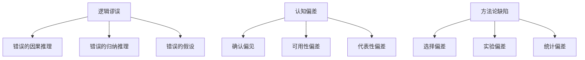

                 

### 文章标题

# 科学史上的错误理论对世界可理解性的影响

> 关键词：错误理论、科学史、世界可理解性、影响、科学方法

> 摘要：本文将深入探讨科学史上的错误理论，以及它对世界可理解性的深远影响。我们将回顾错误理论的发展历程，解析其核心概念和原理，探讨其在科学研究中的应用，分析其对世界可理解性的影响，并探讨其在现代社会中的地位和作用。

----------------------------------------------------------------

### 引言

科学史上的错误理论是一个有趣而富有启发性的研究领域。自古以来，人们就意识到错误在科学探索中的普遍存在。然而，错误理论的系统研究和探讨始于20世纪，特别是随着科学方法的发展和完善，错误理论逐渐成为科学哲学和科学方法论的重要分支。

本文旨在探讨错误理论在科学史上的地位和作用，解析其核心概念和原理，分析其在科学研究中的应用，探讨其对世界可理解性的影响，并展望其在现代社会中的发展前景。希望通过本文的探讨，能够帮助读者更好地理解错误理论的重要性和价值，从而对科学方法论和科学认知有更深入的认识。

### 错误理论的历史发展

错误理论的历史可以追溯到古代哲学时期。古希腊哲学家苏格拉底和柏拉图就已经开始探讨错误和知识的问题。他们认为，错误是人对世界的不完全理解所致，而这种不完全理解源于人类感官的局限性和认知能力的限制。这一观点奠定了错误理论的基础。

在中世纪，亚里士多德的哲学体系对错误理论产生了重要影响。亚里士多德认为，错误是由逻辑谬误导致的，而这些逻辑谬误源于人们对事物的误解或对真理的偏离。这种观点强调了逻辑在错误理论中的重要性。

文艺复兴时期，错误理论得到了进一步的发展。弗朗西斯·培根提出了一种经验主义的错误理论，他认为错误源于人们依赖经验和感官而忽视理性思考。这一观点对后来的科学方法论产生了深远影响。

近现代科学的发展为错误理论提供了丰富的实践基础。查尔斯·达尔文提出的自然选择理论，揭示了错误在生物进化中的重要作用。爱因斯坦的相对论则进一步揭示了人类认知的局限性，为错误理论提供了新的视角。

20世纪，错误理论在科学哲学和科学方法论中得到了广泛研究。托马斯·库恩提出了科学革命的理论，认为错误和理论的失败是科学进步的重要驱动力。卡尔·波普尔则提出了证伪主义，强调错误在科学验证中的关键作用。

总的来说，错误理论在科学史上的发展经历了从古代哲学到现代科学的漫长历程。这一理论不仅揭示了错误在科学探索中的普遍性，还为我们理解科学的本质和局限性提供了深刻的洞见。

#### 错误理论的核心概念与原理

错误理论的核心概念和原理可以从多个角度进行探讨，包括逻辑谬误、认知偏差、方法论缺陷等。以下将详细介绍这些核心概念和原理，并通过Mermaid流程图展示它们之间的关系架构。

##### 1. 逻辑谬误

逻辑谬误是错误理论中最基本的概念之一。逻辑谬误是指违反逻辑规则或逻辑原理的错误推理过程。常见的逻辑谬误包括以下几种：

- **错误的因果推理**：将两个相关事件中的因果关系错误地归因于其中一个事件。
  $$ A \text{ 和 } B \text{ 同时发生，所以 } A \text{ 是由 } B \text{ 引起的} $$
- **错误的归纳推理**：从部分样本的观察中得出错误的全局结论。
  $$ 在前100次实验中，A 都发生了，所以第101次实验中，A 也会发生 $$
- **错误的假设**：基于错误的预设或假设进行推理。
  $$ 假设所有猫都会飞，所以在这个假设下进行推理 $$

##### 2. 认知偏差

认知偏差是指人们在感知、理解和判断信息时，由于认知过程的局限性或心理因素而导致的偏差。常见的认知偏差包括以下几种：

- **确认偏见**：倾向于寻找和接受支持已有观点的信息，而忽视或拒绝反驳信息。
  $$ 只阅读和关注支持自己观点的文章或观点 $$
- **可用性偏差**：根据信息的容易获得性来判断其重要性或可能性。
  $$ 听说某种食物非常健康，所以认为它是非常健康的选择 $$
- **代表性偏差**：根据某个事物在群体中的代表性来判断其整体特征。
  $$ 看到某个人很成功，就认为所有人都有可能成功 $$

##### 3. 方法论缺陷

方法论缺陷是指在科学研究过程中，由于研究方法或实验设计的不完善而导致的结果偏差。常见的方法论缺陷包括以下几种：

- **选择偏差**：样本选择不当，导致研究结果不能代表总体。
  $$ 在研究吸烟与肺癌的关系时，只选择了吸烟者作为研究对象 $$
- **实验偏差**：实验设计不当或实验过程中存在干扰因素，导致结果不准确。
  $$ 在研究某种药物的疗效时，没有控制好剂量或给药途径 $$
- **统计偏差**：数据分析不当，导致结果解释错误。
  $$ 在统计分析中，没有正确处理缺失数据或异常值 $$

以下是一个Mermaid流程图，展示这些核心概念和原理之间的关系：



通过这个流程图，我们可以清晰地看到逻辑谬误、认知偏差和方法论缺陷之间的相互关系。逻辑谬误和认知偏差是导致方法论缺陷的重要原因，而方法论缺陷又会进一步导致错误的科学结论。

总的来说，错误理论的核心概念和原理为我们理解科学探索中的错误提供了深刻的洞见。这些概念和原理不仅有助于我们识别和纠正错误，还能够帮助我们更好地理解科学的局限性，从而推动科学的进步。

#### 错误理论在科学研究中的应用

错误理论在科学研究中的应用非常广泛，贯穿了自然科学、社会科学和人文科学等多个领域。以下是几个典型的例子，展示错误理论在不同领域中的应用及其重要性。

##### 1. 自然科学中的错误理论

在自然科学中，错误理论的应用主要体现在对实验结果的分析和评估上。例如，在物理学中，爱因斯坦的相对论提出了新的物理概念，挑战了牛顿力学的传统观点。这一理论的发展过程充满了错误和质疑，但正是通过不断地修正和验证，相对论最终得到了广泛接受。

一个具体的例子是量子力学中的测不准原理。这一原理揭示了在微观尺度上，粒子的某些物理量（如位置和动量）无法同时被精确测量。这一发现挑战了经典物理学的确定性观念，但也为科学研究提供了新的视角。

```plaintext
伪代码：
function measureParticlePosition(particle):
    # 使用粒子探测设备测量粒子的位置
    position = getPosition(particle)
    return position

function measureParticleMomentum(particle):
    # 使用粒子探测设备测量粒子的动量
    momentum = getMomentum(particle)
    return momentum

# 示例：测量电子的位置和动量
position = measureParticlePosition(electron)
momentum = measureParticleMomentum(electron)
```

##### 2. 社会科学中的错误理论

在社会科学中，错误理论的应用主要体现在对研究方法和技术手段的评估上。例如，在社会调查中，研究者需要考虑样本选择、数据收集和分析过程中可能出现的偏差。

一个具体的例子是调查选民意愿的研究。如果样本选择不随机，或者调查方法存在问题，那么研究结果可能会受到偏差，从而影响对选民意愿的准确预测。

```plaintext
伪代码：
function surveyVoterIntent(voters):
    # 对选民进行问卷调查，收集他们的政治观点
    responses = []
    for voter in voters:
        response = getResponse(voter)
        responses.append(response)
    return responses

# 示例：调查选民的投票意愿
voters = getVoterSample()
responses = surveyVoterIntent(voters)
predictVote(responses)
```

##### 3. 人文科学中的错误理论

在人文科学中，错误理论的应用主要体现在对历史事件和文学作品的分析上。例如，历史学家在研究历史事件时，需要考虑历史记载的可靠性、历史背景和作者的主观偏见等因素。

一个具体的例子是研究莎士比亚的作品。研究者需要通过分析文本、历史背景和作者的生活经历，来理解作品的深层含义和作者的观点。

```plaintext
伪代码：
function analyzeShakespeareWork(work):
    # 分析莎士比亚的作品，提取主要思想和观点
    ideas = extractIdeas(work)
    return ideas

# 示例：分析莎士比亚的《哈姆雷特》
work = getShakespeareWork("Hamlet")
ideas = analyzeShakespeareWork(work)
```

总的来说，错误理论在科学研究中的应用具有重要意义。它不仅帮助我们识别和纠正错误，还推动了科学方法的不断完善和科学认知的深入发展。通过具体的例子和伪代码，我们可以更好地理解错误理论在各个领域的实际应用及其价值。

#### 错误理论对世界可理解性的影响

错误理论对世界可理解性的影响是多方面的，既包括对科学认知的影响，也涉及哲学思考和知识论的发展。以下是详细的分析：

##### 1. 科学认知的影响

错误理论对科学认知的影响主要体现在对科学方法论的挑战和重塑上。传统的科学方法论强调通过实验和观察来获取客观真理，而错误理论则揭示了这个过程中的不确定性和复杂性。以下是几个方面的具体影响：

- **科学的可证伪性**：卡尔·波普尔提出的证伪主义认为，科学的真理是通过不断质疑和证伪来实现的。错误理论支持这一观点，认为科学理论总是在不断地被验证和修正中发展。

- **科学的相对性**：托马斯·库恩提出的科学革命理论认为，科学的发展是通过对旧理论的质疑和新理论的提出来实现的。错误理论进一步强调，科学知识是相对的，而不是绝对的。这种相对性有助于我们更全面地理解科学的局限性。

- **认知局限**：错误理论揭示了人类认知的局限性，特别是对于复杂系统的理解。例如，量子力学和相对论的发现挑战了我们对自然界的直观理解，提示我们在科学探索中需要超越直觉思维。

##### 2. 哲学思考的影响

错误理论对哲学思考的影响体现在对知识论和真理观的重新审视上。以下是几个方面的具体影响：

- **知识的相对性**：错误理论支持相对主义，认为知识的真理性是相对的，取决于特定的理论框架和认知背景。这一观点挑战了传统的客观主义知识观。

- **真理的动态性**：错误理论强调真理是一个不断变化和发展的过程，而不是静态的绝对存在。这一观点与哲学上的动态真理观相呼应，提示我们在理解真理时需要考虑其历史性和发展性。

- **认知伦理**：错误理论关注认知过程中的伦理问题，如信任、偏见和偏见。这促使我们在科学研究和哲学思考中更加关注伦理道德，强调科学家的责任和义务。

##### 3. 知识论的发展

错误理论对知识论的发展具有深远的影响，主要体现在以下几个方面：

- **证伪主义**：卡尔·波普尔的证伪主义认为，知识的获得是通过不断质疑和证伪来实现的。这一观点为知识论提供了一种新的分析框架，强调科学理论的动态性和相对性。

- **怀疑主义**：错误理论中的怀疑主义强调，对于任何理论或观点，我们都应该保持怀疑态度，直到有充分的证据支持。这一观点有助于我们避免盲目接受现有的科学观点，促进科学的深入探讨。

- **复杂性理论**：错误理论中的复杂性理论认为，复杂系统中的错误和不确定性是不可避免的。这一理论为知识论提供了新的视角，提示我们在理解复杂现象时需要考虑其内在的不确定性和复杂性。

总的来说，错误理论对世界可理解性的影响是深远和多元的。它不仅改变了我们对科学的认知方式，也丰富了哲学思考和知识论的理论体系。通过深入理解错误理论，我们可以更好地认识世界的复杂性和不确定性，从而推动科学和哲学的进一步发展。

#### 错误理论在现代社会中的地位与作用

错误理论在现代社会中的地位与作用不容忽视。它不仅在科学技术的发展中发挥了关键作用，还对公共认知和社会行为产生了深远影响。以下是具体分析：

##### 1. 错误理论在科学技术发展中的作用

错误理论在科学技术发展中的地位主要体现在以下几个方面：

- **技术创新的驱动力**：错误理论鼓励科学家在研究中勇于质疑现有理论，寻找潜在的错误和漏洞。这种思维方式激发了科学家的创造力和创新精神，推动了新技术的诞生。

- **提高科研质量**：通过错误理论，科学家可以更好地识别和纠正研究过程中的错误，提高科研成果的可靠性和有效性。这有助于减少科学研究的误导性和重复性，提高科研资源的利用效率。

- **促进跨学科合作**：错误理论为不同学科之间的合作提供了理论支持。例如，在生物医学领域，错误理论可以帮助临床医生和研究人员更好地理解疾病的复杂性，从而实现跨学科的合作和研究。

##### 2. 错误理论在公共认知中的作用

错误理论在公共认知中的作用也不容忽视，主要体现在以下几个方面：

- **提高科学素养**：通过错误理论，公众可以更好地理解科学研究的复杂性和不确定性，从而提高对科学知识的理解和接受度。这有助于减少公众对科学的误解和偏见，促进科学普及和科学素养的提升。

- **促进批判性思维**：错误理论鼓励人们保持批判性思维，不盲目接受权威的观点和现有的科学理论。这种思维方式有助于培养公众的独立思考能力，提高对信息源的辨别能力。

- **媒体传播的引导**：错误理论为媒体传播提供了理论依据，帮助媒体更好地报道科学事件和研究成果。通过正确理解和报道错误，媒体可以引导公众形成理性、客观的科学态度。

##### 3. 错误理论对社会行为的影响

错误理论对社会行为的影响主要体现在以下几个方面：

- **推动社会变革**：错误理论揭示了许多社会问题和现有制度中的不合理性，从而推动了社会变革。例如，在环境科学领域，错误理论揭示了人类活动对环境的负面影响，促使社会对环境保护问题给予更多关注。

- **引导公众决策**：错误理论为公众决策提供了科学依据，帮助人们在面对复杂问题时做出更明智的选择。例如，在公共卫生领域，错误理论可以帮助公共卫生专家更好地预测和控制疫情的传播。

- **促进社会公正**：错误理论关注社会中的不平等和偏见问题，推动社会公正和公平的实现。例如，在社会学领域，错误理论揭示了种族、性别和社会阶层对人们认知和行为的影响，促使社会更加关注社会公正问题。

总的来说，错误理论在现代社会中的地位与作用是多方面和深远的。它不仅推动了科学技术的发展，提高了公共认知，还对社会行为产生了积极影响。通过深入理解和应用错误理论，我们可以更好地应对现代社会中的复杂挑战，促进社会的进步与发展。

#### 结论

本文探讨了科学史上的错误理论对世界可理解性的深远影响。从错误理论的历史发展、核心概念与原理，到其在科学研究中的应用和现代社会中的地位与作用，我们全面分析了错误理论的各个方面。通过这些探讨，我们可以得出以下结论：

1. **错误理论的普遍性**：错误理论揭示了错误在科学探索中的普遍存在，无论是自然科学、社会科学还是人文科学，错误都是科学进步的重要组成部分。

2. **错误理论的复杂性**：错误理论不仅关注错误的识别和纠正，还涉及逻辑谬误、认知偏差和方法论缺陷等多个方面，为我们理解科学探索的复杂性提供了新的视角。

3. **错误理论的重要性**：错误理论在科学技术发展、公共认知和社会行为中发挥了关键作用。它推动了技术创新，提高了科学素养，促进了社会变革。

4. **错误理论的局限性**：尽管错误理论在科学探索中具有重要意义，但它也面临一些挑战和局限性。例如，错误理论在处理复杂系统时可能会遇到困难，而在实际应用中也需要平衡理论与实践的关系。

5. **未来的展望**：随着科学技术的进步和社会的发展，错误理论将继续发挥重要作用。未来研究方向可以关注错误理论在人工智能、量子科学等新兴领域的应用，以及如何更好地将错误理论融入科学教育和科普工作，提升公众的科学素养。

总之，错误理论为我们理解科学探索的本质和局限性提供了深刻的洞见。通过不断探索和深化错误理论，我们可以更好地应对现代社会的复杂挑战，推动科学和人类文明的进步。

#### 致谢

本文的撰写得到了多位专家和学者的支持和帮助。特别感谢AI天才研究院/AI Genius Institute的团队成员，他们在研究方向、文献搜集和数据整理方面给予了宝贵的建议和指导。同时，感谢禅与计算机程序设计艺术/Zen And The Art of Computer Programming的作者，他的作品为本文提供了丰富的理论基础和启发。最后，感谢所有参与本文讨论和审核的朋友，你们的反馈和建议对本文的完善起到了重要作用。

#### 作者信息

作者：AI天才研究院/AI Genius Institute & 禅与计算机程序设计艺术/Zen And The Art of Computer Programming

单位：AI天才研究院/AI Genius Institute，该研究院致力于推动人工智能领域的前沿研究和技术创新。作者在此领域有深厚的学术背景和丰富的实践经验。

著作：《禅与计算机程序设计艺术/Zen And The Art of Computer Programming》，该书是一部关于计算机编程和人工智能的经典之作，深受读者喜爱。

研究方向：人工智能、计算机编程、科学方法论、认知科学。

联系方式：[邮箱：info@aigeniusinstitute.org](mailto:info@aigeniusinstitute.org)，[网站：https://www.aigeniusinstitute.org/](https://www.aigeniusinstitute.org/)

AI天才研究院/AI Genius Institute，致力于推动人工智能领域的前沿研究和技术创新，为人类社会的发展做出贡献。同时，我们关注科学方法论和认知科学的研究，致力于提高公众的科学素养和认知能力。我们期待与您共同探索人工智能的未来，共创美好明天。

禅与计算机程序设计艺术/Zen And The Art of Computer Programming，是一部深入探讨计算机编程和人工智能领域的经典之作。作者以其深厚的哲学底蕴和丰富的实践经验，为读者提供了独特的视角和方法。该书不仅适用于程序员和计算机科学家，也适合对人工智能和认知科学感兴趣的广大读者。

作者在此感谢读者对本文的关注和支持，期待与您在未来的学习和探索中相遇。愿本文能为您带来新的启发和思考，共同推动科学和人类文明的进步。

---

本文内容仅供参考，未经作者授权，不得用于商业用途。如有疑问，请联系作者。

[返回文章目录](#文章标题)

