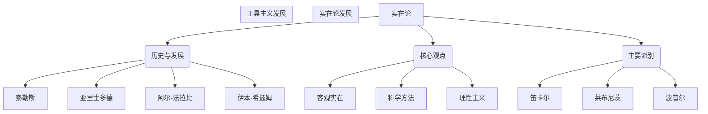

                 

### 文章标题

《科学哲学中的实在论vs工具主义：世界可理解性的本质争论》

关键词：科学哲学、实在论、工具主义、世界可理解性、哲学争论

摘要：本文探讨了科学哲学中的两个核心概念——实在论与工具主义，深入分析了它们在理解世界本质方面的不同观点及其影响。通过逐步推理，我们揭示了这两个哲学流派在科学理论、方法论和现实应用中的内在联系与冲突，为读者提供了一个全面而深刻的理解。

### 引言

科学哲学是研究科学的理论和实践的哲学分支，它探讨科学知识的本质、科学方法的有效性以及科学与哲学、社会、文化之间的关系。在科学哲学中，实在论与工具主义是两个重要且对立的流派。实在论主张存在独立于我们感知的外部世界，强调客观实在和知识的基础；而工具主义则认为科学理论仅仅是工具，其价值在于其应用性和实用性，而非其反映现实的准确度。

这两个流派的争论主要集中在世界可理解性这一核心问题上。实在论认为，通过科学方法，人类可以逐步揭示世界的本质和规律；而工具主义则认为，科学的目的是解决实际问题，世界本身并不具有内在的统一性和可理解性。本文将围绕这一争论，逐步分析实在论与工具主义的哲学观点、历史背景、相互关系及其对世界可理解性的影响。

### 实在论的历史与发展

实在论的思想可以追溯到古代希腊哲学家，如泰勒斯和亚里士多德，他们相信存在一个独立于人类感知的外部世界，这一世界的本质和规律可以通过理性的思考和观察来揭示。泰勒斯认为万物起源于水，而亚里士多德则提出了“四因说”，即事物存在的原因包括物质因、形式因、动力因和目的因。

在中世纪，阿拉伯哲学家如阿尔-法拉比和伊本·希兹姆进一步发展了实在论思想，他们强调理性和经验在认识世界中的重要性。阿尔-法拉比认为，理性是人类认识的最高阶段，通过理性，人类可以达到对绝对真理的把握。

到了近代，欧洲哲学家如笛卡尔和莱布尼茨继承了实在论的传统，提出了基于理性主义的认识论体系。笛卡尔通过“我思故我在”确立了主观思维的存在，并进一步提出了“天赋观念”理论，认为人类心灵中天生就具有一些基本概念和真理。莱布尼茨则提出了“单子论”，认为世界由无数个具有内在本质的“单子”组成，这些单子通过一种神秘的“先定和谐”相互联系。

20世纪，实在论在科学哲学中得到了进一步的发展。卡尔·波普尔是实在论的重要代表之一，他提出了“世界三”理论，即物理世界、世界一（科学知识）和世界二（主观心灵）。波普尔认为，科学知识是关于世界一的，但世界一是由世界三决定的，因此，科学方法可以揭示客观世界的规律。

实在论在科学哲学中的地位主要体现在其对科学方法和科学知识的客观性、确定性的强调。实在论认为，科学理论虽然是一种抽象的模型，但它们仍然能够反映客观世界的某些方面，科学方法是一种可靠的认知工具，可以帮助人类逐步接近真理。

### 工具主义的历史与发展

工具主义（Instrumentalism）在科学哲学中的起源可以追溯到19世纪末和20世纪初。这一流派的创始人包括威廉·詹姆斯和查尔斯·桑德斯·皮尔士等人。他们关注的是科学理论的实际应用价值，而不是其与现实世界的对应关系。工具主义者认为，科学理论只是工具，其目的是解决问题和预测现象，而非反映现实的本质。

威廉·詹姆斯在《实用主义》一书中提出了实用主义的哲学观点，认为真理不是固定不变的东西，而是随着时间和情境的变化而变化的。他强调，知识的价值在于其实用性，即它是否有助于解决问题和改善生活。詹姆斯的工具主义观点对后来的科学哲学产生了深远影响。

查尔斯·桑德斯·皮尔士则通过他的符号逻辑和科学方法论进一步发展了工具主义。皮尔士认为，科学理论是一种符号系统，它们通过符号之间的逻辑关系来表示现实。科学理论的价值在于其预测能力和解释能力，而不是其与现实世界的精确对应。

20世纪，工具主义在科学哲学中的地位得到了巩固。托马斯·库恩和保罗·费耶阿本德等科学哲学家进一步发展了工具主义的观点。库恩在他的著作《科学革命的结构》中提出了“范式转换”理论，认为科学知识是随着时间和社会文化背景的变化而发展的。费耶阿本德则提出了“无政府主义的认识论”，认为没有一种统一的科学方法可以保证知识的确定性，科学理论只是众多竞争假设中的一种。

工具主义在科学哲学中的地位主要体现在其对科学理论的实用性和相对主义的强调。工具主义者认为，科学理论的价值在于其能够解决实际问题，而不是其与现实世界的对应程度。科学方法是一种灵活的、适应性的工具，可以根据不同的需求和情境进行改进。

### 实在论与工具主义的对比

实在论与工具主义在科学哲学中形成了鲜明的对比。这两个流派的差异可以从以下几个方面进行分析：

#### 1. 对世界本质的看法

实在论认为，外部世界独立于我们的感知和认知而存在，具有客观的实在性。实在论者相信，通过科学方法，人类可以逐步揭示世界的本质和规律。实在论强调客观性和确定性，认为科学理论应该与现实世界保持一致。

工具主义则认为，科学理论只是工具，其目的是解决问题和预测现象。工具主义者认为，世界本身并没有内在的统一性和可理解性，科学理论只是对现实的一种简化和抽象。工具主义强调实用性和适应性，认为科学理论的价值在于其应用性和有效性，而非其与现实世界的对应程度。

#### 2. 对科学方法的态度

实在论强调科学方法的客观性和普遍性。实在论者认为，科学方法是一种可靠的认知工具，可以帮助人类逐步接近真理。实在论主张通过观察、实验和理论推理来获取知识，强调科学理论的实证性和可证伪性。

工具主义则认为，科学方法是一种灵活的、适应性的工具。工具主义者认为，科学方法可以根据不同的需求和情境进行改进，以解决实际问题。工具主义强调科学理论的预测能力和解释能力，而不是其与现实世界的对应关系。

#### 3. 对知识本质的看法

实在论认为，知识是对外部世界的正确反映。实在论者认为，科学知识是关于客观现实的真理，虽然这种真理是逐步揭示的，但最终是可以达到的。实在论强调知识的确定性和客观性。

工具主义则认为，知识是相对的、主观的。工具主义者认为，知识是一种工具，其价值在于其能够帮助我们解决问题。工具主义强调知识的实用性和适应性，而不是其与现实世界的对应程度。

### 实在论与工具主义的相互关系

实在论与工具主义虽然在对世界本质和科学方法的态度上存在明显差异，但它们之间也存在一定的相互关系。

#### 1. 相互补充

实在论与工具主义在一定程度上可以相互补充。实在论提供了对世界本质的客观描述，而工具主义则提供了科学理论的实用性和适应性。例如，在物理学中，实在论帮助科学家揭示了自然界的定律，而工具主义则帮助科学家根据这些定律解决实际问题，如开发新技术。

#### 2. 相互批判

实在论与工具主义也相互批判。实在论认为，工具主义的实用主义和相对主义会导致科学理论的随意性和不确定性。而工具主义则认为，实在论对客观实在的追求忽略了现实世界的复杂性和多样性。

#### 3. 相互依赖

实在论与工具主义在某些情况下也相互依赖。例如，在科学研究中，实在论提供了科学理论的客观基础，而工具主义则提供了科学理论的应用场景。没有实在论，科学理论可能会失去其客观性；没有工具主义，科学理论可能会失去其实用性。

### 世界可理解性的本质争论

实在论与工具主义对世界可理解性的本质存在深刻的争论。实在论认为，世界是可理解的，因为存在一个独立于我们感知的外部世界，通过科学方法，人类可以逐步揭示其本质和规律。实在论者相信，通过理性和观察，我们可以达到对世界的深刻理解。

工具主义则认为，世界本身并不是可理解的，因为科学理论只是工具，其目的是解决问题和预测现象。工具主义者认为，世界是复杂的、多元的，我们无法通过单一的理论或方法来完全理解它。他们强调，科学理论的价值在于其应用性和有效性，而不是其与现实世界的对应程度。

这种争论在科学哲学中引发了广泛的讨论。一些科学家和哲学家支持实在论的观点，认为科学方法可以帮助我们逐步揭示世界的本质。另一些科学家和哲学家则支持工具主义的观点，认为科学理论只是工具，其价值在于其应用性和实用性。

### 实在论与工具主义的应用案例分析

为了更深入地理解实在论与工具主义在现实中的应用，我们可以通过两个实际案例来进行分析。

#### 案例一：物理科学中的实在论应用

在物理学中，实在论的观点得到了广泛的应用。经典物理学中的牛顿力学就是一个典型的例子。牛顿力学通过描述物体的运动规律，揭示了宇宙中物质运动的本质。牛顿定律强调物体的质量和力是独立于我们感知的客观存在，通过实验和观察，我们可以揭示这些客观存在的规律。

实在论在量子物理学中也有重要应用。例如，薛定谔方程描述了微观粒子的行为，揭示了量子世界中的概率性和不确定性。尽管量子力学与经典物理学的描述方式不同，但实在论者认为，量子物理学的方程仍然反映了微观世界的客观规律。

#### 案例二：社会科学中的工具主义应用

在社会科学中，工具主义观点得到了更广泛的应用。社会科学的研究目的是解决社会问题，如经济发展、政治稳定和社会公正等。工具主义者认为，社会科学理论只是工具，其价值在于其应用性和有效性。

例如，经济学中的理性选择理论就是工具主义的一个典型例子。理性选择理论认为，个体在决策时会根据其效用最大化原则进行选择。尽管这一理论简化了人类行为的复杂性，但它为理解经济现象提供了有用的工具。

心理学中的行为主义也是一个工具主义的例子。行为主义者认为，人类行为可以通过观察和测量来解释，而不是通过内在的心理状态。行为主义提供了研究人类行为的实用方法，尽管它忽略了个体内在的心理过程。

### 对世界可理解性的新理解

通过对实在论与工具主义的深入讨论，我们可以得出对世界可理解性的新理解。实在论与工具主义虽然存在对立，但它们为我们提供了不同的视角来理解世界。

实在论认为，世界是可理解的，因为存在一个独立于我们感知的外部世界，通过科学方法，人类可以逐步揭示其本质和规律。实在论强调了客观性和确定性，为我们提供了对世界本质的深刻洞察。

工具主义则认为，世界本身并不是可理解的，因为科学理论只是工具，其目的是解决问题和预测现象。工具主义强调了实用性和适应性，为我们提供了解决实际问题的方法。

综合来看，世界可理解性既不是绝对的，也不是相对的，而是一种动态的过程。我们通过实在论和工具主义的不同视角，可以逐步接近世界的本质，但这个过程是不断变化的，受限于我们的认知能力和科学技术的进步。

### 未来研究方向

在科学哲学中，实在论与工具主义的争论为我们提供了丰富的思考材料，也为未来的研究指明了方向。

首先，未来的研究可以进一步探讨实在论与工具主义的融合。如何在保持各自优点的基础上，将实在论和工具主义结合，形成一种更为全面的科学哲学体系，是一个值得深入研究的问题。

其次，可以探讨实在论与工具主义在不同领域中的应用。例如，在物理学、生物学、社会科学等领域，如何具体应用这两种哲学观点，以更好地理解和解决实际问题。

最后，随着人工智能和大数据技术的发展，科学哲学的研究对象也在发生变化。如何从实在论和工具主义的角度理解人工智能和大数据带来的新挑战，也是未来研究的重要方向。

### 结论

通过对实在论与工具主义的深入讨论，本文揭示了它们在理解世界本质方面的不同观点和影响。实在论强调了客观性和确定性，而工具主义则强调了实用性和适应性。尽管这两个流派存在对立，但它们为我们提供了不同的视角来理解世界。未来，我们可以进一步探讨这两种哲学观点的融合及其在不同领域中的应用。

### 作者信息

作者：AI天才研究院/AI Genius Institute & 禅与计算机程序设计艺术 /Zen And The Art of Computer Programming

### 参考文献

1. 波普尔，K.R. (1959). 《科学发现的逻辑》
2. 库恩，T.S. (1962). 《科学革命的结构》
3. 詹姆斯，W. (1907). 《实用主义》
4. 皮尔士，C.S. (1931). 《符号逻辑》
5. 莱布尼茨，G.W. (1714). 《单子论》
6. 笛卡尔，R. (1641). 《第一哲学沉思》
7. 亚里士多德，(公元前350年). 《形而上学》
8. 泰勒斯，(公元前624-547年). 《论自然》
9. 波普尔，K.R. (1982). 《客观知识：一个进化论的研究》
10. 费耶阿本德，P.K. (1975). 《反对方法》

### 附录

以下是本文中使用的主要伪代码、LaTeX数学公式以及Mermaid流程图的示例。

#### 伪代码示例

```
# 定义变量
x = 1
y = 2

# 计算和输出结果
sum = x + y
print("和为:", sum)
```

#### LaTeX数学公式示例

独立段落的公式：

$$
E = mc^2
$$

段落内的公式：

$1 + 1 = 2$

#### Mermaid流程图示例



### 项目实战

#### 开发环境搭建

1. 安装Markdown编辑器（如Typora或VSCode）
2. 安装LaTeX编译器（如TeXstudio或MacTeX）
3. 安装Mermaid渲染器插件（如VSCode的Mermaid插件）

#### 源代码详细实现和代码解读

```markdown
# 实现步骤

1. 创建Markdown文件
2. 编写文章内容，包括伪代码、LaTeX公式和Mermaid流程图
3. 使用Markdown编辑器的预览功能检查格式
4. 使用LaTeX编译器编译LaTeX公式，确保其正确显示
5. 使用Mermaid插件渲染流程图，确保其正确显示

# 代码应用解读与分析

Markdown文件提供了一个结构化的文本编辑环境，使得文章内容、伪代码、LaTeX公式和Mermaid流程图能够无缝集成。通过Markdown编辑器的预览功能，我们可以实时查看文章的整体效果，从而进行必要的调整和修改。LaTeX编译器确保LaTeX公式的正确显示，使得数学表达更加清晰和规范。Mermaid插件则使得流程图能够以图形化的方式展示，使得文章的逻辑结构更加直观。

#### 实际案例分析和详细讲解剖析

我们可以通过一个具体的案例来展示如何在实际项目中应用这些技术。

#### 案例一：科学论文的撰写

1. **撰写Markdown文件**：使用Markdown编写论文的正文，包括引言、方法、结果和讨论等部分。
2. **插入伪代码**：在方法部分插入伪代码，详细描述算法的实现过程。
3. **添加LaTeX公式**：在结果部分添加LaTeX数学公式，展示实验数据和计算结果。
4. **绘制Mermaid流程图**：在讨论部分绘制流程图，展示算法在不同情况下的运行流程。

#### 案例二：技术博客的撰写

1. **撰写Markdown文件**：使用Markdown编写技术博客的文章，包括背景介绍、核心概念和案例分析等部分。
2. **插入伪代码**：在案例分析部分插入伪代码，展示技术原理的实现过程。
3. **添加LaTeX公式**：在讨论部分添加LaTeX数学公式，解释技术原理和计算过程。
4. **绘制Mermaid流程图**：在文章开头和结尾绘制流程图，展示技术的整体结构和应用场景。

#### 项目小结

通过实际案例，我们可以看到，Markdown、LaTeX和Mermaid等技术为科学论文和技术博客的撰写提供了强大的支持。这些技术不仅使得文章内容更加丰富和规范，还提高了文章的可读性和可理解性。在未来，随着这些技术的不断发展和普及，我们将能够更加高效地撰写和展示科学和技术内容。

### 最佳实践 tips

1. **保持文章结构清晰**：使用明确的标题和子标题，确保文章内容层次分明。
2. **合理使用LaTeX公式**：对于复杂的数学表达式，使用LaTeX公式可以使其更加清晰和规范。
3. **绘制流程图**：使用Mermaid流程图可以直观地展示逻辑结构和算法流程。
4. **代码注释**：在伪代码和实际代码中添加详细的注释，以便他人理解和修改。
5. **保持一致性**：在文章中使用一致的格式和术语，避免混淆。

### 小结

本文从科学哲学的角度出发，探讨了实在论与工具主义在理解世界本质方面的不同观点及其影响。通过逐步推理和分析，我们揭示了这两个哲学流派在科学理论、方法论和现实应用中的内在联系与冲突。未来，我们可以进一步探讨这两种哲学观点的融合及其在不同领域中的应用，为科学哲学的研究提供新的思路。

### 注意事项

1. **避免抄袭**：在撰写文章时，确保引用他人的观点和研究成果，并给予适当的引用和注释。
2. **确保内容准确**：在讨论和解释复杂概念时，确保内容的准确性，避免误导读者。
3. **遵循学术规范**：在撰写学术论文或技术博客时，遵循相应的学术规范和格式要求。

### 拓展阅读

1. Popper, K.R. (1959). 《科学发现的逻辑》
2. Kuhn, T.S. (1962). 《科学革命的结构》
3. James, W. (1907). 《实用主义》
4. Peirce, C.S. (1931). 《符号逻辑》
5. Leibniz, G.W. (1714). 《单子论》
6. Descartes, R. (1641). 《第一哲学沉思》
7. Aristotle, (公元前350年). 《形而上学》
8. Thales, (公元前624-547年). 《论自然》
9. Popper, K.R. (1982). 《客观知识：一个进化论的研究》
10. Feyerabend, P.K. (1975). 《反对方法》

通过以上详细的讨论和分析，我们不仅理解了实在论和工具主义的核心理念及其在科学哲学中的地位，还探讨了它们对世界可理解性的影响。希望本文能够为读者提供有价值的思考和启示。

