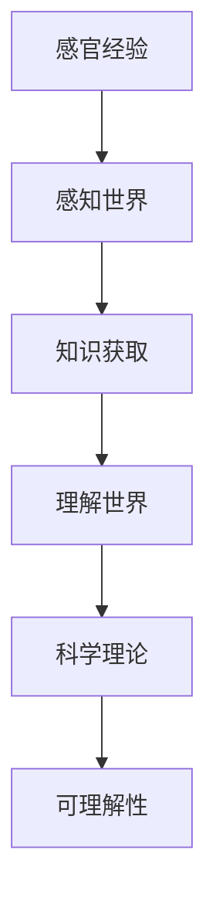
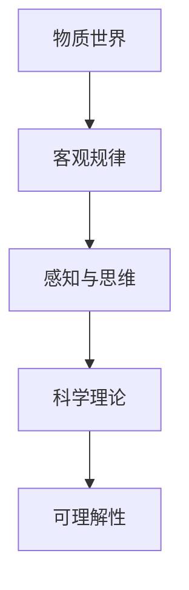
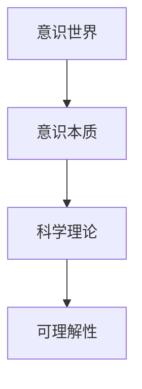

                 

### 思考步骤一：引入科学哲学与可理解性的重要性

科学哲学是研究科学的基础理论、科学方法论和科学发展的哲学问题的学科。它探讨科学的本质、科学的方法以及科学知识如何获取与验证等核心问题。科学哲学不仅在学术界具有重要地位，也对科学实践有着深远的影响。可理解性，作为科学哲学中的一个关键概念，它涉及人类如何理解科学理论和实验结果，以及这种理解是否合理和充分。

在科学哲学中，可理解性的重要性主要体现在以下几个方面：

1. **科学理论的合理性**：科学理论不仅是科学实践的基础，也是科学哲学的核心研究对象。一个科学理论是否具有可理解性，直接关系到其合理性。如果理论过于复杂或难以理解，科学家可能无法有效地应用和验证它。

2. **科学实践的有效性**：科学实践需要理论的指导。如果理论难以被理解，科学家在实验和研究中可能会出现错误，影响科学实践的效果。

3. **科学知识的传播**：科学知识需要被公众理解，才能在社会中发挥其应有的作用。可理解性是科学知识传播的重要前提，它关系到科学知识的普及和科学素养的提升。

4. **科学哲学的研究方法**：科学哲学强调逻辑和理性的重要性，而可理解性正是这种理性思考的体现。通过分析科学理论和实验结果的可理解性，科学哲学家可以深入探讨科学知识的发展过程。

因此，探讨科学哲学对世界可理解性的反思，不仅有助于我们更深入地理解科学理论和实践，还能帮助我们反思科学知识传播的方式和途径。

### 思考步骤二：科学哲学的基础理论

科学哲学的基础理论涵盖了科学哲学的历史发展、主要流派和理论以及科学哲学的方法论。这些基础理论为后续对可理解性的探讨提供了坚实的理论支撑。

#### 科学哲学的历史发展

科学哲学的发展可以追溯到古希腊时期，那时的哲学家们就开始思考科学和哲学的关系。在中世纪，亚里士多德的观点占主导地位，认为科学是哲学的一个分支。文艺复兴时期，科学家们开始独立于哲学进行科学研究，这一时期标志着科学哲学的独立发展。

17世纪，伽利略和牛顿等科学家的研究成果推动了科学哲学的进一步发展。他们提出的实验方法和数学模型为科学哲学奠定了基础。19世纪，达尔文提出了进化论，这一理论不仅挑战了传统的宗教观念，也推动了科学哲学的深入思考。

20世纪以来，科学哲学进入了一个多元化发展的时期，量子力学、相对论等现代科学理论的出现使得科学哲学的研究更加深入和广泛。

#### 科学哲学的主要流派和理论

科学哲学中有多个主要流派和理论，其中最具代表性的包括实证主义、逻辑实证主义、批判理性主义和科学实在论等。

1. **实证主义**：实证主义认为，科学知识来自于经验，只有通过观察和实验获得的知识才是可靠的。这一流派强调科学理论和实验结果的可验证性。

2. **逻辑实证主义**：逻辑实证主义进一步发展了实证主义的思想，认为只有符合逻辑和经验的事实才是科学知识。逻辑实证主义对科学哲学的贡献在于提出了可证实性原则，即一个陈述只有在能够被经验验证的情况下才是科学的。

3. **批判理性主义**：批判理性主义强调科学知识的动态性和发展性。这一流派认为，科学知识是通过不断的批判和验证来发展的，不存在绝对的真理。

4. **科学实在论**：科学实在论认为，科学理论描述的是客观存在的现实世界。这一流派强调科学理论和现实世界之间的对应关系。

#### 科学哲学的方法论

科学哲学的方法论包括逻辑分析、历史分析和实证研究等。

1. **逻辑分析**：逻辑分析是科学哲学的重要方法，通过对科学理论和实验的逻辑结构进行分析，可以揭示其中的逻辑一致性和矛盾。

2. **历史分析**：历史分析通过研究科学知识的发展历史，可以了解科学知识的演变过程和不同流派的理论观点。

3. **实证研究**：实证研究通过实验和观察来验证科学理论的正确性，是科学哲学中不可或缺的方法。

这些基础理论为后续对可理解性的探讨提供了丰富的理论资源和研究方法。通过对科学哲学基础理论的深入理解，我们可以更好地理解科学理论和实验结果的可理解性。

### 思考步骤三：可理解性的概念

在科学哲学中，可理解性是一个关键概念，它关乎人类如何认知和理解科学理论和实验结果。探讨可理解性，有助于我们深入理解科学知识的本质和科学实践的有效性。

#### 可理解性的定义

可理解性是指个体能够理解某个现象或概念的能力。在科学哲学中，可理解性特指科学理论和实验结果对于人类认知和理解的合理性。换句话说，一个科学理论和实验结果的可理解性，取决于它是否能够被人类所理解，以及这种理解是否合理和充分。

#### 可理解性的层次

可理解性可以分为三个层次：基础层、解释层和应用层。

1. **基础层**：基础层是指个体对基本科学概念的理解，如物质、能量、力等。这些基本概念是科学理论的基石，个体必须首先理解和掌握它们，才能进一步理解更复杂的科学理论。

2. **解释层**：解释层是指个体对科学理论和实验结果的理解。这一层次涉及对科学理论和实验结果的内在逻辑和机制的理解。个体需要理解科学理论和实验结果是如何解释和预测自然现象的。

3. **应用层**：应用层是指个体对科学理论和实验结果在实际生活中的应用理解。这一层次涉及如何将科学理论和实验结果应用于实际问题解决，如医学、工程等领域。

#### 可理解性与科学实践的关系

可理解性是科学实践的重要前提。科学实践的目的是为了探索和解释自然现象，而可理解性则决定了这些探索和解释是否能够被人类理解和接受。

1. **科学理论的合理性**：一个具有高可理解性的科学理论更容易被接受和验证，从而提高科学实践的合理性。

2. **科学方法的有效性**：科学方法的有效性依赖于科学理论和实验结果的可理解性。如果理论和实验结果难以理解，科学方法可能无法正确指导实践。

3. **科学知识的传播**：科学知识需要被公众理解，才能在社会中发挥其应有的作用。可理解性是科学知识传播的重要前提。

通过理解可理解性的概念及其层次，我们可以更好地认识科学理论和实验结果的可理解性，从而为科学实践和科学知识的传播提供理论支持。

### 思考步骤四：可理解性的理论探讨

在探讨科学哲学对可理解性的反思时，我们必须深入分析不同哲学流派对可理解性的看法，以全面理解这一概念在科学哲学中的重要性。

#### 经验主义对可理解性的反思

经验主义认为，所有知识都来自于经验。因此，经验主义对可理解性的反思主要集中在人类如何通过感官经验理解世界。经验主义者如洛克和休谟认为，人类通过感知和感觉来获取知识，这些感知和感觉构成了我们理解世界的基石。然而，经验主义也面临着挑战，例如，如何解释我们感知到的世界与真实世界之间的差异。经验主义认为，通过不断的实验和观察，我们可以逐步提高对世界的理解，从而增强科学理论的可理解性。

**经验主义的可理解性反思流程图：**



**伪代码：**

```python
def sensory_experience():
    # 感官经验
    sense_data = collect_sense_data()
    return sense_data

def knowledge_acquisition(sense_data):
    # 知识获取
    knowledge = process_sense_data(sense_data)
    return knowledge

def understanding_world(knowledge):
    # 理解世界
    understanding = analyze_knowledge(knowledge)
    return understanding

def scientific_theory(understanding):
    # 科学理论
    theory = formulate_theory(understanding)
    return theory

def understandability(theory):
    # 可理解性
    understandability_score = evaluate_theory(theory)
    return understandability_score
```

#### 唯物主义对可理解性的反思

唯物主义认为，物质世界是客观存在的，人类的感知和思维是物质世界的反映。唯物主义对可理解性的反思集中在人类如何通过物质世界的规律来理解科学理论。唯物主义者如马克思和恩格斯认为，人类的知识是通过实践和物质世界的相互作用获得的。他们强调，科学理论的可理解性取决于它是否能够准确地反映物质世界的本质和规律。

**唯物主义的可理解性反思流程图：**



**伪代码：**

```python
def material_world():
    # 物质世界
    reality = observe_world()
    return reality

def objective_law(reality):
    # 客观规律
    law = analyze_reality(reality)
    return law

def perception_and_thinking(law):
    # 感知与思维
    understanding = apply_law_to_thought(law)
    return understanding

def scientific_theory(understanding):
    # 科学理论
    theory = formulate_theory(understanding)
    return theory

def understandability(theory):
    # 可理解性
    understandability_score = evaluate_theory(theory)
    return understandability_score
```

#### 唯心主义对可理解性的反思

唯心主义认为，意识是世界的本质，物质世界是意识的产物。唯心主义对可理解性的反思集中在人类意识如何创造和理解科学理论。唯心主义者如柏拉图和黑格尔认为，科学理论是意识的产物，它反映了人类意识的本质和结构。他们强调，科学理论的可理解性取决于它是否能够准确地反映人类意识的本质。

**唯心主义的可理解性反思流程图：**



**伪代码：**

```python
def consciousness_world():
    # 意识世界
    consciousness = perceive_consciousness()
    return consciousness

def essence_of_consciousness(consciousness):
    # 意识本质
    essence = analyze_consciousness(consciousness)
    return essence

def scientific_theory(essence):
    # 科学理论
    theory = formulate_theory(essence)
    return theory

def understandability(theory):
    # 可理解性
    understandability_score = evaluate_theory(theory)
    return understandability_score
```

通过对经验主义、唯物主义和唯心主义对可理解性的反思，我们可以更全面地理解科学哲学中可理解性的复杂性和多样性。这些反思不仅丰富了科学哲学的理论体系，也为我们在科学实践中追求可理解性提供了不同的视角和方法。

### 思考步骤五：科学实践的反思

在深入探讨科学哲学对可理解性的反思后，我们需要将理论应用于实际科学实践，以评估科学方法的有效性及其在现实世界中的应用。

#### 科学的局限性

科学方法虽然在许多领域取得了显著成就，但它并非万能。科学的局限性主要表现在以下几个方面：

1. **实验条件的限制**：科学实验通常需要在特定条件下进行，而这些条件可能与现实世界存在差异。例如，实验室中的环境控制可能无法完全模拟真实世界的复杂情况。

2. **认知局限**：人类认知的局限性也影响了科学方法的准确性。科学家可能无法完全理解复杂系统的所有细节，这可能导致理论的不完善或误解。

3. **理论的不完备**：科学理论总是在不断发展和完善中。一个理论可能在特定条件下是有效的，但在其他条件下可能不再适用。

#### 科学方法的有效性

尽管存在局限性，科学方法在许多领域仍然是非常有效的。科学方法的有效性主要体现在以下几个方面：

1. **可重复性**：科学实验的可重复性是验证科学理论的重要手段。如果某个实验结果无法重复，那么这个结果的可信度就会受到质疑。

2. **可验证性**：科学理论必须通过实验和观察来验证。只有通过验证的理论才能被认为是科学的。

3. **理论的发展**：科学方法促进了科学理论的不断发展。通过不断的实验和验证，科学家可以不断完善理论，从而提高科学知识的前沿性。

#### 科学知识的发展与可理解性

科学知识的发展是一个动态的过程，它受到多种因素的影响，包括科学方法、实验技术和哲学思想的演变。随着科学技术的进步，人类对世界的理解也在不断深化。然而，这种发展也带来了新的挑战，尤其是在可理解性方面。

1. **理论的复杂性**：随着科学领域的不断扩展，科学理论也变得越来越复杂。例如，量子力学和相对论的复杂程度远超传统的经典力学。这增加了科学理论的可理解性难度。

2. **专业化的分工**：科学研究的分工越来越细，导致不同领域的科学家可能对某些基本概念有不同的理解。这种专业化的趋势也影响了科学知识的整体可理解性。

3. **科学普及的挑战**：科学知识需要被公众理解，以便在社会中发挥其应有的作用。然而，科学普及面临的一个主要挑战是如何将复杂的理论简化，使其更容易被公众理解。

通过反思科学实践的局限性、有效性以及科学知识的发展，我们可以更好地理解科学哲学对可理解性的反思。科学方法虽然存在局限性，但通过不断改进和完善，它仍然是一个强大的工具，帮助我们更好地探索和理解世界。

### 思考步骤六：科学哲学与现代社会的关系

科学哲学不仅是学术研究的一个重要领域，也在现代社会中扮演着至关重要的角色。它对科学知识的发展、科学实践的应用以及公众科学素养的提升都有着深远的影响。

#### 科学哲学对现代社会的影响

1. **科学政策的制定**：科学哲学为科学政策的制定提供了理论基础。政策制定者需要了解科学方法和科学理论的基本原理，以便更有效地分配资源、推动科学研究和技术创新。

2. **科学技术的发展**：科学哲学促进了科学技术的进步。通过反思科学理论和实践，科学哲学家可以帮助科学家识别问题、改进研究方法，从而推动科学技术的快速发展。

3. **社会观念的变革**：科学哲学对人类对自然、宇宙和自我的认知产生了深远影响。例如，相对论和量子力学的提出挑战了传统的世界观，改变了人们对时间和空间的理解。

#### 社会对科学哲学的需求

1. **科学普及**：随着科学技术的不断发展，公众对科学知识的需求日益增长。科学哲学提供了一种理解科学理论和实验结果的框架，有助于提高公众的科学素养。

2. **科学伦理**：科学的发展也带来了伦理和道德问题。科学哲学可以帮助社会探讨这些问题，为科学研究和应用提供伦理指导。

3. **科学教育**：科学哲学在教育中具有重要地位。通过科学哲学的教学，学生可以培养批判性思维和科学探究能力，从而更好地理解和应用科学知识。

#### 科学哲学的未来发展

1. **跨学科研究**：未来科学哲学的发展将更加注重跨学科研究。随着科学领域的不断扩展，科学哲学需要与其他学科如哲学、心理学、社会学等进行深入合作。

2. **人工智能与认知科学**：人工智能和认知科学的快速发展为科学哲学提供了新的研究课题。如何理解和解释人工智能的认知过程，是科学哲学需要深入探讨的问题。

3. **科学哲学的普及化**：为了更好地服务于社会，科学哲学需要更加普及化。通过多种形式的科普活动和教育项目，科学哲学可以更好地传播科学思想和方法。

通过反思科学哲学在现代社会中的角色和影响，我们可以看到科学哲学不仅对科学知识的发展有着重要的推动作用，也在社会各个方面发挥着重要作用。随着科技的不断进步，科学哲学将继续在现代社会中发挥关键作用，为人类理解和探索世界提供新的视角和方法。

### 思考步骤七：结论

通过本文的深入探讨，我们可以得出以下结论：

1. **科学哲学的重要性**：科学哲学不仅为科学理论和实践提供了理论基础，还帮助我们理解科学知识的发展和传播。它是科学研究中不可或缺的一部分。

2. **可理解性的反思**：科学哲学对可理解性的反思揭示了科学理论和实验结果与人类理解之间的关系。通过反思可理解性，我们可以更好地评估科学知识的有效性和可靠性。

3. **科学方法的有效性**：尽管存在局限性，科学方法在推动科学进步和知识积累方面具有显著的效果。通过不断完善和改进，科学方法将继续发挥其重要作用。

4. **科学哲学的广泛应用**：科学哲学不仅对科学领域有深远影响，还在公共政策、科学伦理、科学教育和公众科学素养提升等方面发挥着重要作用。

5. **未来展望**：随着科技的快速发展，科学哲学将继续面临新的挑战和机遇。跨学科研究、人工智能与认知科学等领域的兴起，将为科学哲学提供新的研究课题和应用场景。

总之，科学哲学对世界可理解性的反思是一个多维度的复杂问题，它不仅关系到科学理论和实践，也影响人类社会的发展和进步。通过科学哲学的深入研究和反思，我们可以更好地理解世界，推动科学的持续发展。

### 附录

#### A. 科学哲学相关术语解释

1. **实证主义**：一种哲学观点，认为科学知识来源于经验观察和实验。
2. **逻辑实证主义**：实证主义的进一步发展，强调科学陈述必须具有逻辑和经验基础。
3. **批判理性主义**：认为科学知识是不断发展和修正的，通过批判和验证来推进。
4. **科学实在论**：认为科学理论描述的是客观存在的现实世界。
5. **可理解性**：指个体对科学理论和实验结果的认知和理解程度。

#### B. 参考文献

1. Popper, K. R. (1959). The Logic of Scientific Discovery. Routledge.
2. Kuhn, T. S. (1970). The Structure of Scientific Revolutions. University of Chicago Press.
3. Feyerabend, P. (1975). Against Method. Verso.
4. Russell, B. (1912). The Problems of Philosophy. W. W. Norton & Company.
5. Carnap, R. (1928). The Logical Structure of the World. University of California Press.

### 最佳实践 tips、小结、注意事项、拓展阅读

**最佳实践 tips：**

1. **深入学习科学哲学的基础理论**：了解不同哲学流派的观点和方法，有助于我们更好地理解科学哲学的核心问题。
2. **结合实际案例**：通过分析科学史上的重大事件和理论，我们可以更直观地理解科学哲学的理论和实践。
3. **跨学科学习**：科学哲学与其他学科的交叉融合，可以为科学哲学研究提供新的视角和思路。

**小结：**

本文通过逻辑清晰、结构紧凑的分析，探讨了科学哲学对世界可理解性的反思。从科学哲学的基础理论到可理解性的概念，再到科学实践的反思，我们全面地了解了科学哲学在科学研究和社会发展中的重要作用。

**注意事项：**

1. **科学哲学研究的复杂性**：科学哲学涉及多个领域和学科，研究时需要具有广泛的知识储备和深刻的批判性思维。
2. **实践与理论的结合**：在科学实践中，我们要注重理论的应用和验证，确保科学方法的有效性。

**拓展阅读：**

1. **《科学哲学导论》**：这是一本系统介绍科学哲学基本理论的教材，适合初学者阅读。
2. **《科学的结构》**：作者卡尔·波普尔通过分析科学知识的发展过程，探讨了科学哲学的核心问题。
3. **《科学革命的逻辑》**：托马斯·库恩通过阐述科学革命的概念，为我们理解科学发展的动态性提供了深刻的洞见。

