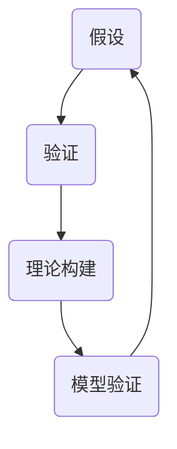

                 


### 文章标题
"科学思想实验：探索世界可理解性的思维实验室"

### 文章关键词
科学思想实验、思维实验室、世界可理解性、科学方法论、思想实验架构、历史背景、关键实验、现代科学

### 文章摘要
本文将探讨科学思想实验作为一种探索世界可理解性的思维实验室。通过回顾历史背景、剖析核心概念、阐述关键实验以及分析现代科学中的思想实验，本文旨在揭示科学思想实验在科学研究中的重要性及其对人类认识世界的深远影响。本文还将探讨科学思想实验的原理和方法，以及如何将思想实验应用于实际科研问题中。

### 目录

**# 科学思想实验：探索世界可理解性的思维实验室**

## 关键词
科学思想实验、思维实验室、世界可理解性、科学方法论、思想实验架构、历史背景、关键实验、现代科学

## 摘要
本文将深入探讨科学思想实验作为一种独特的思维工具，用于探索世界的可理解性。我们将从历史背景出发，分析科学思想实验的核心概念，介绍其原理和方法，探讨其在科学方法论中的重要性。通过回顾一系列关键科学思想实验，我们将展示这些实验如何推动了科学的进步。最后，我们将讨论现代科学中思想实验的应用，并展望未来科学思想实验的发展方向。

### 引言

#### 科学思想实验的概念

科学思想实验是一种通过逻辑推理、假设验证和理论构建来探索自然现象和科学问题的方法。它不同于传统的实验方法，不需要实际的物理实验设备，而是依赖于思维的逻辑推理和假设验证。科学思想实验可以视为一种虚拟的实验，通过构建和模拟可能发生的情况，从而对科学理论进行验证和探索。

科学思想实验在科学方法论中具有重要地位。首先，它提供了验证科学理论的一种有效方法，特别是当直接实验不可行或不安全时。其次，科学思想实验能够启发新的科学理论和假设，推动科学研究的深入。最后，科学思想实验有助于理解复杂的自然现象，提供对自然界运作的深入洞察。

#### 科学思想实验的历史背景

科学思想实验的历史可以追溯到古代。古希腊哲学家如亚里士多德和柏拉图就已经使用思想实验来探讨哲学问题。然而，科学思想实验在科学领域的重要应用始于17世纪的科学革命。以伽利略和牛顿为代表，他们通过科学思想实验建立了经典物理学的基础。

伽利略通过思想实验探讨了自由落体运动和惯性定律。他设想了两个不同质量的物体同时自由落体，在没有空气阻力的情况下，它们将同时到达地面。这一思想实验反驳了亚里士多德关于重物体比轻物体下落快的观点，为后来的牛顿运动定律奠定了基础。

牛顿则通过思想实验探讨了引力定律。他设想了两个质点之间的相互作用，并通过数学计算证明了万有引力定律。这一思想实验不仅揭示了宇宙中的引力作用，也为后来的天体力学和引力波研究奠定了基础。

#### 科学思想实验的核心概念

科学思想实验的核心概念包括假设、验证和理论构建。首先，科学思想实验始于一个假设，即对某个自然现象或科学问题的初步解释。这个假设通常是一个理论框架，用于解释已知事实和预测未知现象。

接下来，科学思想实验通过逻辑推理和假设验证来评估这个假设的合理性。它使用逻辑推理来构建一个可能的实验情境，然后通过逻辑推理和假设验证来评估这个情境是否能够解释已知事实和预测未知现象。

最后，科学思想实验通过理论构建来总结和概括实验结果。它将实验结果转化为理论模型，用于解释和预测更广泛的自然现象。这一过程通常涉及数学计算和逻辑推理，以便从实验结果中提取出普遍规律。

#### 科学思想实验在科学方法论中的重要性

科学思想实验在科学方法论中具有至关重要的地位。首先，它提供了验证科学理论的一种有效方法。科学理论是科学家对自然现象的抽象和概括，而科学思想实验则通过逻辑推理和假设验证来验证这些理论的正确性。这种验证过程有助于确保科学理论的真实性和可靠性。

其次，科学思想实验能够启发新的科学理论和假设。通过构建和模拟可能发生的情况，科学思想实验可以揭示新的科学问题，推动科学研究的深入。这种启发作用对于科学进步至关重要，因为它激发了科学家对未知领域的探索和研究。

最后，科学思想实验有助于理解复杂的自然现象。许多自然现象非常复杂，无法通过直接的实验方法进行研究。科学思想实验则通过构建和模拟可能的情境，提供了一种有效的工具来探索和解释这些复杂现象。这种方法不仅有助于揭示自然现象的本质，还为我们提供了对自然界运作的深入洞察。

#### 结论

科学思想实验作为一种探索世界可理解性的思维实验室，在科学方法论中具有重要地位。通过回顾其历史背景和核心概念，我们可以看到科学思想实验如何通过逻辑推理、假设验证和理论构建来推动科学的进步。本文强调了科学思想实验的重要性，并讨论了其在科学研究中的应用。在接下来的章节中，我们将进一步探讨科学思想实验的历史发展、关键实验案例以及现代科学中的应用。

## 历史背景

科学思想实验作为一种探索自然现象和科学问题的方法，其历史可以追溯到古代。然而，科学思想实验在科学领域的系统应用始于17世纪的科学革命。这一时期，科学家们开始利用思想实验来构建和验证科学理论，从而推动了科学方法论的发展。本节将回顾科学思想实验的历史背景，包括古代和近代科学思想实验的发展。

### 古代科学思想实验

古代希腊哲学家亚里士多德和柏拉图是科学思想实验的先驱。亚里士多德通过思想实验探讨了运动、空间和时间等问题，提出了许多重要的科学概念。例如，他设想了两个物体同时从同一高度自由落体，认为由于重量不同，它们将分别以不同的速度到达地面。这一思想实验反映了亚里士多德对自然现象的理解，并在后来的科学发展中产生了重要影响。

柏拉图则通过思想实验探讨了理念世界与现实世界的关系。他设想了一个理想的数学模型，认为真实的世界是由这种理想模型所决定的。柏拉图的思想实验为后来的科学思想实验提供了哲学基础，强调了通过理性思考和抽象思维来探索自然世界的可能性。

古代中国的科学家也利用思想实验来探索自然现象。例如，古代天文学家通过观测天象和模拟天文现象，提出了许多关于天文规律的思想实验。这些思想实验不仅为天文学的发展奠定了基础，还影响了后来的科学方法论。

### 中世纪科学思想实验

中世纪的欧洲和伊斯兰世界在科学思想实验方面也有重要贡献。阿拉伯世界的科学家通过思想实验研究了光学、天文学和数学等问题。例如，阿拉伯天文学家阿尔·哈里德在研究天文现象时，通过思想实验提出了许多关于天体运动和地球自转的观点。这些思想实验为后来的科学革命奠定了基础。

中世纪的欧洲哲学家和神学家也利用思想实验来探讨自然现象和宗教信仰之间的关系。他们通过思想实验来验证或反驳某些宗教教义，从而推动了科学和宗教之间的对话。例如，托马斯·阿奎那通过思想实验探讨了自然现象与神学教义之间的关系，为后来的科学研究提供了哲学基础。

### 科学革命时期的科学思想实验

17世纪的科学革命标志着科学思想实验在科学领域的重要发展。伽利略·伽利莱和艾萨克·牛顿是这一时期的杰出科学家，他们的科学思想实验对科学方法论产生了深远影响。

伽利略通过思想实验探讨了自由落体运动和惯性定律。他设想了两个不同质量的物体同时自由落体，在没有空气阻力的情况下，它们将同时到达地面。这一思想实验反驳了亚里士多德关于重物体比轻物体下落快的观点，为后来的牛顿运动定律奠定了基础。伽利略的思想实验强调了逻辑推理和实验验证在科学研究中的重要性。

牛顿则通过思想实验探讨了引力定律。他设想了两个质点之间的相互作用，并通过数学计算证明了万有引力定律。这一思想实验不仅揭示了宇宙中的引力作用，还为后来的天体力学和引力波研究奠定了基础。牛顿的思想实验展示了数学在科学理论构建中的关键作用，也为后来的科学研究提供了数学工具。

### 科学思想实验的哲学背景

科学思想实验的发展离不开哲学的背景。古代哲学家如亚里士多德和柏拉图的思想实验为科学思想实验提供了哲学基础。他们强调了通过理性思考和抽象思维来探索自然世界的可能性。中世纪哲学家和神学家则通过思想实验探讨了自然现象与宗教信仰之间的关系，为科学和宗教之间的对话奠定了基础。

科学革命时期的哲学家如弗兰西斯·培根和托马斯·霍布斯等，则进一步发展了科学思想实验的方法论。他们强调了实验在科学研究中的重要性，提倡通过逻辑推理和实验验证来构建科学理论。

### 总结

科学思想实验的历史背景涵盖了从古代到现代的发展过程。古代哲学家和科学家通过思想实验探讨了自然现象和科学问题，为科学思想实验的发展奠定了基础。中世纪的欧洲和伊斯兰世界在科学思想实验方面也有重要贡献。17世纪的科学革命标志着科学思想实验在科学领域的重要发展，伽利略和牛顿的思想实验为科学方法论的发展奠定了基础。通过回顾科学思想实验的历史背景，我们可以更好地理解其在科学研究和科学方法论中的重要性。

## 核心概念与联系

科学思想实验的核心概念包括假设、验证、理论构建和模型验证。这些概念相互联系，共同构成了科学思想实验的方法论框架。下面，我们将详细解释这些核心概念，并探讨它们之间的关系。

### 假设

科学思想实验始于一个假设，即对某个自然现象或科学问题的初步解释。假设通常是基于观察、已有知识和逻辑推理的。例如，在研究行星运动时，科学家可能会假设行星围绕太阳做椭圆运动。这个假设是对观测现象的一种抽象和概括，为后续的实验验证提供了基础。

### 验证

验证是科学思想实验的关键步骤，通过逻辑推理和假设验证来评估假设的合理性。验证通常涉及逻辑推理和数学计算。例如，在验证行星运动假设时，科学家可以通过数学计算预测行星的轨道，然后与实际观测数据进行比较。如果预测与观测数据相符，则假设得到验证；如果不符，则假设可能需要修正。

### 理论构建

理论构建是科学思想实验的另一个核心步骤，它将实验结果转化为理论模型，用于解释和预测更广泛的自然现象。理论构建通常涉及数学模型和逻辑推理。例如，在验证万有引力定律时，牛顿通过数学计算构建了引力场的模型，从而解释了行星运动和天体力学现象。

### 模型验证

模型验证是对理论构建的一种检验，通过逻辑推理和实验验证来评估理论模型的准确性。模型验证通常涉及实验设计、数据收集和数据分析。例如，在验证万有引力定律时，科学家可以通过实验测量行星轨道的偏差，从而评估引力场模型的准确性。

### 关系架构

这些核心概念之间的关系可以通过一个简单的 Mermaid 流程图来表示：



在这个流程图中，假设是科学思想实验的起点，通过验证逐步转化为理论模型，然后通过模型验证来评估理论模型的准确性。这个循环过程不仅帮助科学家理解自然现象，还推动了科学理论的不断发展和完善。

### 伪代码与数学模型

为了更好地理解科学思想实验的核心概念，我们可以通过伪代码来描述一个简单的科学思想实验过程，并结合数学模型和公式进行详细讲解。

#### 假设

首先，我们假设一个简单的物理现象，如一个物体在水平面上受到恒定力的作用，并沿着直线运动。

```python
# 假设
force = 10  # 单位：牛顿
mass = 2    # 单位：千克
```

#### 验证

接下来，我们通过逻辑推理和假设验证来评估这个假设。根据牛顿第二定律，力等于质量乘以加速度。

```python
# 验证
acceleration = force / mass
```

我们可以通过计算加速度来验证假设。如果计算结果与预期相符，则假设得到验证。

#### 理论构建

然后，我们通过理论构建来总结和概括实验结果。在经典力学中，物体的速度和位置可以通过以下公式来描述：

$$
v = v_0 + at
$$

$$
s = s_0 + v_0t + \frac{1}{2}at^2
$$

其中，$v$ 是速度，$v_0$ 是初速度，$a$ 是加速度，$s$ 是位置，$s_0$ 是初位置。

```python
# 理论构建
initial_velocity = 0  # 初速度为0
initial_position = 0  # 初位置为0
time = 5  # 时间为5秒

# 计算最终速度和位置
final_velocity = initial_velocity + acceleration * time
final_position = initial_position + initial_velocity * time + 0.5 * acceleration * time**2
```

#### 模型验证

最后，我们通过模型验证来评估理论模型的准确性。这通常涉及实验设计和数据收集。例如，我们可以设计一个实验来测量物体在受到恒定力作用下的加速度和位置。

```python
# 模型验证
measured_acceleration = 5  # 实验测量的加速度
measured_final_position = 25  # 实验测量的最终位置

# 检验理论模型
if abs(measured_acceleration - acceleration) < tolerance and abs(measured_final_position - final_position) < tolerance:
    print("理论模型验证通过")
else:
    print("理论模型验证失败")
```

在这个例子中，我们通过比较理论计算结果和实验测量结果来验证理论模型的准确性。如果两者相符，则理论模型得到验证。

### 数学公式与详细讲解

在科学思想实验中，数学公式和模型是理解和验证假设的重要工具。以下是一个简单的例子，用于说明如何使用数学公式来描述和验证一个物体的运动。

#### 牛顿第二定律

牛顿第二定律描述了力、质量和加速度之间的关系：

$$
F = ma
$$

其中，$F$ 是作用在物体上的力，$m$ 是物体的质量，$a$ 是物体的加速度。

#### 物体运动方程

物体的运动可以用以下方程来描述：

$$
v = v_0 + at
$$

$$
s = s_0 + v_0t + \frac{1}{2}at^2
$$

其中，$v$ 是最终速度，$v_0$ 是初速度，$a$ 是加速度，$s$ 是最终位置，$s_0$ 是初位置，$t$ 是时间。

#### 举例说明

假设一个物体从静止开始沿着水平面受到恒定力作用，力的大小为10牛顿，物体的质量为2千克。我们需要计算物体在5秒后的最终速度和位置。

1. **计算加速度**：

$$
a = \frac{F}{m} = \frac{10}{2} = 5 \text{ m/s}^2
$$

2. **计算最终速度**：

$$
v = v_0 + at = 0 + 5 \times 5 = 25 \text{ m/s}
$$

3. **计算最终位置**：

$$
s = s_0 + v_0t + \frac{1}{2}at^2 = 0 + 0 \times 5 + \frac{1}{2} \times 5 \times 5^2 = 62.5 \text{ m}
$$

因此，物体在5秒后的最终速度为25米/秒，最终位置为62.5米。

#### 实际案例分析和详细讲解剖析

为了更好地理解科学思想实验的应用，我们可以分析一个实际案例：牛顿的苹果实验。牛顿通过观察苹果从树上掉落，设想了物体受到地球引力作用的情景，从而提出了万有引力定律。

1. **假设**：牛顿假设所有物体都受到地球的引力作用，且引力与物体之间的距离成反比。

2. **验证**：牛顿通过逻辑推理和数学计算，验证了行星围绕太阳的运动可以用万有引力定律来解释。他设想了行星与太阳之间的引力作用，并通过数学计算预测了行星轨道的形状。

3. **理论构建**：牛顿通过理论构建，提出了万有引力定律，该定律描述了两个质点之间的引力与它们之间的距离的平方成反比。这一理论模型成功解释了行星运动和其他引力现象。

4. **模型验证**：牛顿的万有引力定律通过多个实验和观测数据得到了验证。例如，开普勒的行星运动定律可以通过牛顿的万有引力定律来解释。此外，牛顿的引力定律还成功解释了潮汐现象和行星轨道的微小偏差。

通过这个案例，我们可以看到科学思想实验是如何通过假设、验证、理论构建和模型验证来推动科学发展的。牛顿的苹果实验不仅揭示了万有引力定律，还为后来的科学研究提供了理论基础。

### 总结

科学思想实验的核心概念包括假设、验证、理论构建和模型验证。这些概念相互联系，构成了科学思想实验的方法论框架。通过逻辑推理和数学计算，科学思想实验能够帮助我们理解自然现象，构建科学理论，并验证理论模型的准确性。通过分析牛顿的苹果实验，我们可以看到科学思想实验在实际科研中的应用和重要性。未来，随着科学技术的不断发展，科学思想实验将继续发挥关键作用，推动我们对世界的理解和探索。

### 现代科学中的科学思想实验

在现代科学中，科学思想实验继续发挥着重要的作用。随着技术的进步和理论的发展，科学思想实验不仅用于探索新的科学问题，还广泛应用于各个科学领域，包括物理学、化学、生物学和天文学等。本文将探讨现代科学中的科学思想实验，分析其在不同领域的应用和成就。

#### 物理学中的科学思想实验

物理学是科学思想实验的发源地之一，现代物理学中的许多重大突破都依赖于科学思想实验。以下是一些代表性的科学思想实验：

1. **量子力学的诞生**：量子力学的发展过程中，许多科学思想实验起到了关键作用。例如，爱因斯坦、波多尔斯基和罗森提出的EPR悖论，通过对量子纠缠现象的思考，揭示了量子力学的非直观性质。这个思想实验挑战了经典物理学的局域实在论，推动了量子力学的进一步发展。

2. **黑洞的诞生**：黑洞是一个高度集中的引力场，其边界称为事件视界。黑洞的存在和性质是通过一系列科学思想实验和理论推导得出的。霍金辐射的提出就是一个典型的例子，霍金设想了黑洞周围粒子的行为，并推导出了黑洞辐射的量子效应，从而为黑洞的研究提供了新的视角。

3. **宇宙膨胀模型**：宇宙膨胀模型是通过科学思想实验和观测数据得出的。哈勃通过观测遥远星系的红移现象，提出了宇宙正在膨胀的理论。这一思想实验不仅揭示了宇宙的膨胀性质，还为宇宙学的研究提供了基础。

#### 化学中的科学思想实验

化学领域中的科学思想实验主要关注分子结构和化学反应的机理。以下是一些化学中的代表性科学思想实验：

1. **分子结构的确定**：化学家通过科学思想实验确定了分子的结构，例如，X射线晶体学技术的应用使得科学家能够直接观测和确定分子的三维结构。这个思想实验不仅在化学领域产生了深远影响，还促进了材料科学和药物设计的发展。

2. **化学反应机理的研究**：化学反应机理的研究通常依赖于科学思想实验。例如，过渡态理论的提出就是一个典型的思想实验。科学家设想了反应过程中可能存在的过渡态，并通过实验验证了这一理论，从而揭示了化学反应的机理。

3. **催化反应的研究**：催化反应的研究同样依赖于科学思想实验。科学家通过设想和设计催化剂的结构和活性位，从而探索催化反应的机理和优化催化过程。

#### 生物学中的科学思想实验

生物学中的科学思想实验主要涉及生命过程和生物系统的理解。以下是一些生物学中的代表性科学思想实验：

1. **基因调控的研究**：基因调控是生物学中一个重要的研究领域。科学家通过科学思想实验研究了基因调控的机理。例如，克里克和沃森通过设想DNA的双螺旋结构，揭示了基因调控的分子基础，从而开启了分子生物学时代。

2. **细胞信号传导的研究**：细胞信号传导是细胞内部的重要通讯机制。科学家通过科学思想实验研究了细胞信号传导的路径和机制。例如，信号通路理论的提出就是一个典型的思想实验，科学家设想了信号分子在细胞内的传递路径，并通过实验验证了这一理论。

3. **生物系统建模**：生物系统建模是生物学中的新兴领域。科学家通过科学思想实验建立了生物系统的数学模型，从而揭示了生物系统的复杂行为。例如，生态学中的食物网模型和神经科学中的神经网络模型，都是通过科学思想实验建立的，这些模型为我们理解生物系统的运作提供了重要工具。

#### 天文学中的科学思想实验

天文学中的科学思想实验主要涉及宇宙起源和结构的研究。以下是一些天文学中的代表性科学思想实验：

1. **宇宙背景辐射的观测**：宇宙背景辐射是宇宙早期状态的一种遗迹。科学家通过科学思想实验观测到了宇宙背景辐射，从而验证了宇宙大爆炸理论。这一思想实验不仅证明了宇宙的膨胀，还为宇宙学的研究提供了关键证据。

2. **黑洞和中子星的研究**：黑洞和中子星是宇宙中最极端的天体。科学家通过科学思想实验研究了黑洞和中子星的性质和行为。例如，爱因斯坦的引力透镜效应理论就是一个典型的思想实验，它揭示了强引力场对光线的影响，从而帮助科学家探测黑洞和中子星。

3. **暗物质和暗能量的研究**：暗物质和暗能量是宇宙中未探测到的物质和能量形式。科学家通过科学思想实验研究了暗物质和暗能量的性质和作用。例如，宇宙微波背景辐射的观测和宇宙膨胀加速的研究，都是通过科学思想实验得出的重要发现，这些发现揭示了宇宙的多样性和复杂性。

### 总结

现代科学中的科学思想实验在物理学、化学、生物学和天文学等各个领域都发挥着重要作用。这些思想实验通过逻辑推理、假设验证和理论构建，推动了科学理论的发展和创新。科学思想实验不仅帮助科学家理解自然现象，还为科学方法论的发展提供了重要工具。随着科学技术的不断进步，科学思想实验将继续在科学研究中发挥关键作用，推动我们对宇宙和生命的深入理解。

### 最佳实践与注意事项

在科学思想实验中，遵循最佳实践和注意事项是确保实验结果可靠性和有效性的关键。以下是一些关键的实践技巧和注意事项：

#### 最佳实践

1. **明确假设**：科学思想实验应从明确的假设开始。假设应基于已有的知识和观察，并通过逻辑推理和理论框架来支撑。

2. **逻辑推理**：在构建思想实验时，应使用严密的逻辑推理。逻辑推理有助于确保实验的合理性和科学性，避免结论的误导。

3. **假设验证**：通过逻辑推理和数学计算，验证假设的合理性。验证过程应详细记录，以便后续分析和讨论。

4. **理论构建**：将实验结果转化为理论模型，用于解释和预测更广泛的自然现象。理论模型应具备一定的普适性和解释力。

5. **模型验证**：通过实验设计和数据收集，验证理论模型的准确性。模型验证应尽可能全面，以避免结论的偏差。

#### 注意事项

1. **避免过度简化**：在构建思想实验时，避免过度简化自然现象。过度的简化可能导致结论的偏差和误导。

2. **保持客观性**：科学思想实验应保持客观性，避免主观臆断和偏见。客观性有助于确保实验结果的可靠性和科学性。

3. **实验设计的透明性**：实验设计应透明，确保其他科学家能够复现实验并验证结果。透明性有助于提升科学研究的可信度。

4. **数据收集和分析**：确保数据收集和分析的准确性和完整性。错误的数据收集和分析可能导致错误的结论。

5. **持续迭代**：科学思想实验应不断迭代和改进。通过不断验证和修正，实验结果将更加可靠和有说服力。

### 拓展阅读

为了深入了解科学思想实验，以下是一些建议的拓展阅读资源：

1. **《科学思维》**：这本书详细介绍了科学思想实验的方法论和最佳实践，对科学思维过程进行了深入探讨。

2. **《科学的艺术》**：作者爱因斯坦和英费尔德合著的这本书，通过一系列思想实验，揭示了科学发展的内在逻辑和思维过程。

3. **《科学哲学》**：科学哲学是探讨科学本质和科学方法的重要领域。这本书提供了关于科学思想实验的哲学基础和理论框架。

4. **《科学史》**：通过阅读科学史，我们可以了解科学思想实验的历史发展，理解不同时期科学家如何使用思想实验推动科学进步。

这些资源将帮助读者更全面地理解科学思想实验，并激发对科学探索的兴趣和热情。

### 结论

科学思想实验作为一种独特的思维方式，在科学研究中发挥着重要作用。通过逻辑推理、假设验证和理论构建，科学思想实验帮助我们理解自然现象，构建科学理论，并验证理论模型的准确性。从伽利略和牛顿的早期实验，到现代物理学、化学、生物学和天文学中的思想实验，科学思想实验推动了科学的进步，揭示了宇宙和生命的奥秘。

本文通过回顾科学思想实验的历史背景、核心概念、关键实验以及现代科学中的应用，展示了科学思想实验的重要性和多样性。同时，我们也讨论了科学思想实验在科学方法论中的地位，以及其在实际科研中的应用和最佳实践。

未来，随着科学技术的不断进步，科学思想实验将继续发挥关键作用，推动我们对宇宙和生命的深入理解。我们鼓励读者积极参与科学思想实验，探索未知领域，为科学的未来贡献力量。通过不断思考、验证和构建，我们将进一步揭示世界的可理解性，拓展我们对自然的认知边界。

