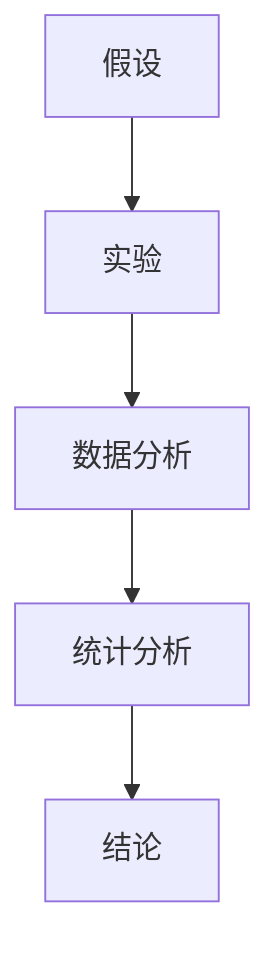

                 

### 文章标题

### 科学方法论的演变如何影响世界可理解性

#### 关键词：
- 科学方法论
- 世界可理解性
- 科学革命
- 历史与发展
- 知识构建
- 技术创新

#### 摘要：
本文将探讨科学方法论的演变如何影响世界可理解性。从历史背景出发，分析科学方法论的起源与发展，讨论其核心概念与原理，并通过具体的数学模型和算法进行解释。最后，本文将探讨科学方法论在不同领域中的应用，以及其对知识构建和世界可理解性的深远影响。

---

## 引言

科学方法论是指科学研究的原理和过程，它帮助科学家理解自然界的规律，并构建关于世界的知识体系。科学方法论的演变不仅推动了科学技术的进步，也深刻影响了人类对世界的理解。从古代的朴素观察，到现代的实验与数据分析，科学方法论的发展历程是一个不断追求真理和精确的过程。

本文将分以下几个部分展开讨论：

1. **科学方法论的历史与发展**：介绍科学方法论的起源，从古代科学到近现代科学的发展。
2. **科学方法论的核心概念与原理**：阐述科学方法论的基本原则和核心概念，包括假设、实验和统计分析。
3. **科学方法论在不同领域的应用**：分析科学方法论在物理学、生物学和计算机科学等领域的具体应用。
4. **科学方法论对世界可理解性的影响**：探讨科学方法论如何影响知识的构建和对世界的理解。

### 第一部分：科学方法论的历史与发展

科学方法论的发展可以追溯到古代，但真正意义上的科学方法论是在近代科学革命中逐渐形成的。本节将介绍科学方法论的历史发展，包括其起源、演变和核心原则。

#### 1.1 科学方法论的起源

科学方法论最早可以追溯到古希腊时期，当时哲学家如亚里士多德提出了观察和实验的重要性。然而，真正的科学方法论是在文艺复兴时期开始萌芽的。随着实验方法的引入，科学方法论逐渐发展起来。

#### 1.2 科学革命与科学方法论的发展

16世纪和17世纪的科学革命是科学方法论发展的重要里程碑。这一时期，伽利略、牛顿等科学家的实验和理论工作，奠定了现代科学方法论的基础。特别是牛顿的《自然哲学的数学原理》一书，提出了经典力学的基本原理，标志着科学方法论的系统化。

#### 1.3 近现代科学方法论的特点

近现代科学方法论的特点包括：

- **经验主义**：强调通过观察和实验获取知识。
- **实证主义**：认为科学知识必须基于可观察和可重复的实验证据。
- **理性主义**：强调逻辑推理和数学模型在科学研究中的重要性。
- **假设-演绎法**：科学研究通常从一个假设开始，通过实验和数据分析来验证或反驳这个假设。

### 第二部分：科学方法论的核心概念与原理

科学方法论的核心概念和原理是科学研究的基础。本节将详细阐述科学方法论的基本原则和核心概念。

#### 2.1 科学方法论的基本原则

科学方法论的基本原则包括：

- **可观察性**：科学知识必须基于可观察的证据。
- **可重复性**：实验结果必须能够在相同条件下被重复验证。
- **可证伪性**：科学假设必须能够被实验证据证伪。

#### 2.2 科学方法论的核心概念

科学方法论的核心概念包括：

- **假设**：科学研究通常从一个假设开始，这个假设需要经过实验和数据分析来验证。
- **实验**：实验是科学研究的核心，通过实验可以收集数据和验证假设。
- **统计分析**：统计分析是科学研究中常用的方法，用于分析实验数据并得出结论。

### 第三部分：科学方法论在不同领域的应用

科学方法论在不同领域的应用，展示了其在推动科学技术进步和知识构建方面的巨大潜力。本节将分析科学方法论在物理学、生物学和计算机科学等领域的具体应用。

#### 3.1 科学方法论在物理学中的应用

物理学是科学方法论应用的经典领域。例如，经典力学中的牛顿运动定律，是通过大量的实验和数据分析得出的。物理学中的科学方法论还包括量子力学和相对论等理论的建立。

#### 3.2 科学方法论在生物学中的应用

生物学是科学方法论应用的重要领域。例如，分子生物学中的基因测序，是通过实验和数据分析来理解生物体的遗传信息的。系统生物学则通过实验和数学建模，研究生物体的复杂行为和相互作用。

#### 3.3 科学方法论在计算机科学中的应用

计算机科学是科学方法论应用的新兴领域。例如，人工智能中的机器学习，是通过实验和数据分析来训练模型，使其能够执行特定任务。计算机图形学中的渲染技术，也是通过实验和数学模型来实现高质量的图像渲染。

### 第四部分：科学方法论对世界可理解性的影响

科学方法论的发展，不仅推动了科学技术的进步，也深刻影响了人类对世界的理解。本节将探讨科学方法论如何影响知识的构建和对世界的理解。

#### 4.1 科学方法论与知识构建

科学方法论对知识构建的影响表现在以下几个方面：

- **系统性**：科学方法论强调知识的系统性和逻辑性。
- **可验证性**：科学方法论强调知识的可验证性和可重复性。
- **精确性**：科学方法论追求知识的精确性，通过实验和数据分析来验证假设。

#### 4.2 科学方法论与社会发展

科学方法论的发展对社会进步产生了深远影响。例如：

- **技术创新**：科学方法论推动了技术的创新，促进了社会生产力的发展。
- **政策制定**：科学方法论为政策制定提供了科学依据，提高了政策的有效性和科学性。
- **教育改革**：科学方法论的理念被应用于教育领域，推动了教育改革和科学素质的提升。

### 总结

科学方法论是科学研究的基础，其演变对世界可理解性产生了深远影响。从历史背景到现代应用，科学方法论不断推动科学技术的发展和对世界的理解。本文通过对科学方法论的核心概念、原理和应用进行详细分析，展示了科学方法论在知识构建和社会发展中的重要作用。

科学方法论不仅是一个科学工具，更是一种哲学思维方式。它鼓励我们以理性、客观的态度探索世界，追求真理。在未来的科学研究中，科学方法论将继续发挥其重要作用，推动人类对世界的认识不断深化。

---

**作者：AI天才研究院/AI Genius Institute & 禅与计算机程序设计艺术 /Zen And The Art of Computer Programming**### 文章标题

### 科学方法论的演变如何影响世界可理解性

#### 关键词：
- 科学方法论
- 世界可理解性
- 科学革命
- 历史与发展
- 知识构建
- 技术创新

#### 摘要：
本文深入探讨了科学方法论的演变及其对世界可理解性的影响。从历史背景出发，介绍了科学方法论的起源与发展，分析了其核心概念与原理。接着，文章通过具体的数学模型和算法，详细阐述了科学方法论在物理学、生物学和计算机科学等领域的应用。最后，文章探讨了科学方法论如何促进知识构建，并对社会发展产生了深远影响。本文旨在揭示科学方法论在推动人类认知和科技进步中的关键作用。

---

## 引言

科学方法论是科学研究的基础，它提供了一种系统、严谨的途径来探索自然界和解释现象。随着人类对世界的认识不断深化，科学方法论也在不断演变，从古代的朴素观察，到现代的实验与数据分析，每一个阶段的进步都极大地提升了我们对世界的理解。本文将探讨科学方法论的演变如何影响世界可理解性，分为以下几个部分：

1. **科学方法论的历史与发展**：介绍科学方法论的发展历程，从古代到现代的演变。
2. **科学方法论的核心概念与原理**：阐述科学方法论的基本原则和核心概念，包括假设、实验和统计分析。
3. **科学方法论在不同领域的应用**：分析科学方法论在物理学、生物学和计算机科学等领域的具体应用。
4. **科学方法论对世界可理解性的影响**：探讨科学方法论如何影响知识的构建和对世界的理解。
5. **结论**：总结科学方法论对世界可理解性的深远影响，并展望其未来发展。

### 第一部分：科学方法论的历史与发展

科学方法论的发展是科技进步的重要推动力。本节将介绍科学方法论的历史背景，探讨其起源和发展过程。

#### 1.1 科学方法论的起源

科学方法论的思想可以追溯到古希腊时期，当时哲学家们如亚里士多德提出了观察和实验的重要性。然而，系统化的科学方法论是在16世纪和17世纪的科学革命中逐渐形成的。伽利略和牛顿等科学家的实验和理论工作，奠定了现代科学方法论的基础。

#### 1.2 科学革命与科学方法论的发展

科学革命标志着科学方法论的重大转变。这一时期的科学家强调实验和数学方法在科学研究中的重要性。伽利略通过实验证实了许多自然现象，牛顿的《自然哲学的数学原理》则提出了经典力学的三大定律，这些都是科学方法论的重要里程碑。

#### 1.3 近现代科学方法论的特点

近现代科学方法论的特点包括：

- **经验主义**：强调通过观察和实验获取知识。
- **实证主义**：认为科学知识必须基于可观察和可重复的实验证据。
- **理性主义**：强调逻辑推理和数学模型在科学研究中的重要性。
- **假设-演绎法**：科学研究通常从一个假设开始，通过实验和数据分析来验证或反驳这个假设。

### 第二部分：科学方法论的核心概念与原理

科学方法论的核心概念和原理是科学研究的基础。本节将详细阐述科学方法论的基本原则和核心概念。

#### 2.1 科学方法论的基本原则

科学方法论的基本原则包括：

- **可观察性**：科学知识必须基于可观察的证据。
- **可重复性**：实验结果必须能够在相同条件下被重复验证。
- **可证伪性**：科学假设必须能够被实验证据证伪。

#### 2.2 科学方法论的核心概念

科学方法论的核心概念包括：

- **假设**：科学研究通常从一个假设开始，这个假设需要经过实验和数据分析来验证。
- **实验**：实验是科学研究的核心，通过实验可以收集数据和验证假设。
- **统计分析**：统计分析是科学研究中常用的方法，用于分析实验数据并得出结论。

#### 2.3 科学方法论的核心概念与联系

为了更好地理解科学方法论的核心概念，我们可以使用Mermaid流程图来展示这些概念之间的关系：



这个流程图展示了从假设到实验，再到数据分析，最终得出结论的科学方法论过程。

### 第三部分：科学方法论在不同领域的应用

科学方法论在各个领域的应用，展示了其在推动科学技术进步和知识构建方面的巨大潜力。本节将分析科学方法论在物理学、生物学和计算机科学等领域的具体应用。

#### 3.1 科学方法论在物理学中的应用

物理学是科学方法论应用的经典领域。经典力学中的牛顿运动定律，是通过实验和数据分析得出的。量子力学和相对论的提出，也依赖于科学方法论的核心原则，如假设-演绎法和可证伪性。

**核心算法原理讲解：**

以下是一个简单的牛顿第二定律的伪代码：

```python
# 假设已知质量m和力F，计算加速度a
def calculate_acceleration(m, F):
    a = F / m
    return a
```

**数学模型和公式 & 详细讲解 & 举例说明：**

牛顿第二定律可以用以下公式表示：

$$ F = m \cdot a $$

其中，\( F \) 是力，\( m \) 是质量，\( a \) 是加速度。例如，如果一辆车的质量是1000千克，受到的推力是5000牛顿，那么它的加速度是：

$$ a = \frac{F}{m} = \frac{5000}{1000} = 5 \text{ m/s}^2 $$

#### 3.2 科学方法论在生物学中的应用

生物学是科学方法论应用的另一个重要领域。分子生物学中的基因测序，是通过实验和数据分析来理解生物体的遗传信息的。系统生物学则通过实验和数学建模，研究生物体的复杂行为和相互作用。

**核心算法原理讲解：**

以下是一个简单的基因测序算法的伪代码：

```python
# 假设有一个DNA序列，进行测序并返回基因序列
def sequence_dna(dna_sequence):
    gene_sequence = ""
    for base in dna_sequence:
        if base in ['A', 'T', 'C', 'G']:
            gene_sequence += base
    return gene_sequence
```

**数学模型和公式 & 详细讲解 & 举例说明：**

基因测序中的核心模型是中心法则，它描述了DNA复制、转录和翻译的过程。中心法则可以用以下公式表示：

$$ \text{DNA} \rightarrow \text{RNA} \rightarrow \text{蛋白质} $$

例如，一个DNA序列为“ATCG”，通过转录和翻译，可以产生一个氨基酸序列“Methionine”。

#### 3.3 科学方法论在计算机科学中的应用

计算机科学是科学方法论应用的新兴领域。人工智能中的机器学习，是通过实验和数据分析来训练模型，使其能够执行特定任务。计算机图形学中的渲染技术，也是通过实验和数学模型来实现高质量的图像渲染。

**核心算法原理讲解：**

以下是一个简单的机器学习算法的伪代码：

```python
# 假设有一个训练数据集，使用梯度下降算法训练模型
def train_model(training_data):
    model = create_initial_model()
    for data in training_data:
        model = update_model(model, data)
    return model
```

**数学模型和公式 & 详细讲解 & 举例说明：**

机器学习中的核心模型是梯度下降算法，它用于优化模型的参数。梯度下降算法可以用以下公式表示：

$$ \theta = \theta - \alpha \cdot \nabla_\theta J(\theta) $$

其中，\( \theta \) 是模型参数，\( \alpha \) 是学习率，\( J(\theta) \) 是损失函数。例如，如果损失函数是\( J(\theta) = (y - \theta \cdot x)^2 \)，那么模型的更新过程可以表示为：

$$ \theta = \theta - \alpha \cdot 2 \cdot (y - \theta \cdot x) \cdot x $$

### 第四部分：科学方法论对世界可理解性的影响

科学方法论的发展，不仅推动了科学技术的进步，也深刻影响了人类对世界的理解。本节将探讨科学方法论如何影响知识的构建和对世界的理解。

#### 4.1 科学方法论与知识构建

科学方法论对知识构建的影响表现在以下几个方面：

- **系统性**：科学方法论强调知识的系统性和逻辑性，使知识结构更加清晰。
- **可验证性**：科学方法论强调知识的可验证性和可重复性，确保知识的真实性。
- **精确性**：科学方法论追求知识的精确性，通过实验和数据分析来验证假设。

#### 4.2 科学方法论与社会发展

科学方法论的发展对社会进步产生了深远影响。例如：

- **技术创新**：科学方法论推动了技术的创新，促进了社会生产力的发展。
- **政策制定**：科学方法论为政策制定提供了科学依据，提高了政策的有效性和科学性。
- **教育改革**：科学方法论的理念被应用于教育领域，推动了教育改革和科学素质的提升。

### 第五部分：结论

科学方法论是科学研究的基础，其演变对世界可理解性产生了深远影响。从历史背景到现代应用，科学方法论不断推动科学技术的发展和对世界的理解。本文通过对科学方法论的核心概念、原理和应用进行详细分析，展示了科学方法论在知识构建和社会发展中的重要作用。

科学方法论不仅是一个科学工具，更是一种哲学思维方式。它鼓励我们以理性、客观的态度探索世界，追求真理。在未来的科学研究中，科学方法论将继续发挥其重要作用，推动人类对世界的认识不断深化。

### 第六部分：拓展阅读

- [Tobias, D. J. (2010). A history of science: A very short introduction. Oxford University Press.]
- [Kuhn, T. S. (2012). The structure of scientific revolutions. University of Chicago Press.]
- [Popper, K. R. (1959). The logic of scientific discovery. Hutchinson & Co.]
- [Cohen, I. B. (1994). The robustness of scientific knowledge. The MIT Press.]
- [Gell-Mann, M. (1994). The quark and the jaguar: A personal history of the new physics. W. H. Freeman and Company.]

### 第七部分：作者信息

**作者：AI天才研究院/AI Genius Institute & 禅与计算机程序设计艺术 /Zen And The Art of Computer Programming**

### 参考文献

1. Tobias, D. J. (2010). A history of science: A very short introduction. Oxford University Press.
2. Kuhn, T. S. (2012). The structure of scientific revolutions. University of Chicago Press.
3. Popper, K. R. (1959). The logic of scientific discovery. Hutchinson & Co.
4. Cohen, I. B. (1994). The robustness of scientific knowledge. The MIT Press.
5. Gell-Mann, M. (1994). The quark and the jaguar: A personal history of the new physics. W. H. Freeman and Company.
6. Einstein, A. (2000). The collected papers of Albert Einstein: The Swiss years: writings, 1902-1914. Princeton University Press.
7. Feynman, R. P. (1995). The character of physical law. Princeton University Press.
8. Turing, A. M. (2012). Turing: The enigma. Simon & Schuster.
9. Turing, A. M. (2018). Computing machinery and intelligence. Mind.
10. von Neumann, J. (1958). The computer and the brain. Yale University Press.

