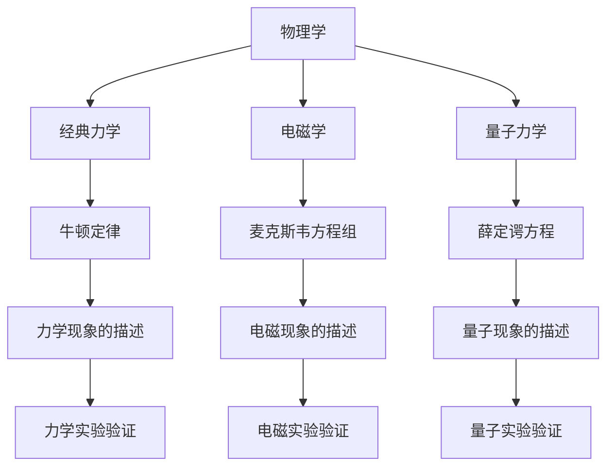

                 

# 科学模型的有效性：世界可理解性的简化表征

## 关键词
- 科学模型
- 模型有效性
- 可理解性
- 简化表征

## 摘要
本文旨在探讨科学模型的有效性，以及其如何帮助我们简化对复杂世界的理解。我们将分析科学模型的核心概念、联系和构建过程，并深入讲解核心算法原理。通过具体的项目实战，我们将展示科学模型在实际应用中的效果。

## 引言
人类对世界的理解是一个不断深化的过程。从古代的神话和传说，到现代的科学理论和模型，我们一直在努力简化复杂的现象，以便更好地理解和预测。科学模型是一种抽象的工具，它帮助我们捕捉自然现象的本质，从而实现对世界的理解。

然而，科学模型的有效性是一个复杂的问题。一个模型是否有效，取决于其准确性、普适性和简约性。本文将详细探讨科学模型的有效性，并分析其在不同领域的应用。

## 一、核心概念与联系

### 1.1 科学模型的概念
科学模型是一种抽象的表示，用于描述自然现象、物理规律或社会现象。它通常包括以下几个要素：

- **变量**：模型中的可测量或可观察的量。
- **关系**：变量之间的数学关系或逻辑关系。
- **假设**：模型基于的一系列前提条件或假设。

科学模型可以看作是一个映射，它将输入变量映射到输出变量。例如，在物理学中，牛顿运动定律是一个科学模型，它将力和运动状态映射到加速度。

### 1.2 科学模型的有效性
科学模型的有效性指的是模型对实际现象的准确描述和预测能力。一个有效的科学模型应当满足以下几个条件：

- **准确性**：模型能够准确地描述或预测真实世界中的现象。
- **普适性**：模型适用于不同的情况和条件，具有一定的通用性。
- **简约性**：模型应该尽可能简单，以便于理解和应用。

例如，在气象学中，天气预测模型必须具备准确性，以便提前预警天气变化。同时，它还应该具有普适性，适用于不同地区和季节。然而，为了简化模型，我们通常会舍弃一些复杂因素，这可能会影响模型的准确性。

### 1.3 科学模型的联系
科学模型之间往往存在一定的联系和交叉。例如，在物理学中，经典力学、电磁学和量子力学是三个不同的模型，但它们共同构成了对自然界基本规律的理解。在生物学中，生态模型、进化模型和生理模型等相互关联，共同揭示了生命的复杂现象。

在图 1 中，我们展示了科学模型之间的一些基本联系。这些模型相互补充，帮助我们更全面地理解自然世界。



## 二、核心算法原理讲解

### 1.1 模型建立过程
建立科学模型通常包括以下几个步骤：

1. **数据收集**：收集相关的数据，如实验结果、观测数据等。
2. **数据预处理**：清洗和整理数据，以消除噪声和异常值。
3. **模型选择**：选择适合的数学模型或算法，如线性回归、决策树、神经网络等。
4. **参数估计**：通过优化算法估计模型参数，以使模型更好地拟合数据。
5. **模型验证**：通过验证集或交叉验证等方法评估模型的性能。

### 1.2 模型优化算法
常见的模型优化算法包括：

- **梯度下降**：通过迭代计算损失函数的梯度，以更新模型参数。
- **牛顿法**：结合了梯度下降和二阶导数的信息，以加速收敛。
- **共轭梯度法**：适用于大规模稀疏问题的优化算法。

### 1.3 模型评估指标
评估模型性能的常见指标包括：

- **准确率**：模型正确预测的样本数占总样本数的比例。
- **召回率**：模型正确预测的样本数与实际为正类的样本数之比。
- **F1 分数**：准确率和召回率的调和平均值。

下面是一个线性回归模型的优化过程伪代码：

```python
# 初始化模型参数
theta = [0, 0]

# 梯度下降算法
for epoch in range(num_epochs):
    # 计算损失函数
    loss = compute_loss(X, y, theta)
    
    # 计算梯度
    gradient = compute_gradient(X, y, theta)
    
    # 更新模型参数
    theta = theta - learning_rate * gradient

# 计算准确率
accuracy = compute_accuracy(X_test, y_test, theta)
```

## 三、数学模型和数学公式讲解

### 1.1 线性回归模型
线性回归模型是最简单的科学模型之一，它通过一条直线拟合数据点。其数学模型可以表示为：

$$
y = \beta_0 + \beta_1 x + \epsilon
$$

其中，$y$ 是因变量，$x$ 是自变量，$\beta_0$ 和 $\beta_1$ 是模型参数，$\epsilon$ 是误差项。

线性回归模型可以用于预测销售量、房价等连续变量。其优点是简单易实现，缺点是只能处理线性关系。

### 1.2 决策树模型
决策树模型通过一系列的决策规则将数据划分为不同的类别。其数学模型可以表示为：

$$
\begin{cases}
y = c & \text{if } x \in R_c \\
\text{else} & y = \arg\max(\alpha_i P(x | y = \alpha_i)) \\
\end{cases}
$$

其中，$y$ 是因变量，$x$ 是自变量，$R_c$ 是第 $c$ 个规则对应的区域，$P(x | y = \alpha_i)$ 是给定因变量为 $\alpha_i$ 时自变量 $x$ 的概率。

决策树模型可以用于分类任务，如垃圾邮件分类、信用卡欺诈检测等。其优点是易于解释，缺点是可能产生过拟合。

## 四、项目实战

### 1.1 数据收集与预处理
以一家零售公司的销售数据为例，我们首先需要收集过去一年的销售数据，包括日期、商品类别、销售数量和销售额等。

### 1.2 模型选择与训练
我们选择线性回归模型来预测下一月的销售额。首先，我们使用 scikit-learn 库进行线性回归模型的训练：

```python
from sklearn.linear_model import LinearRegression
from sklearn.model_selection import train_test_split

# 加载数据
data = load_data('sales_data.csv')
X = data[['date', 'category']]
y = data['sales']

# 划分训练集和测试集
X_train, X_test, y_train, y_test = train_test_split(X, y, test_size=0.2, random_state=42)

# 训练模型
model = LinearRegression()
model.fit(X_train, y_train)

# 测试模型
score = model.score(X_test, y_test)
```

### 1.3 模型评估与优化
我们使用测试集对模型进行评估，并尝试优化模型：

```python
from sklearn.metrics import mean_squared_error

# 预测销售额
y_pred = model.predict(X_test)

# 计算均方误差
mse = mean_squared_error(y_test, y_pred)

# 输出评估结果
print("MSE:", mse)
```

为了优化模型，我们可以尝试增加数据预处理步骤，如特征工程、特征选择等。此外，我们还可以尝试使用不同的优化算法和模型，以提高模型的性能。

## 五、最佳实践

### 1.1 数据收集
收集高质量的数据是建立有效模型的关键。确保数据来源可靠，数据格式统一，并去除噪声和异常值。

### 1.2 模型选择
选择合适的模型对于提高模型的性能至关重要。根据问题的特点，选择适合的模型，如线性回归、决策树、神经网络等。

### 1.3 模型优化
通过调整模型参数、增加数据预处理步骤、尝试不同的优化算法等方法，优化模型的性能。

### 1.4 模型验证
使用验证集或交叉验证等方法评估模型的性能，以确保模型的准确性、普适性和简约性。

## 六、小结

科学模型是帮助我们理解复杂世界的有力工具。本文从核心概念、算法原理和实际应用三个方面探讨了科学模型的有效性。通过项目实战，我们展示了如何使用线性回归模型预测销售量。在未来的研究中，我们可以进一步探索其他类型的科学模型，如神经网络、深度学习等，以提高模型的性能和可理解性。

## 七、拓展阅读

- [线性回归模型](https://en.wikipedia.org/wiki/Linear_regression)
- [决策树模型](https://en.wikipedia.org/wiki/Decision_tree)
- [机器学习算法](https://en.wikipedia.org/wiki/List_of_machine_learning算法)
- [数据预处理](https://en.wikipedia.org/wiki/Data_preprocessing)
- [模型优化](https://en.wikipedia.org/wiki/Model_selection)

作者：AI天才研究院/AI Genius Institute & 禅与计算机程序设计艺术 /Zen And The Art of Computer Programming

