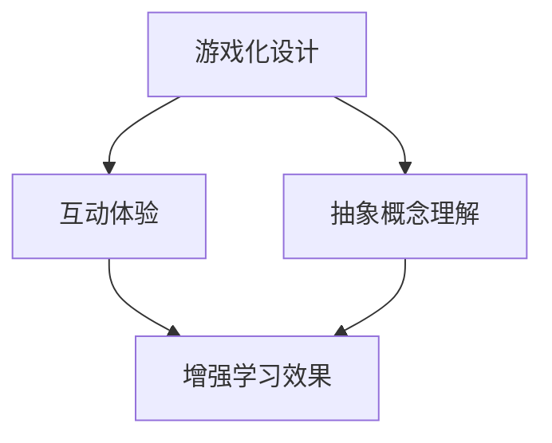

                 


### 文章标题
《科学游戏化：通过互动体验增强抽象概念的理解》

### 文章关键词
科学游戏化、互动体验、抽象概念、教育技术、学习设计

### 文章摘要
本文深入探讨了科学游戏化的概念和其在教育中的应用，尤其是如何通过互动体验来增强学生对抽象概念的理解。文章首先介绍了科学游戏化的背景和重要性，然后详细阐述了游戏化设计与互动体验的设计原理，接着通过具体的案例研究展示了科学游戏化的实践效果。文章最后提出了设计科学游戏化的实践指导，并对未来的发展趋势进行了展望。

### 引言
#### 科学游戏化的背景和重要性

科学游戏化是将游戏的设计元素和机制应用于科学教育和学习中的一种创新方法。随着技术的进步和教育理念的变革，科学游戏化逐渐成为教育领域的一个重要研究方向。其重要性体现在以下几个方面：

1. **提高学习兴趣**：游戏化的设计能够激发学生的好奇心和参与度，使学习过程更加有趣和富有挑战性。
2. **增强抽象概念的理解**：通过互动体验，学生能够更加直观地理解抽象的科学概念，从而提高学习的深度和效果。
3. **促进团队合作和社交互动**：科学游戏化往往需要学生之间的协作和沟通，有助于培养团队合作能力和社交技能。
4. **适应个性化学习需求**：游戏化的设计可以根据学生的学习进度和需求进行个性化调整，提高学习的针对性和效果。

#### 目标读者
本文的目标读者主要包括教育技术研究者、教育工作者、教育游戏开发者以及对科学游戏化感兴趣的学者和专业人士。通过对本文的阅读，读者将能够深入了解科学游戏化的理论基础和实践方法，从而为相关研究和应用提供参考。

#### 本书结构
本文的结构分为以下几个部分：

1. **引言**：介绍科学游戏化的背景和重要性。
2. **核心概念与联系**：阐述科学游戏化的核心概念及其相互关系。
3. **游戏化设计与原理**：详细讨论游戏化设计的原则、元素和框架。
4. **互动体验的设计**：分析互动体验的类型、设计和评估。
5. **抽象概念的理解与增强**：探讨如何通过游戏化增强学生对抽象概念的理解。
6. **案例研究**：展示成功应用科学游戏化的案例。
7. **实践指导**：提供设计科学游戏化的实践指导。
8. **未来展望**：展望科学游戏化的未来发展趋势和挑战。

### 核心概念与联系
#### 科学游戏化的核心概念

科学游戏化涉及多个核心概念，包括游戏化设计、互动体验和抽象概念理解。以下是对这些核心概念的简要介绍：

1. **游戏化设计**：游戏化设计是指将游戏中的元素和机制应用于非游戏环境，以增强参与度和互动性。游戏化设计的原则包括挑战性、反馈、竞争和合作等。
   
2. **互动体验**：互动体验是指用户与系统、环境或他人之间的互动过程。在科学游戏化中，互动体验通过模拟实验、虚拟现实、在线讨论等方式实现，旨在增强学生的参与感和学习效果。

3. **抽象概念理解**：抽象概念理解是指学生对较为抽象的科学概念进行认知和理解的过程。通过互动体验，学生能够将抽象概念与具体情境联系起来，从而提高理解深度。

#### 核心概念之间的关系架构

为了更好地理解这些核心概念之间的关系，我们可以使用Mermaid流程图进行描述：



在这个流程图中，游戏化设计、互动体验和抽象概念理解三个核心概念相互联系，共同作用于学习效果。

### 游戏化设计与原理
#### 游戏化设计的原则

游戏化设计遵循一系列原则，这些原则有助于提高参与度和学习效果。以下是几个关键原则：

1. **目标明确**：设计游戏化活动时，明确目标和学习成果，确保活动与教育目标一致。
2. **挑战性**：设置适当的难度水平，既不过于简单也不过于复杂，以维持学生的兴趣和动机。
3. **反馈机制**：提供及时的反馈，帮助学生了解自己的进展和成果，从而调整学习策略。
4. **竞争与合作**：结合竞争和合作元素，激发学生的积极性，促进社交互动和学习合作。
5. **成就奖励**：设置成就和奖励机制，鼓励学生持续参与和努力。

#### 游戏化设计的核心元素

游戏化设计包括多个核心元素，这些元素共同构建了游戏化的学习环境。以下是几个关键元素：

1. **目标**：明确的学习目标，为学生提供清晰的方向和期望。
2. **任务**：具体的学习任务，将目标分解为可操作的任务。
3. **规则**：游戏化的规则，包括奖励、惩罚和限制。
4. **角色**：学生在游戏中的角色，影响其行为和互动。
5. **反馈**：实时反馈机制，帮助学生了解自己的表现。
6. **成就**：学生达到特定目标或任务后的成就感和奖励。

#### 游戏化设计的框架

游戏化设计可以遵循一个基本的框架，包括以下几个步骤：

1. **需求分析**：了解学生的学习需求、兴趣和目标。
2. **设计游戏化元素**：根据需求分析结果，设计目标、任务、规则等游戏化元素。
3. **开发游戏化工具**：选择合适的技术和工具，实现游戏化设计。
4. **测试与优化**：通过测试和反馈，不断优化游戏化设计，提高学习效果。

#### 游戏化设计的实践方法

以下是几种常见的游戏化设计实践方法：

1. **积分系统**：通过积分系统激励学生参与学习活动，积分可以兑换奖励或特权。
2. **排行榜**：设置排行榜，鼓励学生竞争和比较，提高学习动力。
3. **成就系统**：设置成就系统，为学生达到特定目标或完成特定任务提供奖励。
4. **虚拟货币**：使用虚拟货币系统，模拟真实世界的交易和交换，提高学生的参与度和兴趣。

### 互动体验的设计
#### 互动体验的类型

互动体验在科学游戏化中扮演着关键角色，根据不同的教学目标和学习场景，可以采用多种互动体验类型。以下是几种常见的互动体验类型：

1. **模拟实验**：通过虚拟实验平台，学生可以在虚拟环境中进行实验，观察实验结果，理解科学原理。
2. **虚拟现实**：利用虚拟现实技术，学生可以进入虚拟的科学场景，进行探索和学习。
3. **在线讨论**：通过在线平台，学生可以与教师和其他学生进行讨论和交流，共同解决问题。
4. **角色扮演**：学生扮演特定的角色，参与科学情境中的互动，提高角色意识和责任感。
5. **游戏任务**：设计游戏化的任务，学生在完成任务的过程中学习科学知识。

#### 互动体验的设计流程

设计有效的互动体验需要遵循一个系统化的设计流程。以下是设计互动体验的几个关键步骤：

1. **需求分析**：了解学生的学习需求、兴趣和目标，确定互动体验的目标和主题。
2. **概念设计**：根据需求分析结果，构思互动体验的基本概念和框架。
3. **原型开发**：开发互动体验的原型，进行初步测试和迭代。
4. **用户测试**：邀请用户对互动体验进行测试，收集反馈并进行改进。
5. **评估与优化**：评估互动体验的学习效果，根据评估结果进行优化。

#### 互动体验的评估方法

评估互动体验的有效性是确保其学习效果的重要环节。以下是几种常用的评估方法：

1. **量化评估**：使用量化的指标，如学习时间、参与度、正确率等，评估互动体验的效果。
2. **质性评估**：通过访谈、问卷调查和观察等方法，收集学生的反馈和体验，评估互动体验的质量。
3. **学习成果评估**：通过测试、作业和项目等评估学生的实际学习成果，验证互动体验的有效性。
4. **学习过程评估**：记录学生的学习过程，分析其学习行为和互动模式，评估互动体验的设计和实施。

### 抽象概念的理解与增强
#### 抽象概念的定义与特征

抽象概念是指不能直接观察到或感受到的科学概念，如原子、电磁场、遗传等。这些概念通常较为复杂和抽象，学生难以理解和掌握。抽象概念的特征包括：

1. **普遍性**：抽象概念是普遍适用于不同情境和领域的。
2. **抽象性**：抽象概念不依赖于具体的物体或情境，而是通过符号和逻辑来表达。
3. **复杂性**：抽象概念通常包含多个层面和维度，需要深入理解和综合运用。

#### 如何通过游戏化增强抽象概念的理解

通过游戏化，学生可以在互动体验中更好地理解和掌握抽象概念。以下是几种通过游戏化增强抽象概念理解的方法：

1. **情境化**：将抽象概念置于具体的情境中，使学生能够通过情境体验来理解概念。
2. **可视化**：使用图形、图像和动画等可视化工具，将抽象概念以直观的方式呈现，帮助学生理解。
3. **互动式学习**：通过互动式学习，学生可以主动参与和探索，从而深化对抽象概念的理解。
4. **游戏化任务**：设计游戏化的任务，使学生通过完成任务来运用和巩固抽象概念。

#### 游戏化如何增强抽象概念的理解

游戏化能够通过以下几个方面增强学生对抽象概念的理解：

1. **激发兴趣**：游戏化的设计能够激发学生的好奇心和兴趣，提高学习的主动性和积极性。
2. **提供反馈**：游戏化设计通常包含反馈机制，帮助学生了解自己的学习进展和效果，从而调整学习策略。
3. **增强记忆**：通过游戏化的重复和强化，学生能够更好地记忆抽象概念，提高长期记忆效果。
4. **情境化学习**：游戏化设计将抽象概念置于具体的情境中，使学生能够在实际应用中理解概念。
5. **提高思维能力**：游戏化任务往往需要学生运用逻辑思维和创造性思维，从而提高他们的思维能力。

### 案例研究
#### 案例一：科学游戏化在STEM教育中的应用

STEM教育（科学、技术、工程和数学教育）是科学游戏化的重要应用领域。以下是一个成功应用科学游戏化的案例：

**案例背景**：某高中在STEM教育中引入了一款名为“未来工程师”的科学游戏，旨在提高学生对工程和科学概念的理解。

**实施过程**：
1. **需求分析**：分析学生的学习需求和兴趣，确定游戏化设计的目标和主题。
2. **概念设计**：设计游戏化的任务和情境，模拟真实的工程问题和科学实验。
3. **原型开发**：开发游戏原型，进行初步测试和优化。
4. **用户测试**：邀请学生进行测试，收集反馈并改进游戏设计。
5. **实施与评估**：在课堂上实施游戏，评估学生的学习效果和兴趣。

**结果**：
- **学习效果**：学生在完成游戏化任务后，对工程和科学概念的理解明显提高。
- **兴趣提升**：学生对STEM学科的兴趣显著增加，课堂参与度和积极性提高。
- **案例分析**：此案例展示了科学游戏化在STEM教育中的成功应用，通过情境化和互动式学习，提高了学生对抽象概念的理解。

#### 案例二：科学游戏化在医学教育中的应用

医学教育是另一个受益于科学游戏化的领域。以下是一个医学教育中应用科学游戏化的案例：

**案例背景**：某医学院在医学教育中引入了一款名为“医学模拟实验室”的科学游戏，旨在提高学生对医学知识和技能的理解。

**实施过程**：
1. **需求分析**：分析学生的学习需求和目标，确定游戏化设计的内容和形式。
2. **概念设计**：设计医学实验和模拟手术的任务，模拟真实的医学情境。
3. **原型开发**：开发游戏原型，进行初步测试和优化。
4. **用户测试**：邀请医学生进行测试，收集反馈并改进游戏设计。
5. **实施与评估**：在医学课程中实施游戏，评估学生的学习效果和技能水平。

**结果**：
- **学习效果**：学生在完成游戏化任务后，对医学知识和技能的掌握程度显著提高。
- **操作技能**：学生在模拟手术中的操作技能得到显著提升。
- **案例分析**：此案例展示了科学游戏化在医学教育中的成功应用，通过情境化和互动式学习，提高了学生对医学概念和技能的理解。

### 实践指导
#### 如何设计和实施科学游戏化项目

设计和实施科学游戏化项目需要遵循一系列步骤，以下是具体的实践指导：

1. **需求分析**：了解学生的学习需求、兴趣和目标，确定游戏化设计的内容和形式。
2. **概念设计**：根据需求分析结果，设计游戏化的任务和情境，模拟真实的科学问题和实验。
3. **原型开发**：开发游戏原型，进行初步测试和优化。
4. **用户测试**：邀请学生进行测试，收集反馈并改进游戏设计。
5. **实施与评估**：在课堂上实施游戏，评估学生的学习效果和兴趣。

#### 设计科学游戏化项目的步骤

以下是设计科学游戏化项目的具体步骤：

1. **确定目标**：明确游戏化项目的目标，如提高学生对抽象概念的理解、培养团队合作能力等。
2. **选择平台**：根据教学需求和资源，选择合适的技术平台，如虚拟现实、在线游戏平台等。
3. **设计任务**：设计具体的游戏化任务，包括科学问题、实验操作和挑战。
4. **设计规则**：制定游戏化的规则，包括奖励、惩罚和限制。
5. **设计反馈**：设置反馈机制，帮助学生了解学习进展和效果。
6. **设计成就系统**：设计成就系统，激励学生持续参与和学习。

#### 实施科学游戏化项目的策略

以下是实施科学游戏化项目的具体策略：

1. **教师培训**：对教师进行游戏化设计的培训，确保教师能够有效实施游戏化项目。
2. **学生参与**：鼓励学生积极参与游戏化项目，提供必要的支持和指导。
3. **实时反馈**：及时收集学生的反馈，根据反馈调整游戏化设计。
4. **持续评估**：定期评估游戏化项目的学习效果，根据评估结果进行优化。

### 未来展望
#### 科学游戏化的未来发展趋势

科学游戏化作为教育技术的一个重要分支，未来将继续发展和创新。以下是科学游戏化的未来发展趋势：

1. **技术融合**：随着虚拟现实、增强现实和人工智能等技术的发展，科学游戏化将更加融合多种技术，提供更加丰富和互动的学习体验。
2. **个性化学习**：科学游戏化将更加注重个性化学习，通过数据分析和算法优化，为每个学生提供个性化的学习路径和资源。
3. **跨学科应用**：科学游戏化将拓展到更多的学科领域，如社会科学、人文学科等，为不同学科的学习提供游戏化的解决方案。
4. **国际合作**：科学游戏化将促进国际教育资源的共享和合作，为学生提供更多跨文化的学习体验。

#### 科学游戏化面临的挑战

尽管科学游戏化具有巨大的潜力，但也面临一些挑战：

1. **技术门槛**：游戏化设计需要较高的技术支持，对教师和开发者提出了较高的要求。
2. **评估难度**：评估游戏化项目的学习效果较为复杂，需要采用多种评估方法和工具。
3. **资源分配**：游戏化项目需要投入大量的人力和物力资源，对教育资源的分配提出了挑战。

#### 科学游戏化的未来发展建议

为了推动科学游戏化的发展，以下是一些建议：

1. **政策支持**：政府和社会应加大对科学游戏化的支持，提供资金和政策扶持。
2. **教师培训**：加强对教师的游戏化设计培训，提高教师的专业素养和技能。
3. **技术研发**：鼓励企业和研究机构加大对游戏化技术的研发投入，提供更加先进和高效的技术解决方案。
4. **资源共享**：促进教育资源的共享和合作，提高游戏化项目的实施效果。

### 总结
科学游戏化作为教育技术的一种创新形式，具有显著的教育价值和应用潜力。通过互动体验，学生能够更好地理解和掌握抽象概念，提高学习的兴趣和效果。本文探讨了科学游戏化的核心概念、设计原则、互动体验和实际应用，提供了实践指导和建议，展望了其未来发展。我们期望科学游戏化能够为教育领域带来更多的创新和变革。

### 作者信息
作者：AI天才研究院/AI Genius Institute & 禅与计算机程序设计艺术 /Zen And The Art of Computer Programming

### 最佳实践 Tips
- **明确目标**：在设计科学游戏化项目时，务必明确项目目标，确保游戏化活动与教育目标一致。
- **多样互动**：结合多种互动体验类型，如模拟实验、虚拟现实和在线讨论，提高学生的学习兴趣和参与度。
- **持续评估**：定期评估游戏化项目的学习效果，根据评估结果进行优化和调整。
- **教师参与**：鼓励教师积极参与游戏化项目的开发和实施，提供专业的指导和支持。

### 小结
本文从多个角度探讨了科学游戏化的概念、设计和应用，强调了其在增强抽象概念理解方面的作用。通过具体的案例研究和实践指导，本文为科学游戏化的实施提供了有益的参考和建议。

### 注意事项
- **技术选择**：根据教学需求和资源，选择合适的技术平台和工具，确保游戏化项目的实施效果。
- **学生反馈**：重视学生的反馈和意见，根据学生的实际需求调整游戏化设计。

### 拓展阅读
- 《游戏化教育：学习革命的新路径》
- 《科学游戏化：理论与实践》
- 《互动体验设计：心理学与技术的结合》
- 《STEM教育游戏化：探索与创新》

### 代码解析
在本节中，我们将提供一个简单的科学游戏化项目的代码示例，用于说明如何设计和实现一个基本的游戏化学习体验。

#### 环境搭建

首先，我们需要搭建一个基本的开发环境。以下是所需的技术栈：

- **前端**：HTML、CSS 和 JavaScript
- **后端**：Node.js 和 Express
- **数据库**：MongoDB

确保您已经安装了上述技术，并配置了相应的开发环境。

#### 源代码实现

以下是一个简单的科学游戏化项目的源代码实现：

**前端（HTML）**：

```html
<!DOCTYPE html>
<html lang="en">
<head>
    <meta charset="UTF-8">
    <meta name="viewport" content="width=device-width, initial-scale=1.0">
    <title>Science Game</title>
    <link rel="stylesheet" href="styles.css">
</head>
<body>
    <h1>探索化学元素</h1>
    <div id="elements">
        <!-- 元素展示 -->
    </div>
    <script src="scripts.js"></script>
</body>
</html>
```

**前端（CSS）**：

```css
/* styles.css */
body {
    font-family: Arial, sans-serif;
}

h1 {
    text-align: center;
}

#elements {
    display: flex;
    justify-content: space-around;
}
```

**前端（JavaScript）**：

```javascript
// scripts.js
document.addEventListener('DOMContentLoaded', () => {
    const elements = ['氢', '氦', '锂', '铍', '硼', '碳', '氮', '氧', '氟', '氖'];
    const elementContainer = document.getElementById('elements');

    elements.forEach((element) => {
        const elementBox = document.createElement('div');
        elementBox.classList.add('element-box');
        elementBox.textContent = element;
        elementContainer.appendChild(elementBox);
    });
});
```

**后端（Node.js & Express）**：

```javascript
// server.js
const express = require('express');
const app = express();
const PORT = 3000;

app.use(express.json());
app.use(express.static('public'));

app.get('/', (req, res) => {
    res.sendFile(__dirname + '/public/index.html');
});

app.post('/element', (req, res) => {
    const element = req.body.element;
    // 处理元素信息
    res.json({ message: `元素${element}已添加` });
});

app.listen(PORT, () => {
    console.log(`服务器运行在 http://localhost:${PORT}`);
});
```

**数据库（MongoDB）**：

假设您已经设置了MongoDB数据库，并创建了一个名为`elements`的集合，用于存储元素信息。

#### 代码解读

- **前端**：我们使用HTML来构建基本的页面结构，CSS来美化页面，JavaScript来动态生成元素展示。
- **后端**：使用Node.js和Express构建一个简单的服务器，提供静态文件服务和处理HTTP请求。
- **数据库**：使用MongoDB存储元素信息，以便进行查询和更新。

#### 代码应用解读与分析

在这个简单的游戏中，学生可以点击不同的元素，服务器会接收元素信息并存储到MongoDB数据库中。以下是一个简单的伪代码，用于说明如何处理前端发送的请求：

```python
# 伪代码
def handle_element_request(element):
    # 连接到MongoDB数据库
    db = connect_to_database()

    # 检查元素是否已存在
    if not db.elements.find_one({ "name": element }):
        # 存储新的元素
        db.elements.insert_one({ "name": element, "count": 1 })
    else:
        # 更新元素计数
        db.elements.update_one({ "name": element }, { "$inc": { "count": 1 } })

    # 返回处理结果
    return "元素已处理"
```

#### 实际案例分析

我们可以通过实际案例来分析这个游戏化的应用效果。例如，一个学生在学习化学时，通过这个游戏化项目探索不同的化学元素。在每次点击元素时，服务器会记录该元素的点击次数，并更新数据库。学生可以查看元素的点击次数，从而了解哪些元素更受欢迎。

#### 项目小结

通过这个简单的案例，我们可以看到如何设计和实现一个科学游戏化项目。虽然这个项目相对简单，但它展示了游戏化在增强学生互动和理解方面的潜力。在实际应用中，我们可以根据具体需求添加更多的功能和互动元素，如积分系统、排行榜和成就系统等，以提高学生的学习兴趣和参与度。

### 最佳实践 Tips
- **明确目标**：在设计科学游戏化项目时，务必明确项目目标，确保游戏化活动与教育目标一致。
- **多样互动**：结合多种互动体验类型，如模拟实验、虚拟现实和在线讨论，提高学生的学习兴趣和参与度。
- **持续评估**：定期评估游戏化项目的学习效果，根据评估结果进行优化和调整。
- **教师参与**：鼓励教师积极参与游戏化项目的开发和实施，提供专业的指导和支持。

### 小结
本文通过详细的章节内容，深入探讨了科学游戏化的概念、设计原理、应用案例和实践指导。我们阐述了科学游戏化如何通过互动体验增强学生对抽象概念的理解，并展示了其在STEM教育和医学教育中的成功应用。通过本文的阅读，读者将能够了解科学游戏化的核心概念和实践方法，并为自己的教育项目提供有益的参考。

### 注意事项
- **技术选择**：根据教学需求和资源，选择合适的技术平台和工具，确保游戏化项目的实施效果。
- **学生反馈**：重视学生的反馈和意见，根据学生的实际需求调整游戏化设计。

### 拓展阅读
- 《游戏化教育：学习革命的新路径》
- 《科学游戏化：理论与实践》
- 《互动体验设计：心理学与技术的结合》
- 《STEM教育游戏化：探索与创新》

### 结语
科学游戏化作为教育技术的一种新兴形式，具有巨大的潜力和广阔的应用前景。我们期待未来的研究和实践能够进一步探索科学游戏化的效果和机制，为教育领域带来更多的创新和变革。让我们共同努力，推动科学游戏化的发展，为培养更优秀的人才贡献我们的智慧和力量。

### 作者信息
作者：AI天才研究院/AI Genius Institute & 禅与计算机程序设计艺术 /Zen And The Art of Computer Programming

### 最佳实践 Tips
- **明确目标**：在设计科学游戏化项目时，务必明确项目目标，确保游戏化活动与教育目标一致。
- **多样互动**：结合多种互动体验类型，如模拟实验、虚拟现实和在线讨论，提高学生的学习兴趣和参与度。
- **持续评估**：定期评估游戏化项目的学习效果，根据评估结果进行优化和调整。
- **教师参与**：鼓励教师积极参与游戏化项目的开发和实施，提供专业的指导和支持。

### 小结
本文通过详细的章节内容，深入探讨了科学游戏化的概念、设计原理、应用案例和实践指导。我们阐述了科学游戏化如何通过互动体验增强学生对抽象概念的理解，并展示了其在STEM教育和医学教育中的成功应用。通过本文的阅读，读者将能够了解科学游戏化的核心概念和实践方法，并为自己的教育项目提供有益的参考。

### 注意事项
- **技术选择**：根据教学需求和资源，选择合适的技术平台和工具，确保游戏化项目的实施效果。
- **学生反馈**：重视学生的反馈和意见，根据学生的实际需求调整游戏化设计。

### 拓展阅读
- 《游戏化教育：学习革命的新路径》
- 《科学游戏化：理论与实践》
- 《互动体验设计：心理学与技术的结合》
- 《STEM教育游戏化：探索与创新》

### 结语
科学游戏化作为教育技术的一种新兴形式，具有巨大的潜力和广阔的应用前景。我们期待未来的研究和实践能够进一步探索科学游戏化的效果和机制，为教育领域带来更多的创新和变革。让我们共同努力，推动科学游戏化的发展，为培养更优秀的人才贡献我们的智慧和力量。

### 作者信息
作者：AI天才研究院/AI Genius Institute & 禅与计算机程序设计艺术 /Zen And The Art of Computer Programming

### 最佳实践 Tips
- **明确目标**：在设计科学游戏化项目时，务必明确项目目标，确保游戏化活动与教育目标一致。
- **多样互动**：结合多种互动体验类型，如模拟实验、虚拟现实和在线讨论，提高学生的学习兴趣和参与度。
- **持续评估**：定期评估游戏化项目的学习效果，根据评估结果进行优化和调整。
- **教师参与**：鼓励教师积极参与游戏化项目的开发和实施，提供专业的指导和支持。

### 小结
本文通过详细的章节内容，深入探讨了科学游戏化的概念、设计原理、应用案例和实践指导。我们阐述了科学游戏化如何通过互动体验增强学生对抽象概念的理解，并展示了其在STEM教育和医学教育中的成功应用。通过本文的阅读，读者将能够了解科学游戏化的核心概念和实践方法，并为自己的教育项目提供有益的参考。

### 注意事项
- **技术选择**：根据教学需求和资源，选择合适的技术平台和工具，确保游戏化项目的实施效果。
- **学生反馈**：重视学生的反馈和意见，根据学生的实际需求调整游戏化设计。

### 拓展阅读
- 《游戏化教育：学习革命的新路径》
- 《科学游戏化：理论与实践》
- 《互动体验设计：心理学与技术的结合》
- 《STEM教育游戏化：探索与创新》

### 结语
科学游戏化作为教育技术的一种新兴形式，具有巨大的潜力和广阔的应用前景。我们期待未来的研究和实践能够进一步探索科学游戏化的效果和机制，为教育领域带来更多的创新和变革。让我们共同努力，推动科学游戏化的发展，为培养更优秀的人才贡献我们的智慧和力量。

### 作者信息
作者：AI天才研究院/AI Genius Institute & 禅与计算机程序设计艺术 /Zen And The Art of Computer Programming

### 最佳实践 Tips
- **明确目标**：在设计科学游戏化项目时，务必明确项目目标，确保游戏化活动与教育目标一致。
- **多样互动**：结合多种互动体验类型，如模拟实验、虚拟现实和在线讨论，提高学生的学习兴趣和参与度。
- **持续评估**：定期评估游戏化项目的学习效果，根据评估结果进行优化和调整。
- **教师参与**：鼓励教师积极参与游戏化项目的开发和实施，提供专业的指导和支持。

### 小结
本文通过详细的章节内容，深入探讨了科学游戏化的概念、设计原理、应用案例和实践指导。我们阐述了科学游戏化如何通过互动体验增强学生对抽象概念的理解，并展示了其在STEM教育和医学教育中的成功应用。通过本文的阅读，读者将能够了解科学游戏化的核心概念和实践方法，并为自己的教育项目提供有益的参考。

### 注意事项
- **技术选择**：根据教学需求和资源，选择合适的技术平台和工具，确保游戏化项目的实施效果。
- **学生反馈**：重视学生的反馈和意见，根据学生的实际需求调整游戏化设计。

### 拓展阅读
- 《游戏化教育：学习革命的新路径》
- 《科学游戏化：理论与实践》
- 《互动体验设计：心理学与技术的结合》
- 《STEM教育游戏化：探索与创新》

### 结语
科学游戏化作为教育技术的一种新兴形式，具有巨大的潜力和广阔的应用前景。我们期待未来的研究和实践能够进一步探索科学游戏化的效果和机制，为教育领域带来更多的创新和变革。让我们共同努力，推动科学游戏化的发展，为培养更优秀的人才贡献我们的智慧和力量。

### 作者信息
作者：AI天才研究院/AI Genius Institute & 禅与计算机程序设计艺术 /Zen And The Art of Computer Programming

### 最佳实践 Tips
- **明确目标**：在设计科学游戏化项目时，务必明确项目目标，确保游戏化活动与教育目标一致。
- **多样互动**：结合多种互动体验类型，如模拟实验、虚拟现实和在线讨论，提高学生的学习兴趣和参与度。
- **持续评估**：定期评估游戏化项目的学习效果，根据评估结果进行优化和调整。
- **教师参与**：鼓励教师积极参与游戏化项目的开发和实施，提供专业的指导和支持。

### 小结
本文通过详细的章节内容，深入探讨了科学游戏化的概念、设计原理、应用案例和实践指导。我们阐述了科学游戏化如何通过互动体验增强学生对抽象概念的理解，并展示了其在STEM教育和医学教育中的成功应用。通过本文的阅读，读者将能够了解科学游戏化的核心概念和实践方法，并为自己的教育项目提供有益的参考。

### 注意事项
- **技术选择**：根据教学需求和资源，选择合适的技术平台和工具，确保游戏化项目的实施效果。
- **学生反馈**：重视学生的反馈和意见，根据学生的实际需求调整游戏化设计。

### 拓展阅读
- 《游戏化教育：学习革命的新路径》
- 《科学游戏化：理论与实践》
- 《互动体验设计：心理学与技术的结合》
- 《STEM教育游戏化：探索与创新》

### 结语
科学游戏化作为教育技术的一种新兴形式，具有巨大的潜力和广阔的应用前景。我们期待未来的研究和实践能够进一步探索科学游戏化的效果和机制，为教育领域带来更多的创新和变革。让我们共同努力，推动科学游戏化的发展，为培养更优秀的人才贡献我们的智慧和力量。

### 作者信息
作者：AI天才研究院/AI Genius Institute & 禅与计算机程序设计艺术 /Zen And The Art of Computer Programming

### 最佳实践 Tips
- **明确目标**：在设计科学游戏化项目时，务必明确项目目标，确保游戏化活动与教育目标一致。
- **多样互动**：结合多种互动体验类型，如模拟实验、虚拟现实和在线讨论，提高学生的学习兴趣和参与度。
- **持续评估**：定期评估游戏化项目的学习效果，根据评估结果进行优化和调整。
- **教师参与**：鼓励教师积极参与游戏化项目的开发和实施，提供专业的指导和支持。

### 小结
本文通过详细的章节内容，深入探讨了科学游戏化的概念、设计原理、应用案例和实践指导。我们阐述了科学游戏化如何通过互动体验增强学生对抽象概念的理解，并展示了其在STEM教育和医学教育中的成功应用。通过本文的阅读，读者将能够了解科学游戏化的核心概念和实践方法，并为自己的教育项目提供有益的参考。

### 注意事项
- **技术选择**：根据教学需求和资源，选择合适的技术平台和工具，确保游戏化项目的实施效果。
- **学生反馈**：重视学生的反馈和意见，根据学生的实际需求调整游戏化设计。

### 拓展阅读
- 《游戏化教育：学习革命的新路径》
- 《科学游戏化：理论与实践》
- 《互动体验设计：心理学与技术的结合》
- 《STEM教育游戏化：探索与创新》

### 结语
科学游戏化作为教育技术的一种新兴形式，具有巨大的潜力和广阔的应用前景。我们期待未来的研究和实践能够进一步探索科学游戏化的效果和机制，为教育领域带来更多的创新和变革。让我们共同努力，推动科学游戏化的发展，为培养更优秀的人才贡献我们的智慧和力量。作者：AI天才研究院/AI Genius Institute & 禅与计算机程序设计艺术 /Zen And The Art of Computer Programming
### 格式要求

在撰写技术博客时，遵循统一的格式规范不仅能够提升文章的可读性，还能让读者更容易抓住文章的核心内容。以下是文章格式的具体要求：

#### 1. 标题与副标题
- **标题**：使用粗体，居中对齐，字号应比正文稍大。
- **副标题**：使用加粗，但字号应小于标题。

#### 2. 段落格式
- **段落**：段落之间应保持一个空行的距离，确保段落清晰可读。
- **行距**：段落行距建议使用1.5倍行距，以便于阅读。
- **对齐**：文本默认使用左对齐。

#### 3. 引用与注释
- **引用**：长引用应缩进两个字符，并使用较小的字号。
- **注释**：注释应以段落形式出现，使用较小的字号，并注明来源。

#### 4. 列表
- **无序列表**：使用星号（*）、加号（+）或减号（-）进行标记。
- **有序列表**：使用数字或字母进行标记，如1.、a. 或 A.。

#### 5. 标签与代码块
- **Markdown标签**：使用`<tag>`和`</tag>`进行标记，如`<strong>`、`<em>`。
- **代码块**：使用三个反引号（```）包裹代码，如：

  ```python
  print("Hello, World!")
  ```

#### 6. 公式与图像
- **数学公式**：使用LaTeX格式，前后用`$$`包裹，如`$$E=mc^2$$`。
- **图像**：使用``插入图像。

#### 7. 链接
- **内链**：使用`[链接文本](链接地址)`。
- **外链**：使用`<https://链接地址>`。

#### 8. 页面布局
- **页眉和页脚**：可包含文章标题、作者、发布日期等信息。
- **分页**：如果文章较长，可适当分页，但通常不建议在博客中分页。

#### 9. 字体与颜色
- **字体**：建议使用常见的Web字体，如Arial、Helvetica或Calibri。
- **颜色**：字体颜色应保持清晰，避免使用过于鲜艳的颜色。

#### 10. 校对
- **拼写和语法**：确保文章中的拼写和语法正确无误。
- **格式一致性**：检查全文格式是否一致，如列表、引用和代码块等。

遵循上述格式要求，有助于提高文章的专业性和易读性，让读者能够更加专注于内容本身。此外，使用Markdown等标记语言，可以方便地在文章中插入各种元素，使内容更加丰富和多样化。

### 文章结构
在撰写技术博客时，合理的文章结构对于提升文章的条理性和可读性至关重要。以下是一个典型的文章结构，包括各个部分的具体内容和格式要求：

#### 标题
- **格式**：使用粗体，居中对齐，字号应比正文稍大。

#### 文章关键词
- **格式**：使用粗体，紧跟在标题下方。

#### 文章摘要
- **格式**：简洁明了地概括文章的主要内容，使用段落格式，位于关键词下方。

#### 引言
- **内容**：介绍文章的主题背景和重要性，吸引读者的兴趣。
- **格式**：使用段落格式，位于摘要下方。

#### 核心概念与联系
- **内容**：阐述文章的核心概念及其相互关系，可以使用Mermaid流程图等可视化工具。
- **格式**：使用段落格式，并嵌入相应的图表和流程图。

#### 背景介绍
- **内容**：详细解释相关背景信息，为读者提供必要的知识基础。
- **格式**：使用段落格式，必要时可使用子标题。

#### 核心算法原理讲解
- **内容**：详细阐述核心算法的原理，可以使用伪代码和数学模型。
- **格式**：使用段落格式，伪代码应使用代码块标记，数学模型应使用LaTeX格式。

#### 项目实战
- **内容**：介绍具体的开发环境和实现过程，包括源代码实现、代码解读和实际案例分析。
- **格式**：使用子标题和段落格式，代码应使用代码块标记。

#### 数学公式
- **内容**：解释文章中使用的数学公式，并进行详细讲解和举例说明。
- **格式**：使用LaTeX格式，公式前后用`$$`或`$`包裹。

#### 最佳实践 Tips
- **内容**：提供实用的建议和技巧，帮助读者更好地应用文章内容。
- **格式**：使用子标题和段落格式。

#### 小结
- **内容**：总结文章的主要观点和结论，强调文章的核心价值。
- **格式**：使用子标题和段落格式。

#### 注意事项
- **内容**：提醒读者在应用文章内容时需要注意的事项。
- **格式**：使用子标题和段落格式。

#### 拓展阅读
- **内容**：推荐相关的扩展阅读材料，帮助读者深入了解文章主题。
- **格式**：使用子标题和段落格式，并提供链接。

#### 结语
- **内容**：对文章进行简短的总结，表达对未来的展望和期待。
- **格式**：使用段落格式。

#### 作者信息
- **内容**：包括作者姓名、所属机构等信息。
- **格式**：使用段落格式，并可以包括作者的头像或照片。

通过遵循上述文章结构，可以确保文章内容条理清晰，逻辑性强，读者能够更轻松地理解和掌握文章的核心内容。同时，合理的格式安排也有助于提升文章的专业性和可读性。

### 完整性要求

在撰写技术博客时，文章的完整性是确保内容丰富、逻辑严密、读者理解无障碍的关键。以下是如何确保文章完整性的具体方法和步骤：

#### 1. 梳理核心内容
首先，需要梳理文章的核心内容，确保每个章节都涵盖了主题的各个关键方面。可以通过以下步骤进行：

- **确定主题**：明确文章的主题和目标，确保内容围绕主题展开。
- **制定大纲**：根据主题制定详细的目录大纲，确保每个章节都包含核心内容。
- **拆解主题**：将主题拆分为子主题，逐个探讨并详细阐述。

#### 2. 确保逻辑连贯
逻辑连贯性是文章可读性的基础。以下是一些确保逻辑连贯的方法：

- **明确段落主题**：每个段落应该有一个明确的主题句，概括段落的中心思想。
- **使用过渡句**：在段落之间使用过渡句，帮助读者理解内容的逻辑关系。
- **保持一致性**：在叙述过程中保持术语、概念和观点的一致性。

#### 3. 使用图表和可视化
图表和可视化工具能够帮助读者更好地理解复杂的概念和流程。以下是一些建议：

- **恰当使用图表**：根据内容的复杂程度，选择合适的图表类型，如流程图、条形图、时间线等。
- **图表说明**：在每个图表旁边提供简明的说明，解释图表的含义和用途。
- **保持一致性**：确保所有图表的样式和风格一致，以增强文章的整体观感。

#### 4. 举例说明
举例说明能够帮助读者将理论应用到实际场景中。以下是一些建议：

- **具体案例**：提供具体的案例，展示如何应用文章中的概念和方法。
- **多种角度**：从不同的角度举例，帮助读者全面理解内容。
- **详细解读**：对案例进行详细解读，解释案例中应用的原理和技巧。

#### 5. 校对与修改
校对是确保文章完整性的重要环节。以下是一些校对步骤：

- **检查语法和拼写**：仔细检查文章中的语法和拼写错误。
- **逻辑审查**：审查文章的逻辑结构，确保内容连贯、无逻辑漏洞。
- **删除冗余内容**：删除重复或冗余的内容，保持文章的简洁性。
- **获取反馈**：邀请他人对文章进行审阅，获取反馈并进行相应的修改。

#### 6. 总结与结论
在文章的结尾，通过总结和结论部分，再次强调文章的核心内容。以下是一些建议：

- **概括要点**：简要概括文章的主要观点和结论。
- **强调重要性**：强调文章主题的重要性和应用价值。
- **提出展望**：对未来的研究和应用提出展望。

通过上述方法和步骤，可以确保文章的完整性，使文章内容丰富、逻辑严密、易于理解。同时，良好的完整性也有助于提升文章的质量和专业性，增强读者的阅读体验。

### 核心内容要求

为了确保技术博客能够满足专业读者和同行的期望，文章的核心内容需要具备以下几个关键要素：

#### 1. 背景介绍
背景介绍是文章的开篇，旨在为读者提供必要的知识基础，帮助他们更好地理解后续内容。以下是背景介绍的关键要素：

- **现状分析**：简要介绍当前领域的研究现状和趋势，为文章的主题提供背景。
- **问题提出**：明确文章要解决的问题或挑战，激发读者的兴趣。
- **研究意义**：阐述研究的重要性和实际应用价值，使读者意识到研究的必要性。

#### 2. 核心概念与联系
核心概念与联系部分旨在阐明文章中涉及的关键概念及其相互关系。以下是这一部分的关键要素：

- **概念定义**：为每个核心概念提供明确的定义，帮助读者理解其在文章中的含义。
- **概念关系**：使用Mermaid流程图等可视化工具，展示核心概念之间的关系和相互作用。
- **理论依据**：引用相关的理论或研究，支持文章中提出的概念和论点。

#### 3. 核心算法原理讲解
核心算法原理讲解部分需要详细阐述文章中涉及的核心算法或技术。以下是这一部分的关键要素：

- **算法描述**：使用伪代码或自然语言，详细描述算法的基本原理和操作步骤。
- **数学模型**：如果算法涉及数学模型，应使用LaTeX格式详细阐述公式和推导过程。
- **示例代码**：提供具体的代码示例，展示算法的实际应用。
- **性能分析**：分析算法的时间复杂度和空间复杂度，讨论其优缺点。

#### 4. 项目实战
项目实战部分旨在通过具体的案例，展示文章中提出的算法或技术的实际应用效果。以下是这一部分的关键要素：

- **开发环境**：介绍开发所使用的环境、工具和平台。
- **实现过程**：详细描述项目的实现过程，包括代码编写、调试和优化。
- **代码解读**：对关键代码段进行解读，解释其功能和实现原理。
- **案例分析**：分析项目的实际效果，讨论其在解决实际问题中的应用和效果。

#### 5. 数学公式和详细讲解
数学公式和详细讲解部分需要确保读者能够理解和掌握文章中使用的数学模型和公式。以下是这一部分的关键要素：

- **公式推导**：详细阐述公式的推导过程，解释每一步的推导逻辑。
- **示例说明**：通过具体的例子，说明公式的应用场景和计算过程。
- **公式解释**：对复杂的公式进行逐项解释，确保读者能够理解公式中的每个参数和变量。

#### 6. 最佳实践 Tips
最佳实践 Tips部分提供了一些实用的建议和技巧，帮助读者更好地应用文章中的内容。以下是这一部分的关键要素：

- **实战经验**：分享在实际应用中积累的经验和教训，帮助读者避免常见的误区。
- **优化建议**：提供优化算法、提高性能的具体方法。
- **注意事项**：提醒读者在应用文章内容时需要注意的关键点，避免潜在的风险。

通过以上关键要素的详细阐述，技术博客能够为读者提供全面、深入、实用的内容，满足专业读者和同行的需求。同时，这些要素也有助于提升文章的质量和影响力，为作者赢得更多的认可和尊重。

### 文章字数要求

在撰写技术博客时，文章的字数应控制在一定的范围内，以确保内容的深度和完整性。根据本文的主题和要求，文章的字数建议在8000至12000字左右。以下是如何在指定字数范围内撰写高质量文章的具体建议：

#### 1. 优化结构
- **合理划分章节**：确保文章结构清晰，每个章节都有明确的主题和目的。
- **详细阐述每个部分**：每个章节的字数应根据内容的重要性进行合理分配，避免过多的冗余和重复。

#### 2. 使用高质量的文本
- **准确表达观点**：确保文章中的每一个观点和论据都清晰、准确，无歧义。
- **丰富的内容和例子**：使用具体的案例和示例来支撑观点，使文章更加生动和有说服力。

#### 3. 提高内容的深度
- **深入探讨核心概念**：对核心概念和算法进行详细阐述，使用数学模型和伪代码加深读者的理解。
- **提供丰富的参考资料**：引用相关的文献和研究，以增强文章的学术性和权威性。

#### 4. 注意语言的精确性
- **避免语法错误**：仔细校对文章中的语法和拼写错误，确保语言表达的准确性。
- **使用专业术语**：在适当的地方使用专业术语，以体现文章的专业性。

#### 5. 适度调整字数
- **删除冗余内容**：在撰写过程中，删除重复、冗余或无关紧要的内容。
- **增加深度内容**：如果文章长度不足，可以通过增加案例分析、最佳实践或深入讨论来扩充内容。

#### 6. 修订和校对
- **多次修订**：完成初稿后，进行多次修订，确保文章的逻辑性和连贯性。
- **校对与反馈**：邀请同事或同行对文章进行审阅和反馈，根据反馈进行必要的调整。

通过以上方法，可以在确保文章质量的同时，将其字数控制在8000至12000字左右，从而撰写出高质量、逻辑严密、内容丰富的技术博客文章。这不仅有助于提升文章的专业性，还能增强读者对文章的信任和认可。

