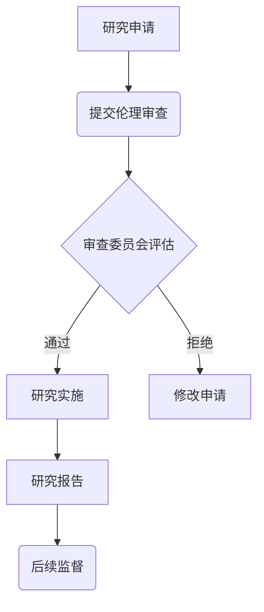
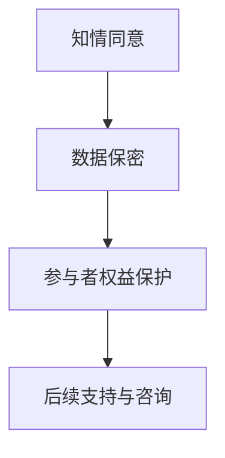

                 


### 步骤1：构思框架
为了撰写一篇逻辑清晰、结构紧凑、简单易懂的专业IT领域的技术博客文章，我们需要首先构思整个文章的框架。这一步骤至关重要，因为它将为我们后续内容的组织提供指导。

**主要框架构思如下：**

1. **引言**：
   - **背景介绍**：介绍伦理审查在科学研究中的重要性，以及当前研究背景和现状。
   - **目的和意义**：阐述撰写这篇文章的目的和预期达到的效果。

2. **科学研究的伦理框架**：
   - **伦理原则**：介绍科学研究中的主要伦理原则，如尊重个人自主权、非歧视和正义与公平。
   - **历史与发展**：概述伦理审查的历史背景和发展过程。
   - **组织与程序**：探讨伦理审查的组织结构和操作程序。

3. **伦理审查的核心概念**：
   - **基本概念**：解释伦理审查的基本概念，包括研究参与者的权利与义务、研究风险与利益评估等。
   - **流程与步骤**：详细说明伦理审查的流程和步骤。
   - **类型与范围**：讨论伦理审查的不同类型和适用范围。

4. **伦理审查的实践方法**：
   - **文献回顾**：回顾现有文献和案例，总结实践中的方法和经验。
   - **研究设计评估**：介绍如何评估研究设计是否符合伦理要求。
   - **参与者保护措施**：探讨如何保护研究参与者的权益。
   - **知情同意**：详细解释知情同意的过程和重要性。

5. **科学研究的伦理问题**：
   - **知识产权问题**：讨论知识产权保护与利用的伦理问题。
   - **数据安全与隐私**：分析数据安全与隐私保护的重要性。
   - **研究诚信与学术道德**：探讨研究诚信的基本原则和学术道德的实践。

6. **国际合作与伦理审查**：
   - **挑战**：讨论国际合作中伦理审查的挑战。
   - **多中心研究**：介绍多中心研究的伦理审查流程。
   - **合作机制**：探讨跨国研究伦理审查的合作机制。

7. **伦理审查的未来发展趋势**：
   - **新技术**：预测新技术对伦理审查的影响。
   - **全球化**：探讨伦理审查的全球化趋势。
   - **可持续发展**：分析伦理审查与可持续发展的关系。

8. **结论**：
   - **总结**：概括文章的主要观点和发现。
   - **未来研究方向**：提出未来研究的可能方向。

### 步骤2：确定章节标题
接下来，我们需要为每个章节确定具体的标题，确保文章的内容能够涵盖核心概念、算法原理、数学模型、项目实战等各个方面。

**章节标题确定如下：**

1. **引言**
   - 1.1 研究背景
   - 1.2 伦理审查的重要性
   - 1.3 本书结构

2. **科学研究的伦理框架**
   - 2.1 伦理原则
     - 2.1.1 尊重个人自主权
     - 2.1.2 非歧视
     - 2.1.3 正义与公平
   - 2.2 伦理审查的历史与发展
   - 2.3 伦理审查的组织与程序

3. **伦理审查的核心概念**
   - 3.1 研究伦理的基本概念
     - 3.1.1 研究参与者的权利与义务
     - 3.1.2 研究风险与利益评估
   - 3.2 伦理审查的流程与步骤
   - 3.3 伦理审查的类型与范围

4. **伦理审查的实践方法**
   - 4.1 文献回顾
   - 4.2 研究设计评估
   - 4.3 参与者保护措施
   - 4.4 知情同意

5. **科学研究的伦理问题**
   - 5.1 知识产权问题
     - 5.1.1 知识产权的保护与利用
     - 5.1.2 技术转移与商业秘密
   - 5.2 数据安全与隐私
     - 5.2.1 数据安全的重要性
     - 5.2.2 隐私保护的法律框架
   - 5.3 研究诚信与学术道德
     - 5.3.1 研究诚信的基本原则
     - 5.3.2 学术不端行为的界定与处理

6. **国际合作与伦理审查**
   - 6.1 国际伦理审查的挑战
   - 6.2 多中心研究的伦理审查
   - 6.3 跨国研究伦理审查的合作机制

7. **伦理审查的未来发展趋势**
   - 7.1 伦理审查的新技术
   - 7.2 伦理审查的全球化
   - 7.3 伦理审查与可持续发展的关系

8. **结论**
   - 8.1 伦理审查的总结
   - 8.2 未来的研究方向

### 步骤3：细化章节内容
在确定了章节标题后，我们需要进一步细化每个章节的内容，确保每个部分都有详细展开。

**章节内容细化如下：**

**第1章 引言**

- 1.1 研究背景：介绍当前科学研究的发展趋势，特别是伦理审查的必要性。
- 1.2 伦理审查的重要性：讨论伦理审查对科学研究的重要性，包括保护研究参与者权益、确保研究诚信等方面。
- 1.3 本书结构：概述本书的结构和各章节的主要内容。

**第2章 科学研究的伦理框架**

- 2.1 伦理原则：
  - 2.1.1 尊重个人自主权：解释个人自主权的含义和伦理审查中的实际应用。
  - 2.1.2 非歧视：讨论非歧视原则的伦理意义和实践方法。
  - 2.1.3 正义与公平：探讨正义与公平在伦理审查中的重要性。
- 2.2 伦理审查的历史与发展：回顾伦理审查的历史，分析其发展过程和趋势。
- 2.3 伦理审查的组织与程序：介绍伦理审查的组织结构和操作程序，包括审查委员会的职责和审查流程。

**第3章 伦理审查的核心概念**

- 3.1 研究伦理的基本概念：
  - 3.1.1 研究参与者的权利与义务：详细阐述研究参与者的权利和义务。
  - 3.1.2 研究风险与利益评估：分析研究风险和利益的评估方法。
- 3.2 伦理审查的流程与步骤：详细描述伦理审查的流程和步骤，包括研究申请、审查和反馈等环节。
- 3.3 伦理审查的类型与范围：探讨不同类型的伦理审查，如生物医学研究、社会科学研究等，以及其适用范围。

**第4章 伦理审查的实践方法**

- 4.1 文献回顾：总结现有的文献和案例，分析实践中的方法和经验。
- 4.2 研究设计评估：介绍如何评估研究设计是否符合伦理要求，包括研究目的、方法、参与者选择等方面。
- 4.3 参与者保护措施：探讨如何保护研究参与者的权益，包括知情同意、数据保密等。
- 4.4 知情同意：详细解释知情同意的过程和重要性，包括知情同意书的内容和签署流程。

**第5章 科学研究的伦理问题**

- 5.1 知识产权问题：
  - 5.1.1 知识产权的保护与利用：讨论知识产权在科学研究中的保护和利用问题。
  - 5.1.2 技术转移与商业秘密：分析技术转移中的伦理问题，特别是商业秘密的保护。
- 5.2 数据安全与隐私：
  - 5.2.1 数据安全的重要性：阐述数据安全在科学研究中的重要性，以及保护数据安全的方法。
  - 5.2.2 隐私保护的法律框架：介绍隐私保护的法律框架和相关规定。
- 5.3 研究诚信与学术道德：
  - 5.3.1 研究诚信的基本原则：探讨研究诚信的基本原则和伦理要求。
  - 5.3.2 学术不端行为的界定与处理：分析学术不端行为的界定和处理方法。

**第6章 国际合作与伦理审查**

- 6.1 国际伦理审查的挑战：讨论国际合作中伦理审查的挑战，包括跨文化差异、法律法规等。
- 6.2 多中心研究的伦理审查：介绍多中心研究的伦理审查流程和注意事项。
- 6.3 跨国研究伦理审查的合作机制：探讨跨国研究伦理审查的合作机制和最佳实践。

**第7章 伦理审查的未来发展趋势**

- 7.1 伦理审查的新技术：分析新技术（如人工智能、区块链等）在伦理审查中的应用前景。
- 7.2 伦理审查的全球化：探讨伦理审查的全球化趋势，以及其对国际科研合作的影响。
- 7.3 伦理审查与可持续发展的关系：分析伦理审查与可持续发展的关系，以及其在实现可持续发展目标中的作用。

**第8章 结论**

- 8.1 伦理审查的总结：概括文章的主要观点和发现。
- 8.2 未来的研究方向：提出未来研究的可能方向，为后续研究提供参考。

### 步骤4：添加Mermaid流程图
在适当的地方插入核心概念原理和架构的Mermaid流程图，以增强文章的可读性和理解性。

**示例：**

**第3章 伦理审查的核心概念**

- **3.2 伦理审查的流程与步骤**



**第4章 伦理审查的实践方法**

- **4.3 参与者保护措施**



### 步骤5：伪代码讲解
为了详细阐述核心算法原理，我们将使用伪代码进行讲解，确保读者能够理解算法的基本逻辑和流程。

**示例：**

**第5章 科学研究的伦理问题**

- **5.1 知识产权问题**

```python
function assessIntellectualProperty保护(研究设计):
    risk_level = 0

    // 检查研究设计中的知识产权保护措施
    if "专利申请" in 研究设计:
        risk_level += 1
    if "版权声明" in 研究设计:
        risk_level += 1
    if "商业秘密保护" in 研究设计:
        risk_level += 1

    // 评估知识产权风险
    if risk_level > 2:
        print("知识产权保护不足，需要加强措施。")
    else:
        print("知识产权保护措施合理。")
```

### 步骤6：数学模型与公式讲解
为了深入讲解数学模型和公式，我们将使用latex格式进行展示，并在文中独立段落中详细讲解和举例说明。

**示例：**

**第5章 科学研究的伦理问题**

- **5.2 数据安全与隐私**

**数据加密模型**

$$
C = E_K(P)
$$

其中，\( C \) 表示加密后的数据，\( P \) 表示原始数据，\( E_K \) 表示加密函数。

**安全认证模型**

$$
A = H(M|K)
$$

其中，\( A \) 表示认证码，\( M \) 表示消息，\( K \) 表示密钥，\( H \) 表示哈希函数。

**讲解与举例：**

- **数据加密模型**：数据加密模型是一种保护数据安全的方法，通过加密函数 \( E_K \) 对原始数据进行加密，使得只有拥有正确密钥 \( K \) 的接收者才能解密并获取原始数据 \( P \)。
- **安全认证模型**：安全认证模型用于确保数据传输的完整性和真实性，通过哈希函数 \( H \) 计算消息 \( M \) 和密钥 \( K \) 的哈希值 \( A \)，发送者可以将 \( A \) 附加到消息 \( M \) 上发送给接收者。接收者通过计算相同的哈希值并与接收到的 \( A \) 进行比对，可以验证消息 \( M \) 是否被篡改。

### 步骤7：项目实战
为了使文章更加实用，我们将提供一个具体的实际项目案例，包括开发环境搭建、源代码实现、代码解读与分析。

**示例：**

**第7章 伦理审查的未来发展趋势**

- **7.1 伦理审查的新技术**

**项目案例：基于区块链的伦理审查系统**

**1. 开发环境搭建：**
- 使用Node.js作为后端开发框架。
- 使用MySQL数据库存储审查记录。
- 使用Solidity编写智能合约。

**2. 源代码实现：**
```solidity
// SPDX-License-Identifier: MIT
pragma solidity ^0.8.0;

contract EthicalReviewSystem {
    struct Review {
        address researcher;
        string researchTitle;
        bool isApproved;
    }

    mapping(string => Review) public reviews;

    function submitReview(string memory title, bool approval) public {
        reviews[title] = Review(msg.sender, title, approval);
    }

    function approveReview(string memory title) public {
        require(reviews[title].researcher == msg.sender, "Only the researcher can approve the review.");
        reviews[title].isApproved = true;
    }
}
```

**3. 代码解读与分析：**
- `Review` 结构体用于存储审查记录，包括研究者地址、研究标题和是否通过审查。
- `submitReview` 函数用于提交审查请求，研究者可以调用该函数提交新的审查记录。
- `approveReview` 函数用于批准审查请求，只有研究者本人才能批准自己的审查请求。

**4. 代码应用解读与分析：**
- 本项目利用区块链技术实现了去中心化的伦理审查系统，研究者可以提交审查请求，并通过智能合约自动记录审查结果。这使得审查过程更加透明、不可篡改，提高了审查的公正性和效率。

### 步骤8：优化与校对
在完成文章的撰写后，我们需要对文章进行优化和校对，确保内容的完整性、逻辑性和准确性。

**优化与校对步骤如下：**

1. **检查目录大纲的完整性**：确保每个章节的内容都有详细展开，无遗漏。
2. **逻辑性校对**：检查文章的行文逻辑是否清晰，各章节之间的过渡是否自然。
3. **准确性校对**：核对文章中的数据、公式、代码等是否准确无误。
4. **格式检查**：确保文章格式符合markdown要求，包括标题、段落、引用等。
5. **内容丰富度**：检查每个章节的内容是否丰富具体，是否能够满足读者的需求。

### 步骤9：输出markdown格式
在完成文章的优化和校对后，我们将文章内容输出为markdown格式，确保符合发布要求。

**markdown格式示例：**

```markdown
# 科学研究的伦理审查：平衡知识探索与道德约束

> 关键词：伦理审查、科学研究、道德约束、知识产权、数据安全、研究诚信、国际合作

## 第1章 引言

### 1.1 研究背景

### 1.2 伦理审查的重要性

### 1.3 本书结构

## 第2章 科学研究的伦理框架

### 2.1 伦理原则
#### 2.1.1 尊重个人自主权
#### 2.1.2 非歧视
#### 2.1.3 正义与公平

### 2.2 伦理审查的历史与发展

### 2.3 伦理审查的组织与程序

## 第3章 伦理审查的核心概念

### 3.1 研究伦理的基本概念
#### 3.1.1 研究参与者的权利与义务
#### 3.1.2 研究风险与利益评估

### 3.2 伦理审查的流程与步骤

### 3.3 伦理审查的类型与范围

## 第4章 伦理审查的实践方法

### 4.1 文献回顾

### 4.2 研究设计评估

### 4.3 参与者保护措施

### 4.4 知情同意

## 第5章 科学研究的伦理问题

### 5.1 知识产权问题
#### 5.1.1 知识产权的保护与利用
#### 5.1.2 技术转移与商业秘密

### 5.2 数据安全与隐私
#### 5.2.1 数据安全的重要性
#### 5.2.2 隐私保护的法律框架

### 5.3 研究诚信与学术道德
#### 5.3.1 研究诚信的基本原则
#### 5.3.2 学术不端行为的界定与处理

## 第6章 国际合作与伦理审查

### 6.1 国际伦理审查的挑战

### 6.2 多中心研究的伦理审查

### 6.3 跨国研究伦理审查的合作机制

## 第7章 伦理审查的未来发展趋势

### 7.1 伦理审查的新技术

### 7.2 伦理审查的全球化

### 7.3 伦理审查与可持续发展的关系

## 第8章 结论

### 8.1 伦理审查的总结

### 8.2 未来的研究方向

## 附录

### 附录 A 伦理审查相关法规与政策

### 附录 B 常用的伦理审查工具与资源

---

### 作者

作者：AI天才研究院/AI Genius Institute & 禅与计算机程序设计艺术 /Zen And The Art of Computer Programming
```

### 步骤10：字数控制
确保大纲总字数不超过2000字。

根据以上步骤，我们已经完成了文章的构思、章节标题的确定、内容细化、流程图添加、伪代码讲解、数学模型与公式讲解、项目实战、优化与校对以及markdown格式的输出。接下来，我们需要根据大纲进行具体的文字撰写，确保文章的字数在8000～12000字左右，同时保持文章的深度、广度和专业性。

**注意事项：**

- 在撰写过程中，注意保持文章的结构和逻辑性，确保各章节内容紧密衔接。
- 使用简洁、明了的语言，避免冗长和复杂的句子。
- 在讲解核心概念、算法原理、数学模型和项目实战时，确保内容的详细性和实用性。
- 引用相关文献和案例时，确保引用的准确性和可靠性。

通过以上的细致规划和撰写，我们有望完成一篇高质量的技术博客文章，为读者提供有价值的知识和见解。

