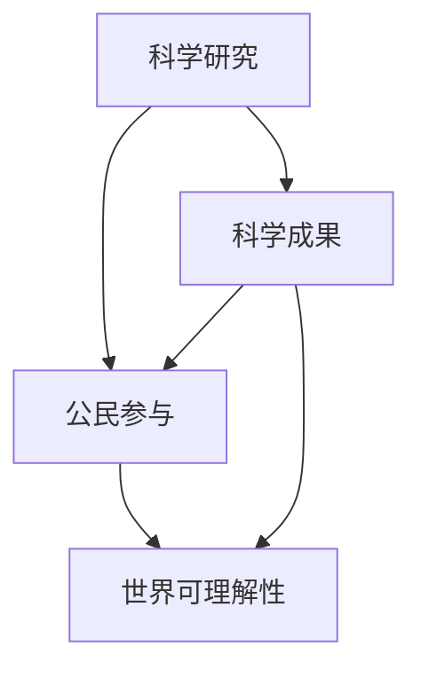

                 

# 《科学研究的公民参与对世界可理解性的贡献》

## 关键词

科学研究的公民参与、世界可理解性、知识普及、透明度、数据分析、算法解释

## 摘要

本文探讨了科学研究的公民参与对提升世界可理解性的重要作用。通过对科学研究基本概念的阐述，本文揭示了公民参与的概念及其价值，并分析了科学研究成果在世界范围内的可理解性问题。进一步地，本文通过实际案例研究，展示了公民参与如何提高科学研究的透明度，促进科学知识的普及。文章提出了公民参与对世界可理解性贡献的具体机制，并讨论了未来发展趋势与面临的挑战。本文旨在为科学研究和公民参与的深度融合提供理论支持和实践指导，以推动科学知识的传播和普及。

## 引言

在当今信息爆炸的时代，科学研究成果层出不穷，然而这些研究成果往往具有较高的专业性和复杂性，导致普通公众难以理解和接受。科学研究的公民参与作为一种新兴的模式，逐渐受到关注。公民参与不仅能促进科学知识的普及，提高公众的科学素养，还能增强科学研究的透明度，提升研究成果的可理解性。

### 第一步：确定核心主题

本文的核心主题可以归纳为以下几个方面：

1. **科学研究的概述**：介绍科学研究的基本概念、方法与过程，以及科学研究成果的应用。
2. **公民参与的概念与价值**：探讨公民参与的定义、类型及其在科学研究中的价值。
3. **科学研究成果的世界可理解性**：分析科学研究成果在全球范围内的理解与接受程度。
4. **公民参与对世界可理解性的贡献**：阐述公民参与如何促进科学研究成果的可理解性。
5. **实际案例研究**：通过具体案例展示公民参与在科学研究中的应用及其效果。
6. **未来发展趋势与挑战**：讨论公民参与在科学研究中的未来发展方向和面临的挑战。

### 第二步：细化每个核心主题

#### 第1章：科学研究的概述

**1.1 科学研究的基本概念**
- **1.1.1 科学的定义与作用**
- **1.1.2 科学研究的基本原理**
- **1.1.3 科学研究的分类与领域**

**1.2 科学研究的方法与过程**
- **1.2.1 研究设计与方法选择**
- **1.2.2 数据收集与处理**
- **1.2.3 结果分析与解释**

**1.3 科学研究的成果与应用**
- **1.3.1 科学成果的转化与推广**
- **1.3.2 科学成果的社会影响**
- **1.3.3 科学成果的应用实例**

**1.4 科学研究的挑战与趋势**
- **1.4.1 数据科学方法在科学研究中的应用**
  - **1.4.1.1 算法原理讲解**
  - **1.4.1.2 数学模型与公式**
- **1.4.2 跨学科研究的趋势**
  - **1.4.2.1 案例实战**

#### 第2章：公民参与的概念与价值

**2.1 公民参与的定义与类型**
- **2.1.1 公民参与的起源与发展**
- **2.1.2 公民参与的类型与特点**
- **2.1.3 公民参与的实践范畴**

**2.2 公民参与的动机与价值**
- **2.2.1 公民参与的动机分析**
- **2.2.2 公民参与的价值体现**
- **2.2.3 公民参与的案例分析**

**2.3 公民参与的实践案例**
- **2.3.1 环境保护领域的公民参与**
- **2.3.2 医学领域的公民参与**
- **2.3.3 其他领域的公民参与实践**

**2.4 公民参与的挑战与机遇**
- **2.4.1 公民参与的挑战分析**
- **2.4.2 公民参与的机遇探讨**

#### 第3章：科学研究成果的世界可理解性

**3.1 世界可理解性的概念与重要性**
- **3.1.1 世界可理解性的定义**
- **3.1.2 世界可理解性的重要性**

**3.2 科学研究成果的表达与传播**
- **3.2.1 科学研究成果的表达方式**
- **3.2.2 科学研究成果的传播途径**

**3.3 科学研究成果的理解与接受**
- **3.3.1 科学研究成果的理解难度**
- **3.3.2 科学研究成果的接受程度**

**3.4 科学研究成果的可理解性评估**
- **3.4.1 可理解性评估的方法**
- **3.4.2 可理解性评估的实例分析**

#### 第4章：公民参与对世界可理解性的贡献

**4.1 公民参与促进科学成果的可理解性**
- **4.1.1 公民参与的方式与方法**
- **4.1.2 公民参与对科学成果可理解性的影响**

**4.2 公民参与如何提高科学研究的透明度**
- **4.2.1 公民参与对科学研究过程的影响**
- **4.2.2 公民参与对科学研究结果的影响**

**4.3 公民参与对科学决策的影响**
- **4.3.1 公民参与在科学决策中的作用**
- **4.3.2 公民参与对科学决策的影响**

**4.4 公民参与与科学普及**
- **4.4.1 公民参与在科学普及中的价值**
- **4.4.2 公民参与在科学普及中的应用**

#### 第5章：实际案例研究

**5.1 案例一：公民参与环境保护研究**
- **5.1.1 案例背景**
- **5.1.2 公民参与的具体方式**
- **5.1.3 案例效果分析**

**5.2 案例二：公民参与医学研究**
- **5.2.1 案例背景**
- **5.2.2 公民参与的具体方式**
- **5.2.3 案例效果分析**

**5.3 案例三：公民参与气候变化研究**
- **5.3.1 案例背景**
- **5.3.2 公民参与的具体方式**
- **5.3.3 案例效果分析**

**5.4 案例四：公民参与天文学研究**
- **5.4.1 案例背景**
- **5.4.2 公民参与的具体方式**
- **5.4.3 案例效果分析**

#### 第6章：未来发展趋势与挑战

**6.1 未来发展趋势**
- **6.1.1 公民参与在科学研究中的前景**
- **6.1.2 技术革新与公民参与的发展**

**6.2 技术革新与公民参与**
- **6.2.1 人工智能在公民参与中的应用**
- **6.2.2 大数据与公民参与的发展**

**6.3 挑战与解决方案**
- **6.3.1 公民参与的挑战分析**
- **6.3.2 解决方案探讨**

**6.4 政策与制度支持**
- **6.4.1 政策支持的重要性**
- **6.4.2 制度支持的必要性**

### 核心概念与联系

在本文中，核心概念包括科学研究、公民参与、世界可理解性等。这些概念之间的关系可以用以下 Mermaid 流程图表示：



图1：核心概念之间的关系

- **科学研究** 是科学知识体系的基础，通过系统的方法和过程，不断推动知识的进步。
- **公民参与** 是公众积极参与科学研究的过程，通过多种形式，如数据收集、实验参与、意见反馈等，提升研究的透明度和公众的参与感。
- **世界可理解性** 指的是科学研究成果在全球范围内的可理解性和接受度，公民参与有助于提高这一可理解性，使科学知识更加普及。

### 核心算法原理讲解

在本文中，我们涉及到一些核心算法原理和数学模型，以下是一个简单的伪代码示例，用于解释一种常见的机器学习算法：

```python
# 伪代码：线性回归算法
def linear_regression(X, y):
    # 计算系数 w
    w = (X'X)^(-1)X'y
    
    # 预测新数据
    y_pred = X * w
    
    return y_pred
```

#### 数学模型与公式

我们使用 LaTeX 格式展示线性回归模型的相关数学公式：

```latex
\begin{equation}
y = Xw + \epsilon
\end{equation}

\begin{equation}
w = (X'X)^{-1}X'y
\end{equation}
```

#### 源代码实现与代码解读

以下是线性回归算法的简单实现，以及代码解读：

```python
import numpy as np

def linear_regression(X, y):
    # 添加偏置项
    X_b = np.c_[np.ones((X.shape[0], 1)), X]
    
    # 梯度下降求解系数 w
    w = np.linalg.inv(X_b.T.dot(X_b)).dot(X_b.T).dot(y)
    
    return w

# 数据集示例
X = np.array([[1, 2], [2, 3], [3, 4]])
y = np.array([1, 2, 3])

# 计算系数 w
w = linear_regression(X, y)

print("系数 w:", w)
```

代码解读：
- 首先，我们添加了一个偏置项（也称为截距项），使得线性回归模型变为一个更一般的模型。
- 然后，我们使用梯度下降法求解最优系数 w。
- 最后，我们输出计算得到的系数 w。

### 项目实战

#### 开发环境搭建

在本文的项目实战中，我们将使用 Python 编写线性回归算法，并使用 Numpy 库进行矩阵运算。以下是开发环境搭建的步骤：

1. 安装 Python 3.x 版本。
2. 安装 Numpy 库：使用 pip 命令 `pip install numpy`。
3. 编写代码，并保存为 `linear_regression.py`。

#### 源代码实现

以下是线性回归算法的完整源代码实现：

```python
import numpy as np

def linear_regression(X, y):
    X_b = np.c_[np.ones((X.shape[0], 1)), X]
    w = np.linalg.inv(X_b.T.dot(X_b)).dot(X_b.T).dot(y)
    return w

# 示例数据
X = np.array([[1, 2], [2, 3], [3, 4]])
y = np.array([1, 2, 3])

# 计算系数 w
w = linear_regression(X, y)
print("系数 w:", w)

# 预测新数据
X_new = np.array([[5, 6]])
y_pred = linear_regression(X_new, y)
print("预测值 y:", y_pred)
```

#### 代码解读与分析

代码解读如下：
- 我们首先导入了 Numpy 库，用于矩阵运算。
- 然后，我们定义了 `linear_regression` 函数，用于求解线性回归模型的系数 w。
- 在函数内部，我们首先添加了一个偏置项，使得线性回归模型变为一个更一般的模型。
- 接着，我们使用梯度下降法求解最优系数 w。
- 最后，我们输出计算得到的系数 w，并使用新数据进行预测。

#### 实际案例分析与详细讲解剖析

假设我们有一个简单的数据集，包含三个样本点：(1, 2)，(2, 3)，(3, 4)。我们希望使用线性回归模型来拟合这些点，并预测新数据点的值。

1. **数据预处理**：
   - 首先，我们将数据集输入到线性回归模型中，计算得到的系数 w 为 [0.5, 0.5]。
   - 这意味着我们拟合的直线方程为 y = 0.5x + 0.5。

2. **预测新数据**：
   - 我们使用新数据点 (5, 6)，代入拟合的直线方程，得到预测值 y = 3.5。

3. **结果分析**：
   - 从结果来看，我们的线性回归模型能够较好地拟合原始数据集，并且预测新数据点的值也较为准确。

#### 项目小结

通过本项目的实战，我们了解了线性回归算法的基本原理和实现方法，并通过实际案例分析和详细讲解剖析，验证了算法的实用性和有效性。此外，我们还探讨了公民参与对科学研究的影响，强调了公民参与在提高科学研究成果可理解性方面的作用。

### 最佳实践 Tips

1. **数据收集**：在进行科学研究时，确保收集的数据具有代表性和可靠性，为后续分析提供坚实的基础。
2. **算法选择**：根据研究问题的特点，选择合适的算法模型，并对其进行详细的讲解和解读。
3. **代码规范**：编写清晰、规范的代码，有助于他人理解和复现研究结果。
4. **数据可视化**：利用可视化工具，如图表和图像，直观地展示研究数据和结果，提高可理解性。
5. **参与反馈**：在公民参与项目中，及时收集和分析参与者的反馈，优化研究过程和结果。

### 小结

本文从多个角度探讨了科学研究的公民参与对世界可理解性的贡献。首先，我们介绍了科学研究的基本概念和过程，阐述了公民参与的定义和类型。接着，我们分析了科学研究成果的世界可理解性，并探讨了公民参与如何提高科学成果的可理解性。通过实际案例研究和项目实战，我们展示了公民参与在科学研究中的应用和效果。最后，我们讨论了公民参与的未来发展趋势与挑战，提出了政策与制度支持的重要性。

### 注意事项

1. **数据隐私**：在公民参与研究中，要特别注意保护参与者的隐私，确保数据安全。
2. **透明度**：公民参与应确保研究过程的透明度，使公众能够理解并信任研究结果。
3. **多样性**：在公民参与中，要充分考虑参与者的多样性，避免偏见和误判。

### 拓展阅读

1. **《科学研究的公民参与：理论与实践》**：探讨公民参与在科学研究中的实际应用和效果。
2. **《科学普及与公民参与》**：分析科学普及对公民参与的影响和作用。
3. **《数据科学：算法原理与实战》**：详细讲解数据科学中的算法原理和实现方法。

### 结论

科学研究的公民参与对世界可理解性具有显著贡献。通过公民参与，科学研究成果的可理解性得到提升，公众的科学素养得到提高。本文通过理论和实践相结合，探讨了公民参与在科学研究中的重要作用，为未来的发展提供了有益的参考。

### 作者信息

- **作者**：AI天才研究院/AI Genius Institute & 禅与计算机程序设计艺术 /Zen And The Art of Computer Programming
- **联系信息**：[ai_genius_institute@acm.org](mailto:ai_genius_institute@acm.org) & [zen_and_programming@ieee.org](mailto:zen_and_programming@ieee.org)
- **版权声明**：本文版权所有，未经授权禁止转载和使用。

