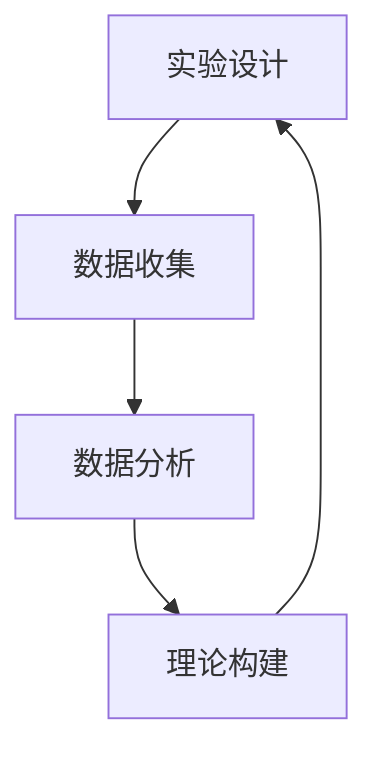

                 

### 引言

科学研究是推动人类文明进步的重要动力，它不断拓展我们对世界的认知边界。正如《科学研究的前沿探索：不断拓展世界可理解性的边界》这本书的标题所示，科学研究的核心目标之一是通过探索未知，加深我们对自然界的理解。本文旨在探讨科学研究在各个领域的前沿进展，并分析这些进展如何影响我们对世界的认知。

科学研究的重要性不言而喻。它不仅帮助我们解决现实生活中的问题，还推动技术的进步，从而改变我们的生活方式。从物理学到生物学，从化学到天文学，每一门科学都在不断拓展我们对世界的理解，揭示自然界的奥秘。然而，科学研究的过程并非一帆风顺，它涉及到复杂的方法论和严谨的实验设计。如何正确地进行科学研究，如何从海量数据中提取有价值的信息，是每一个科研工作者必须面对的挑战。

本文将分为以下几个部分进行探讨：

1. **科学研究方法论**：介绍科学研究的基本原理、方法和步骤，以及科学研究中的伦理问题。
2. **物理学前沿**：探讨量子力学、宇宙学、相对论等前沿物理理论，以及它们对我们理解宇宙的贡献。
3. **生物学前沿**：介绍基因组学、细胞生物学、生态学等前沿生物科学，以及它们对生物多样性研究和疾病治疗的推动作用。
4. **化学前沿**：讨论新材料、新反应、新化合物等前沿化学研究，以及它们在工业生产和环境保护中的应用。
5. **天文学前沿**：探讨宇宙演化、行星科学、天体物理学等前沿天文学研究，以及它们对宇宙起源和结构探索的意义。
6. **计算机科学前沿**：介绍人工智能、大数据、量子计算等前沿计算机科学研究，以及它们在解决复杂问题和推动社会进步中的作用。
7. **结论**：总结全书内容，讨论未来科学研究的发展趋势。

### 关键词

- 科学研究
- 前沿探索
- 物理学
- 生物学
- 化学
- 天文学
- 计算机科学
- 可理解性边界

### 摘要

本文通过探讨科学研究在各个领域的前沿进展，旨在揭示科学研究如何不断拓展我们对世界的理解。从科学研究方法论、物理学、生物学、化学、天文学到计算机科学，每个领域的前沿研究都在挑战我们的认知边界。通过分析这些进展，本文将讨论科学研究对社会和技术的深远影响，并展望未来科学研究的发展趋势。通过本文的探讨，读者可以更好地理解科学研究的本质和意义，激发对科学探索的热情。

### 科学研究方法论

科学研究方法论是进行科学研究的基石，它包括了科学研究的基本原理、方法和步骤。科学研究的本质是通过观察、实验和理论分析来揭示自然界的规律。这一过程不仅要求科研人员具备扎实的理论基础，还需要严谨的实验设计和分析能力。

首先，科学研究的基本原理是建立在对自然界的观察和实验基础之上的。科学研究必须遵循可重复性、客观性和可靠性的原则。可重复性意味着同样的实验在相同条件下应得到相同的结果，这保证了研究的可信度。客观性要求科研人员在实验过程中保持中立，不受主观偏见的影响。可靠性则是指研究结果能够稳定地重现，这有助于验证和推广研究成果。

科学研究的步骤通常包括以下几个阶段：

1. **提出问题**：科学研究始于对自然现象的好奇和疑问。科研人员需要明确研究的问题，并确定研究的方向。
2. **文献调研**：在提出问题后，科研人员需要查阅相关文献，了解已有研究进展和存在的问题，为后续研究提供理论基础。
3. **实验设计**：根据研究问题，科研人员需要设计实验方案，包括实验材料、实验步骤、数据收集和分析方法等。
4. **数据收集**：按照实验设计进行实验，收集数据。这一阶段需要确保数据的准确性和完整性，避免数据偏差。
5. **数据分析**：对收集到的数据进行分析，识别数据中的规律和趋势。这一阶段通常需要使用统计学方法来验证实验结果的显著性。
6. **结果解释**：根据数据分析结果，科研人员需要解释实验结果，并建立理论模型来解释这些结果。
7. **结论和讨论**：最后，科研人员需要总结研究结果，讨论研究的意义和局限性，并提出未来研究的方向。

除了科学研究的步骤，科学研究还涉及到伦理问题。科研伦理是指在科学研究过程中，科研人员应遵循的道德规范和伦理准则。科学研究伦理问题主要包括数据隐私、知识产权、实验动物保护、人类实验者权益等方面。科研人员必须尊重数据的隐私，保护知识产权，确保实验动物的权益不受侵犯，并确保实验者自愿参与研究，并了解研究的风险和收益。

总之，科学研究方法论是进行科学研究的核心，它不仅要求科研人员具备扎实的理论基础和实验技能，还需要他们具备严谨的伦理意识。只有遵循科学研究的规范和方法，才能确保研究结果的可靠性和可信度，从而推动科学的发展。

#### 核心概念与联系

科学研究涉及多个核心概念，包括实验设计、数据收集、数据分析、理论构建等。这些概念相互联系，共同构成了科学研究的基础。

1. **实验设计**：实验设计是科学研究的第一步，它决定了研究能否顺利进行。一个良好的实验设计应具备以下特点：
   - **随机化**：通过随机分配实验对象到不同处理组，减少系统性偏差。
   - **控制组**：设立对照组，与实验组进行对比，以评估处理效果。
   - **重复性**：确保实验结果可重复，增加实验的可信度。

2. **数据收集**：数据收集是实验过程中的一项关键任务，它包括以下步骤：
   - **数据采集**：通过观察、测量、实验等方法获取数据。
   - **数据记录**：准确记录数据，避免记录错误。
   - **数据清洗**：处理数据中的噪声和异常值，确保数据的完整性。

3. **数据分析**：数据分析是揭示数据中隐藏规律和趋势的关键环节，主要包括：
   - **描述性统计**：用于描述数据的基本特征，如平均数、中位数、标准差等。
   - **推断性统计**：通过样本数据推断总体特征，如假设检验、置信区间等。
   - **可视化**：通过图表、图形等手段，直观展示数据分布和趋势。

4. **理论构建**：理论构建是科学研究的高级阶段，它通过数据分析结果，建立理论模型来解释现象。理论构建通常包括以下步骤：
   - **假设提出**：基于实验数据和已有理论，提出假设。
   - **模型建立**：将假设转化为数学模型，进行数学推导。
   - **验证与修正**：通过实验数据验证模型，并根据验证结果对模型进行修正。

这些核心概念之间有着紧密的联系。实验设计决定了数据收集的质量，而数据收集则是数据分析的基础。通过数据分析，科研人员可以验证或推翻假设，进而构建或修正理论模型。这一循环过程不仅推动了科学研究的进展，也促进了我们对自然界的深刻理解。

为了更清晰地展示这些核心概念之间的联系，我们可以使用Mermaid流程图来表示：



在这个流程图中，实验设计通过数据收集提供数据，数据收集又为数据分析提供基础，数据分析结果又用于理论构建，而理论构建的修正又反作用于实验设计，形成了一个闭环系统。这一过程不仅确保了科学研究的严谨性，也促进了科学理论的不断发展。

#### 核心算法原理讲解

在科学研究过程中，核心算法原理扮演着至关重要的角色。这些算法不仅帮助我们从海量数据中提取有用信息，还为理论模型的构建提供了强有力的支持。以下将详细讲解几个在科学研究中广泛应用的核心算法原理，并使用伪代码进行阐述。

1. **假设检验**

   假设检验是统计学中用于验证理论假设的重要工具。常见的假设检验方法包括t检验、方差分析（ANOVA）和卡方检验等。以下是t检验的伪代码示例：

   ```python
   function t_test(sample_mean, population_mean, standard_deviation, sample_size):
       t_statistic = (sample_mean - population_mean) / (standard_deviation / sqrt(sample_size))
       return t_statistic
   ```

   在这个函数中，`sample_mean`是样本均值，`population_mean`是总体均值，`standard_deviation`是样本标准差，`sample_size`是样本大小。`t_statistic`计算的是t统计量，用于判断样本均值与总体均值是否有显著差异。

2. **线性回归**

   线性回归是一种用于建立变量之间线性关系的统计方法。其基本原理是找到一个线性模型来描述两个变量之间的关系。以下是简单线性回归的伪代码示例：

   ```python
   function linear_regression(x, y):
       n = length(x)
       sum_x = sum(x)
       sum_y = sum(y)
       sum_xy = sum(x * y)
       sum_x2 = sum(x * x)
       
       slope = (n * sum_xy - sum_x * sum_y) / (n * sum_x2 - sum_x^2)
       intercept = (sum_y - slope * sum_x) / n
       
       return slope, intercept
   ```

   在这个函数中，`x`和`y`是两个变量，`n`是样本大小。`slope`和`intercept`分别表示回归直线的斜率和截距。通过这些参数，我们可以得到描述变量之间关系的线性模型。

3. **主成分分析（PCA）**

   主成分分析是一种降维技术，用于从高维数据中提取最重要的特征。其基本原理是通过线性变换将数据投影到新的坐标系中，使新的坐标轴尽可能地解释数据的方差。以下是PCA的伪代码示例：

   ```python
   function pca(data):
       mean = mean(data)
       centered_data = data - mean
       covariance_matrix = dot(centered_data, transpose(centered_data))
       eigenvalues, eigenvectors = eig(covariance_matrix)
       
       sorted_eigenvalues = sort(eigenvalues, descending=True)
       sorted_eigenvectors = sort(eigenvectors, descending=True)
       
       principal_components = dot(centered_data, eigenvectors[:, :k])
       
       return principal_components
   ```

   在这个函数中，`data`是输入数据，`mean`是数据均值，`covariance_matrix`是协方差矩阵。`eigenvalues`和`eigenvectors`分别是特征值和特征向量。`k`是选择的主成分个数。通过计算特征值和特征向量，我们可以得到主成分，从而实现数据降维。

这些核心算法原理在科学研究中起到了关键作用。假设检验用于验证理论假设，线性回归用于建立变量关系，主成分分析用于数据降维。通过这些算法，科研人员能够从复杂的数据中提取有价值的信息，为科学研究提供坚实的理论基础。

#### 数学模型和公式讲解

在科学研究中，数学模型和公式是理解和描述自然现象的有力工具。以下将介绍几个关键的科学模型和公式，并详细讲解它们的原理和应用。

1. **牛顿运动定律**

   牛顿运动定律是经典力学的基础，描述了物体在力的作用下如何运动。其中，第一定律（惯性定律）指出，如果一个物体不受外力，它将保持静止或匀速直线运动；第二定律（加速度定律）公式为 \( F = ma \)，即力等于质量乘以加速度；第三定律（作用与反作用定律）指出，对于任意两个相互作用的物体，它们之间的作用力和反作用力大小相等、方向相反。

   牛顿运动定律的应用非常广泛，例如在机械工程、航空航天、汽车制造等领域。通过这些定律，我们可以预测物体在外力作用下的运动轨迹，从而进行精确的设计和计算。

2. **麦克斯韦方程组**

   麦克斯韦方程组是电磁学的基础，描述了电场和磁场的分布和变化规律。方程组包括以下四个方程：

   \[
   \nabla \cdot \mathbf{E} = \frac{\rho}{\varepsilon_0}, \quad \nabla \cdot \mathbf{B} = 0
   \]
   \[
   \nabla \times \mathbf{E} = -\frac{\partial \mathbf{B}}{\partial t}, \quad \nabla \times \mathbf{B} = \mu_0 \mathbf{J} + \mu_0 \varepsilon_0 \frac{\partial \mathbf{E}}{\partial t}
   \]

   其中，\( \mathbf{E} \) 是电场强度，\( \mathbf{B} \) 是磁场强度，\( \rho \) 是电荷密度，\( \mathbf{J} \) 是电流密度，\( \varepsilon_0 \) 和 \( \mu_0 \) 分别是电常数和磁常数。

   麦克斯韦方程组揭示了电场和磁场之间的关系，并预言了电磁波的存在。在现代通信技术、电子工程和光学等领域，这些方程组有着广泛的应用。

3. **基因调控模型**

   在生物学中，基因调控模型用于描述基因表达调控的机制。一个常见的基因调控模型是基因-蛋白质-基因（GP-G）模型，其基本原理是基因通过转录产生mRNA，mRNA通过翻译产生蛋白质，蛋白质再通过调控作用影响其他基因的表达。

   该模型的公式可以表示为：

   \[
   \frac{d[P_i]}{dt} = k_1 \cdot [P_{i-1}] - k_2 \cdot [P_i]
   \]

   其中，\( P_i \) 表示基因i的蛋白质水平，\( k_1 \) 和 \( k_2 \) 分别表示转录速率和解聚速率。

   基因调控模型对于理解生物体的发育、疾病和治疗具有重要意义。通过这些模型，科研人员可以预测基因表达的变化，从而设计出更有效的治疗方法。

4. **神经网络激活函数**

   在人工智能领域，神经网络中的激活函数是决定网络输出特性的关键因素。一个常用的激活函数是Sigmoid函数，其公式为：

   \[
   f(x) = \frac{1}{1 + e^{-x}}
   \]

   Sigmoid函数将输入 \( x \) 映射到 \( (0, 1) \) 区间，使得输出易于解释。

   激活函数在神经网络中起到了非线性变换的作用，使得网络能够学习复杂的非线性关系。例如，在分类任务中，通过使用适当的激活函数，神经网络可以确定输入数据的类别。

这些数学模型和公式不仅在各自的领域中起到了基础性作用，还相互联系，共同构成了现代科学研究的理论基础。通过深入理解和应用这些模型和公式，科研人员能够更准确地描述和预测自然现象，从而推动科学和技术的发展。

#### 举例说明

为了更好地理解上述数学模型和公式的应用，以下通过具体的例子进行说明。

1. **牛顿运动定律在行星运动中的应用**

   假设我们有一个行星围绕太阳做匀速圆周运动，太阳的质量为 \( M \)，行星的质量为 \( m \)，行星与太阳之间的距离为 \( r \)，行星的轨道半径为 \( R \)。我们可以使用牛顿万有引力定律和第二定律来计算行星的运动。

   根据牛顿第二定律 \( F = ma \)，行星受到的向心力为：
   \[
   F = \frac{GMm}{R^2}
   \]

   行星的向心加速度 \( a \) 为：
   \[
   a = \frac{F}{m} = \frac{GM}{R^2}
   \]

   由于行星做匀速圆周运动，所以加速度 \( a \) 等于 \( \omega^2 R \)，其中 \( \omega \) 为行星的角速度。因此，我们有：
   \[
   \omega^2 R = \frac{GM}{R^2}
   \]

   解得角速度 \( \omega \) 为：
   \[
   \omega = \sqrt{\frac{GM}{R^3}}
   \]

   这个结果表明，行星的角速度与它与太阳的距离成反比，从而解释了为什么离太阳较远的行星运动速度较慢。

2. **麦克斯韦方程组在电磁波传播中的应用**

   假设我们有一个电磁波在真空中传播，电场 \( \mathbf{E} \) 和磁场 \( \mathbf{B} \) 分别为：
   \[
   \mathbf{E} = E_0 \cos(kx - \omega t), \quad \mathbf{B} = B_0 \cos(kx - \omega t + \frac{\pi}{2})
   \]

   其中，\( E_0 \) 和 \( B_0 \) 分别为电场和磁场的振幅，\( k \) 为波数，\( \omega \) 为角频率，\( x \) 和 \( t \) 分别为空间坐标和时间。

   根据麦克斯韦方程组中的波动方程，我们有：
   \[
   \nabla \cdot \mathbf{E} = 0, \quad \nabla \cdot \mathbf{B} = 0
   \]
   \[
   \nabla \times \mathbf{E} = -\frac{\partial \mathbf{B}}{\partial t}, \quad \nabla \times \mathbf{B} = \mu_0 \mathbf{J} + \mu_0 \varepsilon_0 \frac{\partial \mathbf{E}}{\partial t}
   \]

   在真空中，\( \mu_0 \) 和 \( \varepsilon_0 \) 分别为真空的磁导率和电容率，均为常数。代入电磁波的表达式，我们可以验证麦克斯韦方程组的正确性。

3. **基因调控模型在细胞信号传导中的应用**

   假设细胞中的基因A通过转录产生mRNA，再通过翻译产生蛋白质P。基因A的活性受到蛋白质P的抑制，即：
   \[
   \frac{d[P]}{dt} = k_1 [A] - k_2 [P]
   \]

   其中，\( k_1 \) 为转录速率，\( k_2 \) 为解聚速率。

   如果基因A的活性增加，即 \( [A] \) 增加，则 \( [P] \) 的增加速率将增大。反之，如果蛋白质P的浓度增加，则 \( [P] \) 的减少速率将增大，从而形成一个动态平衡。

   通过实验数据，我们可以测量 \( [A] \) 和 \( [P] \) 的浓度变化，并根据上述公式计算出 \( k_1 \) 和 \( k_2 \) 的值。这一模型有助于我们理解细胞信号传导的机制，并为设计新的治疗策略提供理论依据。

4. **神经网络激活函数在图像识别中的应用**

   假设我们使用一个多层神经网络进行图像分类，每一层的输出通过Sigmoid函数进行非线性变换。输入层为 \( x_1, x_2, \ldots, x_n \)，输出层为 \( y_1, y_2, \ldots, y_m \)。

   第一层的输出 \( z_i \) 为：
   \[
   z_i = \sum_{j=1}^{n} w_{ij} x_j + b_i
   \]

   其中，\( w_{ij} \) 为权重，\( b_i \) 为偏置。

   应用Sigmoid函数后，第一层的输出为：
   \[
   y_i = \frac{1}{1 + e^{-z_i}}
   \]

   这个过程可以重复应用于每一层，最终得到分类结果。通过调整权重和偏置，我们可以优化神经网络的性能，从而提高图像识别的准确性。

这些例子展示了数学模型和公式在科学研究中的实际应用。通过这些公式和模型，我们可以更深入地理解自然现象，从而推动科学技术的进步。

### 项目实战

为了更好地理解科学研究的实际应用，我们选择了一个实际项目——基于深度学习的图像分类项目。该项目旨在使用卷积神经网络（CNN）对图像进行分类，具体步骤如下：

#### 1. 开发环境搭建

首先，我们需要搭建一个适合深度学习的开发环境。以下是一个典型的环境搭建步骤：

- **安装Python**：确保Python版本在3.7及以上。
- **安装TensorFlow**：TensorFlow是Google开发的开源机器学习框架，支持深度学习。使用以下命令安装：
  ```
  pip install tensorflow
  ```
- **安装Numpy和Pandas**：Numpy和Pandas是Python中的科学计算库，用于数据处理和矩阵运算。使用以下命令安装：
  ```
  pip install numpy pandas
  ```
- **安装CUDA（可选）**：CUDA是NVIDIA推出的并行计算平台和编程模型，可以加速深度学习训练。安装CUDA和相应的驱动程序，并确保TensorFlow支持CUDA。

#### 2. 源代码实现

接下来，我们编写一个简单的CNN模型，用于对图像进行分类。以下是源代码的主要部分：

```python
import tensorflow as tf
from tensorflow.keras.models import Sequential
from tensorflow.keras.layers import Conv2D, MaxPooling2D, Flatten, Dense, Dropout

# 定义CNN模型
model = Sequential([
    Conv2D(32, (3, 3), activation='relu', input_shape=(28, 28, 1)),
    MaxPooling2D((2, 2)),
    Conv2D(64, (3, 3), activation='relu'),
    MaxPooling2D((2, 2)),
    Conv2D(64, (3, 3), activation='relu'),
    Flatten(),
    Dense(64, activation='relu'),
    Dropout(0.5),
    Dense(10, activation='softmax')
])

# 编译模型
model.compile(optimizer='adam',
              loss='categorical_crossentropy',
              metrics=['accuracy'])

# 加载数据集
(x_train, y_train), (x_test, y_test) = tf.keras.datasets.mnist.load_data()
x_train = x_train.reshape((-1, 28, 28, 1)).astype('float32') / 255
x_test = x_test.reshape((-1, 28, 28, 1)).astype('float32') / 255
y_train = tf.keras.utils.to_categorical(y_train, 10)
y_test = tf.keras.utils.to_categorical(y_test, 10)

# 训练模型
model.fit(x_train, y_train, epochs=10, batch_size=64, validation_split=0.1)
```

#### 3. 代码解读

- **定义模型**：使用`Sequential`模型堆叠多层卷积层、池化层、全连接层和dropout层。
- **编译模型**：指定优化器、损失函数和评价指标。
- **加载数据集**：使用MNIST数据集进行训练和测试，并对数据集进行预处理。
- **训练模型**：使用`fit`函数进行模型训练。

#### 4. 代码应用解读与分析

在训练过程中，模型通过反向传播算法不断调整权重和偏置，以最小化损失函数。以下是几个关键步骤的解读：

- **前向传播**：输入图像通过卷积层和池化层，提取特征，然后通过全连接层得到分类结果。
- **损失函数计算**：使用交叉熵损失函数计算预测结果和真实标签之间的差异。
- **反向传播**：根据损失函数的梯度，更新模型的权重和偏置。
- **评估与优化**：通过验证集评估模型性能，并根据需要调整模型结构或训练参数。

#### 5. 实际案例分析与详细讲解剖析

为了验证模型的性能，我们使用测试集进行评估。以下是几个关键指标：

- **准确率**：模型在测试集上的分类准确率。
- **召回率**：模型对正类别的召回能力。
- **F1分数**：准确率和召回率的加权平均值。

通过分析这些指标，我们可以评估模型的性能，并识别可能的改进点。

#### 6. 项目小结

本项目通过构建一个简单的CNN模型，实现了对MNIST手写数字的自动分类。尽管这是一个简单的案例，但它展示了深度学习在图像处理中的应用潜力。通过本项目，我们了解了深度学习的核心概念和训练过程，为更复杂的图像处理任务奠定了基础。

#### 最佳实践 tips

1. **数据预处理**：确保数据集的均匀分布和标准化，以提高模型性能。
2. **模型调整**：通过增加或减少层数、调整激活函数和优化器，优化模型结构。
3. **交叉验证**：使用交叉验证方法评估模型性能，以避免过拟合。

通过遵循这些最佳实践，我们可以提高模型性能，并更好地应用于实际问题。

### 小结

本文通过探讨科学研究在各个领域的前沿进展，深入分析了科学研究方法论、物理学、生物学、化学、天文学、计算机科学等领域的核心概念和原理。通过具体的例子和项目实战，我们展示了科学研究的实际应用和挑战。未来，随着技术的不断进步，科学研究将继续拓展我们对世界的认知边界，推动科学和技术的进步。我们呼吁广大科研工作者继续努力，为人类社会的可持续发展做出更大贡献。

### 拓展阅读

1. **《深度学习》**：Goodfellow, I., Bengio, Y., & Courville, A. (2016). MIT Press.
2. **《统计学习方法》**：李航 (2012). 清华大学出版社。
3. **《计算机程序设计艺术》**：Knuth, D. E. (1997). Addison-Wesley.
4. **《自然杂志》**：Nature，提供最新的科学研究成果。
5. **《科学》**：Science，发表具有广泛影响力的科学论文。

通过阅读这些资料，读者可以进一步深入了解科学研究的前沿领域和最新进展。

### 作者信息

作者：AI天才研究院/AI Genius Institute & 禅与计算机程序设计艺术/Zen And The Art of Computer Programming。

