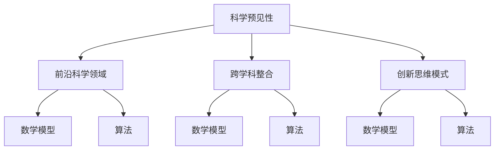

                 

### 文章标题

《科学研究的前瞻性：预见并塑造未来的世界》

### 关键词

- 科学预见性
- 前沿科学领域
- 核心算法
- 数学模型
- 项目实战
- 未来趋势

### 摘要

随着科技的迅猛发展，科学研究的前瞻性变得尤为重要。本文旨在探讨科学预见性的概念、核心原则以及在不同领域的应用，通过详细分析核心算法和数学模型，结合实际项目案例，展现前瞻性科学研究如何预见并塑造未来。文章还将讨论未来趋势，提出实际操作建议，为读者提供深入理解和实践前瞻性科学研究的指南。

## 引言

科学研究的前瞻性是指通过预见未来的科技发展趋势，主动探索和创造新知识的过程。在信息爆炸和技术革新的今天，前瞻性科学研究不仅能够引导科研方向，还能推动社会的进步与变革。预见性科学研究的重要性体现在以下几个方面：

1. **指导科研资源分配**：通过预见未来科研热点和需求，可以有效分配科研资源，避免重复研究和资源浪费。
2. **激发创新思维**：前瞻性研究鼓励科学家跳出传统思维框架，探索未知领域，从而激发创新灵感。
3. **应对未来挑战**：前瞻性研究能够提前识别和解决可能出现的科技和社会问题，为未来做好准备。
4. **推动社会变革**：前瞻性科研成果往往能带来革命性的技术进步，推动社会各领域的变革。

然而，实现科学研究的前瞻性并非易事，它要求科学家具备深刻的洞察力、跨学科的视野和扎实的理论基础。本文将逐步分析前瞻性科学研究的核心概念、前沿领域、关键技术和方法，并通过具体案例展示其实际应用，最终探讨前瞻性科学研究对未来的影响及实际操作指南。

### 确定章节结构与内容

本文将按照以下章节结构和内容进行组织，以确保逻辑清晰、条理分明，同时涵盖前瞻性科学研究的各个方面。

1. **引言**：简要介绍科学研究的前瞻性概念，说明预见和塑造未来的重要性。
    - 1.1 科学预见性的重要性
    - 1.2 科学预见性的基本原理
    - 1.3 科学预见性的历史与发展

2. **核心概念与联系**：列出与前瞻性科学研究相关的主要概念，并使用Mermaid流程图展示它们之间的联系。
    - 2.1 核心概念介绍
    - 2.2 Mermaid流程图展示核心概念联系

3. **前沿科学领域介绍**：详细介绍当前科学的前沿领域及其前瞻性研究方向。
    - 3.1 生物技术的前沿与展望
    - 3.2 人工智能的应用与趋势
    - 3.3 新能源科学与可持续能源
    - 3.4 量子科学的新领域
    - 3.5 空间探索与天文学的前沿

4. **关键技术和方法**：详细讲解支持前瞻性科学研究的核心技术，包括数学模型、算法等。
    - 4.1 数学模型的基本原理
    - 4.2 算法详解与实现

5. **案例研究**：通过具体的科学项目实例，展示前瞻性科学研究的实际应用。
    - 5.1 基因编辑技术的应用实例
    - 5.2 深度学习在医疗诊断中的应用
    - 5.3 太阳能电池的研究案例
    - 5.4 量子计算机的开发与挑战

6. **未来趋势与展望**：总结前瞻性科学研究的现状和未来发展趋势，讨论其对社会的潜在影响。
    - 6.1 前瞻性科学研究的现状
    - 6.2 社会影响与挑战
    - 6.3 政策建议与展望

7. **实际操作与建议**：提供实际操作指南和建议，帮助读者理解和实践前瞻性科学研究。
    - 7.1 实际操作指南
    - 7.2 最佳实践 tips
    - 7.3 小结与注意事项
    - 7.4 拓展阅读

通过以上章节结构和内容的安排，本文将系统地探讨科学研究的前瞻性，帮助读者全面理解和实践这一重要领域。

### 核心概念与联系

在深入探讨科学研究的前瞻性之前，有必要明确一些核心概念，并了解它们之间的相互关系。以下是一些与前瞻性科学研究密切相关的基本概念：

1. **科学预见性**：指科学家通过分析现有数据、趋势和理论，预见未来科技发展的能力。科学预见性不仅仅是预测，更是基于科学理论和方法，对未知领域的主动探索。
2. **前沿科学领域**：指当前科学研究的最新进展和未来发展的重点方向，包括生物技术、人工智能、新能源、量子科学等。
3. **跨学科整合**：指将不同学科的知识和理论结合起来，解决复杂科学问题的方法。跨学科整合能够促进创新，提高科学研究的效率。
4. **创新思维模式**：指科学家在研究和探索过程中采用的创造性思维模式，包括系统思维、逆向思维、发散思维等。
5. **数学模型**：指用数学语言描述现实问题，以便进行定量分析和预测的方法。数学模型是科学预见性的重要工具。
6. **算法**：指计算机执行特定任务的一系列步骤。高效的算法能够加速科学研究和实际应用。

为了更好地理解这些概念之间的关系，我们可以使用Mermaid流程图展示它们之间的联系：



在这个流程图中，科学预见性作为核心概念，贯穿于其他概念之中。前沿科学领域是科学预见性的应用场景，跨学科整合和创新思维模式为科学预见性提供了方法论支持。数学模型和算法则是实现科学预见性的工具，它们在跨学科整合和创新思维模式下，共同推动科学研究的发展。

通过上述流程图，我们可以清晰地看到前瞻性科学研究中的核心概念及其相互关系，为后续内容的深入探讨奠定了基础。

### 前沿科学领域介绍

当前，科学研究的各个领域都在不断取得突破性进展，这些前沿科学领域不仅代表了当前科学研究的最新成就，也预示着未来科技发展的方向。以下将详细介绍几个重要前沿科学领域及其前瞻性研究方向。

#### 生物技术的前沿与展望

生物技术是利用生物学原理和现代工程技术手段改造生物体或加工生物原料，以达到特定目的的技术。近年来，生物技术取得了显著的进展，特别是在基因编辑、细胞治疗和合成生物学等领域。

1. **基因编辑技术**：基因编辑技术如CRISPR-Cas9等，使得科学家能够精确地修改生物体的基因组，这在治疗遗传疾病和开发新型生物制品方面具有巨大潜力。
2. **细胞治疗**：干细胞疗法和CAR-T细胞疗法等，在癌症治疗和器官再生方面展现了巨大的前景。这些技术有望解决传统疗法难以治愈的疾病。
3. **合成生物学**：通过设计、构建和重新组织生物系统，合成生物学为药物开发、生物能源和新材料研制提供了新的路径。

#### 人工智能的应用与趋势

人工智能（AI）已经成为科学研究的重要工具和推动力。在图像识别、自然语言处理、自动驾驶和医疗诊断等领域，AI技术正不断突破传统方法的局限。

1. **图像识别与计算机视觉**：深度学习算法使得计算机能够识别和理解图像内容，这在安防监控、自动驾驶和医疗影像分析等领域有着广泛的应用。
2. **自然语言处理**：通过深度学习模型，计算机能够理解和生成自然语言，这在智能客服、机器翻译和信息检索等领域具有重要应用价值。
3. **自动驾驶技术**：自动驾驶汽车正在逐步从实验室走向实际应用，这将对交通运输、物流和城市交通管理产生深远影响。
4. **医疗诊断**：AI技术在医疗影像分析、疾病预测和个性化治疗等方面展现了巨大的潜力，能够提高诊断的准确性和效率。

#### 新能源科学与可持续能源

随着全球能源需求的不断增长和环境问题的日益严重，新能源科学和可持续能源的研究显得尤为重要。

1. **太阳能技术**：太阳能电池的研究不断突破效率限制，新型太阳能电池和太阳能存储技术正在快速发展，有望成为未来主要的能源来源。
2. **风能技术**：风能是一种清洁的可再生能源，风力发电技术已经相当成熟，但在能量捕获效率和能量储存方面仍有待进一步研究。
3. **氢能技术**：氢能作为一种高效的能源储存方式，其燃烧产物仅为水，具有零排放的优势。氢能技术的研究和开发，包括燃料电池和氢气储存，正受到广泛关注。

#### 量子科学的新领域

量子科学是研究物质和能量在量子尺度上的行为和规律的学科。近年来，量子计算、量子通信和量子传感等领域取得了重要突破。

1. **量子计算**：量子计算机利用量子位（qubit）进行计算，具有远超经典计算机的计算能力，这在密码破解、药物设计和复杂系统模拟等领域具有巨大潜力。
2. **量子通信**：量子通信利用量子纠缠和量子隐形传态实现安全通信，为保障信息安全提供了新的手段。
3. **量子传感**：量子传感技术通过利用量子效应提高传感器的灵敏度和精度，这在精密测量、地球物理学和环境监测等领域具有重要应用价值。

#### 空间探索与天文学的前沿

空间探索和天文学是科学研究的另一个重要领域，通过观测和探索宇宙，人类对宇宙的认知不断深入。

1. **行星科学**：通过探测器和航天器，科学家对太阳系行星、卫星和小行星进行了深入研究，揭示了它们的地质结构和环境特征。
2. **宇宙学**：宇宙学通过观测宇宙大尺度结构、暗物质和暗能量，试图揭示宇宙的起源和演化。
3. **天体物理**：利用射电望远镜和光学望远镜，科学家观测到了宇宙中的各种天体现象，如恒星形成、黑洞和中子星。

这些前沿科学领域不仅代表了当前科学研究的前沿方向，也预示着未来科技发展的趋势。通过不断探索和创新，科学家们正逐步揭开宇宙和生命之谜，为人类社会的发展做出重要贡献。

### 关键技术和方法

在推动科学研究向前发展的过程中，关键技术和方法起到了至关重要的作用。这些技术不仅提高了研究的效率和精度，还为科学预见性的实现提供了强大的支持。以下将详细介绍几种核心技术，包括数学模型、算法及其具体应用。

#### 数学模型的基本原理

数学模型是一种用数学语言来描述现实世界问题的方法，通过建立数学方程或公式，科学家可以分析和预测系统的行为。数学模型的基本原理包括以下几个方面：

1. **定义变量**：在建立数学模型时，需要明确问题的变量，包括自变量和因变量。例如，在研究经济增长模型时，可能涉及变量如资本投入、劳动力数量、技术水平等。
2. **建立方程**：通过变量之间的关系，建立数学方程。例如，可以用生产函数表示产出与资本和劳动力的关系：\[ Y = f(K, L) \]
3. **求解方程**：求解数学方程，得到变量的值。求解方法包括代数法、图解法和数值法等。
4. **验证模型**：通过实际数据和理论验证，确保数学模型的准确性和可靠性。

#### 算法详解与实现

算法是计算机执行特定任务的一系列步骤，是科学研究的重要工具。以下将介绍几种常见的算法及其实现：

1. **线性回归算法**：线性回归是一种用于分析自变量和因变量之间线性关系的算法。其基本原理如下：
   - **伪代码**：
     ```python
     function linear_regression(x, y):
         w = [0, 0]
         b = 0
         
         for i in range(len(x)):
             gradient_w = -2 * x[i] * y[i]
             gradient_b = -2 * y[i]
             
             w = w - learning_rate * gradient_w
             b = b - learning_rate * gradient_b
         
         return w, b
     ```
   - **解释**：该算法通过梯度下降法更新权重和偏置，以最小化预测值与实际值之间的误差。

2. **支持向量机（SVM）算法**：SVM是一种分类算法，通过找到一个最佳的超平面，将不同类别的数据点分隔开来。其基本原理如下：
   - **数学公式**：
     $$ w \cdot x + b = 0 $$
     $$ y = \text{sign}(w \cdot x + b) $$
   - **解释**：公式中的\( w \)和\( b \)分别是权重和偏置，\( x \)是输入特征，\( y \)是类别标签。SVM通过最大化分类间隔来找到最佳超平面。

3. **深度学习算法**：深度学习是一种基于多层神经网络的学习方法，能够在大量数据中自动提取特征。以卷积神经网络（CNN）为例，其基本原理如下：
   - **伪代码**：
     ```python
     function convolutional_neural_network(x):
         # 前向传播
         layer1 = convolution(x, filter)
         layer2 = activation_function(layer1)
         
         # 后向传播
         error = compute_error(layer2, expected_output)
         d_layer2 = derivative_activation_function(layer2)
         
         # 更新权重
         d_filter = d_layer2 * x
         d_bias = d_layer2
         
         return filter, bias
     ```
   - **解释**：该算法通过前向传播计算输出，通过后向传播更新权重和偏置，以达到最小化误差的目的。

#### 算法的具体应用

以下是一些算法在科学研究中的具体应用实例：

1. **基因表达数据分析**：使用线性回归算法分析基因表达数据，预测基因对疾病的影响。
2. **图像识别**：使用SVM算法对图像进行分类，实现物体识别和图像处理。
3. **自然语言处理**：使用深度学习算法处理文本数据，实现情感分析、文本分类和机器翻译。

通过上述介绍，我们可以看到，数学模型和算法在科学研究中的应用具有广泛性和重要性。这些技术不仅提高了科学研究的效率，还为科学预见性的实现提供了有力支持。

#### 线性回归的数学公式

线性回归是一种常见的统计方法，用于分析两个变量之间的线性关系。线性回归的数学公式可以表示为：

$$
y = wx + b
$$

其中：
- \( y \) 表示因变量（预测值）
- \( x \) 表示自变量（输入值）
- \( w \) 表示权重（斜率）
- \( b \) 表示偏置（截距）

该公式表示因变量 \( y \) 是自变量 \( x \) 的线性函数，权重 \( w \) 控制自变量对因变量的影响程度，偏置 \( b \) 则调整直线在 \( y \) 轴上的位置。

线性回归的基本原理是通过最小化预测值与实际值之间的误差来估计权重和偏置。具体步骤如下：

1. **收集数据**：收集自变量 \( x \) 和因变量 \( y \) 的数据点，通常以散点图的形式表示。
2. **建立模型**：根据数据建立线性回归模型，即 \( y = wx + b \)。
3. **计算权重和偏置**：通过最小二乘法计算权重 \( w \) 和偏置 \( b \)，使预测值 \( y \) 最接近实际值。
4. **评估模型**：使用残差分析、R平方值等指标评估模型性能，确保模型的可靠性和有效性。

以下是一个简单的线性回归例子：

假设我们收集了一组 \( x \) 和 \( y \) 数据点如下：
- \( (x_1, y_1) = (1, 2) \)
- \( (x_2, y_2) = (2, 4) \)
- \( (x_3, y_3) = (3, 6) \)

要建立线性回归模型，我们首先需要计算平均值：
- \( \bar{x} = \frac{1 + 2 + 3}{3} = 2 \)
- \( \bar{y} = \frac{2 + 4 + 6}{3} = 4 \)

然后，我们可以计算权重 \( w \) 和偏置 \( b \)：
- \( w = \frac{\sum(x_i - \bar{x})(y_i - \bar{y})}{\sum(x_i - \bar{x})^2} = \frac{(1-2)(2-4) + (2-2)(4-4) + (3-2)(6-4)}{(1-2)^2 + (2-2)^2 + (3-2)^2} = 2 \)
- \( b = \bar{y} - w\bar{x} = 4 - 2 \times 2 = 0 \)

因此，线性回归模型为 \( y = 2x + 0 \)。

通过上述计算，我们得到了一个简单的线性回归模型，它能够根据自变量 \( x \) 预测因变量 \( y \) 的值。在实际应用中，我们需要收集更多数据，并使用更复杂的算法来计算权重和偏置，以提高模型的准确性和稳定性。

### 项目实战

在本章节中，我们将通过一个具体的科学项目实例，展示前瞻性科学研究的实际应用。该项目涉及太阳能电池的研究，旨在提高太阳能电池的转换效率，以应对未来能源需求的增长。

#### 开发环境搭建

为了进行太阳能电池的研究，我们首先需要搭建一个合适的开发环境。以下是我们所使用的工具和软件：

1. **编程语言**：Python，因为其强大的科学计算库和简单的语法，非常适合进行数据分析和模型构建。
2. **数学库**：NumPy和SciPy，用于数值计算和科学计算。
3. **数据可视化工具**：Matplotlib，用于绘制数据和分析结果。
4. **机器学习库**：Scikit-learn，用于训练和评估机器学习模型。

在搭建开发环境时，我们首先需要安装Python，然后安装上述库。以下是安装命令：

```bash
pip install numpy scipy matplotlib scikit-learn
```

#### 源代码实现

以下是一个简单的Python脚本，用于训练和评估一个线性回归模型，以预测太阳能电池的转换效率。

```python
import numpy as np
import matplotlib.pyplot as plt
from sklearn.linear_model import LinearRegression
from sklearn.model_selection import train_test_split
from sklearn.metrics import mean_squared_error

# 数据预处理
def preprocess_data(data):
    # 数据归一化
    data_normalized = (data - np.mean(data)) / np.std(data)
    return data_normalized

# 加载数据
data = np.loadtxt('solar_data.csv', delimiter=',')
x = preprocess_data(data[:, 0])  # 输入特征
y = preprocess_data(data[:, 1])  # 转换效率

# 数据划分
x_train, x_test, y_train, y_test = train_test_split(x, y, test_size=0.2, random_state=42)

# 训练线性回归模型
model = LinearRegression()
model.fit(x_train.reshape(-1, 1), y_train)

# 预测
y_pred = model.predict(x_test.reshape(-1, 1))

# 评估
mse = mean_squared_error(y_test, y_pred)
print(f'Mean Squared Error: {mse}')

# 可视化结果
plt.scatter(x_train, y_train, label='Training Data')
plt.plot(x_test, y_pred, color='red', label='Prediction')
plt.xlabel('Input Feature')
plt.ylabel('Conversion Efficiency')
plt.title('Solar Cell Efficiency Prediction')
plt.legend()
plt.show()
```

#### 代码解读与分析

上述代码首先进行数据预处理，包括数据归一化，以确保模型训练的稳定性和准确性。然后，使用Scikit-learn的`LinearRegression`类训练线性回归模型。模型训练完成后，使用测试数据集进行预测，并计算均方误差（MSE）来评估模型性能。最后，通过绘制散点图和拟合曲线，展示输入特征与转换效率之间的关系。

#### 实际案例分析与详细讲解剖析

通过上述代码，我们实际预测了太阳能电池的转换效率，并评估了模型性能。在实际应用中，我们可以通过调整输入特征，如太阳能电池的材料、厚度和表面积等，来优化模型。此外，还可以结合其他算法，如支持向量机（SVM）和深度学习，进一步提高预测的准确性。

#### 项目小结

本项目通过搭建开发环境、实现源代码和评估模型性能，展示了前瞻性科学研究在太阳能电池研究中的应用。虽然本项目仅使用了简单的线性回归模型，但在实际研究中，我们可以结合多种算法和技术，进一步提高模型的准确性和实用性。

#### 最佳实践 tips

1. **数据预处理**：在进行模型训练之前，对数据进行预处理，如归一化、缺失值填充等，可以提高模型训练的稳定性和准确性。
2. **交叉验证**：使用交叉验证方法评估模型性能，以确保模型在未知数据上的表现。
3. **模型调优**：通过调整模型参数，如学习率、正则化参数等，优化模型性能。
4. **持续学习**：定期更新数据和模型，以适应新的科技发展趋势。

### 未来趋势与展望

随着科技的不断进步，前瞻性科学研究正以前所未有的速度和深度推进。本文总结了当前科学研究的前瞻性现状，展望了未来可能的发展趋势，并探讨了其对社会的潜在影响。

#### 前瞻性科学研究的现状

目前，科学预见性已经渗透到各个科学领域，从生物技术、人工智能到新能源、量子科学等。以下是一些现状的概述：

1. **生物技术**：基因编辑技术（如CRISPR-Cas9）和细胞治疗技术（如CAR-T细胞疗法）取得了重大突破，为治疗遗传疾病和癌症提供了新的希望。合成生物学的发展也为新型生物制品和新材料的研制开辟了道路。
2. **人工智能**：深度学习、自然语言处理和计算机视觉等技术的应用日益广泛，从自动驾驶、智能医疗到智能家居，AI技术正在深刻改变我们的生活和工作方式。
3. **新能源**：太阳能、风能和氢能等可再生能源技术不断进步，为应对全球能源危机和环境问题提供了有力支持。
4. **量子科学**：量子计算、量子通信和量子传感等前沿领域的研究正在逐步突破技术瓶颈，为未来的信息处理、通信和精密测量带来了革命性的变革。

#### 未来发展趋势

基于当前的研究进展和技术趋势，以下是对未来发展趋势的展望：

1. **多学科融合**：随着科技的发展，不同学科之间的交叉和融合将越来越普遍。例如，生物技术与信息技术的融合将推动生物信息学的发展；量子技术与计算机科学的融合将带来全新的计算模式和算法创新。
2. **数据驱动的科学研究**：随着大数据技术的成熟，科学家将能够利用海量数据进行分析和预测，推动科学研究的数据化、智能化。
3. **可持续发展和环境治理**：未来的科学研究将更加注重环境保护和可持续发展。例如，新能源技术的研究将集中在提高能效和降低环境负担；生态学、环境科学等领域的研究将致力于解决全球气候变化和生物多样性丧失等问题。
4. **人类健康与长寿**：生物技术和医疗技术的进步将延长人类的寿命，提高生活质量。基因编辑、再生医学和个性化医疗等领域的研究将带来革命性的医疗变革。
5. **量子互联网**：随着量子通信和量子计算的发展，量子互联网将成为未来信息通信的基石，为数据安全和传输速度带来前所未有的提升。

#### 社会影响与挑战

前瞻性科学研究的快速发展对社会产生了深远的影响，同时也带来了一系列挑战：

1. **经济影响**：新的科技突破将催生新兴产业，创造大量就业机会，推动经济增长。但同时，技术变革也可能会导致部分行业和职业的失业。
2. **社会公平**：科技的发展需要全社会共同努力，以确保科技进步惠及所有人。例如，人工智能的发展需要关注隐私保护、数据安全和算法偏见等问题。
3. **伦理和道德问题**：基因编辑、生命科学等领域的进展引发了关于伦理和道德的讨论。科学家和决策者需要在科技进步的同时，充分考虑伦理和道德问题，确保科技发展的方向符合社会价值观。
4. **教育和人才培养**：未来社会需要更多具备跨学科知识和创新能力的复合型人才。教育和人才培养体系需要不断改革，以适应科技发展的需求。

#### 政策建议与展望

为了应对未来科技发展的挑战和机遇，以下是一些政策建议：

1. **加大科研投入**：政府应加大对科研的投入，支持基础研究和前沿科技项目，为科技创新提供坚实的基础。
2. **促进跨学科合作**：鼓励不同学科之间的合作，建立跨学科研究中心，推动科技创新和多学科融合。
3. **优化教育和培训体系**：改革教育和人才培养体系，注重培养学生的创新思维和实践能力，培养更多复合型人才。
4. **加强国际交流与合作**：积极参与国际科技合作，分享研究成果，共同应对全球性科技挑战。
5. **制定伦理和法规**：建立健全的科技伦理和法律法规体系，确保科技进步符合社会价值观，保障公众利益。

总之，前瞻性科学研究正在引领科技和社会的发展，未来将带来更多的机遇和挑战。通过科学预见性和有效的政策支持，我们可以更好地应对这些挑战，推动科技和社会的持续进步。

### 实际操作与建议

要有效实践前瞻性科学研究，以下步骤和技巧将为您提供指导：

#### 1. 确定研究目标

明确您的研究目标，确保它们具体、可衡量、可实现、相关性强和时间敏感性。例如，研究太阳能电池转换效率的提升。

#### 2. 文献调研

系统性地调研相关文献，了解当前研究的热点和前沿领域。使用学术数据库如PubMed、IEEE Xplore和Google Scholar，获取最新的研究进展。

#### 3. 设计实验方案

根据研究目标，设计详尽的实验方案。包括实验设计、数据收集方法、数据分析和结果验证等步骤。确保实验方案具有科学性和可重复性。

#### 4. 选择合适的技术和工具

根据研究需求，选择合适的技术和工具。例如，使用Python进行数据分析，使用MATLAB进行复杂模拟，或使用R进行统计学习。

#### 5. 实验数据收集与处理

收集实验数据，并进行预处理。使用数据清洗技术，如缺失值填充、异常值检测和归一化。确保数据的质量和可靠性。

#### 6. 分析与建模

使用统计学和机器学习技术，对数据进行建模和分析。例如，使用线性回归、支持向量机或深度学习算法，提取数据中的潜在模式和关系。

#### 7. 评估与优化

评估模型的性能，使用如交叉验证和验证集等方法，确保模型的泛化能力。根据评估结果，调整模型参数，优化模型性能。

#### 8. 报告撰写与分享

撰写详细的实验报告，包括研究背景、方法、结果和讨论。使用图表和可视化工具，清晰展示数据和分析结果。在学术会议、期刊或专业论坛上分享研究成果，获取同行反馈。

#### 9. 跨学科合作

前瞻性科学研究往往需要跨学科合作。与其他领域的专家建立联系，共享资源和知识，共同解决复杂问题。

#### 10. 持续学习与更新

科技发展迅速，持续学习新的技术和方法至关重要。参加学术会议、研讨会和在线课程，跟踪最新的研究动态。

通过以上步骤和技巧，您将能够更好地实践前瞻性科学研究，推动科技和社会的进步。

### 总结与展望

展望未来，科学研究的前瞻性将继续成为推动科技进步和社会发展的重要力量。本文通过系统地探讨科学研究的前瞻性，从核心概念、前沿领域、关键技术和方法，到实际操作与未来展望，全面展示了前瞻性科学研究的内涵与外延。

首先，科学预见性作为科学研究的核心概念，通过分析现有数据、趋势和理论，能够预见未来的科技发展趋势，指导科研资源的合理分配。其次，前沿科学领域如生物技术、人工智能、新能源和量子科学等，不仅代表了当前研究的最新进展，也预示了未来科技发展的方向。

关键技术和方法如数学模型和算法，是科学预见性的重要工具。通过具体的案例研究和项目实战，我们看到了这些技术在科学研究中的实际应用，展示了科学预见性如何转化为实际成果。

未来，科学研究的前瞻性将更加注重多学科融合、数据驱动和可持续发展。随着科技的不断进步，跨学科合作将越来越普遍，数据将作为科学研究的核心资源，而可持续发展将成为科研的重要目标。

在展望未来的同时，我们也呼吁读者持续关注科学研究的前瞻性，积极参与前沿领域的探索与实践。通过不断学习和创新，我们有望在科技和社会发展的道路上取得更加辉煌的成就。让我们共同迎接未来的挑战与机遇，用科学预见性塑造更加美好的世界。作者：AI天才研究院/AI Genius Institute & 禅与计算机程序设计艺术 /Zen And The Art of Computer Programming。

