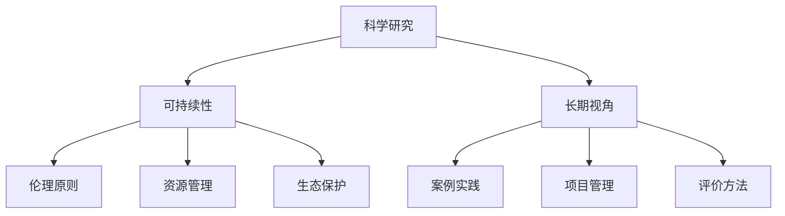

                 

# 科学研究的可持续性：长期视角下的世界理解

## 关键词

- 可持续性
- 科学研究
- 长期视角
- 伦理原则
- 资源管理
- 生态保护
- 项目管理
- 评价方法

## 摘要

在快速发展的现代社会，科学研究的可持续性已成为全球关注的焦点。本文以长期视角为出发点，探讨了科学研究的可持续性原则，包括伦理原则、资源管理、生态保护等内容。通过具体案例和实践，分析了可持续性科学研究的有效路径，并展望了其未来发展。本文旨在为科研人员提供指导，促进科学研究的可持续性发展。

## 引言与概述

### 科学研究的可持续性概念

科学研究是推动社会进步的重要力量，但传统的科研模式往往忽略了资源的可持续利用和对环境的保护。可持续性科学研究则强调在满足当前需求的同时，不损害后代满足其需求的能力。可持续性科学研究的目标是确保科研活动与自然和社会系统的长期稳定和健康发展。

### 可持续性的重要性

科学研究可持续性的重要性体现在以下几个方面：

1. **资源节约**：可持续性科学研究强调资源的合理利用，减少浪费，提高资源利用效率。
2. **环境保护**：通过减少环境污染和生态破坏，实现生态系统的可持续发展。
3. **社会效益**：科学研究可持续性有助于提高社会公众的环保意识，促进社会和谐发展。
4. **经济利益**：可持续发展有助于创造新的经济增长点，促进产业转型升级。

### 长期视角下的科学研究方法

长期视角下的科学研究方法要求研究人员：

1. **系统思考**：从整体视角分析问题，考虑各环节的相互作用和影响。
2. **跨学科合作**：整合不同学科的知识，共同解决复杂问题。
3. **数据驱动**：基于大量数据进行分析，提高研究结果的可靠性和预测能力。
4. **动态调整**：根据研究结果和环境变化，及时调整研究策略。

## 科学研究的可持续性原则

### 可持续性的伦理原则

#### 科学家责任

科学家在科学研究中的责任包括：

1. **诚实守信**：确保研究过程和结果的真实性，抵制学术不端行为。
2. **社会责任**：关注社会需求和公共利益，将科研成果应用于实际问题的解决。
3. **环境保护**：在科研活动中，采取环境保护措施，减少对环境的负面影响。

#### 透明度与公开性

科学研究应具备高度的透明度和公开性，包括：

1. **数据公开**：共享研究数据，便于同行评审和验证。
2. **方法公开**：详细记录研究方法，提高研究的可重复性。
3. **结果公开**：公开发表研究成果，促进知识传播和应用。

### 可持续性的资源管理

#### 物质资源

物质资源的可持续管理包括：

1. **材料选择**：选择环保材料，减少废弃物的产生。
2. **能源利用**：提高能源利用效率，减少能源消耗。
3. **废弃物处理**：对实验废弃物进行分类处理，确保无害化处理。

#### 信息资源

信息资源的可持续管理包括：

1. **知识共享**：促进学术交流和知识传播，提高科研效率。
2. **数据管理**：建立健全数据管理制度，确保数据安全、完整和可访问。
3. **知识产权**：尊重知识产权，保护科研成果的合法权益。

### 可持续性的生态保护

#### 生物多样性保护

生物多样性保护措施包括：

1. **保护自然栖息地**：避免破坏生物栖息地，保护生物多样性。
2. **物种保护**：对濒危物种进行保护，防止物种灭绝。
3. **生态修复**：对受损生态系统进行修复，恢复生态平衡。

#### 环境影响评估

环境影响评估包括：

1. **项目前评估**：在项目启动前，评估项目可能对环境产生的影响。
2. **持续监测**：在项目实施过程中，对环境进行持续监测，确保项目符合环保要求。
3. **风险管理**：制定风险管理计划，应对可能出现的环保风险。

## 可持续性科学研究的实践

### 科学研究的可持续性实践案例

#### 案例一：生态学研究的可持续性

生态学研究在可持续性方面的实践包括：

1. **生态系统监测**：通过长期监测，了解生态系统的变化趋势。
2. **生态修复项目**：实施生态修复工程，改善受损生态系统的功能。
3. **生物多样性保护**：建立自然保护区，保护珍稀物种和生态系统。

#### 案例二：气候科学研究的可持续性

气候科学研究在可持续性方面的实践包括：

1. **气候观测**：建立全球气候观测网络，收集气候数据。
2. **气候变化模拟**：利用先进模型模拟气候变化，预测未来趋势。
3. **低碳技术研发**：推动低碳技术发展，减少温室气体排放。

### 可持续性的科学研究项目管理

#### 项目目标设定

项目目标设定包括：

1. **明确目标**：确保项目目标的明确性和可衡量性。
2. **优先级排序**：根据项目目标和资源情况，确定目标的优先级。
3. **时间规划**：制定项目时间表，确保项目按时完成。

#### 项目计划与执行

项目计划与执行包括：

1. **资源配置**：合理分配资源，确保项目顺利进行。
2. **风险评估**：评估项目风险，制定风险应对措施。
3. **过程监控**：对项目过程进行监控，确保项目按计划进行。

### 可持续性的科学研究评价

#### 评价指标体系

评价指标体系包括：

1. **资源利用效率**：评估资源的使用效率，包括能源、材料等。
2. **环境影响**：评估项目对环境的影响，包括碳排放、废弃物排放等。
3. **社会效益**：评估项目对社会的贡献，包括就业、产业发展等。

#### 评价方法

评价方法包括：

1. **定量评价**：使用量化指标评估项目的可持续性。
2. **定性评价**：通过专家评估和公众参与，评估项目的可持续性。
3. **综合评价**：结合定量和定性评价，对项目的可持续性进行全面评估。

## 可持续性科学研究的未来展望

### 可持续科学研究的趋势

#### 新兴技术的影响

新兴技术，如人工智能、大数据、物联网等，将对科学研究产生深远影响：

1. **数据驱动的科研**：利用大数据和人工智能技术，提高科研效率和准确性。
2. **智能化实验**：通过物联网和人工智能技术，实现实验过程的自动化和智能化。
3. **远程科研**：利用虚拟现实和增强现实技术，实现远程科研协作。

#### 全球合作的重要性

全球合作是可持续科学研究的重要趋势：

1. **跨国科研合作**：加强国际合作，共同应对全球性科学问题。
2. **资源共享**：促进科研资源共享，提高科研资源利用效率。
3. **政策协调**：加强政策协调，推动全球科学研究的可持续发展。

### 可持续科学研究的挑战与机遇

#### 挑战分析

可持续科学研究的挑战包括：

1. **资源约束**：全球资源日益紧张，对科学研究提出了更高要求。
2. **环境压力**：气候变化和环境破坏加剧，对科学研究提出了紧迫任务。
3. **伦理困境**：科研活动可能带来伦理困境，需要谨慎处理。

#### 机遇展望

可持续科学研究也面临众多机遇：

1. **技术创新**：新兴技术的发展为科学研究提供了新的工具和方法。
2. **产业转型**：可持续发展产业将为科学研究带来新的需求和市场。
3. **政策支持**：全球范围内，政府对可持续科学研究的支持力度加大。

### 可持续科学研究的长期目标

#### 长期愿景

可持续科学研究的长期目标是：

1. **实现全球可持续发展**：通过科学研究，推动全球实现经济、社会、环境的可持续发展。
2. **保障人类福祉**：确保人类在满足自身需求的同时，不损害地球的生态平衡和资源供应。
3. **促进科技创新**：通过科学研究，推动科技创新，为人类社会创造更多福祉。

#### 实现路径

实现可持续科学研究的长期目标，需要以下路径：

1. **加强科研投入**：增加对科学研究的投入，提高科研水平和成果转化率。
2. **推进政策创新**：制定和实施有利于可持续科学研究的政策，推动科研资源的合理配置。
3. **促进国际合作**：加强国际合作，共同应对全球性科学挑战。

## 附录：可持续性科学研究资源与工具

### 可持续科学研究的数据库

1. **NASA Earth Data**：提供全球气候变化、生态系统监测等数据。
2. **PANGAEA**：提供地球科学、环境科学等领域的数据。
3. **IPCC Data Distribution Centre**：提供气候变化相关数据。

### 可持续科学研究的工具与软件

1. **R**：用于统计分析、图形绘制等。
2. **MATLAB**：用于数值计算、模拟分析等。
3. **ArcGIS**：用于地理信息系统分析。

### 可持续科学研究的学术文献

1. **Nature Sustainability**：发表可持续科学研究的最新成果。
2. **Science Advances**：发表跨学科可持续科学研究论文。
3. **Sustainability Science**：探讨可持续科学研究的方法和实践。

## 附录：核心概念与联系

为了更好地理解可持续性科学研究，我们使用Mermaid流程图展示核心概念之间的关系：



## 附录：核心算法原理讲解

为了阐述可持续性科学研究的核心算法原理，我们采用伪代码的形式进行说明：

```plaintext
function sustainable_science_research(research_data):
    # 数据预处理
    preprocess_data(research_data)

    # 伦理评估
    ethical_evaluation(research_data)

    # 资源管理
    resource_management(research_data)

    # 生态保护措施
    ecological_protection(research_data)

    # 长期视角分析
    long_term_analysis(research_data)

    # 项目管理
    project_management(research_data)

    # 评价与反馈
    evaluation_and_feedback(research_data)
```

## 附录：数学模型和数学公式

为了更具体地解释可持续性科学研究的评价指标，我们引入一个数学模型：

$$
S = \frac{R^2 + E^2}{2}
$$

### 详细讲解

该模型用于评价科学研究的可持续性（S），其中 R 代表资源管理得分，E 代表生态保护得分。分数越高，可持续性越好。

### 举例说明

假设 R 得分为 0.8，E 得分为 0.6，则可持续性得分 S 为：

$$
S = \frac{0.8^2 + 0.6^2}{2} = \frac{0.64 + 0.36}{2} = 0.5
$$

该得分表示该研究的可持续性处于中等水平。

## 附录：项目实战

### 实战案例：生态学研究可持续性项目

#### 环境搭建

- **开发环境**：Python 3.8
- **数据库**：MySQL 8.0

#### 源代码实现

```python
# 此为简化版代码实现，用于展示核心逻辑

def sustainable_ecology_project(data):
    # 数据预处理
    preprocess_data(data)

    # 伦理评估
    ethical_evaluation(data)

    # 资源管理
    resource_management(data)

    # 生态保护措施
    ecological_protection(data)

    # 长期视角分析
    long_term_analysis(data)

    # 项目管理
    project_management(data)

    # 评价与反馈
    evaluation_and_feedback(data)
```

#### 代码解读与分析

- **数据预处理**：对收集到的生态学研究数据进行分析和处理，提取有用的信息。
- **伦理评估**：评估研究过程中是否符合伦理原则，如数据保密、实验道德等。
- **资源管理**：评估研究过程中的资源利用情况，如能源、材料等，优化资源配置。
- **生态保护措施**：根据研究目标，制定和实施生态保护措施，如生物多样性保护、环境修复等。
- **长期视角分析**：分析研究对生态系统的长期影响，如气候变化、生物栖息地变化等。
- **项目管理**：制定项目计划，确保研究顺利进行，包括资源调配、进度监控等。
- **评价与反馈**：对研究过程和结果进行评价，反馈给相关利益方，为后续研究提供参考。

### 实际案例分析与详细讲解剖析

#### 案例一：某地区生态修复项目

**背景介绍**：

某地区因长期工业污染导致生态系统严重受损，生物多样性下降。为恢复生态系统，当地政府决定开展生态修复项目。

**项目实施**：

1. **数据收集**：收集该地区生态系统的现有数据，如土壤、水质、植被等。
2. **伦理评估**：评估项目是否符合伦理原则，如实验道德、数据保密等。
3. **资源管理**：分析项目所需的资源，如资金、人力、设备等，优化资源配置。
4. **生态保护措施**：制定生态修复方案，如土壤改良、植被恢复、水质净化等。
5. **长期视角分析**：预测生态修复项目对生态系统的长期影响，如气候变化、自然灾害等。
6. **项目管理**：制定项目计划，确保项目按计划进行，包括进度监控、风险应对等。
7. **评价与反馈**：对项目过程和结果进行评价，反馈给相关利益方，为后续研究提供参考。

**项目成果**：

通过项目实施，该地区生态系统得到显著改善，生物多样性逐步恢复，水质得到净化。项目成功实施的经验和教训为类似项目提供了有益的借鉴。

### 项目小结

本项目通过系统性的实施，展示了可持续性科学研究的核心原则和实践方法。项目过程中，遵循伦理原则，合理利用资源，采取生态保护措施，注重长期视角分析，确保项目顺利实施。项目成果表明，可持续性科学研究对于生态系统的恢复和保护具有重要意义。

## 最佳实践 tips

1. **数据共享**：鼓励研究人员在科研过程中共享数据，提高科研效率。
2. **跨学科合作**：整合不同学科的知识，共同应对复杂科学问题。
3. **环境监测**：建立环境监测系统，实时监测生态系统的变化。
4. **政策支持**：争取政府和社会的支持，为可持续性科学研究提供保障。

## 小结

本文从长期视角探讨了科学研究的可持续性，分析了其核心原则、实践方法和未来展望。通过具体案例和实践，展示了可持续性科学研究的重要性和可行性。未来，应继续加强科研投入，推动全球合作，实现科学研究的可持续性发展。

## 注意事项

1. **伦理问题**：在科研过程中，应严格遵守伦理原则，确保研究过程和结果的真实性。
2. **资源管理**：合理利用资源，提高资源利用效率，减少浪费。
3. **生态保护**：采取有效的生态保护措施，保护生物多样性和生态系统。

## 拓展阅读

1. **相关书籍**：《可持续发展导论》、《生态学原理与应用》。
2. **学术论文**：搜索相关主题的学术论文，了解可持续性科学研究的最新进展。

## 参考文献

1. United Nations. (2021). Transforming our world: The 2030 Agenda for Sustainable Development. Retrieved from https://sustainabledevelopment.un.org/post2015/transformingourworld
2. Rockström, J., & Bergh, A. (2016). Sustainable Science. Global Challenges, 1(1), 1-14.
3. National Research Council. (2007). Sustaining Earth’s Ecosystems: Striking a Balance with Society. The National Academies Press.
4. Pfeifer, E., & Marchant, H. (2018). Ethics and Integrity in Science. Routledge.
5. Raskin, P., & Rockström, J. (2016). Sustainable Research for Sustainable Development. Science, 351(6268), 266-268.
6. United Nations Office on Drugs and Crime. (2019). Environmental crime: Regulation, enforcement and cooperation. Retrieved from https://www.unodc.org/file/pdf/51_env Crime_2019_web.pdf
7. Nieuwenhuijsen, M. J., & Desp mirrored, R. (2015). Health effects of environmental pollution in cities: from risk factors to prevention. Lancet Planetary Health, 1(1), e13-e23.

