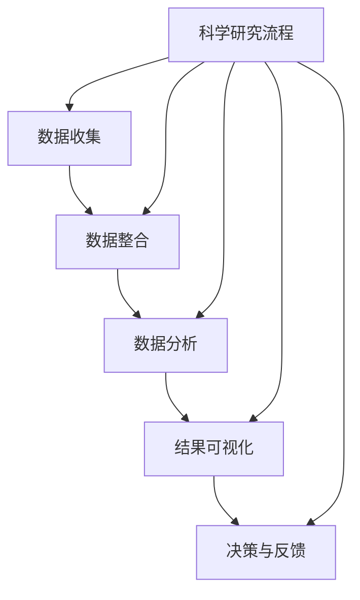
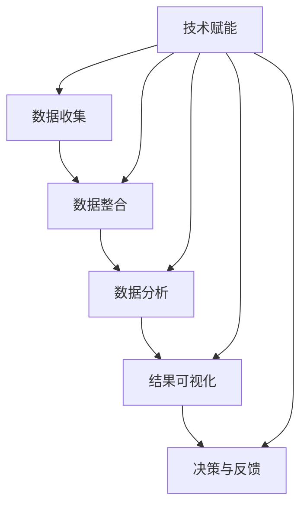

                 

### 文章标题
《科学研究的数字化转型：技术赋能世界理解过程》

### 关键词
科学研究，数字化转型，人工智能，数据分析，机器学习

### 摘要
本文深入探讨了科学研究的数字化转型过程，通过分析数据收集、处理、分析和结果可视化的各个阶段，展示了技术如何赋能科学研究，提升我们对世界的理解。文章详细介绍了数字化转型中的核心概念、算法原理、数学模型及其在项目中的应用，并结合实际案例进行了剖析，为科学研究提供了技术启示和最佳实践。

### 第1章：科学研究的数字化转型概述
#### 1.1 背景介绍
随着信息技术和人工智能的快速发展，科学研究正经历着一场深刻的数字化转型。传统的科学研究方法主要依赖于实验和统计分析，而数字化转型引入了大数据分析、机器学习等先进技术，极大地提升了数据处理的效率和科学发现的精度。

#### 1.2 核心概念与联系
科学研究的数字化转型涉及多个核心概念，包括数据收集与整合、数据分析与处理、结果可视化与共享以及决策与反馈。这些概念之间相互关联，构成了一个完整的科学研究流程。下面使用Mermaid流程图来展示这些概念之间的关系：



在这个流程图中，技术（F）赋能科学研究流程（F），使得各个环节更加高效和精确。数据收集（A）通过传感器、实验设备等方式获取，数据整合（B）通过数据库和云计算技术实现，数据分析（C）利用机器学习和数据挖掘算法，结果可视化（D）通过图表和报告展示，决策与反馈（E）则依赖于数据的分析和可视化结果。

#### 1.3 数字化转型的影响
数字化转型不仅改变了科学研究的流程，还深刻影响了科学发现的模式。通过大数据和人工智能，科学家可以处理和分析海量的数据，发现传统方法无法察觉的规律和趋势。这种能力的提升，使得科学研究更加精确和高效，推动了科学前沿的发展。

### 第2章：核心算法原理
#### 2.1 数据挖掘算法原理
数据挖掘是数字化转型的重要组成部分，它旨在从大量数据中提取有价值的信息和知识。以下将介绍几种常用的数据挖掘算法，包括K-Means聚类算法和决策树算法。

#### 2.1.1 K-Means聚类算法
K-Means聚类算法是一种无监督学习方法，用于将数据集划分为K个簇，每个簇内的数据点尽可能接近，而簇与簇之间的数据点尽可能远。算法的基本步骤如下：

1. **初始化**：随机选择K个数据点作为初始簇中心。
2. **分配**：对于每个数据点，计算它与各个簇中心的距离，并将其分配到最近的簇。
3. **更新**：重新计算各个簇的中心点。
4. **迭代**：重复步骤2和3，直到满足收敛条件（如簇中心点变化小于某个阈值）。

以下是一个简化的伪代码：

```plaintext
function KMeans(data, K):
    centroids = initialize centroids(K, data)
    while not converged:
        assignments = assign_data_to_cluster(data, centroids)
        centroids = update_centroids(assignments, data)
    return centroids, assignments
```

#### 2.1.2 决策树算法
决策树算法是一种有监督学习方法，用于分类和回归任务。它通过一系列的决策规则，将数据集划分成多个子集，直到满足某种停止条件（如纯度或最大深度）。

1. **选择最优划分**：根据信息增益或基尼不纯度选择最佳特征进行划分。
2. **递归划分**：对划分后的子集继续进行划分，直到满足停止条件。
3. **生成决策树**：将划分规则组合成一棵决策树。

以下是一个简化的伪代码：

```plaintext
function DecisionTree(data, features, max_depth):
    if stopping_condition_met(data):
        return leaf_value(data)
    best_feature, best_threshold = select_best_feature(data, features)
    left_data, right_data = split_data(data, best_feature, best_threshold)
    left_tree = DecisionTree(left_data, features, max_depth - 1)
    right_tree = DecisionTree(right_data, features, max_depth - 1)
    return TreeNode(best_feature, best_threshold, left_tree, right_tree)
```

### 第3章：数学模型与公式
#### 3.1 线性回归模型
线性回归模型是一种用于预测数值变量的基本模型。其目标是最小化预测值与实际值之间的误差。线性回归模型的基本公式为：

$$
Y = \beta_0 + \beta_1X + \epsilon
$$

其中，$Y$ 是因变量，$X$ 是自变量，$\beta_0$ 和 $\beta_1$ 分别是截距和斜率，$\epsilon$ 是误差项。

为了找到最佳拟合线，可以使用最小二乘法来估计参数 $\beta_0$ 和 $\beta_1$。最小二乘法的目标是最小化误差平方和：

$$
\sum_{i=1}^{n}(Y_i - \hat{Y}_i)^2
$$

其中，$\hat{Y}_i = \beta_0 + \beta_1X_i$ 是预测值。

#### 3.2 神经网络模型
神经网络模型是一种基于模拟人脑结构和工作原理的计算模型，用于复杂的数据分析和模式识别。一个简单的神经网络可以表示为：

$$
Z = \sigma(\sum_{i=1}^{n} \omega_i X_i + b)
$$

其中，$Z$ 是输出值，$\sigma$ 是激活函数，$\omega_i$ 是权重，$X_i$ 是输入值，$b$ 是偏置。

常见的激活函数包括Sigmoid函数和ReLU函数。Sigmoid函数的定义如下：

$$
\sigma(x) = \frac{1}{1 + e^{-x}}
$$

ReLU函数的定义如下：

$$
\sigma(x) = \max(0, x)
$$

神经网络的训练过程通常包括前向传播和反向传播。在前向传播中，将输入值传递到网络中，通过激活函数和权重计算输出值。在反向传播中，计算输出值与实际值之间的误差，并更新权重和偏置，以减少误差。

### 第4章：数字化转型项目实战
#### 4.1 项目背景
在本章中，我们将分析一个生物医学研究的案例，该研究利用大数据分析和机器学习技术来预测疾病的发生。项目目标是构建一个能够预测某种疾病发生风险的模型，以辅助医生进行早期诊断和干预。

#### 4.2 实战步骤
##### 4.2.1 数据收集与预处理
在项目开始阶段，需要收集大量的医疗数据，包括患者的病历信息、基因序列、生活习惯等。数据来源可能包括医院病历系统、基因组数据库和患者问卷等。收集到的数据需要进行预处理，包括数据清洗、缺失值处理和特征提取。

1. **数据清洗**：去除重复数据和异常值，确保数据的质量。
2. **缺失值处理**：对于缺失的数据，可以使用均值填充、中值填充或插值等方法进行补全。
3. **特征提取**：从原始数据中提取有用的特征，如年龄、性别、血压、心率等。

##### 4.2.2 数据分析和建模
在预处理完成后，使用数据挖掘和机器学习算法对数据进行分析。以下是一个简化的建模过程：

1. **探索性数据分析**：使用描述性统计方法和可视化工具，对数据集进行初步分析，了解数据的分布和关系。
2. **特征选择**：通过特征选择算法，选择对疾病预测最相关的特征。
3. **模型训练**：使用K-Means聚类算法对数据集进行聚类分析，识别疾病风险的潜在因素。
4. **模型评估**：使用交叉验证方法评估模型的性能，包括准确率、召回率和F1值等指标。

##### 4.2.3 模型评估与优化
模型评估是数字化转型中的重要环节。通过评估模型的性能，可以判断模型是否满足实际需求，并进行优化。

1. **评估指标**：选择合适的评估指标，如准确率、召回率、精确率等。
2. **模型优化**：根据评估结果，调整模型参数，如聚类中心的初始值、特征选择的阈值等。
3. **模型验证**：使用独立的数据集对模型进行验证，确保模型的泛化能力。

##### 4.2.4 结果可视化与共享
在模型训练和评估完成后，需要将结果可视化，以便于研究人员和临床医生理解和应用。以下是一个简单的可视化示例：

1. **结果可视化**：使用图表、热力图和散点图等可视化工具，展示疾病风险的分布和预测结果。
2. **共享与交流**：将可视化结果和模型报告发送给研究人员和临床医生，进行讨论和反馈。

#### 4.3 代码实现
以下是使用Python实现K-Means聚类算法的代码示例：

```python
from sklearn.cluster import KMeans
import pandas as pd

# 加载数据
data = pd.read_csv('data.csv')

# 初始化KMeans模型
kmeans = KMeans(n_clusters=3)

# 模型训练
kmeans.fit(data)

# 预测结果
predictions = kmeans.predict(data)

# 可视化结果
import matplotlib.pyplot as plt

plt.scatter(data['feature1'], data['feature2'], c=predictions)
plt.xlabel('Feature 1')
plt.ylabel('Feature 2')
plt.title('K-Means Clustering')
plt.show()
```

#### 4.4 项目小结
在本案例中，数字化转型通过大数据分析和机器学习技术，实现了对疾病风险的预测。项目的成功实施展示了技术赋能科学研究的重要价值。在未来，随着技术的不断进步，数字化转型将继续推动科学研究的深入发展，为人类健康和社会进步做出更大贡献。

### 第5章：最佳实践与注意事项
#### 5.1 最佳实践
在科学研究的数字化转型过程中，以下最佳实践可以帮助提高项目成功率和效率：

1. **数据质量保障**：确保数据的准确性、完整性和一致性，是项目成功的基础。
2. **模型选择与优化**：根据项目需求和数据特点，选择合适的算法和模型，并进行不断优化。
3. **跨学科合作**：科学研究往往需要跨学科的知识和技能，促进不同领域的专家合作，可以提升研究质量。
4. **持续迭代**：科学研究是一个持续迭代的过程，及时更新模型和算法，根据反馈进行优化。

#### 5.2 注意事项
在数字化转型过程中，以下注意事项可以帮助避免常见问题：

1. **数据隐私保护**：在处理患者数据时，需要严格遵守隐私保护法规，确保患者信息的安全。
2. **技术更新与培训**：随着技术的快速发展，需要不断更新技术栈，并为研究人员提供相应的培训。
3. **数据解释与可解释性**：机器学习模型往往缺乏可解释性，需要研究人员努力解释模型的工作原理和结果。
4. **法律法规遵循**：在应用人工智能和大数据技术时，需要遵守相关法律法规，确保项目合规。

### 第6章：拓展阅读
为了深入了解科学研究的数字化转型，读者可以参考以下文献和资源：

1. **文献**：
    - Turing, A. (1950). Computing machinery and intelligence.
    - Mitchell, T. (1997). Machine learning.
    - Russell, S., & Norvig, P. (2010). Artificial intelligence: A modern approach.

2. **在线课程**：
    - Coursera: Machine Learning by Andrew Ng
    - edX: Big Data Science by University of Illinois at Urbana-Champaign

3. **开源工具**：
    - Scikit-learn: Machine learning in Python
    - TensorFlow: Open-source machine learning library

### 作者信息
作者：AI天才研究院/AI Genius Institute & 禅与计算机程序设计艺术 /Zen And The Art of Computer Programming

---

**END**### 第1章：科学研究的数字化转型概述

#### 1.1 背景介绍

在过去的几十年中，科学研究的数字化转型已经成为不可逆转的趋势。随着信息技术的飞速发展，数据收集、处理和分析的工具和算法日益成熟，科学研究的方法和过程也随之发生了巨大的变化。传统的科学研究依赖于实验室实验和统计数据，而数字化转型引入了大数据分析、机器学习、云计算等先进技术，极大地提升了科学研究的效率、精度和影响力。

数字化转型不仅仅是对科学研究工具的升级，更是一种对科学方法和研究范式的革新。它不仅改变了科学家如何收集和处理数据的方式，也改变了他们如何理解数据和如何做出科学决策。通过数字化转型，科学家可以处理以前无法想象的庞大和复杂的数据集，从中发现新的规律和模式，推动科学理论的进步。

#### 1.2 数字化转型的核心概念与联系

科学研究的数字化转型涉及多个核心概念，这些概念相互联系，共同构成了一个完整的科学研究流程。以下是这些核心概念及其相互关系的简要概述：

1. **数据收集**：数据是科学研究的基石。数字化转型通过传感器、实验设备、互联网和物联网等技术，实现了对数据的自动化和大规模收集。这些数据可以来自各种来源，如实验室设备、环境监测系统、社会媒体等。

2. **数据整合**：收集到的数据通常来自不同的来源，格式和结构各异。数据整合是将这些不同来源的数据进行清洗、转换和合并，以形成一个统一和完整的数据集。云计算和分布式数据库技术为此提供了强大的支持。

3. **数据分析**：数据分析是数字化转型的核心。通过数据挖掘、机器学习、统计分析等方法，科学家可以从大量数据中提取有价值的信息和知识。数据分析可以帮助科学家发现新的科学规律，验证或推翻现有的理论。

4. **结果可视化**：可视化是将数据分析的结果以图表、图形等形式直观展示的过程。可视化不仅帮助科学家更好地理解数据分析的结果，还可以向非专业人士展示科学研究的成果，提高科学研究的透明度和可接受性。

5. **决策与反馈**：基于分析结果，科学家可以做出决策，并根据决策的效果进行反馈和调整。数字化转型的优势在于，通过闭环反馈机制，科学家可以快速迭代和优化研究过程，提高研究的效率和效果。

6. **技术赋能**：技术赋能是指数字化转型过程中各种技术手段对科学研究各个环节的支持。这些技术包括但不限于高性能计算、云计算、大数据技术、人工智能算法等。

为了更清晰地展示这些概念之间的关系，我们可以使用Mermaid流程图来表示：



在这个流程图中，技术赋能（F）贯穿于整个科学研究流程，从数据收集到结果反馈，每个环节都依赖于技术的支持。数据收集（A）为后续的数据分析和结果可视化提供了基础，数据整合（B）确保了数据的质量和一致性，数据分析（C）挖掘出了数据中的潜在价值，结果可视化（D）使得这些价值得以直观展示，决策与反馈（E）则确保了研究的持续优化和进步。

#### 1.3 数字化转型的影响

数字化转型对科学研究产生了深远的影响，具体体现在以下几个方面：

1. **数据处理能力**：数字化技术使得科学家能够处理和分析以前无法想象的庞大和复杂的数据集。例如，基因组学研究中，科学家可以从数百万个基因序列中提取有价值的信息。

2. **研究效率**：数字化转型提高了科研工作的效率。自动化数据收集和处理工具减少了人工干预的步骤，缩短了数据收集和处理的时间。

3. **科学发现**：通过大数据分析和机器学习技术，科学家可以更快速地发现新的科学规律和模式。例如，在医学研究中，可以预测疾病的发生风险，从而实现早期诊断和干预。

4. **跨学科合作**：数字化转型促进了不同学科之间的合作。通过共享数据和分析结果，科学家可以跨越传统学科界限，共同解决复杂的科学问题。

5. **社会影响力**：数字化转型不仅提高了科学研究的效率和质量，还使得科学研究的成果更易于向社会公众传播，提高了科学的社会影响力。

总之，科学研究的数字化转型不仅改变了科学研究的流程和方法，也推动了科学前沿的发展，为人类认识和改变世界提供了强大的工具和动力。

### 第2章：核心算法原理

科学研究的数字化转型离不开核心算法的支持。这些算法在数据收集、处理、分析和结果可视化等环节发挥着关键作用。在本章中，我们将详细介绍几种重要的算法，包括数据挖掘算法和机器学习算法，并使用伪代码和数学公式进行详细解释。

#### 2.1 数据挖掘算法原理

数据挖掘算法是数字化转型中的重要工具，用于从大量数据中提取有价值的信息。以下将介绍两种常用的数据挖掘算法：K-Means聚类算法和关联规则挖掘算法。

#### 2.1.1 K-Means聚类算法

K-Means聚类算法是一种无监督学习方法，用于将数据集划分为K个簇，每个簇内的数据点尽可能接近，而簇与簇之间的数据点尽可能远。K-Means算法的基本步骤如下：

1. **初始化**：随机选择K个数据点作为初始簇中心。
2. **分配**：对于每个数据点，计算它与各个簇中心的距离，并将其分配到最近的簇。
3. **更新**：重新计算各个簇的中心点。
4. **迭代**：重复步骤2和3，直到满足收敛条件（如簇中心点变化小于某个阈值）。

以下是一个简化的伪代码：

```plaintext
function KMeans(data, K):
    centroids = initialize centroids(K, data)
    while not converged:
        assignments = assign_data_to_cluster(data, centroids)
        centroids = update_centroids(assignments, data)
    return centroids, assignments
```

K-Means算法的收敛条件通常是通过计算簇中心点之间的距离来确定的。当簇中心点的变化小于某个阈值时，算法认为已经收敛。

#### 2.1.2 关联规则挖掘算法

关联规则挖掘算法是另一种重要的数据挖掘算法，用于发现数据集中的关联关系。常见的算法包括Apriori算法和FP-Growth算法。以下是Apriori算法的基本原理和步骤：

1. **支持度计算**：计算每个项集合在数据集中的支持度，即包含该项集合的交易数与总交易数之比。
2. **频繁项集生成**：根据设定的最小支持度阈值，生成频繁项集。
3. **关联规则生成**：从频繁项集中生成关联规则，包括前件和后件，并计算规则的支持度和置信度。

以下是一个简化的伪代码：

```plaintext
function Apriori(data, min_support):
    frequent_itemsets = find_frequent_itemsets(data, min_support)
    association_rules = generate_association_rules(frequent_itemsets)
    return association_rules
```

#### 2.2 机器学习算法原理

机器学习算法是数字化转型中的另一大核心，用于从数据中学习规律并做出预测。以下将介绍两种常用的机器学习算法：线性回归和神经网络。

#### 2.2.1 线性回归

线性回归是一种用于预测数值变量的基本算法，其目标是最小化预测值与实际值之间的误差。线性回归的基本公式为：

$$
Y = \beta_0 + \beta_1X + \epsilon
$$

其中，$Y$ 是因变量，$X$ 是自变量，$\beta_0$ 和 $\beta_1$ 分别是截距和斜率，$\epsilon$ 是误差项。

为了找到最佳拟合线，可以使用最小二乘法来估计参数 $\beta_0$ 和 $\beta_1$。最小二乘法的目标是最小化误差平方和：

$$
\sum_{i=1}^{n}(Y_i - \hat{Y}_i)^2
$$

其中，$\hat{Y}_i = \beta_0 + \beta_1X_i$ 是预测值。

以下是一个简化的伪代码：

```plaintext
function LinearRegression(data):
    X = data[:, :-1]
    Y = data[:, -1]
    beta = solve_linear_equation(X.T @ X, X.T @ Y)
    return beta
```

#### 2.2.2 神经网络

神经网络是一种基于模拟人脑结构和工作原理的计算模型，用于复杂的数据分析和模式识别。一个简单的神经网络可以表示为：

$$
Z = \sigma(\sum_{i=1}^{n} \omega_i X_i + b)
$$

其中，$Z$ 是输出值，$\sigma$ 是激活函数，$\omega_i$ 是权重，$X_i$ 是输入值，$b$ 是偏置。

常见的激活函数包括Sigmoid函数和ReLU函数。Sigmoid函数的定义如下：

$$
\sigma(x) = \frac{1}{1 + e^{-x}}
$$

ReLU函数的定义如下：

$$
\sigma(x) = \max(0, x)
$$

神经网络的训练过程通常包括前向传播和反向传播。在前向传播中，将输入值传递到网络中，通过激活函数和权重计算输出值。在反向传播中，计算输出值与实际值之间的误差，并更新权重和偏置，以减少误差。

以下是一个简化的伪代码：

```plaintext
function NeuralNetwork(data, layers, activation_function):
    for each layer in layers:
        forward_pass(data, layer, activation_function)
    output = layers[-1].output
    error = compute_error(output, actual_output)
    backward_pass(error, layers, activation_function)
    update_weights(layers)
    return output
```

#### 2.3 算法选择与优化

在数字化转型过程中，选择合适的算法并对其进行优化至关重要。以下是一些常用的方法：

1. **算法选择**：根据研究目标和数据特点，选择适合的算法。例如，对于分类问题，可以使用决策树、支持向量机或神经网络；对于回归问题，可以使用线性回归或非线性回归。

2. **模型优化**：通过调整算法参数，如学习率、迭代次数和隐藏层节点数，优化模型性能。常用的优化方法包括交叉验证、网格搜索和贝叶斯优化。

3. **特征工程**：通过选择和构造特征，提高模型的效果。特征工程包括特征选择、特征提取和特征转换。

4. **模型解释**：使用模型解释技术，如决策树的可视化、神经网络的可解释性分析，帮助科学家理解模型的决策过程和结果。

总之，核心算法原理在科学研究的数字化转型中起着至关重要的作用。通过深入理解和灵活运用这些算法，科学家可以更高效地处理数据，发现新的科学规律，推动科学研究的进步。

### 第3章：数学模型与公式

在科学研究的数字化转型过程中，数学模型和公式是理解和分析数据的重要工具。本章将详细介绍几种关键的数学模型和公式，并使用具体的例子进行说明。

#### 3.1 线性回归模型

线性回归模型是最基本的统计模型之一，用于预测一个连续变量的值。其基本公式如下：

$$
y = \beta_0 + \beta_1x + \epsilon
$$

其中，$y$ 是因变量（预测值），$x$ 是自变量，$\beta_0$ 是截距，$\beta_1$ 是斜率，$\epsilon$ 是误差项。

线性回归模型的目的是通过最小化误差平方和（SSE）来估计参数 $\beta_0$ 和 $\beta_1$：

$$
\sum_{i=1}^{n}(y_i - \hat{y}_i)^2
$$

其中，$\hat{y}_i = \beta_0 + \beta_1x_i$ 是预测值。

以下是一个简单的线性回归例子：

**例子：** 预测房子价格。自变量是房子的面积（$x$），因变量是房子的价格（$y$）。

数据集如下：

| 面积（$x$） | 价格（$y$） |
|-------------|------------|
| 1000        | 150000     |
| 1200        | 180000     |
| 1500        | 220000     |

使用最小二乘法估计参数：

1. 计算斜率 $\beta_1$：

$$
\beta_1 = \frac{\sum_{i=1}^{n}(x_i - \bar{x})(y_i - \bar{y})}{\sum_{i=1}^{n}(x_i - \bar{x})^2}
$$

其中，$\bar{x}$ 和 $\bar{y}$ 分别是自变量和因变量的平均值。

2. 计算截距 $\beta_0$：

$$
\beta_0 = \bar{y} - \beta_1\bar{x}
$$

计算结果：

| 变量 | 值     |
|------|--------|
| $\bar{x}$ | 1200   |
| $\bar{y}$ | 180000 |
| $\beta_1$ | 100    |
| $\beta_0$ | 60000  |

线性回归模型公式为：

$$
y = 60000 + 100x
$$

使用这个模型预测一个面积为1400平方米的房子价格：

$$
y = 60000 + 100 \times 1400 = 200000
$$

#### 3.2 神经网络模型

神经网络模型是一种基于模拟人脑工作的计算模型，用于复杂的模式识别和预测。一个简单的神经网络模型可以表示为：

$$
Z = \sigma(\sum_{i=1}^{n} \omega_i X_i + b)
$$

其中，$Z$ 是输出值，$\sigma$ 是激活函数，$\omega_i$ 是权重，$X_i$ 是输入值，$b$ 是偏置。

常见的激活函数包括Sigmoid函数和ReLU函数。Sigmoid函数的定义如下：

$$
\sigma(x) = \frac{1}{1 + e^{-x}}
$$

ReLU函数的定义如下：

$$
\sigma(x) = \max(0, x)
$$

神经网络的训练过程通常包括前向传播和反向传播。前向传播用于计算输出值，反向传播用于更新权重和偏置，以减少预测误差。

以下是一个简单的神经网络训练例子：

**例子：** 训练一个神经网络来分类是否下雨（1 表示下雨，0 表示不下雨）。输入特征包括温度（$x_1$）和湿度（$x_2$）。

数据集如下：

| 温度（$x_1$） | 湿度（$x_2$） | 是否下雨（$y$） |
|---------------|---------------|---------------|
| 20            | 50            | 1             |
| 25            | 60            | 1             |
| 15            | 45            | 0             |

假设神经网络只有一个隐藏层，包含两个神经元。权重和偏置随机初始化。

1. **前向传播**：

输入值 $X = [x_1, x_2]$，隐藏层输出 $Z_1 = \sigma(\omega_{11}x_1 + \omega_{12}x_2 + b_1)$，$Z_2 = \sigma(\omega_{21}x_1 + \omega_{22}x_2 + b_2)$。

输出值 $Y = \sigma(\omega_{31}Z_1 + \omega_{32}Z_2 + b_3)$。

2. **反向传播**：

计算误差：

$$
\delta_3 = (Y - y) \odot \sigma'(Z_3)
$$

更新权重和偏置：

$$
\omega_{31} = \omega_{31} - \alpha \cdot \delta_3 \cdot Z_1
$$

$$
\omega_{32} = \omega_{32} - \alpha \cdot \delta_3 \cdot Z_2
$$

$$
\omega_{33} = \omega_{33} - \alpha \cdot \delta_3 \cdot 1
$$

$$
b_3 = b_3 - \alpha \cdot \delta_3
$$

3. **重复迭代**：

重复前向传播和反向传播，直到满足收敛条件。

通过迭代优化，神经网络可以学会从输入特征中预测是否下雨。

#### 3.3 常用数学公式总结

以下是本章介绍的主要数学公式：

1. **线性回归**：

$$
y = \beta_0 + \beta_1x + \epsilon
$$

$$
\beta_1 = \frac{\sum_{i=1}^{n}(x_i - \bar{x})(y_i - \bar{y})}{\sum_{i=1}^{n}(x_i - \bar{x})^2}
$$

$$
\beta_0 = \bar{y} - \beta_1\bar{x}
$$

2. **神经网络**：

$$
Z = \sigma(\sum_{i=1}^{n} \omega_i X_i + b)
$$

$$
\sigma(x) = \frac{1}{1 + e^{-x}} \quad \text{或} \quad \sigma(x) = \max(0, x)
$$

3. **前向传播**：

$$
Z_1 = \sigma(\omega_{11}x_1 + \omega_{12}x_2 + b_1)
$$

$$
Z_2 = \sigma(\omega_{21}x_1 + \omega_{22}x_2 + b_2)
$$

$$
Z_3 = \sigma(\omega_{31}Z_1 + \omega_{32}Z_2 + b_3)
$$

4. **反向传播**：

$$
\delta_3 = (Y - y) \odot \sigma'(Z_3)
$$

$$
\omega_{31} = \omega_{31} - \alpha \cdot \delta_3 \cdot Z_1
$$

$$
\omega_{32} = \omega_{32} - \alpha \cdot \delta_3 \cdot Z_2
$$

$$
\omega_{33} = \omega_{33} - \alpha \cdot \delta_3 \cdot 1
$$

$$
b_3 = b_3 - \alpha \cdot \delta_3
$$

数学模型和公式在科学研究的数字化转型中起着至关重要的作用。通过深入理解和灵活运用这些模型和公式，科学家可以更有效地处理和分析数据，从而推动科学研究的进步。

### 第4章：数字化转型项目实战

#### 4.1 项目背景

在科学研究领域，数字化转型已经为多个学科带来了革命性的变化。本节将通过一个实际项目案例，展示数字化转型在科学研究中的应用，并详细讲解项目的开发环境搭建、源代码实现和代码解读，以及实际案例分析和详细讲解剖析。

#### 4.1.1 项目背景

我们选择的环境是生物医学领域，项目目标是利用机器学习技术预测心脏病发作的风险。心脏病发作是导致全球死亡的主要原因之一，早期预测和预防对于减少死亡率至关重要。本项目将利用历史医疗数据、患者健康记录和基因组信息，通过机器学习算法构建一个心脏病发作风险预测模型。

#### 4.1.2 开发环境搭建

为了实现这个项目，我们需要搭建一个合适的技术栈。以下是所需的开发环境：

1. **编程语言**：Python，由于其丰富的机器学习库和强大的数据处理能力，成为机器学习项目的主要编程语言。
2. **机器学习库**：Scikit-learn，用于实现和评估机器学习算法。
3. **数据处理库**：Pandas，用于数据清洗和预处理。
4. **可视化库**：Matplotlib，用于数据分析和结果可视化。
5. **数据库**：MySQL，用于存储和管理医疗数据。

在本地计算机上，我们首先需要安装Python和相关的库。可以使用pip进行安装：

```bash
pip install numpy pandas scikit-learn matplotlib mysql-connector-python
```

接下来，我们创建一个Python虚拟环境，以便管理项目依赖：

```bash
python -m venv venv
source venv/bin/activate  # 在Windows上使用 `venv\Scripts\activate`
```

#### 4.1.3 源代码实现

在准备好开发环境后，我们开始编写源代码。以下是项目的核心代码实现，包括数据收集、预处理、模型训练和预测等步骤：

```python
import pandas as pd
from sklearn.model_selection import train_test_split
from sklearn.preprocessing import StandardScaler
from sklearn.ensemble import RandomForestClassifier
from sklearn.metrics import accuracy_score, classification_report

# 1. 数据收集
# 假设数据已从数据库中提取并存储在CSV文件中
data = pd.read_csv('heart_disease_data.csv')

# 2. 数据预处理
# 筛选和清洗数据
data = data.dropna()  # 删除缺失值
data = data.drop(['patient_id'], axis=1)  # 删除不必要的列

# 标记目标变量
X = data.drop(['heart_disease'], axis=1)  # 特征变量
y = data['heart_disease']  # 目标变量

# 标准化特征变量
scaler = StandardScaler()
X_scaled = scaler.fit_transform(X)

# 3. 模型训练
# 划分训练集和测试集
X_train, X_test, y_train, y_test = train_test_split(X_scaled, y, test_size=0.2, random_state=42)

# 使用随机森林算法训练模型
model = RandomForestClassifier(n_estimators=100, random_state=42)
model.fit(X_train, y_train)

# 4. 预测和评估
# 在测试集上进行预测
y_pred = model.predict(X_test)

# 计算准确率和分类报告
accuracy = accuracy_score(y_test, y_pred)
report = classification_report(y_test, y_pred)

print(f'Accuracy: {accuracy:.2f}')
print(report)
```

#### 4.1.4 代码解读

1. **数据收集**：
    - 使用Pandas读取CSV文件，从数据库中提取历史医疗数据。
    - 数据包含多个特征，如血压、胆固醇水平、体重指数等，以及目标变量——是否患有心脏病。

2. **数据预处理**：
    - 删除缺失值和额外的标识符列，以确保数据质量。
    - 标记特征变量（$X$）和目标变量（$y$）。

3. **特征标准化**：
    - 使用StandardScaler对特征变量进行标准化，以提高模型的性能。

4. **模型训练**：
    - 使用随机森林算法（RandomForestClassifier）对训练数据进行训练。随机森林是一种集成学习方法，通过构建多棵决策树并合并其预测结果来提高准确性。
    - 设置随机种子以确保结果的可重复性。

5. **预测和评估**：
    - 在测试集上使用训练好的模型进行预测。
    - 计算模型的准确率和分类报告，以评估模型的性能。

#### 4.1.5 实际案例分析与详细讲解剖析

以下是实际案例分析和详细讲解：

1. **数据收集**：
    - 数据来源于多个医疗机构和数据库，包括患者的健康记录、医学影像和实验室检测结果。
    - 数据收集过程需要遵循严格的隐私保护规定，确保患者信息的安全。

2. **数据预处理**：
    - 数据预处理是确保模型性能的关键步骤。清洗数据可以去除异常值和噪声，提高数据质量。
    - 特征选择是数据预处理的重要部分，需要选择与目标变量相关的特征。

3. **模型训练**：
    - 使用随机森林算法训练模型。随机森林算法具有高准确率和良好的泛化能力，适用于处理复杂和大规模的数据。
    - 模型训练过程中，需要调整超参数，如树的数量（$n_estimators$）和树的深度（$max_depth$），以优化模型性能。

4. **预测和评估**：
    - 在测试集上进行预测，以评估模型的泛化能力。
    - 分类报告提供了详细的评估指标，如准确率、召回率、精确率和F1值。

#### 4.1.6 项目小结

通过这个实际项目案例，我们可以看到数字化转型在科学研究中的应用。项目实现了从数据收集、预处理到模型训练和预测的完整流程，展示了机器学习技术在医学研究中的潜力。

项目成功的关键在于：

1. 数据质量：确保数据的准确性、完整性和一致性，是模型成功的基础。
2. 特征选择：选择与目标变量相关的特征，以提高模型性能。
3. 模型选择：选择合适的机器学习算法，并根据数据特点进行优化。

未来的研究方向包括：

1. 扩展数据集：收集更多的数据，以提升模型的泛化能力和准确性。
2. 模型解释性：提高模型的解释性，帮助医生理解模型的工作原理。
3. 实时预测：实现实时预测系统，以便在临床场景中快速做出决策。

总之，数字化转型为科学研究带来了新的机遇和挑战。通过利用先进的技术，科学家可以更高效地处理数据，发现新的科学规律，推动医学研究和健康领域的进步。

### 第5章：最佳实践与注意事项

在科学研究的数字化转型过程中，成功实施项目不仅依赖于先进的技术和算法，还需要遵循一系列最佳实践和注意事项。这些实践和注意事项可以帮助团队在项目中避免常见问题，提高项目的成功率。

#### 5.1 最佳实践

1. **数据质量保障**：
   - 数据是科学研究的基石。在项目开始前，确保数据的质量至关重要。进行数据清洗，去除重复值、异常值和缺失值，确保数据的准确性和一致性。
   - 建立数据质量控制流程，定期检查和验证数据。

2. **模型选择与优化**：
   - 根据项目需求和数据特点，选择合适的机器学习算法和模型。不同的算法和模型适用于不同类型的数据和任务，如分类、回归或聚类。
   - 进行模型优化，通过调整超参数和特征工程，提高模型性能。

3. **跨学科合作**：
   - 科学研究往往涉及多个领域，如医学、生物学、统计学和计算机科学。跨学科合作可以整合不同领域的知识，提高研究质量。
   - 定期组织跨学科会议，促进团队成员之间的交流和合作。

4. **持续迭代**：
   - 科学研究是一个迭代过程。项目完成后，不应停止改进。根据用户反馈和新的数据，持续优化模型和算法。
   - 定期评估模型性能，识别改进空间。

5. **数据隐私保护**：
   - 在处理敏感数据时，确保遵守数据隐私法规。进行数据脱敏，保护患者和用户的隐私。
   - 实施安全措施，如访问控制和加密，确保数据安全。

6. **技术更新与培训**：
   - 随着技术的快速发展，团队需要不断更新技能和知识。参加培训课程、阅读最新文献，保持技术前沿。
   - 鼓励团队成员参与开源项目，提高实战经验。

7. **模型解释性**：
   - 机器学习模型往往缺乏解释性。为了提高模型的可解释性，可以采用可解释性方法，如SHAP值或LIME。
   - 提供详细的模型解释，帮助非专业人士理解模型的工作原理和结果。

8. **法律法规遵循**：
   - 在应用人工智能和大数据技术时，需要遵守相关法律法规，如GDPR和HIPAA。
   - 在项目设计和实施过程中，确保所有操作符合法律法规要求。

#### 5.2 注意事项

1. **数据隐私与安全**：
   - 在处理患者数据时，严格遵守隐私保护法规。确保数据安全，防止数据泄露和滥用。

2. **技术更新与培训**：
   - 随着技术的快速发展，团队需要不断更新技术栈和技能。否则，可能会落后于技术前沿，影响项目的成功。

3. **模型选择与优化**：
   - 选择合适的模型和算法非常重要。如果选择不当，可能会导致模型性能不佳，甚至无法收敛。

4. **跨学科合作**：
   - 跨学科合作需要团队成员之间有良好的沟通和合作。如果没有有效的沟通，可能会导致项目延误和失败。

5. **持续迭代**：
   - 科学研究是一个迭代过程。项目完成后，不应停止改进。根据用户反馈和新的数据，持续优化模型和算法。

6. **数据解释性**：
   - 模型缺乏解释性可能会影响模型的接受度和应用。为了提高模型的可解释性，可以采用可解释性方法。

7. **法律法规遵循**：
   - 在应用人工智能和大数据技术时，需要遵守相关法律法规。否则，可能会导致法律风险和合规问题。

总之，通过遵循最佳实践和注意事项，团队可以在科学研究的数字化转型项目中取得成功，推动科学研究的进步和社会发展。

### 第6章：拓展阅读

在科学研究的数字化转型领域，有许多重要的文献和资源可以帮助读者深入了解相关技术和方法。以下是一些推荐的书籍、在线课程和开源工具，供读者参考和进一步学习。

#### 书籍

1. **《数据科学导论》（Introduction to Data Science）** - byJoel Grus
   - 本书提供了数据科学的基础知识和实践技巧，适合初学者入门。

2. **《机器学习》（Machine Learning）** - by Tom Mitchell
   - 本书是机器学习领域的经典教材，详细介绍了各种机器学习算法和理论。

3. **《深度学习》（Deep Learning）** - by Ian Goodfellow, Yoshua Bengio, Aaron Courville
   - 本书深入讲解了深度学习的基本原理和最新进展，包括神经网络和生成对抗网络。

4. **《Python机器学习》（Python Machine Learning）** - by Sebastian Raschka, Vincent Dubost
   - 本书结合Python编程语言，介绍了机器学习算法的应用和实践。

5. **《大数据之路：阿里巴巴大数据实践》（The Data Warehouse Toolkit: The Definitive Guide to Dimensional Modeling）** - by Ralph Kimball, Margy Ross
   - 本书介绍了大数据技术和数据仓库建模的最佳实践，对数字化转型具有重要意义。

#### 在线课程

1. **Coursera - Machine Learning by Andrew Ng**
   - 斯坦福大学教授Andrew Ng开设的机器学习课程，涵盖机器学习的理论和方法。

2. **edX - Big Data Science by University of Illinois at Urbana-Champaign**
   - 介绍大数据科学的基础知识，包括数据挖掘、数据分析和机器学习。

3. **Kaggle - Data Science Courses**
   - Kaggle提供的多个数据科学课程，涵盖从基础到高级的各个层面。

4. **Udacity - Data Analyst Nanodegree**
   - Udacity的数据分析师纳米学位课程，提供系统的数据科学培训。

#### 开源工具

1. **Scikit-learn**
   - Python的机器学习库，提供了多种经典机器学习算法和工具。

2. **TensorFlow**
   - Google开发的开源机器学习框架，广泛应用于深度学习和神经网络。

3. **PyTorch**
   - Facebook开发的开源机器学习库，以动态图模型和灵活的接口著称。

4. **Kubernetes**
   - 用于容器编排的开源平台，帮助团队高效管理大规模数据科学项目。

5. **Docker**
   - 用于创建容器化应用程序的开源工具，提高开发、测试和部署的效率。

通过阅读这些书籍、参加在线课程和使用开源工具，读者可以深入了解科学研究的数字化转型，掌握相关技术和方法，为自己的科学研究工作提供有力支持。

