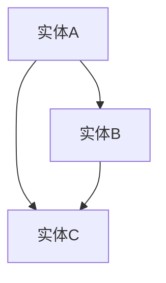
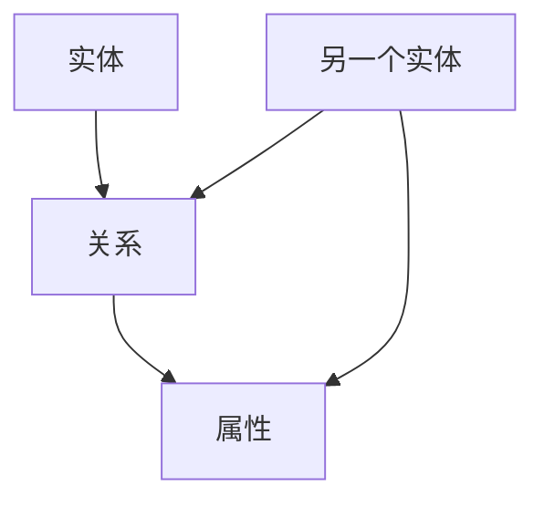
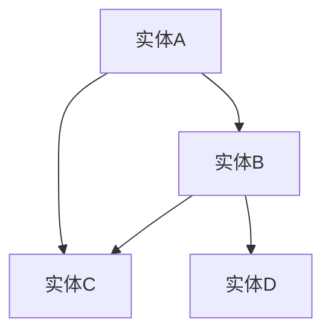

                 

### 文章标题

《科学研究的知识图谱：可视化世界可理解性》

### 关键词

- 知识图谱
- 可视化
- 可理解性
- 科学研究
- 数据分析

### 摘要

本文旨在探讨知识图谱在科学研究中的重要作用，特别是在提高世界可理解性方面的应用。通过对知识图谱的概念、结构、可视化方法以及其在各个领域中的应用案例进行详细分析，本文旨在展示如何利用知识图谱技术提高数据处理的效率和研究结果的准确性。本文还探讨了知识图谱在科学研究中的挑战与未来发展趋势，为相关领域的研究者和从业者提供有价值的参考。

## 引言

### 1.1 知识图谱的概念

知识图谱（Knowledge Graph）是一种用于表示实体、概念及其相互关系的语义网络。它起源于传统的数据库和知识库，但在语义表达和信息检索方面有着显著的提升。知识图谱的基本元素包括实体、属性和关系，通过这些元素，知识图谱能够将现实世界中的信息进行结构化、关联化和智能化处理。

### 1.2 知识图谱的发展历程

知识图谱的发展历程可以分为三个阶段：早期的基于规则的语义网络、基于本体论的知识图谱和基于大数据的知识图谱。早期的语义网络主要依靠人工定义的规则来表示知识，而现代知识图谱则通过大数据技术和自然语言处理技术来自动构建。

### 1.3 知识图谱的应用领域

知识图谱在多个领域都展现出强大的应用潜力，包括但不限于：

- **搜索引擎**：如Google的Knowledge Graph，能够提供更加准确和丰富的搜索结果。
- **智能问答系统**：如IBM的Watson，能够理解和回答复杂的自然语言问题。
- **推荐系统**：如Netflix和Amazon，能够根据用户的历史行为提供个性化的推荐。
- **生物信息学**：如基因组学研究，通过知识图谱来表示基因、蛋白质及其相互作用。
- **社会科学**：如社会网络分析，通过知识图谱来揭示社会关系和群体结构。

### 1.4 知识图谱的重要性

知识图谱的重要性体现在以下几个方面：

- **提高数据可理解性**：通过将复杂的数据结构转化为直观的知识图谱，使得研究人员能够更容易地理解和分析数据。
- **增强知识发现能力**：知识图谱能够揭示数据之间的隐藏关系，帮助研究人员发现新的知识和洞见。
- **支持智能决策**：知识图谱可以作为智能系统的底层知识库，支持自动化的决策和推理过程。

## 核心概念与联系

### 2.1 知识图谱的基本元素

知识图谱由三个基本元素组成：实体（Entity）、关系（Relation）和属性（Attribute）。

- **实体**：代表现实世界中的对象，如人、地点、物品等。
- **关系**：表示实体之间的联系，如“属于”、“位于”等。
- **属性**：描述实体的特征，如人的年龄、地点的纬度等。

### 2.2 知识图谱的关系表示

知识图谱中的关系可以通过Mermaid流程图来表示，例如：



在这个示例中，实体A与实体B和实体C之间存在关系，而实体B和实体C之间也存在关系。

### 2.3 知识图谱的核心概念联系

知识图谱的核心概念之间存在着紧密的联系，它们共同构成了知识图谱的语义网络。这种联系可以通过Mermaid流程图来可视化，例如：



在这个示例中，实体A和实体D都与关系B和属性C相连，展示了知识图谱中元素之间的复杂关系。

## 知识表示与建模

### 3.1 知识表示方法

知识表示是知识图谱构建中的关键环节，常用的知识表示方法包括：

- **RDF（Resource Description Framework）**：基于图形模型，使用三元组（主体、关系、客体）来表示知识。
- **OWL（Web Ontology Language）**：用于定义本体和知识的语言，能够表达复杂的语义关系。
- **N3（Notation 3）**：是一种基于文本的RDF表示方法，更加简洁和易于阅读。

### 3.2 知识建模技术

知识建模是将现实世界中的知识抽象和表示为计算机可理解的形式。常见的知识建模技术包括：

- **基于规则的方法**：使用预先定义的规则来表示知识，例如逻辑规则和模糊规则。
- **基于本体论的方法**：通过定义本体来构建知识图谱，本体是知识领域内概念的层次结构。
- **基于数据的方法**：直接从数据中提取知识，例如数据挖掘和机器学习。

### 3.3 核心算法原理讲解

知识图谱的核心算法包括：

- **图论算法**：用于图的遍历、聚类和路径搜索等。
- **机器学习算法**：用于知识图谱的自动构建和推理。
- **自然语言处理算法**：用于从文本中提取和构建知识图谱。

以下是一个简单的知识图谱构建算法的伪代码示例：

```python
# 伪代码：知识图谱构建算法
def build_knowledge_graph(data):
    entities = extract_entities(data)
    relations = extract_relations(data)
    attributes = extract_attributes(data)
    
    knowledge_graph = Graph()
    for entity in entities:
        knowledge_graph.add_node(entity)
    for relation in relations:
        knowledge_graph.add_edge(relation.subject, relation.object)
    for attribute in attributes:
        knowledge_graph.add_edge(attribute.entity, attribute.value)
    
    return knowledge_graph
```

在这个伪代码中，我们从数据中提取实体、关系和属性，然后构建一个图结构来表示知识图谱。

## 可视化技术

### 4.1 可视化方法

知识图谱的可视化方法主要包括以下几种：

- **节点链接图**：通过节点和链接来表示实体和关系，是最常见的可视化方法。
- **关系网络图**：通过节点和关系之间的层次结构来展示知识图谱，适用于复杂的关系网络。
- **属性云图**：通过文字大小和颜色来表示属性的重要性，适用于展示大量属性的分布。

### 4.2 可视化工具

常用的知识图谱可视化工具有：

- **GraphViz**：用于创建节点链接图和关系网络图。
- **D3.js**：用于在Web上创建交互式的可视化图表。
- **Gephi**：用于大规模社交网络的可视化分析。

### 4.3 可视化案例

以下是一个简单的知识图谱可视化案例：



在这个案例中，我们使用Mermaid语法创建了一个简单的知识图谱，并使用GraphViz工具进行可视化。

## 应用案例

### 5.1 生物学领域的应用

在生物学领域，知识图谱被广泛用于基因组学、蛋白质组学和生态学等研究。以下是一些具体的案例：

- **基因组学**：通过知识图谱来表示基因、转录因子和疾病之间的关系，帮助研究人员揭示基因的功能和疾病机制。
- **蛋白质组学**：通过知识图谱来表示蛋白质、相互作用和生物途径，帮助研究人员理解和预测蛋白质的功能。
- **生态学**：通过知识图谱来表示物种、环境和生态过程，帮助研究人员揭示生态系统的结构和动态。

### 5.2 社会科学领域的应用

在社会科学领域，知识图谱被用于社会网络分析、政治选举分析和经济预测等。

- **社会网络分析**：通过知识图谱来表示社交网络中的节点和关系，帮助研究人员分析社交影响力、传播路径和群体结构。
- **政治选举分析**：通过知识图谱来表示选民、候选人和社会事件之间的关系，帮助研究人员预测选举结果。
- **经济预测**：通过知识图谱来表示经济指标、市场和政策之间的关系，帮助研究人员预测经济趋势。

### 5.3 人工智能领域的应用

在人工智能领域，知识图谱被用于智能搜索、问答系统和语音识别等。

- **智能搜索**：通过知识图谱来扩展搜索引擎的结果，提供更加准确和丰富的搜索结果。
- **问答系统**：通过知识图谱来理解用户的提问，并提供准确的答案。
- **语音识别**：通过知识图谱来提高语音识别的准确性，特别是对于复杂的语言结构和上下文理解。

## 挑战与展望

### 6.1 知识图谱在科学研究中的挑战

知识图谱在科学研究中的应用面临着一些挑战，包括：

- **数据质量与完整性**：知识图谱的质量取决于数据的质量和完整性，如何保证数据的一致性和准确性是一个关键问题。
- **知识表示的多样性**：现实世界中的知识是多样和复杂的，如何有效地表示和整合不同来源的知识是一个挑战。
- **可视化理解的复杂性**：知识图谱的可视化需要平衡细节和可读性，如何设计出易于理解和交互的可视化界面是一个挑战。

### 6.2 未来发展趋势

未来，知识图谱在科学研究中的应用有望实现以下发展趋势：

- **多模态知识图谱**：融合不同类型的数据，如文本、图像和音频，构建更加全面和多样化的知识图谱。
- **自适应可视化**：根据用户的需求和交互，动态调整可视化界面，提供个性化的可视化体验。
- **人工智能与知识图谱的融合**：利用人工智能技术来提升知识图谱的构建、推理和可视化能力，实现更加智能化的科学研究。

## 附录

### 附录A：知识图谱工具与资源

- **知识图谱编辑工具**：包括Neo4j、ArangoDB和Amazon Neptune等。
- **知识图谱可视化工具**：包括Gephi、D3.js和GraphViz等。
- **知识图谱相关库与框架**：包括OpenKG、RDFTripleStore和OWLIM等。
- **知识图谱研究资源**：包括知识图谱论文、研讨会和在线课程等。

### 附录B：拓展阅读

- **《知识图谱：原理、方法与应用》**：详细介绍了知识图谱的基本概念和应用。
- **《知识图谱技术综述》**：对知识图谱的当前研究和应用进行了全面综述。
- **《知识图谱与智能搜索》**：探讨了知识图谱在智能搜索中的应用。

## 作者信息

作者：AI天才研究院/AI Genius Institute & 禅与计算机程序设计艺术 /Zen And The Art of Computer Programming

本文介绍了知识图谱在科学研究中的重要性和应用，通过详细的分析和案例展示了知识图谱如何提高数据处理的效率和研究结果的准确性。文章还探讨了知识图谱面临的挑战和未来发展趋势，为相关领域的研究者和从业者提供了有价值的参考。希望读者能够从中获得对知识图谱的更深入理解和启示。如果您有任何问题或建议，欢迎在评论区留言交流。

