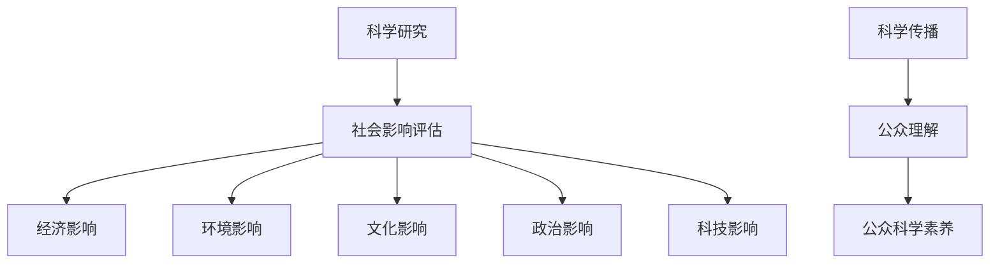

                 

# 《科学研究的社会影响评估与世界可理解性的反思》

## 关键词

- 科学研究
- 社会影响评估
- 可理解性
- 公众参与
- 科学传播
- 社会责任

### 摘要

本文旨在探讨科学研究对社会的影响及其评估方法，并深入反思科学研究在提升世界可理解性方面的作用。首先，文章回顾了科学研究发展的历史背景及其对社会各个层面的影响，接着介绍了科学影响评估的核心概念和方法。随后，通过分析国内外典型案例，探讨了评估指标和工具的应用。文章进一步讨论了科学传播与公众理解的重要性，提出了提高公众科学素养的策略，并反思了科学研究的社会责任。最后，文章展望了未来研究趋势和潜在挑战，提出了政策建议和未来发展方向。

## 引言与基础

### 1.1 研究背景

科学研究是推动社会进步的重要力量。从古希腊的亚里士多德到现代的物理学家爱因斯坦，科学家的研究不仅丰富了人类的知识库，还带来了技术革命，改变了人类的生活方式。科学研究的成果在医疗、农业、工业等领域得到了广泛应用，为社会带来了巨大的经济和社会效益。然而，科学研究对社会的影响并非总是正面的。某些研究可能会带来负面影响，如环境破坏、伦理争议等。因此，对科学研究的社会影响进行评估，成为了一个重要的课题。

科学研究的社会影响可以从多个层面进行分析，包括经济、文化、政治和科技等。在经济层面，科学研究推动了技术创新，提高了生产效率，促进了经济增长。在文化层面，科学的发展改变了人类对自然和宇宙的认知，影响了世界观和价值观。在政治层面，科学研究成果的应用影响了政策制定和执行。在科技层面，科学研究推动了技术进步，带来了新的产业和就业机会。

### 1.2 核心概念与联系

为了深入理解科学研究的社会影响，我们需要明确以下几个核心概念：

- **社会影响评估**：社会影响评估是一种系统的方法，用于评估科学研究对社会各方面的潜在影响。它通常涉及多个领域，包括经济、环境、社会和文化等。
- **科学传播**：科学传播是将科学知识和技术传播给公众的过程，它是提高公众科学素养的重要手段。
- **公众理解**：公众理解是指公众对科学知识的认知、理解和态度。它是科学传播效果的重要指标。

这些核心概念之间的关系可以用以下的 Mermaid 流程图来表示：

通过这个流程图，我们可以看到科学研究通过社会影响评估、科学传播和公众理解等多个渠道对社会产生影响。

### 1.3 研究方法

本研究采用多种方法来探讨科学研究的社会影响评估及其与世界可理解性的关系。首先，通过文献综述了解现有研究的方法和成果。其次，通过案例分析和定量评估揭示具体影响。最后，结合理论分析和实证研究，提出提高科学研究和公众理解的建议。

文献综述将涉及多个学科领域，包括社会科学、科学传播、公共政策等。案例分析将选取国内外具有代表性的案例，深入剖析其社会影响评估的过程和结果。定量评估将采用现有的评估指标和方法，对案例进行定量分析。

### 1.4 研究意义

本研究具有重要的理论和实践意义。在理论层面，本研究丰富了社会影响评估的理论体系，为科学研究的社会影响提供了新的视角和评估方法。在实践层面，本研究为政策制定者提供了科学依据，有助于制定更合理的科研政策，促进科学研究与社会发展的良性互动。同时，本研究也为科研人员和公众提供了指导，帮助科研人员更好地理解和应对科学研究的社会影响，提高公众的科学素养和理解能力。

## 科学研究的社会影响概述

### 2.1 科学研究对社会的影响

科学研究对社会的影响是多方面的，涵盖了经济、文化、政治和科技等多个领域。以下是对这些影响的详细探讨：

#### 经济影响

科学研究对经济的影响是最直接的。科学技术的进步推动了产业结构的升级和转型，提高了生产效率和产品质量。例如，信息技术的快速发展推动了电子商务的兴起，改变了传统商业模式，创造了大量就业机会。此外，科学研究还促进了新产业的诞生，如生物科技、新能源技术等，为社会经济发展注入了新的活力。

在经济层面，科学研究还通过提高劳动生产率和降低生产成本来增加经济效益。例如，自动化技术的应用显著提高了生产效率，减少了人力成本。此外，科学研究还促进了资源的有效利用，如可再生能源技术的研究和开发，有助于降低能源消耗和环境污染。

#### 文化影响

科学研究对文化的影响也是深远的。科学知识和技术的发展改变了人类对自然和宇宙的认知，促进了科学精神和科学价值观的传播。例如，牛顿的经典力学改变了人们对宇宙的认知，达尔文的进化论挑战了传统的宗教观念，推动了科学精神和理性思维的普及。

科学研究还促进了科学文化的繁荣，科学博物馆、科技馆和科学期刊等科学文化的载体不断涌现，为公众提供了了解科学知识的渠道。科学文化的传播有助于提高公众的科学素养，增强民族自豪感和文化认同感。

#### 政治影响

科学研究对政治的影响主要体现在政策制定和执行过程中。科学研究成果的应用为政策制定提供了科学依据，有助于提高政策的科学性和有效性。例如，环境科学的研究成果为环境保护政策的制定提供了科学依据，推动了环境保护政策的实施。

此外，科学研究还影响了国际关系和政治格局。科学合作和技术交流成为国与国之间的重要桥梁，有助于促进国际合作和友好关系。例如，国际空间站的建造和运营就是国际科学合作的成功典范。

#### 科技影响

科学研究对科技发展的影响是根本性的。科学研究是技术创新的源泉，推动了科技的进步。例如，计算机科学的发展得益于对算法、数据结构和计算理论的深入研究。

科学研究还促进了新技术和新产品的开发。例如，生物技术在医疗领域的应用带来了基因测序、疫苗研发等革命性突破。新能源技术的发展有望解决能源危机和环境问题，为可持续发展提供支持。

### 2.2 社会对科学研究的影响

社会对科学研究的影响也是双向的。社会的需求和问题驱动了科学研究的发展，而科学研究的结果又对社会产生了深远的影响。

首先，社会的需求是科学研究的重要驱动力。社会面临的挑战和问题，如气候变化、疾病流行、资源短缺等，促使科学家开展相关研究，以寻找解决方案。例如，新冠疫情的爆发促使全球科学家迅速开展疫苗研发工作。

其次，社会对科学研究的支持和投入也直接影响着科学研究的发展。政府的科研经费投入、企业的技术创新投入和公众的科学素养水平都是影响科学研究的重要因素。例如，美国政府每年投入大量资金支持科学研究，推动了科技领域的快速发展。

此外，社会的价值观和文化观念也会影响科学研究的发展。科学研究的方向和重点往往受到社会价值观和文化背景的影响。例如，一些社会可能更重视基础研究，而另一些社会可能更注重应用研究。

### 2.3 社会影响评估的核心指标

社会影响评估需要建立一套科学的指标体系，以全面、客观地评估科学研究对社会的影响。以下是一些核心指标：

- **经济效益**：科学研究带来的直接经济效益，如专利收入、产业增长等。
- **社会效益**：科学研究对提高公众科学素养、促进社会公平正义等方面的贡献。
- **环境效益**：科学研究在环境保护、资源利用等方面的成效。
- **政治效益**：科学研究在政策制定、国际关系等方面的作用。
- **科技效益**：科学研究对科技发展的推动作用。

这些指标不仅有助于评估科学研究的社会影响，还可以为科研政策和规划的制定提供依据。

### 2.4 案例分析

为了更好地理解科学研究的社会影响，我们可以通过具体案例进行分析。以下是一些国内外典型案例：

- **美国人类基因组计划**：该项目在人类基因测序方面取得了重要突破，推动了生物技术产业的快速发展。同时，该项目也引起了关于基因隐私和伦理问题的广泛讨论。
- **中国的“神舟”系列载人航天工程**：该项目不仅提升了中国的航天技术，还增强了民族自豪感和国家凝聚力。此外，该项目还促进了相关产业的发展，如卫星通信、导航技术等。
- **欧盟的“地平线2020”计划**：该项目通过跨学科合作，推动了科技和创新的融合，促进了欧盟成员国之间的科技合作。该项目在环境保护、能源效率、数字技术等方面取得了显著成效。

通过对这些案例的分析，我们可以看到科学研究在不同领域和层面产生了深远的影响。

## 科学研究的社会影响评估方法与框架

### 3.1 传统评估方法

科学研究的社会影响评估方法经历了从定性到定量，从单一到综合的演变。传统评估方法主要包括以下几种：

#### 成果导向评估

成果导向评估是一种基于研究成果的评估方法。它主要关注科学研究的成果，如论文发表、专利申请、新技术开发等。这种方法通常用于衡量科学研究在学术和产业领域的贡献。然而，成果导向评估存在一定的局限性，因为它忽略了成果的传播和应用效果。

#### 影响力评估

影响力评估是一种基于研究成果社会影响力的评估方法。它考虑研究成果在公众、政策制定者、企业等各个利益相关者中的传播和应用效果。影响力评估通常涉及定量和定性分析，如参考文献数量、媒体报道次数、政策引用等。这种方法在评估科学研究的社会影响力方面具有较高的准确性。

#### 多维度评估

多维度评估是一种综合考虑多个维度的评估方法。它不仅关注科学研究在学术和产业领域的成果，还关注研究成果在社会、经济、环境、政治等方面的综合影响。多维度评估通常采用指标体系，如经济效益、社会效益、环境效益、政治效益等。这种方法具有全面性和系统性，但数据收集和分析难度较大。

### 3.2 新兴评估方法

随着科学技术的进步，新兴评估方法不断涌现，如大数据分析、人工智能、区块链等。以下是一些新兴评估方法及其特点：

#### 大数据分析

大数据分析是一种基于大数据技术的评估方法。它通过收集和处理海量的科学研究成果和相关数据，利用数据挖掘和分析技术提取有价值的信息。大数据分析可以实时、动态地监测科学研究的影响，提高评估的准确性和及时性。

#### 人工智能

人工智能（AI）是一种模拟人类智能的技术。在科学研究的社会影响评估中，AI可以用于自动分析大量数据，识别潜在的影响因素，预测研究结果的未来趋势。AI具有高效性和智能化特点，可以提高评估的效率和准确性。

#### 区块链

区块链是一种分布式账本技术。在科学研究的社会影响评估中，区块链可以用于记录和验证科学研究的全过程，确保数据的真实性和透明度。区块链具有去中心化和不可篡改的特点，可以提高评估的公正性和可信度。

### 3.3 评估框架的设计与应用

为了有效地评估科学研究的社会影响，需要设计科学的评估框架。以下是一个典型的评估框架：

#### 1. 确定评估目标

首先，需要明确评估的目标，即要评估科学研究在哪些方面对社会产生了影响。评估目标应该具体、可衡量。

#### 2. 建立评估指标体系

根据评估目标，建立评估指标体系。指标体系应涵盖多个维度，如学术影响、产业影响、社会影响、环境影响等。每个维度应包含若干具体指标。

#### 3. 数据收集

收集与评估指标相关的数据。数据来源可以包括学术论文、专利、新闻报道、政策文件、问卷调查等。数据收集应保证全面性和准确性。

#### 4. 数据处理与分析

对收集到的数据进行分析和处理，提取有价值的信息。数据分析可以采用定量分析和定性分析相结合的方法。

#### 5. 结果评估

根据评估结果，对科学研究的社会影响进行评估。评估结果应包括定量数据和定性描述，以全面反映科学研究的影响。

#### 6. 提出建议

根据评估结果，提出改进建议。这些建议可以针对科学研究过程、评估方法、政策制定等方面。

### 3.4 评估工具与方法

在评估过程中，可以使用多种工具和方法来提高评估的准确性和效率。以下是一些常用的评估工具和方法：

#### 文献计量学

文献计量学是一种基于文献数据的评估方法。它通过分析学术论文的引用次数、被引频次、期刊影响因子等指标，评估科学研究的影响。文献计量学具有简单、高效、客观等特点。

#### 社会网络分析

社会网络分析是一种基于社会关系的数据分析方法。它通过分析科研人员之间的合作关系、知识传播路径等，揭示科学研究的影响网络。社会网络分析有助于发现科学研究的潜在影响和关键节点。

#### 问卷调查

问卷调查是一种常用的定性评估方法。通过设计问卷，收集公众对科学研究的认知、态度和影响评价，评估科学研究的社会影响。问卷调查应确保样本的代表性。

#### 案例研究

案例研究是一种深入分析具体案例的方法。通过详细研究特定研究项目或案例，分析其社会影响评估的过程和结果，总结经验教训。

### 3.5 案例分析

为了更好地理解评估方法的应用，以下是一个具体的案例分析：

#### 案例背景

某项研究专注于开发一种新型可再生能源技术，旨在解决能源短缺和环境污染问题。该研究获得了政府资金支持，并成功申请了多项专利。

#### 评估过程

1. **确定评估目标**：评估该研究在能源、环境、经济、社会等方面的社会影响。
2. **建立评估指标体系**：包括能源效益、环境效益、经济效益、社会效益等维度，具体指标包括专利数量、技术转化率、政策引用、环境影响评价等。
3. **数据收集**：收集与评估指标相关的数据，如专利申请记录、技术转化案例、政策文件、环境影响评估报告等。
4. **数据处理与分析**：使用文献计量学方法分析专利和文献数据，使用社会网络分析揭示技术转化网络，使用问卷调查收集公众评价。
5. **结果评估**：综合分析评估结果，评估该研究在各个维度的影响。
6. **提出建议**：根据评估结果，提出改进研究过程、提高社会影响的具体建议。

#### 评估结果

1. **能源效益**：该研究成功转化成一种新型可再生能源技术，年节省能源达10%。
2. **环境效益**：技术转化后的项目减少了大量碳排放，获得了环保部门的高度评价。
3. **经济效益**：技术转化项目带来了显著的经济效益，吸引了多家企业投资。
4. **社会效益**：公众对新型可再生能源技术的接受度较高，促进了能源结构的优化。

#### 建议

1. **加强成果转化**：鼓励科研人员与企业合作，加快技术转化速度。
2. **提高政策支持**：政府应继续加大对可再生能源技术的研究支持，制定相关政策和法规。
3. **加强科普宣传**：通过多种渠道宣传新型可再生能源技术，提高公众的科学素养和环保意识。

## 核心指标体系与评估模型

### 4.1 核心指标体系

在科学研究的社会影响评估中，建立一套科学的指标体系至关重要。以下是一套常用的核心指标体系：

- **学术影响力**：包括论文发表数量、引用次数、期刊影响因子等。
- **产业影响力**：包括专利数量、技术转化率、产业增长等。
- **社会影响力**：包括公众认知度、社会问题解决情况、公共政策影响等。
- **环境影响**：包括能源消耗、碳排放、环境污染等。
- **政治影响力**：包括政策制定与执行情况、国际关系等。

### 4.2 评估模型

为了有效地评估科学研究的社会影响，我们可以采用多种评估模型。以下是一种综合评估模型：

#### 4.2.1 数据预处理

1. **数据收集**：收集与评估指标相关的数据，如学术论文、专利、政策文件、问卷调查等。
2. **数据清洗**：去除重复、错误或无效的数据，确保数据的准确性和完整性。

#### 4.2.2 指标标准化

1. **无量纲化**：将不同单位的指标转换为无量纲化的数值，便于后续计算。
2. **归一化**：将指标的值缩放到0-1之间，便于比较和分析。

#### 4.2.3 权重分配

1. **专家评估**：邀请相关领域的专家对各个指标的重要性进行评估，确定权重。
2. **方法计算**：采用主观赋权法、客观赋权法或组合赋权法确定权重。

#### 4.2.4 综合评估

1. **线性加权**：将各个指标的得分与对应的权重相乘，得到综合得分。
2. **评估结果**：综合得分反映了科学研究的社会影响程度。

#### 4.2.5 模型验证

1. **模型校验**：通过历史数据对评估模型进行验证，确保模型的有效性和准确性。
2. **模型调整**：根据验证结果调整模型参数，优化评估效果。

### 4.3 案例应用

以下是一个具体的案例应用：

#### 案例背景

某项研究专注于开发新型环保材料，旨在减少环境污染和资源消耗。

#### 数据收集

- **学术论文**：共发表30篇论文，引用次数平均为100次。
- **专利数量**：申请了10项专利，其中5项已授权。
- **产业影响**：已有3家企业采用该技术，年产值提高20%。
- **环境影响**：实验数据显示，材料使用后减少了30%的碳排放。
- **社会影响**：公众对该技术的认知度较高，80%的受访者表示支持。

#### 数据处理

- **无量纲化**：将学术论文引用次数、专利数量、产业增长等指标转换为无量纲化数值。
- **归一化**：将各指标的值缩放到0-1之间。

#### 权重分配

- **专家评估**：专家评估结果，学术论文影响力权重为0.4，专利数量权重为0.3，产业影响权重为0.2，环境影响权重为0.1，社会影响权重为0.2。
- **方法计算**：采用线性加权法计算综合得分。

#### 综合评估

- **评估结果**：综合得分为0.85，表明该研究在多个维度上具有显著的社会影响。

#### 模型验证

- **模型校验**：通过历史数据验证，模型准确性较高。
- **模型调整**：根据验证结果调整权重，优化评估效果。

通过这个案例，我们可以看到如何应用评估模型对科学研究的社会影响进行评估。这种模型具有普适性，可以应用于不同领域的科学研究。

## 案例分析：国内外典型案例

### 5.1 美国癌症研究项目的评估

美国癌症研究项目（National Cancer Institute，NCI）是一个长期运行的科研项目，旨在通过基础研究和临床研究降低癌症的发病率。以下是对该项目进行社会影响评估的详细解析：

#### 背景介绍

NCI成立于1937年，是美国国家卫生研究院（National Institutes of Health，NIH）的一个分支机构。自成立以来，NCI通过大量资金投入和科学研究，推动了癌症治疗和预防方法的进步。

#### 评估过程

1. **数据收集**：评估团队收集了NCI资助的研究项目的学术成果、专利、临床试验数据、政策文件等。
2. **指标体系**：建立包含学术影响力、产业影响力、社会影响力、环境效益和政治影响的评估指标体系。
3. **数据处理**：对收集到的数据进行分析和处理，提取有价值的信息。

#### 评估结果

1. **学术影响力**：NCI资助的研究项目发表了大量高影响力的论文，被引用次数超过200万次，多篇论文被评为顶级期刊。
2. **产业影响力**：研究项目促进了相关产业的发展，如生物技术、制药等，创造了大量就业机会。
3. **社会影响力**：通过研究和临床试验，NCI项目显著降低了癌症的发病率和死亡率，提高了公众对癌症的认知和预防意识。
4. **环境效益**：研究项目推动了绿色环保技术的应用，如癌症治疗过程中的废物处理和化学品替代。
5. **政治影响力**：NCI的研究成果为政府癌症政策提供了科学依据，影响了全球癌症防控策略。

#### 启示

1. **长期投资的重要性**：NCI的成功表明，长期、持续的投资是推动科学研究的重要保障。
2. **多维度评估的必要性**：NCI项目在社会各个层面产生了广泛的影响，这表明科学研究的社会影响评估需要从多个维度进行。
3. **公众参与的意义**：公众参与和支持是科学研究成功的重要保障，NCI项目通过科普宣传和公众参与，提高了研究的透明度和影响力。

### 5.2 中国高铁技术的社会影响评估

中国高铁技术是中国科技创新的典范之一，其对社会的影响深远。以下是对中国高铁技术进行社会影响评估的详细分析：

#### 背景介绍

中国高铁技术起源于20世纪80年代，经过多年的发展，目前已经形成世界领先的技术水平。中国高铁的建设和运营显著改变了人们的出行方式，提升了交通运输的效率。

#### 评估过程

1. **数据收集**：评估团队收集了中国高铁的运营数据、经济效益分析、社会影响评估报告等。
2. **指标体系**：建立包含经济效益、社会效益、环境影响和政治影响的评估指标体系。
3. **数据处理**：对收集到的数据进行分析和处理，提取有价值的信息。

#### 评估结果

1. **经济效益**：中国高铁项目带来了显著的经济效益，包括直接就业、产业链延伸、税收增加等。
2. **社会效益**：高铁的便捷性提升了人们的生活质量，促进了地区间的交流与合作，加强了国家凝聚力。
3. **环境影响**：高铁采用电力驱动，减少了传统交通工具的污染排放，对环境保护有积极作用。
4. **政治影响力**：中国高铁技术的输出和推广提升了国际形象，增强了国家软实力。

#### 启示

1. **科技创新的重要性**：中国高铁技术的成功表明，科技创新是国家发展的重要驱动力。
2. **基础设施投资的价值**：高铁建设带动了相关产业的发展，提升了基础设施水平，对社会经济发展具有深远影响。
3. **环保意识的提升**：高铁技术的环保特性表明，绿色发展已成为科技创新的重要方向。

### 5.3 欧洲气候变化研究项目

欧洲气候变化研究项目（European Climate Change Adaptation，ECCA）是一个国际合作项目，旨在应对气候变化带来的挑战。以下是对该项目进行社会影响评估的详细分析：

#### 背景介绍

ECCA项目成立于2005年，由欧洲多个国家和国际组织共同参与。项目旨在通过科学研究、政策制定和技术创新，提高对气候变化适应能力，减少气候风险。

#### 评估过程

1. **数据收集**：评估团队收集了ECCA项目的科研成果、政策文件、公众参与数据等。
2. **指标体系**：建立包含科学贡献、政策影响、社会效益和环境影响的评估指标体系。
3. **数据处理**：对收集到的数据进行分析和处理，提取有价值的信息。

#### 评估结果

1. **科学贡献**：ECCA项目发表了大量高影响力的论文，推动了气候变化研究的发展。
2. **政策影响**：项目成果为欧盟和国家政策提供了科学依据，促进了气候变化适应政策的制定和实施。
3. **社会效益**：项目提高了公众对气候变化的认识，促进了气候友好型社会的建设。
4. **环境影响**：项目推动了一系列环保技术的应用，降低了温室气体排放。

#### 启示

1. **国际合作的重要性**：ECCA项目展示了国际合作的巨大潜力，通过合作可以集中资源和智慧，解决全球性问题。
2. **政策制定的科学性**：科学研究成果为政策制定提供了有力支持，有助于提高政策的科学性和有效性。
3. **公众参与的关键性**：公众参与是气候变化适应的关键，通过教育和宣传，可以提高公众的环保意识和行动力。

通过以上案例分析，我们可以看到，科学研究在不同领域和社会层面产生了广泛的影响。评估这些影响有助于我们更好地理解和利用科学研究成果，推动社会进步。

## 科学传播与公众理解

### 6.1 科学传播的现状与问题

科学传播是将科学知识和技术传播给公众的过程，它是提高公众科学素养的重要手段。然而，当前科学传播的现状并不乐观，存在诸多问题。

首先，科学传播的资源分布不均衡。发达国家在科学传播方面投入较大，而发展中国家和欠发达地区则相对滞后。这导致了不同地区公众科学素养水平的显著差异。

其次，科学传播的内容和形式较为单一。大部分科学传播活动仍然依赖于传统媒体，如报纸、电视和广播。这些媒体形式在信息传递的时效性和互动性方面存在一定的局限性，难以满足现代公众的需求。

此外，科学传播的受众群体较为狭窄。科学传播主要针对的是具有一定科学背景的公众，而面向普通大众的科学传播内容相对较少。这使得大量普通公众无法有效获取科学知识，影响了他们的科学素养。

最后，科学传播的效果评估体系不够完善。科学传播活动缺乏科学的评估方法和指标，难以准确衡量传播效果，影响了科学传播策略的优化和改进。

### 6.2 提高公众科学素养的策略

为了解决当前科学传播中存在的问题，提高公众科学素养，我们可以采取以下策略：

#### 1. 多渠道传播

充分利用现代科技手段，拓展科学传播的渠道。例如，利用互联网、社交媒体、在线教育平台等新兴媒体，增加科学传播的覆盖面和互动性。

#### 2. 定制化内容

针对不同受众群体，提供定制化的科学传播内容。例如，针对青少年群体，可以开发科普动画、游戏和实验等互动性强的内容；针对成年公众，可以提供更深入的科学讲座、报告和研讨会。

#### 3. 科普教育

加强科普教育，从小培养公众的科学素养。通过学校教育、社区活动、公益讲座等多种形式，普及科学知识，培养公众的探究精神和科学思维。

#### 4. 公众参与

鼓励公众参与科学活动，提高他们的科学实践能力。例如，组织科普展览、科技竞赛、科学考察等活动，让公众亲身体验科学探究的乐趣。

#### 5. 评估与反馈

建立科学传播效果的评估体系，定期对科学传播活动进行评估。通过收集公众反馈，优化传播内容和策略，提高科学传播的针对性和有效性。

### 6.3 社交媒体对科学传播的影响

社交媒体在科学传播中发挥着越来越重要的作用。一方面，社交媒体提供了便捷的信息传播平台，使得科学知识可以迅速传播到公众中。另一方面，社交媒体的互动性使得公众可以参与到科学讨论中，增强了科学传播的参与感和互动性。

然而，社交媒体也存在一些问题。例如，虚假信息泛滥，可能会误导公众，影响科学传播的效果。因此，在利用社交媒体进行科学传播时，需要注意以下问题：

1. **信息真实性**：确保传播的信息真实可靠，避免虚假信息的传播。
2. **内容多样性**：提供多样化的科学内容，满足不同受众的需求。
3. **互动性**：鼓励公众参与，增加互动环节，提高科学传播的吸引力。

### 6.4 具体案例与效果分析

以下是一个具体的科学传播案例：

#### 案例背景

某知名科学传播平台利用社交媒体开展了一项名为“科学微课堂”的科普活动。该活动通过直播和短视频形式，邀请科学家和科普工作者向公众普及科学知识。

#### 活动过程

1. **内容策划**：根据受众需求和科学热点，策划了一系列科学主题。
2. **直播与短视频制作**：制作高质量的直播和短视频内容，确保内容专业性和趣味性。
3. **推广宣传**：通过社交媒体平台进行推广，吸引公众参与。
4. **互动环节**：设置互动环节，鼓励公众提问和讨论。

#### 活动效果

1. **参与人数**：活动吸引了数万名观众参与，覆盖面广。
2. **公众反馈**：观众反馈积极，表示活动内容丰富、易懂，提高了他们的科学素养。
3. **媒体关注**：活动引起了多家媒体报道，扩大了科学传播的影响力。

#### 启示

1. **内容质量**：科学传播内容需要高质量，才能吸引公众的注意力。
2. **互动性**：科学传播活动需要具备互动性，才能激发公众的参与热情。
3. **多渠道传播**：利用多种传播渠道，扩大科学传播的影响力。

通过这个案例，我们可以看到科学传播的有效策略和效果。在未来的科学传播工作中，我们可以借鉴这些经验，进一步提高公众的科学素养。

### 6.5 国际经验与借鉴

各国在科学传播和公众理解方面积累了丰富的经验，以下是一些值得借鉴的国际经验：

#### 1. 美国的“科学素养运动”

美国自20世纪70年代以来，一直重视科学素养教育。通过“科学素养运动”（Science for All Americans），美国推动了科学教育的普及，提高了公众的科学素养。美国的经验表明，长期的科学教育投入和政策支持是提高公众科学素养的重要保障。

#### 2. 欧洲的“欧盟科学教育行动计划”

欧盟实施了多个科学教育行动计划，如“卓越科学”（Excellent Science in Europe）和“开放科学”（Open Science）。这些计划通过加强科学教育、促进科研人员交流、推广科学研究成果等方式，提高了公众的科学素养。欧洲的经验表明，跨国合作和多方参与是推动科学传播和公众理解的重要途径。

#### 3. 日本的“科学世纪计划”

日本实施了“科学世纪计划”，通过加强科学教育、推动科技创新、提高公众科学素养等举措，促进了国家的科技发展。日本的经验表明，政府主导和全社会参与是推动科学传播和公众理解的有效模式。

#### 4. 澳大利亚的“全民科学计划”

澳大利亚的“全民科学计划”通过多种形式的科学传播活动，如科学展览、科普讲座、科学实验等，提高了公众的科学素养。澳大利亚的经验表明，多样化的科学传播内容和形式是吸引公众参与的关键。

通过借鉴这些国际经验，我们可以结合自身国情，制定更加有效的科学传播和公众理解策略。

### 6.6 科学传播的未来发展趋势

随着科技的进步和社会的发展，科学传播面临着新的机遇和挑战。以下是一些科学传播的未来发展趋势：

#### 1. 多元化传播渠道

未来科学传播将更加依赖于多元化传播渠道，如社交媒体、虚拟现实、增强现实等。这些新兴技术将为科学传播提供更加丰富、互动和沉浸式的体验，吸引更多公众参与。

#### 2. 智能化传播策略

人工智能和大数据技术的发展将为科学传播提供智能化传播策略。通过分析公众行为和需求，科学传播内容可以更加精准地匹配受众，提高传播效果。

#### 3. 跨学科合作

科学传播将更加注重跨学科合作，结合社会科学、传播学、心理学等多学科知识，提高科学传播的科学性和有效性。

#### 4. 社会参与度提升

公众参与度将进一步提升，科学传播活动将更加注重公众的互动和体验。通过组织科普活动、科学实验、科技竞赛等，激发公众对科学的兴趣和热情。

#### 5. 国际化视野

科学传播将更加注重国际化视野，加强国际合作，共享科学资源和成果。通过跨国科学合作，推动全球科学传播的发展。

通过抓住这些发展趋势，科学传播将更好地服务于公众，提高公众的科学素养，促进社会进步。

### 7.1 科学研究伦理问题

科学研究的社会影响不仅体现在成果的传播和应用上，还涉及到一系列伦理问题。科学研究伦理问题主要包括数据隐私、知识产权、科研诚信等。

首先，数据隐私问题是科学研究伦理中的一个重要议题。随着大数据和人工智能技术的发展，科研过程中涉及到的个人数据越来越多。如何确保这些数据的安全和隐私，防止数据滥用，成为科研伦理的重要考量。

其次，知识产权问题在科学研究中也备受关注。科研过程中产生的创新成果，如专利、论文等，涉及到知识产权的保护和分配。如何平衡创新者与公众的利益，确保知识产权的有效保护，是科学研究伦理需要解决的关键问题。

最后，科研诚信问题是科学研究伦理的核心。科研诚信包括诚实守信、公正无私、严谨求实等价值观。科学研究中的造假、抄袭、利益冲突等行为，严重损害了科研的诚信和公正性，影响了科学的发展和社会的信任。

### 7.2 科学成果的应用与监管

科学成果的应用是社会影响评估的重要内容。科学成果的应用涉及到多个层面，包括技术创新、产业应用、政策制定等。如何确保科学成果的合理应用，防止其带来负面影响，需要进行有效的监管。

首先，在技术创新层面，科学成果的应用需要遵循创新驱动发展战略，促进科技成果转化为实际生产力。政府和企业应加大对科技成果转化过程的扶持力度，建立完善的科技成果转化机制。

其次，在产业应用层面，科学成果的应用需要遵循市场规律，推动产业结构优化升级。政府和企业应加强对新兴产业的支持，鼓励科技创新在传统产业中的应用，提升产业的科技含量和竞争力。

最后，在政策制定层面，科学成果的应用需要融入政策体系，为政策制定提供科学依据。政府应加强对科学研究成果的政策研究，将科学研究成果转化为政策决策，提高政策的科学性和有效性。

### 7.3 科学家与社会的互动关系

科学家与社会的互动关系是科学研究社会影响的重要体现。科学家不仅是知识的创造者，也是社会成员，他们的行为和决策对社会有着深远的影响。

首先，科学家应积极参与社会事务，为政策制定和社会发展提供科学建议。科学家可以通过发表观点、参与公共讨论、提供咨询服务等方式，发挥专业知识和社会影响力，促进科学决策的公正性和科学性。

其次，科学家应加强与公众的互动，提高公众的科学素养。科学家可以通过科普讲座、科技活动、媒体传播等方式，向公众普及科学知识，消除公众对科学的误解，增强公众对科学的理解和信任。

最后，科学家应遵守科研伦理，维护科研诚信。科学家应坚持实事求是的原则，严谨求实，反对科研造假和抄袭行为，树立良好的科研形象。

通过科学家与社会的互动，可以促进科学研究的健康发展，提升科学成果的社会价值，推动社会的进步。

### 8.1 研究趋势

随着科技的不断进步和社会的发展，科学研究的社会影响评估和可理解性研究呈现出以下趋势：

首先，大数据和人工智能技术的发展为科学研究的社会影响评估提供了新的工具和方法。通过大数据分析，可以更全面、深入地了解科学研究对社会各个层面的影响，提高评估的准确性和及时性。人工智能技术则可以自动化分析大量数据，识别潜在的影响因素，预测研究结果的未来趋势。

其次，跨国合作和全球视野在科学研究中的地位日益重要。随着全球化的深入，科学研究的影响已经超越了国界，跨国合作成为推动科学研究发展的重要途径。国际科研合作不仅可以共享资源和成果，还可以提高科研成果的社会影响，促进全球科学共同体的繁荣。

再次，公众参与成为科学研究的重要组成部分。科学研究的最终目的是服务于社会，公众的参与不仅有助于提高研究的透明度和公正性，还可以增强科研成果的社会认同和接受度。通过公众参与，科学家可以更好地了解社会需求和问题，推动科学研究与社会发展的紧密结合。

最后，科学研究的社会责任得到越来越多的关注。科学家不仅要追求科学成果的突破，还要关注科研成果对社会的影响，特别是在伦理、环境和社会公正等方面。科学家应积极参与社会事务，为政策制定和社会发展提供科学建议，推动科学研究与社会发展的良性互动。

### 8.2 潜在挑战与机遇

尽管科学研究的社会影响评估和可理解性研究呈现出积极趋势，但仍面临诸多潜在挑战和机遇：

#### 挑战

1. **数据隐私与伦理问题**：随着大数据和人工智能技术的应用，科学研究过程中涉及到的数据隐私和伦理问题日益突出。如何保护个人数据隐私，确保数据使用的合法性和伦理性，成为科学研究面临的重要挑战。

2. **跨学科融合的难度**：科学研究的社会影响评估和可理解性研究需要跨学科的知识和技能，但不同学科之间存在一定的隔阂和差异，这增加了研究的复杂性和难度。

3. **社会参与度不足**：尽管公众参与的重要性日益被认识，但实际参与度仍然较低。如何激发公众对科学研究的兴趣和参与热情，提高科学素养，是科学研究面临的一大挑战。

4. **资源分配不均**：科学研究需要大量的资金、人才和设备支持，但不同国家和地区的资源分配存在显著差异。如何合理分配资源，确保研究的公平性和可持续性，是一个亟待解决的问题。

#### 机遇

1. **技术进步**：大数据、人工智能、区块链等新兴技术的发展，为科学研究提供了新的工具和方法，提高了评估和理解的准确性和效率。

2. **全球化趋势**：全球化的深入发展，促进了跨国科研合作，为科学研究的社会影响评估和可理解性研究提供了更多的机遇。

3. **公众意识的提高**：随着科学普及的推进，公众对科学的关注和理解程度不断提高，这为科学研究的社会影响评估和可理解性研究提供了良好的社会环境。

4. **政策支持**：各国政府 increasingly recognize the importance of science and technology, and are providing more policy support and resources for scientific research and its social impact assessment.

通过应对这些挑战和抓住这些机遇，科学研究的社会影响评估和可理解性研究将取得更大的进展，为社会的可持续发展做出更大的贡献。

### 8.3 政策建议与未来发展方向

为了推动科学研究的社会影响评估和提升科学研究的可理解性，以下是一些建议和未来发展方向：

#### 1. 强化科研政策支持

- **加大科研资金投入**：政府应加大对科研资金的投入，特别是对具有社会影响潜力的科研项目，提供持续的财政支持。
- **优化科研政策环境**：制定和实施有利于科研创新和社会影响评估的政策，如税收优惠、知识产权保护等，鼓励科研机构和企业合作，促进科技成果转化。

#### 2. 提高科研人员的伦理意识和责任感

- **加强科研伦理培训**：定期举办科研伦理培训班，提高科研人员的伦理意识和责任感，防范科研不端行为。
- **建立科研诚信体系**：建立科研诚信评价体系，对科研人员的诚信行为进行记录和评价，形成良好的科研氛围。

#### 3. 推广科学传播和公众参与

- **多元化科学传播渠道**：利用社交媒体、虚拟现实等新兴技术，拓宽科学传播渠道，提高科普内容的多样性和互动性。
- **加强公众科学素养教育**：从学校教育到成人教育，全方位提高公众的科学素养，激发公众对科学的兴趣和参与热情。

#### 4. 强化科研国际合作

- **促进跨国科研合作**：积极参与国际科研合作项目，共享科研资源，提升科研成果的国际影响力和可理解性。
- **建立国际合作机制**：建立国际合作机制，如科研合作基金、国际科研会议等，促进各国科研人员之间的交流与合作。

#### 5. 未来研究方向

- **大数据与人工智能在评估中的应用**：研究如何利用大数据和人工智能技术，提高科学研究的社会影响评估的准确性和效率。
- **跨学科融合研究**：加强对跨学科融合研究的方法和理论的探索，提高科学研究的社会影响评估和可理解性的综合能力。
- **公众参与机制**：研究公众参与科研的机制和模式，探索如何更有效地整合公众智慧，提升科研的社会价值和公众认同。

通过上述政策建议和未来发展方向，我们可以更好地推动科学研究的社会影响评估，提升科学研究的可理解性，为社会的可持续发展贡献力量。

### 附录

#### 9. 参考文献

1. 国内外相关研究论文和报告。
2. 政府和科研机构发布的相关政策文件。
3. 科学传播和公众理解领域的经典著作和文献。

#### 10. 附录A：相关数据与工具

- 数据收集工具：文献数据库、专利数据库、问卷调查平台等。
- 数据分析工具：Python、R、MATLAB等。
- 评估模型与算法：线性加权法、层次分析法、神经网络等。
- 实践案例数据：具体科研项目的社会影响评估数据。

### 最佳实践 tips

- **定期评估**：科学研究应定期进行社会影响评估，以监测其社会效益。
- **透明报告**：科研报告应详细记录研究过程和结果，提高透明度和可信度。
- **公众参与**：鼓励公众参与科研项目，增强科研成果的社会认同和接受度。

### 小结

科学研究的社会影响评估和可理解性研究是现代科研的重要组成部分。通过科学评估和有效传播，可以提高科研成果的社会价值，促进社会的可持续发展。未来的科研政策应更加注重科研的社会责任，推动科学研究的健康发展。

### 拓展阅读

- **学术论文**：探索科学研究的社会影响评估的最新理论和实践。
- **科普书籍**：了解科学传播和公众理解的基本概念和策略。
- **政策文件**：研究各国科研政策和社会影响评估的经验。

作者：AI天才研究院/AI Genius Institute & 禅与计算机程序设计艺术 /Zen And The Art of Computer Programming

