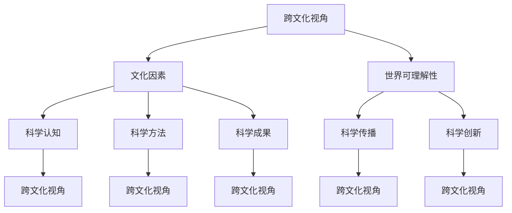

                 

### 引言与定义

#### 1.1 研究背景与意义

在当今全球化的大背景下，科学研究不再局限于单一文化环境，而是日益呈现出跨文化的特点。科学研究的跨文化视角，是指在不同文化背景下，对科学概念、方法、成果等进行理解、应用和评估的过程。这一视角的重要性在于，它不仅有助于我们深入理解科学的本质，还能促进科学知识的传播和创新。

首先，从科学普及的角度来看，不同文化对科学的认知和理解存在差异。科学知识的传播不仅仅是信息的传递，更是一种文化的交流。因此，从跨文化的视角研究科学知识传播，有助于提高科学教育的质量和效果，促进公众科学素养的提升。

其次，从科学创新的角度来看，跨文化研究能够激发科学思维的多样性。不同文化背景下的人们在科学认知、问题解决和创新方法上往往有着独特的视角，这些多样性的思维碰撞和融合，往往能带来意想不到的创新成果。

最后，从国际合作的角度来看，跨文化视角下的科学研究有助于促进国际间的科学交流与合作。在全球科技竞争日益激烈的今天，只有通过跨文化的合作，才能实现科学技术的共同进步，解决人类面临的共同挑战。

#### 1.2 核心概念与联系

在探讨科学研究的跨文化视角时，我们需要明确以下几个核心概念：

1. **跨文化视角**：指在不同文化背景下，对科学现象和问题进行观察、分析和解释的方式。
2. **文化因素**：指影响科学认知、科学方法和科学成果的各种文化特征，如价值观念、思维方式、语言习惯等。
3. **世界可理解性**：指人们在不同文化背景下，对科学现象和科学理论的可理解程度和认同度。

这些核心概念之间的关系可以用以下Mermaid流程图来展示：

#### 1.3 主要研究问题

在跨文化视角下，科学研究面临以下主要挑战和问题：

1. **文化差异对科学认知的影响**：不同文化背景下的人们对科学概念的理解和接受程度可能存在差异，如何消除这些差异，提高科学认知的一致性，是一个重要问题。
2. **跨文化科学研究的有效方法**：如何设计和实施有效的跨文化科学研究，如何处理和分析跨文化数据，是当前研究的热点和难点。
3. **文化因素对科学成果的影响**：文化差异如何影响科学成果的创新性和实用性，如何利用文化优势提升科学研究的质量和影响力。
4. **跨文化科学合作与交流**：如何促进不同文化背景下的科学家之间的合作与交流，如何建立有效的跨文化科学合作平台。

通过上述分析和探讨，我们为后续章节的内容奠定了基础，也为解决跨文化视角下科学研究的挑战提供了思路。在接下来的章节中，我们将深入探讨跨文化视角下的科学研究方法、世界可理解性的多元解读、文化差异与科学认知等方面，以期实现科学研究的全球化进步。

