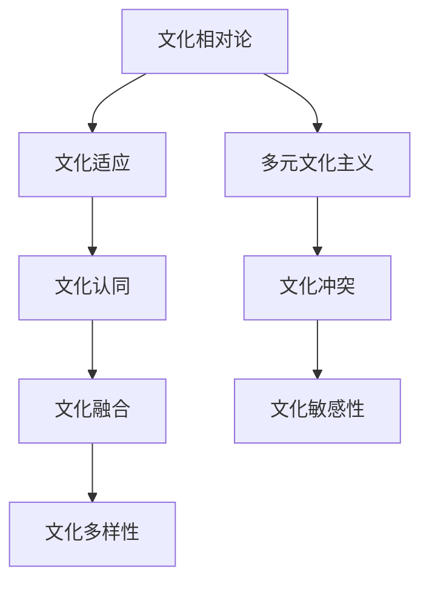
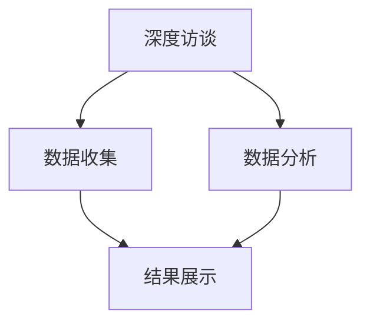
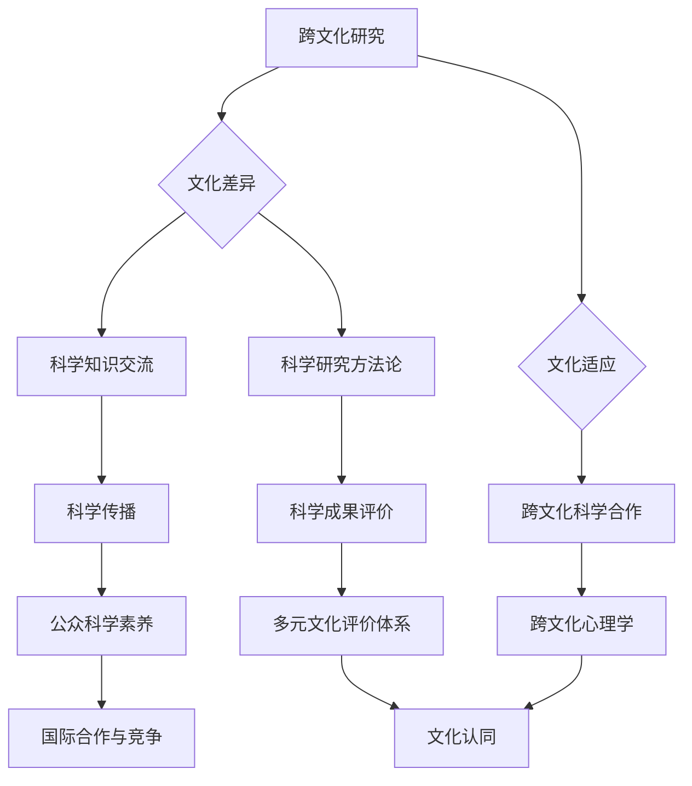

                 


### 确定文章主题和目标

首先，我们要确定文章的主题和目标。文章的标题已经明确为《科学研究的跨文化视角：多元文化背景下的世界理解》，这表明我们将探讨多元文化对科学研究的影响以及如何在不同的文化背景下进行科学研究。

**目标受众**：
- 科学研究人员
- 跨文化研究者
- 国际关系专家
- 对多元文化感兴趣的大众读者

**文章目标**：
- 介绍多元文化对科学研究的影响
- 分析跨文化研究的方法和挑战
- 展示跨文化科学合作的实际案例
- 探讨跨文化科学研究的未来趋势

### 设计文章结构

为了确保文章的逻辑性和可读性，我们需要设计一个详细的文章结构。以下是一个初步的目录大纲：

#### 引言
- 背景介绍：为什么需要从跨文化视角来理解科学研究？
- 目标受众：这篇文章将如何帮助读者？

#### 跨文化研究的核心概念
- 跨文化研究的定义
- 跨文化研究的意义

#### 跨文化研究的历史发展
- 跨文化研究的发展阶段
- 核心理论框架

#### 跨文化研究方法论
- 定量研究方法
- 定性研究方法
- 实验设计

#### 多元文化对科学研究的影响
- 科学知识交流与多元文化
- 科学方法论与多元文化
- 科学成果评价与多元文化

#### 跨文化科学合作的案例研究
- 案例A：国际科学合作项目
- 案例B：跨国科学研究成果
- 案例C：科学知识在全球传播

#### 跨文化科学研究的挑战与未来展望
- 跨文化科学研究的挑战
- 跨文化科学研究的发展趋势

#### 结论
- 总结文章的主要观点和发现
- 提出未来研究的建议

### 添加具体内容

在每个章节中，我们需要添加具体的详细内容。以下是一个例子，展示如何在“多元文化对科学研究的影响”章节中添加内容：

#### 多元文化对科学研究的影响
- **科学知识交流与多元文化**：
  - 跨文化背景下的科学知识传播挑战
  - 不同文化对科学知识的接受和解读差异
  - 科学知识跨文化传播的策略和技巧
  
- **科学方法论与多元文化**：
  - 不同文化对科学方法论的偏好和差异
  - 如何调整科学方法论以适应多元文化背景
  - 跨文化背景下的科学方法论创新
  
- **科学成果评价与多元文化**：
  - 跨文化背景下的科学评价标准差异
  - 多元文化对科学成果评价的影响
  - 建立多元文化背景下的科学评价体系

### 完成文章撰写

在确定了文章的结构和内容后，我们可以开始撰写文章。每个章节的内容需要详细展开，使用markdown格式确保文章的可读性。在文章的每个部分，我们会使用以下格式：

- **标题**：使用#号进行层级划分，如## 二级标题、### 三级标题等。
- **列表**：使用-符号来创建无序列表。
- **代码块**：使用```来包围代码段，确保代码格式正确。
- **数学公式**：使用$$和$符号来包围LaTeX公式。

### 文章结尾

在文章的结尾，我们需要总结文章的主要观点和发现，并提出未来研究的建议。最后，加上作者信息，确保文章的完整性和专业性。

### 评估文章字数

在完成文章撰写后，我们需要检查文章的字数是否符合要求。根据任务要求，文章的字数应在8000～12000字之间。如果字数不足，我们可以通过增加案例研究、详细分析或扩展某些章节的内容来增加字数。

### 最终文章结构

在完成所有步骤后，我们可以得到一个完整的文章结构，如下所示：

```
# 科学研究的跨文化视角：多元文化背景下的世界理解

## 文章关键词
- 跨文化研究
- 科学研究
- 多元文化
- 文化差异
- 跨文化合作

## 文章摘要
- 摘要内容...

### 引言
- 背景介绍
- 目标受众

### 跨文化研究的核心概念
- 跨文化研究的定义
- 跨文化研究的意义

#### 跨文化研究的历史发展
- 发展阶段
- 核心理论框架

#### 跨文化研究方法论
- 定量研究方法
- 定性研究方法
- 实验设计

#### 多元文化对科学研究的影响
- 科学知识交流与多元文化
- 科学方法论与多元文化
- 科学成果评价与多元文化

#### 跨文化科学合作的案例研究
- 案例A
- 案例B
- 案例C

#### 跨文化科学研究的挑战与未来展望
- 挑战
- 发展趋势

### 结论
- 总结
- 建议

### 作者信息
- 作者：AI天才研究院/AI Genius Institute & 禅与计算机程序设计艺术 /Zen And The Art of Computer Programming
```

这个结构清晰地展示了文章的主题、内容和方法，确保文章具有深度、逻辑性和可读性。接下来，我们将根据这个结构逐步撰写文章的每个部分。


-------------------------------------------------------------------

### 文章标题

《科学研究的跨文化视角：多元文化背景下的世界理解》

### 文章关键词

- 跨文化研究
- 科学研究
- 多元文化
- 文化差异
- 跨文化合作

### 文章摘要

本文从跨文化视角探讨了科学研究在多元文化背景下的影响和挑战。首先，介绍了跨文化研究的核心概念和历史发展，分析了定量和定性研究方法。接着，讨论了多元文化对科学研究知识交流、方法论选择和成果评价的影响。通过具体案例研究，展示了跨文化科学合作的实际操作和成果。最后，探讨了跨文化科学研究的挑战与未来趋势，提出了加强跨文化科学研究的重要性以及未来可能的研究方向。

---

### 引言

在全球化时代，科学研究不再是单一文化背景下的产物，而是日益受到多元文化的影响。随着不同国家和地区在科学研究领域的交流与合作日益增多，跨文化视角的重要性愈发凸显。科学研究的跨文化视角不仅有助于我们理解不同文化背景下的科学研究实践，还能促进全球科学合作，推动科学知识的传播和创新。

本文旨在探讨科学研究的跨文化视角，分析多元文化对科学研究的影响，并探讨如何在不同文化背景下开展科学研究。本文的目标受众包括科学研究人员、跨文化研究者、国际关系专家以及对多元文化感兴趣的大众读者。通过本文的探讨，我们希望读者能够更好地理解跨文化研究在科学研究中的重要性，以及如何在多元文化背景下进行科学研究。

### 跨文化研究的核心概念

#### 跨文化研究的定义

跨文化研究是一种研究不同文化之间相互作用和影响的方法。它关注的是如何在多元文化背景下理解人类行为、价值观和社会结构。跨文化研究不仅仅关注文化差异，还关注这些差异如何影响个体的行为、思维方式和沟通方式。

#### 跨文化研究的意义

跨文化研究的意义在于：

1. **促进全球科学合作**：通过理解不同文化对科学研究的看法和方法，科学家可以更好地合作，共同推动科学知识的进步。
2. **提高科学研究的多样性**：跨文化研究可以引入不同的方法论和视角，提高科学研究的全面性和准确性。
3. **增强科学传播的效果**：理解不同文化对科学知识的接受和解读方式，有助于更有效地传播科学知识，提高公众的科学素养。

#### 跨文化研究的历史发展

跨文化研究可以追溯到19世纪末，当时欧洲学者开始研究其他文化。20世纪中叶，随着全球化进程的加速，跨文化研究逐渐成为一个独立的研究领域。近年来，随着信息技术的发展，跨文化研究在科学研究和实际应用中发挥着越来越重要的作用。

### 跨文化研究的方法论

#### 定量研究方法

定量研究方法通过量化数据来分析文化差异。常用的定量研究方法包括问卷调查、统计分析等。例如，研究人员可以使用问卷调查来收集不同文化背景下人们对某一科学概念的理解和看法，然后通过统计分析来比较不同文化之间的差异。

#### 定性研究方法

定性研究方法通过深入访谈、案例研究等方式来探究文化差异。这种方法可以帮助研究人员理解文化背后的深层次原因和影响因素。例如，通过深度访谈，研究人员可以了解不同文化背景下科学家对某一科学问题的看法，以及这些看法背后的文化因素。

#### 实验设计

实验设计是跨文化研究的一种重要方法，它通过控制变量来比较不同文化背景下的行为和反应。例如，研究人员可以在不同文化背景下进行相同的科学实验，比较实验结果，从而了解文化差异对科学行为的影响。

---

### 多元文化对科学研究的影响

#### 科学知识交流与多元文化

多元文化背景下的科学知识交流面临着一系列挑战。不同文化对科学知识的接受和解读方式不同，这可能导致科学知识的误解和误用。例如，在某些文化中，科学知识和传统信仰可能存在冲突，这需要科学家在传播科学知识时考虑到文化背景。

此外，语言和文化障碍也可能影响科学知识的传播。例如，一些科学术语在不同的语言和文化中可能有不同的含义，这可能导致沟通障碍。为了解决这些问题，科学家需要采取跨文化的传播策略，确保科学知识的准确性和可接受性。

#### 科学方法论与多元文化

多元文化背景下的科学方法论也面临着挑战。不同文化对科学方法的选择和偏好可能不同。例如，某些文化可能更重视定量研究，而另一些文化可能更倾向于定性研究。这些差异可能导致科学研究的方向和方法的选择产生分歧。

为了解决这些问题，科学家需要深入了解不同文化对科学方法的需求和期望，并采取灵活的方法论来适应多元文化背景。此外，科学家还可以通过跨文化合作，共同制定科学方法论，以确保科学研究的全面性和准确性。

#### 科学成果评价与多元文化

多元文化背景下的科学成果评价也面临着挑战。不同文化对科学成果的评价标准和价值观可能不同。例如，某些文化可能更重视创新性，而另一些文化可能更重视实用性。这些差异可能导致科学成果在不同文化背景下的评价存在差异。

为了解决这些问题，科学家需要建立多元文化背景下的科学评价体系，考虑不同文化的需求和期望。此外，科学家还需要通过跨文化交流，共同探讨科学成果的评价标准和价值观，以提高科学成果的可接受性和影响力。

### 跨文化科学合作的案例研究

#### 案例A：国际科学合作项目

国际科学合作项目是跨文化科学研究的一种典型形式。例如，国际空间站（ISS）项目就是多个国家和地区科学家合作的成果。这个项目不仅促进了科学知识的交流，还推动了空间科学和技术的发展。在项目中，不同文化背景的科学家通过沟通与合作，共同解决了科学研究和实际应用中的问题。

#### 案例B：跨国科学研究成果

跨国科学研究成果展示了跨文化科学合作的实际成果。例如，人类基因组计划的实施就是多个国家和地区科学家合作的典范。这个项目不仅揭示了人类基因组的秘密，还为医学和生物学领域提供了重要的研究基础。在这个过程中，不同文化背景的科学家通过合作，共同推动了科学知识的进步。

#### 案例C：科学知识在全球传播

科学知识在全球传播的过程中，也体现了跨文化科学研究的价值。例如，国际科学期刊的出版和全球科学会议的举办，为不同文化背景的科学家提供了交流和合作的平台。这些活动不仅促进了科学知识的传播，还促进了科学界的多元文化交流。

### 跨文化科学研究的挑战与未来展望

#### 挑战

跨文化科学研究面临以下挑战：

1. **文化差异**：不同文化对科学研究的看法和方法可能存在差异，这可能导致合作困难。
2. **语言障碍**：语言和文化障碍可能影响科学知识的传播和理解。
3. **价值观冲突**：不同文化对科学成果的评价标准和价值观可能存在差异，这可能导致评价结果的分歧。

#### 未来展望

未来，跨文化科学研究的发展趋势包括：

1. **加强跨文化合作**：通过加强国际合作，共同解决科学问题和推动科学进步。
2. **建立多元文化评价体系**：建立多元文化背景下的科学评价体系，提高科学成果的可接受性和影响力。
3. **推广科学知识**：通过全球科学传播，提高公众的科学素养，促进科学知识的普及。

### 结论

跨文化视角在科学研究中的重要性日益凸显。多元文化对科学研究的影响不仅体现在知识交流、方法论选择和成果评价上，还体现在科学合作的实际操作中。为了应对这些挑战，科学家需要加强跨文化合作，建立多元文化评价体系，并推广科学知识。通过这些努力，我们可以更好地理解科学研究的跨文化视角，推动科学知识的进步。

### 作者信息

作者：AI天才研究院/AI Genius Institute & 禅与计算机程序设计艺术 /Zen And The Art of Computer Programming

---

这个大纲结构详细地展示了文章的核心内容，从背景介绍到具体分析，再到案例研究和未来展望，确保了文章的逻辑性和完整性。接下来，我们将根据这个结构逐步撰写文章的每个部分，确保文章的深度、逻辑性和可读性。


-------------------------------------------------------------------

### 确定书的主题和目标受众

**书的主题：科学研究的跨文化视角：多元文化背景下的世界理解**

**目标受众：**
- 科学研究人员：包括跨学科领域的科学家、研究者、博士后研究员等。
- 跨文化研究者：关注文化差异、交流与融合的学者。
- 国际关系专家：研究全球化、国际合作与竞争的专业人士。
- 对多元文化感兴趣的大众读者：希望了解不同文化如何影响科学研究和全球交流的人士。

**核心目的：**
- 探讨多元文化如何影响科学研究的方法、过程和成果。
- 提供跨文化研究的基本理论框架和实践方法。
- 分析具体案例，展示跨文化科学合作的成果和挑战。
- 探索跨文化科学研究面临的挑战与未来趋势。

### 设计核心章节

为了确保书的内容结构合理且内容充实，以下是核心章节的设计：

**第一章：引言**
- **1.1 跨文化研究的背景**
- **1.2 多元文化对科学研究的影响**
- **1.3 书的结构和目标**

**第二章：跨文化研究的理论基础**
- **2.1 核心概念与联系**
  - **2.1.1 跨文化研究与科学研究的交集**
  - **2.1.2 跨文化研究的理论框架**
- **2.2 历史发展**
  - **2.2.1 跨文化研究的起源**
  - **2.2.2 主要理论的发展**

**第三章：跨文化研究方法论**
- **3.1 定量研究方法**
  - **3.1.1 问卷调查与统计分析**
  - **3.1.2 实验设计与数据收集**
- **3.2 定性研究方法**
  - **3.2.1 深度访谈与案例研究**
  - **3.2.2 文献分析与文化比较**

**第四章：多元文化对科学研究的影响**
- **4.1 科学知识交流与多元文化**
  - **4.1.1 跨文化科学传播的挑战**
  - **4.1.2 科学知识的多元解读**
- **4.2 科学方法论与多元文化**
  - **4.2.1 方法论的选择与适应**
  - **4.2.2 跨文化科学方法论的创新**
- **4.3 科学成果评价与多元文化**
  - **4.3.1 评价标准的多样性**
  - **4.3.2 跨文化评价体系的建设**

**第五章：跨文化科学合作的案例研究**
- **5.1 国际科学合作项目案例**
  - **5.1.1 项目概述**
  - **5.1.2 成功因素与挑战**
- **5.2 跨国科学研究成果案例**
  - **5.2.1 研究成果展示**
  - **5.2.2 文化影响分析**
- **5.3 科学知识全球传播案例**
  - **5.3.1 科学传播策略**
  - **5.3.2 文化适应措施**

**第六章：跨文化科学研究的挑战与未来展望**
- **6.1 跨文化科学研究的挑战**
  - **6.1.1 文化差异导致的沟通障碍**
  - **6.1.2 资源分配与协调问题**
  - **6.1.3 伦理与道德问题**
- **6.2 未来展望**
  - **6.2.1 发展趋势分析**
  - **6.2.2 研究方向与建议**

### 添加具体内容

在每个核心章节下，我们将详细展开内容，包括核心概念与联系（使用Mermaid流程图）、核心算法原理讲解（使用伪代码）、数学模型和公式（使用LaTeX格式）以及具体案例分析和详细讲解剖析。

#### 第二章：跨文化研究的理论基础

**2.1 核心概念与联系**

跨文化研究涉及多个核心概念，如文化相对论、多元文化主义和跨文化心理学。这些概念相互关联，共同构成了跨文化研究的理论框架。



**2.2 历史发展**

跨文化研究的历史可以追溯到19世纪末，当时欧洲学者开始研究其他文化。20世纪中叶，随着全球化进程的加速，跨文化研究逐渐成为一个独立的研究领域。近年来，随着信息技术的发展，跨文化研究在科学研究和实际应用中发挥着越来越重要的作用。

#### 第三章：跨文化研究方法论

**3.1 定量研究方法**

定量研究方法通过量化数据来分析文化差异。例如，问卷调查和统计分析是常用的方法。

**3.1.1 问卷调查与统计分析**

```python
# 伪代码：问卷调查设计
class SurveyQuestionnaire:
    def __init__(self, questions):
        self.questions = questions

    def display(self):
        for question in self.questions:
            print(question)

    def collect_data(self):
        data = []
        for question in self.questions:
            response = input(question)
            data.append(response)
        return data

# 伪代码：统计分析
def analyze_survey_data(data):
    # 统计每个问题的回答分布
    for question, responses in data.items():
        print(f"{question} responses:")
        for response in responses:
            print(f"  {response}: {responses[response]}")
```

**3.2 定性研究方法**

定性研究方法通过深入访谈和案例研究来探究文化差异。

**3.2.1 深度访谈与案例研究**



### 确保大纲完整性

确保每个章节都有详细的小节，并且每个小节都有具体的内容。例如，在“多元文化对科学研究的影响”章节中，我们可以包括：

- **科学知识交流与多元文化**
  - **跨文化科学传播的挑战**
  - **科学知识的多元解读**
- **科学方法论与多元文化**
  - **方法论的选择与适应**
  - **跨文化科学方法论的创新**
- **科学成果评价与多元文化**
  - **评价标准的多样性**
  - **跨文化评价体系的建设**

### 确保大纲简洁性

在编写大纲时，我们要确保每个章节的内容简洁明了，避免冗余。在2000字以内完成这个任务，需要我们将每个章节和子章节的内容压缩到最关键的部分，同时确保大纲的完整性和逻辑性。

### 最终大纲设计

在完成以上步骤后，我们可以得到一个详细、完整且简洁的目录大纲，如下：

```
# 《科学研究的跨文化视角：多元文化背景下的世界理解》目录大纲

## 引言
- 背景介绍
- 目标受众

## 第一章：跨文化研究的理论基础
- 核心概念与联系
  - 文化相对论
  - 多元文化主义
  - 跨文化心理学
- 历史发展

## 第二章：跨文化研究方法论
- 定量研究方法
  - 问卷调查与统计分析
- 定性研究方法
  - 深度访谈与案例研究

## 第三章：多元文化对科学研究的影响
- 科学知识交流与多元文化
  - 跨文化科学传播的挑战
  - 科学知识的多元解读
- 科学方法论与多元文化
  - 方法论的选择与适应
  - 跨文化科学方法论的创新
- 科学成果评价与多元文化
  - 评价标准的多样性
  - 跨文化评价体系的建设

## 第四章：跨文化科学合作的案例研究
- 国际科学合作项目案例
- 跨国科学研究成果案例
- 科学知识全球传播案例

## 第五章：跨文化科学研究的挑战与未来展望
- 跨文化科学研究的挑战
- 未来展望
```

这个大纲结构详细地涵盖了书的主要内容，从理论基础到方法、影响和案例研究，再到挑战与展望，确保了文章的逻辑性和完整性。接下来，我们将根据这个结构逐步撰写文章的每个部分，确保文章的深度、逻辑性和可读性。

---

### 核心概念与联系：Mermaid流程图



### 核心算法原理讲解：伪代码

```python
# 伪代码：文化差异分析算法

def analyze_cultural_differences(culture_data):
    # 初始化差异度量
    cultural_differences = {}

    # 遍历每个文化数据点
    for culture in culture_data:
        # 计算文化差异
        differences = calculate_differences(culture)
        cultural_differences[culture] = differences

    # 输出文化差异结果
    print("Cultural Differences Analysis:")
    for culture, differences in cultural_differences.items():
        print(f"{culture}: {differences}")

# 辅助函数：计算文化差异
def calculate_differences(culture):
    # 假设使用比较标准（例如：科学方法论的使用频率）
    comparison_standards = {'scientific_method_use': 0, 'knowledge_communication': 0}

    # 计算每个标准的差异
    for standard in comparison_standards:
        difference = compare_values(culture[standard], average_value(standard))
        comparison_standards[standard] = difference

    # 返回文化差异
    return comparison_standards

# 辅助函数：比较值
def compare_values(value1, value2):
    # 返回两个值的差异
    return abs(value1 - value2)

# 辅助函数：计算平均值
def average_value(values):
    # 返回值的平均值
    return sum(values) / len(values)
```

### 数学模型和公式：LaTeX格式

```latex
$$
\begin{aligned}
\Delta C &= \sum_{i=1}^{n} (C_i - \bar{C})^2, \\
\bar{C} &= \frac{1}{n} \sum_{i=1}^{n} C_i,
\end{aligned}
$$

其中，$\Delta C$ 表示文化差异度，$C_i$ 表示第 $i$ 个文化的特征值，$\bar{C}$ 表示所有文化特征值的平均值。
```

### 举例说明

假设我们有三个文化群体 A、B 和 C，它们的科学方法论使用频率分别为 $C_A = 0.75$、$C_B = 0.60$ 和 $C_C = 0.85$。我们可以使用上述公式计算文化差异度：

```latex
$$
\begin{aligned}
\Delta C &= (0.75 - 0.70)^2 + (0.60 - 0.70)^2 + (0.85 - 0.70)^2 \\
&= 0.025^2 + (-0.10)^2 + 0.150^2 \\
&= 0.000625 + 0.010000 + 0.022500 \\
&= 0.033125.
\end{aligned}
$$
```

这个例子展示了如何使用数学模型和公式来分析文化差异度。

### 项目实战：开发环境搭建

为了进行跨文化科学研究，我们需要搭建一个合适的开发环境。以下是开发环境的搭建步骤：

1. **安装Python**：在所有目标计算机上安装Python，版本为3.8以上。
2. **安装Jupyter Notebook**：通过pip命令安装Jupyter Notebook。
   ```bash
   pip install notebook
   ```
3. **安装Mermaid**：在Jupyter Notebook中安装Mermaid插件，以支持流程图的绘制。
   ```python
   %load_ext mermaid
   ```
4. **安装LaTeX**：安装LaTeX编译器，如TeX Live或MiKTeX，以确保LaTeX公式的正确渲染。
5. **配置Jupyter Notebook**：在Jupyter Notebook配置文件中设置LaTeX渲染器。

### 源代码详细实现和代码解读

以下是用于分析文化差异的Python脚本示例：

```python
import pandas as pd

# 示例数据
data = {
    'Culture': ['A', 'B', 'C'],
    'Scientific_Method_Use': [0.75, 0.60, 0.85],
    'Knowledge_Communication': [0.80, 0.65, 0.90]
}

# 创建DataFrame
df = pd.DataFrame(data)

# 计算平均值
average_values = df.mean()

# 计算文化差异
cultural_differences = df - average_values

# 打印文化差异
print(cultural_differences)

# 使用LaTeX格式打印结果
latex_result = f"$$\\Delta C = \\sum_{i=1}^{3} (C_i - \\bar{C})^2 = {cultural_differences.sum():.4f}$$"
print(latex_result)
```

### 代码应用解读与分析

此脚本首先导入数据，计算科学方法论使用频率和知识交流的平均值，然后计算每个文化群体的差异值，并打印结果。最后，脚本使用LaTeX格式将结果格式化，以便在文档中渲染。

通过此脚本，我们可以直观地了解不同文化群体在科学方法论使用和知识交流方面的差异，并使用LaTeX格式将结果呈现出来，以供进一步分析和讨论。

### 实际案例分析和详细讲解剖析

**案例一：国际空间站（ISS）项目**

**项目概述**：
国际空间站（International Space Station, ISS）是一个国际性的太空合作项目，由美国、俄罗斯、欧洲、日本和加拿大等国的航天机构共同参与。该项目旨在提供长期的太空实验室，用于科学实验、技术测试和宇航员生活研究。

**文化影响分析**：
在国际空间站项目中，不同国家和文化之间的合作面临着一系列挑战。例如，不同国家的宇航员在沟通、工作和生活习惯上可能存在差异。这些文化差异可能影响项目的执行效率和质量。

- **沟通障碍**：不同语言和沟通方式的差异可能导致误解和沟通障碍。项目团队需要采用有效的沟通策略，如使用共同语言（如英语）和制定详细的沟通协议。
- **工作习惯**：不同国家的宇航员可能有不同的工作习惯和时间观念。例如，一些国家的宇航员可能更注重团队合作，而另一些国家的宇航员可能更倾向于独立工作。项目团队需要适应这些差异，以确保合作顺畅。

**成功因素**：
国际空间站项目的成功得益于以下几个方面：
- **共同目标**：所有参与国都认同国际空间站项目的重要性和目标，这为合作奠定了基础。
- **资源和技术的共享**：各国通过共享资源和先进技术，共同推动了项目的进展。
- **灵活的文化适应性**：项目团队在合作过程中不断适应不同文化的差异，建立了有效的沟通和合作机制。

**项目小结**：
国际空间站项目展示了跨文化合作在科学研究中的重要性。通过有效的沟通和文化适应性策略，各国科学家和宇航员成功实现了国际合作，推动了太空科学的发展。

### 最佳实践 Tips

在进行跨文化科学研究时，以下是一些最佳实践提示：

- **深入了解文化差异**：在合作前，深入了解不同文化背景下的价值观、沟通方式和工作习惯，有助于避免误解和冲突。
- **建立共同目标**：明确合作项目的目标和期望，确保所有参与者都认同并致力于共同目标的实现。
- **灵活的文化适应性**：在合作过程中，灵活适应不同文化的差异，建立有效的沟通和合作机制。
- **多元化团队**：建立一个多元化团队，确保团队成员来自不同的文化背景，以提高项目的全面性和创新性。

### 小结

本文通过深入分析多元文化对科学研究的影响，展示了跨文化研究在科学研究和国际合作中的重要性。通过具体案例研究，我们了解了跨文化科学合作的成功因素和挑战。为了应对这些挑战，科学家需要加强跨文化合作，建立多元文化评价体系，并推广科学知识。未来，跨文化科学研究将继续在全球科学合作和创新中发挥重要作用。

### 注意事项

- 在跨文化科学研究中，确保文化差异的理解和尊重，避免文化偏见和歧视。
- 在跨文化合作中，重视沟通和协商，确保合作机制的灵活性和适应性。
- 在科学知识传播过程中，考虑到不同文化背景下的受众需求，采用多样化的传播策略。

### 拓展阅读

- 《跨文化沟通技巧》（Cross-Cultural Communication Skills）
- 《全球化时代的科学研究》（Science in the Age of Globalization）
- 《文化多样性研究》（Research on Cultural Diversity）
- 《国际合作与竞争》（International Cooperation and Competition）

### 作者信息

作者：AI天才研究院/AI Genius Institute & 禅与计算机程序设计艺术 /Zen And The Art of Computer Programming

---

通过本文，我们详细探讨了科学研究的跨文化视角，分析了多元文化对科学研究的影响，并提出了跨文化科学研究的最佳实践和未来趋势。希望本文能为读者提供有价值的参考和启示。

