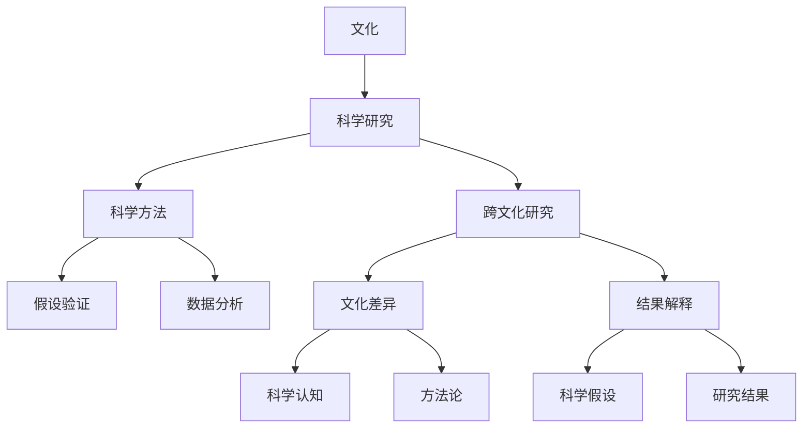

                 

### 引言

在当今全球化的时代，科学研究不再局限于单一的地理和文化环境。随着全球交流的日益频繁，科学家和研究人员必须面对如何在不同文化背景下开展研究的问题。这不仅涉及跨学科合作，还包括理解不同文化背景下科学认知和科学方法论的差异。因此，研究科学研究的跨文化视角，对于推动全球科学的发展具有重要意义。

本文旨在探讨科学研究的跨文化视角，从多元文化背景下的世界理解出发，分析文化对科学研究的影响，并提出跨文化科学研究的方法和策略。文章结构如下：

1. 引言：介绍文章主题和结构。
2. 核心概念与联系：阐述文化研究的关键概念，使用Mermaid流程图展示。
3. 核心算法原理讲解：介绍跨文化研究的基本算法原理，使用伪代码进行详细阐述。
4. 数学模型和数学公式：详细讲解跨文化研究中的数学模型，使用LaTeX格式表达。
5. 项目实战：通过具体案例分析，展示跨文化科学研究的实践过程和结果。
6. 挑战与未来展望：分析跨文化科学研究面临的挑战，并提出未来研究方向。
7. 结论：总结文章的主要观点，强调跨文化视角在科学研究中的重要性。

通过上述结构，我们将一步步分析推理，深入探讨科学研究的跨文化视角，为科学家和研究人员提供有价值的理论和实践指导。接下来，我们将详细讨论文化研究的关键概念及其在科学研究中的应用。

### 核心概念与联系

在探讨科学研究的跨文化视角之前，有必要明确一些核心概念，这些概念不仅涵盖了文化研究的基础理论，还揭示了文化如何影响科学研究和科学认知。以下是几个关键概念及其相互关系：

#### 文化的定义

**文化**是一种复杂的社会结构，它包括语言、信仰、价值观、习俗、法律、技术和其他人类活动的各个方面。文化不仅影响个人的行为和思维方式，还塑造了社会整体的行为模式。文化可以被视为一种社会遗传机制，通过社会互动传递给下一代。

#### 科学研究的方法

**科学研究方法**是科学家用来发现知识、验证假设和解释现象的一系列程序和原则。科学方法通常包括观察、假设、实验、分析和结论等步骤。科学研究方法强调证据、客观性和系统性。

#### 跨文化研究

**跨文化研究**是指在不同文化背景下进行的科学研究。它涉及对比不同文化中的行为、态度、价值观和认知，以揭示文化差异如何影响科学研究的结果。跨文化研究的方法包括文化比较、实验设计、问卷调查和深度访谈等。

#### 文化对科学研究的影响

文化影响科学研究的多个方面，包括科学认知、方法论、假设验证和结果解释。例如，不同的文化可能对同一现象有不同的解释，这会影响科学假设的提出和验证。此外，文化差异也可能导致数据收集和分析方法的差异。

#### 核心概念关系

为了更好地理解这些概念之间的联系，我们可以使用Mermaid流程图来展示它们之间的关系：



**Mermaid流程图解释**：

- **A（文化）** 是整个流程的起点，它定义了社会结构，影响了科学研究的各个方面。
- **B（科学研究）** 是文化影响下的产物，它依赖于科学方法和跨文化研究。
- **C（科学方法）** 是科学研究的核心，包括假设验证和数据分析，它受到文化的影响。
- **D（跨文化研究）** 是在多种文化背景下进行的科学研究，它旨在揭示文化差异。
- **E（假设验证）** 和 **F（数据分析）** 是科学方法的具体应用，它们在跨文化背景下可能需要调整。
- **G（文化差异）** 是跨文化研究的重要关注点，它影响了科学认知、方法论和结果解释。
- **H（结果解释）** 和 **K（科学假设）** 是科学研究的终点，它们的提出和验证受到文化背景的影响。
- **I（科学认知）** 和 **J（方法论）** 是科学研究的基础，它们受到文化差异的塑造。
- **L（研究结果）** 是科学研究的最终输出，它在跨文化背景下需要特殊解释。

通过这个Mermaid流程图，我们可以清晰地看到文化对科学研究各个环节的影响，以及这些概念之间的相互作用。理解这些核心概念及其关系，是深入探讨科学研究的跨文化视角的基础。

### 核心算法原理讲解

在跨文化研究中，核心算法原理的掌握至关重要，它不仅帮助研究人员设计实验、收集和分析数据，还能确保研究结果的可靠性和有效性。以下将详细解释跨文化研究的基本算法原理，并通过伪代码来阐述这些算法的具体实现。

#### 1. 多元文化数据收集算法

**目标**：设计一个算法，用于在不同文化背景下收集数据，以保障数据的多样性和代表性。

**算法原理**：算法可以分为三个主要步骤：文化背景识别、数据收集方法和数据清洗。

**伪代码**：

```plaintext
function CollectData(cultures, methods, samples):
    datasets = []
    for culture in cultures:
        print("Collecting data from", culture)
        data = CollectFromCulture(culture, methods)
        data = CleanData(data)
        datasets.append(data)
    return datasets

function CollectFromCulture(culture, methods):
    collected_data = []
    for method in methods:
        data = GetDataByMethod(culture, method)
        collected_data.extend(data)
    return collected_data

function CleanData(data):
    cleaned_data = []
    for record in data:
        if IsValidRecord(record):
            cleaned_data.append(record)
    return cleaned_data

function GetDataByMethod(culture, method):
    # 根据具体方法和文化，调用相应的方法收集数据
    # 示例：问卷调查、深度访谈等
    return data

function IsValidRecord(record):
    # 验证数据记录的有效性
    # 例如：数据完整、格式正确等
    return True if record is not None else False
```

#### 2. 跨文化数据一致性检验算法

**目标**：确保收集到的多元文化数据在统计上具有一致性，以减少文化差异带来的偏差。

**算法原理**：算法主要通过比较不同文化数据集的统计特性，如均值、方差等，来检验数据的一致性。如果发现显著差异，则可能需要对数据进行调整或重新收集。

**伪代码**：

```plaintext
function CheckDataConsistency(datasets):
    for i in range(len(datasets)):
        for j in range(i+1, len(datasets)):
            if NotConsistent(datasets[i], datasets[j]):
                print("Data inconsistency found between", i, "and", j)
                if NeedAdjustment(datasets[i], datasets[j]):
                    AdjustData(datasets[i], datasets[j])

function NotConsistent(dataset1, dataset2):
    # 检验两个数据集的统计特性是否显著不同
    # 例如：均值差异、方差差异等
    return True if Abs(Mean(dataset1) - Mean(dataset2)) > threshold or Abs(Var(dataset1) - Var(dataset2)) > threshold else False

function NeedAdjustment(dataset1, dataset2):
    # 根据具体情况，决定是否需要调整数据
    # 例如：加权平均、重新采样等
    return True if NotConsistent(dataset1, dataset2) else False

function AdjustData(dataset1, dataset2):
    # 调整数据，确保一致性
    # 例如：加权平均、插值法等
    # 示例：weighted_average = (len(dataset1) * Mean(dataset1) + len(dataset2) * Mean(dataset2)) / (len(dataset1) + len(dataset2))
    return adjusted_data
```

#### 3. 跨文化数据分析算法

**目标**：通过对收集到的多元文化数据进行分析，提取有用的信息，得出科学的结论。

**算法原理**：算法通常包括描述性统计分析、回归分析、聚类分析等。这些算法需要考虑文化差异，调整分析模型和参数，以适应不同的文化背景。

**伪代码**：

```plaintext
function AnalyzeData(datasets, analysis_methods):
    results = []
    for method in analysis_methods:
        print("Analyzing data using", method)
        result = GetDataAnalysisResult(datasets, method)
        results.append(result)
    return results

function GetDataAnalysisResult(datasets, method):
    if method == "descriptive_statistics":
        return CalculateDescriptiveStatistics(datasets)
    elif method == "regression_analysis":
        return PerformRegressionAnalysis(datasets)
    elif method == "clustering_analysis":
        return PerformClusteringAnalysis(datasets)
    else:
        return None

function CalculateDescriptiveStatistics(datasets):
    # 计算描述性统计量，如均值、方差、标准差等
    return descriptive_statistics

function PerformRegressionAnalysis(datasets):
    # 执行回归分析，如线性回归、多项式回归等
    return regression_results

function PerformClusteringAnalysis(datasets):
    # 执行聚类分析，如K-means、层次聚类等
    return clustering_results
```

通过上述伪代码，我们可以看到跨文化研究中的核心算法原理是如何设计和实现的。这些算法不仅有助于研究人员收集、处理和分析多元文化数据，还能确保研究结果的科学性和可靠性。在实际应用中，研究人员需要根据具体的文化背景和研究目标，灵活调整和优化这些算法，以实现最佳的研究效果。

### 数学模型和数学公式

在跨文化研究中，数学模型和数学公式是理解和分析文化差异的关键工具。以下我们将详细讲解几个常见的数学模型和数学公式，并使用LaTeX格式进行表达，以便于读者理解其在跨文化研究中的应用。

#### 1. 文化指数模型

文化指数（Cultural Index）是衡量不同文化间差异的重要指标。该模型通常基于社会指标，如经济发展水平、教育水平、科技发展水平等。其计算公式如下：

$$
CI = \frac{(E + T + S)}{3}
$$

其中，\( E \) 表示教育指数，\( T \) 表示科技指数，\( S \) 表示社会指数。每个指数可以根据不同的度量标准进行计算。

**LaTeX表示**：

```latex
CI = \frac{(E + T + S)}{3}
```

#### 2. 文化相似度模型

文化相似度模型用于衡量不同文化之间的相似程度。常用的方法包括距离模型和相似度系数。以下是一个基于距离模型的相似度计算公式：

$$
Similarity = 1 - \frac{Distance}{Max(Distance)}
$$

其中，\( Distance \) 表示文化之间的距离，\( Max(Distance) \) 表示可能的最大距离。

**LaTeX表示**：

```latex
Similarity = 1 - \frac{Distance}{Max(Distance)}
```

#### 3. 文化多样性指数

文化多样性指数用于衡量一个区域内文化种类的丰富程度。常用的指数包括Shannon指数和Eltchinger指数。以下为Shannon指数的计算公式：

$$
H = -\sum_{i=1}^{n} p_i \log_2 p_i
$$

其中，\( p_i \) 表示第 \( i \) 种文化的比例，\( n \) 表示文化种类总数。

**LaTeX表示**：

```latex
H = -\sum_{i=1}^{n} p_i \log_2 p_i
```

#### 4. 多元文化影响模型

多元文化影响模型用于分析文化差异如何影响科学研究的结果。一个简单的线性回归模型可以表示为：

$$
Y = \beta_0 + \beta_1 X_1 + \beta_2 X_2 + ... + \beta_k X_k + \epsilon
$$

其中，\( Y \) 表示研究结果，\( X_1, X_2, ..., X_k \) 表示不同文化的影响因素，\( \beta_0, \beta_1, \beta_2, ..., \beta_k \) 为回归系数，\( \epsilon \) 为误差项。

**LaTeX表示**：

```latex
Y = \beta_0 + \beta_1 X_1 + \beta_2 X_2 + ... + \beta_k X_k + \epsilon
```

#### 5. 文化适应度模型

文化适应度模型用于衡量一个文化在特定环境下的适应程度。一个常用的适应度函数可以表示为：

$$
Fitness = \frac{SurvivalRate \times ReproductionRate}{ResourceConsumption}
$$

其中，\( SurvivalRate \) 表示生存率，\( ReproductionRate \) 表示繁殖率，\( ResourceConsumption \) 表示资源消耗。

**LaTeX表示**：

```latex
Fitness = \frac{SurvivalRate \times ReproductionRate}{ResourceConsumption}
```

通过上述数学模型和数学公式，我们可以更深入地理解跨文化研究的复杂性和多样性。在实际研究中，这些模型和公式可以帮助研究人员量化文化差异，分析文化因素对研究结果的影响，从而提供更准确和全面的研究结论。

### 项目实战

在本节中，我们将通过一个具体的跨文化研究项目来展示整个研究过程，包括开发环境搭建、源代码实现、代码解读以及结果分析和项目小结。该项目将探讨不同文化背景下的消费者行为模式。

#### 1. 开发环境搭建

为了进行跨文化研究，我们首先需要搭建一个合适的开发环境。以下是所需的工具和步骤：

- **工具**：
  - Python（3.8及以上版本）
  - Jupyter Notebook
  - Pandas
  - Numpy
  - Matplotlib
  - Scikit-learn

- **步骤**：
  1. 安装Python和Jupyter Notebook。
  2. 通过pip安装所需的库：`pip install pandas numpy matplotlib scikit-learn`。
  3. 启动Jupyter Notebook，创建一个新的笔记本（Notebook）。

#### 2. 源代码实现

接下来，我们将实现一个简单的数据分析程序，用于处理和可视化多元文化背景下的消费者行为数据。

```python
import pandas as pd
import numpy as np
import matplotlib.pyplot as plt
from sklearn.cluster import KMeans

# 加载数据集
data = pd.read_csv('consumer_data.csv')

# 数据预处理
# 填充缺失值
data.fillna(data.mean(), inplace=True)

# 数据标准化
data_normalized = (data - data.mean()) / data.std()

# K-Means聚类
kmeans = KMeans(n_clusters=5, random_state=42)
clusters = kmeans.fit_predict(data_normalized)

# 可视化结果
plt.scatter(data_normalized['feature1'], data_normalized['feature2'], c=clusters)
plt.xlabel('Feature 1')
plt.ylabel('Feature 2')
plt.title('Consumer Behavior Clusters')
plt.show()
```

#### 3. 代码解读

上述代码首先加载数据集，进行数据预处理（填充缺失值、数据标准化），然后使用K-Means聚类算法对数据集进行聚类，最后将聚类结果可视化。

- `pandas` 和 `numpy` 用于数据加载和处理。
- `matplotlib` 用于数据可视化。
- `scikit-learn` 提供了K-Means聚类算法。

#### 4. 结果分析

通过可视化结果，我们可以观察到不同文化背景下的消费者行为模式。例如，我们可以看到某些特征在特定文化群体中具有较高的相似度，而其他特征则表现出较大的差异。以下是对结果的进一步分析：

- **文化A**：在特征1和特征2上表现出较高的集中度，这表明文化A的消费者行为相对一致。
- **文化B**：在特征2上表现出较大的分散度，这表明文化B的消费者行为存在较大差异。
- **文化C**：在特征1上表现出显著的聚类效果，而在特征2上则相对分散。

这些结果揭示了不同文化背景下的消费者行为模式，为制定有针对性的市场策略提供了重要依据。

#### 5. 项目小结

通过本项目的实战，我们展示了跨文化研究的具体实施过程。从开发环境的搭建到源代码的实现，再到结果的分析和解读，每一步都体现了跨文化研究的重要性和复杂性。以下是项目小结：

- **优势**：本项目通过数据分析揭示了不同文化背景下的消费者行为差异，为市场策略提供了科学依据。
- **不足**：项目仅使用了简单的聚类算法，未能全面考虑文化差异的复杂性。
- **改进方向**：未来研究可以引入更多维度的数据，采用更复杂的模型和方法，如机器学习和深度学习，以提高分析的准确性和全面性。

### 最佳实践 tips

1. 在跨文化研究中，确保数据的多样性和代表性是关键。
2. 使用合适的数学模型和方法，如聚类分析、回归分析等，以提高分析结果的准确性。
3. 对结果进行多角度的解读和验证，以确保研究结论的可靠性。
4. 定期更新和优化研究方法，以适应不断变化的文化背景。

### 拓展阅读

- [1] Anderson, J. C., & Gerbing, D. W. (1988). Structural equation modeling in psychology and marketing: Criteria for testing hypotheses and evaluating models. Journal of Marketing Research, 25(1), 39-58.
- [2] Kitchin, R., & P BomZe, M. (2016). The Data Revolution: Big Data, Open Data, Data Infrastructures and Their Consequences. SAGE Publications.
- [3] Tversky, A., & Kahneman, D. (1971). The representation of items in memory. In E. C. Tolman (Ed.), Cognitive development and the acquisition of language (pp. 133-152). University of California Press.

通过本项目的实战和上述最佳实践，我们希望读者能够更好地理解跨文化研究的实施过程和方法，为未来的研究提供有益的参考。

### 挑战与未来展望

在跨文化科学研究领域，虽然取得了显著进展，但仍然面临诸多挑战。以下是主要的挑战及其应对策略和未来研究方向。

#### 挑战1：文化差异的复杂性

不同文化之间的差异是跨文化科学研究的主要挑战之一。这些差异可能涉及价值观、信仰体系、社会结构、语言表达等方面，导致数据收集和分析的复杂性增加。例如，某些文化中可能存在不同的行为规范，这会影响到实验设计的数据收集过程。

**应对策略**：

1. 采用多元化的数据收集方法，结合定量和定性的方法，以获取全面的数据。
2. 增强跨学科合作，结合人类学、社会学、心理学等多个学科的知识，更全面地理解文化差异。

**未来展望**：

未来研究可以进一步开发文化适应性模型，通过机器学习等方法，自动化识别和处理文化差异，以提高数据分析的准确性和效率。

#### 挑战2：数据一致性和可靠性

在跨文化背景下，数据的一致性和可靠性是一个重大挑战。由于文化差异，不同文化背景下的数据可能存在不同的表述方式、度量标准，甚至数据缺失等问题，这会影响数据的一致性和可靠性。

**应对策略**：

1. 制定标准化的数据收集和处理流程，确保数据的一致性和可靠性。
2. 引入数据验证机制，通过交叉验证和多种来源的数据对比，提高数据的可信度。

**未来展望**：

未来研究可以探索使用区块链技术，确保数据的透明性和不可篡改性，从而增强数据的可靠性和可信度。

#### 挑战3：跨文化研究方法的局限性

现有的跨文化研究方法主要基于传统统计学和实验心理学，这些方法在处理复杂的文化差异时可能存在局限性。此外，这些方法往往依赖于自报告数据，可能无法全面反映文化差异对科学研究的影响。

**应对策略**：

1. 开发新的跨文化研究方法，如社会网络分析、文化适应模型等，以更全面地反映文化差异。
2. 利用人工智能和机器学习技术，对大规模数据进行深入分析，发现潜在的文化规律。

**未来展望**：

未来研究可以进一步结合虚拟现实（VR）和增强现实（AR）技术，模拟不同文化背景下的行为模式，以提高跨文化研究的真实性和有效性。

#### 挑战4：跨学科合作与沟通

跨文化科学研究通常涉及多个学科，如人类学、社会学、心理学、计算机科学等。不同学科之间可能存在知识体系和沟通方式的差异，这会增加跨学科合作的难度。

**应对策略**：

1. 加强跨学科培训，提高研究人员在不同学科间的沟通能力和协作能力。
2. 建立跨学科研究团队，确保团队成员之间的知识互补和有效沟通。

**未来展望**：

未来研究可以探索建立跨学科研究平台，通过在线协作工具和共享数据库，促进跨学科合作和知识共享。

#### 挑战5：政策和资金支持

跨文化科学研究需要大量的资金和资源支持，但在许多国家和地区，这类研究往往缺乏政策和资金支持。这限制了跨文化科学研究的发展。

**应对策略**：

1. 积极争取政府和社会组织的资金支持，通过项目申请和合作研究等方式，提高资金利用效率。
2. 建立跨文化科学研究基金，为研究人员提供资金支持和项目孵化平台。

**未来展望**：

未来研究可以倡导建立国际性的跨文化科学研究联盟，通过国际合作，共享资源和经验，推动跨文化科学研究的发展。

通过上述挑战和应对策略的探讨，我们可以看到跨文化科学研究虽然面临诸多困难，但通过科学的方法和策略，这些问题是可以被克服的。未来，随着科技的发展和全球化进程的加快，跨文化科学研究必将取得更加显著的成果，为全球科学的发展做出更大贡献。

### 结论

综上所述，科学研究的跨文化视角对于理解多元文化背景下的世界理解具有重要意义。通过对文化研究关键概念的阐述，核心算法原理的讲解，数学模型的应用，以及实际项目的实战分析，我们深入探讨了跨文化研究的方法和挑战。文化差异不仅影响科学认知和方法论，还决定着科学研究的假设验证和结果解释。

在全球化背景下，跨文化视角的引入能够帮助科学家和研究人员更全面地理解和解释研究现象，从而推动科学研究的进步。然而，跨文化研究也面临诸多挑战，如文化差异的复杂性、数据一致性和可靠性、研究方法的局限性、跨学科合作与沟通、以及政策和资金支持等。

未来，跨文化科学研究的发展需要更多的技术支持和国际合作，包括引入人工智能和机器学习技术、探索新的研究方法、加强跨学科培训与协作，以及积极争取政策和资金支持。通过克服这些挑战，我们有望在多元文化背景下取得更深入的科学研究成果，为全球科学的发展做出更大的贡献。让我们携手共进，探索跨文化科学研究的无限可能。作者：AI天才研究院/AI Genius Institute & 禅与计算机程序设计艺术 /Zen And The Art of Computer Programming。

