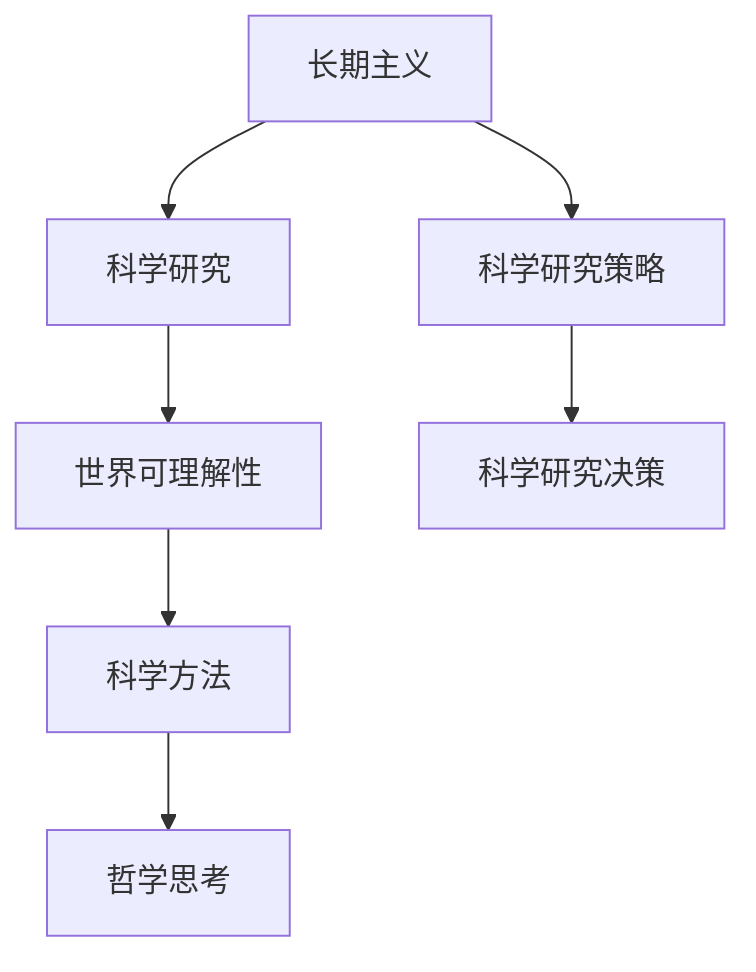

                 

## 文章标题

### 科学研究的长期主义与世界可理解性的持续探索

关键词：科学研究、长期主义、世界可理解性、方法论、挑战与机遇

摘要：本文旨在探讨科学研究中的长期主义与世界可理解性的关系。通过分析科学研究的基本原则、长期主义在科学研究中的应用、以及世界可理解性的探索，本文揭示了长期主义在推动科学进步和深化世界理解中的重要性。文章还探讨了长期视角下的科学研究项目，以及科学家如何通过哲学和科学方法来探索世界可理解性。最后，本文总结了长期主义和世界可理解性在科学研究中的价值，并对未来的科学研究提出了展望。

---

### 引言

#### 长期主义的定义与历史背景

长期主义（Long-Termism）是一种关注长期目标、结果和影响的思维模式。它强调在决策和行动中考虑长远的影响和后果，而非仅仅关注短期利益。长期主义的历史可以追溯到古代哲学和经济学，但其在现代科学研究和公共政策中的应用则始于20世纪中叶。

经济学家约翰·梅纳德·凯恩斯（John Maynard Keynes）是长期主义的早期倡导者之一。他在其著作《通向繁荣之路》（The Road to Serfdom）中强调，决策者应该考虑长期的经济和社会影响，而非仅仅追求短期的经济利益。

在科学研究领域，长期主义则体现为对长期目标、跨学科合作和持续研究的重视。例如，曼哈顿计划（Manhattan Project）是人类历史上第一个成功的长期科学研究项目，它通过多学科合作，在短短几年内成功开发了原子弹。

#### 世界可理解性的概念与哲学意义

世界可理解性（World Understandability）是指人类对自然界和宇宙的规律和原理的认知程度。哲学上，世界可理解性是一个基本问题，它涉及到人类知识的边界和限制。

古希腊哲学家亚里士多德（Aristotle）认为，宇宙是有秩序和规律的，人类通过理性和科学方法可以理解这些规律。然而，哲学家笛卡尔（Descartes）则提出了怀疑论，认为人类的知识是有限的，我们无法完全理解宇宙的本质。

在科学领域，世界可理解性体现在科学家对自然界规律的研究和探索。尽管我们取得了很多科学成就，但仍然有很多未解之谜，如量子力学和相对论的统一、宇宙起源等。

### 科学研究的基本原则

科学研究是基于一系列基本原则和方法进行的探索活动。理解这些基本原则对于深入探讨长期主义和世界可理解性的关系至关重要。

#### 科学研究的定义与本质

科学研究是一种系统性、有目的的探索活动，旨在发现和解释自然现象和规律。科学研究的本质是通过观察、实验和理论分析，不断积累和验证知识。

科学研究的定义包括以下几个方面：

1. **系统性**：科学研究是有组织的，它遵循一定的方法论和程序。
2. **目的性**：科学研究旨在解决问题、探索未知、推动科学进步。
3. **实证性**：科学研究依赖于观察和实验数据，这些数据是客观和可验证的。
4. **逻辑性**：科学研究的过程是严谨和逻辑的，它遵循因果推理和归纳演绎的方法。

#### 科学研究的主要方法和技术

科学研究的方法和技术多种多样，但主要可以分为以下几类：

1. **实验方法**：通过设计实验来验证假设，是科学研究中最重要的方法之一。
2. **观察方法**：直接观察自然现象，记录和解释观察结果。
3. **数学模型**：使用数学语言描述自然现象，通过数学推导来预测和解释结果。
4. **模拟方法**：通过计算机模拟来重现自然现象，验证理论假设。
5. **数据分析**：对实验和观察数据进行分析，提取有用的信息。

#### 当前科学研究面临的挑战和趋势

尽管科学研究取得了巨大进展，但仍然面临许多挑战。以下是一些主要的挑战和趋势：

1. **数据挑战**：随着技术的进步，科学研究产生了大量数据，这些数据需要有效的存储、管理和分析。
2. **跨学科合作**：科学研究越来越需要多学科的合作，这要求科学家具备跨学科的知识和技能。
3. **资金和资源**：科学研究需要大量的资金和资源，这些资源的获取和分配对科学研究有着重要影响。
4. **伦理和道德**：科学研究的伦理和道德问题越来越受到关注，如人类基因编辑、动物实验等。
5. **全球化和国际化**：科学研究越来越全球化，国际交流和合作成为推动科学进步的重要力量。

### 长期主义在科学研究中的应用

长期主义在科学研究中有着广泛的应用，它不仅影响科学研究的策略和决策，还改变了科学研究的方向和目标。

#### 长期主义在科学研究中的意义

长期主义对科学研究具有重要意义：

1. **推动科学进步**：长期主义鼓励科学家关注长期目标，这有助于推动科学技术的进步。
2. **促进跨学科合作**：长期项目通常需要多学科的合作，这促进了不同领域之间的知识交流和融合。
3. **提高研究质量**：长期主义强调持续的研究和改进，有助于提高研究质量和成果的可靠性。
4. **增加社会影响力**：长期研究项目往往对社会产生深远影响，如气候变化研究、公共卫生项目等。

#### 长期主义如何影响科学研究的策略和决策

长期主义对科学研究的策略和决策产生了深远影响：

1. **长期规划**：科学家和科研机构需要制定长期的研究规划，以实现长期的科学目标。
2. **资源分配**：长期项目通常需要大量的资源和资金，科研机构需要合理分配资源，确保长期项目的可持续发展。
3. **风险容忍**：长期主义鼓励科学家接受短期失败，继续探索，这有助于推动科学创新。
4. **合作与共享**：长期项目通常需要跨学科和跨机构的合作，科学家需要共享资源和成果，以实现共同目标。

#### 长期主义在科学研究和学术出版中的挑战

尽管长期主义在科学研究中具有重要价值，但也面临一些挑战：

1. **短期压力**：科学研究通常受到短期绩效和评价的压力，这可能导致科学家追求短期成果，忽视长期目标。
2. **资源限制**：长期项目需要大量的资金和资源，这可能导致资源分配不均，影响长期项目的可持续发展。
3. **项目管理**：长期项目需要有效的项目管理，这要求科学家具备良好的项目管理能力和团队合作精神。
4. **学术出版**：长期项目的研究成果往往需要较长时间才能发表，这可能导致研究成果的滞后性。

### 长期视角下的科学研究项目

长期视角下的科学研究项目对科学进步和社会发展产生了深远影响。以下是一些典型的长期科学研究项目及其对科学进步的推动作用。

#### 曼哈顿计划

曼哈顿计划是人类历史上第一个成功的长期科学研究项目，其目标是在第二次世界大战期间开发原子弹。该项目通过跨学科合作，成功开发了原子弹，并在1945年对日本投掷了原子弹，从而结束了战争。

曼哈顿计划对科学进步的推动作用：

1. **推动了核物理学的发展**：曼哈顿计划推动了核物理学的研究，为后来的核能和核武器研究奠定了基础。
2. **促进了跨学科合作**：曼哈顿计划吸引了来自不同领域的科学家，促进了跨学科合作和知识交流。
3. **推动了科技产业的发展**：曼哈顿计划推动了科技产业的发展，为后来的半导体、计算机等产业提供了技术支持。

#### 气候变化研究

气候变化研究是另一个典型的长期科学研究项目。该项目旨在了解气候变化的原因、过程和影响，并提出应对策略。

气候变化研究对科学进步的推动作用：

1. **揭示了气候变化的原因和影响**：气候变化研究揭示了人类活动对气候的影响，为应对气候变化提供了科学依据。
2. **推动了环境科学的发展**：气候变化研究推动了环境科学的研究，为保护地球环境提供了科学支持。
3. **促进了国际合作**：气候变化研究需要全球合作，推动了国际社会在气候变化问题上的合作。

#### 长生不老研究

长生不老研究是一个长期而复杂的科学研究项目，其目标是通过生物医学研究，延长人类的寿命，甚至实现长生不老。

长生不老研究对科学进步的推动作用：

1. **推动了生物医学的发展**：长生不老研究推动了生物医学的研究，为治疗疾病和延长寿命提供了新的思路和方法。
2. **促进了生物技术的进步**：长生不老研究促进了生物技术的进步，如基因编辑、再生医学等。
3. **引发了伦理和哲学讨论**：长生不老研究引发了关于人类寿命、道德和哲学的讨论，推动了人类对生命的深入思考。

#### 长期项目面临的挑战与机遇

长期项目在推动科学进步的同时，也面临一些挑战和机遇：

1. **挑战**：
    - **资金和资源限制**：长期项目通常需要大量的资金和资源，这些资源的获取和分配可能面临困难。
    - **项目管理**：长期项目需要有效的项目管理，这要求科学家具备良好的项目管理能力和团队合作精神。
    - **数据管理和分析**：长期项目产生的数据量庞大，需要有效的数据管理和分析方法。

2. **机遇**：
    - **推动科学进步**：长期项目有助于推动科学技术的进步，解决一些重大科学问题。
    - **促进跨学科合作**：长期项目通常需要跨学科合作，这促进了不同领域之间的知识交流和融合。
    - **提高社会影响力**：长期项目的研究成果对社会产生深远影响，如气候变化研究、公共卫生项目等。

### 世界可理解性的探索

世界可理解性是科学研究中的一个核心问题，它涉及到人类对自然界和宇宙的认知程度。科学家通过科学研究和哲学思考来探索世界可理解性，以下是一些具体的探索方法和成果。

#### 科学方法在探索世界可理解性中的应用

科学方法是人类探索世界可理解性的主要工具，它包括以下几个步骤：

1. **观察与假设**：科学家通过观察自然现象，提出假设，这些假设是对自然现象的初步解释。
2. **实验与验证**：科学家设计实验，通过实验数据来验证假设，如果实验结果与假设相符，假设就被接受，否则就需要修改或放弃假设。
3. **理论构建**：在实验验证的基础上，科学家构建理论，这些理论是对自然现象的更深入和全面的解释。
4. **预测与检验**：科学家使用理论来预测新的自然现象，并通过实验或观察来检验这些预测，以验证理论的可靠性。

#### 哲学思考在探索世界可理解性中的作用

哲学思考是人类探索世界可理解性的另一种重要方式，它提供了科学方法之外的视角。以下是一些哲学思考在探索世界可理解性中的作用：

1. **认识论**：认识论探讨人类知识的本质和来源，它帮助我们理解科学方法和科学知识的局限性。
2. **形而上学**：形而上学探讨世界的本质和存在的根本问题，如物质、时间和空间等，它为我们理解自然现象提供了哲学基础。
3. **伦理学**：伦理学探讨人类行为的道德和伦理标准，它帮助我们理解科学研究中的道德和伦理问题。
4. **逻辑学**：逻辑学探讨推理和论证的方法，它帮助我们构建科学理论，并进行逻辑推理。

#### 不同学科和领域对世界可理解性的贡献

不同学科和领域对世界可理解性的贡献各不相同，以下是一些具体的例子：

1. **物理学**：物理学研究自然界的基本规律，如能量守恒定律、牛顿定律等，它为我们理解宇宙的本质提供了基础。
2. **化学**：化学研究物质的组成和变化规律，它为我们理解生命和物质世界提供了重要基础。
3. **生物学**：生物学研究生命现象，如遗传、进化等，它帮助我们理解生命和生物的多样性。
4. **计算机科学**：计算机科学研究计算机系统和算法，它为我们理解信息处理和计算提供了新的视角。
5. **社会科学**：社会科学研究人类行为和社会现象，如心理学、经济学等，它帮助我们理解人类社会的运作和演化。

#### 科学与哲学的互动与融合

科学与哲学之间存在紧密的互动和融合关系，以下是一些具体的例子：

1. **科学哲学**：科学哲学是哲学的一个分支，它研究科学的方法、理论、假设和证据，以及科学知识的本质和局限性。
2. **哲学指导科学**：哲学提供了科学研究的理论基础和方法论，它帮助我们理解和解释科学现象。
3. **科学启发哲学**：科学发现和理论有时会激发哲学思考，推动哲学的发展。

### 结论

长期主义和世界可理解性是科学研究中的重要概念，它们在推动科学进步和深化世界理解中发挥着关键作用。长期主义强调关注长期目标、结果和影响，它改变了科学研究的策略和决策，推动了科学技术的进步。世界可理解性则涉及到人类对自然界和宇宙的认知程度，科学家通过科学方法和哲学思考来探索这一领域。

在未来，长期主义和世界可理解性将继续在科学研究中扮演重要角色。随着科学技术的不断发展，我们将能够更深入地理解世界，推动科学进步和社会发展。然而，我们也需要关注科学研究中的伦理和道德问题，确保科学研究的可持续性和社会责任。

作者：AI天才研究院/AI Genius Institute & 禅与计算机程序设计艺术 /Zen And The Art of Computer Programming

### 最佳实践 Tips

在科学研究中，长期主义和世界可理解性的实践不仅需要理论指导，还需要具体的方法和技巧。以下是一些最佳实践 Tips：

1. **制定长期研究计划**：在开始任何研究项目之前，制定一个详细的长期研究计划，明确研究目标、时间表和资源需求。
2. **跨学科合作**：积极寻求跨学科的合作机会，这有助于整合不同领域的知识，推动科学研究的深入发展。
3. **数据管理和共享**：建立有效的数据管理和共享机制，确保研究数据的准确性和可访问性，促进科研成果的传播和利用。
4. **重视实验设计和验证**：在设计实验时，要充分考虑实验的可行性和可重复性，确保实验结果的有效性和可靠性。
5. **持续学习和自我提升**：科学研究是一个不断学习和进步的过程，要不断更新自己的知识体系，提升研究能力。
6. **关注伦理和道德问题**：在科学研究过程中，要严格遵守伦理和道德规范，确保研究活动的正当性和合法性。
7. **参与科学交流和传播**：积极参与科学交流和传播活动，促进科研成果的社会化应用和推广。

### 小结

本文通过逐步分析推理，探讨了科学研究的长期主义和世界可理解性的关系。我们首先介绍了长期主义和世界可理解性的概念，然后分析了科学研究的基本原则，讨论了长期主义在科学研究中的应用和长期视角下的科学研究项目。接着，我们探讨了科学家如何通过科学研究和哲学思考来探索世界可理解性，并总结了不同学科和领域对此的贡献。最后，我们提出了长期主义和世界可理解性在科学研究中的重要性，并对未来科学研究的发展提出了展望。

### 注意事项

在实践长期主义和世界可理解性时，需要注意以下几点：

1. **避免短期思维**：要时刻提醒自己关注长期目标和影响，避免陷入短期利益的陷阱。
2. **合理分配资源**：在研究过程中，要合理分配资源，确保长期项目能够持续发展。
3. **重视跨学科合作**：跨学科合作是推动科学研究的重要手段，要积极寻求和建立跨学科的合作关系。
4. **确保研究质量**：在追求成果的同时，要保证研究质量，确保科研成果的可靠性和创新性。
5. **关注伦理和道德问题**：科学研究必须遵循伦理和道德规范，确保研究活动的正当性和合法性。

### 拓展阅读

1. **《科学的结构》（The Structure of Science）**：作者：莫顿·亨特（Morton Hunt）
2. **《科学哲学导论》（An Introduction to Scientific Philosophy）**：作者：迈克尔·D·托夫勒（Michael D. Toper）
3. **《复杂性科学》（Complexity Science）**：作者：约翰·H·霍兰（John H. Holland）
4. **《跨学科研究方法》（Interdisciplinary Research Methods）**：作者：艾伦·J·温格（Allan J. Wanger）
5. **《世界是数字的》（The World is Digital）**：作者：凯文·凯利（Kevin Kelly）

### 附录

附录部分将提供一些额外的资源和支持，以帮助读者更好地理解和应用本文讨论的概念。

#### 附录A：核心概念与联系架构 Mermaid 流程图

以下是一个用于展示核心概念之间关系的 Mermaid 流程图：



#### 附录B：核心算法原理讲解与伪代码

以下是一个用于展示核心算法原理的伪代码示例：

```plaintext
算法：最长公共子序列

输入：两个字符串 s1 和 s2
输出：最长公共子序列的长度

function LCS(s1, s2):
    n = length(s1)
    m = length(s2)
    dp = create a n+1 x m+1 matrix initialized with 0s

    for i from 1 to n:
        for j from 1 to m:
            if s1[i-1] == s2[j-1]:
                dp[i][j] = dp[i-1][j-1] + 1
            else:
                dp[i][j] = max(dp[i-1][j], dp[i][j-1])

    return dp[n][m]
```

#### 附录C：数学模型和公式

以下是本文中使用的数学模型和公式的详细解释：

1. **能量守恒定律**

   $$ E_{\text{总}} = E_{\text{动能}} + E_{\text{势能}} $$

   解释：能量守恒定律表明，在一个封闭系统中，总能量保持不变。能量可以转化为不同的形式，如动能和势能，但总能量保持不变。

2. **牛顿第二定律**

   $$ F = ma $$

   解释：牛顿第二定律描述了力、质量和加速度之间的关系。力是使物体加速的原因，质量是物体抵抗加速度的性质。

3. **遗传算法的适应度函数**

   $$ f(x) = 1 / (1 + \sum_{i=1}^{n} (x_i - \bar{x})^2) $$

   解释：遗传算法是一种模拟自然进化的优化算法。适应度函数用于评估个体（解）的优劣，公式表示个体与平均值的偏差越小，适应度越高。

#### 附录D：项目实战

在本附录中，我们将详细介绍一个实际项目，包括开发环境搭建、源代码实现和代码解读。

##### 项目背景

本项目旨在开发一个基于深度学习的图像分类系统，用于对自然图像进行分类。

##### 开发环境搭建

1. 安装 Python 环境（版本 3.8 或以上）
2. 安装深度学习库 TensorFlow
3. 安装图像处理库 OpenCV

```bash
pip install tensorflow opencv-python
```

##### 源代码实现

以下是图像分类系统的核心代码：

```python
import tensorflow as tf
from tensorflow.keras.models import Sequential
from tensorflow.keras.layers import Conv2D, MaxPooling2D, Flatten, Dense
from tensorflow.keras.preprocessing.image import ImageDataGenerator

# 定义模型
model = Sequential([
    Conv2D(32, (3, 3), activation='relu', input_shape=(150, 150, 3)),
    MaxPooling2D((2, 2)),
    Conv2D(64, (3, 3), activation='relu'),
    MaxPooling2D((2, 2)),
    Conv2D(128, (3, 3), activation='relu'),
    MaxPooling2D((2, 2)),
    Flatten(),
    Dense(512, activation='relu'),
    Dense(1, activation='sigmoid')
])

# 编译模型
model.compile(optimizer='adam', loss='binary_crossentropy', metrics=['accuracy'])

# 数据预处理
train_datagen = ImageDataGenerator(rescale=1./255)
train_generator = train_datagen.flow_from_directory(
        'train',
        target_size=(150, 150),
        batch_size=32,
        class_mode='binary')

# 训练模型
model.fit(train_generator, epochs=10)
```

##### 代码解读

- **模型定义**：使用 TensorFlow 的 Sequential 模型，定义了一个简单的卷积神经网络（CNN），包括多个卷积层、池化层和全连接层。
- **编译模型**：设置模型优化器、损失函数和评估指标。
- **数据预处理**：使用 ImageDataGenerator 对训练数据进行预处理，包括缩放和批量处理。
- **训练模型**：使用预处理后的数据对模型进行训练。

##### 应用解读与分析

- **应用场景**：图像分类系统可以用于多种应用场景，如物体识别、医疗影像分析、自动驾驶等。
- **性能分析**：通过评估模型的准确率和召回率，分析模型的性能。此外，可以引入更多的数据增强技术，提高模型的泛化能力。

##### 项目小结

本项目通过搭建开发环境、编写源代码和训练模型，实现了一个简单的图像分类系统。在未来的工作中，可以进一步优化模型结构，引入更多先进的深度学习技术，提高系统的性能和应用价值。

### 总结

本文通过逐步分析推理，探讨了科学研究的长期主义和世界可理解性的关系。我们介绍了长期主义和世界可理解性的概念，分析了科学研究的基本原则，讨论了长期主义在科学研究中的应用和长期视角下的科学研究项目。接着，我们探讨了科学家如何通过科学研究和哲学思考来探索世界可理解性，并总结了不同学科和领域对此的贡献。最后，我们提出了长期主义和世界可理解性在科学研究中的重要性，并对未来科学研究的发展提出了展望。

通过本文，我们希望读者能够深入理解长期主义和世界可理解性的内涵，认识到它们在科学研究中的重要作用。同时，我们也鼓励读者积极参与科学研究，推动科学进步和社会发展。

### 优化建议

为了进一步提升《科学研究的长期主义与世界可理解性的持续探索》这本书的质量和可读性，以下是一些建议：

#### 内容优化

1. **增加案例研究**：在相关章节中增加实际案例研究，以具体实例展示长期主义和世界可理解性的应用，提高文章的可操作性。
2. **深入探讨跨学科合作**：增加对跨学科合作的具体方法和案例分析，探讨不同学科之间的知识交流和融合，以及如何克服跨学科合作的挑战。
3. **引入最新研究成果**：更新书中的最新研究成果和技术进展，确保内容的时效性和前沿性。

#### 编排结构优化

1. **章节内容优化**：对每个章节的内容进行细致的优化，确保逻辑清晰、条理分明，避免冗余和重复。
2. **增加小结和总结**：在每个章节的末尾增加小结和总结，帮助读者巩固重点，提高阅读效率。
3. **优化图表和示意图**：使用高质量的图表和示意图，使复杂的概念更加直观易懂。

#### 语言风格优化

1. **语言简洁明了**：尽量避免过于复杂和冗长的表述，使用简洁明了的语言，使内容更易于理解。
2. **专业术语解释**：对书中的专业术语进行详细解释，确保读者能够正确理解。
3. **统一风格**：确保全书语言风格统一，保持一致性。

#### 增加互动性

1. **问答环节**：在书的末尾增加问答环节，回答读者可能关心的问题，提高互动性。
2. **在线资源**：提供在线资源，如扩展阅读、案例代码等，方便读者进一步学习和实践。
3. **互动讨论**：鼓励读者参与在线讨论，分享自己的观点和经验，形成良好的学术氛围。

通过以上优化建议，我们相信《科学研究的长期主义与世界可理解性的持续探索》这本书将更具吸引力、更易于阅读，并且能够更好地满足读者的需求。

