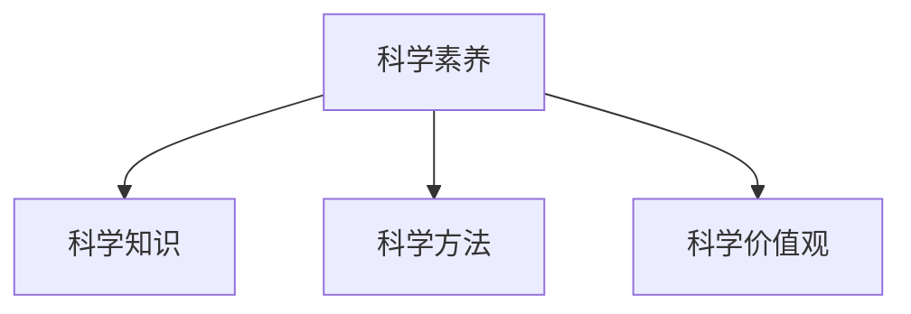
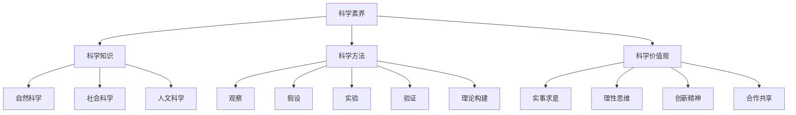
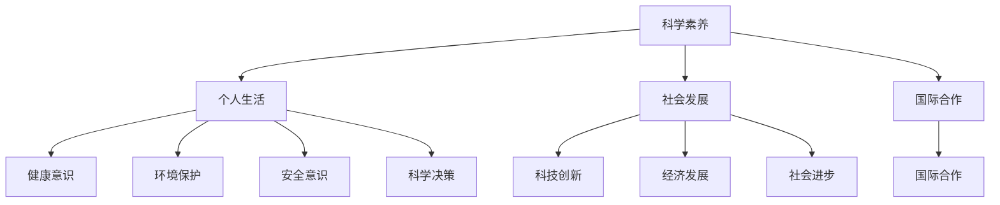
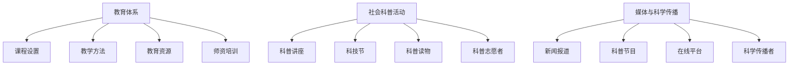

                 

### 文章标题

《科学素养对公众理解世界的重要性》

### 目 录 大纲

# 第一部分：科学素养的重要性与基础

## 1. 科学素养的定义与重要性

### 1.1 科学素养的含义

### 1.2 科学素养的重要性

## 2. 科学素养的核心要素

### 2.1 科学知识

### 2.2 科学方法

### 2.3 科学价值观

## 3. 科学素养与公众理解世界的关系

### 3.1 科学素养对个人生活的影响

### 3.2 科学素养对社会发展的推动作用

## 4. 科学素养的培养途径

### 4.1 教育体系中的科学教育

### 4.2 社会科普活动的作用

### 4.3 媒体与科学传播的影响

# 第二部分：公众科学素养的现状与挑战

## 5. 公众科学素养的现状

### 5.1 各国公众科学素养的比较

### 5.2 不同年龄段、性别和教育水平的公众科学素养差异

## 6. 科学素养的挑战

### 6.1 科普资源的不足

### 6.2 科学教育与公众需求的不匹配

### 6.3 科学谣言与伪科学的传播

## 7. 科学素养提升的策略

### 7.1 教育政策的调整

### 7.2 科普资源的优化配置

### 7.3 社会科普活动的创新

# 第三部分：提升公众科学素养的案例研究

## 8. 案例一：科学教育改革

### 8.1 改革的目标与措施

### 8.2 改革的效果与评价

## 9. 案例二：大型科普活动

### 9.1 活动的组织与实施

### 9.2 活动的影响与反响

## 10. 案例三：科学传播与媒体

### 10.1 媒体在科学传播中的作用

### 10.2 科学传播的挑战与机遇

# 附录

## 附录A：科学素养相关资源推荐

### 11.1 科学教育类资源

### 11.2 科普读物推荐

### 11.3 科学传播平台推荐

## 附录B：科学素养测评工具

### 12.1 测评工具概述

### 12.2 测评方法与步骤

### 12.3 测评结果的解读与应用

### 注意

* **核心概念与联系**：给出科学素养的核心概念原理和架构的 Mermaid 流程图
* **核心算法原理讲解**：必须使用伪代码来详细阐述
* **数学模型和数学公式 & 详细讲解 & 举例说明**：数学公式请使用latex格式，latex 代码嵌入文中独立段落使用 $$ ，段落内使用 $
* **项目实战**：代码实际案例和详细解释说明，开发环境搭建，源代码详细实现和代码解读，代码解读与分析
```markdown
```<sop>
### 摘要

科学素养是公众理解世界的重要基石。本文首先定义科学素养并阐述其重要性，接着详细解析科学素养的核心要素，包括科学知识、科学方法和科学价值观。随后，本文探讨科学素养对个人生活和社会发展的深远影响。在现状与挑战部分，本文比较了各国公众科学素养的现状，分析了不同年龄段、性别和教育水平的公众科学素养差异，并探讨了科普资源不足、科学教育与公众需求不匹配以及科学谣言与伪科学传播等挑战。最后，本文提出提升公众科学素养的策略，包括教育政策调整、科普资源优化配置和社会科普活动的创新。通过案例研究，本文展示了科学教育改革、大型科普活动和科学传播与媒体的实践与成效，为提升公众科学素养提供了实际参考。

## 1. 科学素养的定义与重要性

### 1.1 科学素养的含义

科学素养（Scientific Literacy）是指公众在科学知识、科学方法和科学价值观等方面的认知水平和应用能力。具体来说，科学素养包括以下几个核心概念：

1. **科学知识**：指在自然科学、社会科学和人文科学等领域的基本概念、原理和发现。这些知识是公众理解世界的基础，有助于人们做出科学决策。
2. **科学方法**：包括观察、假设、实验、验证和理论构建等步骤。科学方法是一种严谨的思维方式，能够帮助人们解决问题和获取新知识。
3. **科学价值观**：强调实事求是、理性思维、创新精神和合作共享。科学价值观是科学精神的体现，对个人和社会的发展具有重要导向作用。

Mermaid 流程图如下所示：



### 1.2 科学素养的重要性

科学素养对个人生活、社会发展和国家竞争力具有深远影响。以下是科学素养重要性的几个方面：

1. **提高个人生活质量**：科学素养有助于公众更好地理解健康、安全和环境问题，做出更明智的决策，提高生活质量。
2. **推动社会发展**：科学素养是现代社会进步的基石，能够促进科技创新、经济发展和社会进步。
3. **增强国家竞争力**：一个具有高科学素养的公众群体，有助于国家在科技领域取得领先地位，提升国家综合竞争力。

伪代码：

```python
def scientific_literacy_importance():
    # 提高个人生活质量
    improve_quality_of_life()

    # 推动社会发展
    promote_social_progress()

    # 增强国家竞争力
    enhance_national_competitiveness()
```

### 1.3 科学素养的定义与重要性

科学素养（Scientific Literacy）是一个广泛的概念，涵盖了公众在科学知识、科学方法和科学价值观等方面的认知水平和应用能力。科学素养不仅包括对科学知识的理解和应用，还包括对科学探究过程和科学思维的掌握。

科学知识是科学素养的基础，包括自然科学、社会科学和人文科学等领域的基本概念、原理和发现。科学方法则是科学素养的核心要素，它包括了观察、假设、实验、验证和理论构建等步骤。科学方法是一种严谨的思维方式，它能够帮助人们解决问题、获取新知识和验证已有知识。

科学价值观是科学素养的重要组成部分，它强调实事求是、理性思维、创新精神和合作共享。科学价值观不仅影响个人的科学行为，也对整个社会的发展产生深远影响。

科学素养的重要性体现在以下几个方面：

1. **提高个人生活质量**：具备科学素养的公众能够更好地理解健康、安全和环境问题，做出更明智的决策，提高生活质量。

2. **推动社会发展**：科学素养是现代社会进步的基石，它能够促进科技创新、经济发展和社会进步。

3. **增强国家竞争力**：一个具有高科学素养的公众群体，有助于国家在科技领域取得领先地位，提升国家综合竞争力。

4. **促进国际合作**：科学素养有助于公众更好地理解国际科技发展和全球问题，促进国际合作和交流。

为了更好地理解和传播科学素养，我们可以使用Mermaid流程图来表示其核心概念和关系：



通过这个流程图，我们可以清晰地看到科学素养的三个核心要素以及它们与各学科领域的联系。

### 2. 科学素养的核心要素

科学素养的核心要素主要包括科学知识、科学方法和科学价值观。这些要素相互作用，共同构成了科学素养的完整体系。

#### 2.1 科学知识

科学知识是科学素养的基础，它涵盖了自然科学、社会科学和人文科学等领域的基本概念、原理和发现。科学知识不仅包括对自然界和人类社会的认识，还包括对科学方法和技术手段的理解。

- **自然科学**：包括物理学、化学、生物学、天文学等领域的知识。例如，了解牛顿力学原理、元素周期表、DNA结构等。
- **社会科学**：包括经济学、政治学、社会学、心理学等领域的知识。例如，了解市场经济原理、选举制度、社会心理现象等。
- **人文科学**：包括历史、文学、哲学、艺术等领域的知识。例如，了解历史事件、文学作品、哲学思想、艺术风格等。

#### 2.2 科学方法

科学方法是一种严谨的思维方式，它包括观察、假设、实验、验证和理论构建等步骤。科学方法旨在通过系统的探究过程，发现客观规律，解决实际问题。

- **观察**：是科学探究的第一步，通过观察收集数据和现象。
- **假设**：是在观察基础上提出可能的解释。
- **实验**：是通过设计和实施实验来验证假设。
- **验证**：是通过实验结果来检验假设的正确性。
- **理论构建**：是基于验证结果，构建解释和预测科学现象的理论体系。

#### 2.3 科学价值观

科学价值观是科学素养的重要组成部分，它强调实事求是、理性思维、创新精神和合作共享。科学价值观不仅影响个人的科学行为，也对整个社会的发展产生深远影响。

- **实事求是**：强调根据事实和数据来做出判断和决策，而不是基于主观偏见或信仰。
- **理性思维**：强调逻辑推理和批判性思维，避免盲目从众和迷信。
- **创新精神**：强调勇于探索新知识、新领域和新方法，推动科学进步和社会发展。
- **合作共享**：强调团队合作和知识共享，促进科学共同体的建设和发展。

#### 2.4 科学素养的核心要素

科学素养的核心要素包括科学知识、科学方法和科学价值观。这三个要素相互作用，共同构成了科学素养的完整体系。

- **科学知识**：是科学素养的基础，涵盖了自然科学、社会科学和人文科学等领域的基本概念、原理和发现。
- **科学方法**：是一种严谨的思维方式，通过观察、假设、实验、验证和理论构建等步骤，发现客观规律，解决实际问题。
- **科学价值观**：强调实事求是、理性思维、创新精神和合作共享，对个人和社会的发展具有深远影响。

通过以下Mermaid流程图，我们可以更清晰地看到科学素养的核心要素及其相互关系：


通过这个流程图，我们可以看到科学素养的三个核心要素如何相互作用，共同构成一个完整的体系。科学知识为科学素养提供了基础，科学方法为科学探究提供了工具，而科学价值观则为科学行为提供了指导。

### 3. 科学素养与公众理解世界的关系

科学素养在公众理解世界过程中起着至关重要的作用。它不仅影响个人的认知和行为，还对社会发展和国家竞争力产生深远影响。

#### 3.1 科学素养对个人生活的影响

科学素养有助于提高个人生活质量。以下是科学素养对个人生活影响的几个方面：

1. **健康意识**：具备科学素养的公众能够更好地理解健康知识，如营养、运动、疾病预防等，从而采取更健康的生活方式。
2. **环境保护**：了解科学的环境保护知识，如气候变化、污染控制等，能够帮助公众积极参与环境保护活动，减少对环境的负面影响。
3. **安全意识**：了解科学的安全知识，如交通安全、家居安全等，有助于公众预防事故，提高自我保护能力。
4. **科学决策**：具备科学素养的公众在面临各种决策时，能够基于科学知识和理性思维，做出更明智的选择。

#### 3.2 科学素养对社会发展的推动作用

科学素养是社会发展的基石。以下是科学素养对社会发展推动作用的几个方面：

1. **科技创新**：具备科学素养的公众能够更好地理解和参与科技创新，推动科技进步和社会发展。
2. **经济发展**：科学素养有助于提高劳动者的技能水平，促进产业升级和经济发展。
3. **社会进步**：科学素养有助于公众更好地理解社会问题，推动社会进步和公平正义。
4. **国际合作**：具备科学素养的公众能够更好地参与国际合作，共同应对全球性挑战。

#### 3.3 科学素养与公众理解世界的关系

科学素养是公众理解世界的关键。以下是科学素养与公众理解世界关系的几个方面：

1. **科学知识**：科学知识是理解世界的基础，它帮助公众了解自然现象、社会规律和科技发展。
2. **科学方法**：科学方法是一种严谨的思维方式，它帮助公众通过观察、实验和验证，理解世界的本质。
3. **科学价值观**：科学价值观强调实事求是、理性思维、创新精神和合作共享，它帮助公众在理解世界的过程中保持理性和客观。

通过以下Mermaid流程图，我们可以更清晰地看到科学素养与公众理解世界的关系：



通过这个流程图，我们可以看到科学素养如何影响个人生活、社会发展和国际合作，以及如何帮助公众更好地理解世界。

### 4. 科学素养的培养途径

科学素养的培养是一个系统工程，涉及教育体系、社会科普活动和媒体传播等多个方面。以下是科学素养培养的主要途径：

#### 4.1 教育体系中的科学教育

教育体系是培养科学素养的主要途径。以下是科学教育在培养科学素养方面的作用：

1. **课程设置**：科学教育应覆盖自然科学、社会科学和人文科学等多个领域，使学生掌握基本科学知识和方法。
2. **教学方法**：采用探究式、项目式和合作学习等教学方法，激发学生的兴趣和创造力。
3. **教育资源**：提供丰富的实验设备、科学读物和在线资源，帮助学生更好地理解科学知识。
4. **师资培训**：提高教师的专业素养和教学能力，确保科学教育质量。

#### 4.2 社会科普活动的作用

社会科普活动是公众接触科学知识的重要渠道。以下是社会科普活动在培养科学素养方面的作用：

1. **科普讲座和展览**：通过讲座、展览和实验活动，向公众普及科学知识和方法。
2. **科技节和竞赛**：举办科技节和科学竞赛，激发公众对科学的兴趣和创造力。
3. **科普读物和媒体**：编写科普读物、制作科普影视作品，通过多种媒体形式传播科学知识。
4. **科普志愿者**：鼓励科普志愿者参与科普活动，为公众提供科学知识服务。

#### 4.3 媒体与科学传播的影响

媒体在科学传播中发挥着重要作用。以下是媒体在培养科学素养方面的作用：

1. **新闻报道**：通过新闻报道，及时传播科学研究成果和科技动态。
2. **科普节目**：制作科普节目，向公众普及科学知识和方法。
3. **在线平台**：利用互联网和社交媒体，提供科学知识和互动体验。
4. **科学传播者**：培养专业科学传播者，提高科普内容的科学性和可读性。

通过以下Mermaid流程图，我们可以更清晰地看到科学素养培养的途径及其相互关系：



通过这个流程图，我们可以看到教育体系、社会科普活动和媒体传播在培养科学素养方面的作用和相互关系。科学素养的培养需要多方面的努力和合作，共同推动公众科学素养的提升。

### 5. 公众科学素养的现状

公众科学素养的现状因国家和地区、年龄段、性别和教育水平等因素的差异而有所不同。以下是对各国公众科学素养的比较、不同年龄段、性别和教育水平的公众科学素养差异的分析。

#### 5.1 各国公众科学素养的比较

不同国家和地区的公众科学素养水平存在显著差异。一些国家的公众科学素养较高，而一些国家的公众科学素养相对较低。根据国际科学素养调查（TNS Global Survey on Science Literacy），以下是一些主要国家公众科学素养的比较：

- **美国**：美国公众的科学素养水平较高，大约有70%的成年人具备基本科学素养。美国的教育体系注重科学教育，同时拥有丰富的科普资源和媒体传播。
- **欧洲**：欧洲各国的公众科学素养水平整体较高，但存在一定差异。例如，瑞典和丹麦的公众科学素养水平较高，分别达到80%和75%左右，而意大利和希腊的公众科学素养水平较低，分别约为45%和40%左右。
- **亚洲**：亚洲一些国家的公众科学素养水平也在逐渐提升。例如，日本和韩国的公众科学素养水平较高，分别达到60%和55%左右。然而，一些东南亚国家的公众科学素养水平相对较低，例如印度尼西亚和菲律宾，分别约为30%和25%左右。

#### 5.2 不同年龄段、性别和教育水平的公众科学素养差异

不同年龄段、性别和教育水平的公众科学素养存在显著差异。以下是对这些差异的分析：

- **年龄段**：一般来说，年轻一代的公众科学素养水平较高，而老年一代的公众科学素养水平相对较低。这是因为年轻一代更容易接受新知识和新技术，同时教育体系也注重对年轻一代的科学教育。然而，随着社会的进步和科普活动的普及，老年一代的科学素养也在不断提高。
- **性别**：男性和女性的科学素养水平存在一定差异。一般来说，男性的科学素养水平较高，这可能与男性在科学领域中的参与度较高有关。然而，女性在科学素养方面的差距正在逐渐缩小，随着女性在教育和科研领域中的地位提升，女性科学素养水平也在不断提高。
- **教育水平**：教育水平是影响公众科学素养的重要因素。通常情况下，受教育程度较高的人具备更高的科学素养。例如，大学及以上学历的人群的科学素养水平明显高于高中及以下学历的人群。这是因为高等教育阶段注重科学教育和科学思维能力的培养，有助于提高公众的科学素养。

#### 5.3 各国公众科学素养的现状

公众科学素养的现状因国家和地区、年龄段、性别和教育水平等因素的差异而有所不同。以下是对各国公众科学素养现状的分析：

- **美国**：美国公众的科学素养水平较高，大约有70%的成年人具备基本科学素养。美国的教育体系注重科学教育，同时拥有丰富的科普资源和媒体传播。美国的科学教育从小学到高中阶段都非常重视，大学阶段则提供多样化的科学课程和科研项目，为学生提供深入了解科学的机会。此外，美国有许多科普机构和博物馆，如国家科学基金会（NSF）、美国自然历史博物馆等，为公众提供科学教育和科普活动。
- **欧洲**：欧洲各国的公众科学素养水平整体较高，但存在一定差异。例如，瑞典和丹麦的公众科学素养水平较高，分别达到80%和75%左右，这得益于这些国家在教育投入和科普资源方面的重视。瑞典和丹麦都设有专门的科普机构和博物馆，如瑞典国家自然历史博物馆、丹麦科学博物馆等，为公众提供丰富的科普资源和活动。此外，这些国家的教育体系也非常注重科学教育，从小学生到高中生，科学课程都占据重要地位。
- **亚洲**：亚洲一些国家的公众科学素养水平也在逐渐提升。例如，日本和韩国的公众科学素养水平较高，分别达到60%和55%左右。这得益于这些国家在教育投入和科研支持方面的努力。日本和韩国都非常重视科学教育，从小学到高中阶段，科学课程都占较大比重。此外，这些国家还有许多科研机构和科技企业，为公众提供了解科学和参与科研的机会。然而，一些东南亚国家的公众科学素养水平相对较低，例如印度尼西亚和菲律宾，分别约为30%和25%左右。这主要是因为这些国家的教育资源相对匮乏，科学教育普及程度较低。
- **其他国家和地区**：除了上述国家和地区，其他一些国家和地区的公众科学素养水平也有所不同。例如，澳大利亚和新西兰的公众科学素养水平较高，分别达到70%和65%左右。这两个国家在教育投入和科普资源方面也非常重视，有许多科普机构和博物馆，如澳大利亚博物馆、新西兰科学博物馆等，为公众提供丰富的科普资源。而一些非洲国家和拉丁美洲国家的公众科学素养水平相对较低，这主要是因为这些国家的教育资源相对匮乏，科学教育普及程度较低。

总的来说，公众科学素养的现状因国家和地区、年龄段、性别和教育水平等因素的差异而有所不同。提高公众科学素养需要多方面的努力和合作，包括加强教育投入、丰富科普资源、推广科学传播等。只有这样，才能让更多的人具备科学素养，更好地理解世界和应对未来的挑战。

### 6. 科学素养的挑战

尽管科学素养的重要性日益凸显，但在提升公众科学素养的过程中仍面临诸多挑战。以下是对科普资源不足、科学教育与公众需求不匹配以及科学谣言与伪科学传播等问题的分析。

#### 6.1 科普资源的不足

科普资源的不足是提升公众科学素养的一个主要障碍。具体表现在以下几个方面：

1. **经费投入不足**：许多国家和地区对科普工作的经费投入不足，导致科普活动的开展受到限制。例如，一些贫困地区的学校缺乏科学实验室和教学设备，难以提供高质量的科学教育。
2. **科普内容缺乏**：高质量的科普内容是提高公众科学素养的关键。然而，许多地区的科普读物、影视作品和在线资源相对匮乏，难以满足公众的需求。特别是针对特定人群（如老年人、残障人士等）的科普资源更显得不足。
3. **科普人才短缺**：科普人才的短缺也是科普资源不足的一个原因。许多地区的科普工作者数量有限，专业素质有待提高，难以有效开展科普活动。

#### 6.2 科学教育与公众需求不匹配

科学教育与公众需求不匹配是另一个挑战。主要表现在以下几个方面：

1. **教育内容陈旧**：许多科学教育内容仍然停留在传统的、以知识传授为主的教学模式，缺乏与实际生活和工作相关的应用性和实践性。这种教育模式难以激发学生的兴趣和创造力，也难以满足公众对科学知识的需求。
2. **教育方式单一**：科学教育的方式往往比较单一，主要依赖于课堂授课和教科书，缺乏互动和实践。这种教育方式难以培养学生的科学思维能力和创新意识。
3. **教育资源不均衡**：科学教育资源在不同地区、学校和学生之间的分配存在不均衡现象。一些发达地区和优质学校拥有丰富的科学教育资源，而贫困地区和薄弱学校则相对匮乏。这种不均衡现象导致不同地区和背景的学生在科学素养上的差距加大。

#### 6.3 科学谣言与伪科学的传播

科学谣言与伪科学的传播是另一个严重挑战。以下是对这一问题的分析：

1. **网络传播速度**：互联网的快速发展使得科学谣言和伪科学信息传播速度加快，影响范围广泛。一些不实信息甚至可以通过社交媒体、短视频平台等迅速传播，误导公众。
2. **辨别能力不足**：许多公众缺乏足够的科学知识和批判性思维能力，难以辨别真假信息。这种情况下，谣言和伪科学更容易传播和影响公众。
3. **利益驱动**：一些不法分子利用公众对科学的盲从心理，故意传播谣言和伪科学，以达到个人或团体的利益。例如，一些虚假保健品广告和伪科学治疗方法的宣传，给公众带来了严重误导和伤害。

#### 6.4 科普资源不足、科学教育与公众需求不匹配以及科学谣言与伪科学传播的挑战

科普资源不足、科学教育与公众需求不匹配以及科学谣言与伪科学传播是提升公众科学素养过程中面临的主要挑战。以下是对这些挑战的分析：

1. **科普资源不足**：科普资源的不足主要体现在经费投入不足、科普内容缺乏和科普人才短缺等方面。这导致科普活动的开展受到限制，难以满足公众对科学知识的需求。为了解决这一问题，需要加大科普经费的投入，编写高质量的科普读物和制作丰富的科普影视作品，同时培养更多的科普工作者。

2. **科学教育与公众需求不匹配**：科学教育与公众需求不匹配主要体现在教育内容陈旧、教育方式单一和教育资源不均衡等方面。这导致科学教育难以激发学生的兴趣和创造力，也难以满足公众对科学知识的需求。为了解决这一问题，需要更新科学教育内容，采用多样化的教育方式，如探究式教学和项目式学习，同时加大对科学教育资源的投入，确保科学教育资源在不同地区和学校之间的均衡分配。

3. **科学谣言与伪科学传播**：科学谣言与伪科学传播的主要问题包括网络传播速度、辨别能力不足和利益驱动等方面。这导致公众难以辨别真假信息，容易受到谣言和伪科学的影响。为了解决这一问题，需要加强公众的科学教育，提高公众的辨别能力和批判性思维能力。此外，媒体和网络平台也应承担起责任，加强对谣言和伪科学的监管和打击，确保公众获取到的信息是真实和准确的。

通过以上分析，我们可以看到，提升公众科学素养需要多方面的努力和合作，包括加大科普资源的投入、优化科学教育体系、提高公众的科学素养和辨别能力等。只有这样，才能有效应对科普资源不足、科学教育与公众需求不匹配以及科学谣言与伪科学传播等挑战，提高公众的科学素养水平。

### 7. 科学素养提升的策略

为了有效提升公众的科学素养，需要从教育政策、科普资源配置和社会科普活动创新等多个方面入手，制定和实施一系列策略。

#### 7.1 教育政策的调整

教育政策的调整是提升公众科学素养的关键。以下是一些具体的政策调整措施：

1. **课程设置**：调整科学课程设置，增加科学知识的深度和广度，注重跨学科整合，培养学生的科学思维能力和创新意识。
2. **教学评价**：改革教学评价体系，不仅仅侧重于考试成绩，还要关注学生的科学探究能力、实验操作能力和批判性思维能力。
3. **教师培训**：加大对教师的科学素养培训力度，提供定期的继续教育和专业发展机会，提高教师的教学水平和科研能力。
4. **教育资源**：优化教育资源分配，确保每个学生都能获得充足的实验设备、科学读物和在线资源，缩小城乡和地区之间的教育差距。

#### 7.2 科普资源的优化配置

科普资源的优化配置是提升公众科学素养的重要保障。以下是一些具体的配置措施：

1. **经费投入**：增加科普经费投入，确保科普活动的资金支持，特别是对贫困地区和弱势群体的科普资源投入。
2. **平台建设**：建设多样化的科普平台，如科学博物馆、科技馆、线上科普网站等，为公众提供丰富的科普资源和互动体验。
3. **资源整合**：整合政府、企业、社会组织和个人等多方面的科普资源，形成合力，提高科普资源的利用效率。
4. **国际合作**：加强国际科普合作，引进国外先进的科普理念和实践经验，促进科普资源的共享和交流。

#### 7.3 社会科普活动的创新

社会科普活动的创新是提升公众科学素养的有效途径。以下是一些具体的创新措施：

1. **科普活动形式**：丰富科普活动形式，如科学讲座、展览、实验工作坊、科技竞赛等，吸引不同年龄段和背景的公众参与。
2. **科普内容**：根据公众的需求和兴趣，设计贴近生活的科普内容，提高科普的实用性和吸引力。
3. **媒体传播**：利用传统媒体和新媒体平台，如电视、报纸、互联网和社交媒体等，广泛传播科学知识，提高公众的科学素养。
4. **科普志愿者**：培养和激励科普志愿者，鼓励他们参与科普活动，发挥他们在科普传播中的作用。

#### 7.4 科学素养提升的策略总结

提升公众科学素养需要从教育政策、科普资源配置和社会科普活动创新等多个方面入手，采取综合性的策略。以下是具体的策略总结：

1. **教育政策调整**：调整课程设置、教学评价、教师培训和教育资源，提高科学教育的质量和普及程度。
2. **科普资源优化配置**：增加科普经费投入、建设多样化科普平台、整合资源、加强国际合作，确保科普资源的有效利用。
3. **社会科普活动创新**：丰富科普活动形式、设计实用科普内容、利用媒体传播、培养科普志愿者，提高公众参与度和科学素养。

通过这些策略的实施，可以有效提升公众的科学素养，促进科学知识在公众中的普及和传播，为个人生活、社会发展和国家竞争力提供有力支持。

### 8. 案例一：科学教育改革

科学教育改革是提升公众科学素养的重要手段之一。以下是一个具体的科学教育改革案例，分析其目标与措施，以及改革的效果与评价。

#### 8.1 改革的目标与措施

这个案例来自中国某市的中小学科学教育改革。改革的目标是提高学生的科学素养，培养学生的科学思维能力和创新精神。

1. **课程设置**：改革后的课程设置更加注重跨学科整合，增加了科学探究、实验操作和跨学科项目等课程。例如，将物理、化学和生物知识整合到“环境科学”课程中，让学生从多个角度理解环境问题。
2. **教学方法**：采用探究式教学和项目式学习等创新教学方法。教师通过设计开放性的问题，引导学生主动探究和思考，培养学生的自主学习能力和合作精神。
3. **教育资源**：提供丰富的实验设备和科学读物，确保每个学生都能有机会进行科学实验和阅读科学书籍。同时，引入在线资源，如虚拟实验室和在线科学课程，拓宽学生的知识视野。
4. **教师培训**：组织教师参加科学教育研讨会和培训，提高教师的专业素养和教学能力。鼓励教师进行教学创新，分享教学经验和成果。

#### 8.2 改革的效果与评价

科学教育改革取得了一定的成效，以下是改革的效果和评价：

1. **学生科学素养提高**：通过改革，学生的科学知识和科学探究能力得到了显著提升。例如，在科学竞赛和实验报告中，学生展示出较高的科学思维和创新能力。
2. **教师教学水平提升**：教师通过培训和学习，提高了教学水平，能够更好地引导学生进行科学探究和实验操作。教师的教学满意度也显著提高。
3. **家长和社会认可**：家长和社会对科学教育改革的反响积极。许多家长表示，改革后的科学课程更加有趣和实用，对孩子的成长有积极影响。同时，社会对学校科学教育的关注度也提高，推动了科学教育的进一步发展。
4. **改革面临的挑战**：尽管改革取得了一定成效，但仍面临一些挑战。例如，教育资源的不足和教师专业发展不足等问题仍然存在，需要进一步解决。

总之，科学教育改革是提升公众科学素养的重要举措。通过明确改革目标、创新教学方法和优化教育资源，可以有效地提高学生的科学素养和教师的教学水平，为公众科学素养的提升奠定坚实基础。

### 9. 案例二：大型科普活动

大型科普活动是提升公众科学素养的重要途径之一。以下是一个具体的科普活动案例，分析其组织与实施，以及活动的影响与反响。

#### 9.1 活动的组织与实施

这个案例来自某国际科技展览，该展览旨在通过展示最新的科技成果和科普活动，提升公众的科学素养和科技意识。

1. **活动目标**：活动的主要目标是向公众传播科学知识，激发对科学的兴趣，特别是鼓励青少年参与科技创新。具体目标包括：提高公众对科技发展的认识、培养青少年的科学探究精神和创新意识、促进科技企业与公众的互动和交流。
2. **活动内容**：活动内容包括科技展览、科学讲座、实验展示、互动体验和科技创新竞赛等。科技展览展示了各类科技创新成果，如人工智能、生物技术、新能源等；科学讲座邀请了知名科学家和行业专家，为公众讲解前沿科技知识；实验展示和互动体验活动让公众亲身体验科学实验和科技产品，增强对科学的理解和兴趣。
3. **活动筹备**：活动筹备包括场地布置、展品征集、讲座和活动安排等。为了确保活动的顺利进行，组织者提前几个月就开始筹备工作，与各参展单位、演讲嘉宾和合作伙伴进行密切沟通，确保活动内容的丰富性和科学性。
4. **宣传推广**：通过多种渠道进行宣传推广，包括社交媒体、新闻媒体、学校通知和社区公告等，吸引公众参与。同时，利用官方网站和APP提供活动信息和互动平台，方便公众了解和参与活动。

#### 9.2 活动的影响与反响

该科普活动取得了显著的成效，以下是活动的影响和反响：

1. **公众参与度**：活动吸引了大量公众参与，尤其是青少年和家庭成员。据统计，活动期间共有数万名观众参观展览，参与讲座和互动体验活动。许多观众表示，活动内容丰富、有趣，让他们对科学有了更深的理解和兴趣。
2. **媒体关注**：活动受到了多家媒体的广泛关注和报道，包括电视新闻、报纸、杂志和网络媒体等。媒体报道不仅提高了活动的知名度，还进一步激发了公众对科学的关注和兴趣。
3. **社会影响**：活动在社会上产生了积极的影响，提高了公众对科技发展的认识和重视。许多家长和教师表示，活动有助于激发青少年的科学兴趣和创造力，对他们的学习和成长有积极影响。
4. **长期效应**：活动对公众科学素养的提升具有长期效应。参与活动的观众不仅对科学有了更深的了解，还开始关注科技领域的最新动态和未来发展趋势。许多观众表示，希望今后能够参加更多类似的活动，继续提升自己的科学素养。

总之，大型科普活动通过展示科技成果、传播科学知识和提供互动体验，有效提升了公众的科学素养和科技意识。这类活动不仅丰富了公众的科学知识，还激发了公众对科学的兴趣和热情，为公众科学素养的提升做出了重要贡献。

### 10. 案例三：科学传播与媒体

科学传播与媒体在提升公众科学素养中发挥着关键作用。以下是一个具体的案例，分析媒体在科学传播中的作用，以及科学传播面临的挑战与机遇。

#### 10.1 媒体在科学传播中的作用

该案例来自一家知名科普杂志《科学人》，该杂志通过多种媒体形式向公众传播科学知识，提升公众的科学素养。

1. **内容创作**：《科学人》致力于创作高质量的科学文章，涵盖自然科学、社会科学和人文科学等多个领域。文章内容深入浅出，既有专业知识，又有实际案例，使公众能够更好地理解科学。
2. **多媒体呈现**：杂志不仅包含文字内容，还加入了图片、图表和动画等多媒体元素，使文章更加生动有趣，提高读者的阅读体验。
3. **互动平台**：杂志建立了官方网站和社交媒体账号，通过在线问答、评论区互动和线上活动等方式，与读者进行互动，增强读者的参与感和归属感。
4. **合作与推广**：杂志与科研机构、高校、企业和科普组织等建立合作关系，共同推广科学知识。同时，通过与其他媒体平台的合作，如电视节目、广播电台和在线平台等，扩大传播范围和影响力。

#### 10.2 科学传播的挑战与机遇

尽管科学传播在提升公众科学素养方面取得了显著成效，但仍面临一些挑战和机遇。

**挑战：**

1. **科学知识的普及度**：由于科学知识的专业性和复杂性，公众对科学知识的理解存在一定难度。如何将科学知识以通俗易懂的方式传播给公众，是一个重要挑战。
2. **媒体环境**：在信息爆炸的时代，公众面临大量的信息，其中不乏虚假信息和谣言。科学传播者需要提高公众的辨识能力，避免被虚假信息误导。
3. **资源与经费**：高质量的科学传播需要大量的人力、物力和财力支持。许多科普机构和媒体在资源与经费方面面临压力，影响了科学传播的深度和广度。

**机遇：**

1. **科技发展的推动**：科技的快速发展为科学传播提供了更多素材和渠道。例如，虚拟现实（VR）、增强现实（AR）和人工智能（AI）等技术可以增强科普内容的互动性和趣味性，吸引更多公众参与。
2. **新媒体的兴起**：新媒体平台如社交媒体、短视频和直播等，为科学传播提供了更多机会。这些平台具有传播速度快、互动性强和覆盖面广等特点，有助于扩大科学传播的受众范围。
3. **公众需求的提升**：随着社会的发展，公众对科学知识的关注度不断提升。公众对科学传播的需求也为科学传播提供了更多机遇，促使科普机构和媒体不断改进和提升传播效果。

总之，科学传播与媒体在提升公众科学素养中发挥着重要作用。通过高质量的内容创作、多媒体呈现和互动平台，科学传播可以更好地满足公众的需求，促进科学知识的普及和传播。面对挑战和机遇，科学传播者需要不断创新和改进，以提高公众的科学素养和科学意识。

### 附录A：科学素养相关资源推荐

#### 11.1 科学教育类资源

1. **教材推荐**：
   - 《新概念科学》系列，适用于中小学科学教育。
   - 《科学探究》系列，适合高中生及以上，涵盖多个科学领域。
   
2. **在线课程平台**：
   - Coursera：提供丰富的科学课程，包括基础科学和前沿科技。
   - edX：与知名大学合作，提供高质量的科学在线课程。
   
3. **科学教育网站**：
   - National Science Foundation（NSF）官网：提供丰富的科学教育资源。
   - Khan Academy：提供免费的在线科学教育视频和练习。

#### 11.2 科普读物推荐

1. **科普经典**：
   - 《科学的极致：科学哲学导论》（The End of Science: Freeing the Boundaries of Science），作者：John Horgan。
   - 《科学的故事》（The Story of Science：A History of the Intellect），作者：George Sarton。

2. **适合青少年**：
   - 《少年科学探险系列》，作者：多种作者，适合青少年读者。
   - 《简单的科学》，作者：David Adler，以简单易懂的方式介绍科学知识。

#### 11.3 科学传播平台推荐

1. **科技媒体**：
   - 《科学美国人》（Scientific American）：提供最新的科技新闻和深度报道。
   - BBC Science：BBC的科技新闻和科普节目，内容丰富且权威。

2. **科普网站**：
   - Discover Magazine：涵盖科学、技术和医学的综合性科普网站。
   - Skeptical Inquirer：关注科学怀疑和批判性思维的科普杂志。

3. **社交媒体**：
   - @Scitable：科学出版社的官方微博，提供科学知识和动态。
   - @NASA：美国国家航空航天局的官方微博，分享太空探索和科学发现。

### 附录B：科学素养测评工具

#### 12.1 测评工具概述

科学素养测评工具旨在评估个人在科学知识、科学方法和科学价值观等方面的认知水平和应用能力。以下是一些常见的科学素养测评工具：

1. **科学素养测试**：通过选择题、填空题、简答题等形式，评估个人的科学知识水平。
2. **科学探究能力评估**：通过实验设计、数据分析和科学论文写作等任务，评估个人的科学探究能力。
3. **科学价值观评估**：通过价值观调查和案例分析，评估个人在科学价值观方面的认知和行为。

#### 12.2 测评方法与步骤

以下是一个科学素养测评的基本方法和步骤：

1. **准备阶段**：确定测评目的、测评内容和方法，设计测评问卷或测试题。
2. **实施阶段**：在适当的场所和时间进行测评，确保测评过程的公正性和严谨性。
3. **评估阶段**：根据测评结果，分析个人在科学素养方面的优势和不足，提供个性化的反馈和建议。
4. **报告阶段**：撰写测评报告，总结测评结果，提出改进措施和未来发展方向。

#### 12.3 测评结果的解读与应用

测评结果需要根据具体情况进行解读和应用：

1. **个人发展**：针对测评中发现的知识和技能缺陷，制定个人学习和发展计划，提高科学素养。
2. **教育改进**：根据测评结果，优化科学教育和教学策略，提高教育质量和效果。
3. **政策制定**：为科学教育政策制定提供数据支持，推动科学素养提升。

通过科学素养测评工具，可以有效地评估个人的科学素养水平，为科学教育和政策制定提供有力支持。

