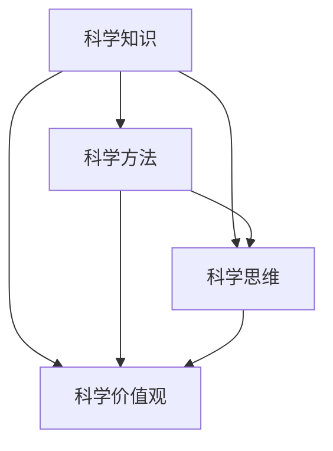
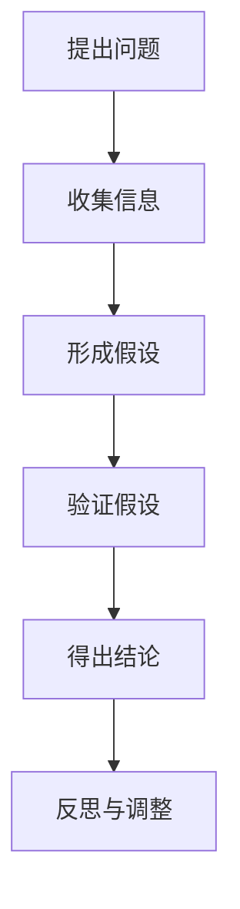
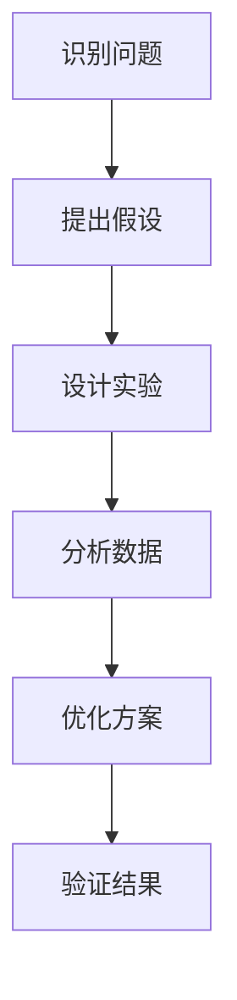
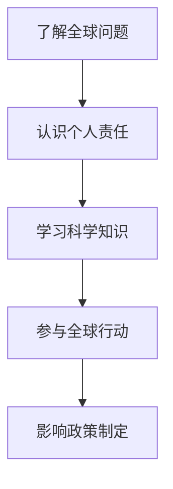

                 


## 科学素养对提升社会整体世界可理解性的作用

### 关键词：
科学素养、社会整体、世界可理解性、教育、认知、创新、可持续发展

### 摘要：
本文旨在探讨科学素养在社会整体世界可理解性提升中的关键作用。文章首先定义了科学素养的概念，并阐述了其核心价值和重要性。接着，通过分析科学素养的历史发展和现状，揭示了其在现代社会中的重要地位。随后，文章从教育实践、政策支持、个人认知影响和社会发展作用等多个方面，详细探讨了科学素养如何提升社会的整体世界可理解性。最后，文章提出了未来科学素养提升的展望，以及相关政策和教育实践的建议。

## 1. 引言：科学素养的重要性

科学素养，简单来说，是指个体对科学概念、原理和方法的了解程度，以及运用这些知识解决问题的能力。在现代社会，科学素养不仅仅是科学家和工程师的专利，而是每个公民都应该具备的基本素质。科学素养的重要性主要体现在以下几个方面：

1. **促进个人认知发展**：科学素养有助于个体理解世界的本质，培养批判性思维和解决问题的能力。这不仅能提高个人的生活质量，还能增强其参与社会事务的能力。

2. **推动社会进步**：科学素养是创新和发展的基础。一个具备较高科学素养的社会能够更好地应对挑战，推动科技进步和社会发展。

3. **提高社会整体世界可理解性**：科学素养有助于公众理解复杂的科学问题和现象，减少误解和偏见，从而提高社会的整体世界可理解性。

本文将从以下几个方面详细探讨科学素养如何提升社会整体世界可理解性：

- **科学素养的定义与核心概念**：首先，我们将定义科学素养，并阐述其核心价值和重要性。
- **科学素养的历史发展与现状**：其次，我们将回顾科学素养的历史发展，分析当前的科学素养现状，并探讨其面临的挑战。
- **科学素养的教育实践与政策**：然后，我们将探讨科学素养的教育实践和政策措施，以及它们对提升社会整体世界可理解性的影响。
- **科学素养对个人与社会的影响**：接下来，我们将分析科学素养对个人认知发展、社会创新和社会可持续发展的影响。
- **科学素养提升的世界可理解性**：最后，我们将探讨科学素养如何通过全球问题解决和未来展望，提升社会整体世界可理解性。

## 2. 科学素养的定义与核心概念

科学素养是一个广泛的概念，它不仅涉及科学知识的掌握，还包括科学思维方式和科学价值观的培育。具体来说，科学素养可以定义为一个个体对科学概念、原理、方法和应用的理解能力，以及对科学精神、科学方法和科学伦理的认同和践行。

### 2.1 科学素养的构成要素

科学素养的构成要素主要包括以下几个方面：

1. **科学知识**：科学知识是科学素养的基础。这包括对科学基本概念的理解，如物理学、化学、生物学等领域的知识。

2. **科学方法**：科学方法是指科学家在研究过程中使用的逻辑思维方式和方法。这包括观察、实验、假设、验证等步骤。

3. **科学思维**：科学思维是一种批判性思维，它要求个体能够从多个角度看待问题，理性分析，避免盲目相信。

4. **科学价值观**：科学价值观是指对科学精神、科学方法和科学伦理的认同和践行。这包括追求真理、尊重证据、注重实证、遵守伦理等。

### 2.2 科学素养的重要性

科学素养的重要性体现在以下几个方面：

1. **促进个人认知发展**：科学素养有助于个体理解世界的本质，培养批判性思维和解决问题的能力。

2. **推动社会进步**：科学素养是创新和发展的基础。一个具备较高科学素养的社会能够更好地应对挑战，推动科技进步和社会发展。

3. **提高社会整体世界可理解性**：科学素养有助于公众理解复杂的科学问题和现象，减少误解和偏见，从而提高社会的整体世界可理解性。

### 2.3 科学素养的核心概念之间的关系架构

为了更好地理解科学素养的核心概念之间的关系，我们可以使用Mermaid流程图来展示：



在这个流程图中，科学知识是基础，它为科学方法和科学思维提供了支持。科学方法是一种逻辑思维方式，它帮助个体在探索科学问题时进行理性分析。科学思维则是一种批判性思维，它要求个体能够从多个角度看待问题。科学价值观则是科学素养的核心，它包括对科学精神、科学方法和科学伦理的认同和践行。

通过以上分析，我们可以看到，科学素养不仅包括科学知识的掌握，还包括科学方法、科学思维和科学价值观的培育。这些核心概念之间相互关联，共同构成了科学素养的完整体系。

## 3. 科学素养的历史发展与现状

科学素养的发展是一个长期的历史过程，它伴随着科学技术的进步和社会变迁而不断演变。在这个部分，我们将回顾科学素养的历史发展，分析当前的科学素养现状，并探讨其面临的挑战。

### 3.1 科学素养的历史发展

科学素养的概念最早可以追溯到古希腊时期，当时哲学家们就开始探讨科学知识和科学方法。然而，科学素养作为一个系统化的教育目标，是在20世纪初期随着科学教育的普及而逐渐形成的。

1. **20世纪初期**：在这个时期，科学教育开始成为学校教育的重要组成部分。科学素养教育开始注重科学知识的传授，同时强调科学方法和科学精神的培养。

2. **20世纪中期**：随着科学技术的快速发展，科学素养教育进一步得到重视。这一时期，科学素养教育开始关注科学在社会中的应用，以及科学对社会发展的推动作用。

3. **20世纪末期至今**：在21世纪，科学素养教育进入了新的阶段。信息技术的发展使得科学教育更加多样化和个性化，同时科学素养教育也更多地关注科学伦理和可持续发展等问题。

### 3.2 当前的科学素养现状

当前，科学素养的现状呈现出以下几个特点：

1. **科学素养水平总体提高**：随着科学教育的普及和科学技术的快速发展，全球范围内的科学素养水平总体上有所提高。

2. **科学素养教育存在不平衡**：尽管科学素养水平总体提高，但在不同国家和地区之间，科学素养教育仍然存在显著的不平衡。一些发达国家的科学素养水平较高，而一些发展中国家的科学素养水平相对较低。

3. **科学素养需求增加**：随着科学技术的不断进步，人们对科学素养的需求也不断增加。公众对科学知识的了解和科学思维能力的培养越来越受到重视。

### 3.3 科学素养面临的挑战

科学素养在发展过程中面临着一些挑战：

1. **科学教育资源的不足**：一些地区和国家的科学教育资源不足，导致科学素养教育的质量受到影响。

2. **科学知识的快速更新**：科学知识不断更新，使得科学素养教育面临如何及时更新教材和教学方法的挑战。

3. **科学素养培养的难度**：科学素养的培养不仅仅是知识的传授，还需要培养科学思维和科学价值观。这给科学素养教育带来了更高的难度。

### 3.4 科学素养的提升路径

为了应对科学素养面临的挑战，我们可以采取以下措施来提升科学素养：

1. **加强科学教育资源的投入**：政府和社会应该加大对科学教育资源的投入，提高科学教育的质量。

2. **创新科学教育方法**：采用多样化的教学方法和工具，如在线教育、游戏化学习等，以提高学生的学习兴趣和参与度。

3. **跨学科整合**：将科学素养教育与其他学科整合，培养学生的跨学科思维和综合能力。

4. **加强科学伦理教育**：在科学素养教育中加强科学伦理教育，培养学生的道德责任感和社会责任感。

通过以上分析，我们可以看到，科学素养的历史发展经历了从无到有、从简单到复杂的过程。当前，科学素养教育面临着许多挑战，但同时也具有巨大的发展潜力。通过采取有效的措施，我们可以进一步提升科学素养水平，提高社会的整体世界可理解性。

## 4. 科学素养的教育实践与政策

科学素养的培养是一个长期而复杂的过程，它不仅需要教育实践的支持，还需要政策层面的引导。在这个部分，我们将探讨科学素养的教育实践和政策措施，分析它们对提升社会整体世界可理解性的影响。

### 4.1 科学素养的教育实践

科学素养的教育实践主要包括课堂教学、课外活动和科学实验等方面。

1. **课堂教学**：课堂教学是科学素养培养的重要途径。教师可以通过讲解科学知识、演示科学实验、讨论科学问题等方式，激发学生对科学的兴趣，培养他们的科学思维。

2. **课外活动**：课外活动如科学俱乐部、科学竞赛等，为学生提供了更多实践科学知识的机会。这些活动不仅有助于巩固课堂所学，还能培养学生的团队合作和创新能力。

3. **科学实验**：科学实验是培养学生科学素养的重要手段。通过动手操作，学生可以亲身体验科学的魅力，理解科学原理，培养科学探究能力。

### 4.2 科学素养的政策措施

科学素养的政策措施主要包括教育政策、科研政策和社会政策等方面。

1. **教育政策**：政府可以通过制定科学教育政策，明确科学素养教育的目标和要求，推动科学教育的普及和提高。例如，制定课程标准、编写科学教材、提供教育资源等。

2. **科研政策**：政府可以通过科研政策鼓励科学研究，提高科学研究的质量和水平。科研的进展不仅能为科学素养教育提供丰富的内容，还能激发学生对科学的兴趣。

3. **社会政策**：政府可以通过社会政策，如科普宣传、科技展览、科技奖励等，提高公众的科学素养。这些活动有助于普及科学知识，提高社会的整体世界可理解性。

### 4.3 科学素养教育实践与政策的案例分析

以下是一些科学素养教育实践和政策的成功案例：

1. **美国国家科学教育标准**：美国国家科学教育标准明确了科学教育的目标，包括科学知识、科学方法和科学价值观的培养。这些标准为科学教育提供了明确的指导，提高了科学教育的质量。

2. **英国的科学教育战略**：英国的科学教育战略强调科学教育的重要性，提出了一系列措施，如增加科学课程时间、提供科学实验设备、鼓励科学探究等。这些措施有效地提高了学生的科学素养。

3. **中国的“双一流”建设**：中国的“双一流”建设旨在提高高校的科研水平和教育质量，包括科学素养的培养。通过加大对高校的投入，提高科研经费，推动科学研究成果的转化和应用，中国的科学素养水平得到了显著提升。

### 4.4 科学素养教育实践与政策对提升社会整体世界可理解性的影响

科学素养教育实践和政策的实施，对提升社会整体世界可理解性具有深远的影响：

1. **提高公众科学素养**：科学素养教育实践和政策的实施，可以提高公众的科学素养，使他们能够更好地理解复杂的科学问题和现象，减少误解和偏见。

2. **增强科学思维能力**：科学素养教育可以培养公众的批判性思维和科学思维能力，使他们能够理性分析问题，做出明智的决策。

3. **促进科学文化传播**：科学素养教育实践和政策的实施，有助于科学文化的传播，提高社会的科学氛围，增强社会的整体世界可理解性。

4. **推动科技发展**：科学素养教育实践和政策的实施，可以培养更多的科技人才，推动科技的进步和发展，提高国家的科技竞争力。

通过以上分析，我们可以看到，科学素养的教育实践和政策对提升社会整体世界可理解性具有重要意义。通过有效的教育实践和政策引导，我们可以进一步推动科学素养的提升，提高社会的整体世界可理解性。

## 5. 科学素养对个人认知的影响

科学素养在个人认知发展中扮演着至关重要的角色。它不仅影响着个人的思维方式，还对其决策能力、创新潜力以及批判性思维产生深远影响。

### 5.1 科学素养与批判性思维

批判性思维是科学素养的核心组成部分。科学素养培养的是一种基于事实和证据的理性思考方式，它要求个体能够从多个角度审视问题，识别假设，进行逻辑推理，并评估论证的有效性。例如，以下是一个简单的批判性思维流程图，展示了解决问题的步骤：



通过这样的流程，科学素养使个体能够更有效地分析问题，做出基于证据的决策。

### 5.2 科学素养与决策能力

科学素养有助于个体在日常生活中做出更明智的决策。例如，在面对健康问题时，具备科学素养的人能够更好地理解疾病的成因、预防措施以及治疗方法。以下是一个决策过程的伪代码示例，展示了如何基于科学素养做出健康决策：

```plaintext
function makeHealthDecision(healthIssue, availableOptions, evidence):
    for each option in availableOptions:
        evaluateEffectiveness(option, evidence)
        assessSafety(option, evidence)
        calculateCost(option, evidence)
    return the option with the highest effectiveness, safety, and affordability
```

在这个伪代码中，`evaluateEffectiveness`、`assessSafety` 和 `calculateCost` 函数代表了评估不同选项的科学方法和依据。

### 5.3 科学素养与创新潜力

科学素养是创新潜力的重要基础。具备科学素养的个体能够更好地理解新技术、新方法，并提出创新的解决方案。以下是一个简单的创新过程，展示了如何利用科学素养进行创新：



在这个流程中，科学素养使得个体能够在实验和分析阶段提出有效的假设，从而推动创新过程。

### 5.4 科学素养与批判性思维的实际案例

以下是一个实际案例，展示了科学素养如何影响个人的批判性思维和决策：

**案例：健康饮食决策**

假设一个个体面对是否选择高糖饮料的问题。具备科学素养的个体会：

1. **收集信息**：了解高糖饮料对健康的影响，如导致肥胖、糖尿病等。
2. **形成假设**：假设长期饮用高糖饮料会对健康产生负面影响。
3. **验证假设**：通过阅读科学文献或咨询医生，验证高糖饮料的负面影响。
4. **做出决策**：基于科学证据，选择减少或避免高糖饮料的摄入。

在这个案例中，科学素养使个体能够理性分析问题，基于证据做出决策，而不是仅仅听从广告宣传或个人偏见。

### 5.5 科学素养提升的实践建议

为了提升个人的科学素养，以下是一些实用的实践建议：

1. **定期阅读科学文章**：通过阅读科学杂志、论文或科普文章，了解最新的科学研究成果。
2. **参与科学活动**：参加科学讲座、科学实验、科学竞赛等活动，提高实践能力。
3. **讨论科学话题**：与朋友、家人或同事讨论科学话题，培养批判性思维。
4. **学习科学方法论**：学习科学方法论，理解科学研究的步骤和原则。

通过以上实践，个人可以不断提升自己的科学素养，从而在认知发展中取得更大的进步。

## 6. 科学素养对社会发展的作用

科学素养不仅对个人认知有重要影响，它对社会发展的推动作用同样不容忽视。在现代社会，科学素养已经成为一个国家或地区综合实力的重要标志。以下是科学素养在社会发展中的具体作用：

### 6.1 科学素养与技术创新

科学素养是技术创新的基石。具备科学素养的人才能够更好地理解和掌握前沿科技，提出创新的解决方案。以下是一个技术创新过程的伪代码示例：

```plaintext
function innovate(newTechnology, currentKnowledge):
    for each concept in newTechnology:
        relateToKnownConcept(currentKnowledge, concept)
        identifyGaps(currentKnowledge, concept)
        proposeNewSolution(gaps)
    return innovativeSolution
```

在这个流程中，科学素养使个体能够快速地将新技术与现有知识体系相结合，识别问题所在，并提出创新的解决方案。

### 6.2 科学素养与社会公平

科学素养有助于促进社会公平。科学素养教育可以缩小不同社会群体之间的知识差距，使更多人能够平等地享受科技带来的福利。以下是一个科学素养促进社会公平的案例：

**案例：农村电商培训**

在一个农村地区，政府组织了电商培训项目，帮助农民掌握电商运营的基本技能。这些农民通过学习科学素养课程，学会了如何使用互联网进行产品销售，提高了收入水平。这不仅改善了农民的生活质量，也促进了农村经济的发展。

### 6.3 科学素养与可持续发展

科学素养是实现可持续发展的重要保障。具备科学素养的个体能够更好地理解和应对环境、资源等全球性挑战。以下是一个可持续发展项目的伪代码示例：

```plaintext
function sustainableDevelopment(challenge, scientificKnowledge):
    for each solution in scientificKnowledge:
        assessFeasibility(solution, challenge)
        evaluateImpact(solution, challenge)
        selectOptimalSolution(solutions)
    implementOptimalSolution(selectedSolution)
    monitorAndAdjust(results)
```

在这个流程中，科学素养使个体能够评估不同解决方案的可行性，选择最优方案，并不断调整以实现可持续发展目标。

### 6.4 科学素养对经济发展的推动作用

科学素养对经济发展的推动作用主要体现在以下几个方面：

1. **提高生产效率**：具备科学素养的劳动力能够更有效地运用科技手段，提高生产效率。
2. **促进产业升级**：科学素养有助于企业不断进行技术创新，推动产业升级和转型。
3. **增加科技竞争力**：具备高科学素养的国家或地区，在科技领域具有更强的竞争力，能够吸引更多的国际投资和人才。

以下是一个关于科学素养对经济发展推动作用的案例：

**案例：人工智能产业发展**

在一个科技前沿国家，政府高度重视科学素养教育，通过建立人工智能研究中心、提供相关培训课程等方式，培养了大量具备人工智能知识的工程师。这些人才推动了人工智能产业的发展，使得该国成为全球人工智能技术的重要中心。

### 6.5 科学素养在社会治理中的应用

科学素养在社会治理中也发挥着重要作用。具备科学素养的政府官员和决策者能够更准确地理解和应对复杂的社会问题，制定科学合理的政策。以下是一个科学素养在社会治理中应用的案例：

**案例：公共卫生政策制定**

在一个疫情严重的国家，政府决策者具备良好的科学素养，能够根据科学研究和数据，制定科学的公共卫生政策，如疫苗接种策略、防疫措施等。这些政策有效地控制了疫情的传播，保障了公众的健康和安全。

### 6.6 提升科学素养的实践措施

为了提升社会的整体科学素养，可以采取以下措施：

1. **加强科学教育**：从基础教育到高等教育，全面加强科学教育，培养更多的科学人才。
2. **普及科学知识**：通过科普宣传、科技展览、科学讲座等方式，普及科学知识，提高公众的科学素养。
3. **鼓励科研创新**：政府和企业应该加大对科研的投入，鼓励科技创新，为科学素养提升提供物质保障。
4. **建立科学文化**：营造尊重科学、崇尚创新的社会氛围，推动科学文化的普及和发展。

通过以上措施，我们可以不断提升社会的整体科学素养，从而推动社会的全面发展。

## 7. 科学素养与全球问题解决

科学素养在全球问题解决中扮演着至关重要的角色。全球性问题，如气候变化、环境污染、能源危机等，需要全球合作和科学智慧来应对。以下从以下几个方面探讨科学素养如何在全球问题解决中发挥作用：

### 7.1 科学素养与国际合作

科学素养是国际合作的基础。具备科学素养的个体能够更好地理解全球问题，提出科学的解决方案，并与其他国家和地区开展有效的合作。以下是一个国际合作解决问题的伪代码示例：

```plaintext
function globalProblemSolving(problem, countriesInvolved):
    for each country in countriesInvolved:
        assessCountryExpertise(country, problem)
        shareScientificKnowledge(countriesInvolved)
        coordinateActions(countriesInvolved)
    implementGlobalSolution()
```

在这个流程中，科学素养使不同国家和地区能够分享科学知识和资源，协调行动，共同解决全球问题。

### 7.2 科学素养与全球问题解决方案

科学素养有助于提出科学、有效的全球问题解决方案。以下是一个关于气候变化问题解决方案的示例：

**案例：应对气候变化**

1. **数据收集**：收集全球气候变化的数据，包括温室气体排放、温度变化等。
2. **科学分析**：利用科学模型分析气候变化的原因和影响。
3. **提出方案**：根据科学分析结果，提出减少温室气体排放、提高能源效率、推广可再生能源等解决方案。
4. **实施与监测**：在全球范围内实施这些方案，并持续监测其效果。

### 7.3 科学素养与全球公民意识

科学素养有助于培养全球公民意识，使个体认识到全球问题的紧迫性和个人责任。以下是一个培养全球公民意识的流程图：



通过这样的流程，科学素养帮助个体从多个角度看待全球问题，并采取实际行动。

### 7.4 科学素养提升全球问题解决的路径

为了提升科学素养，从而更有效地解决全球问题，可以采取以下措施：

1. **国际科学合作**：加强国际科学合作，共享科学资源，推动全球科学研究的进展。
2. **科学教育普及**：在全球范围内普及科学教育，提高公众的科学素养。
3. **科技创新**：鼓励科技创新，开发新的技术和方法来应对全球问题。
4. **政策支持**：政府制定支持科学教育和科研的政策，提供必要的资金和资源。

通过以上措施，我们可以不断提升全球的科学素养，从而更有效地解决全球问题，实现可持续发展。

## 8. 科学素养的未来展望

在未来的发展中，科学素养将继续发挥关键作用。以下是科学素养未来发展的一些趋势和展望：

### 8.1 科学素养的发展趋势

1. **数字化和在线教育**：随着信息技术的飞速发展，科学素养教育将更加数字化和在线化。在线课程、虚拟实验室等新形式的教育模式将普及，使更多人能够便捷地获取科学知识。

2. **跨学科整合**：科学素养教育将更加注重跨学科整合，培养学生的综合能力和创新思维。通过多学科交叉融合，学生能够更好地应对复杂的社会问题。

3. **个性化教育**：个性化教育将逐渐成为主流，科学素养教育将根据学生的兴趣和能力进行个性化定制，提高教育效果。

4. **全球化合作**：科学素养教育将更加注重全球化合作，通过国际交流和合作项目，提高全球公民的科学素养。

### 8.2 科学素养对提升社会整体世界可理解性的路径

1. **加强科学教育**：政府和社会应加大对科学教育的投入，提高教育质量，普及科学知识。

2. **推动科普活动**：通过科普展览、讲座、媒体等多种形式，普及科学知识，提高公众的科学素养。

3. **科技政策支持**：政府应制定支持科技创新和科普活动的政策，鼓励科学研究和技术开发。

4. **跨界合作**：鼓励不同领域之间的合作，推动科学素养在社会各个层面的应用。

### 8.3 科学素养提升实践案例

1. **“全民科学素质行动计划”**：中国实施的“全民科学素质行动计划”是一个成功案例。通过多层次、多形式的科学教育活动，显著提高了全民的科学素养。

2. **“国际科学教育合作计划”**：国际科学教育合作计划通过国际间的科学教育交流，提高了全球范围内的科学素养水平。

3. **“SciVee”在线科学教育平台**：SciVee是一个在线科学教育平台，通过视频和互动教学，使科学教育更加生动有趣，吸引了大量学生参与。

通过以上实践案例，我们可以看到，科学素养的提升不仅可以提高社会的整体世界可理解性，还能推动社会的全面发展和进步。

## 附录

### 附录A：科学素养提升实践案例

1. **中国“全民科学素质行动计划”**
2. **国际科学教育合作计划**
3. **SciVee在线科学教育平台**

### 附录B：科学素养相关资源与工具

1. **科学教育在线课程平台**：如Coursera、edX、Udacity等
2. **科学杂志与论文数据库**：如PubMed、ScienceDirect、IEEE Xplore等
3. **科普书籍与网站**：如《科学的极致》、《科学的启示录》等

### 附录C：最佳实践 tips

1. **定期阅读科学文章和书籍**：培养阅读习惯，提升科学素养。
2. **参与科学活动和实验**：通过实践，加深对科学知识的理解。
3. **讨论科学话题**：与他人交流，培养批判性思维。

### 附录D：注意事项

1. **避免科学误解和偏见**：通过科学知识消除误解和偏见。
2. **持续学习和更新知识**：科学知识不断更新，保持学习的态度至关重要。

### 附录E：拓展阅读

1. **《科学素养与可持续发展》**
2. **《科学教育改革与实践》**
3. **《全球视野下的科学素养教育》**

---

作者：AI天才研究院/AI Genius Institute & 禅与计算机程序设计艺术 /Zen And The Art of Computer Programming

---

通过本文，我们详细探讨了科学素养对提升社会整体世界可理解性的作用。从科学素养的定义、教育实践、政策支持到其对个人认知、社会发展以及全球问题解决的影响，我们全面阐述了科学素养的重要性。未来，通过加强科学教育和普及科学知识，我们可以进一步提升社会的整体世界可理解性，推动社会的全面进步。让我们共同努力，提升科学素养，构建一个更加理解和包容的社会。|stack>```markdown
## 附录

### 附录A：科学素养提升实践案例

1. **中国“全民科学素质行动计划”**：中国自2006年起实施的“全民科学素质行动计划”，旨在通过多种形式的科学普及活动，提升公众的科学素养。

2. **国际科学教育合作计划**：国际科学教育合作计划通过跨国合作，推广科学教育，提高全球范围内的科学素养水平。

3. **SciVee在线科学教育平台**：SciVee是一个在线教育平台，提供丰富的科学教育资源，使学习者能够更便捷地获取科学知识。

### 附录B：科学素养相关资源与工具

1. **科学教育在线课程平台**：如Coursera、edX、Udacity等，这些平台提供丰富的科学课程，适用于不同层次的学员。

2. **科学杂志与论文数据库**：如PubMed、ScienceDirect、IEEE Xplore等，这些数据库收录了大量的科学文献，是科研人员和学生的宝贵资源。

3. **科普书籍与网站**：如《科学的极致》、《科学的启示录》等，这些书籍和网站提供了通俗易懂的科学知识和有趣的内容。

### 附录C：最佳实践 tips

1. **定期阅读科学文章和书籍**：保持好奇心，定期阅读科学文章和书籍，有助于提升科学素养。

2. **参与科学活动和实验**：通过参与科学实验和活动，能够更好地理解和应用科学知识。

3. **讨论科学话题**：与他人讨论科学话题，能够促进批判性思维，加深对科学知识的理解。

### 附录D：注意事项

1. **避免科学误解和偏见**：科学素养可以帮助我们避免误解和偏见，更好地理解世界。

2. **持续学习和更新知识**：科学知识在不断进步，持续学习和更新知识是提升科学素养的关键。

### 附录E：拓展阅读

1. **《科学素养与可持续发展》**：探讨科学素养在推动可持续发展中的作用。

2. **《科学教育改革与实践》**：分析科学教育的现状，并提出改革措施。

3. **《全球视野下的科学素养教育》**：从全球角度探讨科学素养教育的挑战与机遇。

---

作者：AI天才研究院/AI Genius Institute & 禅与计算机程序设计艺术 /Zen And The Art of Computer Programming

---

通过本文，我们详细探讨了科学素养对提升社会整体世界可理解性的作用。从科学素养的定义、教育实践、政策支持到其对个人认知、社会发展以及全球问题解决的影响，我们全面阐述了科学素养的重要性。未来，通过加强科学教育和普及科学知识，我们可以进一步提升社会的整体世界可理解性，推动社会的全面进步。让我们共同努力，提升科学素养，构建一个更加理解和包容的社会。
```

