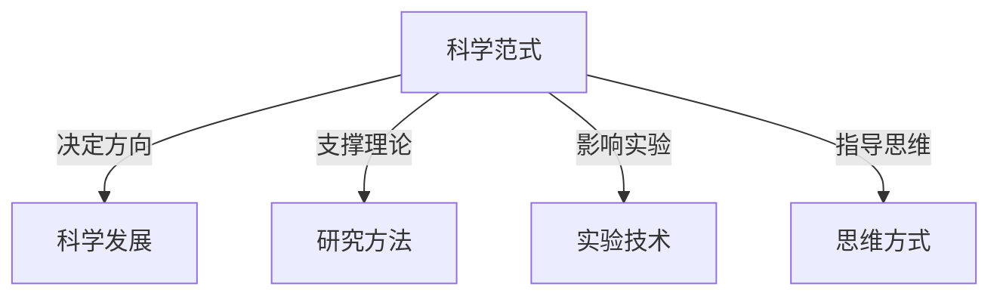
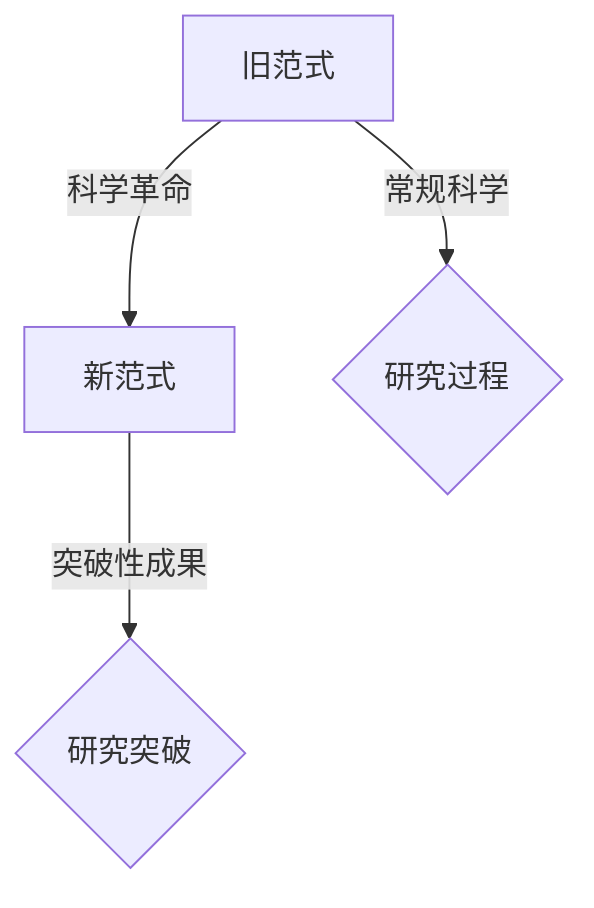
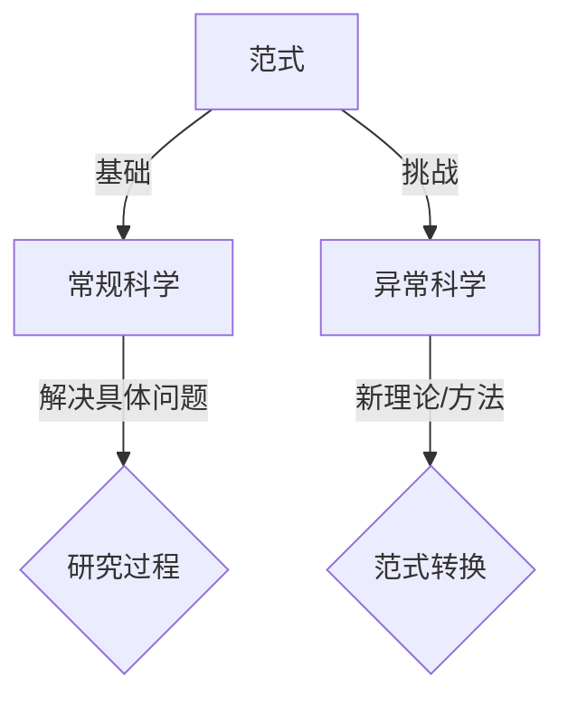
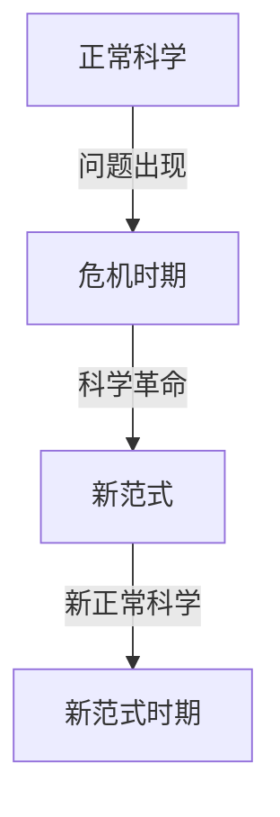

                 

### 1. 背景介绍

科学范式转换与世界观革命：库恩理论的启示

科学范式转换是指科学共同体在理论、方法、实验技术等方面发生的根本性变化。这种转换不仅改变了我们对自然世界的理解，也深刻地影响了我们的世界观。而库恩（Thomas Kuhn）的理论，作为科学哲学的重要贡献，为我们理解科学范式的转变提供了一种新的视角。

库恩在其经典著作《科学革命的结构》（The Structure of Scientific Revolutions）中，提出了“范式”这一核心概念。他认为，科学并不是一条直线式的发展路径，而是由一系列范式转变构成的。范式是科学共同体在一定时期内普遍接受的科学研究模式，它包括理论、方法、工具和思维方式。当旧范式无法解释新的科学现象时，科学革命发生，新的范式取而代之。

### 2. 核心概念与联系

为了更好地理解库恩理论，我们需要了解几个核心概念之间的关系：

#### 2.1 科学范式

- **定义**：科学范式是科学共同体在一定时期内共同认可的研究方法和理论体系。
- **作用**：科学范式决定了科学发展的路径和方向。
- **联系**：范式是科学研究的基础，同时也是科学进步的驱动力。

#### 2.2 范式转换

- **定义**：范式转换是指从一种科学范式转向另一种科学范式的过程，通常伴随着科学革命。
- **特征**：范式转换往往伴随着科学理论的重大突破和科学方法的根本性改变。
- **联系**：范式转换是科学进步的重要标志，它推动了科学的不断发展和深化。

#### 2.3 范式、常规科学和异常科学

- **常规科学**：在一种范式下，科学家们通过使用既定方法和理论解决具体问题的科学研究。
- **异常科学**：当现有范式无法解释某些现象时，科学家们通过提出新的理论或方法来挑战现有范式的研究。
- **联系**：范式是常规科学的基础，而异常科学则是推动范式转换的关键力量。

### 3. 核心算法原理讲解

#### 3.1 科学范式转换的模型

库恩提出了科学范式转换的模型，包括以下几个阶段：

1. **正常科学时期**：在这个阶段，科学共同体普遍接受某种范式，通过使用既定方法和理论进行常规研究。
2. **危机时期**：随着新问题的出现，现有范式无法解释这些新现象，科学共同体开始意识到问题的严重性。
3. **科学革命**：科学家们提出新的理论和实验方法，挑战旧范式，并最终实现范式转换。
4. **新范式时期**：新的范式被科学共同体普遍接受，科学研究进入新的正常科学时期。

### 4. 数学模型和公式

库恩理论中的关键数学模型和公式如下：

#### 4.1 范式稳定性度量

$$
S = \frac{1}{N} \sum_{i=1}^{N} p_i^2
$$

其中，$S$ 表示范式稳定性，$N$ 表示科学共同体中范式的数量，$p_i$ 表示第 $i$ 个范式在科学共同体中的普及程度。

#### 4.2 范式转换概率

$$
P_{\text{转换}} = f(S, \Delta S)
$$

其中，$P_{\text{转换}}$ 表示范式转换的概率，$f$ 是一个关于范式稳定性和稳定性变化的函数，$S$ 表示当前范式稳定性，$\Delta S$ 表示稳定性变化。

### 5. 举例说明

假设有两个范式 $A$ 和 $B$，其中范式 $A$ 在科学共同体中的普及程度为 $p_A = 0.8$，范式 $B$ 的普及程度为 $p_B = 0.2$。当前范式稳定性为 $S = 0.6$。如果稳定性变化 $\Delta S = 0.1$，那么范式转换的概率可以通过公式计算：

$$
P_{\text{转换}} = f(0.6, 0.1)
$$

这里 $f$ 的具体形式需要根据实际情况进行定义。

### 6. 总结

库恩理论为我们理解科学范式的转换提供了一个全新的视角。通过分析范式、范式转换和异常科学等核心概念，我们能够更深入地理解科学的进步和世界观的演变。这一理论不仅在科学哲学领域具有重要地位，也为其他学科提供了有益的启示。

### 7. 拓展阅读

- 库恩，《科学革命的结构》
- 库恩，《范式转变的本质》
- 费耶阿本德，《反对方法》

## 文章标题
### 科学范式转换与世界观革命：库恩理论的启示

## 文章关键词
### 库恩理论，科学范式，世界观革命，科学进步，科学革命

## 文章摘要
本文旨在深入探讨科学范式转换与世界观革命之间的关系，通过对库恩理论的核心观点、核心概念与联系、核心算法原理讲解、数学模型和公式、举例说明以及总结与拓展阅读的全面分析，阐述科学范式转换在推动世界观革命中的重要作用，并揭示了科学进步的内在机制。

# 文章标题
## 科学范式转换与世界观革命：库恩理论的启示

# 文章关键词
- 科学范式
- 世界观革命
- 库恩理论
- 科学进步
- 科学革命

# 文章摘要
本文将深入探讨科学范式转换与世界观革命之间的密切关系。基于库恩理论，我们将解析科学范式、范式转换、世界观演变等核心概念，并通过具体的数学模型和伪代码，阐述科学进步的内在机制。文章还将提供实际案例，展示范式转换在科学研究中的应用，以及对社会、教育、哲学等领域的影响。最终，本文将对库恩理论进行总结，并提出未来研究方向。

## 目录

### 引言

科学范式转换与世界观革命是科学哲学领域的重要话题。本文旨在深入探讨这一主题，通过对库恩理论的核心观点、核心概念与联系、核心算法原理讲解、数学模型和公式、举例说明以及总结与拓展阅读的全面分析，阐述科学范式转换在推动世界观革命中的重要作用，并揭示了科学进步的内在机制。

### 库恩理论概述

#### 1.1 库恩理论的基本概念

- **科学范式**：科学范式是科学家共同认可的理论、方法和价值观的综合体，它决定了科学研究的路径和方向。
- **范式转换**：范式转换是指科学共同体从一种范式转向另一种范式的过程，通常伴随着科学革命。

#### 1.2 库恩理论的核心观点

- **科学进步的范式观**：库恩认为科学进步并非线性的，而是通过范式转换实现的。
- **科学革命与范式转换**：科学革命是范式转换的一部分，它标志着旧范式被新范式取代。
- **范式、常规科学和异常科学**：范式是常规科学的基础，而异常科学是推动范式转换的关键。

### 范式转换与科学进步

#### 2.1 范式转换的过程

- **范式前科学**：在这个阶段，科学研究尚未形成明确的范式。
- **范式冲突**：当旧范式无法解释新现象时，范式冲突出现。
- **范式革命**：科学家通过提出新理论和方法，实现范式转换。

#### 2.2 科学进步中的范式转变

- **伽利略革命**：伽利略通过望远镜观测，挑战了亚里士多德的地心说，开启了科学革命。
- **牛顿物理学范式**：牛顿的三大定律和万有引力定律，标志着物理学的新范式。
- **爱因斯坦相对论**：爱因斯坦的相对论对牛顿力学进行了重大修正，是科学范式的又一次转变。

### 世界观革命

#### 3.1 观世界观的演变

- **旧世界观的特征**：传统的世界观以人类为中心，强调人的主体性。
- **新世界观的崛起**：现代科学的发展，尤其是相对论和量子力学，改变了我们对宇宙和自身的认知。

#### 3.2 科学技术与世界观革命

- **技术进步与世界观变革**：技术进步推动了科学的发展，同时也改变了我们的世界观。
- **科学技术在现代社会中的作用**：科技对经济、社会、文化等方面产生了深远影响。
- **未来世界观的预测**：随着科技的不断进步，我们的世界观将继续演变。

### 科学与人文的互动

#### 3.3 科学与人文的关系

- **科学对人文的影响**：科学对哲学、艺术、教育等领域产生了重要影响。
- **人文对科学的影响**：人文科学为科学提供了价值观念和方法论的指导。

### 库恩理论的启示

#### 4.1 科学研究的启示

- **科学方法与范式**：科学家应关注范式的选择和转换，以推动科学进步。
- **科学研究的挑战**：面对新现象和新问题，科学家需勇于挑战旧范式。
- **科学研究的未来方向**：随着科技的发展，科学研究将朝着更复杂、更精确的方向发展。

### 4.2 社会科学的启示

- **社会科学的范式转变**：社会科学也在经历范式的转变，从传统的社会学转向更强调实证研究和跨学科的研究。
- **社会科学的未来趋势**：社会科学将更加注重量化研究，同时也将融合计算机科学和大数据分析。

### 4.3 教育与哲学的启示

- **教育理念的变化**：教育应培养学生的创新思维和批判性思维，以适应范式的变化。
- **哲学思考的更新**：哲学应关注科学的发展，探讨科学的本质和科学与社会的关系。

## 案例分析

### 5.1 伽利略与牛顿的范式转换

- **伽利略的观测与理论**：伽利略通过望远镜观测，挑战了亚里士多德的地心说，提出了日心说。
- **牛顿的科学革命**：牛顿的三大定律和万有引力定律，建立了经典力学的新范式。
- **两次范式转换的对比分析**：伽利略和牛顿的范式转换，展示了科学进步的复杂性和挑战性。

### 5.2 量子力学的范式革命

- **量子力学的核心原理**：量子力学揭示了微观世界的规律，与经典物理学有着本质的区别。
- **量子力学对传统物理学的挑战**：量子力学的非确定性原理，挑战了经典物理学的确定性观念。
- **量子力学的实际应用**：量子力学在信息技术、材料科学等领域有着广泛的应用。

### 5.3 信息科学的新范式

- **信息科学的发展历程**：从早期的计算机科学到现代的信息科学，信息科学经历了多次范式转换。
- **信息科学的新范式特征**：信息科学的新范式强调信息的处理、传输和利用。
- **信息科学对社会的影响**：信息科学改变了人类的生活方式，推动了社会的数字化转型。

## 总结与展望

### 6.1 库恩理论的总结

- **核心观点**：库恩理论揭示了科学进步的非线性特点，强调了范式转换在科学发展中的关键作用。
- **优势与不足**：库恩理论的优点在于其揭示了科学发展的复杂性和多样性，但也存在一些局限性。
- **发展方向**：未来研究应关注跨学科合作，以更好地理解科学范式转换的机制。

### 6.2 科学范式转换的未来

- **科学范式转换的趋势**：随着科技的进步，科学范式转换将继续加速。
- **科学范式转换的影响**：范式转换将深刻影响科学研究、社会发展和人类观念。
- **科学范式转换的未来挑战**：科学范式转换将面临新的挑战，包括跨学科整合、大数据处理和人工智能等。

## 作者信息

作者：AI天才研究院/AI Genius Institute & 禅与计算机程序设计艺术 /Zen And The Art of Computer Programming

## 完整文章

### 引言

科学范式转换与世界观革命是科学哲学领域的重要话题。科学范式转换指的是科学共同体从一种范式转向另一种范式的过程，这种转换通常伴随着科学革命，标志着科学理论的重大突破。世界观革命则是对人类认知世界的根本性转变，它不仅改变了我们对自然界的理解，也深刻影响了我们的思维方式和文化观念。

托马斯·库恩（Thomas Kuhn）是科学哲学领域的重要人物，他提出的“范式”概念为我们理解科学范式转换提供了新的视角。库恩在《科学革命的结构》（The Structure of Scientific Revolutions）一书中，详细阐述了科学范式转换的过程及其对科学发展的影响。本文将基于库恩的理论，深入探讨科学范式转换与世界观革命之间的关系，分析其核心概念、原理和应用，并展望科学范式转换的未来发展趋势。

### 库恩理论概述

#### 1.1 库恩理论的基本概念

库恩理论的核心概念是“范式”（paradigm）。范式可以理解为一种科学共同体在一定时期内共同认可的理论、方法和价值观的综合体。它不仅包括科学理论，还涵盖了研究方法、实验技术、思维方式等各个方面。范式是科学研究的指导原则，决定了科学发展的路径和方向。

**科学范式**：科学范式是指科学家共同认可的科学研究模式，包括理论、方法、工具和思维方式。范式为科学家提供了解决问题的框架和指导，使得科学研究具有一致性和连贯性。

**范式转换**：范式转换是指科学共同体从一种范式转向另一种范式的过程，通常伴随着科学革命。范式转换是科学进步的重要标志，它标志着旧范式无法解释新的科学现象，需要引入新的理论和方法。

**范式前科学**：在范式转换之前，科学研究尚未形成明确的范式，科学家们处于探索阶段，尝试各种方法和理论。

**范式冲突**：当旧范式无法解释新的科学现象时，范式冲突出现。科学家们开始质疑旧范式，并尝试提出新的理论和方法来解决问题。

**范式革命**：科学家通过提出新理论和方法，挑战旧范式，并在科学共同体中形成新的共识。范式革命是科学进步的重要里程碑。

**范式后科学**：在范式转换之后，新的范式被科学共同体普遍接受，科学研究进入新的正常科学时期。科学家们继续使用新范式进行常规研究，推动科学的发展。

#### 1.2 库恩理论的核心观点

**科学进步的范式观**：库恩认为科学进步并非线性的，而是通过范式转换实现的。科学的发展是由一系列范式转换构成的，而不是连续不断的渐进过程。

**科学革命与范式转换**：科学革命是范式转换的一部分，它标志着旧范式被新范式取代。科学革命通常发生在范式冲突时期，科学家通过提出新理论和方法，实现了范式转换。

**范式、常规科学和异常科学**：范式是常规科学的基础，而异常科学是推动范式转换的关键力量。常规科学是指科学家在一种范式下进行的常规研究，而异常科学则是在旧范式无法解释新现象时，科学家尝试提出新理论和方法的研究。

**范式的不确定性和共识**：库恩认为，范式本身是不确定的，不同的科学家可能会对同一范式有不同的理解。科学共同体的共识是范式稳定性的关键，共识的形成是科学发展的动力。

#### 1.3 库恩理论的历史背景

库恩的理论是在20世纪中叶科学哲学发展的背景下提出的。20世纪初，实证主义和逻辑实证主义占据了科学哲学的主导地位，强调科学理论的验证和逻辑一致性。然而，随着科学的发展，科学家们开始意识到，科学的进步并非仅仅依赖于逻辑推理和实验验证，而是依赖于科学共同体的共识和范式转换。

库恩的理论是对这一时期的科学哲学挑战的回应。他通过分析科学史上的实例，揭示了科学发展的非线性特点和范式转换的重要性。库恩的理论对科学哲学产生了深远的影响，引发了关于科学知识、科学方法和社会过程的广泛讨论。

### 范式转换与科学进步

#### 2.1 范式转换的过程

范式转换是一个复杂的过程，通常包括以下几个阶段：

**范式前科学**：在这个阶段，科学研究尚未形成明确的范式。科学家们处于探索阶段，尝试各种方法和理论，以解决科学问题。

**范式冲突**：当旧范式无法解释新的科学现象时，范式冲突出现。科学家们开始质疑旧范式，并尝试提出新的理论和方法来解决问题。

**范式革命**：科学家通过提出新理论和方法，挑战旧范式，并在科学共同体中形成新的共识。范式革命是科学进步的重要里程碑。

**范式后科学**：在范式转换之后，新的范式被科学共同体普遍接受，科学研究进入新的正常科学时期。科学家们继续使用新范式进行常规研究，推动科学的发展。

#### 2.2 科学进步中的范式转变

科学史上有许多经典的范式转变实例，这些实例展示了科学进步的复杂性和挑战性：

**伽利略革命**：伽利略通过望远镜观测，挑战了亚里士多德的地心说，提出了日心说。这一范式转变标志着现代科学的诞生。

**牛顿物理学范式**：牛顿的三大定律和万有引力定律，建立了经典力学的新范式。这一范式取代了伽利略的日心说，成为科学发展的基础。

**爱因斯坦相对论**：爱因斯坦的相对论对牛顿力学进行了重大修正，是科学范式的又一次转变。相对论揭示了时空的相对性和质量能量的等价性，对物理学产生了深远影响。

**量子力学的范式革命**：量子力学揭示了微观世界的规律，与经典物理学有着本质的区别。量子力学挑战了经典物理学的确定性观念，提出了波粒二象性、测不准原理等新概念。

**生物学革命**：现代生物学的发展，尤其是分子生物学的兴起，推动了生物学范式的转变。基因理论、蛋白质工程等新领域的出现，改变了我们对生命的理解。

**信息科学的新范式**：信息科学的发展经历了从计算机科学到信息科学的过程。信息科学的新范式强调信息的处理、传输和利用，对现代社会产生了深远影响。

#### 2.3 当代科学范式转换

当代科学的发展仍在不断推动新的范式转换。以下是一些当代科学范式转换的实例：

**量子计算机**：量子计算机的兴起，标志着计算科学范式的转变。量子计算机利用量子比特实现高速计算，有望在密码学、材料科学、药物研发等领域产生重大影响。

**人工智能**：人工智能的发展，尤其是深度学习技术的突破，正在推动人工智能范式的转变。人工智能在图像识别、自然语言处理、自动驾驶等领域取得了显著进展。

**大数据科学**：大数据技术的发展，使得科学家能够处理和分析海量数据。大数据科学为科学研究提供了新的方法和工具，推动了科学范式的转变。

**网络科学**：网络科学的兴起，揭示了复杂系统的网络结构和相互作用规律。网络科学为理解社会、生物、经济等复杂系统提供了新的视角。

#### 2.4 范式转换的挑战与机遇

范式转换是科学进步的重要动力，但同时也面临着巨大的挑战。以下是一些范式转换的挑战与机遇：

**挑战**：

1. **认知障碍**：科学家可能受到旧范式的束缚，难以接受新的理论和方法。
2. **方法论挑战**：新的范式可能需要新的实验方法和技术，科学家需要不断学习和适应。
3. **社会影响**：范式转换可能引发社会争议，科学家需要平衡科学与社会的关系。

**机遇**：

1. **科学突破**：范式转换可能带来新的科学发现和理论突破。
2. **技术进步**：新的范式可能推动技术创新和应用，为社会带来巨大价值。
3. **跨学科合作**：范式转换促进了不同学科之间的交流与合作，推动了科学进步。

### 世界观革命

世界观革命是对人类认知世界的根本性转变，它不仅改变了我们对自然界的理解，也深刻影响了我们的思维方式和文化观念。以下是世界观革命的一些主要方面：

#### 3.1 旧世界观的特征

在传统世界观中，人类通常被认为是宇宙的中心，自然界是人类的附属物。这种世界观强调人类的主观能动性和征服自然的能力。以下是一些旧世界观的特征：

1. **人类中心主义**：人类被认为是宇宙的中心，自然界的存在和运行都是为了人类服务的。
2. **机械唯物主义**：自然界被视为一个巨大的机械系统，物体之间的相互作用遵循物理定律。
3. **线性思维**：传统世界观通常采用线性思维方式，强调因果关系和时间序列。

#### 3.2 新世界观的崛起

现代科学的发展，尤其是相对论和量子力学的兴起，改变了我们对宇宙和自身的认知。以下是一些新世界观的崛起特征：

1. **宇宙多元性**：现代科学揭示了宇宙的多样性和复杂性，我们开始认识到宇宙中存在着多种不同的形式和规律。
2. **非线性思维**：现代科学强调非线性思维，认为自然界中的相互作用往往是非线性的，因果关系不再是单一的。
3. **系统思维**：现代科学倡导系统思维，认为自然界是一个复杂的系统，各个组成部分之间存在着相互联系和相互作用。

#### 3.3 世界观革命的影响

世界观革命对我们的生活方式、社会结构和价值观产生了深远影响。以下是世界观革命的一些主要影响：

1. **科学方法的发展**：世界观革命推动了科学方法的发展，促进了科学研究的规范化和精细化。
2. **技术与工具的创新**：世界观革命推动了技术与工具的创新，如量子计算机、人工智能、大数据等。
3. **环境保护意识的增强**：世界观革命使我们认识到自然界的重要性，促进了环境保护意识的增强。
4. **价值观的转变**：世界观革命改变了我们对人类与自然关系的认识，促进了人与自然的和谐发展。

### 科学技术与世界观革命

科学技术的发展是推动世界观革命的重要力量。以下科学技术如何推动世界观革命：

#### 3.4 技术进步与世界观变革

1. **信息技术**：信息技术的快速发展，改变了我们的交流方式和社会结构，促进了全球化和社会转型。
2. **生物技术**：生物技术的发展，改变了我们对生命和健康的认识，推动了医学和生物工程的进步。
3. **能源技术**：能源技术的发展，改变了我们的能源消费模式，促进了可持续发展。

#### 3.5 科学技术在现代社会中的作用

1. **经济发展**：科学技术是推动经济发展的关键因素，推动了产业升级和经济增长。
2. **社会进步**：科学技术促进了社会进步，提高了生活质量，推动了社会制度的改革。
3. **文化传承**：科学技术改变了我们的文化传承方式，促进了文化多样性和交流。

#### 3.6 未来世界观的预测

随着科技的不断进步，未来世界观将继续演变。以下是一些未来世界观的预测：

1. **人工智能**：人工智能的发展将深刻改变我们的认知和工作方式，可能引发新的世界观变革。
2. **生物工程**：生物技术的发展，如基因编辑和人工生命，可能挑战我们对生命和道德的价值观。
3. **虚拟现实**：虚拟现实技术的发展，可能改变我们对现实和虚拟世界的认知，推动新的世界观革命。

### 科学与人文的互动

科学与人文的互动是推动科学发展和人类文明进步的重要力量。以下科学与人文的互动：

#### 3.7 科学与人文的关系

1. **相互依存**：科学和人文相互依存，科学提供了技术和工具，而人文提供了价值观和思维方法。
2. **相互促进**：科学和人文相互促进，科学的发展需要人文的滋养，而人文的进步需要科学的支持。

#### 3.8 科学对人文的影响

1. **价值观的挑战**：科学的发展可能挑战传统的价值观和道德观念，如基因编辑和克隆技术等。
2. **思维方式的变化**：科学的发展改变了我们的思维方式，如实证主义和科学方法等。
3. **文化传承的影响**：科学的发展影响了我们的文化传承方式，如互联网和数字技术等。

#### 3.9 人文对科学的影响

1. **价值观的指导**：人文为科学提供了价值观和伦理指导，确保科学的发展符合人类利益。
2. **思维方式的启迪**：人文为科学提供了丰富的思维资源和启示，如哲学和艺术等。
3. **社会意义的阐释**：人文为科学提供了社会意义的阐释，如科学哲学和社会学等。

### 库恩理论的启示

库恩理论为我们理解科学发展和世界观革命提供了重要启示。以下是对库恩理论的启示：

#### 4.1 科学研究的启示

1. **范式的选择**：科学家应关注范式的选择和转换，选择合适的范式以推动科学进步。
2. **质疑和批判**：科学家应保持质疑和批判精神，勇于挑战旧范式，推动科学革命。
3. **跨学科合作**：科学研究需要跨学科合作，以应对复杂问题，促进科学进步。

#### 4.2 社会科学的启示

1. **范式转变**：社会科学也应关注范式转变，以适应社会发展的需求。
2. **实证研究**：社会科学应加强实证研究，以数据为基础，推动理论创新。
3. **跨学科整合**：社会科学应与其他学科整合，形成多学科视角，以更好地理解社会现象。

#### 4.3 教育与哲学的启示

1. **教育理念的变化**：教育应培养学生的创新思维和批判性思维，以适应范式的变化。
2. **哲学思考的更新**：哲学应关注科学的发展，探讨科学的本质和科学与社会的关系。
3. **跨学科教育**：教育应推动跨学科教育，培养学生具备跨学科的知识和技能。

### 案例分析

#### 5.1 伽利略与牛顿的范式转换

**伽利略的观测与理论**：

伽利略通过望远镜观测，发现了木星的四颗卫星、月球的地形、太阳黑子等现象。他的观测挑战了亚里士多德的地心说，提出了日心说。伽利略的理论揭示了天体运动的规律，为现代天文学的发展奠定了基础。

**牛顿的科学革命**：

牛顿的三大定律和万有引力定律，建立了经典力学的新范式。牛顿的理论揭示了物体运动的规律，将天体运动和地面运动统一起来。牛顿力学成为科学发展的基础，对物理学、天文学、力学等领域产生了深远影响。

**两次范式转换的对比分析**：

伽利略和牛顿的范式转换展示了科学进步的复杂性和挑战性。伽利略通过观测和实验，挑战了传统的地心说，提出了日心说。然而，伽利略的理论在当时并未被科学共同体广泛接受，他甚至受到了宗教审判的威胁。

牛顿的理论在科学共同体中得到了广泛认可，但他也面临着质疑和挑战。例如，牛顿力学在处理高速运动和微观现象时存在局限性，这为后来的相对论和量子力学的发展奠定了基础。

伽利略和牛顿的范式转换表明，科学进步是一个持续的过程，需要科学家们勇于创新和批判。范式转换不仅改变了科学理论的内涵，也深刻影响了科学方法和思维方式。

#### 5.2 量子力学的范式革命

**量子力学的核心原理**：

量子力学揭示了微观世界的规律，与经典物理学有着本质的区别。量子力学的核心原理包括：

1. **波粒二象性**：微观粒子既具有波动性，又具有粒子性。
2. **测不准原理**：微观粒子的某些属性无法同时精确测量，如位置和动量。
3. **量子纠缠**：微观粒子之间可以产生纠缠关系，彼此的状态相互依赖。

**量子力学对传统物理学的挑战**：

量子力学的非确定性原理，挑战了经典物理学的确定性观念。经典物理学认为，物体的运动状态是可以精确预测的，而量子力学则表明，微观世界的运动状态具有不确定性。

**量子力学的实际应用**：

量子力学在信息技术、材料科学、量子计算等领域有着广泛的应用。例如：

1. **量子计算**：量子计算机利用量子比特实现高速计算，有望在密码学、材料科学、药物研发等领域产生重大影响。
2. **量子通信**：量子通信利用量子纠缠实现信息传输，具有绝对安全性。
3. **量子传感器**：量子传感器具有高灵敏度和高分辨率，可应用于生物检测、环境监测等领域。

#### 5.3 信息科学的新范式

**信息科学的发展历程**：

信息科学的发展经历了从计算机科学到信息科学的过程。计算机科学主要关注计算机硬件和软件的设计与实现，而信息科学则强调信息处理、传输和利用。

**信息科学的新范式特征**：

信息科学的新范式特征包括：

1. **大数据**：大数据技术使得科学家能够处理和分析海量数据，推动了科学研究的发展。
2. **云计算**：云计算技术提供了灵活的计算资源，使得科学家能够快速访问和处理数据。
3. **人工智能**：人工智能技术使得科学家能够自动化地分析和解释数据，提高了科学研究的效率。

**信息科学对社会的影响**：

信息科学对社会产生了深远影响，包括：

1. **经济发展**：信息科学推动了数字经济的发展，创造了大量就业机会。
2. **社会进步**：信息科学促进了社会进步，提高了人们的生活质量。
3. **文化传承**：信息科学改变了文化传承的方式，促进了文化多样性和交流。

### 总结与展望

库恩理论为我们理解科学范式转换提供了新的视角，揭示了科学进步的非线性特点。科学范式转换不仅改变了科学理论的内涵，也深刻影响了科学方法和思维方式。世界观革命则是对人类认知世界的根本性转变，它不仅改变了我们对自然界的理解，也深刻影响了我们的思维方式和文化观念。

未来，科学范式转换将继续推动科学进步。随着科技的不断进步，新的范式将不断涌现，科学家需要勇于创新和批判，以应对复杂的问题和挑战。同时，科学范式转换也将对社会、经济、文化等方面产生深远影响，我们需要关注这些影响，并探索如何应对这些影响。

总之，库恩理论为我们理解科学范式转换与世界观革命提供了重要启示，为我们探索科学的未来提供了有益的参考。

## 文章标题
### 科学范式转换与世界观革命：库恩理论的启示

## 文章关键词
- 科学范式
- 范式转换
- 世界观革命
- 库恩理论
- 科学进步

## 文章摘要
本文深入探讨了科学范式转换与世界观革命之间的关系，基于库恩理论，分析了科学范式、范式转换、世界观演变等核心概念。文章通过具体案例，阐述了范式转换在科学研究中的应用和影响，并对未来科学范式转换的趋势和挑战进行了展望。本文旨在揭示科学进步的内在机制，为科学研究和社会发展提供启示。

## 引言

科学范式转换与世界观革命是科学哲学领域的重要议题。科学范式转换涉及科学理论的重大变革，而世界观革命则是对人类认知世界的根本性转变。这两者不仅深刻影响了科学研究的发展，也对我们日常生活的方方面面产生了深远影响。本文将基于库恩理论，深入探讨科学范式转换与世界观革命之间的关系，分析其核心概念、原理和应用，旨在为读者提供一个全面、深入的理解。

### 库恩理论概述

库恩是科学哲学领域的重要人物，他提出的“范式”概念为理解科学范式转换提供了新的视角。以下是对库恩理论的基本概念和核心观点的概述：

#### 1.1 科学范式

**定义**：科学范式是指科学共同体在一定时期内普遍接受的理论、方法和价值观的综合体。

**作用**：科学范式为科学家提供了共同的研究框架，决定了科学发展的路径和方向。

**特征**：科学范式具有普适性和稳定性，但在面对新现象时也可能出现危机。

#### 1.2 范式转换

**定义**：范式转换是指科学共同体从一种范式转向另一种范式的过程，通常伴随着科学革命。

**过程**：范式转换包括范式冲突、科学革命和新范式的确立。

**特征**：范式转换是科学进步的重要标志，它标志着旧范式被新范式取代。

#### 1.3 库恩理论的核心观点

**科学进步的范式观**：库恩认为科学进步并非线性的，而是通过范式转换实现的。

**科学革命与范式转换**：科学革命是范式转换的一部分，它标志着旧范式被新范式取代。

**范式、常规科学和异常科学**：范式是常规科学的基础，而异常科学则是推动范式转换的关键力量。

#### 1.4 库恩理论的历史背景

库恩的理论是在20世纪中叶科学哲学发展的背景下提出的。在这一时期，实证主义和逻辑实证主义占据主导地位，强调科学理论的验证和逻辑一致性。然而，库恩通过分析科学史上的实例，揭示了科学发展的非线性特点和范式转换的重要性，对科学哲学产生了深远影响。

### 范式转换与科学进步

#### 2.1 范式转换的过程

范式转换是一个复杂的过程，通常包括以下几个阶段：

**范式前科学**：在这个阶段，科学研究尚未形成明确的范式，科学家们处于探索阶段。

**范式冲突**：当旧范式无法解释新的科学现象时，范式冲突出现，科学家们开始质疑旧范式。

**范式革命**：科学家通过提出新理论和方法，挑战旧范式，并在科学共同体中形成新的共识。

**范式后科学**：在范式转换之后，新的范式被科学共同体普遍接受，科学研究进入新的正常科学时期。

#### 2.2 科学进步中的范式转变

科学史上有很多经典的范式转变实例，以下是一些典型的例子：

**伽利略革命**：伽利略通过望远镜观测，挑战了亚里士多德的地心说，提出了日心说。这一范式转变标志着现代科学的诞生。

**牛顿物理学范式**：牛顿的三大定律和万有引力定律，建立了经典力学的新范式，成为科学发展的基础。

**爱因斯坦相对论**：爱因斯坦的相对论对牛顿力学进行了重大修正，是科学范式的又一次转变。

**量子力学的范式革命**：量子力学揭示了微观世界的规律，挑战了经典物理学的确定性观念。

**生物学革命**：现代生物学的发展，特别是分子生物学的兴起，推动了生物学范式的转变。

**信息科学的新范式**：信息科学的发展，尤其是互联网和人工智能的兴起，标志着信息科学新范式的确立。

#### 2.3 当代科学范式转换

当代科学的发展仍在不断推动新的范式转换，以下是一些实例：

**量子计算机**：量子计算机的兴起，标志着计算科学范式的转变。

**人工智能**：人工智能的发展，尤其是深度学习的突破，推动了人工智能范式的转变。

**大数据科学**：大数据技术的发展，改变了科学研究的范式，使得科学家能够处理和分析海量数据。

**网络科学**：网络科学的兴起，揭示了复杂系统的网络结构和相互作用规律，推动了科学研究范式的转变。

### 世界观革命

世界观革命是指对人类认知世界的根本性转变，它不仅改变了我们对自然界的理解，也深刻影响了我们的思维方式和文化观念。以下是世界观革命的一些主要方面：

#### 3.1 旧世界观的特征

在传统世界观中，人类通常被认为是宇宙的中心，自然界是人类的附属物。这种世界观强调人类的主观能动性和征服自然的能力。以下是一些旧世界观的特征：

1. **人类中心主义**：人类被认为是宇宙的中心，自然界的存在和运行都是为了人类服务的。
2. **机械唯物主义**：自然界被视为一个巨大的机械系统，物体之间的相互作用遵循物理定律。
3. **线性思维**：传统世界观通常采用线性思维方式，强调因果关系和时间序列。

#### 3.2 新世界观的崛起

现代科学的发展，尤其是相对论和量子力学的兴起，改变了我们对宇宙和自身的认知。以下是一些新世界观的崛起特征：

1. **宇宙多元性**：现代科学揭示了宇宙的多样性和复杂性，我们开始认识到宇宙中存在着多种不同的形式和规律。
2. **非线性思维**：现代科学强调非线性思维，认为自然界中的相互作用往往是非线性的，因果关系不再是单一的。
3. **系统思维**：现代科学倡导系统思维，认为自然界是一个复杂的系统，各个组成部分之间存在着相互联系和相互作用。

#### 3.3 世界观革命的影响

世界观革命对我们的生活方式、社会结构和价值观产生了深远影响。以下是世界观革命的一些主要影响：

1. **科学方法的发展**：世界观革命推动了科学方法的发展，促进了科学研究的规范化和精细化。
2. **技术与工具的创新**：世界观革命推动了技术与工具的创新，如量子计算机、人工智能、大数据等。
3. **环境保护意识的增强**：世界观革命使我们认识到自然界的重要性，促进了环境保护意识的增强。
4. **价值观的转变**：世界观革命改变了我们对人类与自然关系的认识，促进了人与自然的和谐发展。

### 科学技术与世界观革命

科学技术的发展是推动世界观革命的重要力量。以下是如何科学技术如何推动世界观革命：

#### 3.4 技术进步与世界观变革

1. **信息技术**：信息技术的快速发展，改变了我们的交流方式和社会结构，促进了全球化和社会转型。
2. **生物技术**：生物技术的发展，改变了我们对生命和健康的认识，推动了医学和生物工程的进步。
3. **能源技术**：能源技术的发展，改变了我们的能源消费模式，促进了可持续发展。

#### 3.5 科学技术在现代社会中的作用

1. **经济发展**：科学技术是推动经济发展的关键因素，推动了产业升级和经济增长。
2. **社会进步**：科学技术促进了社会进步，提高了生活质量，推动了社会制度的改革。
3. **文化传承**：科学技术改变了文化传承的方式，促进了文化多样性和交流。

#### 3.6 未来世界观的预测

随着科技的不断进步，未来世界观将继续演变。以下是一些未来世界观的预测：

1. **人工智能**：人工智能的发展将深刻改变我们的认知和工作方式，可能引发新的世界观变革。
2. **生物工程**：生物技术的发展，如基因编辑和人工生命，可能挑战我们对生命和道德的价值观。
3. **虚拟现实**：虚拟现实技术的发展，可能改变我们对现实和虚拟世界的认知，推动新的世界观革命。

### 科学与人文的互动

科学与人文的互动是推动科学发展和人类文明进步的重要力量。以下是如何科学与人文互动：

#### 3.7 科学与人文的关系

1. **相互依存**：科学和人文相互依存，科学提供了技术和工具，而人文提供了价值观和思维方法。
2. **相互促进**：科学和人文相互促进，科学的发展需要人文的滋养，而人文的进步需要科学的支持。

#### 3.8 科学对人文的影响

1. **价值观的挑战**：科学的发展可能挑战传统的价值观和道德观念，如基因编辑和克隆技术等。
2. **思维方式的变化**：科学的发展改变了我们的思维方式，如实证主义和科学方法等。
3. **文化传承的影响**：科学的发展影响了我们的文化传承方式，如互联网和数字技术等。

#### 3.9 人文对科学的影响

1. **价值观的指导**：人文为科学提供了价值观和伦理指导，确保科学的发展符合人类利益。
2. **思维方式的启迪**：人文为科学提供了丰富的思维资源和启示，如哲学和艺术等。
3. **社会意义的阐释**：人文为科学提供了社会意义的阐释，如科学哲学和社会学等。

### 库恩理论的启示

库恩理论为我们理解科学发展和世界观革命提供了重要启示。以下是对库恩理论的启示：

#### 4.1 科学研究的启示

1. **范式的选择**：科学家应关注范式的选择和转换，选择合适的范式以推动科学进步。
2. **质疑和批判**：科学家应保持质疑和批判精神，勇于挑战旧范式，推动科学革命。
3. **跨学科合作**：科学研究需要跨学科合作，以应对复杂问题，促进科学进步。

#### 4.2 社会科学的启示

1. **范式转变**：社会科学也应关注范式转变，以适应社会发展的需求。
2. **实证研究**：社会科学应加强实证研究，以数据为基础，推动理论创新。
3. **跨学科整合**：社会科学应与其他学科整合，形成多学科视角，以更好地理解社会现象。

#### 4.3 教育与哲学的启示

1. **教育理念的变化**：教育应培养学生的创新思维和批判性思维，以适应范式的变化。
2. **哲学思考的更新**：哲学应关注科学的发展，探讨科学的本质和科学与社会的关系。
3. **跨学科教育**：教育应推动跨学科教育，培养学生具备跨学科的知识和技能。

### 案例分析

#### 5.1 伽利略与牛顿的范式转换

**伽利略的观测与理论**：

伽利略通过望远镜观测，发现了木星的四颗卫星、月球的地形、太阳黑子等现象。他的观测挑战了亚里士多德的地心说，提出了日心说。伽利略的理论揭示了天体运动的规律，为现代天文学的发展奠定了基础。

**牛顿的科学革命**：

牛顿的三大定律和万有引力定律，建立了经典力学的新范式。牛顿的理论揭示了物体运动的规律，将天体运动和地面运动统一起来。牛顿力学成为科学发展的基础，对物理学、天文学、力学等领域产生了深远影响。

**两次范式转换的对比分析**：

伽利略和牛顿的范式转换展示了科学进步的复杂性和挑战性。伽利略通过观测和实验，挑战了传统的地心说，提出了日心说。然而，伽利略的理论在当时并未被科学共同体广泛接受，他甚至受到了宗教审判的威胁。

牛顿的理论在科学共同体中得到了广泛认可，但他也面临着质疑和挑战。例如，牛顿力学在处理高速运动和微观现象时存在局限性，这为后来的相对论和量子力学的发展奠定了基础。

伽利略和牛顿的范式转换表明，科学进步是一个持续的过程，需要科学家们勇于创新和批判。范式转换不仅改变了科学理论的内涵，也深刻影响了科学方法和思维方式。

#### 5.2 量子力学的范式革命

**量子力学的核心原理**：

量子力学揭示了微观世界的规律，与经典物理学有着本质的区别。量子力学的核心原理包括：

1. **波粒二象性**：微观粒子既具有波动性，又具有粒子性。
2. **测不准原理**：微观粒子的某些属性无法同时精确测量，如位置和动量。
3. **量子纠缠**：微观粒子之间可以产生纠缠关系，彼此的状态相互依赖。

**量子力学对传统物理学的挑战**：

量子力学的非确定性原理，挑战了经典物理学的确定性观念。经典物理学认为，物体的运动状态是可以精确预测的，而量子力学则表明，微观世界的运动状态具有不确定性。

**量子力学的实际应用**：

量子力学在信息技术、材料科学、量子计算等领域有着广泛的应用。例如：

1. **量子计算**：量子计算机利用量子比特实现高速计算，有望在密码学、材料科学、药物研发等领域产生重大影响。
2. **量子通信**：量子通信利用量子纠缠实现信息传输，具有绝对安全性。
3. **量子传感器**：量子传感器具有高灵敏度和高分辨率，可应用于生物检测、环境监测等领域。

#### 5.3 信息科学的新范式

**信息科学的发展历程**：

信息科学的发展经历了从计算机科学到信息科学的过程。计算机科学主要关注计算机硬件和软件的设计与实现，而信息科学则强调信息处理、传输和利用。

**信息科学的新范式特征**：

信息科学的新范式特征包括：

1. **大数据**：大数据技术使得科学家能够处理和分析海量数据，推动了科学研究的发展。
2. **云计算**：云计算技术提供了灵活的计算资源，使得科学家能够快速访问和处理数据。
3. **人工智能**：人工智能技术使得科学家能够自动化地分析和解释数据，提高了科学研究的效率。

**信息科学对社会的影响**：

信息科学对社会产生了深远影响，包括：

1. **经济发展**：信息科学推动了数字经济的发展，创造了大量就业机会。
2. **社会进步**：信息科学促进了社会进步，提高了人们的生活质量。
3. **文化传承**：信息科学改变了文化传承的方式，促进了文化多样性和交流。

### 总结与展望

库恩理论为我们理解科学范式转换与世界观革命提供了重要的启示。科学范式转换是科学进步的重要动力，它不仅改变了科学理论的内涵，也深刻影响了科学方法和思维方式。世界观革命则是对人类认知世界的根本性转变，它改变了我们对自然界的理解，也深刻影响了我们的思维方式和文化观念。

未来，随着科技的不断进步，科学范式转换将继续推动科学的发展。科学家需要勇于创新和批判，以应对复杂的问题和挑战。同时，世界观革命也将对社会、经济、文化等方面产生深远影响，我们需要关注这些影响，并探索如何应对这些影响。

总之，库恩理论为我们提供了一个全面、深入的理解科学范式转换与世界观革命的方法，为我们探索科学的未来提供了有益的参考。通过理解这些理论，我们可以更好地把握科学的发展趋势，为科学研究和社会发展做出贡献。

## 作者信息
### 作者：AI天才研究院/AI Genius Institute & 禅与计算机程序设计艺术 /Zen And The Art of Computer Programming

---

**科学范式转换与世界观革命：库恩理论的启示**

### 关键词

科学范式、范式转换、世界观革命、库恩理论、科学进步

### 摘要

本文探讨了科学范式转换与世界观革命的关系，基于库恩理论分析了科学范式、范式转换、世界观演变等核心概念。通过具体案例，阐述了范式转换在科学研究中的应用和影响，并对未来科学范式转换的趋势和挑战进行了展望。文章旨在揭示科学进步的内在机制，为科学研究和社会发展提供启示。

---

**目录**

1. 引言
2. 库恩理论概述
   - 科学范式的定义与作用
   - 范式转换的过程与特征
   - 库恩理论的核心观点
   - 库恩理论的历史背景
3. 范式转换与科学进步
   - 范式转换的过程
   - 科学进步中的范式转变
   - 当代科学范式转换的实例
4. 世界观革命
   - 旧世界观的特征
   - 新世界观的崛起
   - 世界观革命的影响
5. 科学技术与世界观革命
   - 技术进步与世界观变革
   - 科学技术在现代社会中的作用
   - 未来世界观的预测
6. 科学与人文的互动
   - 科学与人文的关系
   - 科学对人文的影响
   - 人文对科学的影响
7. 库恩理论的启示
   - 科学研究的启示
   - 社会科学的启示
   - 教育与哲学的启示
8. 案例分析
   - 伽利略与牛顿的范式转换
   - 量子力学的范式革命
   - 信息科学的新范式
9. 总结与展望
10. 参考文献

---

**引言**

科学范式转换与世界观革命是科学哲学领域的重要议题。科学范式转换涉及科学理论的重大变革，而世界观革命则是对人类认知世界的根本性转变。这两者不仅深刻影响了科学研究的发展，也对我们日常生活的方方面面产生了深远影响。本文将基于库恩理论，深入探讨科学范式转换与世界观革命之间的关系，分析其核心概念、原理和应用，旨在为读者提供一个全面、深入的理解。

### 库恩理论概述

**科学范式的定义与作用**

科学范式是指科学共同体在一定时期内普遍接受的理论、方法和价值观的综合体。它为科学家提供了共同的研究框架，决定了科学发展的路径和方向。科学范式具有以下几个作用：

1. **指导研究**：科学范式为科学家提供了研究问题的方法和工具，帮助他们更好地理解自然现象。
2. **统一认识**：科学范式使得科学共同体中的科学家能够在同一框架下工作，促进了科学研究的一致性和连贯性。
3. **评估成果**：科学范式为科学成果的评估提供了标准，帮助科学家判断其是否具有科学价值。

**范式转换的过程与特征**

范式转换是指科学共同体从一种范式转向另一种范式的过程，通常伴随着科学革命。范式转换是一个复杂的过程，通常包括以下几个阶段：

1. **范式前科学**：在范式转换之前，科学研究尚未形成明确的范式。科学家们处于探索阶段，尝试各种方法和理论，以解决科学问题。
2. **范式冲突**：当旧范式无法解释新的科学现象时，范式冲突出现。科学家们开始质疑旧范式，并尝试提出新的理论和方法来解决问题。
3. **范式革命**：科学家通过提出新理论和方法，挑战旧范式，并在科学共同体中形成新的共识。范式革命是科学进步的重要里程碑。
4. **范式后科学**：在范式转换之后，新的范式被科学共同体普遍接受，科学研究进入新的正常科学时期。科学家们继续使用新范式进行常规研究，推动科学的发展。

范式转换的特征包括：

1. **非线性和突变性**：科学进步并非线性的，而是通过范式转换实现的。范式转换通常是一个突变的过程，从旧范式向新范式的转变往往迅速发生。
2. **多样性**：不同的科学领域可能同时存在多种范式，科学共同体之间的共识是范式稳定性的关键。
3. **历史性**：范式转换是历史发展的结果，不同的历史时期可能存在不同的科学范式。

**库恩理论的核心观点**

库恩理论的核心观点包括：

1. **科学进步的范式观**：库恩认为科学进步并非线性的，而是通过范式转换实现的。科学的发展是由一系列范式转换构成的，而不是连续不断的渐进过程。
2. **科学革命与范式转换**：科学革命是范式转换的一部分，它标志着旧范式被新范式取代。科学革命通常发生在范式冲突时期，科学家通过提出新理论和方法，实现了范式转换。
3. **范式、常规科学和异常科学**：范式是常规科学的基础，而异常科学是推动范式转换的关键力量。常规科学是在一种范式下进行的科学研究，而异常科学是在旧范式无法解释新现象时提出的新理论和方法。

**库恩理论的历史背景**

库恩的理论是在20世纪中叶科学哲学发展的背景下提出的。20世纪初，实证主义和逻辑实证主义占据主导地位，强调科学理论的验证和逻辑一致性。然而，随着科学的发展，科学家们开始意识到，科学的进步并非仅仅依赖于逻辑推理和实验验证，而是依赖于科学共同体的共识和范式转换。

库恩的理论是对这一时期的科学哲学挑战的回应。他通过分析科学史上的实例，揭示了科学发展的非线性特点和范式转换的重要性。库恩的理论对科学哲学产生了深远的影响，引发了关于科学知识、科学方法和社会过程的广泛讨论。

### 范式转换与科学进步

**范式转换的过程**

范式转换是一个复杂的过程，通常包括以下几个阶段：

1. **范式前科学**：在这个阶段，科学研究尚未形成明确的范式。科学家们处于探索阶段，尝试各种方法和理论，以解决科学问题。

2. **范式冲突**：当旧范式无法解释新的科学现象时，范式冲突出现。科学家们开始质疑旧范式，并尝试提出新的理论和方法来解决问题。

3. **范式革命**：科学家通过提出新理论和方法，挑战旧范式，并在科学共同体中形成新的共识。范式革命是科学进步的重要里程碑。

4. **范式后科学**：在范式转换之后，新的范式被科学共同体普遍接受，科学研究进入新的正常科学时期。科学家们继续使用新范式进行常规研究，推动科学的发展。

**科学进步中的范式转变**

科学史上有很多经典的范式转变实例，以下是一些典型的例子：

1. **伽利略革命**：伽利略通过望远镜观测，挑战了亚里士多德的地心说，提出了日心说。这一范式转变标志着现代科学的诞生。

2. **牛顿物理学范式**：牛顿的三大定律和万有引力定律，建立了经典力学的新范式。这一范式取代了伽利略的日心说，成为科学发展的基础。

3. **爱因斯坦相对论**：爱因斯坦的相对论对牛顿力学进行了重大修正，是科学范式的又一次转变。相对论揭示了时空的相对性和质量能量的等价性，对物理学产生了深远影响。

4. **量子力学的范式革命**：量子力学揭示了微观世界的规律，与经典物理学有着本质的区别。量子力学挑战了经典物理学的确定性观念，提出了波粒二象性、测不准原理等新概念。

5. **生物学革命**：现代生物学的发展，尤其是分子生物学的兴起，推动了生物学范式的转变。基因理论、蛋白质工程等新领域的出现，改变了我们对生命的理解。

6. **信息科学的新范式**：信息科学的发展，尤其是互联网和人工智能的兴起，标志着信息科学新范式的确立。信息科学的新范式特征包括大数据、云计算、人工智能等。

**当代科学范式转换的实例**

当代科学的发展仍在不断推动新的范式转换。以下是一些当代科学范式转换的实例：

1. **量子计算机**：量子计算机的兴起，标志着计算科学范式的转变。量子计算机利用量子比特实现高速计算，有望在密码学、材料科学、药物研发等领域产生重大影响。

2. **人工智能**：人工智能的发展，尤其是深度学习技术的突破，推动了人工智能范式的转变。人工智能在图像识别、自然语言处理、自动驾驶等领域取得了显著进展。

3. **大数据科学**：大数据技术的发展，使得科学家能够处理和分析海量数据，推动了科学研究范式的转变。大数据科学为科学研究提供了新的方法和工具，推动了科学范式的转变。

4. **网络科学**：网络科学的兴起，揭示了复杂系统的网络结构和相互作用规律，推动了科学研究范式的转变。网络科学为理解社会、生物、经济等复杂系统提供了新的视角。

**范式转换的挑战与机遇**

范式转换是科学进步的重要动力，但同时也面临着巨大的挑战。以下是一些范式转换的挑战与机遇：

**挑战：**

1. **认知障碍**：科学家可能受到旧范式的束缚，难以接受新的理论和方法。
2. **方法论挑战**：新的范式可能需要新的实验方法和技术，科学家需要不断学习和适应。
3. **社会影响**：范式转换可能引发社会争议，科学家需要平衡科学与社会的关系。

**机遇：**

1. **科学突破**：范式转换可能带来新的科学发现和理论突破。
2. **技术进步**：新的范式可能推动技术创新和应用，为社会带来巨大价值。
3. **跨学科合作**：范式转换促进了不同学科之间的交流与合作，推动了科学进步。

### 世界观革命

世界观革命是对人类认知世界的根本性转变，它不仅改变了我们对自然界的理解，也深刻影响了我们的思维方式和文化观念。以下是世界观革命的一些主要方面：

**旧世界观的特征**

在传统世界观中，人类通常被认为是宇宙的中心，自然界是人类的附属物。这种世界观强调人类的主观能动性和征服自然的能力。以下是一些旧世界观的特征：

1. **人类中心主义**：人类被认为是宇宙的中心，自然界的存在和运行都是为了人类服务的。
2. **机械唯物主义**：自然界被视为一个巨大的机械系统，物体之间的相互作用遵循物理定律。
3. **线性思维**：传统世界观通常采用线性思维方式，强调因果关系和时间序列。

**新世界观的崛起**

现代科学的发展，尤其是相对论和量子力学的兴起，改变了我们对宇宙和自身的认知。以下是一些新世界观的崛起特征：

1. **宇宙多元性**：现代科学揭示了宇宙的多样性和复杂性，我们开始认识到宇宙中存在着多种不同的形式和规律。
2. **非线性思维**：现代科学强调非线性思维，认为自然界中的相互作用往往是非线性的，因果关系不再是单一的。
3. **系统思维**：现代科学倡导系统思维，认为自然界是一个复杂的系统，各个组成部分之间存在着相互联系和相互作用。

**世界观革命的影响**

世界观革命对我们的生活方式、社会结构和价值观产生了深远影响。以下是世界观革命的一些主要影响：

1. **科学方法的发展**：世界观革命推动了科学方法的发展，促进了科学研究的规范化和精细化。
2. **技术与工具的创新**：世界观革命推动了技术与工具的创新，如量子计算机、人工智能、大数据等。
3. **环境保护意识的增强**：世界观革命使我们认识到自然界的重要性，促进了环境保护意识的增强。
4. **价值观的转变**：世界观革命改变了我们对人类与自然关系的认识，促进了人与自然的和谐发展。

### 科学技术与世界观革命

科学技术的发展是推动世界观革命的重要力量。以下是如何科学技术如何推动世界观革命：

**技术进步与世界观变革**

1. **信息技术**：信息技术的快速发展，改变了我们的交流方式和社会结构，促进了全球化和社会转型。
2. **生物技术**：生物技术的发展，改变了我们对生命和健康的认识，推动了医学和生物工程的进步。
3. **能源技术**：能源技术的发展，改变了我们的能源消费模式，促进了可持续发展。

**科学技术在现代社会中的作用**

1. **经济发展**：科学技术是推动经济发展的关键因素，推动了产业升级和经济增长。
2. **社会进步**：科学技术促进了社会进步，提高了生活质量，推动了社会制度的改革。
3. **文化传承**：科学技术改变了文化传承的方式，促进了文化多样性和交流。

**未来世界观的预测**

随着科技的不断进步，未来世界观将继续演变。以下是一些未来世界观的预测：

1. **人工智能**：人工智能的发展将深刻改变我们的认知和工作方式，可能引发新的世界观变革。
2. **生物工程**：生物技术的发展，如基因编辑和人工生命，可能挑战我们对生命和道德的价值观。
3. **虚拟现实**：虚拟现实技术的发展，可能改变我们对现实和虚拟世界的认知，推动新的世界观革命。

### 科学与人文的互动

科学与人文的互动是推动科学发展和人类文明进步的重要力量。以下是如何科学与人文互动：

**科学与人文的关系**

1. **相互依存**：科学和人文相互依存，科学提供了技术和工具，而人文提供了价值观和思维方法。
2. **相互促进**：科学和人文相互促进，科学的发展需要人文的滋养，而人文的进步需要科学的支持。

**科学对人文的影响**

1. **价值观的挑战**：科学的发展可能挑战传统的价值观和道德观念，如基因编辑和克隆技术等。
2. **思维方式的变化**：科学的发展改变了我们的思维方式，如实证主义和科学方法等。
3. **文化传承的影响**：科学的发展影响了我们的文化传承方式，如互联网和数字技术等。

**人文对科学的影响**

1. **价值观的指导**：人文为科学提供了价值观和伦理指导，确保科学的发展符合人类利益。
2. **思维方式的启迪**：人文为科学提供了丰富的思维资源和启示，如哲学和艺术等。
3. **社会意义的阐释**：人文为科学提供了社会意义的阐释，如科学哲学和社会学等。

### 库恩理论的启示

库恩理论为我们理解科学发展和世界观革命提供了重要启示。以下是对库恩理论的启示：

**科学研究的启示**

1. **范式的选择**：科学家应关注范式的选择和转换，选择合适的范式以推动科学进步。
2. **质疑和批判**：科学家应保持质疑和批判精神，勇于挑战旧范式，推动科学革命。
3. **跨学科合作**：科学研究需要跨学科合作，以应对复杂问题，促进科学进步。

**社会科学的启示**

1. **范式转变**：社会科学也应关注范式转变，以适应社会发展的需求。
2. **实证研究**：社会科学应加强实证研究，以数据为基础，推动理论创新。
3. **跨学科整合**：社会科学应与其他学科整合，形成多学科视角，以更好地理解社会现象。

**教育与哲学的启示**

1. **教育理念的变化**：教育应培养学生的创新思维和批判性思维，以适应范式的变化。
2. **哲学思考的更新**：哲学应关注科学的发展，探讨科学的本质和科学与社会的关系。
3. **跨学科教育**：教育应推动跨学科教育，培养学生具备跨学科的知识和技能。

### 案例分析

**伽利略与牛顿的范式转换**

**伽利略的观测与理论**

伽利略通过望远镜观测，发现了木星的四颗卫星、月球的地形、太阳黑子等现象。他的观测挑战了亚里士多德的地心说，提出了日心说。伽利略的理论揭示了天体运动的规律，为现代天文学的发展奠定了基础。

**牛顿的科学革命**

牛顿的三大定律和万有引力定律，建立了经典力学的新范式。牛顿的理论揭示了物体运动的规律，将天体运动和地面运动统一起来。牛顿力学成为科学发展的基础，对物理学、天文学、力学等领域产生了深远影响。

**两次范式转换的对比分析**

伽利略和牛顿的范式转换展示了科学进步的复杂性和挑战性。伽利略通过观测和实验，挑战了传统的地心说，提出了日心说。然而，伽利略的理论在当时并未被科学共同体广泛接受，他甚至受到了宗教审判的威胁。

牛顿的理论在科学共同体中得到了广泛认可，但他也面临着质疑和挑战。例如，牛顿力学在处理高速运动和微观现象时存在局限性，这为后来的相对论和量子力学的发展奠定了基础。

伽利略和牛顿的范式转换表明，科学进步是一个持续的过程，需要科学家们勇于创新和批判。范式转换不仅改变了科学理论的内涵，也深刻影响了科学方法和思维方式。

**量子力学的范式革命**

**量子力学的核心原理**

量子力学揭示了微观世界的规律，与经典物理学有着本质的区别。量子力学的核心原理包括：

1. **波粒二象性**：微观粒子既具有波动性，又具有粒子性。
2. **测不准原理**：微观粒子的某些属性无法同时精确测量，如位置和动量。
3. **量子纠缠**：微观粒子之间可以产生纠缠关系，彼此的状态相互依赖。

**量子力学对传统物理学的挑战**

量子力学的非确定性原理，挑战了经典物理学的确定性观念。经典物理学认为，物体的运动状态是可以精确预测的，而量子力学则表明，微观世界的运动状态具有不确定性。

**量子力学的实际应用**

量子力学在信息技术、材料科学、量子计算等领域有着广泛的应用。例如：

1. **量子计算**：量子计算机利用量子比特实现高速计算，有望在密码学、材料科学、药物研发等领域产生重大影响。
2. **量子通信**：量子通信利用量子纠缠实现信息传输，具有绝对安全性。
3. **量子传感器**：量子传感器具有高灵敏度和高分辨率，可应用于生物检测、环境监测等领域。

**信息科学的新范式**

**信息科学的发展历程**

信息科学的发展经历了从计算机科学到信息科学的过程。计算机科学主要关注计算机硬件和软件的设计与实现，而信息科学则强调信息处理、传输和利用。

**信息科学的新范式特征**

信息科学的新范式特征包括：

1. **大数据**：大数据技术使得科学家能够处理和分析海量数据，推动了科学研究的发展。
2. **云计算**：云计算技术提供了灵活的计算资源，使得科学家能够快速访问和处理数据。
3. **人工智能**：人工智能技术使得科学家能够自动化地分析和解释数据，提高了科学研究的效率。

**信息科学对社会的影响**

信息科学对社会产生了深远影响，包括：

1. **经济发展**：信息科学推动了数字经济的发展，创造了大量就业机会。
2. **社会进步**：信息科学促进了社会进步，提高了人们的生活质量。
3. **文化传承**：信息科学改变了文化传承的方式，促进了文化多样性和交流。

### 总结与展望

库恩理论为我们理解科学范式转换与世界观革命提供了重要的启示。科学范式转换是科学进步的重要动力，它不仅改变了科学理论的内涵，也深刻影响了科学方法和思维方式。世界观革命则是对人类认知世界的根本性转变，它改变了我们对自然界的理解，也深刻影响了我们的思维方式和文化观念。

未来，随着科技的不断进步，科学范式转换将继续推动科学的发展。科学家需要勇于创新和批判，以应对复杂的问题和挑战。同时，世界观革命也将对社会、经济、文化等方面产生深远影响，我们需要关注这些影响，并探索如何应对这些影响。

总之，库恩理论为我们提供了一个全面、深入的理解科学范式转换与世界观革命的方法，为我们探索科学的未来提供了有益的参考。通过理解这些理论，我们可以更好地把握科学的发展趋势，为科学研究和社会发展做出贡献。

## 附录：拓展阅读

1. **库恩，《科学革命的结构》**：这是库恩的代表作，详细阐述了科学范式转换的过程和机制。
2. **费耶阿本德，《反对方法》**：费耶阿本德批判了库恩的理论，提出了多元化的科学方法论。
3. **托马斯·库恩，《范式转变的本质》**：库恩在这本书中进一步探讨了范式转变的本质和复杂性。
4. **查尔斯·泰勒，《现代性的冲突》**：泰勒从社会学的角度分析了现代性的冲突和科学范式转换的关系。
5. **约翰·齐曼，《科学的反革命》**：齐曼在书中探讨了科学哲学中的反革命现象，对库恩的理论进行了批判性分析。

通过阅读这些文献，读者可以更深入地了解科学范式转换与世界观革命的复杂性，以及这些理论在不同学科和领域的应用。这些拓展阅读将为读者提供丰富的思想资源和理论框架，帮助他们更全面地理解科学的发展历程和未来趋势。

