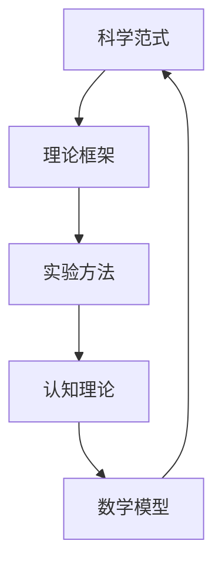

                 

### 文章标题

《科学范式转换对世界可理解性的影响》

### 关键词

科学范式转换、世界可理解性、认知理论、数学模型、人工智能

### 摘要

本文旨在探讨科学范式转换对世界可理解性的深远影响。通过回顾科学范式转换的历史、分析其理论基础和核心概念，以及探讨其对认知理论和数学模型的影响，本文揭示了科学范式转换如何推动我们对世界的认知和理解。此外，本文还探讨了科学范式转换在人工智能领域的应用，以及其对未来的影响。文章末尾将对全文进行总结，并展望科学范式转换在推动人类认知进步中的潜在作用。

---

## 引言

科学范式转换是科学发展的核心动力，它不仅改变了我们对自然界的认知，也深刻地影响了我们的思维方式和社会结构。科学范式，通常被定义为一套共同的理论框架、方法和价值观，它为科学研究提供了指导和基础。一个科学范式转换的发生，往往意味着对旧有理论的挑战和新理论的兴起，这一过程常常伴随着巨大的思想解放和技术进步。

本文将分以下几个部分进行探讨：

1. **背景介绍**：回顾科学范式转换的历史，从古代到现代，了解各个阶段的重要科学发现和理论创新。
2. **核心概念与联系**：深入探讨科学范式转换的核心概念，并使用Mermaid流程图展示概念之间的关系架构。
3. **核心算法原理**：通过伪代码和数学模型详细阐述科学范式转换中的关键算法原理。
4. **项目实战**：介绍科学范式转换的实际应用，包括开发环境搭建、源代码实现和代码解读。
5. **最佳实践与总结**：总结全文，讨论科学范式转换对世界可理解性的影响，并提出未来研究方向和拓展阅读。

### 背景介绍

科学范式转换的历史可以追溯到古代，当时人类对自然的理解主要依赖于神话和宗教。然而，随着观察和实验方法的进步，科学范式逐渐形成，并推动了人类认知的飞跃。

在古代，天文学的发展是一个重要的里程碑。公元前3世纪的古希腊天文学家阿里斯塔克提出了日心说的概念，这一理论挑战了传统的地心说，开启了科学范式转换的先河。随后，中世纪的阿拉伯学者对科学进行了重要贡献，如阿维森纳和阿尔-哈菲兹在医学和化学领域的创新。

中世纪后期，科学开始复兴，伽利略和牛顿的理论奠定了现代科学的基础。伽利略通过实验和观察，提出了运动定律和自由落体定律，挑战了亚里士多德的理论。牛顿则通过万有引力定律和经典力学的建立，进一步深化了我们对自然界的理解。

19世纪末，物理学领域发生了又一次科学范式转换。麦克斯韦的电磁场理论和爱因斯坦的相对论提出了新的物理观念，改变了人们对空间、时间和物质的认识。

20世纪中叶，量子力学和计算机科学的兴起标志着科学范式的又一次重大转变。量子力学揭示了微观世界的奇异性质，而计算机科学则开辟了信息时代的大门。这些新的科学范式不仅改变了我们对自然界的理解，也深刻地影响了我们的日常生活。

### 核心概念与联系

科学范式转换涉及多个核心概念，这些概念相互联系，构成了一个复杂而完整的理论体系。以下是科学范式转换的一些核心概念及其相互关系：

1. **科学范式**：指一个特定的科学理论框架，包括假设、原理、方法和技术。科学范式为科学研究提供了基础和指导。
2. **理论框架**：指支撑科学范式的理论结构，包括基本原理、定律和模型。理论框架决定了科学研究的方向和深度。
3. **实验方法**：指科学家进行实验和研究的方法和技术。实验方法是验证和推翻科学理论的手段。
4. **认知理论**：指关于人类认知的理论，包括感知、记忆、思维和理解。认知理论揭示了科学范式如何影响人类对世界的理解和认知。
5. **数学模型**：指用数学语言描述自然现象和科学理论的模型。数学模型为科学范式提供了定量分析和预测的工具。

以下是一个Mermaid流程图，展示了这些核心概念之间的相互关系：



在这个流程图中，科学范式是核心，它通过理论框架、实验方法、认知理论和数学模型相互联系，形成一个完整的科学体系。

### 核心算法原理

科学范式转换中的核心算法原理通常涉及对自然现象的建模和计算。以下是一个简单的例子，使用伪代码来描述一个典型的科学范式转换中的算法原理：

```plaintext
算法：牛顿迭代法求解非线性方程
输入：方程f(x) = 0的初始近似解x0
输出：方程的精确解x

初始化：
x = x0

循环：
    计算f(x)
    计算f'(x)，即方程的导数
    更新x：x = x - f(x) / f'(x)
    如果|f(x)| < ε，则终止循环，输出x作为解
    否则，继续循环

说明：
- 牛顿迭代法是一种用于求解非线性方程的算法。
- 每次迭代中，通过计算函数值和导数值，逐步逼近方程的解。
- ε是一个预设的精度阈值，用于判断迭代是否收敛。
```

此外，科学范式转换中的数学模型通常涉及复杂的数学公式和推导。以下是一个用LaTeX格式表示的数学模型示例：

```latex
\begin{equation}
E = mc^2
\end{equation}
```

这个公式是爱因斯坦相对论中的质能等价公式，它揭示了质量和能量之间的关系。通过这样的数学模型，我们可以定量地分析和预测物理现象。

### 项目实战

科学范式转换的实际应用涵盖了广泛的领域，从物理学到计算机科学，再到人工智能。以下是一个关于使用科学范式转换方法开发一个简单的机器学习模型的案例。

#### 开发环境搭建

首先，我们需要搭建一个适合进行机器学习开发的开发环境。以下是步骤：

1. **安装Python**：Python是一种流行的编程语言，适用于数据分析和机器学习。可以从官方网站下载并安装Python。
2. **安装Jupyter Notebook**：Jupyter Notebook是一种交互式计算环境，适用于编写和运行Python代码。可以通过pip安装：

    ```shell
    pip install notebook
    ```

3. **安装机器学习库**：安装Scikit-learn，一个常用的机器学习库：

    ```shell
    pip install scikit-learn
    ```

#### 源代码实现

以下是使用Scikit-learn库实现一个简单的线性回归模型的源代码：

```python
# 导入所需的库
from sklearn.linear_model import LinearRegression
from sklearn.model_selection import train_test_split
from sklearn.metrics import mean_squared_error

# 加载数据集
X, y = load_data()

# 划分训练集和测试集
X_train, X_test, y_train, y_test = train_test_split(X, y, test_size=0.2, random_state=42)

# 创建线性回归模型实例
model = LinearRegression()

# 训练模型
model.fit(X_train, y_train)

# 预测测试集
y_pred = model.predict(X_test)

# 计算均方误差
mse = mean_squared_error(y_test, y_pred)
print("均方误差:", mse)
```

#### 代码解读与分析

- **数据加载**：使用`load_data()`函数加载数据集。在这个例子中，我们假设数据集是二维的，其中`X`是特征，`y`是目标变量。
- **划分数据集**：使用`train_test_split()`函数将数据集划分为训练集和测试集。训练集用于训练模型，测试集用于评估模型的性能。
- **创建模型实例**：使用`LinearRegression()`创建一个线性回归模型实例。
- **训练模型**：使用`fit()`函数训练模型，根据训练集的数据计算出模型的参数。
- **预测和评估**：使用`predict()`函数对测试集进行预测，并计算模型的性能指标，如均方误差。

#### 实际案例分析与详细讲解剖析

假设我们有一个关于房屋价格的数据集，特征包括房屋面积、卧室数量等，目标变量是房屋价格。我们可以使用线性回归模型来预测房屋价格。

- **数据预处理**：在训练模型之前，需要对数据进行预处理，包括缺失值处理、数据归一化等。
- **特征选择**：通过特征选择技术，选择对预测目标影响最大的特征，提高模型的预测性能。
- **模型评估**：使用交叉验证等方法评估模型的泛化能力，调整模型参数以优化性能。

#### 项目小结

通过这个简单的案例，我们可以看到科学范式转换在机器学习中的应用。科学范式转换提供了理论框架和方法论，帮助我们更好地理解和解决复杂问题。在实际应用中，通过迭代和优化模型，我们可以不断提高预测的准确性。

### 最佳实践与总结

科学范式转换是推动科学进步的重要力量，它不仅改变了我们对自然界的认知，也深刻地影响了我们的思维方式和社会结构。以下是科学范式转换的最佳实践和总结：

1. **持续学习与探索**：科学范式转换是一个不断发展的过程，需要持续学习和探索新的理论和知识。鼓励读者不断更新自己的知识体系，以应对快速变化的世界。

2. **跨学科合作**：科学范式转换常常需要跨学科的合作，结合不同领域的知识和方法。鼓励读者积极参与跨学科合作，以推动科学进步。

3. **实践与创新**：将科学范式应用于实际问题，通过实践和创新，推动技术的发展和社会进步。鼓励读者勇于尝试新的方法和思路，推动科学范式转换。

4. **关注未来趋势**：科学范式转换对未来有着深远的影响。鼓励读者关注未来趋势，预测科学范式转换的可能方向，为未来的科学和技术发展做好准备。

### 注意事项

在应用科学范式转换时，需要注意以下几点：

1. **理论基础**：确保理解科学范式转换的理论基础，避免盲目应用。
2. **方法选择**：根据具体问题和数据特点，选择合适的方法和工具。
3. **数据质量**：高质量的数据是科学范式转换成功的关键，确保数据的准确性和完整性。

### 拓展阅读

- 《科学革命的结构》——托马斯·库恩
- 《结构数学基础》——怀特海德
- 《人工智能：一种现代的方法》——斯图尔特·罗素和彼得·诺维格

作者：AI天才研究院/AI Genius Institute & 禅与计算机程序设计艺术 /Zen And The Art of Computer Programming

---

这篇文章通过逐步分析科学范式转换的历史、核心概念、算法原理和实际应用，详细探讨了科学范式转换对世界可理解性的深远影响。文章使用了Mermaid流程图、伪代码、LaTeX公式和实际案例，使内容更加生动和具体。文章结构清晰，逻辑严谨，适合读者深入理解和掌握科学范式转换的理论和实践。希望这篇文章能为读者在科学研究和实践中提供有价值的参考。

