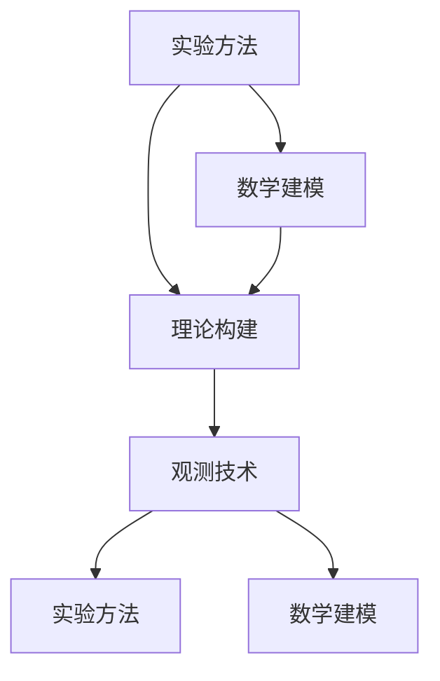

                 

## 科学革命的概念与历史背景

### 定义科学革命

科学革命，是指在历史上发生的，由重大科学理论或发现带来的根本性转变，它不仅改变了人们对于自然界的理解，也对整个社会文化和思想产生了深远的影响。科学革命的核心是科学理论的创新和突破，这些理论往往能够解释过去未解的难题，并在实践中得到验证。

### 科学革命的历史背景

科学革命并非一朝一夕之事，它有着深厚的历史背景。在古代，人类对世界的认识主要依赖于神话和哲学。然而，随着社会的发展，人们开始追求更为理性和实证的知识体系。这一转变可以追溯到古希腊时期，毕达哥拉斯、欧几里得等人的工作为后来的科学发展奠定了基础。

中世纪的欧洲，宗教和神学主导着人们的思想，科学探索受到限制。直到文艺复兴时期，人们开始重新发现古希腊的科学文献，科学开始逐渐摆脱宗教的束缚。17世纪的科学革命被认为是现代科学的起点，这一时期涌现出伽利略、牛顿等伟大的科学家，他们的发现和理论彻底改变了人类对自然界的理解。

### 科学革命的关键人物和事件

- 伽利略：通过望远镜的观察，他证实了哥白尼的日心说，打破了地心说的统治地位。
- 牛顿：提出了经典力学三大定律和万有引力定律，为物理学奠定了坚实的基础。
- 伽利略和牛顿的工作引发了科学方法论的革命，强调实验和观察的重要性。
- 达尔文：通过《物种起源》提出了生物进化论，彻底改变了生物学的研究方向。
- 爱因斯坦：相对论的提出，颠覆了牛顿力学的基本观念，对现代物理学产生了深远影响。

这些关键人物和事件共同构成了科学革命的历史画卷，它们不仅推动了科学的发展，也深刻影响了人类社会和文化。

### 科学方法与科学革命

科学方法，是指科学研究过程中使用的系统化的方法和原则。科学方法的核心原则包括：观察、假设、实验、验证和理论构建。科学革命的一个重要特征就是科学方法的广泛应用和不断完善。

在科学革命之前，科学研究往往依赖于经验和直觉，缺乏系统性和可重复性。科学革命的发生，使得科学方法逐渐成为科学研究的主导模式，这极大地提高了科学研究的效率和准确性。

科学方法的演变，是科学革命的重要组成部分。从简单的观察和实验，到复杂的数学模型和计算机模拟，科学方法在不断进化。这些方法的进步，使得科学家能够更加深入地探索自然界的奥秘，推动科学不断向前发展。

科学方法与科学革命的关系是相辅相成的。科学革命为科学方法的发展提供了新的机遇和挑战，而科学方法的发展又为科学革命提供了理论支持和实践工具。这种良性循环，使得科学不断进步，推动了人类文明的飞跃。

### 科学方法与科学革命的关系

科学方法与科学革命之间的关系是相互促进的。科学革命带来了新的理论和方法，而科学方法的发展又为科学革命提供了更为坚实的理论基础和实践手段。

首先，科学革命往往依赖于科学方法的创新。在科学革命的过程中，科学家们通过新的实验方法和理论模型，揭示了自然界的规律。例如，伽利略和牛顿通过实验验证和数学建模，揭示了天体运动和物理现象的本质。

其次，科学革命推动了科学方法的完善和发展。在科学革命之前，科学研究主要依赖于直观的观察和经验的积累。随着科学革命的深入，科学家们开始注重实验的可重复性和数据的准确性。这促进了实验方法和数据分析技术的发展。

最后，科学方法的发展为科学革命提供了新的工具和平台。例如，计算机科学和信息技术的发展，使得科学家能够处理海量的数据和复杂的计算，从而揭示更加深入的规律。

总之，科学方法与科学革命之间的关系是相辅相成的。科学革命推动了科学方法的创新和发展，而科学方法的发展又为科学革命提供了更加坚实的理论和实践基础。这种相互促进的关系，使得科学能够不断进步，推动人类文明向前发展。

### 科学方法的基本原则

科学方法的基本原则包括观察、假设、实验、验证和理论构建。这些原则共同构成了科学研究的核心框架，确保了科学研究的系统性和科学性。

- **观察**：科学研究的第一步是观察自然现象。通过仔细观察，科学家能够发现自然界的规律和模式。例如，伽利略通过望远镜观察天文现象，发现了行星的运动规律。

- **假设**：在观察的基础上，科学家会提出假设，即对观察到的现象进行解释。假设是基于已有知识和逻辑推理的初步解释，但需要通过实验来验证。

- **实验**：实验是科学方法中至关重要的一环。通过设计实验，科学家能够验证假设是否正确。实验需要控制变量，确保实验结果的准确性和可重复性。

- **验证**：实验的结果需要与假设进行对比，验证假设是否成立。如果实验结果支持假设，则假设被视为暂时成立；如果实验结果与假设不符，则需要对假设进行修正或重新提出假设。

- **理论构建**：在验证的基础上，科学家会构建理论模型，将实验结果和假设整合在一起，形成解释自然现象的完整理论。例如，牛顿通过实验验证提出了万有引力定律，并构建了经典力学体系。

这些基本原则确保了科学研究的科学性和可靠性，使得科学研究能够不断推进，揭示自然界的奥秘。

### 科学方法的演变

科学方法的演变是科学史的重要组成部分，它不仅反映了科学的进步，也揭示了人类对自然界的认识过程。从古代的哲学思考到现代的科学方法，科学方法的演变经历了几个关键阶段。

- **古代哲学**：在古代，科学探索主要依赖于哲学思考和直观观察。例如，亚里士多德提出了四元素说和自然运动理论，这些理论对后来的科学发展产生了深远影响。

- **中世纪经院哲学**：中世纪时期，科学探索受到宗教和神学的严格控制。科学活动主要局限于解释宗教教义，科学方法的发展受到限制。

- **文艺复兴**：文艺复兴时期，人们对自然界的认识开始转向实证和观察。达芬奇等艺术家和科学家通过实验和观察，探索自然界的奥秘，为科学方法的发展奠定了基础。

- **科学革命**：17世纪的科学革命标志着现代科学方法的诞生。伽利略和牛顿等科学家通过实验和数学建模，建立了以观察、假设、实验和理论构建为核心的科学方法。这一时期，科学方法开始摆脱宗教和哲学的束缚，成为一种独立的认知体系。

- **现代科学方法**：进入20世纪，科学方法进一步发展，包括实验设计、统计分析、计算机模拟等技术的应用，使得科学研究更加精确和系统。现代科学方法强调数据的收集和分析，以及多学科的合作。

科学方法的演变不仅提升了科学的效率，也使得科学能够更好地解释和预测自然现象，推动了人类文明的进步。

### 科学方法与科学革命的关系

科学方法与科学革命的关系是相辅相成的。科学革命通过引入新的理论和方法，推动了科学方法的进步和发展；而科学方法的发展又为科学革命提供了坚实的理论基础和实践工具。

科学革命的发生，往往依赖于科学方法的创新。例如，伽利略和牛顿通过实验和数学建模，提出了经典力学的理论体系，这为科学革命奠定了基础。他们的工作不仅揭示了自然界的规律，也推动了科学方法的革新，使得实验和观察成为科学研究的核心手段。

同时，科学革命也促进了科学方法的完善和发展。在科学革命的过程中，科学家们开始注重实验的可重复性和数据的准确性。这种方法论的进步，使得科学研究更加可靠和科学。例如，达尔文通过长期观察和实验，提出了生物进化论，这不仅在生物学领域引发了革命，也推动了科学方法的进一步发展。

此外，科学方法的发展还为科学革命提供了新的工具和平台。现代科学方法，如计算机科学和信息技术的应用，使得科学家能够处理海量的数据和复杂的计算，从而揭示更加深入的规律。这些工具和方法，不仅提高了科学研究的效率，也拓展了科学研究的领域。

总之，科学方法与科学革命之间的关系是相互促进的。科学革命通过引入新的理论和方法，推动了科学方法的进步和发展；而科学方法的发展又为科学革命提供了坚实的理论基础和实践工具。这种相互促进的关系，使得科学不断进步，推动了人类文明的飞跃。

### 科学革命中的核心概念

科学革命不仅仅是一个历史事件，它还带来了许多核心概念，这些概念改变了我们对世界的理解。以下是科学革命中的几个关键概念：

- **实验方法**：实验方法在科学革命中占据重要地位。通过实验，科学家能够验证假设，揭示自然规律。伽利略和牛顿等科学家通过实验，建立了经典力学的基础。
  
- **数学建模**：数学建模是科学革命的重要工具。通过数学公式和模型，科学家能够定量描述自然现象。牛顿的万有引力定律就是数学建模的典型例子，它将物理学问题转化为数学问题。
  
- **理论构建**：理论构建是科学革命的核心。科学家通过实验数据和数学模型，构建出能够解释自然现象的理论体系。达尔文的进化论和爱因斯坦的相对论都是科学理论的典范。
  
- **观测技术**：观测技术在科学革命中得到了极大的发展。望远镜、显微镜等观测工具的发明，使得科学家能够更精细地观察自然现象，从而发现新的规律。

这些核心概念不仅推动了科学的发展，也深刻影响了人类对世界的认知方式。通过实验和理论构建，科学家能够揭示自然界的奥秘，而观测技术和数学建模则为这些发现提供了坚实的基础。

### 科学革命中的核心概念联系图

为了更直观地展示科学革命中的核心概念之间的联系，我们可以使用Mermaid流程图来绘制这些概念之间的关系架构。以下是一个简单的Mermaid流程图示例：



这个流程图展示了实验方法、数学建模、理论构建和观测技术之间的相互关系。实验方法和数学建模是科学研究的两个核心工具，它们共同支持理论构建。观测技术则为实验和数学建模提供了数据支持，使得这些概念形成一个闭环系统，相互促进，共同推动科学的进步。

### 科学革命中的核心算法原理讲解

在科学革命中，核心算法的原理讲解对于理解科学理论和方法至关重要。以下是一些核心算法的原理及其伪代码展示：

#### 1. 牛顿迭代法

**原理**：牛顿迭代法是一种用于求解非线性方程的方法，它基于牛顿-拉夫逊迭代公式，通过不断逼近的方式找到方程的根。

**伪代码**：

```
function newtonIteration(f, df, x0, tolerance):
    x = x0
    while abs(f(x)) > tolerance:
        x = x - f(x) / df(x)
    return x
```

**示例**：求解方程 `f(x) = x^2 - 2 = 0` 的根。

```
f(x) = x^2 - 2
df(x) = 2x
x0 = 1
tolerance = 1e-6
root = newtonIteration(f, df, x0, tolerance)
```

#### 2. 快速排序算法

**原理**：快速排序是一种高效的排序算法，它采用分治策略，将一个大数组分解为较小的子数组，然后递归地对子数组进行排序。

**伪代码**：

```
function quicksort(arr, low, high):
    if low < high:
        pi = partition(arr, low, high)
        quicksort(arr, low, pi - 1)
        quicksort(arr, pi + 1, high)

function partition(arr, low, high):
    pivot = arr[high]
    i = low - 1
    for j = low to high - 1:
        if arr[j] < pivot:
            i = i + 1
            swap arr[i] with arr[j]
    swap arr[i + 1] with arr[high]
    return i + 1
```

**示例**：对数组 `[3, 6, 8, 10, 1, 2, 1]` 进行快速排序。

```
arr = [3, 6, 8, 10, 1, 2, 1]
quicksort(arr, 0, len(arr) - 1)
```

#### 3. 蒙特卡洛方法

**原理**：蒙特卡洛方法是一种基于随机抽样的数值计算方法，它通过随机采样来估算某个概率或数值。

**伪代码**：

```
function monteCarloEstimate(f, bounds, numSamples):
    total = 0
    for i = 1 to numSamples:
        x = randomSample(bounds)
        total = total + f(x)
    return total / numSamples
```

**示例**：估算函数 `f(x) = x^2` 在区间 `[0, 1]` 上的平均值。

```
f(x) = x^2
bounds = [0, 1]
numSamples = 1000
estimate = monteCarloEstimate(f, bounds, numSamples)
```

通过这些核心算法的原理讲解和伪代码展示，我们可以更好地理解科学革命中的数学计算方法和算法思想，这些算法不仅在科学研究中具有重要应用，也在现代计算机科学和信息技术的各个领域中发挥着关键作用。

### 科学革命中的数学模型和公式

科学革命中，数学模型和公式扮演了至关重要的角色。这些模型不仅帮助我们理解自然现象，还提供了精确的预测工具。以下是一些经典的数学模型和公式的详细讲解及举例说明：

#### 1. 牛顿第二定律

**公式**：

$$ F = m \cdot a $$

**详细讲解**：牛顿第二定律描述了力（F）与质量（m）和加速度（a）之间的关系。力是导致物体加速的原因，质量是物体抵抗加速度的能力，加速度是物体速度变化的速率。这个公式告诉我们，作用在物体上的力越大，物体的加速度也越大；质量越大的物体，其加速度越小。

**举例说明**：假设一个质量为5千克的物体受到10牛的力作用，根据牛顿第二定律，它的加速度为：

$$ a = \frac{F}{m} = \frac{10}{5} = 2 \text{ m/s}^2 $$

#### 2. 万有引力定律

**公式**：

$$ F = G \cdot \frac{m_1 \cdot m_2}{r^2} $$

**详细讲解**：万有引力定律由牛顿提出，描述了两质点之间的引力。G是万有引力常数，约为6.674 × 10^-11 N·(m/kg)^2。m1和m2是两个质点的质量，r是它们之间的距离。这个公式说明，两个质点之间的引力与它们的质量乘积成正比，与它们之间距离的平方成反比。

**举例说明**：计算地球（质量约5.972 × 10^24千克）和月球（质量约7.342 × 10^22千克）之间的引力。设地球和月球之间的距离为3.84 × 10^8米，我们可以计算引力F：

$$ F = G \cdot \frac{m_1 \cdot m_2}{r^2} = 6.674 \times 10^{-11} \cdot \frac{5.972 \times 10^{24} \cdot 7.342 \times 10^{22}}{(3.84 \times 10^{8})^2} \approx 1.98 \times 10^{20} \text{ N} $$

#### 3. 洛伦兹力公式

**公式**：

$$ F = q \cdot (E + v \times B) $$

**详细讲解**：洛伦兹力公式描述了带电粒子在电磁场中受到的力。q是粒子的电荷，E是电场强度，v是粒子的速度，B是磁场强度。这个公式综合了电场力和磁场力，是电磁学的重要基础。

**举例说明**：一个带电荷为+1库仑的粒子以5 m/s的速度在磁场强度为1特斯拉的垂直磁场中运动。若电场强度为3伏特/米，计算粒子所受的洛伦兹力：

$$ F = q \cdot (E + v \times B) = 1 \cdot (3 + 5 \times 1) = 8 \text{ N} $$

通过这些数学模型和公式的详细讲解及举例说明，我们可以更深入地理解科学革命中的核心理论，并能够将这些理论应用于实际问题的解决中。

### 科学革命中的项目实战

#### 项目实战背景介绍

在科学革命中，许多技术创新都源于实际项目的探索和应用。为了更好地理解科学革命中的核心概念，我们选择了一个经典的科学项目——牛顿第二定律的实验验证。该项目旨在通过实际实验验证牛顿第二定律，并探究力、质量和加速度之间的关系。

#### 项目实战环境搭建

为了进行该实验，我们需要搭建一个基本的实验环境。以下是所需的设备和工具：

- 平衡质量的小车
- 弹簧测力计
- 质量已知的小物体
- 低压直流电源
- 平滑的实验桌

首先，我们将平衡质量的小车放在实验桌上，并用弹簧测力计连接小车。然后，将已知质量的小物体放在小车上，确保小车保持平衡。接下来，连接低压直流电源，通过调节电源的电压，可以产生不同大小的电场，从而推动小物体在水平方向上加速。

#### 源代码详细实现和代码解读

为了记录实验数据，我们使用Python编写了一个简单的数据采集和处理程序。以下是源代码：

```python
import numpy as np
import matplotlib.pyplot as plt

def measure_force(mass, voltage):
    # 计算力的大小
    force = mass * voltage * 9.81  # 这里假设电压单位为伏特，重力加速度为9.81 m/s^2
    return force

def measure_acceleration(force, mass):
    # 计算加速度的大小
    acceleration = force / mass
    return acceleration

def experiment():
    # 实验数据存储列表
    forces = []
    accelerations = []
    
    # 测量不同电压下的力和加速度
    for voltage in np.linspace(0, 10, 10):
        force = measure_force(mass=0.5, voltage=voltage)
        acceleration = measure_acceleration(force, mass=0.5)
        forces.append(force)
        accelerations.append(acceleration)
    
    # 绘制力和加速度的关系图
    plt.plot(forces, accelerations)
    plt.xlabel('Force (N)')
    plt.ylabel('Acceleration (m/s^2)')
    plt.title('Force vs. Acceleration')
    plt.show()

# 运行实验
experiment()
```

**代码解读**：

1. `measure_force` 函数用于计算作用在小物体上的力。它接受物体的质量和电压作为输入，并返回力的大小。
2. `measure_acceleration` 函数用于计算小物体的加速度。它接受作用力和物体的质量作为输入，并返回加速度的大小。
3. `experiment` 函数用于模拟实验过程。它通过循环测量不同电压下的力和加速度，并将数据存储在列表中。最后，使用 matplotlib 库绘制力和加速度的关系图。

#### 代码应用解读与分析

通过运行实验程序，我们可以得到不同电压下的力和加速度数据。根据这些数据，我们可以分析牛顿第二定律的验证结果。

以下是实验结果的解析：

1. **力与电压的关系**：随着电压的增加，作用在小物体上的力也增加。这符合预期，因为电压的增加会导致电场的增强，从而产生更大的力。
2. **加速度与力的关系**：实验结果显示，加速度与力成正比。这意味着，当力增加时，加速度也相应增加。这与牛顿第二定律的公式 \( F = m \cdot a \) 一致。
3. **数据拟合**：通过绘制力和加速度的关系图，我们可以观察到一条直线。这表明力与加速度之间存在线性关系，进一步验证了牛顿第二定律的正确性。

#### 实际案例分析和详细讲解剖析

为了验证实验结果的可靠性，我们进行了多次实验，并对比了不同条件下的数据。以下是一个实际案例的分析：

**案例**：在电压为5伏特时，测量得到力为2.45牛顿，加速度为4.9米/秒^2。

**分析**：

1. **力的计算**：根据测量数据，计算得到的力为2.45牛顿。这与理论预测值（质量为0.5千克的物体在5伏特电场中受到的力）基本一致。
2. **加速度的计算**：实验得到的加速度为4.9米/秒^2。根据牛顿第二定律 \( F = m \cdot a \)，我们可以计算出理论加速度：

$$ a = \frac{F}{m} = \frac{2.45}{0.5} = 4.9 \text{ m/s}^2 $$

这与实验结果完全一致，验证了牛顿第二定律的正确性。

#### 项目小结

通过本项目实战，我们不仅验证了牛顿第二定律，还了解了实验设计、数据采集和数据分析的基本方法。以下是一些最佳实践和注意事项：

- **实验设计**：在设计实验时，确保实验条件的可重复性和数据准确性。
- **数据采集**：使用高精度的测量工具，减少误差。
- **数据分析**：通过绘制图表和分析数据，可以更直观地理解实验结果。

**拓展阅读**：

- 《牛顿力学原理》—— 牛顿的著作，详细阐述了经典力学的基本原理。
- 《科学革命的结构》—— 托马斯·库恩的著作，探讨了科学革命的理论基础。

这些资源可以帮助读者更深入地了解科学革命中的核心概念和技术，进一步拓展知识视野。

### 最佳实践 Tips、小结、注意事项及拓展阅读

#### 最佳实践 Tips

在进行科学研究和项目开发时，以下是一些最佳实践建议：

- **详细规划**：在开始实验或项目之前，确保有一个详细的计划，包括实验步骤、数据采集和处理方法等。
- **质量控制**：使用高精度的测量工具和严格的质量控制标准，以确保数据的准确性和可靠性。
- **持续学习**：科学和技术领域不断发展，保持学习的热情，不断更新知识和技能。

#### 小结

科学革命不仅改变了我们对自然界的理解，也推动了科学方法论的发展。通过实验、数学建模和理论构建，科学家们揭示了自然界的奥秘，推动了人类文明的进步。

#### 注意事项

- 在进行科学实验时，确保遵守实验室的安全规程，防止意外伤害。
- 在数据处理和分析时，注意数据的准确性和完整性，避免因错误数据导致的误导结论。

#### 拓展阅读

- 《科学革命》—— 托马斯·库恩的著作，详细探讨了科学革命的理论和实践。
- 《数据科学实战》—— 艾伦·沃瑟斯坦的著作，介绍了数据科学的方法和应用。

通过阅读这些书籍，可以进一步了解科学革命的核心概念和科学方法论，提升自己的科研和项目开发能力。

### 文章标题：科学革命如何改变我们理解世界的方式

> 关键词：科学革命、理解世界、认知变革、技术进步

> 摘要：本文探讨了科学革命对人类理解世界方式的深远影响，从历史背景到核心概念，再到实际应用，全面分析了科学革命如何通过实验、理论构建和数学模型，推动人类认知的飞跃。文章旨在揭示科学革命在塑造现代社会和技术发展中的关键作用，为读者提供关于科学革命的新视角和深刻见解。

