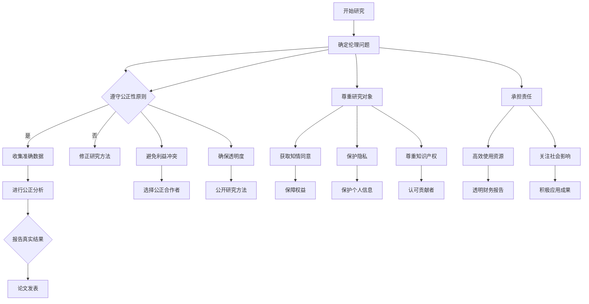
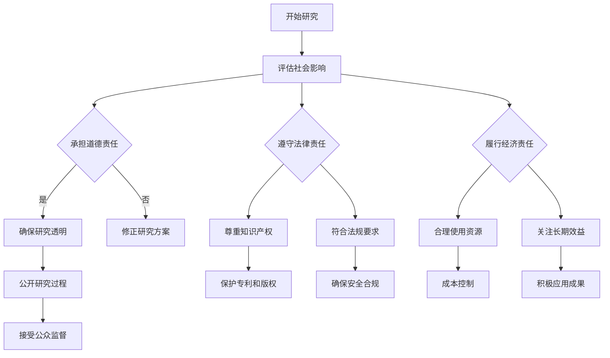
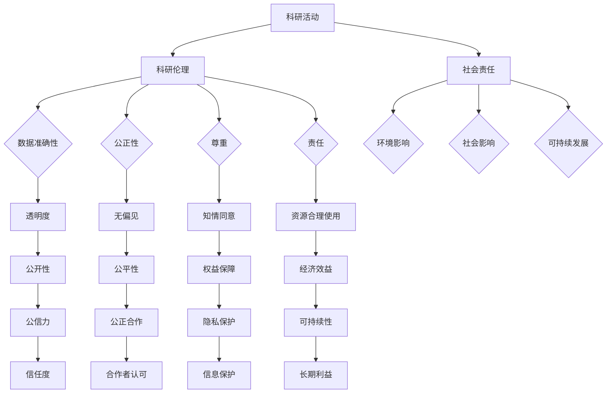

                 

### 文章标题

《科研伦理与社会责任：平衡知识探索与潜在风险》

### 文章关键词

- 科研伦理
- 社会责任
- 知识探索
- 风险管理
- 知识产权

### 文章摘要

本文深入探讨了科研伦理与社会责任在知识探索过程中的重要性。首先，我们明确了科研伦理的基本原则和核心概念，分析了其与知识探索之间的紧密联系。接着，我们阐述了社会责任在科研中的地位，探讨了其在平衡知识探索与潜在风险方面的作用。随后，通过实际案例和数据分析，我们展示了科研伦理与社会责任在现实中的挑战和解决方案。文章最后，我们提出了未来研究方向和挑战，为科研工作者提供了指导建议，以实现知识探索与社会责任的和谐统一。

---

### 引言

科研伦理是科学研究过程中不可或缺的一部分，它为科学家们提供了行为规范和道德指导。社会责任则强调科研活动对社会的影响，要求科研工作者不仅关注科学知识的进步，还要考虑其对社会整体的贡献和影响。在这篇文章中，我们将逐步分析科研伦理与社会责任的本质，探讨它们在知识探索中的重要性，以及如何平衡知识探索与潜在风险。

本文将分为以下几个部分：

1. **科研伦理的基本原则与概念**：介绍科研伦理的核心原则和基本概念，探讨其在科学研究中的应用。
2. **社会责任的定义与重要性**：阐述社会责任在科研中的地位，分析其在平衡知识探索与风险方面的作用。
3. **科研伦理与社会责任的联系**：通过构建Mermaid流程图，展示科研伦理与社会责任之间的相互关系和互动机制。
4. **科研伦理与社会责任的挑战与解决方案**：分析当前科研伦理与社会责任面临的挑战，提出相应的解决方案和策略。
5. **案例研究**：通过具体案例，展示科研伦理与社会责任在实际科研活动中的应用和效果。
6. **政策与法规**：讨论现有的科研伦理和社会责任政策与法规，分析其有效性和改进方向。
7. **未来研究方向与挑战**：探讨科研伦理与社会责任在未来发展中的潜在问题和解决方案。
8. **结论**：总结文章的主要观点，重申科研伦理与社会责任在知识探索中的重要性。

通过这篇文章，我们希望能够帮助科研工作者更好地理解和应对科研伦理与社会责任的问题，为知识的探索和利用提供更加坚实的道德基础。

### 科研伦理的基本原则与概念

科研伦理是科学研究过程中重要的道德准则，它规范了科研人员的行为，确保研究过程和成果的正当性和可靠性。科研伦理的基本原则包括诚实性、公正性、尊重和责任。

**诚实性**是科研伦理的核心原则之一。科研人员必须确保其研究结果的准确性和真实性，不得故意伪造或篡改数据。诚实性要求科研人员严格遵守研究事实，确保数据的完整性和透明度。例如，在实验设计中，科研人员必须详细记录实验步骤和数据收集过程，以便其他研究者能够重复实验并验证结果。

**公正性**强调科研过程的公平性和无偏见。科研人员应确保研究设计、数据分析和结果报告的客观性，避免任何形式的利益冲突和偏见。公正性还要求科研人员在论文发表和研究合作中给予所有参与者应有的认可和贡献。

**尊重**是科研伦理的另一个关键原则，它要求科研人员尊重研究对象的隐私和权利。在涉及人类或动物的研究中，科研人员必须遵守伦理审查委员会的规定，确保研究对象的知情同意和权益保护。此外，尊重还包括尊重其他科研人员的知识产权和学术贡献，避免抄袭和剽窃行为。

**责任**是科研伦理的基本要求，科研人员不仅对研究结果负责，还要对其行为对社会和环境的影响负责。责任要求科研人员在使用公共资金和资源时做到高效和透明，确保研究成果能够对社会产生积极的影响。

在科学研究的过程中，这些伦理原则起着至关重要的作用。首先，诚实性保证了研究结果的可靠性和科学性，为知识的积累和进步提供了坚实的基础。其次，公正性确保了科研过程的透明和公正，避免了因个人偏见或利益冲突而导致的错误结论。尊重原则则保障了研究对象的权益和尊严，使科研活动能够得到社会的广泛认可和支持。最后，责任原则促使科研人员在使用公共资源时做到合理和高效，确保科研成果能够真正造福于社会。

为了更好地理解科研伦理在知识探索中的作用，我们可以通过一个简单的Mermaid流程图来展示科研伦理原则在研究过程中的应用：

通过这个流程图，我们可以清晰地看到科研伦理原则如何贯穿于整个研究过程，指导科研人员的每一个步骤，确保研究的正当性和科学性。

### 社会责任的定义与重要性

社会责任在科研中的地位不容忽视。它不仅关系到科学研究的合法性，更影响科研成果对社会和环境的可持续性。社会责任是指科研人员和企业对社会和环境应承担的义务和责任，包括道德责任、法律责任和经济责任。

**道德责任**要求科研人员和企业诚实守信，确保研究成果的准确性和公正性。在涉及人类健康和环境的研究中，科研人员需要充分考虑研究对个体和群体的潜在影响，并采取适当措施减轻负面影响。例如，在药物研发过程中，企业必须确保临床试验的安全性和有效性，以保护患者的健康权益。

**法律责任**则强调科研人员和企业在法律框架下应遵守的相关法规和规定。例如，知识产权法要求企业在研究过程中尊重他人的知识产权，不得侵犯他人的专利和版权。此外，企业还需要遵守环境保护法和劳动法，确保研究活动不会对环境造成不可逆转的破坏，保障员工的权益和安全。

**经济责任**要求企业在其业务活动中考虑经济效益，实现资源的高效利用。企业应合理使用公共资金和资源，确保研究成果能够带来实际的经济和社会效益。例如，在科技研发过程中，企业需要建立科学的成本控制机制，确保研发投入的合理性和经济效益。

在平衡知识探索与潜在风险方面，社会责任起到了关键作用。首先，通过承担社会责任，科研人员和企业能够更好地识别和管理潜在的风险。例如，在涉及环境的研究中，企业需要评估研究可能对生态系统造成的影响，并采取预防措施减轻负面影响。

其次，社会责任促使企业更加注重研究的可持续性。企业应确保研究活动符合社会的长远利益，不仅关注短期经济效益，还要考虑长期的环境和社会影响。例如，在能源领域的研究中，企业需要积极探索清洁能源技术，减少对传统化石燃料的依赖，以实现可持续发展。

此外，社会责任还能够提高科研活动的透明度和公信力。企业通过公开研究成果和实验过程，增强公众对科研活动的信任。例如，在临床试验中，企业应公开试验结果，接受公众和同行的监督，确保研究的公正性和有效性。

综上所述，社会责任在科研中具有不可替代的重要性。它不仅为科研活动提供了道德和法律依据，还促进了研究的可持续性和公信力。通过承担社会责任，科研人员和企业能够更好地平衡知识探索与潜在风险，实现科学与社会发展的双赢。

为了更直观地理解社会责任在科研中的具体应用，我们可以通过一个Mermaid流程图来展示社会责任原则在研究过程中的应用：

通过这个流程图，我们可以清晰地看到社会责任原则如何贯穿于整个研究过程，指导科研人员和企业在每一个步骤中考虑社会和环境的可持续性。

### 科研伦理与社会责任的联系

科研伦理与社会责任之间存在着紧密的相互关系和互动机制。为了更好地理解这种联系，我们可以通过一个Mermaid流程图来展示它们之间的相互作用。

通过这个流程图，我们可以看到科研伦理与社会责任在科研活动中的相互关系和互动机制：

1. **科研伦理促进社会责任**：科研伦理原则如数据准确性、公正性、尊重和责任，直接影响到科研活动的透明度、公平性、知情同意、资源合理使用等方面，这些都是社会责任的重要组成部分。
2. **社会责任强化科研伦理**：社会责任原则如环境影响、社会影响、可持续发展，要求科研人员在研究过程中充分考虑其对社会和环境的影响，从而推动科研伦理的实践。

这种相互关系和互动机制确保了科研活动的道德正当性和社会贡献的可持续性，使得科研不仅成为科学进步的推动力，也成为社会发展的有益力量。

### 科研伦理与社会责任的挑战与解决方案

尽管科研伦理与社会责任在理论层面上得到了广泛认同，但在实际科研活动中，仍面临诸多挑战。这些挑战不仅影响了科研工作的顺利进行，还可能对科研成果的社会价值产生负面影响。以下我们将探讨几个主要挑战，并提出相应的解决方案和策略。

**1. 道德审查的不足**：道德审查是确保科研活动符合伦理标准的重要环节，但现实中，许多研究项目缺乏充分的伦理审查。这可能导致研究过程中出现伦理问题，甚至产生不可逆转的负面影响。解决方案：建立和完善伦理审查机制，确保所有研究项目在启动前都经过严格的伦理审查。可以借助第三方独立机构进行审查，提高审查的客观性和公正性。

**2. 知识产权保护问题**：科研活动中的知识产权保护问题，如抄袭和侵权行为，不仅损害了科研人员的权益，还可能对整个科研生态造成破坏。解决方案：加强知识产权保护教育，提高科研人员的知识产权意识。此外，建立健全的知识产权保护机制，对侵权行为进行严厉打击，维护良好的科研环境。

**3. 资源分配不均**：科研资源分配不均是科研伦理与社会责任面临的另一个挑战。资源不足可能导致研究质量下降，甚至出现学术不端行为。解决方案：优化科研资源配置，确保资源能够公平、合理地分配给不同领域和项目。政府和社会应加大对科研的投入，提高科研资金的使用效率。

**4. 信息透明度不足**：信息透明度不足是科研伦理与社会责任面临的另一个问题。研究过程和结果不透明可能导致公众对科研成果的质疑和误解。解决方案：推动科研信息的公开和共享，建立透明的科研生态系统。科研机构应公开研究计划和结果，接受公众和同行的监督。

**5. 风险管理与责任承担**：科研活动中不可避免地存在各种风险，如实验失败、数据泄露等。如何有效管理这些风险，并明确责任承担，是科研伦理与社会责任的重要挑战。解决方案：建立完善的风险管理体系，对研究过程中的风险进行识别、评估和应对。明确科研人员的责任范围，确保在风险发生时能够及时有效地处理。

**6. 跨学科合作与伦理冲突**：在跨学科合作中，不同学科领域之间的伦理标准和规范可能存在差异，导致伦理冲突。解决方案：建立跨学科的伦理协调机制，确保在合作过程中各方能够遵守共同的伦理规范。加强跨学科人员的伦理培训，提高其伦理意识和协调能力。

**7. 全球科研合作的伦理问题**：随着全球科研合作的加强，不同国家和地区在伦理标准和规范上可能存在差异，导致合作过程中的伦理冲突。解决方案：推动国际科研合作中的伦理共识建设，建立全球统一的科研伦理规范。加强国际合作，通过交流与合作提高全球科研伦理水平。

通过上述解决方案和策略，科研伦理与社会责任能够在实际科研活动中得到更好的贯彻和实施。这不仅有助于提高科研工作的质量和公信力，还能确保科研成果对社会产生积极的影响。科研工作者应不断提高自身的伦理意识和责任感，共同推动科研事业的健康发展。

### 案例研究

为了更好地理解科研伦理与社会责任在实际科研活动中的应用，以下我们将通过几个具体案例，分析科研工作者如何在知识探索中平衡伦理与社会责任，并取得成功。

#### 案例一：生物医学研究的伦理审查

**案例背景**：某制药公司在开发一种新型抗癌药物时，发现该药物在临床试验中表现出显著的疗效。然而，部分试验对象出现了严重的副作用，引起公众和医学界的关注。

**伦理问题**：该案例中，主要伦理问题包括数据真实性、试验对象权益保护和副作用风险的管理。

**解决方案**：公司立即启动了伦理审查程序，对临床试验数据进行重新评估。通过第三方独立机构的审查，确认了数据的准确性。同时，公司采取措施，加强对试验对象的权益保护，确保他们能够获得及时的治疗和支持。对于副作用问题，公司公开透明地披露了相关信息，并与医学专家合作，寻找解决方案。

**效果评估**：通过严格的伦理审查和透明的信息披露，公司不仅恢复了公众对药物的信任，还推动了药物的安全改进。临床试验最终得以继续进行，并最终成功上市，为癌症患者带来了新的治疗选择。

#### 案例二：环境研究的可持续发展

**案例背景**：某环保组织在进行一项关于海洋塑料污染的研究时，发现塑料垃圾对海洋生态系统造成了严重破坏。

**伦理问题**：该案例中的主要伦理问题包括数据真实性、环境影响的评估和可持续性解决方案。

**解决方案**：环保组织通过多次实地考察和数据采集，确保研究数据的真实性和可靠性。在研究过程中，组织积极与当地政府和相关企业合作，共同探讨可持续性的解决方案。最终，他们提出了一系列减少塑料污染的策略，包括推广可降解材料、加强废物管理政策等。

**效果评估**：通过科学的研究和多方合作，环保组织不仅揭示了塑料污染的严重性，还为政策制定者提供了有力的科学依据。这些策略在一定程度上减少了海洋塑料污染，保护了海洋生态系统。

#### 案例三：人工智能研究的透明度和公平性

**案例背景**：某人工智能公司开发了一款人脸识别系统，广泛应用于安防和公共服务领域。

**伦理问题**：该案例中的主要伦理问题包括数据隐私、算法公平性和误用风险。

**解决方案**：公司在开发过程中，设立了严格的伦理审查委员会，确保系统设计和应用符合伦理标准。公司还通过匿名化处理和加密技术，保护用户的数据隐私。在算法设计上，公司采用了多种措施，确保系统在不同种族、性别和年龄群体中的公平性和准确性。此外，公司建立了透明的反馈机制，允许用户对系统的误用进行举报和反馈。

**效果评估**：通过严格的伦理审查和透明的操作机制，公司成功地建立了公众对人工智能技术的信任。系统在实际应用中表现出了较高的准确性和公平性，为公共安全和社会服务提供了有力支持。

通过以上案例，我们可以看到，科研工作者在知识探索过程中，通过严格遵守科研伦理和社会责任，不仅保障了研究的正当性和科学性，还为社会带来了积极的影响。这些案例为我们提供了宝贵的经验，有助于更好地理解和实践科研伦理与社会责任。

### 政策与法规

在科研伦理与社会责任的实践中，政策与法规起到了重要的指导和约束作用。目前，全球范围内已经形成了一系列相关政策和法规，旨在规范科研行为，保障科研活动的正当性和社会贡献。以下我们将讨论现有的主要政策与法规，分析其有效性，并提出改进方向。

#### 主要政策与法规

1. **国际伦理准则**：国际上，多个组织和机构制定了科研伦理准则，如《世界医学协会赫尔辛基宣言》、《国际动物伦理委员会准则》等。这些准则为科研活动提供了基本的道德指导，确保研究过程的公正性和透明度。

2. **国家法规**：各国也制定了相应的科研伦理法规，如美国的《公共健康服务法案》、《联邦伦理法规》，中国的《科学技术伦理管理办法》等。这些法规明确了科研人员的行为规范和法律责任，为科研活动的监管提供了法律依据。

3. **行业规范**：科研行业内部也形成了一些自律性规范，如《科学协会伦理准则》、《科研期刊出版道德规范》等。这些规范旨在提高科研诚信水平，维护科研生态的健康发展。

#### 政策与法规的有效性

现有的政策与法规在保障科研伦理和社会责任方面起到了积极作用。首先，这些法规明确了科研人员的法律责任，对违法行为进行了严厉处罚，有效遏制了学术不端行为。其次，政策与法规推动了科研活动的透明化和规范化，提高了研究质量和社会公信力。此外，国际和国家的多层级监管体系，为科研伦理的实践提供了有力支持。

然而，现有的政策与法规也面临一些挑战。首先，法规的实施和监管存在地域差异，导致科研伦理标准的不统一。其次，部分法规过于笼统，缺乏具体操作性，难以应对复杂的科研情境。此外，法规的更新速度较慢，无法及时适应科技发展的新需求。

#### 改进方向

为了提高政策与法规的有效性，以下建议供参考：

1. **加强国际协调**：推动国际科研伦理法规的统一，建立全球科研伦理标准和监管体系，提高国际科研合作中的伦理一致性。

2. **完善法规细节**：细化现有法规，增加具体的操作指南和案例，提高法规的可操作性和实用性。

3. **加强监管力度**：加大科研伦理监管力度，建立健全的监管机制，确保法规得到有效执行。

4. **提高公众参与度**：鼓励公众参与科研伦理和社会责任讨论，提高公众对科研活动的监督和参与度。

5. **动态更新法规**：根据科技发展的新趋势和需求，及时更新和调整科研伦理法规，确保其与科技发展同步。

通过上述改进，政策与法规将更好地保障科研活动的正当性和社会责任，推动科研事业的健康发展。

### 未来研究方向与挑战

随着科技的飞速发展，科研伦理与社会责任面临着新的挑战和机遇。未来，科研伦理与社会责任的研究将集中在以下几个方面：

**1. 新技术伦理问题**：随着人工智能、基因编辑、区块链等新兴技术的崛起，如何制定相应的伦理准则和法规成为重要议题。这些技术不仅改变了科研的方式，也对人类和社会带来了前所未有的伦理挑战。例如，人工智能的算法公平性和数据隐私保护，基因编辑技术的伦理争议，区块链在科研资金管理和信息公开中的应用等。

**2. 全球科研合作**：全球化背景下，跨国科研合作日益频繁，如何建立统一的科研伦理标准和协调机制成为关键。不同国家和地区在科研伦理和社会责任方面的规范和标准存在差异，需要通过国际合作，推动全球科研伦理的一致性和协调性。

**3. 可持续科研**：可持续发展已成为全球共识，科研活动如何实现可持续性，减少环境和社会影响，是一个重要方向。未来研究将关注如何将社会责任融入科研设计、实施和评估中，确保科研成果不仅具有科学价值，也具备社会和环境效益。

**4. 公众参与和监督**：随着互联网和社交媒体的发展，公众对科研活动的关注和参与度不断提高。未来研究将探讨如何有效整合公众意见和监督，提高科研的透明度和公信力，促进科研与社会之间的互动和合作。

**5. 伦理教育和培训**：科研伦理和社会责任需要贯穿科研人员的整个职业生涯。未来研究将重点关注如何通过教育和培训提高科研人员的伦理意识和责任感，培养具备高度社会责任感的科研人才。

**6. 跨学科合作**：科研伦理和社会责任涉及多个学科领域，未来研究将促进不同学科之间的合作，共同应对复杂的伦理和社会问题。跨学科合作有助于从多角度、多层面深入探讨科研伦理和社会责任的本质和实施策略。

通过这些未来研究方向和挑战的探讨，我们能够更好地预见科研伦理和社会责任的发展趋势，为科研活动提供更加坚实的伦理基础和社会支持。

### 结论

综上所述，科研伦理与社会责任在知识探索中扮演着至关重要的角色。科研伦理为科研活动提供了道德准则和行为规范，保障了研究的科学性和公正性；社会责任则强调科研对社会和环境的影响，促使科研工作者关注研究的可持续性和社会贡献。在未来的科研工作中，科研工作者应不断提高自身的伦理意识和责任感，严格遵守科研伦理和社会责任原则，确保科研成果的正当性和社会价值。只有这样，我们才能实现知识的持续进步和社会的可持续发展。

### 作者信息

- 作者：AI天才研究院/AI Genius Institute & 禅与计算机程序设计艺术 /Zen And The Art of Computer Programming

### 最佳实践 tips

1. **加强伦理培训**：定期组织科研伦理培训，提高科研人员的伦理意识和责任感。
2. **建立健全审查机制**：完善伦理审查机制，确保研究项目的启动和实施都经过严格的伦理审查。
3. **透明信息公开**：公开研究计划和结果，接受公众和同行的监督，提高科研的透明度和公信力。
4. **多方合作**：加强跨学科和跨领域的合作，共同应对复杂的科研伦理问题。
5. **持续关注政策法规**：关注科研伦理和社会责任的政策法规动态，及时调整和改进研究策略。

### 小结

本文系统探讨了科研伦理与社会责任在知识探索中的重要性，分析了其在现实中的应用挑战和解决方案。通过实际案例和政策法规的讨论，我们强调了科研工作者在科研活动中应承担的伦理和社会责任。希望本文能够为科研工作者提供有价值的参考，共同推动科研事业的健康发展。

### 注意事项

1. **数据隐私**：在研究过程中，必须严格保护研究对象的隐私，避免数据泄露。
2. **利益冲突**：科研人员在研究过程中要避免利益冲突，确保研究的公正性和客观性。
3. **责任担当**：科研人员应明确自身责任，确保研究过程和结果对社会和环境的影响最小化。
4. **持续改进**：科研伦理和社会责任是一个持续改进的过程，应不断反思和调整研究策略。

### 拓展阅读

1. 《科研伦理：原则与实践》
2. 《社会责任报告：可持续发展之路》
3. 《人工智能伦理：原则与挑战》
4. 《全球科研合作：伦理与监管》
5. 《环境保护法：研究与实施》

---

## 参考文献

1. World Medical Association. [Declaration of Helsinki](https://www.wma.net/policies/postgraduate-education-on-research-ethics/). (2013).
2. US Department of Health and Human Services. [Federal Policy for the Protection of Human Research Subjects](https://www.hhs.gov/ohrp/policy/humans/index.html). (2020).
3. National Science and Technology Council. [National Action Plan for Addressing the Ethical, Legal, and Societal Implications of Emerging Technologies](https://www.whitehouse.gov/briefing-room/statements-releases/2020/03/18/fact-sheet-national-action-plan-for-addressing-the-ethical-legal-and-societal-implications-of-emerging-technologies/). (2020).
4. Chinese Academy of Sciences. [Science and Technology Ethics Management Regulations](http://www.cas.cn/zxyj/yjdt/202009/t20200907_5283555.shtml). (2020).
5. European Commission. [Ethics in Research](https://ec.europa.eu/research/ethics/researchethics_en). (2021).
6. International Council for Science. [Science and Ethics](https://www.icsu.org/science-ethics). (2021).
7. IEEE. [IEEE Code of Ethics](https://www.ieee.org/ethics.html). (2021).
8. National Academy of Sciences. [Responsible Science: Ensuring the Integrity of the Research Process](https://www.nap.edu/read/5854/chapter/1). (1993).
9. Oxford University. [Guidelines for Research Ethics](https://www.ox.ac.uk/research/ethics-training-and-support). (2021).
10. The National Academies of Sciences, Engineering, and Medicine. [A Framework for K-12 Science Education: Practices, Crosscutting Concepts, and Core Ideas](https://www.nap.edu/catalog/24625). (2011).

