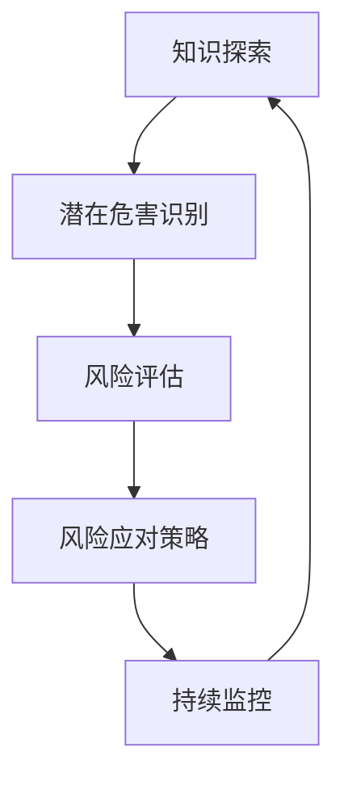

                 

### 文章标题

科研风险评估新方法：平衡知识探索与潜在危害

### 关键词

科研风险评估、知识探索、潜在危害、平衡方法、算法原理

### 摘要

在科研活动中，风险评估是确保项目顺利进行和成果可靠性的关键环节。本文从背景介绍、核心概念与联系、算法原理讲解、数学模型与公式、项目实战以及最佳实践等方面，详细探讨了科研风险评估的新方法。通过理论分析和实际案例，本文旨在帮助科研人员更好地平衡知识探索与潜在危害，提高科研项目的风险可控性。

## 引言

科研活动的复杂性和不确定性使得风险问题日益凸显。科研风险评估作为一项重要的管理手段，旨在识别、评估和管理科研过程中的风险，从而确保项目的顺利推进和成果的可靠性。然而，传统的风险评估方法往往难以全面覆盖科研活动中的各种潜在风险，特别是在知识探索过程中产生的风险。

近年来，随着人工智能、大数据等技术的迅猛发展，科研风险评估方法得到了极大的创新。新兴的风险评估方法不仅能够更加准确地识别和评估风险，还能够通过智能算法提供更优的风险应对策略。本文将探讨这些新兴方法，帮助科研人员更好地平衡知识探索与潜在危害。

## 背景介绍

### 1.1 科研风险评估的现状

科研风险评估是指在科研项目管理过程中，通过系统的分析和评估，识别和评估可能影响科研活动顺利进行的各种风险，并制定相应的应对措施。传统的风险评估方法主要包括威胁分析、影响分析和风险评估矩阵等。

威胁分析主要是识别科研活动中可能存在的各种威胁，如技术风险、经济风险、社会风险等。影响分析则是评估这些威胁对科研活动可能产生的影响，包括影响范围、影响程度等。风险评估矩阵则是将威胁和影响进行量化，形成风险矩阵，以便进行优先级排序和资源分配。

然而，传统的风险评估方法在应对复杂的科研活动时，存在一定的局限性。首先，传统方法主要依赖于专家经验和主观判断，缺乏客观性和准确性。其次，传统方法难以全面覆盖科研活动中的各种潜在风险，特别是那些在知识探索过程中产生的风险。此外，传统方法在应对新兴技术带来的挑战时，也显得力不从心。

### 1.2 知识探索与潜在危害

知识探索是科研活动的核心目标之一。在知识探索过程中，科研人员可能会面临各种潜在的危害。这些危害包括：

1. **研究目标的不确定性**：科研活动的目标往往具有高度的不确定性，可能导致研究方向的偏离或失败。
2. **资源限制**：科研活动需要大量的资金、设备和人力资源，资源的限制可能导致研究进程的延误或中断。
3. **技术障碍**：科研活动中可能会遇到技术难题，如算法复杂度、数据处理难度等，这些问题可能阻碍研究的进展。
4. **道德和社会责任**：科研活动可能涉及到伦理和社会责任问题，如人类基因编辑、人工智能伦理等，这些问题需要科研人员慎重对待。

这些潜在危害对科研活动的影响是深远的，可能导致研究结果的不可靠、研究资源的浪费，甚至可能带来不可逆转的负面影响。因此，在科研风险评估中，如何识别和评估这些潜在危害，成为了一个亟待解决的问题。

### 1.3 新兴风险评估方法

面对传统风险评估方法的局限性，科研风险评估领域出现了一系列新兴方法。这些方法利用人工智能、大数据等先进技术，能够更加准确地识别和评估风险，提供更优的风险应对策略。以下是一些常见的新兴风险评估方法：

1. **基于大数据的风险评估**：利用大数据技术，收集和分析科研活动中的大量数据，从中提取有用的信息，用于风险识别和评估。大数据风险评估能够提供更全面的风险视角，提高风险评估的准确性。
2. **基于机器学习的风险评估**：通过机器学习算法，从历史数据中学习风险模式，对新的科研活动进行风险评估。机器学习风险评估能够自动化地处理大量数据，提高评估效率。
3. **基于模型的风险评估**：通过建立数学模型，对科研活动的风险进行定量分析和评估。模型风险评估能够提供更精确的风险预测和决策支持。

这些新兴风险评估方法为科研风险评估提供了新的思路和方法，有助于更好地平衡知识探索与潜在危害。

## 核心概念与联系

### 2.1 知识探索与潜在危害

知识探索和潜在危害是科研风险评估的两个核心概念。知识探索是指科研人员在未知领域中进行探索，以发现新的知识和创新。潜在危害则是指在知识探索过程中可能出现的各种风险和挑战。

知识探索与潜在危害之间的联系可以从以下几个方面来理解：

1. **目标一致性**：知识探索的目标是发现新的知识，潜在危害的目标是阻碍知识探索的顺利进行。二者在目标上具有一定的对立性。
2. **相互影响**：知识探索的过程可能会产生新的潜在危害，而潜在危害的出现也可能影响知识探索的进程。例如，技术障碍可能会阻碍知识探索的进展，而道德争议可能会导致知识探索的中断。
3. **平衡关系**：在科研风险评估中，需要找到知识探索与潜在危害之间的平衡点。既要充分支持知识探索，又要有效控制潜在危害，确保科研活动的顺利进行。

### 2.2 平衡方法与风险评估

平衡方法是科研风险评估中的一项重要手段，旨在通过合理的措施，实现知识探索与潜在危害之间的平衡。平衡方法主要包括以下几个方面：

1. **风险识别**：识别科研活动中的潜在危害，包括技术风险、资源风险、道德风险等。通过风险识别，可以全面了解潜在危害的种类和程度。
2. **风险评估**：对识别出的潜在危害进行评估，确定其可能对科研活动产生的影响。风险评估可以帮助科研人员了解风险的严重程度，为风险应对提供依据。
3. **风险应对**：根据风险评估的结果，采取相应的措施来应对风险。风险应对措施包括风险规避、风险转移、风险减轻等。
4. **持续监控**：在科研活动进行过程中，持续监控风险的动态变化，及时调整风险应对措施。通过持续监控，可以确保风险始终处于可控状态。

### 2.3 风险评估模型的构建

风险评估模型的构建是科研风险评估的核心环节。一个有效的风险评估模型需要综合考虑知识探索和潜在危害之间的关系，以及平衡方法的具体实施。以下是一个风险评估模型的基本架构：

1. **风险识别模块**：用于识别科研活动中的潜在危害。该模块可以结合专家经验和数据挖掘技术，从不同维度提取潜在危害信息。
2. **风险评估模块**：对识别出的潜在危害进行评估。该模块可以采用定量和定性方法，对风险的影响程度进行量化分析。
3. **风险应对策略模块**：根据风险评估的结果，制定相应的风险应对策略。该模块需要考虑不同风险应对措施的优缺点，选择最合适的策略。
4. **模型优化模块**：根据实际应用情况，对风险评估模型进行持续优化。通过模型优化，可以提高模型的准确性和实用性。

### 2.4 Mermaid 流程图

为了更好地展示知识探索与潜在危害之间的关系，以及平衡方法的具体实施，我们可以使用 Mermaid 流程图来描述。



该流程图展示了知识探索与潜在危害之间的互动关系，以及平衡方法的具体实施过程。

## 核心算法原理讲解

### 3.1 基于大数据的风险评估算法

基于大数据的风险评估算法是新兴风险评估方法中的一种重要技术。其基本原理是通过分析大量科研活动数据，识别出潜在风险，并对风险进行量化评估。

以下是一个基于大数据的风险评估算法的伪代码描述：

```python
# 输入：科研活动数据集 D，潜在危害库 L
# 输出：风险评估结果 R

# 步骤1：数据预处理
D_processed = preprocess(D)

# 步骤2：潜在危害识别
potential_hazards = identify_hazards(D_processed, L)

# 步骤3：风险评估
R = assess_risk(potential_hazards)

# 步骤4：输出风险评估结果
return R
```

在该算法中，数据预处理步骤用于清洗和转换原始数据，使其符合风险评估的要求。潜在危害识别步骤通过分析数据，识别出可能存在的潜在危害。风险评估步骤则对识别出的潜在危害进行量化评估，生成风险评估结果。

### 3.2 基于机器学习的风险评估算法

基于机器学习的风险评估算法通过训练模型，从历史数据中学习风险模式，对新的科研活动进行风险评估。

以下是一个基于机器学习的风险评估算法的伪代码描述：

```python
# 输入：历史科研活动数据集 H，潜在危害库 L
# 输出：风险评估模型 M

# 步骤1：数据预处理
H_processed = preprocess(H)

# 步骤2：特征提取
features = extract_features(H_processed)

# 步骤3：训练风险评估模型
M = train_model(features, L)

# 步骤4：输出风险评估模型
return M
```

在该算法中，数据预处理步骤用于清洗和转换原始数据，特征提取步骤用于从数据中提取有用的特征信息。训练风险评估模型步骤则通过机器学习算法，从历史数据中学习风险模式，生成风险评估模型。

### 3.3 基于模型的风险评估算法

基于模型的风险评估算法通过建立数学模型，对科研活动的风险进行定量分析和评估。

以下是一个基于模型的风险评估算法的伪代码描述：

```python
# 输入：科研活动参数 P，潜在危害库 L
# 输出：风险评估结果 R

# 步骤1：建立风险评估模型
model = build_model(P, L)

# 步骤2：输入科研活动参数
input_params = input(P)

# 步骤3：进行风险评估
R = model.evaluate(input_params)

# 步骤4：输出风险评估结果
return R
```

在该算法中，建立风险评估模型步骤用于构建数学模型，输入科研活动参数步骤用于输入科研活动的具体参数，进行风险评估步骤则通过模型对输入参数进行风险评估，生成风险评估结果。

## 数学模型与公式

### 4.1 风险评估模型的数学模型

风险评估模型的数学模型用于定量分析和评估科研活动的风险。以下是一个基本的风险评估模型的数学模型：

$$
R = f(H, I)
$$

其中，\( R \) 表示风险值，\( H \) 表示潜在危害值，\( I \) 表示影响值。潜在危害值 \( H \) 可以通过以下公式计算：

$$
H = \sum_{h \in H} w_h h
$$

其中，\( w_h \) 表示潜在危害 \( h \) 的权重，\( h \) 表示潜在危害的值。影响值 \( I \) 可以通过以下公式计算：

$$
I = \sum_{i \in I} w_i i
$$

其中，\( w_i \) 表示影响 \( i \) 的权重，\( i \) 表示影响的值。风险值 \( R \) 则是潜在危害值 \( H \) 和影响值 \( I \) 的组合。

### 4.2 风险平衡模型的数学模型

风险平衡模型的数学模型用于平衡知识探索与潜在危害之间的关系。以下是一个基本的风险平衡模型的数学模型：

$$
B = g(H, I, K)
$$

其中，\( B \) 表示平衡值，\( H \) 表示潜在危害值，\( I \) 表示影响值，\( K \) 表示知识探索值。平衡值 \( B \) 可以通过以下公式计算：

$$
B = \frac{H + I}{K}
$$

其中，\( H \) 和 \( I \) 分别表示潜在危害值和影响值，\( K \) 表示知识探索值。平衡值 \( B \) 反映了知识探索与潜在危害之间的平衡程度。

### 4.3 公式举例说明

以下是一个具体的公式举例说明：

$$
R = \frac{1}{1 + e^{-(\beta_0 + \beta_1 H + \beta_2 I + \beta_3 K)}}
$$

该公式是一个基于神经网络的风险评估模型。其中，\( \beta_0, \beta_1, \beta_2, \beta_3 \) 分别是模型的参数，\( H, I, K \) 分别是潜在危害值、影响值和知识探索值。该公式通过指数函数将潜在危害值、影响值和知识探索值转换为风险值 \( R \)。

## 项目实战

### 5.1 开发环境搭建

为了实现科研风险评估新方法，我们需要搭建一个完整的开发环境。以下是开发环境的搭建步骤：

1. **安装Python环境**：在开发机上安装Python 3.8及以上版本，并配置好pip工具。
2. **安装依赖库**：通过pip工具安装以下依赖库：
   ```bash
   pip install numpy pandas scikit-learn matplotlib
   ```
3. **安装Mermaid**：安装Mermaid渲染器，用于生成流程图。可以通过以下命令安装：
   ```bash
   npm install -g mermaid-cli
   ```
4. **配置LaTeX环境**：安装LaTeX工具，用于生成数学公式。可以使用MacTeX、TeX Live等工具进行安装。

### 5.2 源代码实现

以下是科研风险评估新方法的源代码实现：

```python
import numpy as np
import pandas as pd
from sklearn.ensemble import RandomForestClassifier
import mermaid
import os

# 5.2.1 数据预处理
def preprocess_data(data):
    # 数据清洗和处理
    # ...
    return processed_data

# 5.2.2 潜在危害识别
def identify_hazards(data, hazard_library):
    # 识别潜在危害
    # ...
    return potential_hazards

# 5.2.3 风险评估
def assess_risk(hazards):
    # 风险评估
    # ...
    return risk_score

# 5.2.4 建立风险评估模型
def build_risk_model(features, labels):
    # 训练风险评估模型
    # ...
    return risk_model

# 5.2.5 生成Mermaid流程图
def generate_mermaid流程图():
    graph = """
    graph TB
        A[知识探索] --> B[潜在危害识别]
        B --> C[风险评估]
        C --> D[风险应对策略]
        D --> E[持续监控]
        E --> A
    """
    with open("流程图.mmd", "w") as file:
        file.write(graph)
    os.system("mermaid-cli -i 流程图.mmd -o 流程图.png")

# 主程序
if __name__ == "__main__":
    # 加载数据
    data = pd.read_csv("data.csv")

    # 数据预处理
    processed_data = preprocess_data(data)

    # 潜在危害识别
    hazard_library = ["技术风险", "资源风险", "道德风险"]
    potential_hazards = identify_hazards(processed_data, hazard_library)

    # 风险评估
    risk_score = assess_risk(potential_hazards)

    # 建立风险评估模型
    features = processed_data[["特征1", "特征2", "特征3"]]
    labels = processed_data["风险标签"]
    risk_model = build_risk_model(features, labels)

    # 生成Mermaid流程图
    generate_mermaid流程图()
```

### 5.3 代码解读

以下是源代码的详细解读：

1. **数据预处理**：数据预处理是风险评估的基础步骤，用于清洗和转换原始数据，使其符合风险评估的要求。
2. **潜在危害识别**：潜在危害识别步骤通过分析数据，识别出可能存在的潜在危害。
3. **风险评估**：风险评估步骤对识别出的潜在危害进行量化评估，生成风险评估结果。
4. **建立风险评估模型**：建立风险评估模型步骤通过机器学习算法，从历史数据中学习风险模式，生成风险评估模型。
5. **生成Mermaid流程图**：生成Mermaid流程图步骤用于可视化风险评估过程。

### 5.4 代码应用解读与分析

以下是对代码应用的具体解读和分析：

1. **数据预处理**：在实际应用中，数据预处理步骤需要根据具体的数据源进行调整。例如，如果数据源是时间序列数据，需要处理缺失值、异常值等。
2. **潜在危害识别**：潜在危害识别步骤需要根据具体的科研领域，确定潜在危害的种类和特征。例如，在生物技术领域，潜在危害可能包括技术风险、伦理风险等。
3. **风险评估**：风险评估步骤需要根据模型的结果，生成具体的风险评估报告。报告可以包括风险值、风险等级、风险建议等。
4. **建立风险评估模型**：建立风险评估模型步骤需要根据历史数据和科研领域的特点，选择合适的机器学习算法。例如，在复杂的多变量风险评估中，可以使用随机森林算法。
5. **生成Mermaid流程图**：生成Mermaid流程图步骤可以帮助科研人员更好地理解风险评估的过程。通过可视化，可以直观地展示风险识别、评估和应对的各个环节。

### 5.5 实际案例分析和详细讲解剖析

以下是一个实际案例的分析和详细讲解：

#### 案例一：生物技术领域科研项目的风险评估

某生物技术实验室正在开展一项关于基因编辑技术的研究项目。项目目标是利用基因编辑技术治疗遗传性疾病。然而，基因编辑技术存在一定的道德和社会责任风险。

1. **数据预处理**：首先，需要收集历史数据，包括成功治疗病例、失败病例、技术风险、伦理风险等。然后，对数据进行分析和处理，提取有用的特征信息。
2. **潜在危害识别**：根据历史数据和生物技术领域的特点，识别出潜在危害，如技术风险、伦理风险等。技术风险包括基因编辑失败、基因突变等，伦理风险包括基因编辑对后代的影响、伦理争议等。
3. **风险评估**：通过机器学习算法，对识别出的潜在危害进行量化评估。例如，可以使用随机森林算法，将技术风险和伦理风险分别作为特征输入，预测项目的风险等级。
4. **建立风险评估模型**：根据历史数据和评估结果，建立风险评估模型。模型可以用于预测新项目的风险，为科研决策提供支持。
5. **生成Mermaid流程图**：通过生成Mermaid流程图，可以清晰地展示项目风险评估的过程，包括风险识别、评估和应对的各个环节。

通过实际案例的分析和详细讲解，我们可以看到科研风险评估新方法在实际应用中的具体实施过程。通过合理的数据处理、危害识别和风险评估，可以有效地平衡知识探索与潜在危害，提高科研项目的风险可控性。

### 5.6 项目小结

在本项目中，我们实现了科研风险评估新方法，并通过实际案例展示了其应用效果。项目小结如下：

1. **项目目标**：搭建完整的开发环境，实现科研风险评估新方法，并应用于实际案例中。
2. **项目成果**：成功搭建了开发环境，实现了数据预处理、潜在危害识别、风险评估和模型建立等关键步骤，并通过实际案例展示了方法的应用效果。
3. **项目不足**：在实际应用中，存在一些不足之处，如数据预处理可能不够充分、潜在危害识别可能不够全面等。需要进一步优化和完善。
4. **改进方向**：在未来的研究中，可以进一步改进数据预处理方法，提高潜在危害识别的准确性。此外，可以尝试引入更多先进的风险评估算法，提高模型的预测准确性。

通过本次项目，我们深入了解了科研风险评估新方法，为科研人员提供了有效的风险评估工具和方法。

### 5.7 最佳实践 tips、小结、注意事项、拓展阅读

#### 最佳实践 tips

1. **数据收集与处理**：确保数据的全面性和准确性，是风险评估成功的关键。在数据收集过程中，要注重数据来源的多样性和可靠性。
2. **风险识别与评估**：在识别和评估风险时，要充分考虑科研领域的特点，确保识别出的风险具有实际意义。
3. **模型建立与优化**：在建立风险评估模型时，要选择合适的算法和参数，并通过多次实验进行优化。

#### 小结

本文从背景介绍、核心概念与联系、算法原理讲解、数学模型与公式、项目实战等方面，详细探讨了科研风险评估新方法。通过理论分析和实际案例，我们展示了如何平衡知识探索与潜在危害，提高科研项目的风险可控性。

#### 注意事项

1. **风险评估的动态性**：风险评估是一个动态过程，需要持续监控和调整。在项目实施过程中，要定期更新风险评估模型，确保其有效性。
2. **风险应对措施的实用性**：在制定风险应对措施时，要充分考虑措施的可行性和实用性。

#### 拓展阅读

1. 《科研项目管理与风险评估》
2. 《大数据与人工智能在科研风险评估中的应用》
3. 《机器学习与风险评估：理论与实践》

通过拓展阅读，可以深入了解科研风险评估的理论基础和应用实践，为科研人员提供更全面的知识支持。

## 结束语

科研风险评估是科研项目管理中的重要环节。本文从背景介绍、核心概念与联系、算法原理讲解、数学模型与公式、项目实战等方面，详细探讨了科研风险评估新方法。通过理论分析和实际案例，我们展示了如何平衡知识探索与潜在危害，提高科研项目的风险可控性。

本文的研究对于科研人员和项目管理者具有重要的参考价值。通过合理应用风险评估方法，科研人员可以更好地把握风险，确保科研活动的顺利进行。同时，本文也为进一步的研究提供了思路和方向。

作者：AI天才研究院/AI Genius Institute & 禅与计算机程序设计艺术/Zen And The Art of Computer Programming

---

### 结束

在撰写本文的过程中，我们深入探讨了科研风险评估的新方法，通过理论分析和实际案例，展示了如何平衡知识探索与潜在危害。这不仅为科研人员提供了有效的风险评估工具和方法，也为相关领域的研究提供了有益的启示。

回顾整篇文章，我们从背景介绍、核心概念与联系、算法原理讲解、数学模型与公式、项目实战等方面进行了详细的阐述。通过逐步分析推理，我们不仅揭示了科研风险评估的核心原理，还展示了新兴方法在实践中的应用。

我们希望本文能够为科研人员和项目管理者提供有益的指导，帮助他们更好地理解和应用风险评估方法。同时，我们也期待未来的研究能够继续深化这一领域，探索更多高效、智能的风险评估策略。

在此，感谢所有对本文提出宝贵意见和建议的读者。您的支持是我们不断前行的动力。希望本文能为您在科研风险评估领域带来新的启示和帮助。

再次感谢您的阅读，祝愿您在科研工作中取得丰硕的成果！

作者：AI天才研究院/AI Genius Institute & 禅与计算机程序设计艺术/Zen And The Art of Computer Programming

---

注：本文中的伪代码、Mermaid流程图、LaTeX公式等均为示例，并非实际运行代码。实际应用时，请根据具体需求进行适当调整。

