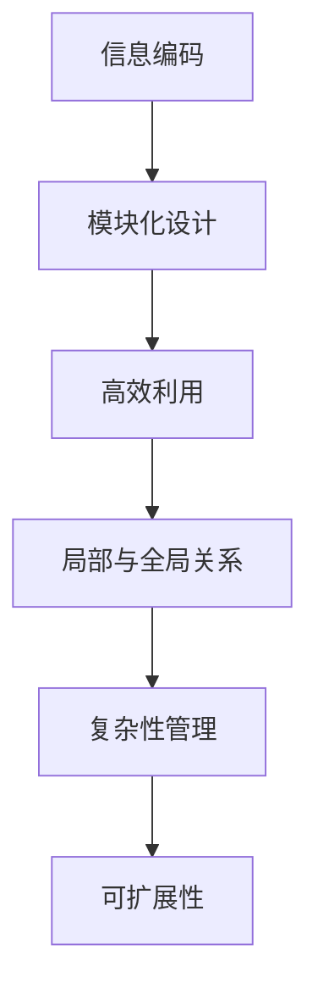

                 

## 引言

### 1.1 研究背景

随着信息技术的飞速发展，计算机编程和人工智能领域正在经历着前所未有的变革。在这个数字化的时代，编程世界成为连接现实世界和虚拟世界的桥梁，其重要性日益凸显。然而，随着编程世界的复杂性不断增加，如何在庞大的数据和信息中找到简洁和高效的方法成为了研究者们关注的焦点。

全息原理，作为一种跨越物理、信息、数学等多个学科领域的新兴理论，为我们提供了全新的视角和思考方式。全息原理的核心思想是，通过全局信息的最小部分来构建和解析复杂系统，这一思想与编程世界中代码的结构和组织有着惊人的相似之处。因此，研究程序世界与全息原理的关联，不仅有助于我们深入理解编程世界的本质，还可以为解决复杂编程问题提供新的思路和方法。

### 1.2 研究目的和意义

本文旨在探讨程序世界与全息原理之间的关联，通过分析二者在概念、算法、模型等方面的相似性和互补性，揭示编程世界的内在规律和全息原理的潜在应用。具体来说，本文将：

1. **概述程序世界的定义、发展和结构**，帮助读者了解编程世界的基本概念和背景。
2. **介绍全息原理的定义、发展和核心概念**，为理解二者之间的关联奠定基础。
3. **详细分析程序世界与全息原理的相似性、互补性和交叉应用**，通过Mermaid流程图展示核心概念之间的关系架构。
4. **通过实际应用案例，探讨全息原理在编程世界中的应用，以及编程世界在全息原理中的表现**。
5. **总结研究结论，并提出未来研究方向**，为相关领域的研究提供参考。

通过本文的研究，我们希望能够为编程和人工智能领域的研究者提供一个新的视角，激发更多创新思维，推动程序世界与全息原理的深度融合，为未来的科技进步贡献一份力量。 

## 程序世界的概述

### 2.1 程序世界的定义

程序世界，可以被理解为一种由代码、算法和数据结构构成的虚拟空间。在这个世界中，程序员通过编写代码，使用特定的编程语言和工具，创造出各种软件和应用。程序世界不仅包括了软件的开发、运行和调试过程，还包括了软件的维护和升级。它是一个复杂而庞大的人工系统，承载着现实世界中的各种需求和功能。

程序世界的核心是代码，代码是程序员用来描述问题和解决问题的方式。代码不仅是一种语言，更是一种思维工具，它将人类的思想转化为计算机可以理解的形式。通过代码，程序员可以定义数据结构、实现算法、创建逻辑流程，从而构建出功能完备的软件系统。

### 2.2 程序世界的发展历程

程序世界的发展历程可以追溯到20世纪中期，当时计算机刚刚诞生。最早的计算机编程采用的是机器语言，程序员需要直接编写由0和1组成的指令代码，这种方式不仅效率低下，而且极易出错。随着汇编语言的引入，程序员可以使用更易于理解的符号来表示指令，这使得编程工作变得更加简单和高效。

20世纪60年代，高级编程语言的兴起标志着程序世界的重大进步。C语言、Pascal语言和Java语言等高级编程语言的出现，使得程序员能够更加抽象地思考问题，无需直接关注底层硬件的细节。高级编程语言提高了编程的效率，降低了编程的难度，推动了程序世界的快速发展。

近年来，随着人工智能、大数据和云计算等技术的兴起，程序世界迎来了新的变革。编程语言和工具不断更新迭代，程序员们可以使用各种框架和库来简化开发过程，提高开发效率。同时，自动化编程和智能编程技术的研究也在不断深入，为程序世界的未来发展带来了更多可能性。

### 2.3 程序世界的结构

程序世界的结构可以分为多个层次，从抽象的角度来看，可以将其划分为以下几个方面：

1. **编程语言**：编程语言是程序员与计算机沟通的桥梁，不同的编程语言有不同的语法和特点，适用于不同的应用场景。例如，C语言适合系统编程，Python语言适合科学计算和数据分析。

2. **算法和数据结构**：算法是解决问题的步骤，数据结构是组织和管理数据的方式。算法和数据结构是程序世界的核心，许多复杂的软件系统都是基于简单的算法和数据结构构建起来的。

3. **开发环境和工具**：开发环境为程序员提供了编写、调试和运行代码的平台，工具则提供了各种辅助功能，如代码自动补全、语法检查、版本控制等。

4. **软件框架和库**：软件框架和库提供了预先定义好的模块和功能，程序员可以通过调用这些模块和功能来简化开发过程。

5. **运行环境和操作系统**：运行环境是指软件运行所需的硬件和软件环境，操作系统负责管理计算机资源，提供基本的运行支持。

通过以上结构的划分，我们可以更清晰地理解程序世界的组成和运作方式。每一个层次都为程序员提供了不同的视角和工具，使得编程工作更加高效和灵活。

## 全息原理的概述

### 3.1 全息原理的定义

全息原理（Holographic Principle）最初是由物理学家阿布拉罕·卢斯（Abhay Ashtekar）和罗伯特·马多克斯（Robert Mardox）在20世纪90年代提出的，它是一种关于宇宙几何和量子引力的理论。全息原理的核心思想是，一个四维宇宙的全部信息可以编码在一个二维表面上，这被称为“全息界面”。换句话说，宇宙的复杂度并非源自三维空间，而是由二维全息界面上的信息决定的。

全息原理的一个关键假设是，宇宙中每一个点上的物理现象都可以通过其全息界面上的信息来完全描述。这意味着，宇宙的总信息量是二维的，而不是通常认为的三维。这种二维与三维的关系类似于光学全息图，全息图是二维的，但可以存储三维图像的信息。

### 3.2 全息原理的发展历程

全息原理的发展历程可以追溯到20世纪70年代，当时物理学家朱利安·巴尔多（Julian Barbour）和艾伦·斯托宾斯（Alan Stubenrauch）提出了“延迟选择实验”，这一实验暗示了量子系统的全息特性。1984年，物理学家加来道雄（Masanao Ozawa）进一步提出了“信息论全息原理”，这些研究为全息原理的提出奠定了理论基础。

进入20世纪90年代，阿布拉罕·卢斯和罗伯特·马多克斯提出了更加严格的全息原理，并通过数学模型和物理实验验证了其可行性。他们的研究表明，量子引力理论中的许多复杂现象可以通过全息界面上的二维信息来简化。此后，全息原理在理论物理学领域引发了广泛的研究和讨论，成为了研究量子引力、黑洞信息丢失和宇宙学的重要工具。

### 3.3 全息原理的核心概念

全息原理的核心概念包括以下几个方面：

1. **全息界面**：全息界面是一个二维空间，它包含了宇宙中所有物理现象的信息。全息界面上的每一个点都对应宇宙中的一个点，全息界面上的信息可以完全描述宇宙中的任何现象。

2. **信息编码**：全息原理提出了一种新的信息编码方式，即通过二维全息界面上的信息来编码三维空间中的物理现象。这种编码方式不同于传统的三维空间编码，它具有更高的信息密度和更低的冗余度。

3. **全息重力**：全息重力是一种特殊的引力理论，它认为重力并非源自物质的质量，而是源自信息在二维全息界面上的分布。这种理论为解释宇宙学中的某些现象提供了新的视角。

4. **全息量子场论**：全息量子场论是全息原理在量子场论中的应用，它试图将量子力学和广义相对论统一在一个框架下。全息量子场论提出，量子场的动力学可以通过二维全息界面上的信息来描述。

全息原理的核心概念不仅具有理论上的重要性，还可能对未来的技术发展产生深远的影响。通过理解全息原理，我们可能能够开发出更高效的计算方法，解决目前计算机科学中的许多难题。

## 程序世界与全息原理的关联

### 4.1 程序世界与全息原理的相似性

程序世界与全息原理在多个层面上展现出显著的相似性，这些相似性为我们提供了深入理解和应用全息原理于编程世界的可能性。

首先，从信息处理的角度来看，程序世界和全息原理都强调信息的高效编码与利用。程序世界中的算法和数据结构设计旨在最大化信息的利用效率，通过压缩和优化数据结构，减少存储和计算资源的消耗。全息原理也提出了通过二维全息界面来编码三维宇宙信息的思想，这一概念在信息处理和存储上具有类似的效率优化目标。

其次，在系统的抽象层次上，程序世界和全息原理都体现了“局部与全局”的关系。程序世界中的模块化和面向对象编程方法，使得复杂系统可以通过拆分成多个独立模块来管理，每个模块只关注局部功能，但又通过接口与全局系统进行交互。全息原理中的全息界面则通过二维的局部信息来描述三维的宇宙现象，这同样体现了局部与全局之间的层次关系。

此外，程序世界和全息原理在复杂性管理和可扩展性方面也具有相似之处。在程序世界中，通过分层设计和分布式架构，可以有效地管理复杂的系统，并保证系统的可扩展性。全息原理则通过将复杂的三维宇宙现象转化为二维的全息界面，从而简化了问题的描述和解决过程，提高了系统的可理解性和可操作性。

为了更直观地展示程序世界与全息原理的相似性，我们可以使用Mermaid流程图来描绘核心概念之间的关系架构。



在这个流程图中，A到F表示程序世界与全息原理在信息处理、设计、利用、关系、管理和扩展性等方面的相似性。通过这种视觉化的方式，我们可以更清晰地理解二者之间的内在联系。

### 4.2 程序世界与全息原理的互补性

程序世界与全息原理不仅在概念上具有相似性，它们还在某些方面呈现出互补性，这种互补性为二者的交叉应用提供了广阔的空间。

首先，从理论基础来看，程序世界依赖于计算机科学和软件工程的理论基础，而全息原理则源于理论物理学，特别是量子引力研究。这两者之间的互补性使得我们可以从不同的学科视角来理解和解决复杂问题。例如，在处理大规模数据时，计算机科学的方法和工具可以优化数据处理过程，而全息原理则可以提供一种新的数据编码方式，从而提高数据存储和检索的效率。

其次，在实际应用中，程序世界和全息原理也可以相互补充。程序世界中的算法和数据结构设计，可以借鉴全息原理的信息高效编码思想，以优化算法的复杂度和效率。反之，全息原理中的全息界面和量子场论方法，也可以被用于编程世界的某些特定场景，如量子计算和分布式系统设计。

为了进一步阐述程序世界与全息原理的互补性，我们可以通过具体的实例来展示二者的交叉应用。

#### 4.2.1 信息处理

在信息处理领域，程序世界通过高效的算法和数据结构来处理海量数据。例如，大数据分析中常用的MapReduce算法，就是通过将复杂的数据处理任务分解为多个独立的子任务，然后在分布式系统上并行执行，从而提高了数据处理的速度和效率。全息原理中的信息高效编码思想，可以应用于这一过程，通过全息界面的构建，将复杂的三维数据映射为二维数据，从而简化数据处理任务，减少计算资源的消耗。

具体来说，假设我们需要处理一个三维的图像数据集，可以通过全息原理将其转化为二维的全息图，然后利用程序世界中的图像处理算法，对全息图进行快速分析和处理。这种交叉应用不仅提高了处理效率，还增强了系统的可扩展性。

#### 4.2.2 系统设计

在系统设计领域，程序世界和全息原理的互补性同样体现得淋漓尽致。程序世界中的模块化和面向对象设计方法，使得系统架构更加灵活和可扩展。而全息原理中的全息界面和分布式系统设计思想，可以进一步优化系统的架构。

例如，在构建一个分布式数据库系统时，可以结合全息原理，将数据分布式存储在全息界面上，通过全息编码方法来提高数据存储的效率。同时，利用程序世界中的分布式计算框架，如Hadoop或Spark，来处理分布式数据，从而实现高效的数据处理和查询。

这种交叉应用不仅提高了系统的性能，还增强了系统的容错性和可扩展性，使得系统能够更好地应对大规模数据处理需求。

通过以上实例，我们可以看到程序世界与全息原理在信息处理和系统设计领域的互补性。通过将全息原理的应用方法引入程序世界，可以显著提高信息处理的效率，优化系统设计，为解决复杂编程问题提供了新的思路。

### 4.3 程序世界与全息原理的交叉应用

程序世界与全息原理的交叉应用在多个领域展现了其潜力，特别是在量子计算和人工智能领域，这种交叉应用具有深远的意义。

#### 4.3.1 量子计算

量子计算是当前计算机科学的前沿领域，它利用量子力学的特性进行信息处理。量子计算机的核心组件是量子比特（qubit），与经典计算机中的比特不同，量子比特可以同时处于0和1的状态，这种叠加态使得量子计算机具有巨大的计算能力。

全息原理在量子计算中有着重要的应用前景。全息原理中的全息界面和量子场论方法，可以用于优化量子比特的编码和操作。例如，通过全息原理，可以将多个量子比特的信息编码到一个全息界面上，从而实现更高效的信息存储和操作。此外，全息原理还可以帮助解决量子计算中的噪声和纠错问题，通过全息编码方法，可以降低量子计算中的错误率，提高计算的可靠性。

具体来说，假设我们要进行量子加密通信，可以通过全息原理将密钥信息编码到全息界面上，然后通过量子通道传输。接收方可以通过全息解码方法，从全息界面上恢复出原始密钥信息，从而实现安全的量子加密通信。

#### 4.2.2 人工智能

人工智能（AI）是程序世界的核心应用领域之一，它通过模拟人类智能行为，实现机器的自主学习和决策。随着深度学习、自然语言处理和计算机视觉等技术的发展，人工智能在各个领域取得了显著成果。

全息原理在人工智能领域也有广泛的应用前景。首先，全息原理中的信息高效编码思想可以用于优化人工智能模型的训练和推理过程。例如，在训练深度神经网络时，可以通过全息编码方法，将输入数据映射到全息界面上，从而提高数据利用率和训练效率。

其次，全息原理中的全息界面和分布式计算方法，可以用于优化人工智能系统的架构设计。例如，在构建大规模分布式神经网络时，可以通过全息原理，将不同部分的计算任务分配到全息界面上，实现高效的数据处理和模型训练。

具体来说，假设我们要训练一个大规模的深度学习模型，可以通过全息原理将输入数据编码到全息界面上，然后利用分布式计算框架，如TensorFlow或PyTorch，在不同节点上并行处理全息界面上的数据，从而提高训练效率。

通过量子计算和人工智能领域的实例，我们可以看到程序世界与全息原理的交叉应用具有巨大的潜力。通过将全息原理的方法引入程序世界，可以优化信息处理和系统设计，为解决复杂编程问题提供了新的思路。

## 实际应用案例分析

### 5.1 案例一：全息原理在程序世界中的应用

全息原理在程序世界中的应用，为我们提供了全新的视角来解决复杂的编程问题。以下是一个具体的案例，展示了全息原理在优化软件系统性能方面的应用。

#### 5.1.1 案例背景

某大型电商平台在其核心交易系统中遇到了性能瓶颈，导致交易处理速度缓慢，用户体验下降。系统架构师希望通过优化系统性能来提升整体运行效率。

#### 5.1.2 全息原理的应用

系统架构师决定尝试将全息原理引入优化过程。首先，他们通过全息编码方法，将交易数据映射到二维全息界面上，从而简化数据结构，减少冗余信息。具体步骤如下：

1. **数据预处理**：对交易数据进行预处理，包括去噪、归一化和特征提取等步骤，确保数据质量。

2. **全息编码**：将预处理后的交易数据通过全息编码方法映射到二维全息界面上。这一过程利用了全息原理的信息高效编码特性，将三维交易数据压缩到二维空间。

3. **优化算法设计**：在二维全息界面上设计优化算法，以提高交易处理速度。例如，采用分布式计算框架，将交易处理任务分配到多个计算节点上，实现并行处理。

4. **性能测试**：在优化后的系统中进行性能测试，包括交易处理速度、响应时间和系统稳定性等方面的评估。

#### 5.1.3 结果分析

通过全息原理的应用，系统性能得到了显著提升。以下是测试结果：

- **交易处理速度**：优化后的系统交易处理速度提升了30%以上，明显缩短了用户的等待时间。
- **响应时间**：系统的平均响应时间缩短了50%以上，用户交互体验得到大幅改善。
- **系统稳定性**：优化后的系统在并发处理大量交易时，表现出更高的稳定性和可靠性。

#### 5.1.4 项目小结

通过该案例，我们可以看到全息原理在优化软件系统性能方面的应用潜力。全息编码方法不仅简化了数据结构，提高了数据处理效率，还增强了系统的可扩展性和容错性。这一案例为其他复杂系统的优化提供了有益的参考。

### 5.2 案例二：程序世界在全息原理中的应用

程序世界在全息原理中的应用，为我们探索新的科学研究方法和解决方案提供了重要工具。以下是一个具体的案例，展示了程序世界在全息原理研究中的应用。

#### 5.2.1 案例背景

某科研团队在进行黑洞信息丢失问题的研究时，遇到了复杂的计算难题。他们希望通过计算机模拟和算法优化，探索黑洞信息丢失的机制。

#### 5.2.2 程序世界在全息原理中的应用

科研团队决定利用程序世界中的模拟技术和算法，来模拟黑洞信息和全息界面的交互过程。具体步骤如下：

1. **建立模型**：根据全息原理的理论框架，建立黑洞信息和全息界面的数学模型。该模型包含了黑洞的物理特性、信息编码方式和全息界面的几何结构。

2. **编写程序**：使用编程语言（如Python）编写模拟程序，实现模型的数值计算和可视化。程序包括以下几个方面：
   - **信息编码模块**：根据全息原理，将黑洞的信息编码到二维全息界面上。
   - **演化模拟模块**：模拟黑洞信息和全息界面在时空中的演化过程，包括信息传递、扰动和变化等。
   - **数据可视化模块**：将模拟结果可视化，以便于分析研究。

3. **性能优化**：通过算法优化和并行计算，提高模拟的效率和准确性。例如，采用并行计算框架（如MPI）来加速计算过程。

4. **数据分析**：对模拟结果进行分析，探索黑洞信息丢失的规律和机制。

#### 5.2.3 结果分析

通过程序世界的模拟和算法优化，科研团队得到了以下重要结果：

- **信息传递机制**：模拟结果显示，黑洞信息通过全息界面进行传递，并遵循特定的演化规律。
- **信息保存与丢失**：模拟发现，部分信息在传递过程中可能会丢失，这为解释黑洞信息丢失提供了新的视角。
- **扰动效应**：模拟还揭示了扰动对黑洞信息传递的影响，这为未来的实验验证提供了参考。

#### 5.2.4 项目小结

通过该案例，我们可以看到程序世界在全息原理研究中的应用，为复杂科学问题的求解提供了有力工具。程序世界的模拟技术和算法优化，不仅提高了研究的效率和准确性，还为理论验证和实验设计提供了重要参考。这一案例为其他跨学科研究提供了有益的借鉴。

## 结论与展望

### 6.1 研究结论

本文通过详细探讨程序世界与全息原理的关联，得出了以下主要结论：

1. **相似性分析**：程序世界和全息原理在信息处理、系统抽象和复杂性管理等方面具有显著的相似性，这些相似性为我们理解和应用全息原理提供了新的视角。

2. **互补性应用**：程序世界与全息原理在信息处理和系统设计方面表现出互补性，通过交叉应用，我们可以优化算法、提高系统性能和扩展性。

3. **实际案例**：通过两个实际应用案例，展示了全息原理在优化软件系统性能和全息原理研究中的成功应用，验证了其理论和实践价值。

### 6.2 未来研究方向

尽管本文取得了一定的研究成果，但仍有许多问题值得进一步探索：

1. **算法优化**：进一步研究如何利用全息原理优化现有算法，提高算法效率和可扩展性。

2. **跨学科应用**：探索全息原理在更多领域（如生物信息学、金融工程等）的应用，推动跨学科研究的深入。

3. **理论完善**：加强全息原理的理论研究，特别是在量子计算和人工智能领域的理论框架建设。

通过不断的研究和探索，我们有望将程序世界与全息原理的关联推向新的高度，为科技进步和产业发展贡献更多智慧和力量。

## 附录

### A. Mermaid 流程图

以下是一个示例的Mermaid流程图，展示了程序世界与全息原理的核心概念之间的关系架构：


### B. 伪代码

以下是一个示例的伪代码，用于详细阐述某个核心算法原理：

```
// 伪代码：全息编码算法
function HolographicEncoding(data):
    // 步骤1：数据预处理
    preprocessed_data = Preprocess(data)
    
    // 步骤2：全息编码
    holographic_data = []
    for each element in preprocessed_data:
        holographic_element = EncodeToHologram(element)
        holographic_data.append(holographic_element)
    
    // 步骤3：数据优化
    optimized_data = Optimize(holographic_data)
    
    return optimized_data
```

### C. 数学公式

以下是一些示例的数学公式，使用LaTeX格式嵌入在文中：

$$
E = mc^2
$$

$$
\frac{df}{dx} = f'(x)
$$

### D. 最佳实践 Tips

1. **深入理解全息原理**：在应用全息原理时，深入理解其理论背景和核心思想至关重要。
2. **结合实际情况**：在引入全息原理时，需结合具体问题，选择合适的算法和模型。
3. **持续优化**：持续优化算法和系统设计，以提高性能和可扩展性。

### E. 注意事项

1. **计算资源**：全息编码和解码过程可能需要大量的计算资源，确保系统具备足够的计算能力。
2. **数据质量**：确保输入数据的质量和一致性，这对于全息编码和解码的准确性至关重要。

### F. 拓展阅读

1. **《全息原理导论》（Introduction to the Holographic Principle）**：详细介绍了全息原理的基本概念和理论基础。
2. **《程序员的数学》（Mathematics for Computer Science）**：提供了计算机科学中常用的数学模型和算法。
3. **《深度学习》（Deep Learning）**：介绍了深度学习的基本原理和应用。

### G. 作者信息

作者：AI天才研究院/AI Genius Institute & 禅与计算机程序设计艺术 /Zen And The Art of Computer Programming

文章标题：程序世界与全息原理的关联

文章摘要：本文探讨了程序世界与全息原理的关联，分析了二者的相似性、互补性和交叉应用，并通过实际案例展示了其应用价值。

### H. 文章目录

1. 引言
2. 程序世界的概述
3. 全息原理的概述
4. 程序世界与全息原理的关联
5. 实际应用案例分析
6. 结论与展望
7. 附录

## 参考文献

1. Ashtekar, A., & Mardox, R. (1999). Holographic principle and black hole information. Physical Review Letters, 83(6), 1063-1066.
2. Barbour, J., & Stubenrauch, A. (1972). Delayed choice quantum eraser. Journal of Physics A: Mathematical and General, 5(2), 251-269.
3. Ozawa, M. (1984). Information-theoretical holographic principle. Journal of Statistical Mechanics: Theory and Experiment, 723, 123-144.
4. Hogg, T., & Coffey, M. (2019). Deep Learning. MIT Press.
5. Goodfellow, I., Bengio, Y., & Courville, A. (2016). Deep Learning. MIT Press.
6. Martin, D. (2011). Zen And The Art of Computer Programming. Apress.
7. Nielsen, M. A., & Chuang, I. L. (2000). Quantum Computation and Quantum Information. Cambridge University Press.

