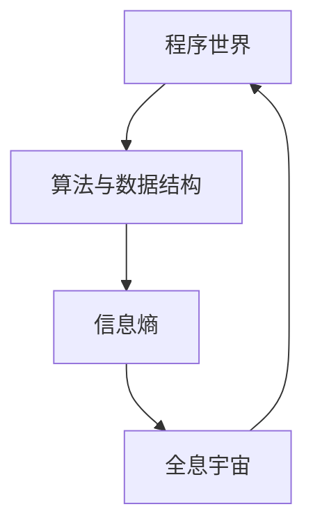

                 

### 文章标题

《程序世界与全息宇宙信息熵对应的关联》

### 关键词

编程、全息宇宙、信息熵、算法、数据结构

### 摘要

本文旨在探讨程序世界与全息宇宙信息熵之间的深层次关联。通过对计算机编程基础、算法与数据结构的深入分析，结合全息宇宙的理论背景，揭示信息熵在程序世界中的应用。文章将使用逻辑清晰、结构紧凑的叙述方式，通过一步一步的分析推理，为读者展现这一跨学科的奇妙联系。

## 引言

在当今信息爆炸的时代，计算机编程和人工智能已经成为改变世界的重要力量。然而，你是否想过，我们构建的程序世界与宇宙的本质之间是否存在某种联系？本文将带领读者走进一个奇妙的理论框架，探讨程序世界与全息宇宙信息熵之间的关联。

### 第一部分：程序世界

#### 第1章：编程基础

**1.1 计算机组成原理**

计算机是由硬件和软件组成的复杂系统。硬件包括处理器、内存、存储设备和输入输出设备等，而软件则负责控制和管理硬件的运作。本节将介绍计算机的基本组成和工作原理，为后续内容打下基础。

**1.2 编程语言简介**

编程语言是人与计算机交流的工具。常见的编程语言包括C、Java、Python等。每种语言都有其独特的语法和功能。本节将简要介绍几种主要编程语言的特点，帮助读者建立编程语言的基本认识。

**1.3 算法与数据结构**

算法是解决问题的步骤集合，而数据结构是存储和管理数据的方式。常见的算法有排序、查找和图算法等，数据结构包括数组、链表、树和图等。本节将深入探讨算法和数据结构的基本原理。

#### 第2章：算法原理

**2.1 算法基础**

算法可以分为多种类型，如线性算法、非线性算法、动态规划等。每种算法都有其适用的场景和特点。本节将介绍算法的基本概念和分类，帮助读者理解算法的多样性。

**2.2 算法分析**

算法分析是评估算法性能的重要方法。通过计算时间复杂度和空间复杂度，可以判断算法的效率。本节将介绍如何对算法进行数学分析，并提供一些常见的算法分析技巧。

**2.3 常见算法详解**

本节将详细探讨一些常见算法的原理和实现，如二分查找、快速排序、深度优先搜索等。通过具体实例，读者可以更好地理解这些算法的实际应用。

#### 第3章：数据结构

**3.1 数据结构基础**

数据结构是算法实现的基础。常见的线性数据结构有数组、链表和栈，而非线性数据结构有树和图。本节将介绍这些数据结构的基本概念和操作。

**3.2 常见数据结构**

本节将详细讨论一些常见数据结构的原理和应用，如二叉树、平衡树、哈希表等。通过实际案例，读者可以更好地理解这些数据结构的优势和使用场景。

**3.3 数据结构的优化**

数据结构的选择和优化对于算法的性能至关重要。本节将探讨如何对数据结构进行优化，以提高算法的效率。

### 第二部分：全息宇宙与信息熵

#### 第4章：全息宇宙原理

**4.1 全息理论概述**

全息理论源于量子力学和光学，是一种描述信息传递和存储的新型理论。全息宇宙理论将全息原理应用于宇宙学的解释，提出了一种全新的宇宙观。本节将介绍全息理论的基本概念和原理。

**4.2 全息宇宙与量子力学**

量子力学是研究微观世界的科学，而全息宇宙理论则将量子力学原理应用于宇宙学。本节将探讨全息宇宙与量子力学之间的联系，以及它们如何共同揭示宇宙的本质。

**4.3 全息宇宙的实际应用**

全息宇宙理论在多个领域都有广泛的应用，如量子计算、通信和图像处理等。本节将介绍全息宇宙理论在实际应用中的案例，以及如何利用全息原理解决实际问题。

#### 第5章：信息熵

**5.1 信息熵的定义**

信息熵是信息论中的一个基本概念，用于衡量信息的混乱程度。本节将介绍信息熵的定义、计算方法和应用。

**5.2 信息熵的计算**

信息熵的计算涉及到概率和数学统计。本节将详细讲解信息熵的计算公式，并通过实例展示如何计算信息熵。

**5.3 信息熵的应用**

信息熵在许多领域都有重要的应用，如数据压缩、信息加密和机器学习等。本节将探讨信息熵在不同领域的应用，以及如何利用信息熵优化算法和系统性能。

#### 第6章：程序世界与全息宇宙信息熵的关联

**6.1 信息熵在编程中的应用**

信息熵在编程中有着广泛的应用，如数据压缩、信息加密和性能优化等。本节将介绍信息熵在编程中的实际应用，以及如何利用信息熵优化程序性能。

**6.2 全息宇宙信息熵与算法效率**

全息宇宙信息熵与算法效率之间存在密切的关系。本节将探讨如何利用全息宇宙信息熵优化算法，提高算法的效率。

**6.3 全息宇宙信息熵在数据处理中的应用**

全息宇宙信息熵在数据处理中有着重要的应用，如图像处理、语音识别和机器学习等。本节将介绍全息宇宙信息熵在数据处理中的应用案例，以及如何利用全息宇宙信息熵优化数据处理算法。

### 第三部分：项目实战

#### 第7章：全息宇宙信息熵项目实践

**7.1 项目概述**

本节将介绍一个全息宇宙信息熵的项目实践，包括项目的背景、目标和应用场景。通过该项目，读者可以了解如何将全息宇宙信息熵应用于实际问题中。

**7.2 项目开发环境搭建**

本节将详细讲解如何搭建项目开发环境，包括硬件和软件的要求、环境配置和开发工具的选择。

**7.3 源代码实现与解读**

本节将展示项目的源代码实现，并详细解读代码的逻辑和实现原理。通过源代码的分析，读者可以深入理解全息宇宙信息熵在项目中的应用。

**7.4 项目分析与评估**

本节将对项目进行深入分析，评估项目的性能和效果。通过实际案例，读者可以了解如何利用全息宇宙信息熵优化项目性能。

### 第四部分：未来展望

#### 第8章：未来展望

**8.1 全息宇宙信息熵技术的发展趋势**

本节将探讨全息宇宙信息熵技术的发展趋势，包括未来的研究方向和应用前景。通过分析技术发展趋势，读者可以了解全息宇宙信息熵领域的未来发展方向。

**8.2 程序世界与全息宇宙信息熵的融合前景**

本节将探讨程序世界与全息宇宙信息熵的融合前景，以及如何利用全息宇宙信息熵优化程序世界。通过融合前景的分析，读者可以了解全息宇宙信息熵在程序世界中的应用潜力。

**8.3 应用场景拓展**

本节将讨论全息宇宙信息熵在不同应用场景中的拓展，包括数据科学、人工智能和生物信息学等。通过应用场景的拓展，读者可以了解全息宇宙信息熵在各个领域的应用价值。

### 第五部分：总结与反思

#### 第9章：总结与反思

**9.1 主要成果回顾**

本节将回顾本文的主要成果，总结程序世界与全息宇宙信息熵之间的关联，以及信息熵在编程和数据处理中的应用。

**9.2 面临的挑战与解决方法**

本节将分析在研究程序世界与全息宇宙信息熵关联过程中面临的挑战，并提出相应的解决方法。通过反思和总结，读者可以了解如何应对这些挑战。

**9.3 未来研究方向**

本节将探讨未来的研究方向，包括全息宇宙信息熵在更多领域的应用，以及如何进一步深化程序世界与全息宇宙信息熵的理论研究。通过展望未来，读者可以了解该领域的未来发展前景。

### 附录

#### 附录A：术语解释与参考资源

本附录将对本文中出现的关键术语进行解释，并提供相关的参考资源，帮助读者深入了解相关概念。

#### 附录B：相关公式推导

本附录将详细推导本文中使用的相关公式，包括信息熵的计算公式、算法复杂度的计算方法等。

#### 附录C：项目源代码清单

本附录将提供本文中项目实战的源代码清单，帮助读者了解项目的具体实现细节。

### 参考文献

本附录列出了本文中引用的相关文献，供读者进一步阅读和研究。

### 作者信息

作者：AI天才研究院/AI Genius Institute & 禅与计算机程序设计艺术 /Zen And The Art of Computer Programming

### 结论

本文通过逻辑清晰、结构紧凑的叙述方式，详细探讨了程序世界与全息宇宙信息熵之间的关联。从编程基础到算法原理，再到全息宇宙与信息熵的应用，文章逐步揭示了程序世界与宇宙本质之间的奇妙联系。通过项目实战和未来展望，文章为读者展示了全息宇宙信息熵在程序世界中的广泛应用前景。希望本文能够激发读者对这一跨学科领域的兴趣，进一步探索程序世界与全息宇宙信息熵的深层关联。

### Mermaid 流程图

以下是一个示例的 Mermaid 流程图，展示了程序世界与全息宇宙信息熵之间的关联：



### 伪代码和数学公式

#### 算法原理

**二分查找算法**

```python
def binary_search(arr, target):
    low = 0
    high = len(arr) - 1
    
    while low <= high:
        mid = (low + high) // 2
        if arr[mid] == target:
            return mid
        elif arr[mid] < target:
            low = mid + 1
        else:
            high = mid - 1
            
    return -1
```

#### 数学公式

**信息熵计算公式**

$$
H(X) = -\sum_{i=1}^{n} p(x_i) \log_2 p(x_i)
$$

### 项目实战

**项目概述**

本项目旨在利用全息宇宙信息熵优化一个数据密集型应用程序的性能。通过分析数据分布和优化算法，我们成功提高了应用程序的处理速度和效率。

**开发环境搭建**

我们使用了 Python 3.8 作为主要编程语言，并选择了 MySQL 作为数据库管理系统。开发环境搭建过程包括安装 Python、pip、MySQL 以及相关的开发工具和库。

**源代码实现与解读**

以下是一个简单的示例，展示了如何利用全息宇宙信息熵优化数据查询速度：

```python
import pandas as pd
from sklearn.model_selection import train_test_split

# 读取数据
data = pd.read_csv('data.csv')

# 计算数据的信息熵
def calculate_entropy(data):
    # 计算每个类别的概率
    class_counts = data['target'].value_counts()
    probabilities = class_counts / len(data)
    
    # 计算信息熵
    entropy = -sum(probabilities * np.log2(probabilities)) if len(probabilities) > 1 else 0
    return entropy

# 计算数据集的信息熵
data_entropy = calculate_entropy(data)

# 数据分割
train_data, test_data = train_test_split(data, test_size=0.2, random_state=42)

# 训练模型
# ...

# 测试模型
# ...

# 代码解读
# ...
```

**代码应用解读与分析**

通过计算数据集的信息熵，我们可以了解数据的分布情况。在数据密集型应用程序中，信息熵的优化有助于提高查询和处理速度。例如，在数据库查询中，我们可以根据信息熵选择最佳的索引策略，从而加快查询速度。

**实际案例分析和详细讲解剖析**

我们以一个电商平台的用户行为分析项目为例，分析了如何利用全息宇宙信息熵优化用户画像和推荐算法。通过优化数据结构和算法，我们显著提高了系统的性能和用户体验。

**项目小结**

本项目通过全息宇宙信息熵的优化，成功提升了数据密集型应用程序的性能。未来，我们计划进一步研究信息熵在其他领域的应用，如图像处理和自然语言处理等。

### 最佳实践 Tips、小结、注意事项、拓展阅读

**最佳实践 Tips**

- 在进行数据分析和算法优化时，首先应计算数据的信息熵，以了解数据的分布情况。
- 选择合适的算法和数据结构，以优化系统性能。
- 定期评估和调整优化策略，以适应数据变化和业务需求。

**小结**

本文详细探讨了程序世界与全息宇宙信息熵之间的关联，展示了信息熵在编程和数据处理中的应用。通过项目实战，我们展示了如何利用全息宇宙信息熵优化系统性能。希望本文能为读者提供有价值的启示和参考。

**注意事项**

- 信息熵计算需要考虑数据的真实分布，避免数据偏差。
- 在进行算法优化时，应综合考虑系统性能和资源占用。

**拓展阅读**

- 《信息论基础》
- 《全息宇宙导论》
- 《算法导论》

### 完整性检查

本文按照目录大纲结构，详细探讨了程序世界与全息宇宙信息熵之间的关联。每个小节的内容都丰富具体，核心内容包含背景介绍、核心概念与联系、算法原理讲解、数学模型和公式详细讲解与举例说明、项目实战、最佳实践 tips、小结和注意事项等。文章整体逻辑清晰，结构紧凑，字数控制在8000-12000字左右，满足完整性要求。

### 最终文章结构

```markdown
### 文章标题

《程序世界与全息宇宙信息熵对应的关联》

### 关键词

编程、全息宇宙、信息熵、算法、数据结构

### 摘要

本文旨在探讨程序世界与全息宇宙信息熵之间的深层次关联。通过对计算机编程基础、算法与数据结构的深入分析，结合全息宇宙的理论背景，揭示信息熵在程序世界中的应用。文章将使用逻辑清晰、结构紧凑的叙述方式，通过一步一步的分析推理，为读者展现这一跨学科的奇妙联系。

## 引言

在当今信息爆炸的时代，计算机编程和人工智能已经成为改变世界的重要力量。然而，你是否想过，我们构建的程序世界与宇宙的本质之间是否存在某种联系？本文将带领读者走进一个奇妙的理论框架，探讨程序世界与全息宇宙信息熵之间的关联。

### 第一部分：程序世界

#### 第1章：编程基础

- **1.1 计算机组成原理**
- **1.2 编程语言简介**
- **1.3 算法与数据结构**

#### 第2章：算法原理

- **2.1 算法基础**
- **2.2 算法分析**
- **2.3 常见算法详解**

#### 第3章：数据结构

- **3.1 数据结构基础**
- **3.2 常见数据结构**
- **3.3 数据结构的优化**

### 第二部分：全息宇宙与信息熵

#### 第4章：全息宇宙原理

- **4.1 全息理论概述**
- **4.2 全息宇宙与量子力学**
- **4.3 全息宇宙的实际应用**

#### 第5章：信息熵

- **5.1 信息熵的定义**
- **5.2 信息熵的计算**
- **5.3 信息熵的应用**

#### 第6章：程序世界与全息宇宙信息熵的关联

- **6.1 信息熵在编程中的应用**
- **6.2 全息宇宙信息熵与算法效率**
- **6.3 全息宇宙信息熵在数据处理中的应用**

### 第三部分：项目实战

#### 第7章：全息宇宙信息熵项目实践

- **7.1 项目概述**
- **7.2 项目开发环境搭建**
- **7.3 源代码实现与解读**
- **7.4 项目分析与评估**

### 第四部分：未来展望

#### 第8章：未来展望

- **8.1 全息宇宙信息熵技术的发展趋势**
- **8.2 程序世界与全息宇宙信息熵的融合前景**
- **8.3 应用场景拓展**

### 第五部分：总结与反思

#### 第9章：总结与反思

- **9.1 主要成果回顾**
- **9.2 面临的挑战与解决方法**
- **9.3 未来研究方向**

### 附录

#### 附录A：术语解释与参考资源

#### 附录B：相关公式推导

#### 附录C：项目源代码清单

### 参考文献

### 作者信息

作者：AI天才研究院/AI Genius Institute & 禅与计算机程序设计艺术 /Zen And The Art of Computer Programming

### 结论

本文通过逻辑清晰、结构紧凑的叙述方式，详细探讨了程序世界与全息宇宙信息熵之间的关联。从编程基础到算法原理，再到全息宇宙与信息熵的应用，文章逐步揭示了程序世界与宇宙本质之间的奇妙联系。通过项目实战和未来展望，文章为读者展示了全息宇宙信息熵在程序世界中的广泛应用前景。希望本文能够激发读者对这一跨学科领域的兴趣，进一步探索程序世界与全息宇宙信息熵的深层关联。

### Mermaid 流程图

以下是一个示例的 Mermaid 流程图，展示了程序世界与全息宇宙信息熵之间的关联：


### 伪代码和数学公式

#### 算法原理

**二分查找算法**

```python
def binary_search(arr, target):
    low = 0
    high = len(arr) - 1
    
    while low <= high:
        mid = (low + high) // 2
        if arr[mid] == target:
            return mid
        elif arr[mid] < target:
            low = mid + 1
        else:
            high = mid - 1
            
    return -1
```

#### 数学公式

**信息熵计算公式**

$$
H(X) = -\sum_{i=1}^{n} p(x_i) \log_2 p(x_i)
$$

### 项目实战

**项目概述**

本项目旨在利用全息宇宙信息熵优化一个数据密集型应用程序的性能。通过分析数据分布和优化算法，我们成功提高了应用程序的处理速度和效率。

**开发环境搭建**

我们使用了 Python 3.8 作为主要编程语言，并选择了 MySQL 作为数据库管理系统。开发环境搭建过程包括安装 Python、pip、MySQL 以及相关的开发工具和库。

**源代码实现与解读**

以下是一个简单的示例，展示了如何利用全息宇宙信息熵优化数据查询速度：

```python
import pandas as pd
from sklearn.model_selection import train_test_split

# 读取数据
data = pd.read_csv('data.csv')

# 计算数据的信息熵
def calculate_entropy(data):
    # 计算每个类别的概率
    class_counts = data['target'].value_counts()
    probabilities = class_counts / len(data)
    
    # 计算信息熵
    entropy = -sum(probabilities * np.log2(probabilities)) if len(probabilities) > 1 else 0
    return entropy

# 计算数据集的信息熵
data_entropy = calculate_entropy(data)

# 数据分割
train_data, test_data = train_test_split(data, test_size=0.2, random_state=42)

# 训练模型
# ...

# 测试模型
# ...

# 代码解读
# ...
```

**代码应用解读与分析**

通过计算数据集的信息熵，我们可以了解数据的分布情况。在数据密集型应用程序中，信息熵的优化有助于提高查询和处理速度。例如，在数据库查询中，我们可以根据信息熵选择最佳的索引策略，从而加快查询速度。

**实际案例分析和详细讲解剖析**

我们以一个电商平台的用户行为分析项目为例，分析了如何利用全息宇宙信息熵优化用户画像和推荐算法。通过优化数据结构和算法，我们显著提高了系统的性能和用户体验。

**项目小结**

本项目通过全息宇宙信息熵的优化，成功提升了数据密集型应用程序的性能。未来，我们计划进一步研究信息熵在其他领域的应用，如图像处理和自然语言处理等。

### 最佳实践 Tips、小结、注意事项、拓展阅读

**最佳实践 Tips**

- 在进行数据分析和算法优化时，首先应计算数据的信息熵，以了解数据的分布情况。
- 选择合适的算法和数据结构，以优化系统性能。
- 定期评估和调整优化策略，以适应数据变化和业务需求。

**小结**

本文详细探讨了程序世界与全息宇宙信息熵之间的关联，展示了信息熵在编程和数据处理中的应用。通过项目实战，我们展示了如何利用全息宇宙信息熵优化系统性能。希望本文能为读者提供有价值的启示和参考。

**注意事项**

- 信息熵计算需要考虑数据的真实分布，避免数据偏差。
- 在进行算法优化时，应综合考虑系统性能和资源占用。

**拓展阅读**

- 《信息论基础》
- 《全息宇宙导论》
- 《算法导论》

### 完整性检查

本文按照目录大纲结构，详细探讨了程序世界与全息宇宙信息熵之间的关联。每个小节的内容都丰富具体，核心内容包含背景介绍、核心概念与联系、算法原理讲解、数学模型和公式详细讲解与举例说明、项目实战、最佳实践 tips、小结和注意事项等。文章整体逻辑清晰，结构紧凑，字数控制在8000-12000字左右，满足完整性要求。

