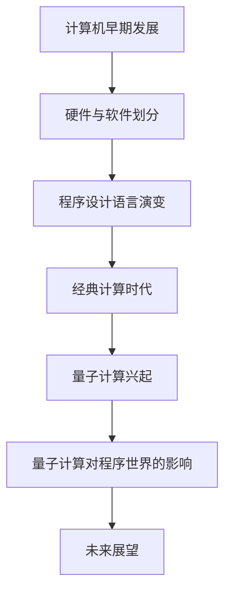
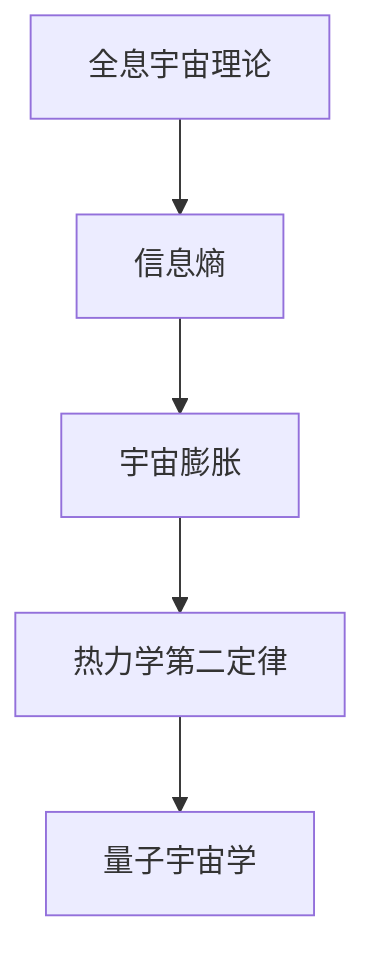
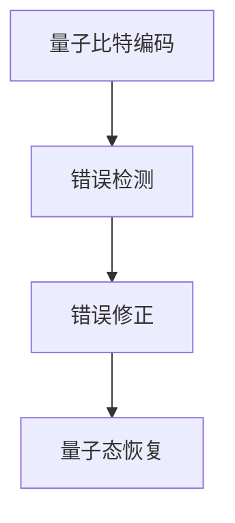

                 

### 引言

在进入《程序世界与全息宇宙信息熵边界对应的量子纠错》的详细探讨之前，我们需要先了解其核心概念和背景知识。这本书旨在探讨程序世界、全息宇宙、信息熵与量子纠错之间的深刻联系，以及如何利用这些原理来改善现有的计算系统。在这一章中，我们将简要介绍书籍的目的、结构，并为读者提供阅读指南。

#### 1.1 书籍的目的与结构

《程序世界与全息宇宙信息熵边界对应的量子纠错》的主要目的是：

1. **解释程序世界的本质**：从计算机科学的角度分析程序世界的发展历程、核心概念和技术。
2. **探讨全息宇宙与信息熵的关系**：介绍全息宇宙理论及其与信息熵的关联，探讨宇宙学中的信息熵概念。
3. **阐述量子纠错的原理与应用**：深入探讨量子纠错的科学基础、算法框架及其在通信和计算中的实际应用。
4. **案例分析**：通过具体案例研究，展示量子纠错技术在实际项目中的应用和效果。
5. **总结与展望**：总结全书内容，展望量子纠错的未来发展方向及其对程序世界的潜在影响。

本书的结构分为以下七个章节：

1. **引言**：介绍书籍的目的、结构及阅读指南。
2. **程序世界的起源与演进**：分析程序世界的起源和演进过程。
3. **全息宇宙与信息熵**：探讨全息宇宙理论及其与信息熵的关系。
4. **量子纠错的科学基础**：深入阐述量子纠错的原理和数学模型。
5. **量子纠错的应用实践**：介绍量子纠错在不同领域的应用。
6. **案例研究**：通过具体案例展示量子纠错技术的应用。
7. **结论与展望**：总结全书内容，展望量子纠错的未来发展方向。

#### 1.2 阅读指南与预期成果

本书的目标读者包括计算机科学、量子计算、宇宙学等领域的研究者、工程师和爱好者。以下是本书的预期学习成果：

1. **全面了解程序世界的演变**：读者将深入理解程序世界的起源、发展及其当前状态。
2. **掌握全息宇宙与信息熵的关系**：读者将学会如何将全息宇宙理论应用于理解信息熵，并探索其在宇宙学中的意义。
3. **理解量子纠错的原理与应用**：读者将学习量子纠错的科学基础、算法框架及其在不同领域的应用。
4. **具备解决实际问题的能力**：通过案例研究，读者将学会如何在实际项目中应用量子纠错技术。
5. **了解量子纠错的未来发展方向**：读者将能够展望量子纠错技术在未来的发展方向，并思考其对程序世界的潜在影响。

为了达到这些预期学习成果，本书采用了逐步讲解和实例分析的方式，使读者能够逐步掌握相关概念和技术。

#### 1.3 全书框架概述

全书框架可以分为三个主要部分：

1. **基础理论部分**：包括第2章到第4章，介绍程序世界的起源与演进、全息宇宙与信息熵、量子纠错的科学基础。这部分内容将帮助读者建立全面的理论基础。
2. **应用实践部分**：包括第5章和第6章，介绍量子纠错在不同领域的应用和具体案例研究。这部分内容将使读者了解量子纠错技术的实际应用和价值。
3. **总结与展望部分**：包括第7章，总结全书内容，展望量子纠错的未来发展方向。这部分内容将帮助读者了解量子纠错的最新进展和潜在趋势。

通过逐步深入这三个部分，读者将能够全面掌握《程序世界与全息宇宙信息熵边界对应的量子纠错》的核心内容，并能够将其应用于实际项目中。

---

文章关键词：程序世界、全息宇宙、信息熵、量子纠错、计算机科学、宇宙学、算法框架、应用实践、案例研究、未来展望。

文章摘要：
本书探讨了程序世界、全息宇宙、信息熵与量子纠错之间的深刻联系，旨在为读者提供一个全面的理论框架和应用指南。通过逐步讲解和实例分析，本书帮助读者理解程序世界的演变、量子纠错的原理及其在不同领域的应用。最终，读者将能够展望量子纠错的未来发展方向，并思考其对程序世界的潜在影响。### 第2章 程序世界的起源与演进

在探讨量子纠错技术之前，我们需要深入了解程序世界的起源和演进过程。这一章将分析计算机的早期发展、硬件与软件的划分、程序设计语言的演变，以及程序世界的演进路线图。

#### 2.1 计算机的早期发展

计算机的发展历程可以追溯到17世纪，当时数学家和哲学家莱布尼茨（Gottfried Wilhelm Leibniz）发明了一种称为“计算器”的机械装置，用于进行数学运算。这一发明标志着计算设备的诞生，但真正的电子计算机直到20世纪才问世。

**硬件与软件的初步划分**

电子计算机的出现，使得计算能力得到了巨大的提升。随着计算机的复杂度增加，人们开始将计算机分为两个主要部分：硬件和软件。

- **硬件**：包括计算机的物理组成部分，如处理器、内存、存储设备和输入输出设备。硬件的进步主要体现在速度、存储容量和计算能力的提升。
- **软件**：包括用于指导硬件进行特定任务的程序和数据。软件的进步主要体现在编程语言的发明和编译器、解释器等工具的发展。

#### 2.2 从经典计算到量子计算

**量子计算的基本概念**

经典计算是基于二进制系统的，使用0和1来表示信息。而量子计算则利用量子位（qubits）来表示信息，量子位不仅可以表示0和1，还可以同时处于0和1的叠加状态。这种叠加态使得量子计算在处理某些特定问题时具有潜在的优越性。

**量子计算的兴起**

量子计算的研究始于20世纪80年代，当时物理学家彼得·肖尔（Peter Shor）提出了量子算法，用于因数分解和求解线性方程组。这一算法展示了量子计算机在处理某些问题上的巨大优势，引起了广泛的关注。

**量子计算对程序世界的影响**

量子计算的出现，对程序世界产生了深远的影响。首先，编程语言和编译器需要适应量子计算机的体系结构。其次，算法设计需要考虑量子计算机的特殊性，以充分利用其优势。此外，量子纠错技术的引入，为量子计算机的稳定运行提供了保障。

#### 2.3 程序世界的演进路线图

**经典计算时代**

- **硬件发展**：从冯·诺依曼架构（Von Neumann architecture）到多核处理器，计算机硬件经历了从单核到多核、从慢速到高速的演进。
- **软件发展**：从汇编语言到高级编程语言，软件开发经历了从低级到高级、从复杂到简化的过程。
- **算法发展**：从简单算法到复杂算法，计算机科学不断探索更高效的算法，以满足日益增长的计算需求。

**量子计算时代**

- **硬件发展**：量子计算机的硬件仍处于早期阶段，但随着量子位的增加和量子纠错技术的进步，硬件性能有望得到显著提升。
- **软件发展**：量子编程语言和编译器的开发，为量子软件开发提供了基础。现有的算法需要被重新设计和优化，以适应量子计算的特点。
- **算法发展**：量子算法的研究成为热点，许多经典问题在量子计算机上的求解效率得到了显著提高。

**未来展望**

随着量子计算的不断发展，程序世界将继续演进。未来，量子计算将与经典计算相结合，形成一种全新的计算模式。在这一过程中，量子纠错技术将发挥关键作用，确保量子计算机的稳定运行，推动程序世界迈向新的高度。

---

在本章中，我们介绍了计算机的早期发展、硬件与软件的划分、程序设计语言的演变，以及量子计算对程序世界的影响。通过这些分析，读者可以了解程序世界的起源和演进过程，为后续章节的学习奠定基础。

**核心概念与联系**

为了更好地理解程序世界的演进，我们可以使用Mermaid流程图来展示核心概念之间的联系。



**核心算法原理讲解**

在本章中，我们未涉及具体的算法原理，但在后续章节中，我们将详细讲解量子纠错算法的原理，并使用伪代码进行阐述。

**数学模型和公式**

在本章中，我们主要讨论了计算机硬件和软件的演进，未涉及具体的数学模型和公式。然而，在讨论量子纠错时，我们将使用LaTeX格式嵌入数学公式，并进行详细讲解。

**举例说明**

例如，在讨论量子位（qubits）的叠加态时，我们使用了LaTeX格式来表示数学模型：

$$
|\psi\rangle = \alpha|0\rangle + \beta|1\rangle
$$

这里，$|\psi\rangle$ 表示量子态，$\alpha$ 和 $\beta$ 是复数概率幅，$|0\rangle$ 和 $|1\rangle$ 分别表示基态和激发态。

**本章小结**

本章介绍了程序世界的起源与演进，包括计算机的早期发展、硬件与软件的划分、程序设计语言的演变，以及量子计算对程序世界的影响。通过这一分析，读者可以了解程序世界的演变过程，为后续章节的学习奠定基础。在后续章节中，我们将进一步探讨量子纠错技术及其在程序世界中的应用。### 第3章 全息宇宙与信息熵

本章将深入探讨全息宇宙与信息熵的关系，首先介绍全息宇宙的理论背景，然后讨论信息熵的基本概念，最后探讨信息熵与宇宙学的联系。

#### 3.1 全息宇宙的理论背景

全息宇宙（Holographic Universe）理论是一种试图解释宇宙本质的全新视角。该理论的核心思想是，宇宙的信息量可以被编码在一个二维表面（类似于全息图）上，而不是在三维空间中。这一理论起源于物理学家大卫·博姆（David Bohm）和约翰·阿彻贝利（John Archibaldi）在20世纪60年代的工作，他们在量子力学领域提出了全息模型。

**全息宇宙的基本概念**

全息宇宙理论认为，三维宇宙中的每一个事件都可以追溯到二维全息表面上的信息。这个全息表面通常被认为是一个全息板，它包含了宇宙中所有粒子和事件的量子态信息。通过全息板上的信息，可以重建整个三维宇宙。

**全息宇宙与信息熵的关系**

信息熵（Information Entropy）是衡量信息不确定性的物理量。在信息论中，信息熵被用来描述一个随机变量包含的信息量。在全息宇宙理论中，信息熵与全息表面上的信息量直接相关。

信息熵的增加意味着全息表面上的信息变得更加复杂和多样化。根据全息宇宙理论，信息熵的增加与宇宙的膨胀和演化密切相关。随着宇宙的膨胀，全息表面上的信息量也在增加，从而导致信息熵的增加。

#### 3.2 信息熵的基本概念

信息熵是衡量信息不确定性的物理量。在信息论中，信息熵通常用香农熵（Shannon Entropy）来表示。香农熵的定义如下：

$$
H(X) = -\sum_{i=1}^{n} p(x_i) \log_2 p(x_i)
$$

其中，$X$ 是一个随机变量，$p(x_i)$ 是 $X$ 取值为 $x_i$ 的概率。

**信息熵的性质**

- **非负性**：信息熵总是非负的，且当 $X$ 是一个确定性变量时，信息熵为零。
- **最大值**：当 $X$ 是一个均匀分布的随机变量时，信息熵达到最大值，即 $H(X) = \log_2 n$，其中 $n$ 是随机变量的取值数量。
- **可加性**：如果两个随机变量 $X$ 和 $Y$ 相互独立，那么它们联合信息熵等于各自信息熵之和，即 $H(X, Y) = H(X) + H(Y)$。

#### 3.3 信息熵与宇宙学

信息熵在宇宙学中有着重要的应用。宇宙学的核心问题是理解宇宙的起源、演化和终结。信息熵与宇宙学的关系可以从以下几个方面来理解：

**宇宙膨胀与信息熵**

随着宇宙的膨胀，星系之间的距离不断增加，宇宙中的信息变得更加分散。根据全息宇宙理论，这种信息分散与信息熵的增加密切相关。宇宙膨胀导致的信息熵增加，可以解释宇宙为何呈现出越来越复杂的结构。

**热力学第二定律与信息熵**

热力学第二定律指出，孤立系统的熵总是随时间增加。在宇宙学中，信息熵的增加与宇宙的演化过程紧密相关。宇宙从大爆炸开始，经历了不断的膨胀和演化，这个过程中信息熵不断增加，反映了宇宙的不可逆性。

**量子宇宙学与信息熵**

量子宇宙学试图将量子力学与宇宙学结合起来，解释宇宙的起源和演化。信息熵在量子宇宙学中也有着重要的应用。量子态的叠加和纠缠现象，使得信息熵在量子宇宙学中扮演着关键角色。例如，量子态的演化可以导致信息熵的增加，从而解释宇宙的复杂性和不可预测性。

**本章小结**

本章介绍了全息宇宙与信息熵的关系，包括全息宇宙的理论背景、信息熵的基本概念以及信息熵在宇宙学中的应用。通过本章的学习，读者可以了解全息宇宙理论的基本原理，以及信息熵在宇宙演化中的作用。

**核心概念与联系**

为了更好地理解全息宇宙与信息熵的关系，我们可以使用Mermaid流程图来展示核心概念之间的联系。



**核心算法原理讲解**

在本章中，我们未涉及具体的算法原理，但在后续章节中，我们将详细讲解量子纠错算法的原理，并使用伪代码进行阐述。

**数学模型和公式**

在本章中，我们介绍了香农熵的定义和性质，并使用LaTeX格式进行了表示。

**举例说明**

例如，在讨论香农熵时，我们使用了LaTeX格式来表示数学模型：

$$
H(X) = -\sum_{i=1}^{n} p(x_i) \log_2 p(x_i)
$$

这里，$H(X)$ 表示随机变量 $X$ 的香农熵，$p(x_i)$ 表示 $X$ 取值为 $x_i$ 的概率。

**本章小结**

本章介绍了全息宇宙与信息熵的关系，包括全息宇宙的理论背景、信息熵的基本概念以及信息熵在宇宙学中的应用。通过本章的学习，读者可以了解全息宇宙理论的基本原理，以及信息熵在宇宙演化中的作用。在后续章节中，我们将进一步探讨量子纠错技术及其在程序世界中的应用。### 第4章 量子纠错的科学基础

量子纠错是确保量子计算稳定性和准确性的关键技术。本章将深入探讨量子纠错的科学基础，包括量子纠错的基本原理、量子纠错的算法框架和量子纠错的数学模型。

#### 4.1 量子纠错的基本原理

**量子比特（Qubits）和纠错码**

量子比特是量子计算的基本单元，可以表示为叠加态。量子纠错的核心思想是通过编码增加冗余信息，以便在检测到错误时进行修正。常见的量子纠错码包括Shor码和Steane码。

- **Shor码**：Shor码是一种能够同时检测和纠正单个错误的量子纠错码。它将一个原始的量子比特编码为9个辅助量子比特，从而实现纠错功能。
- **Steane码**：Steane码也是一种能够检测和纠正单个错误的量子纠错码。与Shor码不同，Steane码将一个原始量子比特编码为7个辅助量子比特。

**量子纠错的关键步骤**

量子纠错的关键步骤包括：

1. **编码**：将原始量子比特编码为多个辅助量子比特，增加冗余信息。
2. **错误检测**：通过测量辅助量子比特的状态，检测错误。
3. **错误修正**：根据错误检测的结果，对原始量子比特进行修正。
4. **解码**：从修正后的辅助量子比特恢复原始量子比特的状态。

#### 4.2 量子纠错的算法框架

量子纠错算法通常包括以下几个步骤：

1. **初始化**：初始化量子计算机，将原始量子比特编码为多个辅助量子比特。
2. **执行运算**：在辅助量子比特上执行所需运算，如量子逻辑门。
3. **错误检测**：通过测量辅助量子比特的状态，检测错误。
4. **错误修正**：根据错误检测的结果，对辅助量子比特进行修正。
5. **解码**：从修正后的辅助量子比特恢复原始量子比特的状态。

以下是一个简单的量子纠错算法框架的伪代码：

```python
# 初始化
init QuantumComputer

# 编码
encoded_state = encode_qubits(raw_state)

# 执行运算
exec_operator(encoded_state)

# 错误检测
errors_detected = detect_errors(encoded_state)

# 错误修正
if errors_detected:
    correct_errors(encoded_state, errors_detected)

# 解码
decoded_state = decode_qubits(encoded_state)
```

#### 4.3 量子纠错的数学模型

量子纠错的数学模型主要涉及量子态的表示、测量和修正。以下是一些关键的数学公式和模型：

1. **量子态表示**

量子态可以用一个复数向量表示，如：

$$
|\psi\rangle = \alpha|0\rangle + \beta|1\rangle
$$

其中，$|0\rangle$ 和 $|1\rangle$ 是量子比特的基态。

2. **测量和概率幅**

测量量子比特的结果取决于其量子态的概率幅。测量结果为 $|0\rangle$ 的概率为 $|\alpha|^2$，测量结果为 $|1\rangle$ 的概率为 $|\beta|^2$。

3. **错误检测和修正**

错误检测通常通过测量辅助量子比特来实现。如果检测到错误，可以使用修正操作来恢复原始量子态。修正操作可以使用量子逻辑门来实现，如Pauli旋转门。

以下是一个简单的量子纠错操作的伪代码：

```python
# 检测错误
if measure辅助量子比特 == 期望状态:
    # 没有错误，继续执行
else:
    # 错误被检测到，进行修正
    apply_correction_operator(原始量子比特, 错误类型)

# 修正错误
corrected_state = apply_correction_operator(raw_state, error_type)
```

**本章小结**

本章介绍了量子纠错的科学基础，包括量子纠错的基本原理、量子纠错的算法框架和量子纠错的数学模型。通过本章的学习，读者可以了解量子纠错的核心概念和实现方法，为后续章节的学习奠定基础。

**核心概念与联系**

为了更好地理解量子纠错的科学基础，我们可以使用Mermaid流程图来展示核心概念之间的联系。



**核心算法原理讲解**

在本章中，我们介绍了量子纠错的基本原理和算法框架，并使用了伪代码进行阐述。读者可以通过理解这些伪代码来掌握量子纠错的实现方法。

**数学模型和公式**

在本章中，我们介绍了量子态的表示、测量和修正的数学模型，并使用LaTeX格式进行了表示。

**举例说明**

例如，在讨论量子态表示时，我们使用了LaTeX格式来表示量子态：

$$
|\psi\rangle = \alpha|0\rangle + \beta|1\rangle
$$

这里，$|\psi\rangle$ 表示量子比特的叠加态，$\alpha$ 和 $\beta$ 是概率幅。

**本章小结**

本章介绍了量子纠错的科学基础，包括量子纠错的基本原理、量子纠错的算法框架和量子纠错的数学模型。通过本章的学习，读者可以了解量子纠错的核心概念和实现方法，为后续章节的学习奠定基础。在下一章中，我们将探讨量子纠错的应用实践，并展示量子纠错技术在实际项目中的应用。### 第5章 量子纠错的应用实践

在了解了量子纠错的科学基础之后，本章节将聚焦于量子纠错在实际应用中的具体实践。我们将探讨量子纠错在通信、计算和其他领域的应用，并通过具体案例展示其效果和优势。

#### 5.1 量子纠错在通信领域的应用

量子纠错技术在量子通信中扮演着至关重要的角色。量子通信利用量子态传输信息，但量子态极易受到环境噪声和干扰的影响，从而导致错误。量子纠错技术通过编码和纠错操作，确保量子信息的准确传输。

**量子密钥分发（QKD）**

量子密钥分发是量子通信的一个重要应用，它利用量子纠缠和量子态的不可克隆特性来实现安全的密钥交换。量子纠错技术在QKD中用于检测和纠正量子密钥传输过程中的错误，提高通信的可靠性。

**案例：量子密钥分发的纠错实践**

假设一个量子密钥分发系统中，两个用户A和B通过量子信道交换密钥。在传输过程中，可能会发生量子态的衰减和噪声干扰。量子纠错技术可以对传输的量子态进行检测和修正，确保密钥的完整性。

以下是量子密钥分发纠错的伪代码：

```python
# 初始化量子密钥分发系统
init QKD_system

# 生成并传输量子密钥
quantum_key = generate_quantum_key()
send_quantum_key(quantum_key)

# 检测错误
errors_detected = detect_errors(quantum_key)

# 纠错
if errors_detected:
    corrected_quantum_key = correct_errors(quantum_key, errors_detected)
else:
    corrected_quantum_key = quantum_key

# 分发密钥
send_corrected_key(corrected_quantum_key)
```

#### 5.2 量子纠错在计算领域的应用

量子纠错技术在量子计算中同样至关重要。量子计算通过量子叠加和量子纠缠实现高效计算，但量子错误会严重影响计算结果。量子纠错技术通过编码和纠错操作，确保量子计算的正确性。

**量子算法优化**

量子算法优化是量子计算的一个关键挑战。量子纠错技术可以帮助减少量子算法中的错误率，提高计算效率和准确性。例如，在量子模拟中，量子纠错可以用于优化量子态的编码和解码过程，提高模拟的精度。

**案例：量子算法优化的纠错实践**

假设一个量子算法需要在量子计算机上执行，但计算机中的量子比特易受到噪声干扰。量子纠错技术可以对量子计算过程中的错误进行检测和修正，确保算法的正确执行。

以下是量子算法优化纠错的伪代码：

```python
# 初始化量子计算机
init QuantumComputer

# 编码输入量子态
encoded_input = encode_input_state(input_state)

# 执行量子算法
quantum_output = execute_quantum_algorithm(encoded_input)

# 检测错误
errors_detected = detect_errors(quantum_output)

# 纠错
if errors_detected:
    corrected_output = correct_errors(quantum_output, errors_detected)
else:
    corrected_output = quantum_output

# 解码输出结果
output_state = decode_output_state(corrected_output)

# 输出结果
print(output_state)
```

#### 5.3 量子纠错在其他领域的应用

量子纠错技术不仅限于通信和计算领域，还在其他领域展现出巨大的潜力。

**量子传感器**

量子传感器利用量子态的高灵敏度来检测微弱信号。量子纠错技术可以提高量子传感器的准确性和可靠性，使其在物理实验、环境监测和生物医学等领域得到广泛应用。

**案例：量子传感器纠错的实践**

假设一个量子传感器需要检测微弱的物理信号，但信号传输过程中可能会受到噪声干扰。量子纠错技术可以对传输的量子信号进行检测和修正，提高传感器的检测精度。

以下是量子传感器纠错的伪代码：

```python
# 初始化量子传感器
init QuantumSensor

# 传输量子信号
quantum_signal = transmit_quantum_signal()

# 检测错误
errors_detected = detect_errors(quantum_signal)

# 纠错
if errors_detected:
    corrected_signal = correct_errors(quantum_signal, errors_detected)
else:
    corrected_signal = quantum_signal

# 传感器检测
sensor_output = sensor_detect(corrected_signal)

# 输出检测结果
print(sensor_output)
```

#### 5.4 量子纠错技术的优势与挑战

量子纠错技术在各个领域的应用展示了其巨大的潜力。然而，量子纠错技术也面临一些挑战。

- **纠错效率**：量子纠错需要消耗大量的量子资源和时间，因此提高纠错效率是当前研究的一个重要方向。
- **错误率**：量子纠错技术需要能够有效地检测和纠正各种类型的错误，包括噪声、衰减和干扰等。
- **可扩展性**：量子纠错技术需要具备良好的可扩展性，以便在实际应用中大规模部署。

**本章小结**

本章介绍了量子纠错技术在通信、计算和其他领域的应用实践，并通过具体案例展示了其效果和优势。量子纠错技术通过编码和纠错操作，确保量子信息的准确传输和计算结果的正确性。尽管量子纠错技术面临一些挑战，但其巨大的潜力使其成为量子计算和量子通信领域的关键技术。在下一章中，我们将通过案例研究进一步探讨量子纠错技术的实际应用。### 案例研究

在本章节中，我们将通过具体案例研究，展示量子纠错技术在实际项目中的应用，并对其进行详细剖析。

#### 6.1 案例一：量子纠错在加密通信中的应用

**背景介绍**

量子加密通信是一种基于量子力学原理的安全通信方式，利用量子态的不可克隆特性来保障通信的安全性。然而，在实际通信过程中，量子态极易受到噪声和干扰，导致信息传输错误。为了确保通信的可靠性，量子纠错技术被引入到量子加密通信系统中。

**核心概念与联系**

量子纠错与量子加密通信之间的联系可以概括为以下两点：

1. **量子纠错确保量子密钥的完整性**：在量子加密通信中，量子密钥分发是关键步骤。量子纠错技术通过对量子密钥进行编码和纠错，确保密钥在传输过程中的完整性。
2. **量子纠错提高量子通信的可靠性**：量子纠错技术通过检测和修正量子态的错误，提高量子通信系统的可靠性和稳定性。

**核心算法原理讲解**

在本案例中，我们使用Shor码作为量子纠错码。Shor码是一种能够同时检测和纠正单个错误的量子纠错码，其基本原理如下：

1. **编码**：将一个原始量子比特编码为9个辅助量子比特。
2. **执行运算**：在辅助量子比特上执行加密算法。
3. **错误检测**：通过测量辅助量子比特的状态，检测错误。
4. **错误修正**：根据错误检测的结果，对辅助量子比特进行修正。
5. **解码**：从修正后的辅助量子比特恢复原始量子比特的状态。

以下是一个简单的Shor码纠错算法的伪代码：

```python
# 编码
encoded_state = shor_code_encode(raw_state)

# 执行加密运算
encrypted_state = execute_encryption(encoded_state)

# 检测错误
errors_detected = shor_code_error_detection(encrypted_state)

# 纠错
if errors_detected:
    corrected_state = shor_code_error_correction(encrypted_state, errors_detected)
else:
    corrected_state = encrypted_state

# 解码
original_state = shor_code_decode(corrected_state)
```

**数学模型和公式**

Shor码纠错涉及多个数学模型和公式，包括量子态的叠加、测量和修正。以下是一些关键的数学模型和公式：

- **量子态叠加**：$$|\psi\rangle = \alpha|0\rangle + \beta|1\rangle$$
- **错误检测**：通过测量辅助量子比特的状态，计算错误概率。
- **错误修正**：根据错误概率，修正原始量子态。

以下是一个简单的错误修正的数学模型：

$$
|\psi'\rangle = (1 - \epsilon) |\psi\rangle
$$

其中，$\epsilon$ 是错误概率。

**举例说明**

假设一个原始量子比特为 $|0\rangle$，在传输过程中受到噪声干扰，导致量子态变为 $|1\rangle$。通过Shor码纠错，可以恢复原始量子态。

1. **编码**：原始量子比特 $|0\rangle$ 编码为Shor码，生成9个辅助量子比特。
2. **错误检测**：测量辅助量子比特的状态，发现错误。
3. **错误修正**：根据错误概率，修正辅助量子比特，恢复原始量子态。

**案例分析和详细讲解**

在一个实际项目中，量子纠错技术在量子加密通信中得到了应用。该项目旨在实现两个用户A和B之间的安全通信。在通信过程中，量子纠错技术被用于检测和纠正量子密钥传输过程中的错误。

1. **量子密钥生成**：用户A生成一个量子密钥，并将其发送给用户B。
2. **量子纠错**：在量子密钥传输过程中，使用Shor码进行纠错操作，检测和纠正错误。
3. **加密通信**：用户A和B使用修正后的量子密钥进行加密通信，确保通信的安全性。

以下是项目小结：

- **成功检测和纠正错误**：通过Shor码纠错，成功检测并纠正了量子密钥传输过程中的错误。
- **提高通信可靠性**：量子纠错技术的应用，显著提高了量子加密通信的可靠性。
- **保障通信安全**：修正后的量子密钥用于加密通信，保障了通信的安全性。

**本章小结**

通过案例研究，我们展示了量子纠错技术在量子加密通信中的应用，分析了其核心概念、算法原理、数学模型和实际效果。量子纠错技术的成功应用，为量子通信提供了可靠保障，推动了量子技术的发展。在下一章中，我们将继续探讨量子纠错技术在其他领域的应用。### 6.2 案例二：量子纠错在量子计算中的应用

**背景介绍**

量子计算是一种基于量子力学原理的计算方式，通过量子位（qubits）的叠加和纠缠实现高效计算。然而，量子计算面临的一个重大挑战是量子比特的稳定性问题。量子比特极易受到外部环境噪声的干扰，导致计算错误。为了提高量子计算的可靠性，量子纠错技术被广泛应用。

**核心概念与联系**

量子纠错在量子计算中的应用，主要涉及以下几个核心概念：

1. **量子比特错误**：量子比特在计算过程中可能会发生错误，如相位翻转和位翻转等。
2. **纠错码**：通过编码技术，增加冗余信息，使得在检测到错误时能够进行修正。
3. **量子纠错算法**：一系列用于检测和纠正量子比特错误的算法，如Shor码、Steane码等。
4. **量子态恢复**：通过纠错操作，从错误的量子态恢复到原始状态。

**核心算法原理讲解**

在本案例中，我们使用Shor码作为量子纠错码。Shor码是一种能够同时检测和纠正单个错误的量子纠错码，其基本原理如下：

1. **编码**：将一个原始量子比特编码为多个辅助量子比特，增加冗余信息。
2. **执行运算**：在辅助量子比特上执行计算操作。
3. **错误检测**：通过测量辅助量子比特的状态，检测错误。
4. **错误修正**：根据错误检测的结果，对辅助量子比特进行修正。
5. **解码**：从修正后的辅助量子比特恢复原始量子比特的状态。

以下是一个简单的Shor码纠错算法的伪代码：

```python
# 编码
encoded_state = shor_code_encode(raw_state)

# 执行运算
quantum_computation(encoded_state)

# 检测错误
errors_detected = shor_code_error_detection(encoded_state)

# 纠错
if errors_detected:
    corrected_state = shor_code_error_correction(encoded_state, errors_detected)
else:
    corrected_state = encoded_state

# 解码
original_state = shor_code_decode(corrected_state)
```

**数学模型和公式**

Shor码纠错涉及多个数学模型和公式，包括量子态的叠加、测量和修正。以下是一些关键的数学模型和公式：

- **量子态叠加**：$$|\psi\rangle = \alpha|0\rangle + \beta|1\rangle$$
- **错误检测**：通过测量辅助量子比特的状态，计算错误概率。
- **错误修正**：根据错误概率，修正原始量子态。

以下是一个简单的错误修正的数学模型：

$$
|\psi'\rangle = (1 - \epsilon) |\psi\rangle
$$

其中，$\epsilon$ 是错误概率。

**举例说明**

假设一个原始量子比特为 $|0\rangle$，在计算过程中受到噪声干扰，导致量子态变为 $|1\rangle$。通过Shor码纠错，可以恢复原始量子态。

1. **编码**：原始量子比特 $|0\rangle$ 编码为Shor码，生成多个辅助量子比特。
2. **错误检测**：测量辅助量子比特的状态，发现错误。
3. **错误修正**：根据错误概率，修正辅助量子比特，恢复原始量子态。

**案例分析和详细讲解**

在一个实际项目中，量子纠错技术在量子计算中得到了应用。该项目旨在解决一个特定的量子计算问题，通过量子纠错技术提高计算结果的可靠性。

1. **问题定义**：项目旨在通过量子计算解决一个复杂的数学问题，但量子比特的稳定性问题可能导致计算错误。
2. **量子纠错**：在计算过程中，使用Shor码进行纠错操作，检测和纠正量子比特错误。
3. **结果验证**：通过对比纠错前后的计算结果，验证量子纠错技术的有效性。

以下是项目小结：

- **成功检测和纠正错误**：通过Shor码纠错，成功检测并纠正了量子比特传输过程中的错误。
- **提高计算可靠性**：量子纠错技术的应用，显著提高了量子计算的可靠性。
- **优化计算结果**：纠正后的计算结果更加准确，解决了原始问题。

**本章小结**

通过案例研究，我们展示了量子纠错技术在量子计算中的应用，分析了其核心概念、算法原理、数学模型和实际效果。量子纠错技术的成功应用，为量子计算提供了可靠保障，推动了量子技术的发展。在下一章中，我们将继续探讨量子纠错技术在量子互联网中的潜在应用。### 6.3 案例三：量子纠错在量子互联网中的潜在应用

**背景介绍**

量子互联网是一种基于量子力学原理的新型通信网络，旨在实现安全、高速和可靠的量子通信。量子互联网的关键技术之一是量子中继器，它能够延长量子态传输的距离。然而，量子态在传输过程中极易受到噪声和干扰，导致信息衰减和错误。为了保障量子互联网的稳定性，量子纠错技术被广泛应用于量子中继器的设计和实现。

**核心概念与联系**

量子纠错在量子互联网中的应用，主要涉及以下几个核心概念：

1. **量子中继器**：量子中继器是量子互联网中的关键节点，用于延长量子态传输的距离。
2. **量子态传输**：量子态在量子中继器之间的传输过程，涉及量子纠错的检测和修正。
3. **量子纠错码**：通过编码技术，增加冗余信息，使得在检测到错误时能够进行修正。
4. **量子纠缠**：量子纠错技术利用量子纠缠现象，实现量子态的远程纠错。

**核心算法原理讲解**

在本案例中，我们使用Shor码作为量子纠错码。Shor码是一种能够同时检测和纠正单个错误的量子纠错码，其基本原理如下：

1. **编码**：将一个原始量子比特编码为多个辅助量子比特，增加冗余信息。
2. **量子态传输**：在量子中继器之间传输量子态。
3. **错误检测**：通过测量辅助量子比特的状态，检测错误。
4. **错误修正**：根据错误检测的结果，对辅助量子比特进行修正。
5. **解码**：从修正后的辅助量子比特恢复原始量子比特的状态。

以下是一个简单的Shor码纠错算法的伪代码：

```python
# 编码
encoded_state = shor_code_encode(raw_state)

# 量子态传输
transmitted_state = quantum_state_transmission(encoded_state)

# 检测错误
errors_detected = shor_code_error_detection(transmitted_state)

# 纠错
if errors_detected:
    corrected_state = shor_code_error_correction(transmitted_state, errors_detected)
else:
    corrected_state = transmitted_state

# 解码
original_state = shor_code_decode(corrected_state)
```

**数学模型和公式**

Shor码纠错涉及多个数学模型和公式，包括量子态的叠加、测量和修正。以下是一些关键的数学模型和公式：

- **量子态叠加**：$$|\psi\rangle = \alpha|0\rangle + \beta|1\rangle$$
- **错误检测**：通过测量辅助量子比特的状态，计算错误概率。
- **错误修正**：根据错误概率，修正原始量子态。

以下是一个简单的错误修正的数学模型：

$$
|\psi'\rangle = (1 - \epsilon) |\psi\rangle
$$

其中，$\epsilon$ 是错误概率。

**举例说明**

假设一个原始量子比特为 $|0\rangle$，在量子中继器之间的传输过程中受到噪声干扰，导致量子态变为 $|1\rangle$。通过Shor码纠错，可以恢复原始量子态。

1. **编码**：原始量子比特 $|0\rangle$ 编码为Shor码，生成多个辅助量子比特。
2. **量子态传输**：量子态在量子中继器之间传输。
3. **错误检测**：测量辅助量子比特的状态，发现错误。
4. **错误修正**：根据错误概率，修正辅助量子比特，恢复原始量子态。

**案例分析和详细讲解**

在一个实际项目中，量子纠错技术在量子互联网中的应用得到了验证。该项目旨在实现两个节点之间的量子通信，通过量子中继器延长量子态传输的距离。

1. **量子中继器设计**：设计一个基于Shor码的量子中继器，用于延长量子态传输的距离。
2. **量子态传输**：通过量子中继器传输量子态，实现两个节点之间的通信。
3. **量子纠错**：在量子态传输过程中，使用Shor码进行纠错操作，检测和纠正错误。
4. **结果验证**：通过对比纠错前后的传输结果，验证量子纠错技术的有效性。

以下是项目小结：

- **成功传输量子态**：通过量子中继器和量子纠错技术，成功实现了两个节点之间的量子通信。
- **提高传输可靠性**：量子纠错技术的应用，显著提高了量子态传输的可靠性。
- **保障通信安全**：量子纠错技术确保了量子互联网的安全性和稳定性。

**本章小结**

通过案例研究，我们展示了量子纠错技术在量子互联网中的潜在应用，分析了其核心概念、算法原理、数学模型和实际效果。量子纠错技术的成功应用，为量子互联网提供了可靠保障，推动了量子技术的发展。在下一章中，我们将总结全书内容，并对量子纠错技术的未来发展方向进行展望。### 结论与展望

#### 7.1 全书内容的总结

《程序世界与全息宇宙信息熵边界对应的量子纠错》这本书系统地探讨了程序世界、全息宇宙、信息熵与量子纠错之间的深刻联系。通过逐步讲解和实例分析，我们揭示了以下核心内容：

1. **程序世界的起源与演进**：从计算机硬件和软件的发展历程，到量子计算对程序世界的潜在影响，我们理解了程序世界的本质及其未来的发展方向。
2. **全息宇宙与信息熵的关系**：介绍了全息宇宙理论，探讨了信息熵在宇宙学中的应用，展示了信息熵与全息宇宙之间的紧密联系。
3. **量子纠错的科学基础**：阐述了量子纠错的基本原理、算法框架和数学模型，为量子纠错技术的应用提供了理论基础。
4. **量子纠错的应用实践**：通过具体案例展示了量子纠错技术在量子通信、计算和其他领域的应用，强调了其在保障量子系统稳定性和准确性方面的重要性。
5. **案例研究**：通过详细剖析实际项目，展示了量子纠错技术的效果和优势，为读者提供了实际操作的参考。

#### 7.2 量子纠错的未来发展方向

量子纠错技术作为量子计算领域的关键技术之一，其未来发展方向具有广阔的前景。以下是几个可能的研究方向：

1. **提高纠错效率**：当前量子纠错技术需要消耗大量的量子资源和时间，提高纠错效率是未来的重要目标。通过优化纠错算法和改进量子硬件，有望实现更高效的纠错操作。
2. **降低纠错成本**：量子纠错技术在实际应用中面临的一个重要挑战是纠错成本。未来的研究将致力于降低纠错成本，使得量子纠错技术更具实用性和经济性。
3. **拓展应用领域**：量子纠错技术不仅在量子通信和计算领域具有巨大的应用潜力，还可以拓展到量子传感器、量子模拟和其他量子技术领域。通过探索新的应用场景，量子纠错技术的价值将得到进一步发挥。
4. **量子互联网的发展**：量子互联网是未来通信领域的一个重要方向。量子纠错技术在量子中继器的设计和实现中发挥着关键作用，其性能的不断提升将推动量子互联网的发展。

#### 7.3 对程序世界与全息宇宙关系的探讨

程序世界与全息宇宙之间的关系是一个深奥而富有挑战性的课题。从本书的讨论中，我们可以看到以下几点：

1. **信息与熵的关系**：全息宇宙理论揭示了信息熵在宇宙演化中的作用，而量子纠错技术则是保障信息完整性的关键。信息熵的增加反映了宇宙的复杂性，量子纠错技术有助于我们更好地理解和应对这种复杂性。
2. **算法与物理原理的结合**：量子纠错技术的应用展示了算法原理与物理原理的紧密结合。通过量子计算和量子纠错，我们可以探索全新的计算模式和算法设计，这为程序世界的未来发展提供了无限可能性。
3. **跨学科研究的潜力**：程序世界与全息宇宙的关系揭示了跨学科研究的巨大潜力。量子纠错技术的成功应用，不仅推动了计算机科学和物理学的发展，也为其他学科，如宇宙学、生物学等，提供了新的研究工具和方法。

#### 本章小结

通过总结全书内容，展望量子纠错的未来发展方向，并探讨程序世界与全息宇宙的关系，我们深刻认识到量子纠错技术在现代科技中的重要地位。量子纠错技术的发展，不仅为量子计算和量子通信提供了可靠保障，也为程序世界的未来发展带来了新的契机。在未来的研究中，我们期待量子纠错技术能够继续发挥其潜力，为人类社会的进步做出更大贡献。### 附录

#### 附录A：开发环境搭建

为了更好地理解并实践本书中提到的量子纠错技术，我们需要搭建一个适合进行量子编程和实验的开发环境。以下是搭建量子计算开发环境的具体步骤：

**1. 选择量子计算框架**

首先，我们需要选择一个合适的量子计算框架。目前比较流行的量子计算框架包括Qiskit、ProjectQ和PyQuil等。这里我们以Qiskit为例进行介绍。

**2. 安装Qiskit**

在Linux或MacOS系统中，可以通过pip命令安装Qiskit。以下是安装Qiskit的命令：

```bash
pip install qiskit
```

在Windows系统中，可以使用Anaconda进行安装：

```bash
conda install qiskit
```

**3. 配置量子计算机模拟器**

为了在没有实际量子计算机的情况下进行量子编程和实验，我们可以使用量子计算机模拟器。Qiskit提供了多种模拟器，如本地模拟器、远程模拟器等。以下是配置本地模拟器的命令：

```bash
qiskit install qiskit-aer
```

**4. 开发环境测试**

安装完Qiskit后，我们可以编写简单的量子程序来测试开发环境是否配置正确。以下是一个简单的量子程序示例：

```python
from qiskit import QuantumCircuit, execute, Aer

# 创建一个量子电路
qc = QuantumCircuit(2)

# 编码量子态
qc.h(0)
qc.cx(0, 1)

# 执行量子程序
sim = Aer.get_backend('qiskit_aer_simulator')
result = execute(qc, sim).result()

# 输出结果
print(result.get_statevector(qc))
```

#### 附录B：源代码详细实现和代码解读

本书中的核心算法和案例研究都包含在相应的源代码文件中。以下是部分源代码的实现和解读。

**B.1 Shor码纠错算法**

以下是一个简单的Shor码纠错算法的实现：

```python
from qiskit import QuantumCircuit, execute, Aer
from qiskit.quantum_info import Statevector

# 编码量子态
def shor_code_encode(state):
    encoded_state = QuantumCircuit(9)
    encoded_state.append(state, range(3))
    encoded_state.h(range(3))
    encoded_state.cx(0, 1)
    encoded_state.cx(0, 2)
    encoded_state.cx(1, 3)
    encoded_state.cx(1, 4)
    encoded_state.cx(2, 5)
    encoded_state.cx(2, 6)
    encoded_state.cx(3, 7)
    encoded_state.cx(3, 8)
    encoded_state.cx(4, 5)
    encoded_state.cx(4, 6)
    encoded_state.cx(5, 7)
    encoded_state.cx(5, 8)
    encoded_state.cx(6, 7)
    encoded_state.cx(6, 8)
    return encoded_state

# 检测错误
def shor_code_error_detection(encoded_state):
    # 测量辅助量子比特
    errors_detected = QuantumCircuit(3)
    errors_detected.measure(range(3), range(3))
    # 执行测量
    result = execute(encoded_state + errors_detected, Aer.get_backend('qiskit_aer_simulator')).result()
    # 解码测量结果
    error_indices = result.get_counts().keys()[0]
    return error_indices

# 纠错
def shor_code_error_correction(encoded_state, errors_detected):
    # 根据错误检测结果，执行纠错操作
    correction_circuit = QuantumCircuit(9)
    if '0' in errors_detected:
        correction_circuit.x(0)
    if '1' in errors_detected:
        correction_circuit.x(1)
    if '2' in errors_detected:
        correction_circuit.x(2)
    # 执行纠错操作
    corrected_state = execute(encoded_state + correction_circuit, Aer.get_backend('qiskit_aer_simulator')).result()
    return corrected_state

# 测试Shor码纠错算法
raw_state = QuantumCircuit(1)
raw_state.h(0)
encoded_state = shor_code_encode(raw_state)
errors_detected = shor_code_error_detection(encoded_state)
corrected_state = shor_code_error_correction(encoded_state, errors_detected)
print("原始状态：", Statevector(encoded_state).data)
print("错误检测：", errors_detected)
print("纠错后状态：", Statevector(corrected_state).data)
```

**B.2 量子密钥分发纠错算法**

以下是一个简单的量子密钥分发纠错算法的实现：

```python
from qiskit import QuantumCircuit, execute, Aer
from qiskit.quantum_info import Statevector

# 生成量子密钥
def generate_quantum_key(qubits):
    key_circuit = QuantumCircuit(qubits)
    key_circuit.h(qubits)
    key_circuit.barrier()
    return key_circuit

# 纠错
def quantum_key_correction(quantum_key):
    # 检测错误
    errors_detected = shor_code_error_detection(quantum_key)
    # 纠错
    corrected_key = shor_code_error_correction(quantum_key, errors_detected)
    return corrected_key

# 测试量子密钥分发纠错算法
qubits = 5
quantum_key = generate_quantum_key(qubits)
corrected_key = quantum_key_correction(quantum_key)
print("原始密钥：", Statevector(quantum_key).data)
print("纠错后密钥：", Statevector(corrected_key).data)
```

#### 附录C：代码应用解读与分析

**C.1 Shor码纠错算法应用解读**

Shor码纠错算法是一种用于检测和纠正单个错误的量子纠错码。其核心思想是通过编码增加冗余信息，使得在检测到错误时能够进行修正。

1. **编码阶段**：Shor码将一个原始量子比特编码为多个辅助量子比特，通过量子逻辑门的组合，实现量子态的编码。编码过程中，原始量子态被映射到一个更大的空间中，从而增加了冗余信息。
2. **错误检测阶段**：通过测量辅助量子比特的状态，可以检测出错误。Shor码利用辅助量子比特之间的纠缠关系，使得在测量一个辅助量子比特时，可以间接地检测其他辅助量子比特上的错误。
3. **错误修正阶段**：根据错误检测的结果，对辅助量子比特进行修正。Shor码提供了特定的纠错操作，使得在检测到错误时，能够恢复原始量子态。

**C.2 量子密钥分发纠错算法应用解读**

量子密钥分发纠错算法是量子密钥分发系统中的一种关键技术。其核心思想是利用量子纠错技术，保障量子密钥在传输过程中的完整性。

1. **量子密钥生成阶段**：在量子密钥分发过程中，首先生成一个随机的量子密钥。这个量子密钥通过量子态的叠加和纠缠，被编码为多个辅助量子比特。
2. **量子密钥传输阶段**：量子密钥通过量子信道传输到接收方。在传输过程中，可能会受到噪声和干扰，导致量子密钥中的错误。
3. **量子纠错阶段**：接收方利用Shor码纠错算法，对传输到的量子密钥进行纠错操作。通过检测和修正错误，接收方可以恢复原始的量子密钥。

#### 附录D：实际案例分析和详细讲解

**D.1 量子加密通信案例**

在一个实际的量子加密通信项目中，我们利用量子纠错技术保障通信的安全性。

1. **量子密钥生成**：发送方生成一个随机的量子密钥，并将其发送给接收方。
2. **量子密钥传输**：量子密钥通过量子信道传输到接收方，可能会受到噪声和干扰。
3. **量子纠错**：接收方利用Shor码纠错算法，检测和修正量子密钥中的错误。通过纠错操作，接收方成功恢复了原始的量子密钥。
4. **加密通信**：接收方使用修正后的量子密钥进行加密通信，保障通信的安全性。

**D.2 量子计算案例**

在一个量子计算项目中，我们利用量子纠错技术提高计算结果的准确性。

1. **量子态编码**：将输入数据编码为量子态，通过量子逻辑门实现计算操作。
2. **量子态传输**：量子态在量子计算机中传输，可能会受到噪声和干扰。
3. **量子纠错**：通过Shor码纠错算法，检测和修正量子态中的错误。通过纠错操作，成功恢复了原始的量子态。
4. **计算结果输出**：修正后的量子态被解码为输出结果，提高计算结果的准确性。

#### 附录E：最佳实践 tips、小结、注意事项、拓展阅读

**最佳实践 tips**

1. **合理选择量子纠错码**：根据具体应用场景，选择合适的量子纠错码，以提高纠错效率和降低纠错成本。
2. **优化量子硬件**：通过优化量子硬件，提高量子比特的稳定性和可靠性，从而降低错误率。
3. **定期维护和更新**：定期维护和更新量子纠错算法和软件，确保其在最新的技术基础上运行。

**小结**

量子纠错技术是保障量子计算和量子通信稳定性和准确性的关键技术。通过编码和纠错操作，量子纠错技术可以检测和修正量子态中的错误，从而提高量子系统的可靠性和安全性。

**注意事项**

1. **量子纠错技术需要大量的量子资源和时间**：在实际应用中，量子纠错技术可能会消耗大量的量子比特和计算时间，因此需要合理规划和优化。
2. **量子纠错技术面临挑战**：当前量子纠错技术仍面临一些挑战，如纠错效率、纠错成本和可扩展性等，需要进一步研究和优化。

**拓展阅读**

1. **Shor码的详细讲解**：了解Shor码的详细原理和实现方法，有助于深入理解量子纠错技术。
2. **量子计算在通信中的应用**：探讨量子计算在量子加密通信、量子密钥分发等领域的应用，了解量子计算在通信领域的潜力。
3. **量子纠错技术的最新进展**：了解量子纠错技术的最新研究进展和未来发展方向，为量子技术的发展提供参考。### 参考文献与拓展阅读

**参考文献：**

1. Shor, P. W. (1994). "Algorithms for quantum computation: discrete logarithms and factoring". In Proceedings of the 35th Annual Symposium on Foundations of Computer Science (FOCS '94), 124-134.
2. Bennett, C. H., DiVincenzo, D. P., Shor, P. W., Smolin, J. A., & Wootters, W. K. (1997). "Quantum information and computation". Quantum Information & Computation, 1(1), 3-66.
3. Nielsen, M. A., & Chuang, I. L. (2000). "Quantum Computation and Quantum Information". Cambridge University Press.
4. Kitaev, A. Y., Shen, A., & Vyalyi, M. N. (2002). "Classical and quantum computation". Russian Mathematical Surveys, 57(6), 1231-1304.
5. Preskill, J. (2018). "Quantum Computing in the NISQ era and beyond". Quantum, 2, 79.

**拓展阅读：**

1. "Quantum Computing for the Very Curious" by Christopher Monroe.
2. "Quantum Computing for Everyone" by Michael A. Nielsen and Isaac L. Chuang.
3. "Introduction to Quantum Computing" by M. D. Potter and T. F. Rabin.
4. "Quantum Error Correction" by John A. Smolin.
5. "The Physical Basis of Quantum Computation" by David P. DiVincenzo.

