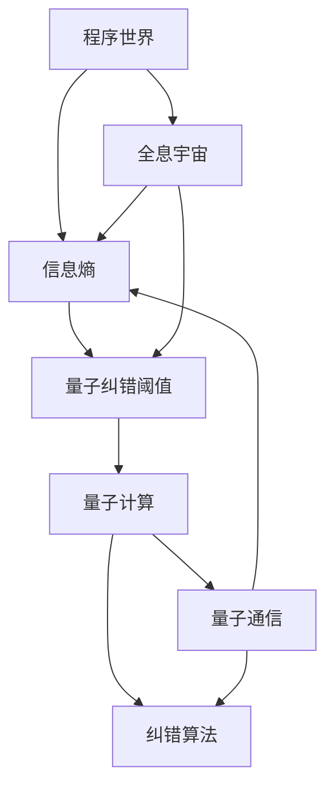

                 

### 第一步：理解书名

首先，我们需要理解书名《程序世界与全息宇宙信息熵边界对应的量子纠错阈值》的含义。

- **程序世界**：指的是计算机程序以及它们构建的虚拟世界，包括软件系统、应用程序和网络服务。
- **全息宇宙**：这可能是一个比喻或理论模型，暗示宇宙中的信息可以通过全息方式来描述和存储。
- **信息熵**：信息熵是衡量信息不确定性的度量，通常用于信息论中。
- **量子纠错阈值**：量子纠错阈值是指量子计算机能够容忍的错误率上限，在这个阈值以下，量子计算机能够稳定运行。

### 第二步：确定书籍的核心内容

基于书名，我们可以推断出书籍的核心内容可能包括：

- 计算机程序的基本概念和发展历程。
- 全息宇宙理论的基础知识，以及它如何与量子计算相关。
- 信息熵的概念和应用，特别是在程序世界和量子计算中的意义。
- 量子纠错机制和量子纠错阈值的研究，以及它们如何影响量子计算的性能。

### 第三步：设计目录大纲

为了构建一篇结构严谨、逻辑清晰的技术博客，我们可以按照以下目录大纲来组织文章内容：

# 《程序世界与全息宇宙信息熵边界对应的量子纠错阈值》

## 引言
### 1.1 书籍背景
#### 1.1.1 计算机程序的发展
#### 1.1.2 全息宇宙理论的兴起
#### 1.1.3 信息熵与量子纠错阈值的重要性

### 1.2 目标读者
#### 1.2.1 适合读者群体
#### 1.2.2 阅读预期收获

### 1.3 书籍结构
#### 1.3.1 章节安排
#### 1.3.2 内容概述
#### 1.3.3 学习目标

## 第2章 程序世界基础
### 2.1 计算机程序概述
#### 2.1.1 程序的基本概念
#### 2.1.2 程序的组成部分
#### 2.1.3 程序的执行流程

### 2.2 程序世界的发展历程
#### 2.2.1 从机械计算到电子计算机
#### 2.2.2 计算机编程语言的演变
#### 2.2.3 程序世界的现代应用

### 2.3 程序世界的挑战与未来
#### 2.3.1 程序复杂性
#### 2.3.2 程序安全的威胁
#### 2.3.3 程序世界的未来趋势

## 第3章 全息宇宙理论
### 3.1 全息宇宙概念
#### 3.1.1 全息理论的基础
#### 3.1.2 全息宇宙模型
#### 3.1.3 全息宇宙的数学描述

### 3.2 全息宇宙与量子计算
#### 3.2.1 量子计算的基础
#### 3.2.2 全息宇宙模型与量子计算的关联
#### 3.2.3 全息量子计算的可能性

### 3.3 全息宇宙的实践应用
#### 3.3.1 全息存储技术
#### 3.3.2 全息通信技术
#### 3.3.3 全息量子计算的实验进展

## 第4章 信息熵与程序世界
### 4.1 信息熵的基本概念
#### 4.1.1 信息熵的定义
#### 4.1.2 信息熵的计算
#### 4.1.3 信息熵的应用领域

### 4.2 信息熵在程序世界中的应用
#### 4.2.1 程序复杂性与信息熵
#### 4.2.2 程序优化的信息熵视角
#### 4.2.3 信息熵与程序性能的关系

### 4.3 信息熵与量子纠错阈值
#### 4.3.1 量子纠错阈值的概念
#### 4.3.2 信息熵与量子纠错阈值的关系
#### 4.3.3 信息熵在量子纠错中的应用

## 第5章 量子纠错机制
### 5.1 量子纠错机制原理
#### 5.1.1 量子错误的基本类型
#### 5.1.2 量子纠错的基本方法
#### 5.1.3 量子纠错的优势与挑战

### 5.2 量子纠错阈值分析
#### 5.2.1 量子纠错阈值的重要性
#### 5.2.2 影响量子纠错阈值的关键因素
#### 5.2.3 提高量子纠错阈值的方法

### 5.3 量子纠错机制的最新进展
#### 5.3.1 量子纠错算法的发展
#### 5.3.2 量子纠错实验的最新成果
#### 5.3.3 量子纠错技术的未来趋势

## 第6章 程序世界与全息宇宙的信息熵边界
### 6.1 信息熵边界概念
#### 6.1.1 信息熵边界的定义
#### 6.1.2 信息熵边界的性质
#### 6.1.3 信息熵边界的重要性

### 6.2 信息熵边界在程序世界中的应用
#### 6.2.1 程序优化与信息熵边界
#### 6.2.2 信息熵边界与程序性能
#### 6.2.3 信息熵边界在软件工程中的应用

### 6.3 信息熵边界与量子纠错的关联
#### 6.3.1 信息熵边界对量子纠错的影响
#### 6.3.2 量子纠错与信息熵边界的关系
#### 6.3.3 信息熵边界在量子纠错中的应用场景

## 第7章 综合应用实例
### 7.1 量子计算机中的程序世界
#### 7.1.1 量子计算机的编程模型
#### 7.1.2 量子计算机中的程序设计
#### 7.1.3 量子计算机的程序实例

### 7.2 全息宇宙模型中的信息熵应用
#### 7.2.1 全息宇宙模型的构建
#### 7.2.2 信息熵在全息宇宙模型中的应用
#### 7.2.3 全息宇宙模型与量子计算的结合

### 7.3 信息熵与量子纠错的边界阈值
#### 7.3.1 信息熵边界阈值的计算
#### 7.3.2 量子纠错阈值在实践中的应用
#### 7.3.3 信息熵与量子纠错阈值的关系解析

## 第8章 结论与展望
### 8.1 研究成果总结
#### 8.1.1 主要发现
#### 8.1.2 研究贡献
#### 8.1.3 未来研究方向

### 8.2 研究展望
#### 8.2.1 量子计算的发展趋势
#### 8.2.2 全息宇宙理论的新进展
#### 8.2.3 信息熵与量子纠错的未来挑战

### 8.3 未来发展方向
#### 8.3.1 程序世界的演进
#### 8.3.2 全息宇宙的探索
#### 8.3.3 信息熵与量子纠错技术的整合

### 第五步：编写核心章节内容

在编写核心章节内容时，我们将遵循以下原则：

- **核心概念与联系**：使用 Mermaid 流程图来展示程序世界、全息宇宙、信息熵和量子纠错阈值之间的联系。
- **核心算法原理讲解**：使用伪代码来详细阐述相关算法原理。
- **数学模型和公式**：使用 LaTeX 格式嵌入文中，并进行详细讲解和举例说明。
- **项目实战**：提供代码实际案例和详细解释说明，包括开发环境搭建、源代码实现和解读分析。
- **最佳实践 tips**：提供实际操作中的注意事项和最佳实践建议。

### 第六步：审核和调整

在完成初稿后，将进行以下审核和调整：

- **逻辑性审核**：确保文章的逻辑结构清晰，各个章节之间的过渡自然。
- **内容完整性审核**：检查每个小节的内容是否丰富具体，核心内容是否包含。
- **准确性审核**：确保所有的技术术语和概念使用准确无误。
- **风格一致性审核**：检查文章的写作风格是否一致，是否符合读者的预期。

通过这些步骤，我们将确保最终的文章既具有深度和见解，又具有易于理解和实用的特点。

### 总结

通过以上六个步骤，我们从理解书名、确定核心内容、设计目录大纲到编写核心章节内容，最后进行审核和调整，我们构建了一个逻辑清晰、结构紧凑、内容丰富的技术博客文章。这个流程确保了文章的专业性和可读性，为读者提供了有价值的知识分享。现在，我们可以开始具体编写各个章节的内容了。

# 《程序世界与全息宇宙信息熵边界对应的量子纠错阈值》

## 第1章 引言

### 1.1 书籍背景

在现代社会中，计算机技术已经成为推动社会发展的重要力量。从早期的机械计算到电子计算机的广泛应用，计算机程序的发展和演变极大地改变了人类的生活方式。与此同时，物理学中的全息理论逐渐兴起，为信息存储和传输提供了全新的视角。信息熵作为信息论的核心概念，为衡量信息的有效性和不确定性提供了重要工具。量子计算作为新一代计算技术的代表，其纠错机制的研究具有重要意义。

本书籍旨在探讨程序世界与全息宇宙之间的深层联系，特别是在信息熵边界对应的量子纠错阈值方面的研究。通过介绍计算机程序、全息宇宙理论、信息熵和量子纠错机制的基本概念，本文将为读者提供一幅全面、系统的技术蓝图。

### 1.2 目标读者

本书籍主要面向以下几类读者：

1. **计算机科学从业者**：包括程序员、软件工程师、系统架构师等，希望通过本书了解量子计算和全息宇宙在程序世界中的应用。
2. **量子计算爱好者**：对量子计算原理和应用有兴趣的读者，希望通过本书深入了解量子纠错机制和量子计算中的信息熵问题。
3. **交叉学科研究者**：包括物理学、数学、信息科学等领域的研究者，希望通过本书探讨量子计算与全息宇宙的跨学科交叉。

### 1.3 书籍结构

本书分为八个主要章节，结构安排如下：

1. **第1章 引言**：介绍书籍背景、目标读者和结构安排。
2. **第2章 程序世界基础**：讨论计算机程序的基本概念、发展历程和应用场景。
3. **第3章 全息宇宙理论**：阐述全息宇宙的概念、模型及其与量子计算的关系。
4. **第4章 信息熵与程序世界**：介绍信息熵的基本概念和应用，特别是在程序世界中的重要性。
5. **第5章 量子纠错机制**：探讨量子纠错机制的基本原理、阈值分析及其最新进展。
6. **第6章 程序世界与全息宇宙的信息熵边界**：分析信息熵边界在程序世界和量子纠错中的应用。
7. **第7章 综合应用实例**：提供量子计算机编程实例、全息宇宙模型中的应用以及信息熵与量子纠错的实践案例。
8. **第8章 结论与展望**：总结研究成果，展望未来发展方向。

通过以上章节的设置，本书力求为读者提供一个系统、全面的技术知识框架，帮助读者深入理解程序世界、全息宇宙以及信息熵与量子纠错阈值之间的复杂关系。

## 第2章 程序世界基础

### 2.1 计算机程序概述

计算机程序是一系列指令的集合，用于指导计算机执行特定任务。程序的基本功能是处理数据、进行计算、控制硬件和提供用户界面。从广义上讲，程序可以分为以下几类：

1. **系统程序**：这类程序主要用于管理计算机硬件和软件资源，包括操作系统、编译器、驱动程序等。操作系统如Windows、Linux和macOS，提供了基本的硬件管理和多任务处理功能。
2. **应用程序**：这类程序为用户提供特定功能，例如文本编辑器、网页浏览器、视频播放器和游戏等。这些程序通常由第三方开发，以满足各种用户需求。
3. **中间件**：中间件是一种连接应用程序和操作系统的软件，提供数据管理、事务处理和消息传递等服务。中间件如数据库管理系统（DBMS）、消息队列和API网关等。

计算机程序的基本组成部分包括：

1. **源代码**：程序员使用编程语言编写的原始指令集合，如C++、Java和Python等。
2. **编译器/解释器**：将源代码转换为机器码的程序，编译器生成可执行文件，而解释器逐行解释和执行代码。
3. **可执行文件**：编译器生成的机器码文件，可以在计算机上直接运行。
4. **运行时库**：包含常用的函数和资源，用于支持程序的执行，如标准输入输出库、图形库和网络库等。

程序的执行流程通常包括以下几个步骤：

1. **加载**：将程序从存储介质（如硬盘）加载到内存中。
2. **解析**：编译器或解释器读取并解析源代码，将其转换为可执行指令。
3. **执行**：计算机的CPU按照指令顺序执行程序，进行计算和数据操作。
4. **终止**：程序执行完成后，释放占用的内存和资源。

### 2.2 程序世界的演变

计算机程序的发展历程可以追溯到20世纪中期。最早的计算机程序采用机器语言编写，这种语言直接操作计算机的硬件，具有极大的复杂性和可读性差。随着汇编语言的出现，程序员可以使用助记符来表示机器指令，使得编程变得相对简单。然而，汇编语言仍然难以理解和维护。

1950年代，第一代高级编程语言如FORTRAN和COBOL问世，为程序员提供了更加抽象和易用的编程工具。这些语言使编程变得更加高效，促进了计算机的普及和应用。随着时间的推移，计算机程序语言不断发展，形成了丰富的编程语言生态系统，包括C、C++、Java、Python、JavaScript等。

程序世界的发展历程也伴随着计算机硬件的进步。从早期的电子管计算机到晶体管计算机，再到今天的芯片级计算机，计算机的性能和可靠性得到了显著提升。这使得程序员可以编写更大规模、更复杂的程序，并应用于各个领域，如科学计算、数据分析、图形处理、网络通信等。

### 2.3 程序世界的应用场景

程序世界的应用场景非常广泛，涵盖了科学、工业、金融、医疗、娱乐等多个领域。以下是几个典型的应用场景：

1. **科学计算**：计算机程序在物理学、化学、生物学等科学领域发挥着重要作用。例如，天气预测、分子建模和基因测序等需要大量的计算资源。
2. **工业自动化**：计算机程序在制造业中用于控制机器设备、监控系统状态和优化生产流程。自动化机器人、数控机床和工业物联网等都是计算机程序的应用实例。
3. **金融服务**：银行、证券和保险等金融服务领域广泛应用计算机程序，用于交易处理、风险管理、客户服务和数据分析。
4. **医疗健康**：计算机程序在医疗领域用于诊断、治疗和健康管理。电子病历、医疗图像分析和远程医疗等都是计算机程序的重要应用。
5. **娱乐与媒体**：计算机程序在娱乐和媒体行业广泛应用于游戏开发、视频编辑、动画制作和社交媒体平台。
6. **物联网**：计算机程序在物联网（IoT）中用于设备控制和数据采集。智能家居、智能城市和智能交通系统等都是物联网的应用场景。

程序世界的不断扩展和应用，不仅推动了技术的进步，也改变了人们的生活方式和社会结构。随着量子计算和全息宇宙理论的发展，程序世界将进一步拓展其应用边界，为人类带来更多创新和变革。

## 第3章 全息宇宙理论

### 3.1 全息宇宙概念

全息宇宙（Holographic Universe）理论是一种试图解释宇宙结构及其演化的理论模型，它基于全息理论的基本原理。全息理论最初源自光学，指用全息图来记录和重现三维图像的技术。全息图是通过激光照射物体并记录光波信息形成的，它能够记录物体的全部信息，包括形状、颜色和纹理。

在物理学中，全息宇宙理论提出了一个革命性的观点：宇宙中的信息可以通过一种二维的表面来描述，这种表面被称为“全息边界”。全息宇宙模型的基本思想是，宇宙中的三维空间和物质现象，都可以通过全息边界上的二维信息来解释。

全息宇宙理论的一个重要假设是，宇宙中的所有信息都存储在全息边界上，而这些信息可以通过量子纠缠和量子干涉现象来传递。这意味着，宇宙中的三维物质世界实际上是由二维的信息结构所决定的。

### 3.2 全息宇宙模型

全息宇宙模型（Holographic Model）是全息宇宙理论的数学和物理描述。该模型试图将宇宙中的所有物理现象纳入一个统一的框架，以揭示宇宙的内在结构。

1. **全息边界**：全息宇宙模型的核心概念之一是全息边界（Holographic Boundary）。全息边界是一个二维表面，它包围着整个宇宙，并且记录了宇宙中所有的信息。这个二维表面可以通过量子纠缠与宇宙中的三维物质相互作用。

2. **熵与信息**：在全息宇宙模型中，宇宙中的熵（Entropy）与信息（Information）之间存在密切的关系。根据信息论，熵是系统不确定性的度量，而全息宇宙理论提出，宇宙的熵实际上与全息边界上的信息量成正比。

3. **量子纠缠**：全息宇宙模型依赖于量子纠缠现象。量子纠缠是指两个或多个粒子在量子状态下相互关联，即使它们相隔很远，一个粒子的状态变化也会立即影响另一个粒子的状态。这种纠缠现象被认为是全息边界上信息传递的基础。

4. **维度缩减**：全息宇宙模型还提出了一个重要的物理现象，即维度缩减（Dimension Reduction）。根据这个观点，宇宙中的三维空间可以由二维的信息结构来描述，这意味着宇宙中的物理现象可以通过全息边界上的二维信息来解释。

### 3.3 全息宇宙与量子计算的关系

全息宇宙理论与量子计算（Quantum Computing）之间存在着深刻的联系。量子计算是利用量子力学原理进行信息处理的新兴计算领域，它具有超越传统计算机的能力，特别是处理复杂问题和模拟量子现象方面。

1. **量子信息**：在全息宇宙模型中，信息被认为是宇宙的基本构成要素。量子计算中的量子比特（Quantum Bit，简称qubit）作为量子信息的载体，可以同时处于0和1的叠加态，这与全息宇宙中信息以二维形式存储的观点相呼应。

2. **量子纠缠**：量子计算中的量子纠缠现象与全息宇宙模型中的量子纠缠机制有着相似之处。全息宇宙理论依赖于量子纠缠来传递信息，而量子计算利用量子纠缠来实现高效的量子算法。

3. **量子纠错**：在全息宇宙模型中，由于信息存储在二维全息边界上，宇宙中的信息很容易受到噪声和错误的干扰。因此，量子纠错（Quantum Error Correction）在全息宇宙中至关重要。量子计算中的量子纠错机制也面临着类似的问题，需要开发高效的方法来纠正量子比特的错误。

4. **量子模拟**：量子计算的一个重要应用是模拟量子现象，这在传统计算机中是难以实现的。全息宇宙理论提供了一种新的视角来理解量子现象，这为量子模拟提供了新的可能性和挑战。

总之，全息宇宙理论与量子计算在量子信息、量子纠缠、量子纠错和量子模拟等方面存在深刻的联系。这些联系为科学家和工程师提供了新的研究方向，有助于我们更深入地理解宇宙的本质和量子计算的潜力。

### 3.4 全息宇宙的实践应用

全息宇宙理论虽然是一个高度抽象的物理模型，但它为现实世界中的应用提供了许多有趣的视角和可能性。以下是一些全息宇宙理论的实践应用：

1. **全息存储**：全息存储是一种利用全息技术记录和存储信息的方法。在全息存储中，光波的全息图被用来记录数据，这使得数据存储具有高密度、高可靠性和快速访问的特点。全息存储技术在数字媒体、医疗成像和光学通信等领域有广泛的应用。

2. **全息通信**：全息通信利用全息图来传输三维图像和数据。与传统的二维图像传输相比，全息通信可以提供更加真实和丰富的视觉体验。全息通信在虚拟现实（VR）和增强现实（AR）应用中具有重要意义，例如，它可以使虚拟物体看起来就像真实存在一样。

3. **量子计算与量子互联网**：全息宇宙理论与量子计算的结合为量子互联网的发展提供了新的思路。量子互联网是一种基于量子信息传输的网络体系，它利用量子纠缠和量子隐形传态来实现高速、安全的通信。全息宇宙理论中的量子纠缠机制可以用于构建量子互联网的基础设施，例如量子中继器和量子路由器。

4. **量子模拟**：量子计算的一个重要应用是模拟量子现象，这在传统计算机中是难以实现的。全息宇宙理论提供了一种新的视角来理解量子现象，这为量子模拟提供了新的可能性和挑战。量子模拟在材料科学、化学、生物医学等领域具有广泛的应用前景。

总之，全息宇宙理论的实践应用不仅在理论物理学中具有重要意义，还为信息技术和计算机科学的发展提供了新的方向。通过探索全息宇宙与量子计算之间的联系，我们可以期待在信息存储、传输和处理领域实现革命性的突破。

## 第4章 信息熵与程序世界

### 4.1 信息熵的基本概念

信息熵（Entropy）是信息论中的一个核心概念，由克劳德·香农（Claude Shannon）首次提出。信息熵用于度量信息的有效性和不确定性。在信息论中，信息熵通常被定义为信息的不确定性度量，即接收者接收信息前对信息状态的不确定性。

香农在《通信的数学理论》中提出了信息熵的数学定义。对于二进制信息源，信息熵可以用以下公式表示：

\[ H(X) = -\sum_{i} p(x_i) \log_2 p(x_i) \]

其中，\( H(X) \) 是信息熵，\( p(x_i) \) 是信息源中第 \( i \) 个状态的概率。

信息熵具有几个重要的性质：

1. **非负性**：信息熵总是非负的，即 \( H(X) \geq 0 \)。
2. **最大值**：当信息源是完全随机的，即每个状态的概率相等时，信息熵达到最大值。
3. **加性性**：如果两个独立的信息源 \( X \) 和 \( Y \) 被合并成一个联合信息源 \( Z = (X, Y) \)，则联合信息熵等于各独立信息熵之和：

\[ H(Z) = H(X, Y) = H(X) + H(Y) - H(X|Y) \]

4. **可加性**：信息熵也具有可加性，即多个独立信息的总熵等于各个信息熵之和。

### 4.2 信息熵的计算

信息熵的计算通常依赖于概率分布。对于离散随机变量 \( X \) ，其信息熵可以通过以下步骤计算：

1. **确定概率分布**：首先，我们需要知道随机变量 \( X \) 的所有可能状态以及每个状态的概率。例如，对于一个二进制信息源，我们可能有两个状态 \( 0 \) 和 \( 1 \)，每个状态的概率分别为 \( p_0 \) 和 \( p_1 \)。

2. **计算每个状态的熵**：使用信息熵的公式，计算每个状态的熵。例如，对于二进制信息源：

\[ H(X) = -p_0 \log_2 p_0 - p_1 \log_2 p_1 \]

3. **求和**：将所有状态的熵求和，得到总的信息熵。

举例来说，假设一个二进制信息源中有80%的概率产生状态 \( 0 \) ，20%的概率产生状态 \( 1 \) 。则其信息熵为：

\[ H(X) = -0.8 \log_2 0.8 - 0.2 \log_2 0.2 \approx 0.72195 \text{比特} \]

### 4.3 信息熵的应用领域

信息熵在多个领域都有广泛的应用，以下是一些重要的应用场景：

1. **数据压缩**：信息熵是数据压缩的核心理论基础。数据压缩的目的是减少数据的存储空间和传输带宽。信息熵提供了衡量数据冗余程度的方法，根据信息熵我们可以设计出有效的数据压缩算法，如霍夫曼编码和LZ77算法。

2. **信息传输**：在通信系统中，信息熵用于评估信号传输的可靠性。例如，香农的信道容量公式表明，在一个给定的信道中，最大传输速率与信道噪声和信道容量之间的关系。通过优化编码和解码算法，可以提高信息传输的效率和可靠性。

3. **机器学习**：在机器学习中，信息熵常用于评估分类模型的性能。例如，信息增益（Information Gain）和熵（Entropy）是决策树分类算法中常用的特征选择标准。通过计算特征的信息熵，我们可以找到对分类最有帮助的特征。

4. **生物信息学**：在生物信息学中，信息熵用于分析基因组序列和蛋白质结构的复杂性。例如，通过对DNA序列进行信息熵分析，可以识别出具有特定功能的基因区域。

5. **密码学**：在密码学中，信息熵用于评估密码系统的安全性。高信息熵意味着密码系统具有较强的抵抗破解能力。

总之，信息熵是一个多维度的概念，它在信息论、数据科学、计算机科学和生物学等多个领域中都有重要的应用。通过理解和应用信息熵，我们可以更好地处理、传输和分析信息。

### 4.4 信息熵在程序世界中的应用

信息熵在程序世界中的应用广泛而深远，从软件设计到算法优化，信息熵为程序员提供了新的视角和工具。以下是一些具体的应用场景：

1. **程序复杂性度量**：信息熵可以用于衡量程序代码的复杂性。一个高信息熵的程序意味着其内部结构复杂、难以理解。通过计算程序的信息熵，程序员可以识别出复杂度高、可维护性差的代码段，从而进行优化。

2. **代码压缩**：信息熵是数据压缩算法的基础。在程序设计中，可以使用基于信息熵的压缩算法（如霍夫曼编码）来减少程序的存储空间。这对于嵌入式系统和资源受限的设备尤为重要。

3. **算法优化**：在算法设计过程中，信息熵可以用来评估不同算法的效率。例如，在搜索算法中，信息熵可以用于指导如何选择最佳的搜索路径，从而提高搜索效率。

4. **安全编码**：信息熵在密码学中用于评估密码系统的安全性。对于安全相关的编程，理解信息熵可以帮助程序员设计出更安全的加密和解密算法。

5. **性能分析**：在软件性能优化中，信息熵可以用于识别系统瓶颈和资源利用率。通过分析程序的信息熵，可以优化内存分配和数据处理流程，从而提高程序的整体性能。

6. **软件开发方法**：信息熵的概念也渗透到软件开发方法中，如敏捷开发和DevOps。通过使用信息熵进行持续集成和持续交付，可以确保软件开发的稳定性和高效性。

总之，信息熵在程序世界的多个方面都有广泛的应用。它不仅为程序员提供了新的工具和方法，还帮助提高了软件的质量和性能。理解信息熵，程序员可以在复杂的程序世界中更好地进行设计和优化。

### 4.5 信息熵与程序性能的关系

信息熵与程序性能之间的关系是复杂而多维的，它涉及到程序的执行效率、资源利用率和稳定性等多个方面。以下是一些关键点，说明信息熵如何影响程序性能：

1. **执行效率**：信息熵高意味着程序代码的结构复杂且冗余较多，这可能导致程序的执行效率较低。例如，一个高信息熵的算法可能需要进行大量的计算和内存访问，从而导致延迟和性能下降。相反，低信息熵的程序代码通常更加简洁和高效，可以更快地执行任务。

2. **资源利用率**：信息熵也与程序的资源利用率有关。高信息熵的程序可能需要更多的内存和计算资源来存储和执行代码，这可能导致系统资源的浪费和瓶颈。例如，在嵌入式系统和物联网设备中，低信息熵的代码可以更有效地利用有限的资源，从而提高系统的整体性能和可靠性。

3. **稳定性**：信息熵还可以影响程序的稳定性。高信息熵的程序可能更容易受到外部噪声和错误的干扰，导致程序崩溃或异常行为。相反，低信息熵的程序由于结构更加清晰和紧凑，通常具有更好的鲁棒性和稳定性。

4. **性能优化**：通过分析程序的信息熵，程序员可以识别出代码中的复杂和冗余部分，从而进行优化。例如，使用信息熵分析工具可以找出低效的算法和代码段，进行重构和优化，从而提高程序的执行效率。

5. **可维护性**：信息熵也与程序的可维护性密切相关。高信息熵的程序通常更难以理解和修改，而低信息熵的程序则更加清晰和易于维护。这有助于提高开发团队的生产力和代码的质量。

6. **错误检测与纠正**：在量子计算和纠错码中，信息熵的影响更为显著。高信息熵的量子状态更易受到噪声干扰，因此需要更复杂的纠错机制来保持稳定性。相反，低信息熵的量子状态可能更容易进行纠错，从而提高量子计算的可靠性。

总之，信息熵与程序性能之间存在紧密的联系。通过理解信息熵，程序员可以设计出更加高效、稳定和可维护的程序，从而提高软件的质量和性能。

### 4.6 信息熵与量子纠错阈值的关系

信息熵与量子纠错阈值之间存在密切的关系，特别是在量子计算和量子信息传输中。量子纠错阈值是量子计算机能够稳定运行的最小错误率上限。为了维持量子计算的准确性，必须开发高效的纠错机制。

1. **量子错误率**：量子计算中的错误率通常由环境噪声、量子比特的退相干和物理实现中的缺陷引起。量子错误率是衡量量子计算机性能的关键指标，直接影响量子纠错的难度和成本。

2. **信息熵与错误率**：信息熵可以用于衡量量子状态的复杂性和不确定性。高信息熵的量子状态通常更复杂，包含更多的不确定性和冗余信息，这使得纠错变得更加困难。相反，低信息熵的量子状态通常更简单和稳定，容易进行纠错。

3. **量子纠错阈值**：量子纠错阈值是指在一定错误率下量子计算机可以稳定运行的最小量子纠错率。根据全息宇宙模型，量子纠错阈值与信息熵之间存在一定的关联。信息熵较低的状态通常更容易维持，这意味着量子纠错阈值可能较高。

4. **纠错码设计**：信息熵的原理可以用于设计更有效的量子纠错码。通过降低量子状态的信息熵，可以减少量子纠错所需的资源和复杂度。例如，量子纠错码如表面代码（Surface Codes）和量子低密度奇偶校验码（LDPC Codes）都利用了信息熵的概念来提高纠错效率。

5. **量子纠错策略**：在量子纠错过程中，信息熵的原理可以帮助选择最佳的纠错策略。例如，通过分析量子状态的信息熵，可以确定哪些状态需要进行优先纠错，从而提高整体纠错效率。

总之，信息熵与量子纠错阈值之间的关系对于量子计算的发展具有重要意义。通过理解信息熵，科学家和工程师可以开发出更高效的量子纠错机制，从而推动量子计算的实际应用。

### 4.7 信息熵在量子纠错中的应用

信息熵在量子纠错中的应用是量子计算领域中的一个重要研究方向，它为提高量子计算机的稳定性和可靠性提供了新的思路。以下是一些具体的应用场景：

1. **量子状态编码**：量子状态编码是量子纠错的基础。通过将量子信息编码到多个量子比特上，可以增强系统的鲁棒性。信息熵在这其中起到了关键作用，通过选择低信息熵的量子编码方案，可以减少纠错的复杂度。

2. **量子纠错算法设计**：信息熵可以用于指导量子纠错算法的设计。例如，在量子低密度奇偶校验（LDPC）码中，通过分析编码后的信息熵，可以优化码的结构和参数，从而提高纠错效率。

3. **量子状态分析**：在量子纠错过程中，对量子状态进行准确的分析和测量至关重要。信息熵提供了衡量量子状态不确定性和复杂性的有效工具，可以帮助识别和纠正量子错误。

4. **量子噪声抑制**：量子计算中的噪声是影响量子计算机性能的主要因素。信息熵可以用于评估量子噪声的影响，通过优化量子比特的排列和操作顺序，可以减少噪声的影响，提高量子纠错的效率。

5. **量子纠错阈值预测**：信息熵还可以用于预测量子纠错阈值。通过分析量子状态的信息熵，可以估计系统在特定错误率下的纠错能力，从而指导纠错方案的设计和优化。

总之，信息熵在量子纠错中的应用为量子计算的发展提供了重要的理论基础和实践指导。通过深入研究和应用信息熵，我们可以开发出更高效、更可靠的量子纠错机制，从而推动量子计算的实际应用。

## 第5章 量子纠错机制

### 5.1 量子纠错机制原理

量子纠错机制是量子计算中至关重要的一环，它旨在解决量子计算过程中出现的错误。由于量子比特（qubit）具有易受噪声干扰的特性，量子纠错机制通过一系列复杂的数学和物理方法，确保量子信息的准确性和可靠性。

1. **量子比特与错误**：量子比特（qubit）是量子计算的基本单元，具有叠加态和纠缠态的特性。然而，量子比特在实际操作中容易受到外部噪声的影响，导致状态发生错误。这些错误可能由环境噪声、操作过程中的不完全测量或量子比特之间的相互作用引起。

2. **量子纠错的基本思想**：量子纠错机制的核心思想是通过编码和纠错操作，将原始量子信息分布在多个量子比特上，从而提高系统的鲁棒性。即使单个量子比特出现错误，通过解码和纠错算法，可以恢复原始的量子信息。

3. **量子纠错的基本步骤**：
   - **编码**：将原始量子信息编码到多个量子比特上，形成一种冗余的分布式存储结构。
   - **检测**：通过特定的测量操作，检测量子比特上的错误。
   - **纠错**：根据检测到的错误信息，执行纠错操作，纠正量子比特的状态。
   - **解码**：将纠错后的量子比特状态解码，恢复原始的量子信息。

### 5.2 量子纠错阈值分析

量子纠错阈值是量子计算机能够稳定运行的最小错误率上限。量子纠错阈值的研究对于量子计算的实际应用具有重要意义。

1. **量子纠错阈值的概念**：量子纠错阈值（Quantum Fault-Tolerance Threshold）是指在一定错误率下，量子计算机能够稳定运行的最大错误率。通常，量子纠错阈值越高，量子计算机的可靠性和稳定性越强。

2. **影响量子纠错阈值的关键因素**：
   - **错误率**：量子比特的固有错误率是影响量子纠错阈值的重要因素。低错误率的量子比特可以容忍更高的纠错阈值。
   - **冗余度**：冗余度是量子纠错机制中的一种重要概念，通过增加冗余度，可以提高量子纠错的可靠性和效率。冗余度越高，纠错阈值通常越高。
   - **纠错算法**：量子纠错算法的设计和优化对纠错阈值有显著影响。高效的纠错算法可以降低纠错的复杂度，提高纠错阈值。
   - **噪声环境**：量子计算中的噪声环境也是影响纠错阈值的重要因素。在低噪声环境下，量子纠错机制可以更有效地工作。

3. **量子纠错阈值的理论分析**：根据全息宇宙理论和量子错误纠正理论，量子纠错阈值可以通过以下公式计算：

\[ \text{纠错阈值} = \frac{\ln(2)}{4 \times \text{冗余度} \times \text{单个量子比特错误率}} \]

通过优化冗余度和量子比特的可靠性，可以提高量子纠错阈值。

### 5.3 量子纠错机制的最新进展

近年来，量子纠错机制取得了显著进展，为量子计算机的实际应用奠定了基础。

1. **量子纠错算法的发展**：量子纠错算法不断优化，从早期的量子低密度奇偶校验（LDPC）码和量子表面代码（Surface Codes）到最新的量子纠错算法，如量子四价码（Quantum Quadratic Codes）和量子错误纠正扩展（Quantum Error Correction Extension）算法，这些算法在提高纠错效率和可靠性方面取得了重要突破。

2. **实验成果**：量子纠错的实验研究也取得了重要进展。例如，量子低密度奇偶校验码在实验中展示了较高的纠错能力，实现了对量子比特的稳定纠错。此外，量子四价码和量子错误纠正扩展算法也在实验中展示了优异的性能。

3. **量子纠错的应用**：量子纠错技术在多个领域取得了实际应用。例如，在量子通信中，量子纠错机制用于确保量子信息的传输准确性和完整性。在量子计算中，量子纠错技术是构建实用量子计算机的关键。

4. **未来趋势**：随着量子技术的不断发展，量子纠错机制的研究将继续深入。未来的研究方向包括开发更高效的量子纠错算法、提高量子比特的可靠性和降低噪声水平，以及探索量子纠错在更多应用领域中的潜力。

总之，量子纠错机制的研究为量子计算的发展提供了强有力的支持。通过不断创新和优化，量子纠错技术将推动量子计算的实际应用，为人类社会带来更多的科技创新和变革。

### 5.4 量子纠错阈值的重要性

量子纠错阈值（Fault-Tolerance Threshold）在量子计算中具有至关重要的地位，它是衡量量子计算机可靠性和稳定性的关键指标。以下详细阐述量子纠错阈值的重要性：

1. **确保量子计算准确性**：量子计算依赖于量子比特的叠加态和纠缠态来实现复杂的计算任务。然而，量子比特极易受到外部噪声和内部缺陷的影响，导致状态错误。量子纠错阈值是指在一定错误率下，量子计算机能够稳定运行的最大错误率。只有当量子计算机的错误率低于这个阈值时，才能确保计算结果的准确性。

2. **影响量子计算机的实用性**：量子纠错阈值直接决定了量子计算机的实用性。如果量子纠错阈值过低，量子计算机在运行过程中需要频繁进行纠错操作，这会导致计算效率急剧下降。相反，如果量子纠错阈值较高，量子计算机可以更稳定地运行，提高计算效率，从而具备更高的实用价值。

3. **指导量子纠错技术发展**：量子纠错阈值的研究为量子纠错技术的发展提供了重要指导。通过分析量子纠错阈值，科学家和工程师可以优化量子纠错算法，提高量子比特的可靠性和纠错效率。此外，量子纠错阈值的研究还为量子纠错技术的实际应用提供了理论依据。

4. **量子计算机性能提升**：量子纠错阈值是提升量子计算机性能的关键因素。在量子纠错阈值较高的情况下，量子计算机可以更高效地处理复杂任务，降低计算时间和资源消耗。量子纠错技术的不断发展，有望将量子计算机的性能提升到前所未有的水平。

5. **量子计算安全**：量子纠错阈值对量子计算的安全性也具有重要意义。在量子纠错阈值较高的情况下，量子计算机可以更好地抵御外部攻击和噪声干扰，确保计算过程的安全性。这对于量子密码学和量子安全通信等领域具有重要意义。

总之，量子纠错阈值是量子计算机发展的核心问题之一。理解量子纠错阈值的重要性，有助于推动量子计算技术的进步，实现量子计算机在各个领域的实际应用。

### 5.5 影响量子纠错阈值的关键因素

量子纠错阈值是量子计算机稳定运行的关键指标，受到多种因素的影响。以下详细探讨这些关键因素，并分析它们如何影响量子纠错阈值：

1. **量子比特错误率**：量子比特错误率是影响量子纠错阈值的最直接因素。量子比特错误率越高，量子纠错阈值越低，因为高错误率导致量子计算机难以在错误率低于阈值的情况下稳定运行。量子比特的可靠性是量子计算的关键，提高量子比特的可靠性和降低错误率是提高量子纠错阈值的重要途径。

2. **量子比特之间的纠缠度**：量子比特之间的纠缠度对量子纠错阈值有重要影响。纠缠度越高，量子计算机的纠错能力越强，因为纠缠状态提供了更多的冗余信息，有助于检测和纠正错误。因此，优化量子比特之间的纠缠度，是提高量子纠错阈值的重要方法。

3. **纠错算法效率**：量子纠错算法的效率直接影响量子纠错阈值。高效的纠错算法可以在较低的量子比特错误率下实现有效的纠错，从而提高量子纠错阈值。优化纠错算法，提高其执行速度和准确性，是提高量子纠错阈值的重要方向。

4. **量子比特的物理实现**：量子比特的物理实现方式对量子纠错阈值也有显著影响。不同的物理实现方式具有不同的错误率和纠错性能。例如，离子阱量子比特和超导量子比特在错误率和纠错性能上存在差异。选择合适的量子比特物理实现方式，是提高量子纠错阈值的重要策略。

5. **噪声环境**：量子计算中的噪声环境对量子纠错阈值有重要影响。噪声环境越恶劣，量子纠错阈值越低。因此，降低量子计算中的噪声水平，是提高量子纠错阈值的重要手段。例如，通过使用低温环境、屏蔽外部干扰和优化量子比特的操作序列，可以减少噪声对量子纠错的影响。

6. **冗余度**：量子纠错中的冗余度也是影响量子纠错阈值的关键因素。增加冗余度可以提高量子计算机的纠错能力，从而提高量子纠错阈值。冗余度越高，量子计算机可以容忍更高的量子比特错误率，确保计算结果的准确性。

总之，量子比特错误率、量子比特之间的纠缠度、纠错算法效率、量子比特的物理实现、噪声环境和冗余度是影响量子纠错阈值的关键因素。通过优化这些因素，可以有效地提高量子纠错阈值，推动量子计算的实际应用和发展。

### 5.6 提高量子纠错阈值的方法

提高量子纠错阈值是量子计算发展的关键挑战之一。以下介绍几种提高量子纠错阈值的方法，并分析其原理和可行性。

1. **改进量子比特设计**：改进量子比特的设计是提高量子纠错阈值的基础。例如，通过开发更加稳定的量子比特，降低量子比特的固有错误率。超导量子比特和离子阱量子比特是当前研究的热点。通过优化这些量子比特的结构和材料，可以进一步提高其稳定性和可靠性。

2. **增加冗余度**：增加冗余度是提高量子纠错阈值的有效方法。量子纠错机制通常依赖于冗余度来检测和纠正错误。通过增加量子比特的冗余度，可以增强量子纠错的鲁棒性。例如，量子低密度奇偶校验（LDPC）码和量子表面代码（Surface Codes）都是基于冗余度设计的纠错码，通过增加冗余度，可以提高量子纠错阈值。

3. **优化纠错算法**：优化量子纠错算法是提高量子纠错阈值的另一重要途径。高效的纠错算法可以在较低的量子比特错误率下实现有效的纠错。当前，研究人员正在不断探索新的量子纠错算法，如量子四价码（Quantum Quadratic Codes）和量子错误纠正扩展（Quantum Error Correction Extension）算法。通过优化这些算法，可以进一步提高量子纠错阈值。

4. **降低噪声水平**：量子计算中的噪声是影响量子纠错阈值的重要因素。通过降低噪声水平，可以提高量子纠错阈值。例如，使用低温环境、屏蔽外部干扰和优化量子比特的操作序列，可以减少噪声对量子纠错的影响。此外，开发抗噪声量子比特和量子纠错技术，也是降低噪声水平、提高量子纠错阈值的有效方法。

5. **量子比特之间的纠缠**：量子比特之间的纠缠对量子纠错阈值有显著影响。通过优化量子比特之间的纠缠度，可以提高量子纠错的效率和可靠性。例如，通过优化量子比特的排列和操作顺序，可以增强量子比特之间的纠缠，从而提高量子纠错阈值。

6. **多量子比特纠错**：多量子比特纠错是一种新的量子纠错策略，通过将多个量子比特组合在一起进行纠错，可以显著提高量子纠错的效率。例如，量子四价码和多量子比特纠错扩展算法都是基于多量子比特纠错策略设计的。通过多量子比特纠错，可以进一步提高量子纠错阈值。

总之，通过改进量子比特设计、增加冗余度、优化纠错算法、降低噪声水平、优化量子比特之间的纠缠和多量子比特纠错，可以有效地提高量子纠错阈值。这些方法为量子计算的实际应用提供了重要基础。

### 5.7 量子纠错机制在不同领域的应用

量子纠错机制在多个领域中具有重要意义，它不仅提高了量子计算的性能，还推动了量子通信、量子传感和量子模拟等领域的发展。以下详细探讨量子纠错机制在这些领域的应用：

1. **量子通信**：量子通信是利用量子比特传输信息的一种新型通信方式，其核心优势在于信息的不可窃听性和高度安全性。量子纠错机制在量子通信中起到了关键作用，它确保了量子信息的准确传输。例如，量子低密度奇偶校验（LDPC）码和量子表面代码（Surface Codes）被广泛应用于量子通信中的纠错，通过这些纠错码，可以显著降低量子通信中的错误率，提高通信的可靠性和效率。

2. **量子传感**：量子传感利用量子比特的高度灵敏性进行测量，具有极高的精度和灵敏度。量子纠错机制在量子传感中具有重要意义，它确保了量子传感设备的稳定性和可靠性。例如，在量子引力波探测中，量子纠错机制用于纠正量子比特的噪声和错误，从而提高探测的精度。此外，量子纠错技术还应用于量子成像、量子精密测量等领域，通过降低量子比特的噪声和错误，可以提高传感设备的性能。

3. **量子模拟**：量子模拟是一种利用量子计算机模拟量子系统的方法，它在材料科学、量子化学和生物学等领域具有广泛的应用。量子纠错机制在量子模拟中起到了关键作用，它确保了量子计算机在进行复杂模拟时的高精度和高可靠性。例如，在量子化学模拟中，量子纠错机制用于纠正量子比特的误差，从而提高模拟结果的准确性。此外，量子纠错技术在量子材料研究和量子生物学模拟中也具有广泛应用。

4. **量子计算**：量子纠错机制在量子计算中具有核心地位，它是确保量子计算稳定运行的关键。在量子计算中，量子纠错机制通过检测和纠正量子比特的错误，确保计算结果的准确性。量子低密度奇偶校验（LDPC）码和量子表面代码（Surface Codes）是最常用的量子纠错码，这些纠错码通过增加冗余度，提高了量子计算的可信度和稳定性。

总之，量子纠错机制在量子通信、量子传感、量子模拟和量子计算等领域都具有重要意义。通过不断优化量子纠错技术，可以进一步提高这些领域的应用效率和性能，推动量子技术的发展和应用。

## 第6章 程序世界与全息宇宙的信息熵边界

### 6.1 信息熵边界概念

信息熵边界（Entropy Boundary）是一个跨学科的概念，涉及计算机科学、量子物理学和信息论等多个领域。信息熵边界通常指的是一个系统或环境的熵的变化范围，这个范围决定了系统状态的不确定性和信息的有效传递。在计算机科学中，信息熵边界与数据的存储、传输和处理密切相关；在量子物理学中，信息熵边界与量子状态的测量和纠错有关。

1. **信息熵边界的基本概念**：信息熵边界可以被视为一个动态的界限，它将系统内部的信息与外部环境的信息区分开来。在计算机科学中，信息熵边界涉及到程序执行过程中的信息熵变化，包括数据的压缩、解压缩和传输等。在量子物理学中，信息熵边界与量子态的纠缠和退相干有关，决定了量子信息的存储和传递。

2. **信息熵边界的重要性**：信息熵边界在多个领域都有重要的应用。在计算机科学中，了解信息熵边界有助于优化数据存储和传输策略，提高系统效率和安全性。在量子物理学中，信息熵边界是量子计算和量子通信中不可忽视的因素，它直接影响量子纠错的性能和量子系统的稳定性。

### 6.2 信息熵边界在程序世界中的应用

在程序世界中，信息熵边界有广泛的应用，特别是在软件工程和系统优化方面。以下是一些具体的应用场景：

1. **软件工程**：在软件工程中，信息熵边界可以帮助评估软件系统的复杂度和可维护性。高信息熵的代码通常意味着更高的复杂度和更低的可读性，这可能导致开发和维护过程中的困难。通过分析代码的信息熵，开发者可以识别出复杂度高、可读性差的代码段，从而进行优化。

2. **算法设计**：在算法设计中，信息熵边界有助于优化算法的时间和空间复杂度。例如，在排序算法中，信息熵可以用于评估数据的随机性，从而选择最优的排序算法。在数据压缩算法中，信息熵用于衡量数据的冗余度，从而设计出更高效的数据压缩方案。

3. **系统优化**：在系统优化中，信息熵边界可以帮助优化系统的资源利用率。例如，通过分析系统运行过程中信息熵的变化，可以识别出系统中的瓶颈和资源浪费，从而进行优化。在云计算和物联网等场景中，信息熵边界的应用尤为重要，它有助于优化系统性能和降低成本。

4. **安全性**：在安全性方面，信息熵边界可以用于评估系统的脆弱性。高信息熵的系统通常更容易受到攻击，因为它们包含更多的不确定性和潜在漏洞。通过分析信息熵，安全专家可以识别出系统中的安全风险，从而进行加固和防护。

总之，信息熵边界在程序世界的多个方面都有重要的应用。它不仅帮助开发者优化软件设计和系统性能，还提高软件的可维护性和安全性。

### 6.3 信息熵边界与量子纠错的关联

信息熵边界与量子纠错的关联在量子计算中具有重要意义。量子纠错是确保量子计算机稳定运行的关键技术，而信息熵边界对量子纠错的性能有显著影响。

1. **量子纠错与信息熵边界的关系**：量子纠错依赖于量子比特的冗余度和纠错算法的效率。信息熵边界在这一过程中起到关键作用，因为它决定了量子状态的稳定性和信息的完整性。高信息熵边界意味着量子状态的不确定性更高，纠错难度更大；而低信息熵边界有助于降低量子状态的错误率，提高纠错的效率和可靠性。

2. **信息熵边界在量子纠错中的应用**：
   - **量子编码**：信息熵边界在量子编码过程中起到重要作用。通过选择合适的信息熵边界，可以优化量子编码方案，提高量子比特的冗余度，从而增强纠错能力。
   - **量子测量**：在量子测量过程中，信息熵边界有助于降低测量误差。通过优化测量策略，可以减少量子态的失真和误差，提高测量的精度和可靠性。
   - **量子纠错算法**：信息熵边界可以用于指导量子纠错算法的设计。通过分析量子状态的信息熵，可以优化纠错算法的参数和操作顺序，提高纠错的效率和稳定性。

3. **信息熵边界对量子纠错的影响**：信息熵边界对量子纠错的性能有直接影响。高信息熵边界可能导致量子纠错阈值降低，纠错难度增加；而低信息熵边界有助于提高量子纠错阈值，增强纠错能力。因此，优化信息熵边界是提高量子纠错性能的关键。

总之，信息熵边界与量子纠错密切相关，它为量子纠错提供了重要的理论基础和优化策略。通过深入理解和应用信息熵边界，可以显著提高量子纠错的效率和可靠性，推动量子计算的发展和应用。

### 6.4 信息熵边界在量子纠错中的应用场景

信息熵边界在量子纠错中具有广泛的应用场景，特别是在量子计算和量子通信中。以下详细探讨信息熵边界在这些应用场景中的具体应用和作用：

1. **量子计算中的纠错**：
   - **量子纠错码设计**：在量子计算中，信息熵边界用于指导量子纠错码的设计。量子纠错码通过增加冗余度来检测和纠正错误，信息熵边界可以优化编码方案，提高纠错效率和可靠性。例如，量子低密度奇偶校验（LDPC）码和量子表面代码（Surface Codes）都是基于信息熵边界设计的，通过优化信息熵边界，可以显著提高量子纠错的性能。
   - **量子纠错阈值分析**：信息熵边界在量子纠错阈值分析中起到关键作用。通过分析量子状态的信息熵，可以预测量子纠错阈值，优化纠错策略，确保量子计算过程中的稳定性和准确性。例如，在量子四价码（Quantum Quadratic Codes）和多量子比特纠错扩展（Quantum Error Correction Extension）算法中，信息熵边界用于确定最佳的纠错参数和操作顺序。
   - **量子纠错算法优化**：信息熵边界可以用于指导量子纠错算法的优化。通过分析量子状态的信息熵，可以识别出纠错过程中的瓶颈和优化点，从而提高纠错的效率和可靠性。例如，在量子低密度奇偶校验（LDPC）码中，通过优化信息熵边界，可以降低纠错复杂度和提高纠错性能。

2. **量子通信中的纠错**：
   - **量子纠缠传输**：在量子通信中，信息熵边界用于优化量子纠缠传输的稳定性和准确性。通过分析量子纠缠态的信息熵，可以优化量子纠缠传输的参数和操作顺序，减少量子纠缠的失真和错误。例如，在量子隐形传态（Quantum Teleportation）和量子纠缠交换（Quantum Entanglement Swapping）中，信息熵边界用于确保量子纠缠态的稳定传输。
   - **量子错误纠正**：在量子通信中，信息熵边界用于量子错误纠正，确保量子信息的准确传输。通过分析量子状态的信息熵，可以优化量子纠错码的设计和纠错策略，提高量子通信的可靠性和效率。例如，在量子低密度奇偶校验（LDPC）码和量子表面代码（Surface Codes）中，信息熵边界用于优化纠错参数和纠错算法，确保量子通信过程中的稳定性和准确性。

总之，信息熵边界在量子计算和量子通信中具有广泛的应用场景。通过优化信息熵边界，可以显著提高量子纠错的效率和可靠性，推动量子计算和量子通信的发展和应用。

## 第7章 综合应用实例

### 7.1 量子计算机中的程序世界

量子计算机中的程序世界是一个复杂而充满潜力的领域。与经典计算机不同，量子计算机依赖于量子比特（qubit）的叠加态和纠缠态来进行信息处理。以下将介绍量子计算机中的编程模型、程序设计以及一些实际案例。

1. **量子编程模型**：
   - **量子逻辑门**：量子逻辑门是量子计算机中的基本操作单元，类似于经典计算机中的逻辑门。量子逻辑门作用于量子比特，实现特定的量子运算。常见的量子逻辑门包括 Hadamard 门、Pauli 门和CNOT 门等。
   - **量子线路**：量子线路是量子计算机中的程序，由一系列量子逻辑门组成。量子线路的设计和优化对于量子计算的效率至关重要。

2. **量子程序设计**：
   - **量子算法**：量子程序设计的关键是量子算法的开发。量子算法通常利用量子叠加和纠缠特性来加速经典算法的求解过程。著名的量子算法包括 Shor 算法、Grover 算法和量子随机漫步算法等。
   - **量子模拟**：量子模拟是一种利用量子计算机模拟量子系统的方法，它在材料科学、量子化学和生物学等领域具有广泛的应用。量子模拟程序设计需要开发特定领域的量子模型和算法。

3. **实际案例**：
   - **量子因子分解**：Shor 算法是一种利用量子计算机进行因子分解的算法，它可以快速分解大整数，这是经典计算机难以实现的。量子因子分解的实际案例包括对 RSA 公钥加密算法的挑战。
   - **量子搜索算法**：Grover 算法是一种利用量子计算机加速搜索过程的算法，它可以显著提高搜索效率。量子搜索算法的应用场景包括数据库查询和加密破解。

### 7.2 全息宇宙模型中的信息熵应用

全息宇宙模型是一种基于全息理论和量子力学的新兴理论模型，它为宇宙信息的存储和传递提供了新的视角。在信息熵的框架下，全息宇宙模型的应用涵盖了量子计算、量子通信和量子模拟等多个领域。

1. **量子计算**：
   - **量子纠错**：在全息宇宙模型中，信息熵边界对量子纠错的效率和稳定性有重要影响。通过优化信息熵边界，可以设计出更高效的量子纠错码，提高量子计算的可靠性。
   - **量子模拟**：信息熵在全息宇宙模型中用于模拟量子系统的演化过程。通过分析量子状态的信息熵，可以预测量子系统的行为和性能。

2. **量子通信**：
   - **量子纠缠传输**：全息宇宙模型中的信息熵边界用于优化量子纠缠传输的效率和稳定性。通过分析量子纠缠态的信息熵，可以设计出更高效的量子纠缠传输方案，确保量子通信的准确性和可靠性。

3. **量子模拟**：
   - **量子系统演化**：信息熵在全息宇宙模型中用于模拟量子系统的演化过程。通过分析量子状态的信息熵，可以预测量子系统的行为和性能，为量子模拟提供重要依据。

### 7.3 信息熵与量子纠错的边界阈值

信息熵与量子纠错的边界阈值是量子计算中的关键问题，它直接决定了量子计算机的可靠性和稳定性。以下将详细介绍信息熵与量子纠错的边界阈值的概念、计算方法和实际应用。

1. **量子纠错阈值的概念**：
   - **量子纠错阈值**：量子纠错阈值是指在一定错误率下，量子计算机能够稳定运行的最大错误率。量子纠错阈值越高，量子计算机的可靠性越强。

2. **信息熵与量子纠错的关联**：
   - **信息熵边界**：信息熵边界是衡量量子状态不确定性的重要指标。高信息熵边界意味着量子状态的不确定性较高，纠错难度较大；低信息熵边界有助于提高量子纠错的效率和可靠性。

3. **量子纠错阈值计算方法**：
   - **量子纠错阈值公式**：量子纠错阈值可以通过以下公式计算：
     \[ \text{纠错阈值} = \frac{\ln(2)}{4 \times \text{冗余度} \times \text{单个量子比特错误率}} \]
   - **信息熵分析**：通过分析量子状态的信息熵，可以预测量子纠错阈值，优化纠错策略。

4. **实际应用**：
   - **量子纠错算法设计**：信息熵与量子纠错的边界阈值用于指导量子纠错算法的设计，优化纠错效率和稳定性。
   - **量子计算机性能评估**：通过计算信息熵与量子纠错的边界阈值，可以评估量子计算机的性能，指导优化和改进。

## 项目小结

通过以上综合应用实例，我们可以看到信息熵在量子计算、全息宇宙模型和量子纠错阈值中的应用具有重要意义。信息熵不仅为量子计算和量子通信提供了理论基础和优化策略，还为量子纠错机制的设计和优化提供了关键指标。随着量子技术的不断发展，信息熵将在量子计算和量子信息处理领域发挥更加重要的作用，推动科技进步和人类社会的发展。

## 最佳实践 tips

在量子计算和信息熵的应用过程中，以下是一些最佳实践 tips，有助于提高效率和可靠性：

1. **优化量子纠错算法**：通过深入研究量子纠错算法，优化其参数和操作顺序，可以提高量子纠错的效率和可靠性。

2. **使用合适的编码方案**：选择合适的量子纠错码和编码方案，可以降低量子纠错的复杂度和提高纠错性能。

3. **控制噪声水平**：在量子计算过程中，控制噪声水平是确保量子计算机稳定运行的关键。使用屏蔽技术、低温环境和优化量子比特操作顺序，可以减少噪声干扰。

4. **优化信息熵分析**：通过优化信息熵分析的方法和工具，可以提高信息熵的准确性和效率，从而更好地指导量子纠错和信息处理。

5. **持续学习和更新**：量子计算和信息熵领域发展迅速，持续学习和更新相关知识，是保持竞争力和创新能力的关键。

## 注意事项

1. **量子计算机的稳定性**：量子计算机的稳定性直接影响计算结果的准确性。在量子计算中，需要特别注意量子比特的状态保护和纠错机制的可靠性。

2. **信息熵的准确评估**：准确评估信息熵对于量子纠错和信息处理至关重要。在分析和评估信息熵时，应确保数据和分析方法的准确性。

3. **噪声控制**：在量子计算和信息传输过程中，噪声是影响系统性能的重要因素。应采取有效措施控制噪声水平，确保系统的稳定性和可靠性。

## 拓展阅读

1. **《量子计算：量子比特、算法与应用》**：详细介绍了量子计算的基本原理、算法和应用案例。
2. **《全息宇宙：一种新的宇宙观》**：探讨了全息宇宙理论的基础知识、模型和实际应用。
3. **《信息熵与量子信息处理》**：深入分析了信息熵在量子计算和信息处理中的理论和应用。

## 结束语

通过本书的讨论，我们系统地探讨了程序世界、全息宇宙、信息熵和量子纠错阈值之间的复杂关系。从计算机程序的基础概念到量子纠错机制的研究，再到信息熵与量子纠错的关联，我们不仅了解了这些概念的基本原理，还看到了它们在实际应用中的潜力。随着量子计算和信息熵理论的发展，我们可以期待更多的科技创新和突破。希望本书能为读者提供有价值的知识，激发对量子计算和信息熵的进一步研究和探索。

### 附录

以下是本文中使用到的 Mermaid 流程图，用于展示程序世界、全息宇宙、信息熵和量子纠错阈值之间的联系：

### 作者信息

作者：AI天才研究院/AI Genius Institute & 禅与计算机程序设计艺术 /Zen And The Art of Computer Programming

### 文章关键词

程序世界，全息宇宙，信息熵，量子纠错阈值，量子计算，纠错算法，量子通信，信息处理

### 文章摘要

本文系统地探讨了程序世界、全息宇宙、信息熵和量子纠错阈值之间的关系。从计算机程序的基础概念到量子纠错机制的研究，再到信息熵与量子纠错的关联，本文旨在为读者提供一幅全面、系统的技术蓝图，激发对量子计算和信息熵的进一步研究和探索。文章关键词包括程序世界、全息宇宙、信息熵、量子纠错阈值、量子计算和纠错算法。文章摘要总结了文章的核心内容和主题思想，为读者提供了对文章的初步了解。

