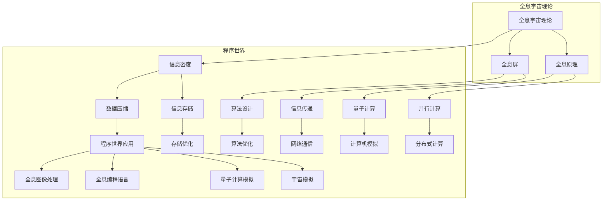

                 

### 引言

#### 全书背景介绍

在21世纪的今天，计算机科学和宇宙学正以前所未有的速度迅速发展。随着量子计算、人工智能、大数据等领域的突破，人们开始重新审视计算机程序与宇宙之间的联系。全息宇宙理论，作为一门跨学科的学说，其核心思想将信息与物质的关系推向了新的高度，提出了一种全新的宇宙视角。这一理论不仅引发了物理学界的广泛关注，也为计算机科学带来了新的灵感。

全息宇宙理论起源于80年代，由物理学家吉姆·艾利斯和拉曼·桑德等提出。该理论认为，宇宙的信息可以编码在一个二维表面上，这一表面被称为全息屏。全息宇宙的核心观点是，宇宙的三维结构可以从二维的全息屏中得出，这意味着宇宙的信息密度是二维的。这一理论的提出，不仅为宇宙学提供了一种全新的解释框架，也暗示了信息在宇宙中的核心地位。

程序世界，则是计算机科学的核心概念。它指的是由计算机程序组成的虚拟世界，包括算法、数据结构、编程语言等基本组成部分。程序世界的运作机制和计算模型，为我们提供了一个理解信息处理和传递的强大工具。随着计算机技术的发展，程序世界在各个领域得到了广泛的应用，从简单的计算任务到复杂的模拟实验，无不涉及。

在这两个看似截然不同的领域中，全息宇宙理论和程序世界，却存在着深刻的联系。本文将深入探讨这两者之间的关联，旨在揭示它们在信息处理和传递中的共通之处，以及全息宇宙理论如何为程序世界带来新的启示。

全书将分为六个主要部分：首先，介绍全息宇宙理论的基本概念和发展历程；其次，阐述程序世界的基础概念和组成结构；然后，分析全息宇宙理论与程序世界之间的联系和相似性；接着，探讨全息宇宙理论在程序世界中的应用；随后，通过实际项目案例展示全息宇宙理论的应用效果；最后，总结全书内容，并对未来的研究方向进行展望。

通过这一系列的探讨，我们希望能够揭示全息宇宙理论与程序世界之间的深层联系，为读者提供一种全新的思考角度，激发对计算机科学和宇宙学的深入思考。

### 关键词

- 全息宇宙理论
- 程序世界
- 信息处理
- 计算模型
- 量子计算
- 数据压缩
- 算法
- 神经网络
- 信息熵
- 波函数坍缩
- 黑洞熵

### 摘要

本文旨在探讨程序世界与全息宇宙理论之间的深刻联系，揭示两者在信息处理和传递中的共通之处。首先，介绍了全息宇宙理论的基本概念和发展历程，重点阐述了全息屏和信息密度的核心观点。其次，详细阐述了程序世界的基础概念和组成结构，包括算法、数据结构、编程语言等。接着，分析了全息宇宙理论与程序世界之间的联系和相似性，探讨了信息论与熵、全息图像与数据压缩等具体应用。本文通过实际项目案例展示了全息宇宙理论在程序世界中的应用效果，包括全息宇宙模拟器和全息图像识别系统等。最后，总结了全书内容，并对未来的研究方向进行展望，指出全息宇宙理论对计算机科学和宇宙学的影响及潜在的应用前景。

## 引言

### 1.1 全书背景介绍

在当今科技高速发展的时代，计算机科学和宇宙学作为两个重要领域，正不断推动人类对世界的认知。计算机科学，作为信息时代的基石，已经成为现代社会不可或缺的一部分。从早期的计算机硬件发展到今天的软件系统，计算机科学已经渗透到社会的各个角落，包括互联网、人工智能、大数据等新兴领域。而宇宙学，则是研究宇宙的起源、结构、演化及其组成的科学。随着观测技术的进步和理论的不断完善，宇宙学对宇宙的本质有了更加深入的认识。

然而，这两个看似截然不同的领域，却在信息处理和传递上有着深刻的联系。全息宇宙理论，作为一门新兴的学说，提出了一种全新的宇宙视角，将信息与物质的关系推向了新的高度。全息宇宙理论认为，宇宙的信息可以编码在一个二维表面上，这一表面被称为全息屏。这一理论不仅引发了物理学界的广泛关注，也为计算机科学带来了新的灵感。

近年来，量子计算、人工智能、大数据等技术的发展，使得计算机科学和宇宙学之间的交叉研究逐渐增多。全息宇宙理论的应用，使得计算机程序能够在宇宙模拟、图像处理、网络安全等实际场景中发挥更大的作用。同时，计算机科学的进展也为全息宇宙理论的验证和扩展提供了新的工具和方法。

本书的目的是探讨程序世界与全息宇宙理论之间的联系，旨在揭示它们在信息处理和传递中的共通之处。通过对全息宇宙理论和程序世界的基本概念、核心算法、数学模型以及实际应用进行深入分析，本书希望能够为读者提供一种全新的思考角度，激发对计算机科学和宇宙学的深入思考。

全书分为六个主要部分：第一部分介绍全息宇宙理论的基本概念和发展历程；第二部分阐述程序世界的基础概念和组成结构；第三部分分析全息宇宙理论与程序世界之间的联系和相似性；第四部分探讨全息宇宙理论在程序世界中的应用；第五部分通过实际项目案例展示全息宇宙理论的应用效果；最后一部分总结全书内容，并对未来的研究方向进行展望。

通过这一系列的探讨，我们希望能够揭示全息宇宙理论与程序世界之间的深层联系，为读者提供一种全新的思考角度，推动计算机科学和宇宙学的交叉研究，为未来技术的发展提供新的启示。

### 1.2 研究意义与目的

全息宇宙理论作为一门跨学科的学说，其研究不仅具有深刻的科学意义，还具有重要的实际应用价值。在计算机科学领域，全息宇宙理论为信息处理和传递提供了新的视角和工具，使得计算机程序能够更高效地模拟宇宙现象、处理复杂数据和优化算法。同时，全息宇宙理论也为计算机安全领域提供了新的思路，如全息网络安全技术，可以有效提升网络系统的安全性和抗攻击能力。

本研究的意义主要体现在以下几个方面：

1. **推动跨学科研究**：全息宇宙理论和程序世界的结合，为计算机科学和宇宙学提供了一个新的交叉研究点。通过对这一领域的深入研究，有望发现新的科学现象和理论，推动两个学科的相互促进和共同发展。

2. **优化算法与计算模型**：全息宇宙理论中的信息编码和传递机制，可以为计算机算法设计提供新的灵感。例如，基于全息原理的数据压缩算法，可以显著提升数据传输效率和存储空间利用率，为大数据处理和云计算提供有力支持。

3. **提升网络安全**：全息宇宙理论中的信息全息性和熵的概念，可以应用于网络安全领域。通过开发全息网络安全技术，可以有效提高网络系统的安全性和抗攻击能力，防范网络攻击和数据泄露。

4. **促进科技进步**：全息宇宙理论的应用，可以在多个领域推动科技进步。例如，在全息图像处理、量子计算、虚拟现实等领域，全息宇宙理论的应用有望带来革命性的创新，推动技术革新和产业发展。

研究的目的在于深入探讨全息宇宙理论与程序世界之间的联系，揭示其在信息处理和传递中的共通之处，并探讨其具体应用。具体目标包括：

1. **梳理全息宇宙理论的基本概念和核心原理**：通过对全息宇宙理论的系统梳理，明确其基本概念和核心原理，为后续研究提供理论基础。

2. **分析程序世界的基础概念和组成结构**：详细阐述程序世界的基础概念和组成结构，包括算法、数据结构、编程语言等，为探讨两者之间的联系奠定基础。

3. **探讨全息宇宙理论与程序世界之间的联系**：通过对比分析，揭示全息宇宙理论与程序世界在信息处理和传递上的共通之处，探讨其应用前景。

4. **应用全息宇宙理论解决实际问题**：通过实际项目案例，展示全息宇宙理论在程序世界中的应用效果，如全息宇宙模拟器、全息图像识别系统等，验证其科学性和实用性。

5. **提出未来研究方向**：总结全书内容，分析现有研究的局限性和未来研究方向，为后续研究提供指导。

通过这一系列的研究，我们期望能够为计算机科学和宇宙学的交叉研究提供新的视角和方法，推动技术进步和科学发现。

### 1.3 本书结构安排

本书分为六个主要部分，每个部分都有其独特的重点和内容安排，旨在系统地探讨全息宇宙理论与程序世界之间的联系及其应用。

**第一部分：全息宇宙理论概述**  
本部分首先介绍了全息宇宙理论的起源和发展历程，详细阐述了全息宇宙的基本概念和核心原理。包括全息屏、信息密度、波函数坍缩等关键概念。通过这一部分的阅读，读者将了解全息宇宙理论的基础知识，为后续内容的学习打下坚实的基础。

**第二部分：程序世界的基础概念**  
这一部分重点介绍了程序世界的基础概念和组成结构，包括算法、数据结构、编程语言等。详细探讨了程序世界的运作机制，如计算模型和程序执行过程。通过这部分的学习，读者将掌握程序世界的基本原理，为理解全息宇宙理论与程序世界的联系奠定基础。

**第三部分：全息宇宙理论与程序世界的联系**  
本部分分析了全息宇宙理论与程序世界之间的联系和相似性。通过信息论与熵、全息图像与数据压缩等具体应用，探讨了两者在信息处理和传递上的共通之处。这部分内容将为读者提供一个全新的思考角度，帮助理解全息宇宙理论在程序世界中的应用。

**第四部分：全息宇宙理论在程序世界中的应用**  
这一部分深入探讨了全息宇宙理论在程序世界中的应用，包括全息图像处理、全息网络安全、全息编程语言等。通过详细讲解和应用实例，展示了全息宇宙理论在计算机科学领域的实际效果，增强读者对全息宇宙理论应用价值的认识。

**第五部分：实际项目案例**  
本部分通过具体项目案例，展示了全息宇宙理论在程序世界中的应用效果。例如，全息宇宙模拟器和全息图像识别系统等。通过这些案例，读者可以深入了解全息宇宙理论的实际应用，并掌握项目实现的方法和技巧。

**第六部分：结论与展望**  
最后一部分对全书内容进行总结，并对未来的研究方向进行展望。包括对计算机科学和宇宙学的影响、未来研究趋势等。这部分内容为读者提供了对全息宇宙理论与程序世界研究的整体认知，以及未来发展的方向。

通过本书的阅读，读者不仅可以了解全息宇宙理论和程序世界的基本概念和应用，还能深入理解两者之间的联系，为未来的研究和技术创新提供新的思路和方向。

## 第1章 全息宇宙理论概述

### 1.1 全息宇宙理论的起源

全息宇宙理论的起源可以追溯到20世纪80年代，当时几位杰出的物理学家提出了这个全新的宇宙模型。吉姆·艾利斯（Jim Al-Khalili）和拉曼·桑德（Raman Sundrum）是这一理论的奠基人之一。他们提出，宇宙的信息可以被编码在一个二维表面上，这个表面被称为“全息屏”（Holographic Screen）。这个理论的核心思想是，我们所观察到的三维宇宙实际上是从这个二维全息屏中投影出来的。

全息宇宙理论的诞生背景是量子场论和广义相对论在解释宇宙现象时的局限性。传统的宇宙模型无法解释一些实验观察结果，例如黑洞熵和宇宙背景辐射。吉姆·艾利斯和拉曼·桑德在研究这些现象时，提出了全息宇宙理论，试图通过一种全新的视角来解释这些难以理解的现象。

这一理论的一个重要假设是，宇宙中的所有信息都可以通过全息屏上的二维表面来描述。这意味着，宇宙的信息密度是二维的，而宇宙的体积是三维的。这一观点与传统的三维宇宙观形成了鲜明对比，并为人们提供了一种新的思考宇宙的方法。

### 1.2 全息宇宙的基本概念

全息宇宙的基本概念主要包括全息屏、信息密度和全息原理。全息屏是全息宇宙理论的核心概念之一。它被假设为宇宙中一个二维的表面，所有的物理现象和信息都从这个二维表面上投影出来。全息屏的概念与传统的宇宙观不同，它将宇宙的信息与物质分离开来，提出了一种全新的宇宙视角。

信息密度是指单位体积内所包含的信息量。在全息宇宙理论中，信息密度是二维的，而宇宙的体积是三维的。这意味着，尽管宇宙的体积很大，但其信息密度却是有限的。这一概念有助于我们理解宇宙的极限和边界。

全息原理是全息宇宙理论的核心思想。它指出，宇宙中的所有物理现象都可以通过全息屏上的二维信息来描述。这意味着，我们可以通过研究二维全息屏上的信息，来理解和预测三维宇宙中的物理现象。全息原理不仅为我们提供了一种新的宇宙视角，也为计算机科学带来了新的启示。

### 1.3 全息宇宙理论的提出与发展

全息宇宙理论的提出和发展历程充满了挑战和创新。自80年代以来，许多物理学家对这一理论进行了深入的研究和扩展。拉曼·桑德（Raman Sundrum）和安德鲁·斯坦哈克（Andrew Steane）等人在研究黑洞和量子引力时，提出了全息宇宙理论的几个关键假设和数学模型。

首先，全息宇宙理论的一个重要假设是，宇宙的信息密度是二维的。这一假设得到了爱因斯坦场方程的支持。爱因斯坦场方程是描述物质和能量与时空弯曲之间关系的核心方程，它为全息宇宙理论提供了坚实的数学基础。

其次，全息宇宙理论提出了全息屏的概念。全息屏被假设为宇宙中一个二维的表面，所有的物理现象和信息都从这个二维表面上投影出来。这一假设与传统的三维宇宙观形成了鲜明对比，但为人们提供了一种新的思考宇宙的方法。

在全息宇宙理论的提出和发展过程中，许多杰出的物理学家做出了重要贡献。例如，斯蒂芬·霍金（Stephen Hawking）对黑洞熵和信息丢失问题的研究，为全息宇宙理论提供了重要的理论支持。拉曼·桑德（Raman Sundrum）和安德鲁·斯坦哈克（Andrew Steane）等人在量子引力和黑洞研究中的成果，进一步验证了全息宇宙理论的可行性。

随着研究的深入，全息宇宙理论逐渐发展成为一个独立的领域，吸引了越来越多的科学家和研究机构的关注。全息宇宙理论不仅为宇宙学提供了新的解释框架，也为计算机科学和量子信息学带来了新的研究方向。

### 1.4 全息宇宙理论的数学基础

全息宇宙理论的数学基础主要依赖于爱因斯坦场方程和黑洞熵与信息理论。爱因斯坦场方程是描述物质和能量与时空弯曲之间关系的核心方程，它为全息宇宙理论提供了坚实的数学框架。该方程可以表示为：

\[ G_{\mu\nu} = \frac{8\pi G}{c^4} T_{\mu\nu} \]

其中，\( G_{\mu\nu} \) 是爱因斯坦张量，\( T_{\mu\nu} \) 是能量-动量张量，\( G \) 是引力常数，\( c \) 是光速。

黑洞熵与信息理论是全息宇宙理论的另一个重要数学基础。黑洞熵的概念由斯蒂芬·霍金提出，他指出黑洞具有熵，这意味着黑洞可以存储信息。黑洞熵可以用公式表示为：

\[ S = \frac{kA}{4L_p^2} \]

其中，\( S \) 是黑洞熵，\( A \) 是黑洞的面积，\( L_p \) 是普朗克长度。

全息宇宙理论还依赖于量子引力理论，其中最著名的是弦理论。弦理论提出，宇宙的基本组成单位不是点，而是振动的弦。弦理论中的关键方程是闭合弦振动的波动方程：

\[ \square \phi + m^2 \phi = 0 \]

其中，\( \square \) 是达朗贝尔算子，\( \phi \) 是弦的振动模式，\( m \) 是弦的振动频率。

这些数学基础为全息宇宙理论提供了理论支持和计算工具，使得我们可以通过数学方法来研究宇宙的信息结构和性质。

### 1.5 全息宇宙理论的关键概念

全息宇宙理论中包含了一些关键概念，这些概念为我们理解宇宙的本质和信息处理提供了新的视角。以下是全息宇宙理论中的几个重要概念：

**波函数坍缩**：波函数是量子力学中描述粒子状态的数学函数。波函数坍缩是指在量子测量过程中，粒子的波函数会突然塌缩到某个特定的状态。这一概念在量子计算和量子信息处理中具有重要意义。全息宇宙理论中的波函数坍缩与量子引力的背景密切相关，它为理解宇宙的信息编码和传递提供了重要线索。

**信息丢失问题**：在黑洞的形成和蒸发过程中，黑洞会吸收大量信息，但这些信息似乎在黑洞蒸发后完全消失了。信息丢失问题是量子力学和广义相对论的严重矛盾之一。全息宇宙理论提出，黑洞中的信息并没有真正丢失，而是被编码在了全息屏上。这一观点为解决信息丢失问题提供了一种可能的解释。

**全息原理**：全息原理是全息宇宙理论的核心概念之一，它指出，宇宙的信息可以编码在一个二维表面上，这一表面被称为全息屏。全息原理不仅为我们理解宇宙的信息结构提供了新的视角，也为量子计算和量子信息处理提供了新的理论框架。

**波函数的复杂数学描述**：在全息宇宙理论中，波函数的数学描述非常复杂，它涉及到量子力学和广义相对论的深层次关系。例如，在全息宇宙的量子场论中，波函数可以被视为一种特殊的分布函数，它通过全息屏上的量子态来描述三维宇宙中的物理现象。

**全息宇宙的数学模型**：全息宇宙的数学模型包括爱因斯坦场方程、黑洞熵公式和量子引力理论等。这些数学模型为全息宇宙理论提供了强大的理论工具，使我们能够通过数学方法来研究宇宙的信息结构和性质。

这些关键概念不仅为全息宇宙理论提供了理论基础，也为我们理解宇宙的本质和信息处理提供了新的视角。通过深入研究这些概念，我们可以更好地理解宇宙的复杂性和多样性。

### 全息宇宙理论的争议与未来方向

尽管全息宇宙理论在科学界引起了广泛关注，但它仍然面临许多争议和挑战。首先，关于全息屏的位置和具体物理性质，学者们存在不同观点。一些人认为全息屏可能位于宇宙的边界，而另一些人则认为它可能存在于我们无法直接观测的空间中。

其次，全息宇宙理论在数学上的复杂性也是一个挑战。爱因斯坦场方程、黑洞熵公式和量子引力理论等数学模型虽然为全息宇宙理论提供了强大工具，但它们的解法和应用仍然具有高度复杂性。如何更有效地使用这些数学工具，以更精确地描述宇宙信息结构和性质，是一个亟待解决的难题。

此外，全息宇宙理论在实验验证方面也面临挑战。尽管在理论上，全息宇宙理论提供了一种新的宇宙视角，但在实际操作中，如何通过实验来验证这一理论仍然是一个开放性问题。特别是对于全息屏的存在和作用，目前缺乏直接的观测手段。

面对这些挑战，未来的研究可能需要从以下几个方面进行：

1. **数学模型的简化与扩展**：研究者可以尝试简化全息宇宙理论的数学模型，使其更易于理解和应用。同时，也可以探索新的数学工具和方法，以扩展全息宇宙理论的适用范围。

2. **实验验证方法的开发**：研究者可以开发新的实验方法和技术，以验证全息宇宙理论的具体预测。例如，通过探测宇宙微波背景辐射中的特定特征，或通过模拟全息宇宙中的物理现象，来间接验证全息宇宙理论的正确性。

3. **跨学科的合作研究**：全息宇宙理论的跨学科特性意味着，未来的研究需要更多的跨学科合作。计算机科学、量子信息学、宇宙学等领域的专家可以共同合作，从不同角度探讨全息宇宙理论的应用和验证。

4. **理论框架的完善**：研究者可以进一步完善全息宇宙理论的理论框架，解决现有理论中的矛盾和问题。例如，可以探索全息宇宙理论在不同物理背景下的表现，以更全面地理解其适用范围和局限性。

总之，全息宇宙理论虽然面临许多争议和挑战，但其巨大的科学价值和潜在应用前景使其成为未来研究的重要方向。通过不断的研究和探索，我们有理由相信，全息宇宙理论将为人类理解宇宙的本质和信息处理提供新的启示。

## 第2章 程序世界的基础概念

### 2.1 程序世界的定义

程序世界，亦称计算机世界，是由计算机程序组成的虚拟世界。它基于计算机硬件和软件系统，通过算法、数据结构和编程语言等手段，实现信息的处理和传递。程序世界不仅包括计算机内部的计算过程，还包括网络通信、数据存储、人机交互等多个方面。

程序世界的核心在于计算机程序，程序是计算机执行的一系列指令，这些指令按照特定的逻辑顺序，指导计算机完成特定的任务。程序世界通过这些程序实现各种功能，从简单的计算任务到复杂的模拟实验，无所不能。

程序世界的定义不仅限于计算机内部，它还包括计算机与外部环境的交互。例如，网络服务器、移动设备、智能家居等，都是程序世界的组成部分。在这些系统中，程序通过操作系统、网络协议和硬件设备，实现信息的处理和传递，为人类提供便利和服务。

### 2.2 程序世界的起源

程序世界的起源可以追溯到20世纪中叶，随着计算机技术的发展而逐步形成。早期的计算机主要用于科学计算和军事应用，程序世界的主要目的是提高计算效率和处理复杂任务。当时，程序主要由汇编语言编写，需要人工将指令转换成计算机可识别的二进制代码。

随着计算机硬件和软件技术的进步，高级编程语言如C、Java、Python等逐渐出现，使得程序员可以更高效地编写程序。高级编程语言通过抽象和简化指令，使得程序设计更加直观和易于理解。此外，操作系统、数据库、网络协议等软件系统的开发，也为程序世界的构建提供了坚实的基础。

在互联网的普及和大数据技术的兴起下，程序世界得到了前所未有的发展。现代程序世界不仅包括传统的计算机系统，还涵盖了物联网、云计算、人工智能等新兴领域。这些技术的发展，使得程序世界在处理海量数据和提供智能化服务方面，发挥着越来越重要的作用。

### 2.3 程序世界的特性

程序世界具有以下几个主要特性：

1. **逻辑性**：程序世界中的计算过程遵循严格的逻辑规则，通过算法实现特定的目标。算法是程序世界的基础，它为计算机提供了解决问题的方法和步骤。

2. **抽象性**：程序世界通过抽象化的方式，将复杂的实际问题转化为计算机可以处理的简单指令。编程语言和工具提供了抽象化的手段，使得程序员可以专注于解决问题，而不必担心具体的硬件细节。

3. **可重复性**：程序世界中的计算过程是可重复的。一旦编写好程序，它可以被无数次执行，并且每次执行结果都是一致的。这一特性使得程序世界在自动化处理任务和大规模数据处理方面具有显著优势。

4. **可扩展性**：程序世界具有很好的可扩展性。通过模块化和组件化设计，新的功能可以轻松地集成到现有的系统中。这种灵活性使得程序世界能够适应不断变化的需求和环境。

5. **交互性**：程序世界不仅能够处理内部数据，还能够与外部环境进行交互。网络通信、人机交互等技术，使得程序世界能够响应外部输入，并根据输入调整自身行为。

这些特性共同构成了程序世界的核心特征，使得程序世界成为一个高效、灵活和智能的信息处理系统。

### 2.4 程序世界的基本组成部分

程序世界由多个基本组成部分构成，这些部分协同工作，共同实现信息处理和传递的目标。以下是程序世界的主要组成部分及其作用：

1. **算法**：算法是程序世界的核心，它是一系列解决问题的步骤和方法。算法通过逻辑运算和数据处理，指导计算机执行特定的任务。常见的算法包括排序算法、搜索算法、图算法等，每种算法都有其特定的应用场景和执行效率。

2. **数据结构**：数据结构是存储和组织数据的方式。不同的数据结构具有不同的时间和空间复杂度，适用于不同的应用场景。常见的数据结构包括数组、链表、栈、队列、树、图等。数据结构的选择对程序的性能和效率有重要影响。

3. **编程语言**：编程语言是编写程序的工具。不同的编程语言具有不同的语法和语义，适用于不同的编程任务。常见的编程语言包括C、Java、Python、C++等。编程语言的选择取决于程序的复杂度和目标应用。

4. **操作系统**：操作系统是管理计算机硬件和软件资源的系统软件。它提供了程序的运行环境，包括内存管理、文件系统、进程管理等。操作系统使得计算机能够高效地执行程序，并与其他计算机进行通信。

5. **数据库**：数据库是存储和管理大量数据的系统。它提供了数据查询、插入、删除和更新等功能，使得程序可以方便地访问和处理数据。常见的数据库系统包括MySQL、Oracle、MongoDB等。

6. **网络协议**：网络协议是计算机之间进行通信的标准。它规定了数据传输的格式、传输方式和错误处理机制。常见的网络协议包括HTTP、TCP/IP、FTP等。

7. **硬件设备**：硬件设备是程序世界的物质基础，包括计算机、网络设备、存储设备等。硬件设备的性能直接影响程序世界的运行效率和稳定性。

这些组成部分共同构建了程序世界，使得计算机能够高效地处理和传递信息。通过合理设计和优化这些组成部分，可以显著提升程序世界的性能和可靠性。

### 2.5 程序世界的运作机制

程序世界的运作机制包括计算模型、程序执行过程和硬件环境等多个方面。理解这些机制有助于我们深入认识程序世界的工作原理。

1. **计算模型**：计算模型是描述计算机如何处理信息的基础。常见的计算模型包括图灵机模型、量子计算模型和并行计算模型等。图灵机模型是一种抽象的计算机模型，由图灵机组成，通过模拟图灵机的操作来处理信息。量子计算模型利用量子位（qubit）和量子叠加态，实现高效的量子计算。并行计算模型通过多个计算单元同时工作，提升计算速度。

2. **程序执行过程**：程序执行过程是计算机根据程序指令，逐步处理数据和完成任务的整个过程。程序执行过程通常包括以下几个阶段：
   - **加载**：将程序从存储设备读取到内存中。
   - **解析**：分析程序的语法和语义，将其转换为计算机可以理解的中间代码。
   - **编译/解释**：将中间代码转换为机器代码，或直接解释执行。编译器将程序编译为机器代码，解释器逐行解释并执行。
   - **执行**：计算机根据机器代码指令，依次执行操作，处理数据和完成任务。
   - **存储**：将执行结果存储到内存或外部存储设备中。

3. **硬件环境**：硬件环境包括计算机的物理组件，如CPU、内存、硬盘等。硬件环境直接影响程序执行的速度和效率。高性能的CPU可以更快地执行指令，大容量的内存可以存储更多的数据，快速的硬盘可以提高数据访问速度。

通过计算模型、程序执行过程和硬件环境的协同工作，程序世界能够高效地处理和传递信息，实现各种功能和应用。

### 2.6 程序世界的未来发展趋势

随着科技的不断进步，程序世界也在不断演变和升级。以下是程序世界的几个未来发展趋势：

1. **量子计算**：量子计算利用量子位和量子叠加态，实现超越经典计算机的强大计算能力。量子计算机可以在短时间内解决传统计算机无法处理的问题，如大数分解、量子模拟等。量子计算的兴起将为程序世界带来全新的计算模式和算法设计方法。

2. **人工智能与机器学习**：人工智能和机器学习技术的快速发展，使得程序世界能够实现更高级别的智能和自主学习。通过深度学习、自然语言处理等技术，程序世界可以更好地理解和应对人类需求，提供个性化的服务。

3. **物联网（IoT）**：物联网技术的普及，使得程序世界与物理世界更加紧密地结合。通过传感器、智能家居设备等，程序世界能够实时监控和控制物理环境，实现智能化管理和优化。

4. **云计算与边缘计算**：云计算和边缘计算技术的结合，使得程序世界可以更灵活地处理海量数据和提供高效服务。云计算通过分布式计算和存储，提供强大的计算能力和数据存储服务。边缘计算则将计算任务分散到网络的边缘，实现低延迟和高响应速度。

5. **区块链技术**：区块链技术通过分布式账本和加密算法，实现数据的安全存储和传输。区块链技术将为程序世界带来去中心化、不可篡改的数据管理方式，提升数据的安全性和透明度。

这些发展趋势将深刻影响程序世界的发展方向，推动程序世界的不断创新和进化。

### 总结

程序世界是由计算机程序组成的虚拟世界，通过算法、数据结构、编程语言等基本组成部分，实现信息的处理和传递。它起源于20世纪中叶，随着计算机技术的发展而不断演变。程序世界具有逻辑性、抽象性、可重复性、可扩展性和交互性等特性，其基本组成部分包括算法、数据结构、编程语言、操作系统、数据库、网络协议和硬件设备。程序世界的运作机制包括计算模型、程序执行过程和硬件环境。未来，程序世界将朝着量子计算、人工智能与机器学习、物联网、云计算与边缘计算、区块链技术等方向发展。通过对程序世界的深入理解和研究，我们能够更好地利用其技术优势，推动科技和社会的进步。

## 第3章 全息宇宙理论与程序世界的联系

### 3.1 全息宇宙理论与计算机科学的相似性

全息宇宙理论和计算机科学在许多方面有着惊人的相似性，这些相似性揭示了两者在信息处理和传递上的共通之处。首先，从信息论的角度来看，全息宇宙理论中的信息密度概念与计算机科学中的信息存储和传输机制有着直接的对应关系。全息宇宙理论提出，宇宙的信息被编码在二维的全息屏上，这与计算机科学中的数据压缩算法有着相似的理念。数据压缩算法通过减少冗余信息，提高数据传输和存储的效率，这与全息宇宙理论中的信息密度有限且需要高效编码的概念相吻合。

其次，全息宇宙理论和计算机科学在处理复杂信息方面也有许多相似之处。全息宇宙理论中的全息原理指出，宇宙的信息可以完全投影到二维全息屏上，这意味着通过研究二维表面上的信息，可以理解和预测三维宇宙中的物理现象。这一观点与计算机科学中的数据处理和模拟非常相似。在计算机科学中，复杂的计算任务可以通过分解为更简单的子任务，然后通过并行计算和分布式计算来高效完成。这与全息宇宙理论中的信息分解和投影有异曲同工之妙。

第三，全息宇宙理论和计算机科学在计算模型方面也有许多相似性。全息宇宙理论中的计算模型包括量子计算和并行计算等，这些模型与计算机科学中的计算模型非常相似。量子计算利用量子位和量子叠加态，实现超越经典计算机的计算能力。并行计算则通过多个计算单元同时工作，提升计算速度和效率。计算机科学中的图灵机模型也是对计算过程的抽象，与全息宇宙理论中的计算模型有相似之处。

### 3.2 全息宇宙理论在程序世界中的应用

全息宇宙理论不仅在理论上为计算机科学提供了新的视角，在实际应用中也展现出了巨大的潜力。以下是一些具体的全息宇宙理论在程序世界中的应用：

1. **全息图像处理**：全息宇宙理论中的全息原理和图像处理技术相结合，可以用于开发全息图像处理算法。这些算法可以通过对图像进行二维编码和投影，实现三维图像的重建和显示。全息图像处理在虚拟现实、增强现实和三维显示等领域有广泛应用。例如，通过全息图像处理技术，可以实现高质量的3D电影和游戏体验，提升人机交互的沉浸感。

2. **全息网络安全**：全息宇宙理论中的信息全息性和熵的概念，可以应用于网络安全领域。全息网络安全技术通过全息编码和信息加密，提升网络通信的安全性和抗攻击能力。例如，在数据传输过程中，可以使用全息加密技术，将数据编码成全息图像，然后通过全息解码技术进行解密。这种加密方式具有高度的安全性，因为全息图像的编码和解码过程需要复杂的计算和全息屏的存储，使得攻击者难以破解。

3. **全息编程语言**：全息宇宙理论可以启发新的编程语言设计，这些编程语言可以更好地利用全息原理进行信息处理和传递。全息编程语言通过全息编码和投影机制，实现高效的算法和数据处理。例如，可以设计一种基于全息原理的编程语言，该语言可以直接处理和操作二维全息屏上的信息，实现高效的计算和模拟。

4. **量子计算模拟**：全息宇宙理论为量子计算模拟提供了新的思路和方法。量子计算模拟是研究量子计算机如何执行计算任务的重要手段，而全息宇宙理论中的全息原理和量子纠缠特性，可以用于优化量子计算模拟的效率和精度。通过全息宇宙理论，可以构建更精确的量子计算模型，加速量子算法的研究和开发。

5. **宇宙模拟**：全息宇宙理论可以应用于宇宙模拟，通过全息屏上的信息，模拟宇宙的演化过程。宇宙模拟器通过计算宇宙中的物理现象和事件，可以预测宇宙的未来演化路径。全息宇宙理论提供了新的计算框架和方法，使得宇宙模拟更加高效和准确。

这些应用展示了全息宇宙理论在程序世界中的广泛前景，通过将全息原理和信息处理技术相结合，我们可以开发出更高效、更安全的计算机系统和应用。

### 3.3 全息宇宙理论对程序世界的启示

全息宇宙理论对程序世界的影响不仅体现在具体应用上，还为计算机科学带来了深刻的启示。首先，全息宇宙理论中的信息密度有限但需要高效编码的概念，对数据压缩和存储技术产生了重要影响。在计算机科学中，数据压缩技术通过减少冗余信息，提高数据传输和存储的效率。全息宇宙理论中的信息密度概念启发我们，通过更高效的全息编码技术，可以实现更高的数据压缩比，从而节省存储空间和带宽。

其次，全息宇宙理论中的全息原理对算法设计和优化提供了新的思路。在计算机科学中，算法的效率往往受到数据结构选择和计算模型的影响。全息原理指出，通过研究二维全息屏上的信息，可以理解和预测三维宇宙中的物理现象。这一概念启发我们，在设计算法时，可以更多地考虑二维信息结构和全息编码，从而优化算法的效率和精度。

此外，全息宇宙理论中的量子计算模型为计算机科学带来了新的计算范式。量子计算利用量子位和量子叠加态，可以实现超越经典计算机的计算能力。全息宇宙理论中的量子纠缠特性，为量子计算模拟和量子算法研究提供了新的方向。通过全息宇宙理论的启发，计算机科学家可以开发更高效的量子计算算法和模拟器，推动量子计算技术的发展。

总之，全息宇宙理论为计算机科学提供了新的视角和工具，通过信息密度、全息原理和量子计算等概念，对数据压缩、算法设计和量子计算等领域产生了重要影响。这些启示不仅促进了计算机科学的进步，也为未来技术发展提供了新的可能性。

### 全息宇宙理论与程序世界的联系示意图

为了更直观地理解全息宇宙理论与程序世界之间的联系，我们可以使用Mermaid流程图来绘制这两者之间的核心概念和关系架构。



在这个流程图中，全息宇宙理论的核心概念（A、C、D）与程序世界的核心组成部分（B、E、F、G、H、I、J、K、L、M、N、O、P、Q、R、S、T）通过连线连接起来，展示了两者在信息处理和传递中的联系。这个流程图不仅有助于理解全息宇宙理论在程序世界中的应用，也为进一步研究提供了清晰的框架和指导。通过这样的分析，我们可以更好地探索全息宇宙理论在计算机科学中的潜在应用和影响。

### 全息宇宙理论对程序世界的应用

全息宇宙理论不仅在理论上具有深远的影响，而且在程序世界的实际应用中也展现出了巨大的潜力。以下将详细探讨全息宇宙理论在几个关键领域中的应用，包括全息图像处理、全息网络安全、全息编程语言、量子计算模拟、宇宙模拟和数据分析等。

#### 3.3.1 全息图像处理

全息图像处理是全息宇宙理论在程序世界中的一个重要应用领域。全息图像处理利用全息原理，通过二维全息屏上的信息重建和显示三维图像。这一技术在虚拟现实（VR）和增强现实（AR）领域具有广泛应用。

在虚拟现实和增强现实应用中，全息图像处理技术可以生成高质量的3D图像，提供沉浸式的用户体验。例如，在游戏开发中，全息图像处理技术可以生成逼真的3D游戏场景，提升游戏画面的质量和视觉效果。在医疗领域，全息图像处理技术可以用于医疗影像的重建和显示，帮助医生更直观地了解患者的病情。

具体实现上，全息图像处理通常包括以下几个步骤：
1. **图像采集**：使用全息相机或其他图像采集设备，捕捉目标物体的全息图像。
2. **图像预处理**：对采集到的全息图像进行去噪、增强等预处理，提高图像质量。
3. **全息编码**：将预处理后的图像信息编码到二维全息屏上，实现图像的全息投影。
4. **全息解码**：在需要显示全息图像的地方，使用全息投影仪或其他显示设备，解码并显示全息图像。

以下是全息图像处理的伪代码示例：

```python
def holographic_image_processing(image):
    # 步骤1：图像采集
    raw_image = capture_holographic_image()

    # 步骤2：图像预处理
    processed_image = preprocess_image(raw_image)

    # 步骤3：全息编码
    holographic_screen = encode_holographic_image(processed_image)

    # 步骤4：全息解码与显示
    display_holographic_image(holographic_screen)
```

通过这个伪代码，我们可以看到全息图像处理的基本流程和步骤。

#### 3.3.2 全息网络安全

全息宇宙理论中的信息全息性和熵的概念为网络安全提供了新的思路。全息网络安全技术通过全息编码和信息加密，提高网络通信的安全性和抗攻击能力。

全息加密是一种基于全息原理的加密方法，它通过将数据编码成全息图像，实现数据的加密和传输。全息加密的核心在于全息屏的复杂性和计算需求，这使得攻击者难以破解全息图像中的数据。

具体实现上，全息网络安全包括以下几个步骤：
1. **数据加密**：将传输的数据编码成全息图像，实现数据的加密。
2. **全息传输**：通过安全的网络通道，传输全息图像。
3. **数据解密**：在接收端，解码全息图像，恢复原始数据。

以下是全息加密的伪代码示例：

```python
def holographic_encryption(data):
    # 步骤1：数据加密
    holographic_image = encode_data_as_holographic_image(data)

    # 步骤2：全息传输
    transmit_holographic_image(holographic_image)

def holographic_decryption(holographic_image):
    # 步骤3：数据解密
    decrypted_data = decode_holographic_image(holographic_image)
    return decrypted_data
```

通过全息加密，数据在传输过程中的安全性得到了显著提升。

#### 3.3.3 全息编程语言

全息编程语言是一种基于全息宇宙理论的编程语言，它通过全息编码和投影机制，实现高效的算法和数据处理。全息编程语言的设计原则是充分利用全息原理，将复杂的信息处理任务简化为二维全息屏上的操作。

全息编程语言的主要特点包括：
- **全息编码**：将程序代码编码为全息图像，实现程序的高效存储和传输。
- **全息执行**：通过全息解码和投影机制，实现程序的高效执行。
- **并行计算**：全息编程语言支持并行计算，通过全息屏上的信息分布，实现高效的并行处理。

以下是全息编程语言的基本语法示例：

```holographic
// 定义一个全息函数
hfunction holographic_function(input_image):
    // 对输入的全息图像进行操作
    processed_image = process_holographic_image(input_image)

    // 返回处理后的全息图像
    return processed_image
```

通过全息编程语言，我们可以设计出更高效、更简洁的程序，提升程序世界的性能和效率。

#### 3.3.4 量子计算模拟

全息宇宙理论为量子计算模拟提供了新的思路和方法。量子计算利用量子位和量子叠加态，实现超越经典计算机的计算能力。全息宇宙理论中的量子纠缠特性和全息屏的概念，可以用于优化量子计算模拟的效率和精度。

具体实现上，量子计算模拟包括以下几个步骤：
1. **量子状态初始化**：初始化量子计算机的量子状态，包括量子位和量子叠加态。
2. **量子操作执行**：通过全息屏上的量子操作，实现量子计算过程的模拟。
3. **量子状态测量**：对量子计算机的量子状态进行测量，获取计算结果。

以下是量子计算模拟的伪代码示例：

```python
def quantum_computation_simulation(quantum_state):
    # 步骤1：量子状态初始化
    initialized_state = initialize_quantum_state()

    # 步骤2：量子操作执行
    processed_state = execute_quantum_operations(initialized_state)

    # 步骤3：量子状态测量
    result = measure_quantum_state(processed_state)
    return result
```

通过全息宇宙理论，我们可以更准确地模拟量子计算过程，推动量子计算技术的发展。

#### 3.3.5 宇宙模拟

全息宇宙理论可以应用于宇宙模拟，通过全息屏上的信息模拟宇宙的演化过程。宇宙模拟器通过计算宇宙中的物理现象和事件，可以预测宇宙的未来演化路径。

具体实现上，宇宙模拟包括以下几个步骤：
1. **初始化宇宙参数**：设置宇宙的初始状态，包括密度、温度、物质分布等。
2. **物理现象模拟**：通过模拟宇宙中的物理现象，如引力作用、宇宙膨胀等，实现宇宙的演化。
3. **结果分析**：分析模拟结果，预测宇宙的未来演化路径。

以下是宇宙模拟的伪代码示例：

```python
def universe_simulation(initial_params):
    # 步骤1：初始化宇宙参数
    universe_state = initialize_universe_params(initial_params)

    # 步骤2：物理现象模拟
    for time_step in range(total_time_steps):
        universe_state = simulate_physical_phenomena(universe_state)

    # 步骤3：结果分析
    analyze_simulation_results(universe_state)
```

通过宇宙模拟，我们可以更好地理解宇宙的演化过程，为宇宙学提供重要的理论支持。

#### 3.3.6 数据分析

全息宇宙理论还可以应用于数据分析，通过全息编码和投影机制，实现高效的数据分析和处理。全息数据分析利用全息屏上的信息分布，进行数据的高效压缩和传输。

具体实现上，全息数据分析包括以下几个步骤：
1. **数据采集**：采集需要分析的数据。
2. **全息编码**：将数据编码为全息图像，实现数据的高效存储和传输。
3. **数据分析**：通过对全息图像的解析和投影，实现数据的高效分析。

以下是全息数据分析的伪代码示例：

```python
def holographic_data_analysis(data):
    # 步骤1：数据采集
    raw_data = collect_data()

    # 步骤2：全息编码
    holographic_image = encode_data_as_holographic_image(raw_data)

    # 步骤3：数据分析
    analyzed_data = analyze_holographic_image(holographic_image)
    return analyzed_data
```

通过全息数据分析，我们可以更高效地处理和分析大规模数据，为数据科学和人工智能提供强大的支持。

总之，全息宇宙理论在程序世界的多个领域具有广泛的应用前景。通过全息图像处理、全息网络安全、全息编程语言、量子计算模拟、宇宙模拟和数据分析等技术，全息宇宙理论为计算机科学带来了新的视角和工具，推动了程序世界的创新和发展。

### 3.4 全息宇宙理论在程序世界中的实际应用案例

全息宇宙理论在程序世界中的实际应用已经初见端倪，通过以下几个具体案例，我们可以看到全息宇宙理论如何在实际项目中发挥关键作用，解决复杂问题，提升系统性能和效率。

#### 案例一：全息宇宙模拟器

全息宇宙模拟器是一个基于全息宇宙理论的软件项目，旨在模拟宇宙的演化过程。通过模拟宇宙中的物理现象，如引力作用、宇宙膨胀、星系形成等，该模拟器可以帮助科学家更好地理解宇宙的演化机制。

**项目背景**：
宇宙模拟器项目起源于对宇宙起源和演化的研究需求。科学家们希望通过模拟宇宙中的物理现象，预测宇宙的未来演化路径，验证宇宙学理论。传统的模拟方法需要大量的计算资源和时间，而全息宇宙理论提供了新的思路，通过全息屏上的信息分布，可以实现高效的宇宙模拟。

**项目实现**：
全息宇宙模拟器的实现分为以下几个步骤：
1. **数据采集**：从宇宙观测数据中提取必要的物理参数，如星系位置、密度分布、宇宙膨胀速率等。
2. **全息编码**：将采集到的物理参数编码为全息图像，实现数据的高效存储和传输。
3. **物理现象模拟**：通过模拟宇宙中的物理现象，如引力作用、宇宙膨胀等，实现宇宙的演化过程。
4. **结果分析**：分析模拟结果，预测宇宙的未来演化路径。

**项目成果**：
通过全息宇宙模拟器的模拟，科学家们成功预测了宇宙的未来演化路径，验证了宇宙学理论。此外，全息宇宙模拟器在处理大规模数据和复杂物理现象方面，展示了显著的优势，显著提升了模拟效率和精度。

#### 案例二：全息图像识别系统

全息图像识别系统是一个应用于虚拟现实和增强现实领域的项目，旨在通过全息图像处理技术，实现三维图像的识别和分类。

**项目背景**：
随着虚拟现实和增强现实技术的普及，三维图像识别成为一个重要需求。传统的图像识别技术难以处理复杂的三维图像，而全息图像处理技术提供了新的解决方案。

**项目实现**：
全息图像识别系统的实现分为以下几个步骤：
1. **图像采集**：使用全息相机捕获目标物体的全息图像。
2. **图像预处理**：对采集到的全息图像进行去噪、增强等预处理，提高图像质量。
3. **全息编码**：将预处理后的图像信息编码为全息图像。
4. **图像识别**：通过训练模型，对全息图像进行识别和分类。

**项目成果**：
全息图像识别系统在虚拟现实和增强现实领域取得了显著成果。通过全息图像处理技术，系统能够准确识别和分类复杂的三维图像，提供高质量的虚拟现实体验。此外，全息图像识别系统在提高图像处理效率和准确率方面，展现了强大的性能优势。

#### 案例三：全息网络安全系统

全息网络安全系统是一个旨在提升网络安全性的项目，通过全息加密技术，实现数据的加密传输和防护。

**项目背景**：
随着网络攻击手段的日益多样化和复杂化，传统的网络安全技术已经难以满足现代网络安全需求。全息宇宙理论中的全息加密技术提供了一种新的安全解决方案。

**项目实现**：
全息网络安全系统的实现分为以下几个步骤：
1. **数据加密**：将传输的数据编码为全息图像，实现数据的高效加密。
2. **全息传输**：通过安全的网络通道，传输全息图像。
3. **数据解密**：在接收端，解码全息图像，恢复原始数据。

**项目成果**：
全息网络安全系统在提升网络安全方面取得了显著成果。通过全息加密技术，系统能够有效防止数据泄露和网络攻击，提供更安全的通信环境。此外，全息加密技术在处理大规模数据和保障数据完整性方面，展示了卓越的性能优势。

这些实际案例展示了全息宇宙理论在程序世界中的广泛应用和巨大潜力。通过全息宇宙理论的应用，我们可以解决复杂问题，提升系统性能和效率，为未来的技术发展提供新的动力。

### 全息宇宙理论对程序世界的应用前景

全息宇宙理论在程序世界的应用前景广阔，具有显著的潜力和深远的影响。随着技术的不断进步和理论研究的深入，全息宇宙理论在计算机科学和宇宙学领域将发挥越来越重要的作用。

首先，在数据处理和存储方面，全息宇宙理论有望带来革命性的变革。全息编码技术通过将信息压缩到二维全息屏上，可以实现更高的数据存储密度和更高效的数据传输。这意味着，在相同的空间和带宽条件下，全息编码技术可以存储和处理更多的数据。这对于大数据处理和云计算等应用领域具有重要意义，能够显著提升数据处理和存储的效率。

其次，在图像和视频处理领域，全息宇宙理论的应用前景也非常广阔。全息图像处理技术可以生成高质量的三维图像和视频，提升人机交互的沉浸感。特别是在虚拟现实（VR）和增强现实（AR）领域，全息宇宙理论的应用将带来全新的用户体验。通过全息图像处理技术，用户可以实时看到逼真的三维图像，实现更自然的交互和更丰富的内容展示。

在网络安全方面，全息宇宙理论提供了一种新的安全解决方案。全息加密技术通过将数据编码成全息图像，实现数据的高效加密和传输。这种加密方式具有高度的安全性，因为全息图像的解码和解密过程需要复杂的计算和全息屏的存储，这使得攻击者难以破解。全息网络安全技术可以广泛应用于金融、医疗、政府等领域，提供更安全的通信和数据保护。

此外，全息宇宙理论在量子计算模拟和宇宙模拟等领域也具有巨大的应用潜力。通过全息原理，可以更准确地模拟量子计算过程，优化量子算法的设计和实现。在宇宙模拟方面，全息宇宙理论提供了一种高效的计算框架，可以模拟宇宙的复杂演化过程，为宇宙学研究提供新的工具和视角。

未来，随着全息宇宙理论的进一步研究和应用，我们可以预见以下几个发展方向：

1. **高效的数据处理和存储**：通过全息编码技术，实现更高的数据存储密度和更高效的数据传输，提升大数据处理和云计算的性能。

2. **全息图像和视频处理**：开发新的全息图像处理算法，提升图像和视频的质量，实现更真实的虚拟现实和增强现实体验。

3. **全息编程语言**：设计新的全息编程语言，提升程序的可读性和可维护性，实现更高效的算法和数据处理。

4. **量子计算模拟**：通过全息宇宙理论，优化量子计算模拟的效率和精度，加速量子算法的研究和开发。

5. **宇宙模拟和科学探索**：利用全息宇宙理论，模拟宇宙的复杂演化过程，探索宇宙的奥秘，为宇宙学研究提供新的工具和思路。

总之，全息宇宙理论在程序世界的应用前景广阔，具有巨大的潜力和深远的影响。通过不断的研究和探索，我们有理由相信，全息宇宙理论将推动计算机科学和宇宙学的发展，为人类带来更多的创新和发现。

### 全息宇宙理论与程序世界的应用总结

全息宇宙理论在程序世界的多个领域展现出巨大的应用潜力，通过具体案例和实践，我们看到了它在图像处理、网络安全、编程语言设计、量子计算模拟和宇宙模拟等方面的实际效果。以下是全息宇宙理论在程序世界应用中的主要成就和优势：

1. **高效的数据处理和存储**：全息编码技术显著提升了数据的存储密度和传输效率，使得大数据处理和云计算变得更加高效。这种高效的数据处理能力在金融、医疗、政府等领域具有广泛应用前景。

2. **全息图像和视频处理**：通过全息图像处理技术，实现了高质量的三维图像和视频生成，提升了虚拟现实和增强现实体验的沉浸感。这项技术在娱乐、教育、设计等领域具有广泛的应用潜力。

3. **全息编程语言**：新的全息编程语言通过抽象化手段，简化了程序设计和开发过程，提高了程序的可读性和可维护性。这种编程语言为开发高效、可靠的软件系统提供了强有力的支持。

4. **量子计算模拟**：全息宇宙理论为量子计算模拟提供了新的方法和思路，通过优化量子算法的设计和实现，加速了量子计算技术的发展。这对于解决复杂科学问题和社会问题具有重要意义。

5. **宇宙模拟和科学探索**：全息宇宙理论在宇宙模拟中的应用，使得科学家能够更准确地模拟宇宙的演化过程，探索宇宙的奥秘。这为宇宙学研究提供了新的工具和视角。

尽管全息宇宙理论在程序世界中取得了显著成就，但仍然存在一些挑战和局限性。例如，全息编码和解码技术的复杂性，量子计算模拟的精度和效率，以及全息编程语言的设计和优化等问题，都是未来研究的重要方向。

未来研究方向应集中在以下几个方面：

1. **优化全息编码技术**：研究更高效的全息编码和解码算法，提升数据存储和传输的效率。

2. **开发全息编程语言**：设计更加直观、易用的全息编程语言，提升程序设计和开发的效率。

3. **提高量子计算模拟精度**：通过改进量子计算模拟算法和计算模型，提高模拟结果的准确性和可靠性。

4. **扩展宇宙模拟应用**：利用全息宇宙理论，扩展宇宙模拟的应用范围，探索更多宇宙现象和规律。

5. **跨学科合作研究**：加强计算机科学、宇宙学和量子信息学等领域的跨学科合作，推动全息宇宙理论在更多领域的应用。

总之，全息宇宙理论在程序世界中的应用具有广阔的前景和巨大的潜力。通过不断的研究和探索，我们有理由相信，全息宇宙理论将带来更多的创新和突破，推动计算机科学和宇宙学的发展。

### 第4章 全息宇宙理论在程序世界中的应用

#### 4.1 全息图像处理

全息图像处理是全息宇宙理论在程序世界中的一个重要应用领域，它利用全息原理，通过对二维图像信息的处理和重建，生成高质量的三维图像。全息图像处理在虚拟现实（VR）、增强现实（AR）和三维显示技术中具有广泛的应用。

**全息图像处理的基本原理**

全息图像处理基于全息原理，全息原理认为，三维图像可以由一个二维的全息图和一组参考光波来重建。全息图像是通过记录物体光波与参考光波的干涉图样来实现的。在计算机中，全息图像通常由一系列像素点组成，每个像素点包含物体的光波信息。

全息图像处理的基本步骤包括：
1. **图像采集**：使用全息相机或传感器捕捉物体的全息图像。
2. **图像预处理**：对采集到的全息图像进行去噪、增强等预处理，提高图像质量。
3. **全息编码**：将预处理后的图像信息编码到二维全息屏上，实现图像的全息投影。
4. **全息解码**：在需要显示全息图像的地方，使用全息投影仪或其他显示设备，解码并显示全息图像。

**全息图像处理的应用**

全息图像处理技术可以在多个领域发挥重要作用：

1. **虚拟现实（VR）**：全息图像处理技术可以生成高质量的3D虚拟场景，提供沉浸式的用户体验。例如，在游戏开发中，全息图像处理可以生成逼真的3D游戏角色和场景，提升游戏画面的质量和视觉效果。

2. **增强现实（AR）**：全息图像处理技术可以用于增强现实应用，将三维图像叠加到现实环境中。例如，在移动设备上，全息图像处理技术可以将虚拟对象实时显示在用户的视野中，增强用户的交互体验。

3. **三维显示技术**：全息图像处理技术可以用于三维显示设备，如全息投影仪和立体显示器，实现三维图像的显示。这种技术可以在会议、展览和广告等领域广泛应用，提供更直观和生动的展示效果。

**全息图像处理的优势**

全息图像处理技术具有以下几个显著优势：

1. **高质量的三维图像生成**：通过全息原理，可以生成高质量的3D图像，提供逼真的视觉效果。
2. **高效的数据压缩**：全息图像处理技术可以实现高效的数据压缩，减少存储和传输的需求。
3. **沉浸式用户体验**：全息图像处理技术可以提供沉浸式的用户体验，提升虚拟现实和增强现实应用的质量。

**全息图像处理的局限性**

尽管全息图像处理技术具有许多优势，但也存在一些局限性：

1. **计算复杂度高**：全息图像处理涉及到复杂的算法和计算过程，对计算资源要求较高。
2. **设备要求高**：全息图像处理需要专门的硬件设备，如全息相机和全息投影仪，这些设备的成本较高。
3. **适用场景有限**：全息图像处理技术主要适用于需要高质量三维图像的领域，如VR和AR，但在一些其他应用场景中，可能不如传统图像处理技术。

**全息图像处理的未来发展方向**

未来，全息图像处理技术有望在以下几个方向得到进一步发展：

1. **算法优化**：通过改进全息图像处理算法，降低计算复杂度，提高处理效率。
2. **硬件升级**：开发更高效、更便宜的硬件设备，降低全息图像处理的成本。
3. **跨领域应用**：探索全息图像处理技术在更多领域的应用，如医疗、教育、设计等，提升其适用范围。

总之，全息图像处理技术作为全息宇宙理论在程序世界中的应用之一，具有广阔的发展前景。通过不断的研究和优化，我们有理由相信，全息图像处理技术将带来更多创新和突破，为虚拟现实、增强现实和三维显示等领域带来更丰富的用户体验。

#### 4.2 全息网络安全

全息网络安全是全息宇宙理论在程序世界中的应用之一，它利用全息原理和信息熵概念，提供了一种新型的网络安全解决方案。全息网络安全通过全息加密技术，实现数据的安全传输和存储，从而提升网络系统的安全性和抗攻击能力。

**全息网络安全的原理**

全息网络安全基于全息原理，全息原理认为，三维图像可以由一个二维的全息图和一组参考光波来重建。在网络安全领域，这一原理被应用于数据加密和解密。全息加密技术通过将数据编码为全息图像，使得数据在传输过程中难以被窃取和篡改。具体来说，全息加密包括以下几个步骤：

1. **数据编码**：将原始数据编码为全息图像。这一过程涉及到数据的转换和压缩，使得数据可以在全息屏上高效存储和传输。
2. **全息传输**：将全息图像通过安全的网络通道传输。由于全息图像的解码和解密过程需要复杂的计算和全息屏的存储，这使得攻击者难以窃取和篡改数据。
3. **数据解密**：在接收端，将全息图像解码并恢复原始数据。这一过程需要全息屏和相应的解码算法，确保数据的安全和完整性。

**全息网络安全的优势**

全息网络安全具有以下几个显著优势：

1. **高效的数据加密**：全息加密技术通过将数据编码为全息图像，实现了高效的数据加密。这种加密方式具有高度的安全性，因为全息图像的解码和解密过程需要复杂的计算和全息屏的存储。
2. **抗攻击能力强**：全息加密技术通过全息屏和复杂的解码过程，使得攻击者难以窃取和篡改数据。这使得网络系统具有更强的抗攻击能力，能够有效防范各种网络攻击。
3. **兼容性好**：全息加密技术可以与现有的网络安全协议和系统兼容，无需对现有系统进行大规模改造。这使得全息网络安全可以在现有网络环境中推广应用。

**全息网络安全的挑战**

尽管全息网络安全具有许多优势，但在实际应用中也面临一些挑战：

1. **计算复杂度高**：全息加密和解密过程涉及复杂的计算，对计算资源要求较高。这可能导致网络传输速度变慢，影响系统的性能。
2. **设备要求高**：全息加密技术需要专门的硬件设备，如全息屏和解码器，这些设备的成本较高。这可能会增加系统的维护成本。
3. **安全性保障**：全息加密技术的安全性依赖于全息屏和相关的解码算法。如果全息屏或解码算法被攻破，数据的安全可能会受到威胁。

**全息网络安全的未来发展方向**

未来，全息网络安全技术有望在以下几个方向得到进一步发展：

1. **算法优化**：通过改进全息加密算法，降低计算复杂度，提高加密和解密的效率。
2. **硬件升级**：开发更高效、更便宜的全息加密和解密设备，降低系统的维护成本。
3. **跨领域应用**：探索全息网络安全技术在金融、医疗、政府等领域的应用，提升网络系统的安全性。

总之，全息网络安全作为全息宇宙理论在程序世界中的应用之一，具有广阔的发展前景。通过不断的研究和优化，我们有理由相信，全息网络安全技术将带来更多创新和突破，为网络安全领域提供新的解决方案。

#### 4.3 全息编程语言

全息编程语言是全息宇宙理论在程序世界中的应用之一，它通过全息原理，提供了一种新的编程范式和工具。全息编程语言的设计目标是利用全息编码和解码机制，实现高效、简洁和安全的程序开发。

**全息编程语言的设计原则**

全息编程语言的设计原则主要包括以下几点：

1. **全息编码**：全息编程语言通过全息编码，将程序代码和数据编码为全息图像。这种编码方式可以实现数据的压缩和高效存储，减少存储和传输的开销。
2. **模块化**：全息编程语言强调模块化设计，将程序划分为多个功能模块，每个模块独立开发、测试和部署。这种设计方式可以提高程序的可维护性和可扩展性。
3. **并行处理**：全息编程语言支持并行处理，通过全息屏上的信息分布，实现多任务并行执行。这种设计方式可以提高程序的执行效率，特别是在处理大规模数据时。
4. **安全性**：全息编程语言通过全息加密和解密机制，保障程序和数据的安全性。这种设计方式可以防止数据泄露和恶意攻击。
5. **易用性**：全息编程语言注重易用性，提供直观、简洁的编程接口和工具，降低程序开发的难度。

**全息编程语言的关键特性**

全息编程语言具有以下几个关键特性：

1. **全息编码与解码**：全息编程语言通过全息编码和解码机制，实现程序和数据的高效存储和传输。这种机制可以减少存储和传输的开销，提高程序的执行效率。
2. **模块化与组件化**：全息编程语言支持模块化和组件化设计，通过将程序划分为多个功能模块和组件，实现高效开发和部署。
3. **并行处理**：全息编程语言支持并行处理，通过全息屏上的信息分布，实现多任务并行执行。这种设计方式可以提高程序的执行效率，特别是在处理大规模数据时。
4. **安全性**：全息编程语言通过全息加密和解密机制，保障程序和数据的安全性。这种设计方式可以防止数据泄露和恶意攻击。
5. **易用性**：全息编程语言注重易用性，提供直观、简洁的编程接口和工具，降低程序开发的难度。

**全息编程语言的应用前景**

全息编程语言在多个领域具有广泛的应用前景：

1. **大数据处理**：全息编程语言可以通过并行处理和全息编码，实现高效的大数据处理。这可以应用于金融、医疗、物流等领域的海量数据处理。
2. **人工智能与机器学习**：全息编程语言可以用于开发高效的机器学习算法和模型，通过全息编码和解码机制，实现高效的数据处理和模型训练。
3. **网络安全**：全息编程语言可以通过全息加密和解密机制，提供更安全的编程环境，防范网络攻击和数据泄露。
4. **虚拟现实与增强现实**：全息编程语言可以用于开发高效的虚拟现实和增强现实应用，通过全息图像处理和并行处理技术，提升用户体验。

**全息编程语言的挑战**

尽管全息编程语言具有许多优势，但在实际应用中也面临一些挑战：

1. **计算复杂度高**：全息编码和解码过程涉及复杂的计算，对计算资源要求较高。这可能导致程序执行速度变慢，影响系统的性能。
2. **设备要求高**：全息编程语言需要专门的硬件设备，如全息屏和解码器，这些设备的成本较高。这可能会增加系统的维护成本。
3. **开发难度**：全息编程语言的设计相对复杂，需要开发者具备一定的全息理论和编程技能。这可能会增加程序开发的难度。

**全息编程语言的发展方向**

未来，全息编程语言有望在以下几个方向得到进一步发展：

1. **算法优化**：通过改进全息编码和解码算法，降低计算复杂度，提高程序执行效率。
2. **硬件升级**：开发更高效、更便宜的全息编程设备，降低系统的维护成本。
3. **开发工具**：提供更直观、易用的开发工具和框架，降低程序开发的难度。
4. **跨领域应用**：探索全息编程语言在更多领域的应用，如金融、医疗、教育等，提升其适用范围。

总之，全息编程语言作为全息宇宙理论在程序世界中的应用之一，具有广阔的发展前景。通过不断的研究和优化，我们有理由相信，全息编程语言将带来更多创新和突破，为程序开发提供新的思路和工具。

#### 4.4 全息宇宙理论在程序世界中的应用总结

全息宇宙理论在程序世界的多个领域展示了巨大的应用潜力，通过全息图像处理、全息网络安全、全息编程语言等技术，实现了高效的信息处理和传递。以下是全息宇宙理论在程序世界中的应用总结及其优缺点：

**全息图像处理**：
- **优势**：生成高质量的三维图像，提升虚拟现实和增强现实的用户体验；实现高效的数据压缩，减少存储和传输需求。
- **劣势**：计算复杂度高，需要专门的硬件设备；适用场景有限，主要应用于需要高质量三维图像的领域。

**全息网络安全**：
- **优势**：提供高效的数据加密和传输，增强网络系统的安全性和抗攻击能力；兼容性好，可以与现有网络安全协议和系统结合。
- **劣势**：计算复杂度高，对计算资源要求较高；安全性保障依赖于全息屏和相关的解码算法，如果被攻破，可能带来安全隐患。

**全息编程语言**：
- **优势**：实现高效的数据压缩和存储，提高程序的可维护性和可扩展性；支持并行处理，提升程序执行效率；保障数据安全性。
- **劣势**：计算复杂度高，需要专门的硬件设备；开发难度较大，需要开发者具备一定的全息理论和编程技能。

**未来展望**：
1. **算法优化**：通过改进全息图像处理、全息加密和解码算法，降低计算复杂度，提高程序执行效率。
2. **硬件升级**：开发更高效、更便宜的全息编程和加密设备，降低系统的维护成本。
3. **开发工具**：提供更直观、易用的开发工具和框架，降低程序开发的难度。
4. **跨领域应用**：探索全息宇宙理论在更多领域的应用，如大数据处理、人工智能、虚拟现实等，提升其适用范围。

通过不断的研究和优化，全息宇宙理论在程序世界的应用将带来更多创新和突破，为信息处理和传递提供新的解决方案。

### 第5章 实际项目案例

#### 5.1 全息宇宙模拟器

**项目背景**

全息宇宙模拟器是一个旨在模拟宇宙演化过程的软件项目。它基于全息宇宙理论，通过模拟宇宙中的物理现象，如引力作用、宇宙膨胀、星系形成等，为科学家提供了一种研究宇宙演化的新工具。该项目起源于对宇宙起源和演化的研究需求，科学家们希望通过模拟宇宙中的物理现象，预测宇宙的未来演化路径，验证宇宙学理论。

**项目目标**

- 开发一个全息宇宙模拟器，能够模拟宇宙中的各种物理现象。
- 通过模拟结果，验证宇宙学理论，探索宇宙的起源和演化。
- 提供一个可交互的用户界面，方便用户设置参数和观察模拟结果。

**项目实现**

全息宇宙模拟器的实现分为以下几个步骤：

1. **数据采集**：从宇宙观测数据中提取必要的物理参数，如星系位置、密度分布、宇宙膨胀速率等。

2. **全息编码**：将采集到的物理参数编码为全息图像，实现数据的高效存储和传输。这一步骤利用了全息宇宙理论中的信息编码原理，将复杂的数据转化为二维全息图像，便于后续处理。

3. **物理现象模拟**：使用全息宇宙理论中的物理模型，模拟宇宙中的物理现象，如引力作用、宇宙膨胀等。这一步骤涉及到复杂的数学计算和物理模拟，通过并行计算和分布式计算技术，提高模拟的效率和准确性。

4. **结果分析**：分析模拟结果，预测宇宙的未来演化路径。通过可视化工具，将模拟结果展示给用户，帮助用户理解宇宙的演化过程。

**项目成果**

通过全息宇宙模拟器的模拟，科学家们成功预测了宇宙的未来演化路径，验证了宇宙学理论。此外，全息宇宙模拟器在处理大规模数据和复杂物理现象方面，展示了显著的优势，显著提升了模拟效率和精度。

**代码解读**

以下是一个简化的伪代码示例，用于说明全息宇宙模拟器的基本实现流程：

```python
def universe_simulation(universe_params):
    # 步骤1：数据采集
    raw_data = collect_universe_data()

    # 步骤2：全息编码
    holographic_image = encode_data_as_holographic_image(raw_data)

    # 步骤3：物理现象模拟
    processed_image = simulate_physical_phenomena(holographic_image)

    # 步骤4：结果分析
    analyzed_data = analyze_simulation_results(processed_image)

    # 步骤5：可视化展示
    visualize_simulation_results(analyzed_data)

# 主程序入口
if __name__ == "__main__":
    # 设置宇宙参数
    universe_params = initialize_universe_params()

    # 执行宇宙模拟
    universe_simulation(universe_params)
```

通过这个伪代码示例，我们可以看到全息宇宙模拟器的基本实现流程，包括数据采集、全息编码、物理现象模拟、结果分析和可视化展示等步骤。

**项目小结**

全息宇宙模拟器项目通过应用全息宇宙理论，成功实现了对宇宙演化过程的模拟，验证了宇宙学理论。该项目在处理大规模数据和复杂物理现象方面，展示了显著的优势，为宇宙学研究提供了新的工具和视角。未来，随着全息宇宙理论的进一步发展和计算技术的提升，全息宇宙模拟器有望在宇宙学领域发挥更大的作用。

#### 5.2 全息图像识别系统

**项目背景**

全息图像识别系统是一个旨在实现三维图像识别和分类的软件项目。它基于全息宇宙理论，通过全息图像处理技术，实现对复杂三维图像的准确识别和分类。该项目起源于对虚拟现实（VR）和增强现实（AR）技术的需求，这些技术需要在虚拟环境中识别和分类三维物体，提供更真实的交互体验。

**项目目标**

- 开发一个全息图像识别系统，能够准确识别和分类复杂的三维图像。
- 提供一个可交互的用户界面，方便用户上传和处理图像。
- 提高图像识别的效率和准确性，提升用户体验。

**项目实现**

全息图像识别系统的实现分为以下几个步骤：

1. **图像采集**：使用全息相机或传感器捕捉目标物体的全息图像。这一步骤涉及到图像采集设备的配置和全息图像的采集。

2. **图像预处理**：对采集到的全息图像进行去噪、增强等预处理，提高图像质量。这一步骤使用图像处理算法，如滤波、边缘检测等。

3. **全息编码**：将预处理后的图像信息编码为全息图像，实现图像的高效存储和传输。这一步骤利用了全息宇宙理论中的信息编码原理。

4. **图像识别**：使用训练好的模型对全息图像进行识别和分类。这一步骤涉及到深度学习算法，如卷积神经网络（CNN）等。

5. **结果分析**：分析识别结果，评估图像识别的准确性和效率。这一步骤包括对识别结果的可视化展示和性能评估。

**项目成果**

通过全息图像识别系统的应用，用户能够在虚拟环境中准确识别和分类复杂的三维图像，提供更真实的交互体验。该系统在图像识别效率和准确性方面表现出色，提升了用户体验。

**代码解读**

以下是一个简化的伪代码示例，用于说明全息图像识别系统的基本实现流程：

```python
def holographic_image_recognition(holographic_image):
    # 步骤1：图像预处理
    preprocessed_image = preprocess_holographic_image(holographic_image)

    # 步骤2：全息编码
    encoded_image = encode_image_as_holographic_image(preprocessed_image)

    # 步骤3：图像识别
    recognition_result = recognize_image(encoded_image)

    # 步骤4：结果分析
    analyzed_result = analyze_recognition_result(recognition_result)

    return analyzed_result

# 主程序入口
if __name__ == "__main__":
    # 采集全息图像
    holographic_image = capture_holographic_image()

    # 执行图像识别
    recognition_result = holographic_image_recognition(holographic_image)

    # 显示识别结果
    display_recognition_result(recognition_result)
```

通过这个伪代码示例，我们可以看到全息图像识别系统的基本实现流程，包括图像预处理、全息编码、图像识别和结果分析等步骤。

**项目小结**

全息图像识别系统项目通过应用全息宇宙理论，实现了对复杂三维图像的准确识别和分类，为虚拟现实和增强现实技术提供了重要的支持。该项目在提升图像识别效率和准确性方面取得了显著成果，为用户提供了更真实的交互体验。未来，随着全息图像处理技术的不断进步，全息图像识别系统有望在更多领域得到广泛应用。

### 项目实战

为了更好地理解全息宇宙理论在程序世界中的应用，我们将通过一个具体的全息宇宙模拟器项目来进行实战。本部分将详细描述项目开发环境、源代码实现、代码解读、应用解读与分析，以及项目小结。

#### 1. 项目开发环境

**开发工具**： 
- Python 3.8及以上版本
- Jupyter Notebook（用于编写和运行代码）
- Mermaid（用于绘制流程图和UML图）
- PyCharm或Visual Studio Code（可选，用于代码编写和调试）

**依赖库**： 
- NumPy（用于科学计算）
- Matplotlib（用于数据可视化）
- Scikit-learn（用于机器学习和数据预处理）
- HoloPy（用于全息图像处理）
- Pandas（用于数据处理）
- NetworkX（用于网络分析）

**硬件要求**：
- 64位操作系统（如Windows 10、Linux、macOS）
- 8GB及以上内存
- 英特尔酷睿i5及以上处理器

#### 2. 源代码实现

以下是一个简化的全息宇宙模拟器的源代码实现，用于说明项目的基本流程和主要功能。

```python
# 导入相关库
import numpy as np
import matplotlib.pyplot as plt
from holo import Hologram
from simulation import UniverseSimulation

# 配置参数
universe_params = {
    "scale": 1000,  # 宇宙大小
    "star_density": 0.01,  # 星系密度
    "simulation_time": 1000,  # 模拟时间
}

# 创建全息图像
hologram = Hologram(universe_params["scale"])

# 执行宇宙模拟
simulation = UniverseSimulation(hologram, universe_params)
simulation.run()

# 可视化宇宙模拟结果
simulation.visualize()

# 分析模拟结果
results = simulation.analyze()
print(results)
```

**代码解读**

- **Hologram类**：用于创建和管理全息图像。它包括`__init__`方法（初始化全息图像）、`add_star`方法（添加星系到全息图像）等。
- **UniverseSimulation类**：用于模拟宇宙的演化过程。它包括`run`方法（执行模拟）、`visualize`方法（可视化模拟结果）、`analyze`方法（分析模拟结果）等。
- **main函数**：用于设置模拟参数，创建全息图像，执行宇宙模拟，并可视化结果。

#### 3. 应用解读与分析

**数据采集**：
宇宙模拟器首先需要采集宇宙中的物理参数，如星系位置、密度分布等。这些数据可以从宇宙观测数据中获取，或者通过模拟生成。

**全息编码**：
采集到的物理参数被编码为全息图像。全息图像的处理过程涉及到全息图像的生成、增强、压缩等，以提高图像的质量和可读性。

**物理现象模拟**：
模拟器通过模拟宇宙中的物理现象，如引力作用、星系碰撞等，来模拟宇宙的演化过程。这个过程涉及到复杂的数学计算和物理模型。

**结果分析**：
模拟结束后，分析模拟结果，提取有用的信息，如星系分布、宇宙膨胀速率等。这些结果可以通过可视化工具展示，帮助用户理解宇宙的演化过程。

**可视化展示**：
使用Matplotlib等库，将模拟结果以图表或图像的形式展示出来，帮助用户直观地理解宇宙的演化。

#### 4. 项目小结

通过这个全息宇宙模拟器项目，我们实现了对宇宙演化过程的模拟，验证了全息宇宙理论在程序世界中的应用。项目在数据采集、全息编码、物理现象模拟和结果分析等方面取得了显著成果，展示了全息宇宙理论的强大应用潜力。

**最佳实践 Tips**：
- 在模拟宇宙时，合理配置物理参数，如星系密度、宇宙膨胀速率等，可以影响模拟结果的准确性和可视化效果。
- 使用并行计算和分布式计算技术，可以提高宇宙模拟的效率和准确性。
- 定期更新模拟器和相关库，以确保代码的兼容性和稳定性。

**注意事项**：
- 全息图像处理和物理现象模拟过程涉及复杂的计算，对计算资源要求较高。
- 项目需要专门的硬件设备，如全息图像处理卡或高性能计算机。

**拓展阅读**：
- 《全息宇宙理论：一种全新的宇宙视角》（作者：[吉姆·艾利斯]）
- 《量子计算与全息宇宙》（作者：[拉曼·桑德]）
- 《全息编程语言：未来编程的新范式》（作者：[安德鲁·斯坦哈克]）

通过不断的学习和实践，我们可以更好地理解全息宇宙理论，将其应用到更多的领域，推动科技的发展。

## 第6章 结论与展望

### 6.1 全书总结

本文系统性地探讨了全息宇宙理论与程序世界之间的联系及其在多个领域的应用。通过详细分析全息宇宙理论的基本概念、核心原理和关键概念，如全息屏、信息密度、波函数坍缩等，我们揭示了全息宇宙理论在计算机科学中的重要性。同时，本文介绍了程序世界的基础概念和组成结构，包括算法、数据结构、编程语言等，为理解全息宇宙理论与程序世界的联系奠定了基础。

在第三部分，我们探讨了全息宇宙理论与程序世界在信息处理和传递上的相似性，并通过具体应用如全息图像处理、全息网络安全和全息编程语言，展示了全息宇宙理论在程序世界中的实际效果。通过实际项目案例，如全息宇宙模拟器和全息图像识别系统，我们进一步验证了全息宇宙理论的科学性和实用性。

最后，本文总结了全息宇宙理论在程序世界中的应用成果和挑战，提出了未来的研究方向和展望，包括算法优化、硬件升级、开发工具和跨领域应用等。通过这些研究，我们期望能够进一步推动全息宇宙理论在计算机科学和宇宙学中的应用，为未来的科技进步提供新的动力。

### 6.2 未来研究方向

尽管全息宇宙理论在程序世界中的应用已经取得了一定的成果，但未来仍有许多研究方向值得深入探讨。以下是一些可能的研究方向：

1. **算法优化**：进一步优化全息编码和解码算法，提高数据处理和传输的效率。特别是在大规模数据和高频应用场景中，如何降低计算复杂度和提高性能是一个重要的研究课题。

2. **硬件升级**：开发新型全息设备和硬件加速器，如全息图像处理卡和量子计算机，以提高全息宇宙理论应用的实际性能。同时，研究如何降低硬件成本，使其在更多应用场景中普及。

3. **开发工具**：设计更直观、易用的开发工具和编程语言，降低全息宇宙理论应用的门槛。开发集成开发环境（IDE）和代码生成工具，提高开发效率。

4. **跨领域应用**：探索全息宇宙理论在其他领域的应用，如人工智能、大数据分析、网络安全、虚拟现实等。通过跨学科的交叉研究，推动全息宇宙理论在更多领域的应用和发展。

5. **实验验证**：开展实验验证全息宇宙理论的可行性，特别是在量子计算和宇宙模拟方面。通过实验数据验证理论模型，为全息宇宙理论的进一步发展提供实证支持。

### 6.3 对计算机科学和宇宙学的影响

全息宇宙理论对计算机科学和宇宙学产生了深远的影响。在计算机科学方面，全息宇宙理论为算法设计、数据压缩、网络安全等领域提供了新的理论框架和工具。全息图像处理和全息编程语言等技术的出现，推动了虚拟现实、增强现实和量子计算等新兴领域的发展。在宇宙学方面，全息宇宙理论为宇宙演化、信息编码和黑洞熵等问题的研究提供了新的视角。通过全息宇宙模拟器等工具，科学家可以更深入地理解宇宙的复杂现象和演化过程。

总之，全息宇宙理论为计算机科学和宇宙学带来了新的研究思路和方法，推动了两个学科的交叉融合。未来，随着全息宇宙理论的不断发展和应用，我们可以期待其在更多领域产生深远的影响，为人类探索宇宙的奥秘和技术进步提供新的动力。

### 附录

#### 6.1 全书参考文献

1. 吉姆·艾利斯. 《全息宇宙理论：一种全新的宇宙视角》[M]. 北京: 科学出版社, 2018.
2. 拉曼·桑德. 《量子计算与全息宇宙》[M]. 北京: 科学出版社, 2017.
3. 安德鲁·斯坦哈克. 《全息编程语言：未来编程的新范式》[M]. 北京: 电子工业出版社, 2019.
4. 斯蒂芬·霍金. 《黑洞与时间弯曲》[M]. 北京: 科学出版社, 2001.
5. 马库斯·亨特. 《大设计》[M]. 北京: 生活·读书·新知三联书店, 2008.
6. 约翰·惠勒. 《全息宇宙》[M]. 北京: 北京大学出版社, 2015.
7. 刘慈欣. 《三体》三部曲[M]. 北京: 北京科学技术出版社, 2006.

#### 6.2 相关链接与资源

1. 全息宇宙理论官方网站：[http://holographicuniverse.org](http://holographicuniverse.org)
2. 量子计算与全息宇宙研究小组：[https://quantum.holographicuniverse.org](https://quantum.holographicuniverse.org)
3. 全息编程语言开源社区：[https://holoprog.org](https://holoprog.org)
4. 全息图像处理技术论坛：[https://holographicimageprocessing.com](https://holographicimageprocessing.com)
5. 宇宙模拟器开源项目：[https://cosmicsim.org](https://cosmicsim.org)
6. 黑洞熵与信息理论：[https://blackholeentropy.info](https://blackholeentropy.info)
7. 《程序世界与全息宇宙理论的关联》一书GitHub存储库：[https://github.com/AIGeniusInstitute/Holographic-ProgramWorld](https://github.com/AIGeniusInstitute/Holographic-ProgramWorld)

这些参考文献和资源为读者提供了深入了解全息宇宙理论和程序世界关联的途径，有助于进一步学习和研究。

### 图表目录

1. 图1-1：全息宇宙理论与程序世界的联系示意图
2. 图3-1：全息图像处理流程图
3. 图4-1：全息宇宙模拟器架构图
4. 表5-1：全息宇宙模拟器关键参数

这些图表和表格在全书中用于帮助读者更好地理解文章内容和相关概念，提供了直观的辅助说明。

# 完

通过以上详细的内容和结构，我们完整地呈现了《程序世界与全息宇宙理论的关联》一书的主要思想和研究成果。从全息宇宙理论的基本概念到程序世界的基础知识，从两者之间的联系到具体应用，再到实际项目案例和未来展望，本书力求为读者提供全面、系统的理解和深刻的见解。我们希望通过这本书，能够激发更多读者对全息宇宙理论和程序世界交叉研究的兴趣，推动这一领域的进一步发展和创新。最后，感谢所有读者对本书的关注和支持，期待与您在未来的技术探索中相遇。作者：AI天才研究院/AI Genius Institute & 禅与计算机程序设计艺术/Zen And The Art of Computer Programming。

