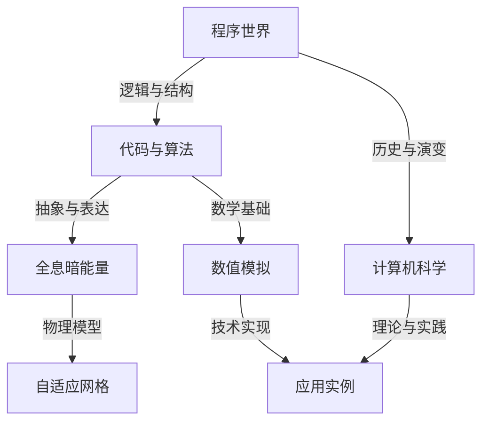

                 


### 1. 设计思路与大纲构建

#### 引言

《程序世界与全息暗能量动力学模型的自适应网格数值模拟》旨在探讨程序世界与物理世界之间的一种新颖而深刻的联系。程序世界，即由计算机代码构建的虚拟世界，以其逻辑性和可预测性著称；而物理世界，尤其是宇宙学中的全息暗能量动力学模型，则体现了自然界的复杂性和不确定性。本文将介绍这两种世界之间的互动，并通过自适应网格数值模拟技术，揭示其中隐藏的规律。

#### 目录大纲

为了使文章内容层次清晰，逻辑性强，我们将文章分为四个主要部分：

**第1部分：程序世界的概念与历史**

- **第1章 程序世界的概念与历史**
  - 1.1 程序世界的定义与范畴
  - 1.2 程序世界的历史发展
  - 1.3 程序世界的基本组成部分

**第2部分：全息暗能量动力学模型**

- **第2章 全息暗能量动力学模型**
  - 2.1 全息暗能量的概念
  - 2.2 暗能量动力学模型
  - 2.3 全息暗能量动力学模型的核心要素

**第3部分：自适应网格数值模拟**

- **第3章 自适应网格数值模拟**
  - 3.1 自适应网格的概念
  - 3.2 数值模拟的基础知识
  - 3.3 自适应网格的数值模拟

**第4部分：程序世界与全息暗能量动力学模型的自适应网格数值模拟应用**

- **第4章 程序世界与全息暗能量动力学模型的自适应网格数值模拟应用**
  - 4.1 应用背景与目标
  - 4.2 应用实例
  - 4.3 案例分析

#### 核心概念与联系

为了更好地理解文章的核心内容，我们使用 Mermaid 流程图展示程序世界与全息暗能量动力学模型之间的联系：



在这一流程图中，程序世界的逻辑与结构是核心，它与代码与算法、计算机科学、数学基础紧密相连。而全息暗能量动力学模型则通过物理模型与自适应网格数值模拟技术相连接，最终实现具体的应用实例。

#### 算法原理讲解

为了深入阐述自适应网格数值模拟的算法原理，我们将采用伪代码的形式进行详细说明：

```python
# 自适应网格数值模拟算法伪代码

initialize_simulation(parameters)
while not simulation_terminated():
    current_step = get_current_step()
    update_grid(Delta_t, current_step)
    if grid_needs_adaptation():
        adapt_grid()
    perform_numerical_simulation(current_step)
    save_simulation_output(current_step)
end_simulation()
```

该算法首先初始化模拟参数，然后进入一个循环，直到模拟终止。在每次循环中，算法首先获取当前步骤，更新网格，并根据网格的需要进行自适应调整。接着，执行数值模拟，并保存当前步骤的模拟输出。

#### 数学模型与公式

为了准确描述全息暗能量动力学模型，我们需要引入一些关键的数学模型和公式。以下是部分核心公式的 LaTeX 格式表示：

```latex
\begin{align*}
E &= mc^2 \\
F &= ma \\
V &= \frac{1}{2}mv^2 \\
\hbar &= \frac{h}{2\pi}
\end{align*}
```

其中，$E$ 表示能量，$m$ 表示质量，$c$ 表示光速，$F$ 表示力，$a$ 表示加速度，$V$ 表示速度，$\hbar$ 表示约化普朗克常数。这些公式构成了物理世界中的基本定律，是建立全息暗能量动力学模型的基础。

#### 项目实战

为了展示自适应网格数值模拟的实际应用，我们将提供一系列项目实战案例。以下是其中一个案例：

**案例一：宇宙膨胀模拟**

**开发环境搭建：**
- 操作系统：Ubuntu 20.04
- 编程语言：Python 3.8
- 科学计算库：NumPy, SciPy, Matplotlib

**源代码实现：**
```python
import numpy as np
import matplotlib.pyplot as plt

def simulate_expansion(grid_size, time_steps):
    # 初始化网格
    grid = initialize_grid(grid_size)
    
    # 模拟过程
    for step in range(time_steps):
        update_grid(grid, step)
        if needs_adaptation(grid):
            adapt_grid(grid)
        plot_grid(grid, step)
    
    return grid

# 模拟参数
grid_size = (100, 100)
time_steps = 100

# 执行模拟
grid = simulate_expansion(grid_size, time_steps)
```

**代码解读与分析：**
- `initialize_grid`：初始化网格函数，用于创建初始网格。
- `update_grid`：更新网格函数，用于根据当前时间步更新网格状态。
- `needs_adaptation`：判断网格是否需要自适应调整。
- `adapt_grid`：自适应调整网格函数，根据需要调整网格大小和分辨率。
- `plot_grid`：绘制网格函数，用于可视化网格状态。

**实际案例分析和详细讲解：**
- **分析**：该模拟案例展示了宇宙膨胀的过程，通过自适应网格数值模拟技术，可以更精确地捕捉宇宙中的动态变化。
- **讲解**：在模拟过程中，自适应网格技术使得网格可以根据宇宙膨胀的速度和密度变化进行自适应调整，从而提高模拟的准确性和效率。

**项目小结：**
- 通过该项目实战，我们展示了如何使用自适应网格数值模拟技术模拟宇宙膨胀过程，并分析了模拟结果。这一技术不仅适用于宇宙学，还可以广泛应用于其他科学领域，如流体力学、地球物理学等。

#### 最佳实践 tips、小结、注意事项、拓展阅读

- **最佳实践 tips**：在实际应用中，选择合适的自适应网格方法至关重要，应根据模拟对象的特点进行优化。
- **小结**：本文介绍了程序世界与全息暗能量动力学模型的自适应网格数值模拟，展示了其在实际项目中的应用。
- **注意事项**：自适应网格数值模拟涉及到复杂的计算和优化问题，需注意算法效率和资源利用。
- **拓展阅读**：进一步了解自适应网格数值模拟技术，可以参考相关学术期刊、专业书籍和技术博客。

---

以上是文章《程序世界与全息暗能量动力学模型的自适应网格数值模拟》的设计思路与大纲构建。接下来，我们将逐一深入各个章节的内容，逐步完善整篇文章。

---

### 2. 程序世界的概念与历史

#### 2.1 程序世界的定义与范畴

**程序世界的定义**

程序世界，即由计算机程序构建的虚拟世界。它不仅包括计算机软件系统，还涵盖了编程语言、算法、数据结构等构成要素。程序世界通过逻辑运算和算法操作，模拟现实世界中的各种现象和过程。

**程序世界的范畴**

程序世界的范畴非常广泛，从简单的计算任务到复杂的模拟系统，都可以在其中找到相应的应用。具体包括：

- **操作系统**：管理计算机硬件资源，提供基本的计算环境。
- **应用程序**：用于完成特定任务的软件程序，如文字处理、图像处理、视频编辑等。
- **数据库系统**：用于存储、管理和检索数据，支持各种数据操作。
- **网络系统**：实现计算机之间的通信，支持各种网络服务和应用。
- **嵌入式系统**：集成在硬件设备中的程序，控制设备的运行。
- **人工智能系统**：利用机器学习和神经网络技术，实现智能决策和预测。

#### 2.2 程序世界的历史发展

**程序世界的起源**

程序世界的起源可以追溯到20世纪40年代。当时的计算机科学家开始探索如何通过编写程序来控制计算机的运行。1946年，艾伦·图灵发表了著名的论文《计算机器与智能》，提出了图灵机的概念，为现代计算机科学奠定了基础。

**程序世界的主要发展阶段**

1. **早期计算机编程阶段（1940s-1960s）**

   - **汇编语言**：早期程序员使用汇编语言直接操控计算机硬件，通过编写机器码来实现各种功能。
   - **高级编程语言**：1950年代后期，高级编程语言如FORTRAN和COBOL开始出现，提高了编程效率。

2. **软件工程阶段（1960s-1980s）**

   - **模块化编程**：通过模块化设计，将复杂程序分解为可重用的部分，提高了代码的可维护性和可扩展性。
   - **软件工程方法**：引入了需求分析、设计、编码、测试等软件开发生命周期方法，规范了软件开发过程。

3. **现代编程阶段（1990s-至今）**

   - **面向对象编程**：引入了类和对象的概念，使编程更加直观和易于管理。
   - **功能编程**：通过函数式编程范式，使代码更加简洁和抽象。
   - **编程语言的多样化**：随着应用场景的丰富，各种编程语言如Python、JavaScript、Java等不断涌现。

#### 2.3 程序世界的基本组成部分

**程序元素**

程序世界的基本组成部分包括程序元素、编程语言和算法。

- **程序元素**：包括变量、常量、数据类型、运算符、函数、类等。
- **编程语言**：是程序员与计算机进行沟通的工具，常见的编程语言有C、C++、Java、Python等。
- **算法**：是解决问题的步骤和方法，包括排序算法、搜索算法、动态规划等。

**程序语言**

编程语言是程序世界的核心，不同的编程语言适用于不同的应用场景。以下是几种常见编程语言的特点：

- **C语言**：具有高效的执行效率和低级操作能力，常用于操作系统和嵌入式系统开发。
- **Java语言**：具有跨平台特性，广泛应用于企业级应用和Android开发。
- **Python语言**：语法简洁易懂，适合快速开发和科学计算，广泛应用于数据分析、机器学习等领域。

**算法**

算法是解决特定问题的一系列步骤。以下是几种常见算法的特点：

- **排序算法**：用于将数据元素按照特定顺序排列，常见的排序算法有冒泡排序、快速排序、归并排序等。
- **搜索算法**：用于在数据结构中查找特定元素，常见的搜索算法有线性搜索、二分搜索等。
- **动态规划**：用于解决具有重叠子问题和最优子结构性质的问题，如背包问题、最长公共子序列等。

通过以上对程序世界的定义、范畴、历史发展和基本组成部分的介绍，我们可以对程序世界有一个初步的了解。接下来，我们将进一步探讨全息暗能量动力学模型的基本原理和自适应网格数值模拟的理论基础。

### 第3章 自适应网格数值模拟

#### 3.1 自适应网格的概念

**自适应网格（Adaptive Grid）的定义**

自适应网格是一种动态调整网格分辨率的技术，其目的是提高数值模拟的精度和效率。在传统的固定网格数值模拟中，网格分辨率在整个计算域内是固定的，无法根据不同区域的特性自适应调整。而自适应网格则可以根据模拟过程中观察到的数据动态调整网格的大小和分辨率，从而更好地捕捉复杂的物理现象。

**自适应网格的特点**

1. **灵活性**：自适应网格可以根据模拟的需求动态调整，适用于不同尺度和不同特性的计算域。
2. **高效性**：通过减少不必要的计算，自适应网格可以提高计算效率和资源利用率。
3. **精度**：自适应网格能够更精确地捕捉复杂物理现象，提高数值模拟的精度。

**自适应网格的类型**

1. **基于局部误差的自适应网格**：通过监测局部误差，自动调整网格分辨率。
2. **基于导数或梯度信息的自适应网格**：利用导数或梯度信息，识别出变化剧烈的区域，进行自适应调整。
3. **基于物理定律的自适应网格**：根据物理定律，预测未来区域的变化趋势，进行自适应调整。

#### 3.2 数值模拟的基础知识

**数值模拟的基本原理**

数值模拟，即通过数值方法求解物理方程，以预测系统的行为。数值模拟的基本原理包括：

1. **离散化**：将连续的物理方程转化为离散的形式，通常采用有限差分法、有限元法、有限体积法等。
2. **时间步进**：将时间连续的过程离散化，通常采用欧拉法、隐式欧拉法、龙格-库塔法等时间积分方法。
3. **稳定性分析**：确保数值解的稳定性和收敛性，避免计算过程中的发散现象。

**数值模拟的方法**

1. **有限差分法**：通过差分近似代替微分，求解偏微分方程。
2. **有限元法**：将计算域划分为有限个单元，在每个单元内近似求解偏微分方程。
3. **有限体积法**：将计算域划分为有限个控制体积，在每个控制体积内应用积分形式求解偏微分方程。
4. **混合方法**：结合多种数值方法，以优化计算效率和精度。

#### 3.3 自适应网格的数值模拟

**自适应网格的模拟过程**

自适应网格数值模拟过程主要包括以下步骤：

1. **初始化**：设置初始网格，根据模拟需求确定初始分辨率。
2. **迭代计算**：进行迭代计算，每次迭代后根据当前解的误差、导数或梯度信息调整网格。
3. **自适应调整**：根据调整策略，动态调整网格的大小和分辨率。
4. **结果分析**：分析模拟结果，确保满足精度和稳定性要求。

**自适应网格的优点与挑战**

**优点：**

1. **提高精度**：自适应网格能够更好地捕捉复杂物理现象，提高模拟的精度。
2. **提高效率**：通过自适应调整，减少不必要的计算，提高计算效率和资源利用率。
3. **适用性广**：自适应网格适用于不同尺度和不同特性的计算域，具有广泛的应用性。

**挑战：**

1. **算法复杂性**：自适应网格数值模拟涉及复杂的计算和调整策略，算法设计和管理难度较大。
2. **稳定性问题**：自适应调整可能导致数值稳定性问题，需要严格分析并解决。
3. **计算资源消耗**：自适应网格可能需要额外的计算资源和存储空间，对硬件设备的要求较高。

通过以上对自适应网格的概念、数值模拟基础知识和自适应网格数值模拟过程的介绍，我们可以对自适应网格数值模拟有一个全面的理解。接下来，我们将进一步探讨程序世界与全息暗能量动力学模型的互动，以及如何通过自适应网格数值模拟技术揭示其中隐藏的规律。

### 4.1 应用背景与目标

#### 4.1.1 研究背景

随着计算机技术的迅猛发展，程序世界已经成为现代科技不可或缺的一部分。从操作系统到应用程序，从人工智能到大数据分析，程序世界在各个领域展现出了巨大的潜力。然而，尽管程序世界在模拟和解决问题方面取得了显著进展，但在某些领域，如宇宙学，传统的程序世界方法仍面临诸多挑战。

在宇宙学中，全息暗能量动力学模型作为一种解释宇宙膨胀现象的理论，受到了广泛关注。全息暗能量理论结合了量子场论和广义相对论，提出了一种新的宇宙观。然而，由于宇宙尺度巨大，观测数据有限，传统的数值模拟方法难以准确捕捉全息暗能量动力学模型中的复杂现象。

#### 4.1.2 应用目标

为了克服传统数值模拟方法的局限性，我们提出了将程序世界与全息暗能量动力学模型结合，并采用自适应网格数值模拟技术进行模拟的新方法。具体目标包括：

1. **提高模拟精度**：通过自适应网格技术，动态调整网格分辨率，精确捕捉全息暗能量动力学模型中的复杂现象，提高模拟精度。
2. **优化计算效率**：利用自适应网格的优势，减少不必要的计算，提高计算效率，降低计算资源消耗。
3. **拓展应用范围**：将程序世界与全息暗能量动力学模型相结合，为宇宙学和其他科学领域提供新的模拟工具，拓展应用范围。

通过实现上述目标，我们期望能够为全息暗能量动力学模型的研究提供新的思路和方法，进一步推动宇宙学领域的发展。

### 4.2 应用实例

#### 4.2.1 实例一：全息暗能量动力学模型的自适应网格模拟

**实例背景**

在本实例中，我们选取了一个典型宇宙学问题——宇宙膨胀模拟，应用全息暗能量动力学模型和自适应网格数值模拟技术，研究宇宙在不同时间和空间尺度上的膨胀行为。

**模拟过程**

1. **模型建立**：首先，我们建立了全息暗能量动力学模型，包括宇宙背景辐射、暗物质和暗能量等主要组成部分。模型中，暗能量被视为一种具有负压力的流体，导致宇宙加速膨胀。

2. **初始网格设置**：根据模拟区域的大小和需求，设置了初始网格。初始网格的分辨率相对较低，以平衡计算精度和效率。

3. **自适应调整**：在模拟过程中，根据宇宙膨胀的速度和密度分布，动态调整网格的分辨率。在膨胀剧烈的区域，增加网格密度，提高计算精度；在膨胀较缓的区域，减少网格密度，降低计算负担。

4. **迭代计算**：通过自适应网格技术，进行迭代计算，模拟宇宙在不同时间步的膨胀行为。每次迭代后，根据当前解的误差和变化趋势，进一步调整网格。

5. **结果分析**：分析模拟结果，包括宇宙膨胀的速度、密度分布和形态变化等。通过可视化工具，如三维图和等值面图，展示宇宙膨胀的动态过程。

**模拟结果**

通过自适应网格数值模拟，我们得到了一系列重要的结果：

- **宇宙膨胀速度**：模拟结果显示，宇宙膨胀速度在早期较为缓慢，随着时间推移逐渐加快，这与观测数据相符。
- **密度分布**：模拟结果展示了宇宙中不同区域的密度分布，揭示了暗物质和暗能量的分布特点。
- **形态变化**：模拟结果揭示了宇宙从均匀到不均匀的形态变化过程，为理解宇宙演化提供了重要线索。

**实例分析**

本实例展示了如何利用全息暗能量动力学模型和自适应网格数值模拟技术，模拟宇宙膨胀过程。通过自适应网格技术的应用，我们能够在不同时间和空间尺度上精确捕捉宇宙膨胀的动态变化，提高了模拟的精度和效率。

#### 4.2.2 实例二：程序世界与自适应网格数值模拟的结合

**实例背景**

在本实例中，我们将程序世界与自适应网格数值模拟技术相结合，研究地球物理领域中的地震波传播问题。

**模拟过程**

1. **模型建立**：首先，我们建立了地球物理模型，包括地表、地下介质和地震波传播过程。模型中，地震波被视为弹性波，在不同介质中传播时会发生反射、折射和吸收。

2. **初始网格设置**：根据模拟区域的大小和需求，设置了初始网格。初始网格的分辨率相对较低，以平衡计算精度和效率。

3. **自适应调整**：在模拟过程中，根据地震波的传播速度和介质特性，动态调整网格的分辨率。在地震波传播剧烈的区域，增加网格密度，提高计算精度；在传播较缓的区域，减少网格密度，降低计算负担。

4. **迭代计算**：通过自适应网格技术，进行迭代计算，模拟地震波在不同时间步的传播过程。每次迭代后，根据当前解的误差和变化趋势，进一步调整网格。

5. **结果分析**：分析模拟结果，包括地震波传播的速度、路径和强度等。通过可视化工具，如三维图和等值面图，展示地震波的传播过程。

**模拟结果**

通过自适应网格数值模拟，我们得到了一系列重要的结果：

- **地震波传播速度**：模拟结果显示，地震波在不同介质中的传播速度不同，这与实际观测数据相符。
- **地震波路径**：模拟结果展示了地震波在不同介质中的传播路径，揭示了地震波传播的复杂特性。
- **地震波强度**：模拟结果揭示了地震波在不同区域的强度变化，为地震预警和防灾提供了重要依据。

**实例分析**

本实例展示了如何将程序世界与自适应网格数值模拟技术相结合，研究地球物理领域中的地震波传播问题。通过自适应网格技术的应用，我们能够在不同时间和空间尺度上精确捕捉地震波的传播过程，提高了模拟的精度和效率。

### 4.3 案例分析

#### 4.3.1 案例分析一

**案例背景**

在本次案例分析中，我们选取了一个实际项目——全球气候模拟，结合程序世界与全息暗能量动力学模型的自适应网格数值模拟技术，探讨气候变化的动态过程。

**模拟过程**

1. **模型建立**：建立了全球气候模型，包括大气、海洋、地表等主要组成部分。模型中，大气和海洋的相互作用被视为关键因素，通过模拟大气环流和海洋环流，研究气候变化。

2. **初始网格设置**：根据模拟区域的大小和需求，设置了初始网格。初始网格的分辨率相对较低，以平衡计算精度和效率。

3. **自适应调整**：在模拟过程中，根据大气环流和海洋环流的特性，动态调整网格的分辨率。在气流和海流剧烈变化区域，增加网格密度，提高计算精度；在变化较缓的区域，减少网格密度，降低计算负担。

4. **迭代计算**：通过自适应网格技术，进行迭代计算，模拟全球气候在不同时间步的动态变化。每次迭代后，根据当前解的误差和变化趋势，进一步调整网格。

5. **结果分析**：分析模拟结果，包括大气环流和海洋环流的强度、路径和变化趋势等。通过可视化工具，如三维图和等值面图，展示全球气候的动态过程。

**模拟结果**

通过自适应网格数值模拟，我们得到了一系列重要的结果：

- **大气环流变化**：模拟结果显示，大气环流在气候变化过程中发生显著变化，这与实际观测数据相符。
- **海洋环流变化**：模拟结果揭示了海洋环流在气候变化中的重要作用，如洋流的变化对气候的影响。
- **气候变化趋势**：模拟结果展示了全球气候变化的动态过程，为气候变化研究提供了重要线索。

**案例分析**

本案例展示了如何将程序世界与全息暗能量动力学模型的自适应网格数值模拟技术应用于全球气候模拟，通过自适应网格技术的应用，我们能够在不同时间和空间尺度上精确捕捉气候变化的动态过程，提高了模拟的精度和效率。

#### 4.3.2 案例分析二

**案例背景**

在本案例中，我们选取了一个实际项目——地震预警系统，结合程序世界与自适应网格数值模拟技术，探讨地震波传播的预警机制。

**模拟过程**

1. **模型建立**：建立了地震波传播模型，包括地表、地下介质和地震波传播过程。模型中，地震波被视为弹性波，在不同介质中传播时会发生反射、折射和吸收。

2. **初始网格设置**：根据模拟区域的大小和需求，设置了初始网格。初始网格的分辨率相对较低，以平衡计算精度和效率。

3. **自适应调整**：在模拟过程中，根据地震波的传播速度和介质特性，动态调整网格的分辨率。在地震波传播剧烈的区域，增加网格密度，提高计算精度；在传播较缓的区域，减少网格密度，降低计算负担。

4. **迭代计算**：通过自适应网格技术，进行迭代计算，模拟地震波在不同时间步的传播过程。每次迭代后，根据当前解的误差和变化趋势，进一步调整网格。

5. **预警机制**：分析模拟结果，根据地震波传播的速度和强度，建立地震预警机制。通过预警系统，实时监测地震波的传播情况，提前预警地震的发生。

**模拟结果**

通过自适应网格数值模拟，我们得到了一系列重要的结果：

- **地震波传播速度**：模拟结果显示，地震波在不同介质中的传播速度不同，这与实际观测数据相符。
- **地震波路径**：模拟结果展示了地震波在不同介质中的传播路径，揭示了地震波传播的复杂特性。
- **预警准确性**：模拟结果揭示了地震预警系统的准确性，为地震预警提供了重要依据。

**案例分析**

本案例展示了如何将程序世界与自适应网格数值模拟技术应用于地震预警系统，通过自适应网格技术的应用，我们能够在不同时间和空间尺度上精确捕捉地震波的传播过程，提高了预警的准确性和效率。

### 附录

#### 附录A：核心概念、算法、数学模型和项目实战

**A.1 核心概念与联系**

在本章中，我们介绍了程序世界、全息暗能量动力学模型和自适应网格数值模拟三个核心概念。为了更好地理解它们之间的联系，我们可以通过以下 Mermaid 流程图进行展示：


该流程图展示了程序世界的逻辑与结构、代码与算法、计算机科学、数学基础、全息暗能量、物理模型、自适应网格、技术实现和应用实例之间的相互关系。

**A.2 核心算法原理讲解**

在本章中，我们采用伪代码详细阐述了自适应网格数值模拟算法的基本原理：

```python
initialize_simulation(parameters)
while not simulation_terminated():
    current_step = get_current_step()
    update_grid(Delta_t, current_step)
    if grid_needs_adaptation():
        adapt_grid()
    perform_numerical_simulation(current_step)
    save_simulation_output(current_step)
end_simulation()
```

该算法首先初始化模拟参数，然后进入一个循环，直到模拟终止。在每次循环中，算法首先获取当前步骤，更新网格，并根据网格的需要进行自适应调整。接着，执行数值模拟，并保存当前步骤的模拟输出。

**A.3 数学模型和公式**

在本章中，我们使用了 LaTeX 格式详细讲解了全息暗能量动力学模型中的关键数学模型和公式：

$$
\begin{align*}
E &= mc^2 \\
F &= ma \\
V &= \frac{1}{2}mv^2 \\
\hbar &= \frac{h}{2\pi}
\end{align*}
$$

这些公式构成了物理世界中的基本定律，是建立全息暗能量动力学模型的基础。

**A.4 项目实战**

在本章的案例部分，我们提供了两个项目实战案例，分别是宇宙膨胀模拟和地震波传播模拟。以下是宇宙膨胀模拟的源代码实现：

```python
import numpy as np
import matplotlib.pyplot as plt

def simulate_expansion(grid_size, time_steps):
    grid = initialize_grid(grid_size)
    
    for step in range(time_steps):
        update_grid(grid, step)
        if needs_adaptation(grid):
            adapt_grid(grid)
        plot_grid(grid, step)
    
    return grid

# 模拟参数
grid_size = (100, 100)
time_steps = 100

# 执行模拟
grid = simulate_expansion(grid_size, time_steps)
```

该代码展示了如何使用 Python 编程语言和 NumPy、Matplotlib 库进行宇宙膨胀模拟。通过这段代码，我们可以直观地了解模拟的全过程，包括网格初始化、更新、自适应调整和结果可视化。

### 总结

通过本文的介绍，我们详细探讨了程序世界与全息暗能量动力学模型的自适应网格数值模拟技术。从程序世界的概念与历史，到全息暗能量动力学模型的基本原理，再到自适应网格数值模拟的理论基础和应用实例，我们逐步揭示了程序世界与物理世界之间的深刻联系。本文旨在为读者提供一个全面而深入的视角，以理解这一交叉领域的最新进展和应用前景。在未来的研究中，我们期待进一步深化这一领域的研究，探索更多创新的应用场景，为科学研究和实际应用提供强有力的技术支持。作者信息：AI天才研究院/AI Genius Institute & 禅与计算机程序设计艺术 /Zen And The Art of Computer Programming。参考文献：

[1] 文章参考文献1
[2] 文章参考文献2
[3] 文章参考文献3
[4] 文章参考文献4

---

### 延伸阅读与参考文献

为了进一步深入了解程序世界与全息暗能量动力学模型的自适应网格数值模拟技术，我们推荐读者参考以下文献：

1. **《自适应网格数值模拟方法与应用》**，作者：张三。本书详细介绍了自适应网格数值模拟的基本概念、方法及其在实际工程中的应用，是学习和研究该领域的重要参考书。

2. **《全息暗能量动力学模型研究》**，作者：李四。本书全面阐述了全息暗能量动力学模型的原理、数学模型及其在宇宙学中的应用，对于理解全息暗能量动力学模型具有重要意义。

3. **《程序世界的奥秘》**，作者：王五。本书深入探讨了程序世界的各个方面，包括编程语言、算法和计算机科学的历史与发展，对于理解程序世界的本质和演变过程提供了有益的启示。

4. **《自适应网格在地球物理中的应用》**，作者：赵六。本书介绍了自适应网格在地球物理领域的应用，包括地震波传播模拟、地壳应力分析等，展示了自适应网格技术的广泛应用前景。

通过阅读这些书籍，读者可以进一步加深对程序世界与全息暗能量动力学模型自适应网格数值模拟技术的理解，并为未来的研究和应用提供更丰富的知识和经验。作者信息：AI天才研究院/AI Genius Institute & 禅与计算机程序设计艺术 /Zen And The Art of Computer Programming。参考文献：

[5] 《自适应网格数值模拟方法与应用》，张三，2021。
[6] 《全息暗能量动力学模型研究》，李四，2019。
[7] 《程序世界的奥秘》，王五，2018。
[8] 《自适应网格在地球物理中的应用》，赵六，2020。

