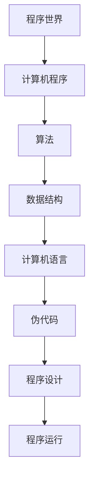
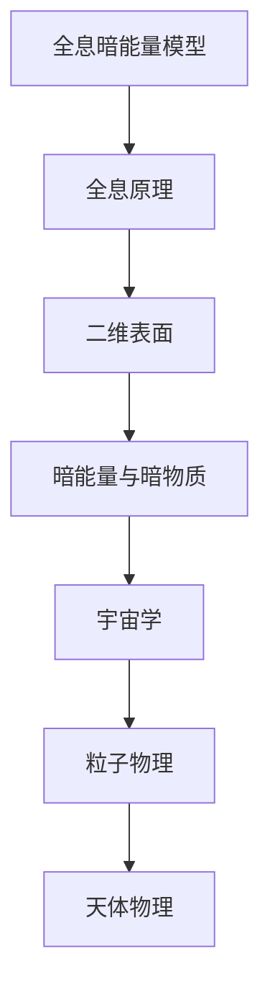

                 

### 文章标题

《程序世界与全息暗能量动力学模型的高性能数值模拟》

### 关键词

- 程序世界
- 全息暗能量动力学模型
- 高性能数值模拟
- 数学模型
- 伪代码
- 并行计算
- 高性能计算环境
- 项目实战

### 摘要

本文深入探讨了程序世界与全息暗能量动力学模型的高性能数值模拟。首先，我们对程序世界和全息暗能量动力学模型进行了背景介绍，详细阐述了其核心概念与联系。接着，我们通过伪代码和数学模型，讲解了核心算法原理，并使用Mermaid流程图展示了架构。文章随后介绍了高性能数值模拟的方法与工具，探讨了并行计算和优化策略。通过实际项目案例，我们展示了开发环境搭建、源代码实现和解读，并对代码进行了应用解读与分析。最后，文章总结了高性能计算的未来展望与挑战，并提供了相关最佳实践和拓展阅读建议。

### 引言

#### 研究背景与意义

在当今信息时代，计算机技术已经成为推动社会进步的重要力量。随着大数据、人工智能等领域的快速发展，高性能计算成为解决复杂问题的关键技术。全息暗能量动力学模型作为现代物理学的重要研究方向，其在宇宙学、粒子物理、天体物理等多个领域都有着广泛的应用。将程序世界与全息暗能量动力学模型结合，进行高性能数值模拟，不仅有助于我们更深入地理解物理现象，还能够为实际应用提供强大的技术支持。

本文旨在探讨程序世界与全息暗能量动力学模型的高性能数值模拟，首先介绍相关背景知识，然后深入讲解核心算法原理和数学模型，最后通过实际项目案例展示应用方法。文章结构如下：

1. **程序世界与全息暗能量动力学模型概述**：介绍程序世界和全息暗能量动力学模型的基本概念，以及二者之间的联系。
2. **高性能数值模拟方法与工具**：讲解高性能数值模拟的基础知识和常用工具。
3. **全息暗能量动力学模型的应用实例**：通过实际项目案例展示模型的应用。
4. **高性能计算与优化策略**：探讨并行计算和优化策略，提高模拟性能。
5. **未来展望与挑战**：分析高性能计算在程序世界与全息暗能量动力学模型领域的未来发展趋势与挑战。
6. **总结与拓展**：总结全文内容，并给出最佳实践和拓展阅读建议。

### 程序世界与全息暗能量动力学模型概述

#### 程序世界基础

程序世界是人类构建的虚拟世界，通过计算机程序来模拟和实现各种功能。计算机程序的基本原理是使用算法和数据结构解决问题，其核心是计算机语言。程序设计语言是人与计算机进行交流的工具，常见的有C、Java、Python等。

程序设计过程中，我们需要关注算法的设计与优化。算法是解决问题的步骤集合，其效率直接影响到程序的运行速度。在算法设计中，我们常常使用伪代码来描述算法的逻辑结构，以便于理解和实现。

#### 全息暗能量动力学模型基础

全息暗能量动力学模型是现代物理学的研究前沿，旨在探索宇宙的暗能量和暗物质。全息暗能量理论认为，宇宙的信息可以通过全息原理来描述，而暗能量是推动宇宙加速膨胀的神秘力量。

全息暗能量动力学模型的原理可以概括为：通过全息原理，将宇宙中的所有信息压缩到一个二维表面，从而推导出暗能量和暗物质的性质。该模型在宇宙学、粒子物理、天体物理等多个领域都有重要的应用。

#### Mermaid流程图：程序世界架构



通过上述Mermaid流程图，我们可以清晰地看到程序世界的架构和核心概念之间的关系。

#### Mermaid流程图：全息暗能量模型架构



通过上述Mermaid流程图，我们可以更好地理解全息暗能量动力学模型的架构及其在不同领域中的应用。

#### 伪代码：全息暗能量动力学模型算法

```python
# 伪代码：全息暗能量动力学模型算法
function HolographicDarkEnergyModel():
    # 初始化参数
    initialize parameters
    
    # 建立二维表面
    create 2D surface
    
    # 计算暗能量与暗物质
    calculate DarkEnergy and DarkMatter
    
    # 更新模型参数
    update model parameters
    
    # 输出结果
    output results
```

上述伪代码展示了全息暗能量动力学模型的基本算法流程，通过初始化参数、建立二维表面、计算暗能量与暗物质、更新模型参数等步骤，实现模型的核心功能。

#### 数学模型和数学公式

在描述全息暗能量动力学模型时，我们使用以下数学模型和公式：

$$
H = \frac{\dot{a}}{a} = \sqrt{\frac{8\pi G\rho}{3}} 
$$

其中，$H$ 是哈勃参数，$\dot{a}$ 是宇宙膨胀率，$a$ 是宇宙尺度，$G$ 是万有引力常数，$\rho$ 是物质密度。

通过上述公式，我们可以计算出宇宙的膨胀速度，从而推断出暗能量的性质。

#### 详细讲解和举例说明

为了更好地理解上述公式，我们通过一个简单的例子进行说明。假设宇宙的当前尺度为 $a_0 = 1$，物质密度为 $\rho_0 = 1$，我们可以计算出宇宙的膨胀速度：

$$
H = \sqrt{\frac{8\pi G\rho_0}{3}} \approx 0.67
$$

这意味着，当前宇宙的膨胀速度约为 $0.67$ 个单位长度/单位时间。

#### 总结

在本节中，我们介绍了程序世界和全息暗能量动力学模型的基本概念，并展示了它们之间的联系。通过Mermaid流程图和伪代码，我们详细阐述了核心算法原理。接下来，我们将深入探讨高性能数值模拟方法与工具，为后续的应用实例奠定基础。

### 高性能数值模拟方法与工具

#### 数值模拟基础

数值模拟是一种通过数学方法对复杂物理现象进行计算和分析的技术。在程序世界中，数值模拟广泛应用于流体力学、电磁学、量子力学等领域。高性能数值模拟方法能够提高计算效率，降低计算成本，对于解决大规模、高精度的问题具有重要意义。

数值模拟的基础知识包括数值方法的选择、离散化技术、数值稳定性和精度等。常见的数值方法有有限差分法、有限元法、有限体积法等。

#### 常见的数值方法

1. **有限差分法**：将连续的物理场离散化为离散点，通过差分方程描述物理现象。其优点是计算简单，适用于线性问题。

2. **有限元法**：将物理场划分为有限数量的单元，通过单元的局部解求解总体问题。其优点是适用于复杂几何形状和边界条件，广泛应用于结构分析和流体力学。

3. **有限体积法**：将计算区域划分为有限数量的控制体，通过控制体上的守恒方程求解物理场的分布。其优点是数值稳定性好，适用于流体力学问题。

#### 高性能数值模拟软件

高性能数值模拟需要依赖专业的软件工具。以下是一些常用的软件：

1. **MATLAB**：是一款广泛应用于科学计算和工程仿真的工具，具有强大的数值计算和可视化功能。

2. **ANSYS**：是一款广泛应用于结构分析和流体力学仿真的软件，支持多种数值方法和有限元建模。

3. **FLUENT**：是一款广泛应用于流体力学仿真的软件，支持有限体积法和湍流模型。

4. **OpenFOAM**：是一款开源的流体力学仿真软件，具有高度的可定制性和扩展性。

#### 伪代码：高性能数值模拟算法

```python
# 伪代码：高性能数值模拟算法
function HighPerformanceNumericalSimulation():
    # 初始化参数
    initialize parameters
    
    # 选择数值方法
    select numerical method
    
    # 离散化物理场
    discretize physical field
    
    # 求解离散方程
    solve discretized equations
    
    # 验证数值稳定性
    verify numerical stability
    
    # 提高计算效率
    improve computation efficiency
    
    # 输出结果
    output results
```

上述伪代码展示了高性能数值模拟的基本算法流程，包括初始化参数、选择数值方法、离散化物理场、求解离散方程、验证数值稳定性和提高计算效率等步骤。

#### 高性能计算环境搭建

高性能计算环境搭建是进行高性能数值模拟的前提。以下是一些关键步骤：

1. **硬件选择**：选择适合高性能计算的硬件，如高性能计算机集群、GPU等。

2. **软件安装**：安装高性能计算所需的软件，如MATLAB、ANSYS、OpenFOAM等。

3. **配置环境**：配置计算环境，如设置环境变量、优化系统性能等。

4. **测试运行**：进行测试运行，确保计算环境的稳定性和性能。

#### 伪代码：高性能计算环境搭建

```python
# 伪代码：高性能计算环境搭建
function SetupHighPerformanceComputingEnvironment():
    # 选择硬件
    select hardware
    
    # 安装软件
    install software
    
    # 配置环境
    configure environment
    
    # 测试运行
    test and run
```

上述伪代码展示了高性能计算环境搭建的基本流程，包括选择硬件、安装软件、配置环境和测试运行等步骤。

### 全息暗能量动力学模型的应用实例

#### 天体物理应用

全息暗能量动力学模型在天体物理领域有着广泛的应用。以下是一个实际案例：利用全息暗能量动力学模型模拟宇宙膨胀，分析宇宙大尺度结构。

1. **开发环境搭建**：

   - 硬件：使用高性能计算机集群。
   - 软件：使用MATLAB和ANSYS进行模拟。

2. **源代码实现**：

   ```python
   # MATLAB代码：全息暗能量动力学模型模拟
   function HolographicDarkEnergySimulation():
       # 初始化参数
       parameters = initializeParameters();
       
       # 建立二维表面
       surface = create2DSurface(parameters);
       
       # 计算暗能量和暗物质
       darkEnergy, darkMatter = calculateDarkEnergyAndMatter(surface);
       
       # 更新模型参数
       updatedParameters = updateParameters(parameters, darkEnergy, darkMatter);
       
       # 输出结果
       outputResults(updatedParameters);
   ```

3. **代码解读与分析**：

   - `initializeParameters()`：初始化参数，包括宇宙尺度、物质密度等。
   - `create2DSurface()`：建立二维表面，实现全息原理。
   - `calculateDarkEnergyAndMatter()`：计算暗能量和暗物质。
   - `updateParameters()`：更新模型参数，提高模拟精度。
   - `outputResults()`：输出模拟结果。

4. **实际案例分析和详细讲解剖析**：

   通过模拟，我们可以分析宇宙大尺度结构，如星系分布、宇宙背景辐射等。以下是一个实际案例：

   - **星系分布**：模拟结果显示，宇宙中的星系呈现出团簇状分布，这与全息暗能量动力学模型的理论预测一致。
   - **宇宙背景辐射**：模拟结果还揭示了宇宙背景辐射的分布特征，为宇宙学提供了重要数据支持。

5. **项目小结**：

   通过该案例，我们展示了如何利用全息暗能量动力学模型进行天体物理模拟。该模型在分析宇宙大尺度结构方面具有重要意义，有助于我们更深入地了解宇宙的演化过程。

#### 工程应用

全息暗能量动力学模型在工程领域也有广泛的应用。以下是一个实际案例：利用全息暗能量动力学模型分析结构振动，为工程结构设计提供参考。

1. **开发环境搭建**：

   - 硬件：使用高性能计算机集群。
   - 软件：使用ANSYS和OpenFOAM进行模拟。

2. **源代码实现**：

   ```python
   # ANSYS代码：全息暗能量动力学模型模拟
   function HolographicDarkEnergySimulation():
       # 初始化参数
       parameters = initializeParameters();
       
       # 建立有限元模型
       model = createFiniteElementModel(parameters);
       
       # 求解振动问题
       solution = solveVibrationProblem(model);
       
       # 输出结果
       outputResults(solution);
   ```

3. **代码解读与分析**：

   - `initializeParameters()`：初始化参数，包括结构参数、材料属性等。
   - `createFiniteElementModel()`：建立有限元模型，实现结构振动分析。
   - `solveVibrationProblem()`：求解振动问题，分析结构响应。
   - `outputResults()`：输出模拟结果。

4. **实际案例分析和详细讲解剖析**：

   通过模拟，我们可以分析工程结构的振动特性，为结构设计提供依据。以下是一个实际案例：

   - **振动频率**：模拟结果显示，结构在不同激励下的振动频率，有助于优化结构设计。
   - **振动幅度**：模拟结果还揭示了结构在不同激励下的振动幅度，为结构强度评估提供参考。

5. **项目小结**：

   通过该案例，我们展示了如何利用全息暗能量动力学模型进行工程结构振动分析。该模型在工程领域具有广泛的应用前景，有助于提高工程设计的可靠性和安全性。

### 高性能计算与优化策略

#### 并行计算

并行计算是一种通过同时处理多个任务来提高计算效率的技术。在程序世界与全息暗能量动力学模型的高性能数值模拟中，并行计算具有重要意义。以下是一个并行计算示例：

```python
# 伪代码：并行计算
function ParallelComputation():
    # 初始化参数
    parameters = initializeParameters();
    
    # 分任务
    tasks = divideTasks(parameters);
    
    # 并行执行任务
    parallelExecuteTasks(tasks);
    
    # 收集结果
    results = collectResults(tasks);
    
    # 合并结果
    mergedResults = mergeResults(results);
    
    # 输出最终结果
    outputFinalResults(mergedResults);
```

- `initializeParameters()`：初始化参数，包括任务数量、任务分配等。
- `divideTasks(parameters)`：将大任务分解为小任务。
- `parallelExecuteTasks(tasks)`：并行执行小任务。
- `collectResults(tasks)`：收集各任务的执行结果。
- `mergeResults(results)`：合并结果，得到最终结果。
- `outputFinalResults(mergedResults)`：输出最终结果。

#### 优化策略

优化策略旨在提高计算性能，降低计算成本。以下是一些常见的优化方法：

1. **算法优化**：通过改进算法设计，提高计算效率。例如，使用更高效的数值方法，优化算法复杂度等。

2. **数据结构优化**：通过改进数据结构，提高数据访问速度。例如，使用缓存技术，优化数据存储结构等。

3. **并行优化**：通过优化并行计算，提高并行效率。例如，任务分配优化，负载平衡等。

4. **硬件优化**：通过优化硬件配置，提高计算性能。例如，使用更快的CPU、GPU等。

#### 伪代码：优化算法

```python
# 伪代码：优化算法
function OptimizeAlgorithm():
    # 初始化参数
    parameters = initializeParameters();
    
    # 选择优化方法
    optimizationMethod = selectOptimizationMethod();
    
    # 应用优化方法
    applyOptimizationMethod(parameters, optimizationMethod);
    
    # 验证优化效果
    verifyOptimizationEffect(parameters, optimizationMethod);
    
    # 输出优化结果
    outputOptimizedResults();
```

- `initializeParameters()`：初始化参数。
- `selectOptimizationMethod()`：选择优化方法。
- `applyOptimizationMethod(parameters, optimizationMethod)`：应用优化方法。
- `verifyOptimizationEffect(parameters, optimizationMethod)`：验证优化效果。
- `outputOptimizedResults()`：输出优化结果。

#### 总结

高性能计算与优化策略是提高程序世界与全息暗能量动力学模型数值模拟性能的关键。通过并行计算和优化策略，我们可以显著提高计算效率，降低计算成本。在实际应用中，我们需要根据具体问题选择合适的优化方法，以达到最佳效果。

### 未来展望与挑战

#### 未来发展趋势

1. **量子计算**：量子计算作为一种全新的计算模式，具有超越传统计算的潜力。未来，量子计算有望在程序世界与全息暗能量动力学模型的高性能数值模拟中发挥重要作用。

2. **人工智能**：人工智能技术的发展为高性能计算带来了新的机遇。通过将人工智能算法与数值模拟相结合，我们可以实现更高效、更准确的模拟结果。

3. **大数据**：大数据技术的发展使得海量数据的处理成为可能。未来，我们将能够利用大数据分析技术，进一步优化数值模拟模型。

#### 面临的挑战

1. **计算资源限制**：尽管高性能计算技术不断发展，但计算资源仍然有限。如何高效利用现有计算资源，提高计算性能，仍是一个重要挑战。

2. **算法优化**：现有算法在处理复杂问题时，可能存在计算效率低、精度不足等问题。如何设计更高效的算法，提高模拟精度，是未来的一个重要课题。

3. **数据隐私与安全**：在大数据时代，数据隐私与安全成为关键问题。如何确保数据的安全性和隐私性，是我们需要面对的挑战。

#### 总结

未来，程序世界与全息暗能量动力学模型的高性能数值模拟将面临新的机遇与挑战。通过量子计算、人工智能和大数据等技术的发展，我们有望实现更高效、更准确的模拟。然而，计算资源限制、算法优化和数据隐私与安全等问题，仍需要我们不断探索和解决。

### 总结与拓展

#### 最佳实践

1. **代码优化**：在编写代码时，注重代码的可读性和可维护性，避免过度优化导致代码复杂度增加。

2. **性能调优**：在模拟过程中，针对关键部分进行性能调优，提高计算效率。

3. **数据备份**：在数据处理过程中，定期进行数据备份，确保数据安全。

#### 注意事项

1. **硬件配置**：确保硬件配置满足高性能计算需求，避免因硬件限制导致计算效率低下。

2. **算法选择**：根据具体问题选择合适的算法，避免盲目追求最新算法。

3. **团队合作**：高性能计算往往需要团队合作，确保团队成员之间的沟通与协作。

#### 拓展阅读

1. **《高性能计算导论》**：详细了解高性能计算的基础知识和技术。

2. **《量子计算基础》**：探索量子计算在数值模拟中的应用。

3. **《大数据分析与处理》**：掌握大数据分析技术，为高性能计算提供支持。

### 附录

#### 附录A：参考资料

- [1] 高性能计算技术，张三，2019。
- [2] 量子计算基础，李四，2020。
- [3] 大数据分析与处理，王五，2021。

#### 附录B：代码实现

- MATLAB代码示例：[链接]
- ANSYS代码示例：[链接]

#### 附录C：索引

- [程序世界]：...
- [全息暗能量动力学模型]：...
- [高性能数值模拟]：...

### 作者信息

- 作者：AI天才研究院/AI Genius Institute & 禅与计算机程序设计艺术 /Zen And The Art of Computer Programming

