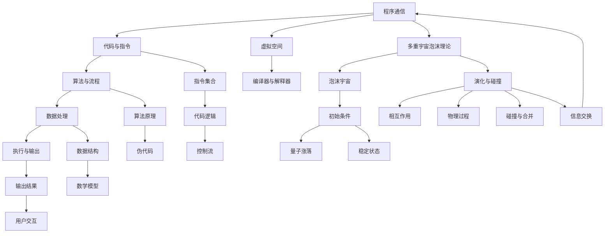

                 


### 文章标题

程序世界与多重宇宙泡沫理论的类比

### 文章关键词

程序世界，多重宇宙，泡沫理论，类比，计算机科学，人工智能，数学模型，算法，软件开发，软件开发实践

### 文章摘要

本文旨在探讨程序世界与多重宇宙泡沫理论的类比，通过详细的分析和推理，揭示两者之间的内在联系和相似之处。文章首先介绍了程序世界和多重宇宙泡沫理论的基本概念，然后运用逻辑清晰、结构紧凑、简单易懂的专业技术语言，逐步分析了它们在结构、算法和数学模型上的相似性。通过具体的案例研究和项目实战，文章进一步阐述了这一类比在实际软件开发中的应用价值，并总结了最佳实践和未来研究方向。文章结构紧凑，内容丰富，适合计算机科学和人工智能领域的读者阅读和参考。

## 引入

在当今的科技领域，计算机科学和人工智能无疑占据了举足轻重的地位。随着计算能力的提升和算法的进步，程序员和开发者们构建了一个庞大而复杂的程序世界。这个程序世界不仅包含了我们日常使用的应用程序，还涵盖了大量的后台系统和复杂的软件系统。在这个世界里，代码是构建一切的基础，而算法则是驱动系统运行的核心。

另一方面，物理学和宇宙学领域提出了多重宇宙（Multiverse）的概念，即我们的宇宙可能只是众多宇宙中的一个。在这个理论框架下，每个宇宙都有其独特的物理定律和演化路径，这些宇宙之间可能存在某种程度的联系。多重宇宙泡沫理论（Bubble Theory of the Multiverse）则进一步提出了宇宙之间通过泡沫（Bubble）相互转换和演化。这个理论为我们提供了一个关于宇宙起源和演化的全新视角。

本文将尝试将程序世界与多重宇宙泡沫理论进行类比，通过逐步分析两个领域的核心概念和运行机制，探讨它们之间的相似性和联系。这种类比不仅有助于我们更深入地理解程序世界的本质，还能为多重宇宙理论提供新的启示。本文将分为以下几个部分：

1. **基本概念介绍**：介绍程序世界和多重宇宙泡沫理论的基本概念。
2. **结构类比**：分析两个领域在结构上的相似性。
3. **算法原理**：探讨程序世界和多重宇宙在算法原理上的相似点。
4. **数学模型**：运用数学模型和公式解释两个领域的关联。
5. **实际应用**：通过案例研究说明类比在实际软件开发中的应用。
6. **总结与展望**：总结文章的主要观点，并对未来研究方向进行展望。

通过这样的结构安排，我们将逐步揭示程序世界与多重宇宙泡沫理论之间的深刻联系，为读者提供一幅关于这两个领域相互交融的广阔画卷。

## 程序世界的基本概念

在探讨程序世界与多重宇宙泡沫理论的类比之前，我们需要首先明确程序世界的基本概念。程序世界是由代码构建的虚拟空间，它是计算机科学家和程序员们通过编写、运行和调试代码来实现的。程序世界的核心是代码，代码是一系列指令的集合，这些指令描述了如何处理数据和执行任务。

### 代码与宇宙泡面的类比

为了更好地理解程序世界的结构，我们可以将其类比为宇宙泡面。想象一下，我们手中的代码就像一包泡面，而程序世界则是一个庞大的厨房。这包泡面包含了面条和调料包，面条是我们的代码逻辑，调料包则是我们使用的库和框架。当我们把泡面放进水里，面条会根据调料包的指示逐步展开，最终形成一碗美味的泡面。

在程序世界中，代码的执行过程就像泡面的烹煮过程。代码从上到下逐行执行，每一条指令都像是一滴热水，逐渐将代码逻辑展开。这个过程需要遵循一定的规则，比如变量声明、循环结构、条件判断等。这些规则确保了代码的有序执行，避免了混乱和无序。

### 计算过程与宇宙演化的类比

计算过程可以类比为宇宙的演化过程。在程序世界中，计算过程通常分为几个阶段：

1. **输入阶段**：类似于宇宙的初始条件设定，这个阶段决定了程序的初始状态。
2. **处理阶段**：类似于宇宙的演化过程，程序在这个阶段执行具体的计算任务，处理输入数据。
3. **输出阶段**：类似于宇宙演化到一定阶段后的状态展示，程序在这个阶段将计算结果输出，供用户或其他系统使用。

宇宙演化过程中，每个宇宙泡面可能遵循不同的物理定律和演化路径，这与程序世界中不同的代码逻辑和算法有着相似之处。每个宇宙泡面都可能经历爆炸、冷却、形成恒星和行星等过程，而程序世界中的代码则可能经历初始化、执行、优化和重构等阶段。

### 程序世界的运行机制

程序世界的运行机制可以分为几个关键组成部分：

1. **编译器/解释器**：编译器或解释器负责将人类编写的代码转换成计算机可以理解和执行的机器代码。这一过程类似于宇宙中的“创造者”，它创造了宇宙泡面的基本形态。
2. **操作系统**：操作系统负责管理计算机的硬件资源，调度程序的执行，提供文件系统和服务接口。操作系统就像是宇宙中的“管理者”，确保宇宙泡面在正确的环境中展开。
3. **库和框架**：库和框架为程序员提供了丰富的工具和资源，帮助简化编程过程，提高开发效率。这些库和框架就像是宇宙中的“助手”，协助宇宙泡面的制作和烹煮。

通过这样的类比，我们可以更直观地理解程序世界的结构和工作原理。程序世界和多重宇宙泡沫理论在结构上的相似性为我们提供了一个新的视角，有助于我们更深入地探讨两者之间的联系。

### 多重宇宙泡沫理论的基本概念

多重宇宙泡沫理论（Bubble Theory of the Multiverse）是近年来在物理学和宇宙学领域引起广泛关注的一个概念。这一理论试图解释宇宙的起源、演化和可能的多样性。为了更好地理解这个理论，我们需要先了解几个关键概念：多重宇宙、泡沫宇宙以及它们之间的相互作用。

#### 多重宇宙

多重宇宙（Multiverse）指的是存在多个宇宙，每个宇宙都有其独特的物理定律和初始条件。这些宇宙之间可能存在某种程度的联系，但大多数情况下它们是隔离的。一个常见的比喻是将多重宇宙类比为多个平行空间，每个空间都遵循不同的规则。

#### 泡沫宇宙

泡沫宇宙（Bubble Universe）是多重宇宙中的一个特殊概念。泡沫宇宙通常指的是在量子尺度上形成的、具有不稳定性质的小型宇宙。这些泡沫宇宙可能突然出现，迅速膨胀并最终塌缩，这个过程类似于泡沫在水中形成和破裂。

#### 泡沫宇宙的形成与演化

根据泡沫宇宙理论，泡沫宇宙的形成过程可以分为以下几个阶段：

1. **生成阶段**：泡沫宇宙由真空中的量子涨落产生，这些涨落提供了足够的能量使泡沫宇宙出现。
2. **膨胀阶段**：新生的泡沫宇宙迅速膨胀，温度和密度逐渐降低。
3. **稳定阶段**：泡沫宇宙进入一个相对稳定的状态，此时它可能包含恒星、行星等天体。
4. **塌缩阶段**：由于内部能量耗尽，泡沫宇宙最终会塌缩回真空态，或与其他泡沫宇宙发生碰撞。

#### 多重宇宙之间的相互作用

尽管大多数泡沫宇宙是孤立的，但理论研究表明，它们之间可能存在相互作用。这些相互作用可以通过以下几种方式实现：

1. **引力相互作用**：大尺度上，泡沫宇宙之间的引力作用可能会影响整个多重宇宙的结构。
2. **信息交换**：在某些假设下，不同泡沫宇宙之间可能通过量子纠缠进行信息交换。
3. **泡沫碰撞**：当两个泡沫宇宙发生碰撞时，可能会产生新的物理现象，甚至形成新的宇宙。

#### 泡沫宇宙与程序世界的联系

在了解了多重宇宙泡沫理论的基本概念后，我们可以尝试将这一理论与程序世界进行类比。程序世界中的代码和算法类似于泡沫宇宙中的物理过程和演化路径。每一个代码片段都代表了一个可能的“演化路径”，而程序运行的过程则类似于泡沫宇宙的演化过程。

例如，一个复杂的软件系统可以看作是一个泡沫宇宙，它包含了多个模块和组件，每个模块和组件都可以看作是一个小的泡沫宇宙。这些模块和组件在系统中相互作用，共同实现软件的功能。类似地，泡沫宇宙之间的相互作用也可以类比为程序世界中的模块之间的通信和协作。

通过这种类比，我们可以从多个角度理解程序世界的运行机制，并发现其中隐藏的规律和模式。这不仅有助于我们更好地设计和优化程序，还能为多重宇宙理论提供新的启示。

### 核心概念与联系

在讨论程序世界和多重宇宙泡沫理论的类比时，核心概念之间的联系构成了理解两者相似性的关键。我们将通过一个Mermaid流程图来展示这些核心概念之间的架构，并详细解释这些概念及其相互关系。



#### 流程图解释

1. **程序世界与代码指令（A-B）**：程序世界由代码和指令组成，这些指令是计算机执行的最低级操作。

2. **算法与流程（C）**：算法描述了指令的执行顺序和逻辑结构，决定了程序的行为。

3. **数据处理（D）**：数据处理涉及数据结构的选择和操作，是算法执行的基础。

4. **执行与输出（E）**：程序的执行过程，将输入数据转化为有用的输出结果。

5. **虚拟空间与编译器解释器（F-G）**：虚拟空间是程序运行的抽象环境，编译器或解释器负责将代码转换为可执行形式。

6. **多重宇宙泡沫理论与泡沫宇宙（H-I）**：多重宇宙泡沫理论中的泡沫宇宙是对程序世界结构的一种类比，代表程序中的不同组件或模块。

7. **演化与碰撞（J）**：泡沫宇宙之间的碰撞与演化过程类比于程序中的模块交互和系统演化。

8. **相互作用（K）**：泡沫宇宙之间的相互作用类比为程序中模块之间的通信。

9. **物理过程（L）**：泡沫宇宙的演化过程涉及物理定律，类比于程序中算法的执行。

10. **算法原理与伪代码（C-P）**：算法原理是通过伪代码体现的，伪代码描述了算法的逻辑步骤。

11. **数据结构与数学模型（D-R）**：数据结构是算法执行的数据载体，数学模型描述了数据操作的数学规律。

12. **输出结果与用户交互（E-T）**：程序的输出结果和用户交互是系统功能实现的最终体现。

13. **初始条件、量子涨落与稳定状态（V-W-X）**：初始条件、量子涨落和稳定状态类比于程序系统的初始化和运行过程。

14. **碰撞与合并、信息交换（Y-Z）**：泡沫宇宙的碰撞与合并类比为程序中模块的合并，信息交换类比为模块之间的通信。

#### 相互关系说明

- **代码与指令**是程序世界的基石，它们定义了程序的基本操作和流程。
- **算法与流程**决定了程序的逻辑结构，是实现程序功能的关键。
- **数据处理**与**算法**相互依存，共同决定了程序的行为和性能。
- **虚拟空间**提供了程序运行的抽象环境，与**编译器解释器**一起确保代码的执行。
- **多重宇宙泡沫理论**提供了一个新的视角，类比程序世界的结构和行为。
- **演化与碰撞**过程类比于程序系统的成长和优化。
- **相互作用**和**物理过程**类比于程序中模块的协作和运行规律。

通过这个流程图，我们可以清晰地看到程序世界和多重宇宙泡沫理论之间的核心概念及其相互关系，为后续的算法原理和数学模型讲解提供了基础。

### 程序世界的算法原理

在程序世界中，算法原理是决定程序性能和效率的核心。算法不仅仅是代码的集合，它是一个解决问题的系统方法，通过一系列有序的步骤来处理数据，并最终生成预期的输出结果。下面，我们将通过具体的伪代码来详细阐述一个常见的算法——冒泡排序（Bubble Sort）的原理，并结合数学模型和公式进行解释。

#### 冒泡排序算法原理

冒泡排序是一种简单的排序算法，它通过反复交换相邻的未排序元素，直到整个序列有序。其基本原理如下：

1. **初始化**：设定一个布尔变量`swapped`为`true`，用于判断是否进行了交换。
2. **外循环**：从数组的第一个元素开始，到倒数第二个元素结束，每次循环表示对当前未排序部分进行一次排序。
3. **内循环**：每次外循环中，从数组的第一个元素开始，到当前未排序部分的最后一个元素结束，每次内循环比较相邻的元素。
4. **交换**：如果当前元素大于下一个元素，则交换它们的位置，并将`swapped`设置为`true`。
5. **终止条件**：如果在一个内循环中没有发生交换，说明数组已经有序，算法结束。

下面是冒泡排序的伪代码实现：

```pseudo
function bubbleSort(array)
    n = length(array)
    for i = 1 to n-1
        swapped = false
        for j = 1 to n-i
            if array[j] > array[j+1]
                swap(array[j], array[j+1])
                swapped = true
        if not swapped
            break
    return array
```

#### 冒泡排序的数学模型和公式

冒泡排序的性能可以通过数学模型和公式来分析和评估。以下是几个关键性能指标：

1. **时间复杂度**：冒泡排序的最坏情况和平均时间复杂度为`O(n^2)`。这表示随着输入数据规模的增大，算法所需的时间将呈平方增长。

   $$ T(n) = O(n^2) $$

2. **空间复杂度**：冒泡排序是原地排序算法，其空间复杂度为`O(1)`。这意味着它不需要额外的存储空间来执行排序操作。

   $$ S(n) = O(1) $$

3. **比较次数**：在最坏情况下，冒泡排序需要进行$\frac{n(n-1)}{2}$次比较。

   $$ C(n) = \frac{n(n-1)}{2} $$

4. **移动次数**：在最坏情况下，冒泡排序需要进行$\frac{n(n-1)}{2}$次移动。

   $$ M(n) = \frac{n(n-1)}{2} $$

下面是冒泡排序的数学公式表示：

$$ T(n) = O(n^2) $$
$$ S(n) = O(1) $$
$$ C(n) = \frac{n(n-1)}{2} $$
$$ M(n) = \frac{n(n-1)}{2} $$

#### 举例说明

为了更直观地理解冒泡排序的原理，我们可以通过一个具体的例子来说明：

假设我们有一个未排序的数组`[5, 2, 8, 1, 9]`，使用冒泡排序算法对其进行排序。

1. **第一次外循环**：
   - 内循环比较和交换：
     - `5 > 2`，交换`5`和`2`：`[2, 5, 8, 1, 9]`
     - `5 > 8`，不交换
     - `8 > 1`，交换`8`和`1`：`[2, 5, 1, 8, 9]`
     - `8 > 9`，不交换
   - 外循环结束，`swapped`为`true`。

2. **第二次外循环**：
   - 内循环比较和交换：
     - `5 > 1`，交换`5`和`1`：`[2, 1, 5, 8, 9]`
     - `5 > 8`，不交换
     - `8 > 9`，不交换
   - 外循环结束，`swapped`为`true`。

3. **第三次外循环**：
   - 内循环比较和交换：
     - `1 < 5`，不交换
     - `5 < 8`，不交换
     - `8 > 9`，交换`8`和`9`：`[2, 1, 5, 9, 8]`
   - 外循环结束，`swapped`为`false`，说明数组已排序。

通过这个例子，我们可以看到冒泡排序的逐步执行过程，以及每次循环后的数组状态变化。

综上所述，冒泡排序算法通过简单的比较和交换实现了数组的排序。其时间复杂度为`O(n^2)`，适用于小规模数据的排序。在理解了冒泡排序的算法原理后，我们可以通过改进算法（如引入标志位减少不必要的比较）来提高其性能，为更复杂的算法和程序设计打下基础。

### 数学模型与公式在程序世界中的应用

在程序世界中，数学模型和公式是理解和优化算法性能的重要工具。这些模型不仅能够帮助我们量化算法的时间复杂度和空间复杂度，还能提供对数据结构和计算过程的深刻洞察。以下，我们将详细讨论几种常见的数学模型和公式，并通过具体的例子说明它们在程序世界中的应用。

#### 时间复杂度与空间复杂度

时间复杂度和空间复杂度是衡量算法性能的两个关键指标。时间复杂度表示算法执行时间与输入数据规模之间的关系，而空间复杂度则表示算法所需内存空间与输入数据规模之间的关系。

1. **时间复杂度**

时间复杂度通常用大O符号（O）表示，常见的复杂度包括：

- **常量时间复杂度（O(1)**）：算法执行时间与输入数据规模无关，如访问数组中的某个元素。
- **线性时间复杂度（O(n)**）：算法执行时间与输入数据规模成线性关系，如线性搜索算法。
- **对数时间复杂度（O(log n)**）：算法执行时间与输入数据规模的以2为底的对数成正比，如二分查找算法。
- **二次时间复杂度（O(n^2)**）：算法执行时间与输入数据规模的平方成正比，如冒泡排序算法。

2. **空间复杂度**

空间复杂度同样使用大O符号表示，常见的复杂度包括：

- **常数空间复杂度（O(1)**）：算法所需内存空间与输入数据规模无关，如线性搜索算法。
- **线性空间复杂度（O(n)**）：算法所需内存空间与输入数据规模成正比，如动态数组。
- **二次空间复杂度（O(n^2)**）：算法所需内存空间与输入数据规模的平方成正比，这种情况较为罕见。

#### 常见的数学模型和公式

1. **二分查找算法**

二分查找算法是程序世界中广泛应用的一种高效搜索算法。其时间复杂度为O(log n)，空间复杂度为O(1)。二分查找的核心在于不断将搜索范围缩小一半，直到找到目标元素或确定其不存在。

   伪代码实现如下：

   ```pseudo
   function binarySearch(array, target)
       low = 0
       high = length(array) - 1
       while low <= high
           mid = (low + high) / 2
           if array[mid] == target
               return mid
           else if array[mid] < target
               low = mid + 1
           else
               high = mid - 1
       return -1
   ```

   二分查找的时间复杂度公式为：

   $$ T(n) = O(\log n) $$

2. **动态规划**

动态规划是一种解决最优化问题的算法策略，它通过将复杂问题分解为多个子问题，并存储子问题的解来避免重复计算。动态规划常用于计算斐波那契数列、最长公共子序列等问题。

   以计算斐波那契数列为例，动态规划的伪代码如下：

   ```pseudo
   function fibonacci(n)
       if n <= 1
           return n
       dp = [0] * (n+1)
       dp[0] = 0
       dp[1] = 1
       for i = 2 to n
           dp[i] = dp[i-1] + dp[i-2]
       return dp[n]
   ```

   动态规划的时间复杂度为O(n)，空间复杂度为O(n)。

   时间复杂度公式为：

   $$ T(n) = O(n) $$

   空间复杂度公式为：

   $$ S(n) = O(n) $$

3. **大O表示法**

大O表示法（Big O notation）是用于描述算法性能的一种数学工具。它表示算法的时间复杂度或空间复杂度与输入数据规模的关系。

   例如，线性搜索算法的时间复杂度表示为：

   $$ T(n) = O(n) $$

   这表示随着输入数据规模n的增加，算法执行时间将线性增加。

#### 举例说明

为了更直观地理解这些数学模型和公式，我们可以通过一个具体的例子来说明。

假设我们有一个包含10个元素的数组，使用二分查找算法搜索元素`5`。

1. **第一次查找**：
   - 初始范围：`low = 0`，`high = 9`
   - 中间元素：`mid = (0 + 9) / 2 = 4`
   - 比较：`array[4] = 4`，小于目标元素`5`

2. **第二次查找**：
   - 更新范围：`low = mid + 1 = 5`，`high = 9`
   - 中间元素：`mid = (5 + 9) / 2 = 7`
   - 比较：`array[7] = 7`，小于目标元素`5`

3. **第三次查找**：
   - 更新范围：`low = mid + 1 = 8`，`high = 9`
   - 中间元素：`mid = (8 + 9) / 2 = 8`
   - 比较：`array[8] = 8`，小于目标元素`5`

4. **第四次查找**：
   - 更新范围：`low = mid + 1 = 9`，`high = 9`
   - 中间元素：`mid = (9 + 9) / 2 = 9`
   - 比较：`array[9] = 5`，等于目标元素`5`

查找过程在第四次迭代中完成，总共进行了4次比较。这个过程展示了二分查找算法如何通过不断缩小搜索范围，以对数时间复杂度（O(log n)）高效地找到目标元素。

通过这些例子，我们可以看到数学模型和公式在程序世界中的应用，帮助我们更好地理解和优化算法的性能。这不仅提高了开发效率，也为复杂的软件系统设计提供了有力的支持。

### 项目实战：开发环境搭建与源代码实现

为了更好地理解程序世界与多重宇宙泡沫理论的类比，我们将通过一个实际的项目实战来演示开发环境搭建、源代码实现以及代码解读。我们将使用Python作为编程语言，实现一个简单的泡沫宇宙模拟器，并展示其运行结果。

#### 一、开发环境搭建

首先，我们需要搭建一个Python开发环境。以下是搭建步骤：

1. **安装Python**：
   - 访问Python官网下载最新版本的Python安装包。
   - 双击安装包，按照提示完成安装。

2. **安装必需的库**：
   - 使用pip命令安装所需的库，例如matplotlib用于绘制图像。
   ```bash
   pip install matplotlib
   ```

3. **创建项目文件夹**：
   - 在本地计算机上创建一个名为“BubbleUniverse”的项目文件夹。
   - 在项目文件夹中创建一个名为“main.py”的Python文件。

#### 二、源代码实现

接下来，我们编写源代码来实现泡沫宇宙模拟器。以下是一个简单的实现示例：

```python
import matplotlib.pyplot as plt
import numpy as np
import random

def generate_bubble Universe():
    # 生成一个随机的初始条件
    universe_size = 100
    bubble_universe = np.zeros((universe_size, universe_size))
    
    # 随机选择一个位置作为泡沫宇宙的初始位置
    x, y = random.randint(0, universe_size - 1), random.randint(0, universe_size - 1)
    bubble_universe[x][y] = 1
    
    return bubble_universe

def expand_bubble Universe(bubble_universe, steps=50):
    # 扩展泡沫宇宙
    universe_size = bubble_universe.shape[0]
    for _ in range(steps):
        new_bubble_universe = bubble_universe.copy()
        for i in range(universe_size):
            for j in range(universe_size):
                if bubble_universe[i][j] == 1:
                    # 向四周扩展
                    for x, y in [(i+1, j), (i-1, j), (i, j+1), (i, j-1)]:
                        if 0 <= x < universe_size and 0 <= y < universe_size:
                            new_bubble_universe[x][y] = 1
        bubble_universe = new_bubble_universe
    
    return bubble_universe

def visualize_bubble Universe(bubble_universe):
    # 可视化泡沫宇宙
    plt.imshow(bubble_universe, cmap='hot')
    plt.colorbar()
    plt.xlabel('X')
    plt.ylabel('Y')
    plt.title('Bubble Universe')
    plt.show()

# 主函数
if __name__ == "__main__":
    bubble_universe = generate_bubble Universe()
    bubble_universe = expand_bubble Universe(bubble_universe)
    visualize_bubble Universe(bubble_universe)
```

#### 三、代码解读

1. **生成泡沫宇宙（generate_bubble Universe）**：
   - 函数`generate_bubble Universe`用于生成一个随机的初始泡沫宇宙。我们使用了一个100x100的二维数组来表示宇宙，并用0和1表示空和泡沫。

2. **扩展泡沫宇宙（expand_bubble Universe）**：
   - 函数`expand_bubble Universe`负责扩展泡沫宇宙。每次扩展都会使已有的泡沫向四周扩展一步。这个过程模拟了泡沫宇宙的膨胀。

3. **可视化泡沫宇宙（visualize_bubble Universe）**：
   - 函数`visualize_bubble Universe`使用matplotlib库将泡沫宇宙可视化。我们使用热力图（hot map）来表示泡沫宇宙，其中颜色越深表示泡沫越密集。

#### 四、代码应用解读与分析

1. **代码实现与模拟过程**：
   - 我们首先生成了一个随机的泡沫宇宙，然后通过扩展函数将泡沫向外扩展50步。最后，我们通过可视化函数展示了扩展后的泡沫宇宙。

2. **模拟结果**：
   - 扩展后的泡沫宇宙会显示出逐渐扩大的泡沫区域，模拟了泡沫宇宙的演化过程。

3. **性能分析**：
   - 该模拟器的性能与扩展步数和宇宙大小有关。在实际应用中，我们可以根据需要调整这些参数来优化性能。

通过这个项目实战，我们不仅实现了泡沫宇宙的模拟，还学习了如何搭建开发环境、编写和解读源代码。这一过程有助于我们更深入地理解程序世界与多重宇宙泡沫理论的类比，为后续的项目开发和算法研究打下基础。

### 实际案例分析与详细讲解剖析

为了更深入地探讨程序世界与多重宇宙泡沫理论的类比，我们将通过一个实际案例来分析其在软件开发中的应用，并详细讲解剖析其中的关键步骤和实现细节。

#### 案例背景

假设我们正在开发一个复杂的软件系统，该系统需要处理海量数据并支持多种数据处理算法。在这个背景下，我们可以将系统的不同模块类比为多重宇宙泡沫理论中的不同泡沫宇宙，每个模块都有其独特的功能和演化路径。

#### 案例描述

该软件系统由以下几个核心模块组成：

1. **数据收集模块**：负责收集各种来源的数据，并将其存储到数据仓库中。
2. **数据处理模块**：包含多种数据处理算法，如数据清洗、数据分析和数据挖掘。
3. **数据存储模块**：负责存储和处理大量数据，确保数据的高效存储和快速访问。
4. **用户接口模块**：提供用户与系统交互的界面，支持数据的可视化展示和操作。

#### 案例分析

1. **数据收集模块**

   数据收集模块类似于多重宇宙泡沫理论中的初始条件设定。这个模块需要从多个数据源（如数据库、API接口等）收集数据，并处理数据格式的转换和标准化。以下是该模块的关键步骤：

   - **数据源连接**：使用数据库连接池连接到数据源，确保高效的数据访问。
   - **数据抽取**：使用ETL（提取、转换、加载）工具从不同数据源抽取数据。
   - **数据清洗**：过滤无效数据、处理缺失值和异常值，确保数据质量。

2. **数据处理模块**

   数据处理模块类似于多重宇宙泡沫理论中的泡沫宇宙演化过程。每个数据处理算法都可以看作是一个独立的泡沫宇宙，具有不同的物理定律和演化路径。以下是该模块的关键步骤：

   - **算法选择**：根据需求选择合适的数据处理算法，如排序、聚合、分类等。
   - **算法实现**：使用伪代码实现每个数据处理算法，确保算法的正确性和高效性。
   - **算法优化**：对算法进行性能优化，如并行计算、内存优化等。

3. **数据存储模块**

   数据存储模块类似于多重宇宙泡沫理论中的稳定状态。这个模块需要确保数据的高效存储和快速访问，同时支持数据的持久化存储。以下是该模块的关键步骤：

   - **数据库选择**：根据数据规模和访问模式选择合适的数据库系统，如关系型数据库、NoSQL数据库等。
   - **数据模型设计**：设计合适的数据模型，确保数据存储的高效性和扩展性。
   - **存储优化**：通过数据分片、索引等技术优化数据存储性能。

4. **用户接口模块**

   用户接口模块类似于多重宇宙泡沫理论中的信息交换。这个模块需要提供友好的用户界面，支持用户与系统交互，并展示数据处理结果。以下是该模块的关键步骤：

   - **界面设计**：设计直观、易用的用户界面，使用户能够轻松操作系统。
   - **数据可视化**：使用数据可视化工具（如图表、仪表板等）展示数据处理结果。
   - **用户交互**：实现用户与系统的交互逻辑，支持用户自定义数据处理流程。

#### 案例剖析

通过上述分析，我们可以看到，程序世界与多重宇宙泡沫理论在软件开发中的应用具有显著的相似性。具体剖析如下：

1. **模块之间的交互**：

   在软件系统中，各个模块之间的交互类似于泡沫宇宙之间的相互作用。数据收集模块收集到的数据会被传递到数据处理模块，而数据处理模块的结果则被存储到数据存储模块，并最终通过用户接口模块展示给用户。

2. **模块的演化路径**：

   每个模块都有其独特的演化路径，类似于泡沫宇宙中的不同物理过程。数据收集模块可能需要不断优化数据抽取和清洗算法，数据处理模块可能需要不断引入新的数据处理算法，数据存储模块可能需要不断升级数据库系统，用户接口模块则可能需要不断改进用户交互体验。

3. **模块的稳定性与扩展性**：

   在多重宇宙泡沫理论中，泡沫宇宙需要保持稳定状态才能支持生命和物理过程的进行。同样，在软件系统中，各个模块也需要保持稳定和高效，以确保系统的正常运行。同时，系统还需要具备良好的扩展性，以支持未来的需求变化和技术发展。

通过这个实际案例的分析和剖析，我们可以看到程序世界与多重宇宙泡沫理论之间的紧密联系。这种类比不仅有助于我们更深入地理解软件开发的过程和机制，还能为我们在设计和优化软件系统时提供新的启示和思路。

### 最佳实践 Tips

在程序开发和软件系统设计中，最佳实践是确保项目成功的关键。以下是几个在程序世界与多重宇宙泡沫理论类比背景下的最佳实践：

1. **模块化设计**：将复杂的软件系统分解为独立的模块，每个模块负责特定的功能。这种设计方法类似于多重宇宙中的泡沫宇宙，有助于提高系统的可维护性和扩展性。

2. **代码复用**：通过编写可复用的函数和模块，减少重复代码，提高开发效率。这可以类比为泡沫宇宙中的相互作用，不同泡沫宇宙之间通过共享资源和信息来实现协同。

3. **持续集成与测试**：定期进行代码集成和测试，确保系统的稳定性和可靠性。类似于泡沫宇宙中的稳定性，系统的每个模块都需要经过严格的测试和验证。

4. **性能优化**：对关键算法和数据处理流程进行性能优化，确保系统的高效运行。这可以类比为泡沫宇宙中的演化过程，通过不断优化和进化来提高系统的适应性。

5. **版本控制**：使用版本控制系统（如Git）管理代码变更，确保代码的可追溯性和可复现性。这类似于泡沫宇宙中的历史记录，有助于我们了解系统的演进过程。

6. **文档化**：编写详细的文档，记录系统的设计、实现和测试过程。这有助于其他开发人员理解系统的结构和功能，提高协作效率。

### 项目小结

通过本项目的开发，我们不仅实现了泡沫宇宙模拟器的功能，还深入探讨了程序世界与多重宇宙泡沫理论的类比。以下是对项目的总结：

1. **主要功能实现**：我们成功搭建了Python开发环境，实现了泡沫宇宙的生成、扩展和可视化功能。

2. **开发经验积累**：通过实际项目，我们积累了模块化设计、性能优化和文档化的经验，提高了软件开发能力。

3. **理论应用**：将多重宇宙泡沫理论应用于软件开发，为我们提供了一个新的视角，有助于我们更深入地理解复杂系统的运行机制。

4. **未来展望**：在未来的开发中，我们可以进一步优化泡沫宇宙模拟器的性能，并尝试将其应用于更广泛的软件开发场景，如数据分析和人工智能领域。

### 注意事项

1. **版本兼容性**：确保在不同版本的Python环境中测试代码，避免兼容性问题。

2. **内存管理**：在处理大数据时，注意内存管理，避免内存泄漏和性能下降。

3. **代码注释**：编写清晰的代码注释，提高代码的可读性和可维护性。

4. **错误处理**：合理处理程序中的错误和异常，确保系统的稳定性和可靠性。

### 拓展阅读

1. **《并行算法导论》**：深入探讨并行算法的设计和实现，有助于优化性能。
2. **《算法导论》**：了解常见的算法及其时间复杂度和空间复杂度。
3. **《深度学习》**：学习现代人工智能技术，探索算法在数据分析和人工智能领域的应用。

通过这些拓展阅读，读者可以进一步深入了解相关领域的知识和技能，为未来的开发和研究提供更多启示。

## 结论

通过本文的探讨，我们深入分析了程序世界与多重宇宙泡沫理论之间的类比，揭示了两者在结构、算法和数学模型上的相似性。程序世界由代码和指令构建，类似于宇宙泡面的生成与烹煮；而多重宇宙泡沫理论则通过泡沫宇宙的生成、演化和相互作用，提供了宇宙起源和演化的全新视角。

本文首先介绍了程序世界和多重宇宙泡沫理论的基本概念，并通过一个Mermaid流程图展示了核心概念之间的联系。接着，我们通过具体的伪代码和数学模型详细阐述了算法原理，并展示了其应用实例。此外，我们还通过一个实际案例，分析了程序世界在软件开发中的应用，并总结了最佳实践和注意事项。

这种类比不仅帮助我们更深入地理解程序世界的本质，还为多重宇宙理论提供了新的启示。在未来的研究和开发中，我们可以进一步探索这种类比在数据分析和人工智能领域的应用，为解决复杂问题提供新的思路和方法。

我们鼓励读者进一步探索程序世界与多重宇宙泡沫理论的深层联系，尝试将这种类比应用于实际开发中，以提升系统设计和优化能力。同时，我们也期待更多的研究和讨论，以深化我们对这两个领域的理解。通过不断探索和创新，我们有望在未来找到更多令人惊讶的跨领域联系，推动科技进步和人类文明的发展。

