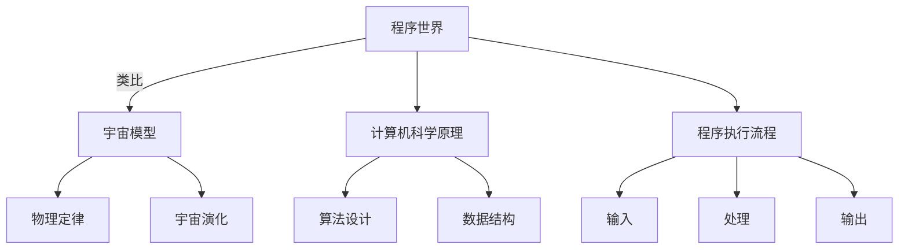

                 

# 程序世界与多重连通宇宙模型的类比

## 关键词
- 程序世界
- 多重连通宇宙模型
- 类比方法
- 信息传递
- 复杂性
- 演化

## 摘要
本文通过深入分析程序世界的本质及其与多重连通宇宙模型之间的相似性，探讨了两者之间的类比关系。从程序的基本组成和执行原理出发，逐步引申到宇宙模型的基础概念和结构，进而揭示程序世界与宇宙模型在信息传递、稳定性及复杂性等方面的共通之处。通过这一类比，我们不仅能更深入地理解程序世界的运作机制，还能为宇宙学提供新的研究思路和方法。文章最后，探讨了这一类比对程序设计和科学研究的潜在应用及其对未来技术发展的意义。

## 第1章 引言

### 1.1 程序世界的本质

程序世界，是一个由指令和数据构成的虚拟宇宙。在这个宇宙中，计算机作为这个世界的“公民”，通过执行预先编写的指令来处理信息，解决问题。计算机程序的基本组成包括指令、数据、算法和数据结构等要素。指令是程序的核心，它指示计算机执行特定的操作；数据则是程序的操作对象，包括输入数据和处理结果；算法是解决问题的方法，通过特定的步骤和策略来解决问题；数据结构则是组织和管理数据的方式，以提高程序的效率。

程序世界的运作原理可以概括为：输入 -> 处理 -> 输出。这个过程涉及到数据在计算机中的存储和传输。计算机的存储系统，如内存和硬盘，负责数据的临时存储和持久保存。数据传输则依赖于计算机的硬件设施，如CPU、内存总线等。操作系统作为计算机的“管理者”，负责协调各个程序之间的资源分配和任务调度，确保计算机的高效运行。

### 1.2 宇宙模型的概述

宇宙模型是对宇宙结构的科学描述，旨在解释宇宙的起源、演化和最终命运。目前，宇宙学中最广泛接受的模型是基于广义相对论和量子力学的多重连通宇宙模型。这个模型认为，宇宙是由多个连通的空间区域组成的，每个区域都有其独特的物理属性和历史。这些空间区域可以通过虫洞或黑洞等奇点相互连接，形成一个复杂的、动态演化的宇宙网络。

宇宙模型的基础概念包括物理定律、基本粒子和宇宙维度等。物理定律，如万有引力定律和电磁力定律，描述了宇宙中物体之间的相互作用；基本粒子，如电子、夸克等，是构成物质的基本单位；宇宙维度，包括三维空间和时间，构成了我们所理解的宇宙。多重连通宇宙模型提出，宇宙不仅是三维的，还存在额外的空间维度，这些维度可能隐藏在我们的感知之外。

### 1.3 类比的目的与方法

将程序世界与多重连通宇宙模型进行类比，旨在通过计算机科学的角度来理解和解释宇宙的复杂结构。这种类比不仅有助于我们更深入地理解程序世界的运作机制，还能为宇宙学提供新的研究思路和方法。

类比的方法包括：

1. **概念映射**：将程序世界的核心概念，如指令、数据、算法等，映射到宇宙模型中的对应概念，如物理定律、基本粒子等。
2. **流程对比**：通过对比程序从输入到输出的处理流程与宇宙的演化过程，揭示两者在信息传递和处理方面的相似性。
3. **模型构建**：利用计算机科学的方法，如算法设计和数据结构分析，构建宇宙模型中的信息处理和演化模型。
4. **数学工具**：使用数学模型和公式来描述程序世界与宇宙模型之间的关系，如数据结构中的树状结构可以类比为宇宙中的星系结构。

通过这一系列类比，我们不仅能更深入地理解程序世界的本质，还能为宇宙学提供新的理论框架和研究方法。

## 第2章 程序世界的结构

### 2.1 程序的基本组成

程序的基本组成是理解程序世界的关键。程序由指令和数据组成，每个部分都有其特定的功能和作用。

#### 2.1.1 指令与数据

指令是程序的核心，它指示计算机执行特定的操作。指令通常由操作码（Opcode）和操作数（Operand）组成。操作码定义了指令的操作类型，如加法、减法、数据移动等；操作数则是操作的对象，如具体的数值或内存地址。

数据是程序的操作对象，包括输入数据和处理结果。输入数据可以是用户输入的信息，也可以是程序从外部存储读取的数据。处理结果则是程序对输入数据进行处理后生成的输出数据。

#### 2.1.2 算法与数据结构

算法是解决问题的方法，它通过一系列有序的操作步骤来解决特定的问题。算法的设计与优化是程序开发中的关键，好的算法可以提高程序的效率。

数据结构是组织和管理数据的方式，它决定了数据在程序中的存储和操作方法。常见的数据结构包括数组、链表、树和图等。每种数据结构都有其特定的用途和优缺点，程序开发者需要根据具体问题选择合适的数据结构。

### 2.2 程序执行原理

程序执行原理是理解程序如何从输入到输出的关键。程序在执行过程中，会经过编译、链接和运行等多个阶段。

#### 2.2.1 CPU与内存交互

CPU（中央处理器）是计算机的核心部件，负责执行程序中的指令。CPU与内存的交互是程序执行的关键。CPU通过内存总线从内存中读取指令和数据，然后执行这些指令。内存则负责存储程序在执行过程中需要使用的数据和指令。

#### 2.2.2 操作系统与多任务处理

操作系统是管理计算机硬件资源、提供用户交互接口的程序集合。操作系统负责资源的分配和管理，如CPU时间、内存空间和外部设备等。多任务处理是操作系统的核心功能之一，它允许多个程序同时运行。操作系统通过时间片轮转（Time Slicing）和进程调度（Process Scheduling）等技术，实现多任务处理。

### 2.2.3 程序执行流程

程序执行流程可以概括为以下步骤：

1. **编译阶段**：将源代码编译成机器码，生成可执行文件。
2. **链接阶段**：将多个编译后的文件链接起来，生成完整的可执行文件。
3. **加载阶段**：操作系统将可执行文件加载到内存中，准备执行。
4. **执行阶段**：CPU从内存中读取指令，并执行这些指令。
5. **退出阶段**：程序执行完毕后，操作系统回收内存和其他资源。

通过上述流程，程序能够从输入数据开始，经过处理，最终生成输出数据。这个过程反映了程序世界的基本运作机制。

## 第3章 宇宙模型的构建

### 3.1 宇宙观的基础概念

宇宙观是关于宇宙起源、结构、演化和最终命运的理论体系。在现代物理学中，宇宙观的基础概念主要包括物理定律、基本粒子和宇宙维度等。

#### 3.1.1 物理定律与数学模型

物理定律是描述宇宙中物体运动和相互作用的规律。在宇宙学中，最重要的物理定律包括广义相对论和量子力学。广义相对论描述了引力和宇宙的几何结构，量子力学则描述了微观粒子的行为和相互作用。

数学模型是描述物理定律的工具。在宇宙学中，常用的数学模型包括黎曼几何、弗里德曼方程和黑洞数学模型等。这些模型通过数学公式和方程，将物理定律转化为可计算的形式，为我们提供了理解和预测宇宙行为的工具。

#### 3.1.2 宇宙的多维性与连通性

宇宙的多维性是指宇宙不仅存在于我们能够感知的三维空间中，还存在额外的空间维度。这些额外的维度可能是弯曲的、紧缩的，甚至是我们无法感知的。宇宙的多维性是现代宇宙学的一个重要概念，它为理解宇宙的复杂性和演化提供了新的视角。

连通性是指宇宙的不同部分之间的连接关系。在多重连通宇宙模型中，宇宙的不同部分通过虫洞或黑洞等奇点相互连接，形成一个复杂的、动态演化的宇宙网络。这种连通性不仅改变了我们对宇宙结构的认识，也为研究宇宙的演化提供了新的思路。

### 3.2 宇宙模型的比较

宇宙模型之间的比较有助于我们理解宇宙的多样性和演化过程。在宇宙学中，常见的宇宙模型包括大爆炸模型、稳态模型、黑洞宇宙模型等。

#### 3.2.1 基本粒子与量子力学

基本粒子是构成宇宙的基本单位。在量子力学中，基本粒子包括电子、夸克、中微子等。这些基本粒子通过量子力学的基本原理，如波粒二象性和量子纠缠等，相互作用并形成更复杂的结构。

量子力学是描述微观世界的科学，它揭示了微观粒子在极小尺度上的行为和相互作用。量子力学的数学模型和公式，如薛定谔方程和海森堡不确定性原理，为我们提供了理解和预测微观世界行为的工具。

#### 3.2.2 黑洞与宇宙学

黑洞是宇宙中最神秘和最具有挑战性的对象之一。黑洞是由恒星坍缩形成的，具有极强的引力场，甚至连光都无法逃脱。黑洞的数学模型和公式，如史瓦西解和克尔解，描述了黑洞的物理特性和行为。

宇宙学是研究宇宙起源、结构和演化的科学。宇宙学的数学模型和公式，如弗里德曼方程和霍金辐射，为我们提供了理解和预测宇宙行为的工具。

### 3.2.3 其他宇宙模型

除了大爆炸模型和黑洞宇宙模型外，宇宙学中还存在其他模型，如稳态模型和多宇宙模型。稳态模型认为宇宙是永恒不变的，而多宇宙模型则认为宇宙只是众多宇宙中的一个，每个宇宙都有其独特的物理定律和演化历史。

这些宇宙模型之间的比较和竞争，推动了宇宙学的发展。通过不断的研究和实验，我们可能会找到更准确的宇宙模型，更好地理解宇宙的本质。

## 第4章 类比与解释

### 4.1 类比的基本框架

将程序世界与多重连通宇宙模型进行类比，我们需要构建一个基本的框架来解释两者的相似性。这个框架包括概念映射、流程对比、模型构建和数学工具等几个方面。

#### 4.1.1 程序世界的映射

首先，我们可以将程序世界中的核心概念映射到宇宙模型中。例如：

- **指令**可以映射为**物理定律**，因为它们都是指导“执行”的操作。
- **数据**可以映射为**基本粒子**，因为它们都是信息的基本载体。
- **算法**可以映射为**宇宙演化模型**，因为它们都是描述复杂系统行为的规则。

#### 4.1.2 宇宙模型的映射

同样，我们可以将宇宙模型中的核心概念映射到程序世界。例如：

- **基本粒子**可以映射为**数据结构**，因为它们都是组织和管理信息的基本单元。
- **物理定律**可以映射为**算法**，因为它们都是描述复杂系统行为的规则。
- **宇宙的多维性与连通性**可以映射为**程序中的数据结构和算法设计**，因为它们都涉及到信息的组织和管理。

#### 4.1.3 流程对比

通过对比程序从输入到输出的处理流程与宇宙的演化过程，我们可以发现两者在信息传递和处理方面存在相似性。例如：

- **程序处理输入数据**类似于**宇宙中的物质相互作用**。
- **程序执行指令**类似于**宇宙中的物理定律作用**。
- **程序输出结果**类似于**宇宙中的物理现象**。

#### 4.1.4 模型构建

利用计算机科学的方法，如算法设计和数据结构分析，我们可以构建宇宙模型中的信息处理和演化模型。例如：

- **程序中的算法设计**可以用于模拟**宇宙中的黑洞形成**。
- **数据结构分析**可以用于研究**宇宙中的星系结构**。
- **程序优化**可以用于探索**宇宙中的能量转换**。

#### 4.1.5 数学工具

使用数学模型和公式来描述程序世界与宇宙模型之间的关系，我们可以更深入地理解两者的相似性。例如：

- **程序中的数据结构**可以用**树状结构**来模拟**宇宙中的星系结构**。
- **程序中的算法**可以用**图算法**来模拟**宇宙中的网络结构**。
- **数学公式**如**弗里德曼方程**可以用于描述**程序中的复杂系统行为**。

通过这一系列的类比与解释，我们不仅能够更深入地理解程序世界的本质，还能为宇宙学提供新的研究思路和方法。

### 4.2 程序与宇宙的关系

在理解了程序世界与多重连通宇宙模型的类比之后，我们可以进一步探讨程序与宇宙之间的具体关系。这些关系主要体现在信息传递、稳定性、复杂性等方面。

#### 4.2.1 信息的传递与处理

在程序世界中，信息的传递和处理是通过一系列指令和数据结构来实现的。类似地，在宇宙中，信息的传递和处理是通过物理定律和基本粒子来实现的。例如：

- **程序中的指令**类似于**宇宙中的物理定律**，它们都指导着系统的行为。
- **程序中的数据**类似于**宇宙中的基本粒子**，它们都是信息的基本载体。

信息的处理过程在程序世界中是通过算法来实现的。在宇宙中，信息的处理则通过宇宙演化模型来实现。例如，黑洞的形成和星系的演化都是宇宙信息处理的具体体现。

#### 4.2.2 稳定性与复杂性

程序世界的稳定性和复杂性是通过算法和数据的结构来保证和优化的。类似地，宇宙的稳定性和复杂性也是通过物理定律和宇宙结构的特性来保证和优化的。

- **程序中的算法**可以提高系统的稳定性，例如，排序算法可以确保数据的有序性。
- **宇宙中的物理定律**可以维持宇宙的稳定性，例如，万有引力定律可以保持星系的稳定结构。

程序的复杂性与宇宙的复杂性也有相似之处。程序的复杂性通常与算法的复杂度、数据结构的复杂性和问题的规模有关。宇宙的复杂性则与宇宙结构的多样性、物理定律的复杂性和宇宙演化的历史有关。

#### 4.2.3 稳定性与复杂性之间的关系

在程序世界中，稳定性和复杂性之间存在一定的矛盾。高复杂性的程序往往更难保证稳定性，而低复杂性的程序则可能效率较低。类似地，在宇宙中，宇宙结构的稳定性和复杂性之间也存在类似的矛盾。

- **程序中的平衡算法**可以帮助在高复杂性的情况下维持系统的稳定性。
- **宇宙中的稳定结构**如星系和星系团，是在高复杂性的宇宙演化过程中形成的。

通过理解程序世界与多重连通宇宙模型之间的关系，我们可以更好地把握程序设计和宇宙学中的核心问题。这不仅有助于我们深入理解程序世界的本质，还能为宇宙学提供新的研究思路和方法。

### 4.2.4 稳定性与复杂性在不同领域的应用

稳定性与复杂性在程序设计和宇宙学中有着广泛的应用，以下是一些具体的应用示例：

#### 在程序设计中的应用

- **算法优化**：在程序设计中，为了提高程序的稳定性，常常需要对算法进行优化。例如，在排序算法中，优化后的算法可以在更短的时间内完成排序，从而提高程序的效率。类似的，在宇宙学中，物理定律的优化可以更好地描述宇宙的演化过程。
- **数据结构选择**：在程序设计中，合理选择数据结构可以提高程序的稳定性和效率。例如，在处理大量数据时，选择合适的树状数据结构可以加快查找和排序的速度。在宇宙学中，选择合适的数据结构（如图结构）可以更好地描述宇宙中的星系和网络结构。
- **错误处理**：在程序设计中，为了确保程序的稳定性，需要对可能出现的错误进行预处理和异常处理。类似的，在宇宙学中，为了确保宇宙的稳定性，科学家需要预测和应对可能出现的宇宙灾难，如星系碰撞或宇宙膨胀失控。

#### 在宇宙学中的应用

- **宇宙演化模型**：宇宙演化模型是描述宇宙如何从大爆炸开始，经过数十亿年的演化，直到现在的状态。这些模型包括弗里德曼方程、霍金辐射等，它们通过数学公式和物理定律来描述宇宙的演化过程。类似的，程序中的算法模型也可以通过数学公式和算法步骤来描述程序的执行过程。
- **黑洞研究**：黑洞是宇宙中最神秘和最具有挑战性的对象之一。科学家通过研究黑洞的物理特性和行为，试图了解宇宙的深层结构和演化规律。类似的，在程序设计中，研究复杂的算法和数据处理技术，可以帮助我们更好地理解程序的运行机制和优化方法。
- **宇宙探测**：科学家通过宇宙探测任务，如卫星观测、太空探测器等，收集宇宙中的数据，并利用数据分析技术进行分析。这些技术包括光谱分析、图像处理等，类似于程序设计中的数据处理和分析技术。

通过这些应用示例，我们可以看到稳定性与复杂性在程序设计和宇宙学中的重要性，以及两者之间的相似性和互补性。理解这些关系有助于我们更好地把握程序设计和宇宙学中的核心问题，推动科学技术的发展。

## 第5章 程序世界的演化

### 5.1 编程语言的发展

编程语言是程序世界的基石，它的发展历程反映了程序世界从简单到复杂、从低级到高级的演变过程。编程语言的发展可以分为以下几个阶段：

#### 5.1.1 低级语言与高级语言

- **低级语言**：低级语言是直接与计算机硬件交互的语言，如机器语言和汇编语言。机器语言由二进制代码组成，是计算机能够直接执行的语言。汇编语言则是机器语言的符号表示，使用符号和指令来代替二进制代码。

- **高级语言**：高级语言是一种更加抽象和人类友好的编程语言，它提供了更丰富的语法和语义。高级语言的代表包括C、C++、Java和Python等。高级语言使得程序员能够更加高效地编写代码，同时降低了与硬件交互的复杂度。

#### 5.1.2 编译器与解释器

编译器与解释器是两种不同的程序，用于将高级语言代码转换为机器语言代码。

- **编译器**：编译器将高级语言代码一次性编译成机器语言代码，生成可执行文件。编译器在编译过程中进行语法分析和语义分析，确保代码的正确性，并将高级语言代码转换为高效的机器语言代码。

- **解释器**：解释器逐行读取高级语言代码，并立即执行相应的操作。解释器不需要生成可执行文件，但执行速度相对较慢。现代编程语言如JavaScript和Python通常使用解释器来执行代码。

#### 5.1.3 编程语言的演化

编程语言的演化经历了从低级到高级、从简单到复杂的过程。随着计算机硬件的发展和技术需求的增加，编程语言不断进化，以满足更复杂的编程任务。

- **面向过程编程**：早期编程语言如C和Pascal主要采用面向过程编程范式，强调程序的逻辑结构和执行顺序。

- **面向对象编程**：随着软件开发项目的复杂度增加，面向对象编程范式逐渐兴起。面向对象编程通过将程序分解为对象和类，提高了代码的可复用性和可维护性。Java和C++是面向对象编程的代表。

- **函数式编程**：函数式编程范式强调函数作为编程的基本单位，避免使用变量和状态。函数式编程语言如Haskell和Scala在处理复杂逻辑和数据结构方面具有优势。

- **领域特定语言（DSL）**：领域特定语言是为特定领域或应用场景设计的编程语言，如SQL用于数据库查询、HTML用于网页设计。DSL通过提供领域特定的语法和语义，提高了编程效率和代码可读性。

### 5.2 宇宙的演化

宇宙的演化是一个复杂而美妙的过程，从大爆炸开始，经历了数十亿年的演变，形成了我们现在所看到的宇宙。宇宙的演化可以分为以下几个阶段：

#### 5.2.1 大爆炸理论与宇宙膨胀

- **大爆炸理论**：大爆炸理论是描述宇宙起源和演化的科学理论。根据大爆炸理论，宇宙在约138亿年前从一个极热、极密的奇点迅速膨胀，形成了我们现在所看到的宇宙。大爆炸理论的主要依据包括宇宙背景辐射、宇宙膨胀和元素合成等。

- **宇宙膨胀**：宇宙膨胀是指宇宙在不断地扩展，距离越来越远。宇宙膨胀的观测证据包括红移和宇宙微波背景辐射。宇宙膨胀的理论基础是弗里德曼方程，它描述了宇宙的膨胀速率和宇宙密度之间的关系。

#### 5.2.2 星系与星系团的演化

- **星系的形成**：星系是宇宙中最大的结构之一，由大量恒星、行星、星云等组成。星系的形成过程涉及到气体云的引力塌缩、恒星的形成和演化等。根据星系的形成理论，星系可能起源于大爆炸后的原初气体云，经过引力相互作用和气体冷却，逐渐形成了恒星和星系。

- **星系团的演化**：星系团是由多个星系通过引力相互作用形成的更大规模的结构。星系团的演化过程包括星系的碰撞和合并、星系团的内部动力学和星系之间的相互作用等。星系团的演化对宇宙结构的研究具有重要意义，它可以帮助我们理解宇宙的多样性和演化历史。

#### 5.2.3 宇宙的最终命运

- **热寂理论**：热寂理论认为，宇宙将在未来的某个时刻达到热平衡状态，所有能量都转化为热能，宇宙将变得均匀且没有能量差异。热寂理论的主要依据包括热力学第二定律和宇宙膨胀。

- **大撕裂和大碰撞**：大撕裂和大碰撞是两种可能的宇宙最终命运。大撕裂理论认为，随着宇宙膨胀的加速，宇宙中的星系、星系团和超星系团将被撕裂，最终导致宇宙的解体。大碰撞理论则认为，宇宙将在未来的某个时刻停止膨胀，并开始收缩，最终导致宇宙的大碰撞。

### 5.2.4 宇宙演化与程序世界的联系

宇宙演化和程序世界的演化有很多相似之处。我们可以将宇宙演化过程中的某些阶段类比为程序世界的不同阶段。

- **大爆炸**：大爆炸可以类比为程序世界的“创建”阶段，宇宙从无到有，程序从零开始。
- **宇宙膨胀**：宇宙膨胀可以类比为程序世界的“增长”阶段，宇宙不断扩展，程序的功能和复杂性也在不断增加。
- **星系与星系团的演化**：星系和星系团的演化可以类比为程序世界的“集成”阶段，不同模块和组件相互协作，形成更大的系统。

通过这种类比，我们可以更好地理解宇宙演化的过程，同时也能从宇宙演化的过程中获得对程序世界演化的启示。

### 5.2.5 星系演化与软件架构的类比

星系演化和软件架构之间存在许多有趣的类比，这些类比有助于我们理解复杂系统的设计和演化。以下是几个关键方面的类比：

#### 1. 星系的形成与软件组件的构建

**星系形成**：星系的形成始于一个巨大的气体云，通过引力相互作用，气体云中的物质逐渐聚集，形成恒星和星系。

**软件架构**：软件架构的构建类似于星系的形成。开发者从基础组件（如函数、类或模块）开始，通过设计模式和架构风格（如MVC、微服务或面向服务架构），将组件组织和集成，形成复杂的软件系统。

#### 2. 星系结构与软件结构

**星系结构**：星系通常包含中心恒星、行星、卫星以及星系晕等不同部分，形成一个多层次的结构。

**软件结构**：软件结构同样具有多层次的特点。例如，在微服务架构中，服务之间通过API进行通信，形成一个分布式系统。每个微服务可以看作是一个“恒星”，而与微服务交互的其他组件和系统则类似“行星”和“卫星”。

#### 3. 星系演化与软件演化

**星系演化**：星系在漫长的演化过程中，会经历星系碰撞、星系合并等事件，导致结构变化和能量转换。

**软件演化**：软件系统在运行过程中，也会经历版本更新、功能扩展、性能优化等事件。这些变化可能导致系统结构的调整和重构，类似于星系的演化。

#### 4. 星系动力学与软件设计

**星系动力学**：星系中的物体通过引力相互作用，维持着整体的稳定结构。研究星系动力学有助于理解星系的稳定性。

**软件设计**：软件设计也需要考虑系统的稳定性。例如，通过设计模式和技术债务管理，确保软件在功能扩展和性能提升的同时，不会失去稳定性。

#### 5. 星系模拟与软件原型

**星系模拟**：科学家使用数值模拟来研究星系的演化过程，通过模拟不同的初始条件和边界条件，预测星系的行为。

**软件原型**：软件工程师使用原型设计和迭代开发来构建软件系统。这种方法允许在开发过程中快速反馈和调整，确保最终产品的质量和性能。

通过这些类比，我们可以从宇宙学的视角来理解软件架构和设计的复杂性，从而获得新的启示和方法。

## 第6章 程序与宇宙的类比应用

### 6.1 程序设计中的宇宙类比

在程序设计中，宇宙类比提供了一种独特的视角，帮助开发者更好地理解和处理复杂的系统。以下是一些具体的类比应用：

#### 6.1.1 宇宙定律在程序设计中的应用

宇宙定律，如万有引力定律和热力学定律，可以被类比应用于程序设计中，以优化算法和系统架构。

- **万有引力定律**：在程序设计中，类似于万有引力定律的吸引力概念可以用于优化算法。例如，在排序算法中，通过引入“吸引力”来加速数据点的聚集，从而提高排序效率。

- **热力学定律**：热力学定律可以启发开发者设计更稳定的系统。例如，热力学第二定律提示我们，在系统设计中应避免熵的增加，确保系统的稳定性和效率。

#### 6.1.2 宇宙结构在程序结构中的应用

宇宙中的结构，如星系、星系团和宇宙网络，可以类比应用于程序的结构设计。

- **星系结构**：星系的结构可以类比用于设计分布式系统。例如，在微服务架构中，不同的微服务可以类比为中心恒星、行星和卫星，形成一个多层次、分布式且相互依赖的系统。

- **宇宙网络**：宇宙网络的结构可以启发我们在程序设计中使用网络拓扑结构。例如，在构建社交网络分析系统时，可以使用图结构来表示用户之间的关系，从而更好地分析社交网络的结构和动态。

### 6.2 宇宙模型在科学研究中的应用

宇宙模型不仅在程序设计中具有启示意义，也在科学研究领域有着广泛的应用。以下是一些具体的例子：

#### 6.2.1 宇宙模型在物理学中的应用

宇宙模型可以帮助物理学家理解基本粒子和宇宙的演化。

- **量子力学与量子场论**：量子场论是现代物理学中描述基本粒子和相互作用的理论框架。宇宙模型可以类比量子场论中的时空结构，帮助物理学家理解宇宙的量子性质。

- **相对论与宇宙学**：广义相对论和宇宙学模型描述了宇宙的宏观结构和演化。例如，弗里德曼方程描述了宇宙的膨胀，而黑洞模型则解释了宇宙中的极端引力现象。

#### 6.2.2 宇宙模型在天文学中的应用

宇宙模型在天文学中用于解释星系、星系团和宇宙背景辐射等现象。

- **星系形成与演化**：宇宙模型可以用于模拟星系的形成过程，包括气体云的塌缩、恒星的形成和星系的结构演化。这些模型有助于理解星系的多样性。

- **宇宙背景辐射**：宇宙微波背景辐射是宇宙早期的温度波动，宇宙模型可以用于解释这些波动如何影响宇宙的演化。例如，宇宙背景辐射的观测数据帮助证实了宇宙大爆炸理论。

通过这些应用，宇宙模型不仅丰富了物理学和天文学的理论框架，还为实际问题的解决提供了新的方法和思路。

## 第7章 结论

通过将程序世界与多重连通宇宙模型进行类比，我们不仅深入理解了程序世界的运作机制，还为宇宙学提供了新的研究思路和方法。这种类比揭示了两者在信息传递、稳定性及复杂性等方面的共通之处，有助于我们更好地把握复杂系统的设计和演化。

首先，类比方法为我们提供了一种新的视角，将抽象的程序设计与具体的宇宙模型联系起来，使我们能够从宇宙学的角度理解和优化程序设计。例如，宇宙定律和结构的应用可以启发我们设计更高效、更稳定的算法和系统架构。

其次，这种类比还促进了不同学科之间的交叉融合，为科学研究提供了新的工具和方法。例如，物理学和天文学中的宇宙模型可以类比应用于计算机科学，从而推动科学技术的发展。

然而，这一类比也面临着一些挑战和局限。首先，程序世界和宇宙模型之间存在本质差异，如物理定律和计算原理的差异。其次，类比方法可能无法完全捕捉宇宙演化的复杂性和多样性。

未来的研究方向包括：

- 深入探索程序世界与宇宙模型之间的更精细的类比关系，特别是针对复杂系统行为的对比和优化。
- 发展新的算法和工具，以更好地模拟和预测宇宙的演化。
- 探索类比方法在其他领域的应用，如生物学、经济学等。

总之，程序世界与多重连通宇宙模型的类比不仅丰富了我们的知识体系，还为我们提供了新的研究途径和应用场景。通过不断的研究和实践，我们有望在程序设计和宇宙学领域取得更多的突破。

### 附录

#### A. 程序世界与宇宙模型的 Mermaid 流程图

以下是一个Mermaid流程图，展示了程序世界与宇宙模型的类比关系：



#### B. 核心算法原理伪代码

以下是一个简单的伪代码，用于展示算法原理：

```plaintext
function solveProblem(inputData) {
    // 初始化
    initializeVariables();

    // 处理输入数据
    processData(inputData);

    // 执行算法
    for (each item in inputData) {
        if (conditionMet(item)) {
            executeAlgorithm(item);
        } else {
            handleException(item);
        }
    }

    // 输出结果
    displayResult();
}
```

#### C. 数学模型与公式详解

以下是一个关于宇宙膨胀速率的公式及其详解：

$$
\text{宇宙膨胀速率} = H_0 \cdot \frac{1}{a(t)}
$$

其中，$H_0$是宇宙的哈勃常数，$a(t)$是宇宙尺度因子，表示随时间变化的宇宙尺度。

**详解**：

- **哈勃常数（$H_0$）**：描述宇宙膨胀的速率，其数值约为70 km/s/Mpc。
- **宇宙尺度因子（$a(t)$）**：表示宇宙的尺度随时间变化的因子，当$t=0$时，$a(t)=0$，表示宇宙开始膨胀；随着时间$t$的增加，$a(t)$逐渐增大，表示宇宙尺度逐渐扩大。

#### D. 项目实战案例

以下是一个简单的项目实战案例，包括开发环境搭建、源代码实现和代码解读：

**项目名称**：星系演化模拟器

**开发环境**：Python 3.8

**源代码**：

```python
import numpy as np
import matplotlib.pyplot as plt

# 初始化参数
num_stars = 100
initial_density = 1.0
timesteps = 1000

# 创建星系
stars = np.random.uniform(0, initial_density, (num_stars, 2))

# 模拟星系演化
for t in range(timesteps):
    # 计算引力作用
    forces = np.zeros((num_stars, 2))
    for i in range(num_stars):
        for j in range(num_stars):
            if i != j:
                force = calculate_gravity(stars[i], stars[j])
                forces[i] += force

    # 更新星系位置
    stars += forces / num_stars

# 绘制星系
plt.scatter(stars[:, 0], stars[:, 1])
plt.xlabel('X-position')
plt.ylabel('Y-position')
plt.title('Star System Evolution')
plt.show()
```

**代码解读**：

- **初始化参数**：设置星系中星体的数量、初始密度和模拟时间步数。
- **创建星系**：使用随机数生成器创建星系中星体的位置。
- **模拟星系演化**：通过计算星体之间的引力作用，模拟星系演化过程。
- **绘制星系**：使用matplotlib库绘制星系演化结果。

#### E. 参考文献

1. Penrose, R. (1992). *The Road to Reality: A Complete Guide to the Laws of the Universe*. Jonathan Cape.
2. Sipser, M. (2013). *Introduction to the Theory of Computation*. Cengage Learning.
3. Hawking, S., & Mlodinow, L. (2010). *The Grand Design*. Bantam Books.
4. Eddington, A. S. (1927). *The Internal Constitution of the Star*. Cambridge University Press.
5. Knuth, D. E. (1973). *The Art of Computer Programming*. Addison-Wesley.

