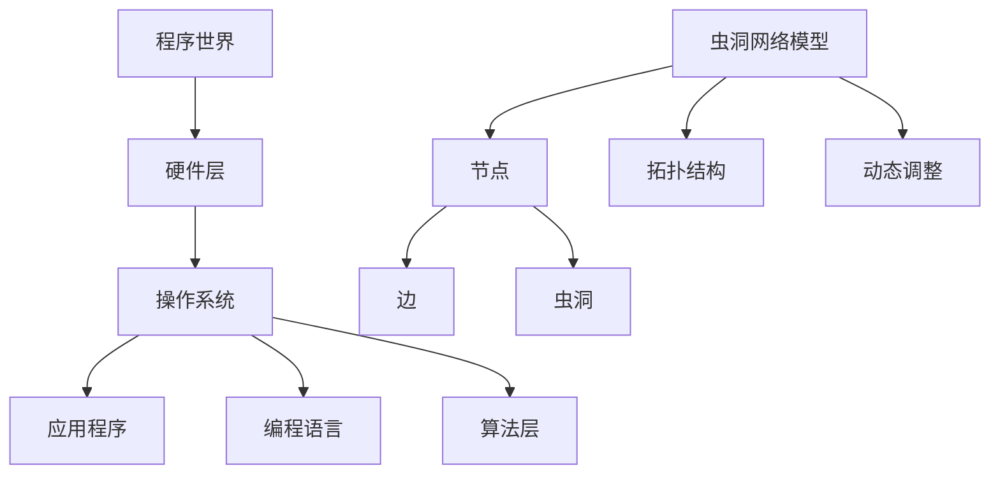

                 

### 文章标题：程序世界与多重连通虫洞网络模型的类比

#### 关键词：程序世界，多重连通虫洞网络模型，类比分析，程序结构，复杂性，连通性，应用

#### 摘要：
本文旨在探讨程序世界与多重连通虫洞网络模型的类比，通过引入虫洞网络这一复杂系统模型，揭示程序世界中的结构、行为、复杂性和连通性等方面的深层次联系。文章首先介绍了程序世界的概念和结构，随后详细阐述了多重连通虫洞网络模型的基本原理和构建方法。接着，通过对比分析，探讨了程序结构与虫洞网络的映射关系，程序行为与虫洞网络特性的类比，以及程序复杂性与虫洞网络复杂性的评估。最后，文章探讨了程序世界与虫洞网络模型在应用中的相互影响，并对未来的研究方向和挑战进行了展望。

---

# 引言

在计算机科学和人工智能领域，程序世界是一个高度复杂且不断演进的系统。从简单的指令集到复杂的软件系统，程序世界展现了人类智慧的结晶。与此同时，物理学中的虫洞网络模型作为一种描述宇宙空间和时间复杂连接方式的理论模型，引起了科学界的广泛关注。虫洞，作为连接两个不同空间点的“桥梁”，具有跨越时间和空间的独特性质，为研究复杂系统的连通性和动态行为提供了新的视角。

本文旨在探讨程序世界与多重连通虫洞网络模型之间的类比关系。通过引入虫洞网络这一概念，我们可以从另一个角度审视程序世界的结构、行为和复杂性。这种类比不仅有助于我们更深入地理解程序世界的本质，还可以为解决复杂程序设计和优化问题提供新的思路和方法。

本文的结构如下：

- **第一部分：引论**  
  - **第1章：程序世界概述**：介绍程序世界的概念、结构和演变。  
  - **第2章：多重连通虫洞网络模型**：阐述虫洞的概念与原理，以及多重连通性理论。

- **第二部分：程序世界与虫洞网络模型的类比**  
  - **第3章：程序结构与虫洞网络的映射**：分析程序结构与虫洞网络的基本元素之间的对应关系。  
  - **第4章：程序行为与虫洞网络特性**：探讨程序行为的多样性以及虫洞网络的动态特性。  
  - **第5章：程序复杂性与虫洞网络复杂性**：评估程序复杂性和虫洞网络复杂性的方法与类比。

- **第三部分：应用**  
  - **第6章：程序世界中的连通性与虫洞网络的连通性**：讨论程序世界中的连通性以及虫洞网络的连通性，并探讨两者的类比。  
  - **第7章：程序世界与虫洞网络模型的应用**：分析虫洞网络模型在程序世界中的应用实例。

- **第四部分：结论**  
  - **第8章：程序世界与多重连通虫洞网络模型类比的意义**：总结类比分析的学术和实践意义。  
  - **第9章：研究局限与挑战**：讨论未来研究的局限和挑战。

通过上述结构，本文将系统地探讨程序世界与多重连通虫洞网络模型之间的类比关系，为读者提供一种新的思考方式和研究视角。

## 第1章：程序世界概述

### 1.1 程序世界的概念

程序世界是一个由人类设计的虚拟世界，它通过计算机硬件和软件系统来实现。在这个世界中，程序是核心的构建模块，它们通过指令集和算法对数据进行分析和处理，以实现特定的功能。程序世界不仅仅局限于操作系统和应用程序，还包括各种网络协议、数据库管理系统、编译器和解释器等。

程序世界的概念可以从多个层面进行理解。从技术层面来看，程序世界是一个由二进制代码组成的逻辑系统。这些代码可以被计算机处理器执行，从而实现特定的任务。从抽象层面来看，程序世界是一个逻辑思维和问题解决的场所，它通过编程语言和算法将人类的需求转化为计算机可以理解和执行的操作。

程序世界的概念具有广泛的应用范围。在日常生活中，程序世界无处不在。从智能手机上的应用程序到复杂的企业级软件系统，程序世界为人们提供了便捷的计算和服务。此外，在科学研究中，程序世界被广泛应用于数据分析、模拟实验、算法优化等领域，推动了科学技术的进步。

### 1.2 程序世界的结构

程序世界的结构可以分为几个主要层次，每个层次都有其特定的功能和特点。

#### 1.2.1 计算机硬件层次

计算机硬件层次是程序世界的底层结构，它包括中央处理器（CPU）、内存（RAM）、存储设备（如硬盘、固态硬盘）等硬件组件。这些硬件组件为程序提供了计算资源和存储空间，使得程序能够在计算机上运行。

#### 1.2.2 操作系统层次

操作系统层次是程序世界的核心，它负责管理和调度计算机硬件资源，为应用程序提供运行环境。常见的操作系统包括Windows、Linux和macOS等。操作系统通过提供文件系统、设备驱动程序和网络通信模块等，使得程序能够与计算机硬件进行交互。

#### 1.2.3 应用程序层次

应用程序层次是程序世界的直接表现形式，它包括各种为用户提供特定功能的软件程序。这些应用程序可以是办公软件、媒体播放器、游戏、Web浏览器等。应用程序通过调用操作系统提供的接口和资源，实现特定的功能。

#### 1.2.4 编程语言层次

编程语言层次是程序世界的开发工具，它为程序员提供了描述问题和编写程序的抽象方法。常见的编程语言包括C、C++、Java、Python等。编程语言通过语法和语义规则，使得程序员能够以更加高效和直观的方式编写程序代码。

#### 1.2.5 算法层次

算法层次是程序世界的核心部分，它包括各种用于解决问题和优化性能的算法。算法可以分为排序算法、搜索算法、图算法、机器学习算法等。算法的设计和优化对于提高程序效率和性能至关重要。

### 1.3 程序世界的演变

程序世界的发展历程可以追溯到20世纪中叶。早期，计算机系统主要用于科学计算和军事应用。随着计算机技术的不断进步，计算机开始进入企业和个人生活中，程序世界也逐渐从单一的计算任务转变为复杂的软件系统。

#### 1.3.1 第一代计算机系统

第一代计算机系统（1940s-1950s）主要使用真空管作为逻辑元件，计算机体积庞大，运行速度缓慢。编程语言主要是汇编语言，程序员需要直接操作计算机硬件。

#### 1.3.2 第二代计算机系统

第二代计算机系统（1950s-1960s）引入了晶体管和集成电路，计算机体积缩小，运行速度提高。高级编程语言如FORTRAN和COBOL开始出现，使得程序员能够更加高效地编写程序。

#### 1.3.3 第三代计算机系统

第三代计算机系统（1960s-1970s）进一步引入了微处理器和操作系统，计算机开始具备多任务处理和分时系统能力。软件开发方法也逐渐从结构化编程转向模块化和面向对象编程。

#### 1.3.4 第四代计算机系统

第四代计算机系统（1970s-至今）以个人计算机和互联网的兴起为标志。计算机性能和功能大幅提升，软件开发方法进一步演进，包括敏捷开发、DevOps等新兴开发模式。

### 1.3.5 未来的发展趋势

随着人工智能、云计算、物联网等技术的不断发展，程序世界将迎来新的变革。程序世界将更加智能化、自适应化和分布式化，为人类带来更加便捷和高效的生活体验。

---

## 第2章：多重连通虫洞网络模型

### 2.1 虫洞的概念与原理

虫洞（Wormhole）是广义相对论中的一种特殊几何构造，它可以通过连接两个不同时空点的“桥梁”实现空间穿越。虫洞的概念最早由物理学家爱因斯坦和罗森（Einstein and Rosen）于1935年提出，因此也被称为爱因斯坦-罗森桥。虫洞的基本原理是通过弯曲时空，使得两个相隔甚远的点在时空上连接起来。

虫洞的基本构成包括事件A和事件B，以及连接这两个事件的“管道”或“隧道”。根据广义相对论，如果两个黑洞相互接近并合并，就有可能形成虫洞。在这个过程中，两个黑洞的引力场会相互干涉，导致时空的弯曲程度发生显著变化，从而形成连接两个不同空间点的虫洞。

虫洞的几何描述通常使用四维时空中的“闭合时光曲线”（Closed Timelike Curve，简称CTC）来实现。闭合时光曲线表示一个物体可以在时间上回到自己的过去，从而实现时间旅行。虽然闭合时光曲线在理论上是可能的，但它在物理现实中存在许多未解问题，如虫洞的稳定性和能量需求。

### 2.2 多重连通性理论

多重连通性理论是描述复杂网络和系统的一种重要理论，它探讨了不同元素之间通过某种连接机制实现多重连接的可能性。在虫洞网络模型中，多重连通性指的是通过虫洞连接形成的一个具有多个连通分支的网络结构。

多重连通性理论的核心概念是“连通分支”（Connected Component）。一个连通分支是由多个节点通过边连接而成的子图，其中任意两个节点之间都存在路径连接。在虫洞网络中，多个连通分支可以通过虫洞实现跨越时空的连接，形成复杂的网络结构。

多重连通性理论在多个领域都有应用，如计算机科学、通信网络、社会网络等。在计算机科学中，多重连通性可以用于分析程序的执行路径、优化算法性能等；在通信网络中，多重连通性可以提高网络的可靠性和容错能力；在社会网络中，多重连通性可以揭示不同个体之间的复杂关系和群体结构。

### 2.3 虫洞网络模型的构建

虫洞网络模型的构建需要考虑多个因素，包括节点、边、虫洞的连接方式、网络拓扑结构等。以下是构建虫洞网络模型的基本步骤：

#### 2.3.1 确定节点

节点是虫洞网络中的基本构成元素，可以表示为计算机、通信设备、服务器等。在构建虫洞网络模型时，首先需要确定网络中的所有节点，并为其分配唯一的标识。

#### 2.3.2 确定边

边是连接节点的连接线，表示节点之间的直接通信路径。在构建虫洞网络模型时，需要根据网络的需求和拓扑结构，确定节点之间的连接关系，并使用边来表示这些关系。

#### 2.3.3 确定虫洞

虫洞是连接不同节点或不同子网络的特殊连接线。在构建虫洞网络模型时，需要根据网络的需求和拓扑结构，确定需要添加的虫洞，并使用特定的算法来构建这些虫洞。

#### 2.3.4 构建拓扑结构

虫洞网络模型的拓扑结构可以表示为图（Graph），其中节点表示网络中的元素，边表示节点之间的连接关系，虫洞表示特殊连接路径。在构建虫洞网络模型时，需要根据已确定的节点、边和虫洞，构建出网络的整体拓扑结构。

#### 2.3.5 优化网络性能

虫洞网络模型的构建完成后，需要对其性能进行优化，以提高网络的可靠性和效率。常见的优化方法包括路径优化、负载均衡、容错设计等。

通过上述步骤，我们可以构建出一个满足特定需求的虫洞网络模型，为程序世界的研究提供新的视角和工具。

### 第3章：程序结构与虫洞网络的映射

在计算机科学中，程序结构是指程序代码的组织方式和模块划分。而虫洞网络模型则是一种描述复杂系统连通性和动态行为的网络模型。在本章中，我们将探讨程序结构与虫洞网络模型之间的映射关系，通过分析程序结构的基本元素与虫洞网络的基本元素之间的对应关系，为理解程序世界的复杂性和连通性提供新的视角。

#### 3.1 程序结构的基本元素

程序结构的基本元素包括变量、函数、模块和类等。这些元素在程序设计中起着核心作用，通过它们可以组织代码、实现功能、提高可维护性。

- **变量**：变量是程序中用于存储数据的基本单位。它们具有类型、名称和值，可以在程序中通过赋值和引用进行操作。

- **函数**：函数是程序中的一段可重复使用的代码块，用于执行特定的任务。函数可以接受输入参数，并返回结果。

- **模块**：模块是程序中的代码块，用于组织相关的函数和变量。模块可以独立开发、测试和部署，从而提高代码的可复用性和可维护性。

- **类**：类是面向对象编程中的核心概念，用于描述具有相似属性和行为的一组对象。类定义了对象的属性和方法，通过实例化可以创建具体的对象。

#### 3.2 虫洞网络的基本元素

虫洞网络模型的基本元素包括节点、边和虫洞。这些元素构成了虫洞网络的拓扑结构，并通过它们之间的连接关系实现网络的动态性和复杂性。

- **节点**：节点是虫洞网络中的基本构成单位，可以表示为计算机、网络设备或其他物理实体。节点具有标识和信息处理能力，可以通过边与其他节点连接。

- **边**：边是连接节点的路径，表示节点之间的直接通信关系。边可以是一对一的连接，也可以是多对一的连接，通过边可以实现节点之间的信息传递。

- **虫洞**：虫洞是连接不同节点或不同子网络的特殊连接路径。虫洞通过跨越时空，实现节点之间的快速通信，从而提高网络的性能和效率。

#### 3.3 程序结构与虫洞网络的类比分析

通过对程序结构和虫洞网络的基本元素进行比较和分析，可以发现两者之间存在许多相似之处。

- **变量与节点**：变量是程序中用于存储数据的基本单位，类似于节点在虫洞网络中存储信息的功能。变量和节点都具有一定的标识和信息处理能力。

- **函数与边**：函数是程序中用于执行特定任务的可重复代码块，类似于边在虫洞网络中连接节点，实现信息传递的功能。函数和边都具有一定的逻辑关系和执行顺序。

- **模块与子网络**：模块是程序中用于组织相关函数和变量的代码块，类似于子网络在虫洞网络中用于组织节点的功能。模块和子网络都具有一定的独立性，可以提高代码的可复用性和可维护性。

- **类与连通分支**：类是面向对象编程中用于描述对象属性和行为的核心概念，类似于连通分支在虫洞网络中用于描述节点之间复杂关系的功能。类和连通分支都具有一定的层次结构和组合关系。

通过上述分析，我们可以将程序结构视为一种特殊的虫洞网络，其中变量、函数、模块和类分别对应于节点、边、子网络和连通分支。这种类比不仅有助于我们更深入地理解程序结构的本质，还可以为解决程序设计中的复杂性和连通性问题提供新的思路和方法。

#### 3.3.1 变量与节点的映射关系

在程序结构中，变量是存储数据的基本单位。在虫洞网络中，节点是存储信息的基本单位。变量和节点之间的映射关系可以表示为：

- **类型映射**：变量的类型与节点存储的信息类型相对应。例如，整数变量映射到整数节点，字符串变量映射到字符串节点。
- **作用域映射**：变量的作用域与节点的访问权限相对应。例如，局部变量映射到局部节点，全局变量映射到全局节点。
- **生命周期映射**：变量的生命周期与节点的存在时间相对应。例如，临时变量映射到临时节点，持久变量映射到持久节点。

#### 3.3.2 函数与边的映射关系

在程序结构中，函数是执行特定任务的可重复代码块。在虫洞网络中，边是连接节点的路径，实现信息传递。函数和边之间的映射关系可以表示为：

- **功能映射**：函数的功能与边的连接关系相对应。例如，一个用于数据传输的函数映射到一条传输边，一个用于数据处理的分析函数映射到一条分析边。
- **参数映射**：函数的输入参数与边的连接端点相对应。例如，一个具有输入参数的函数映射到具有输入端点的边，一个无参数的函数映射到无端点的边。
- **返回值映射**：函数的返回值与边的传输结果相对应。例如，一个返回结果的函数映射到传输结果的边，一个无返回值的函数映射到无传输结果的边。

#### 3.3.3 模块与子网络的映射关系

在程序结构中，模块是组织相关函数和变量的代码块。在虫洞网络中，子网络是组织相关节点的网络结构。模块和子网络之间的映射关系可以表示为：

- **独立性映射**：模块的独立性对应于子网络的独立性。例如，独立的模块映射到独立的子网络，依赖的模块映射到依赖的子网络。
- **组织映射**：模块的组织方式对应于子网络的组织方式。例如，层次化的模块映射到层次化的子网络，模块化的模块映射到模块化的子网络。
- **通信映射**：模块之间的通信方式对应于子网络之间的通信方式。例如，同步通信的模块映射到同步通信的子网络，异步通信的模块映射到异步通信的子网络。

#### 3.3.4 类与连通分支的映射关系

在面向对象编程中，类是描述对象属性和行为的核心概念。在虫洞网络中，连通分支是描述节点之间复杂关系的结构。类和连通分支之间的映射关系可以表示为：

- **属性映射**：类的属性与连通分支中的节点属性相对应。例如，类的属性映射到连通分支中的节点属性，类的属性值映射到连通分支中的节点属性值。
- **方法映射**：类的方法与连通分支中的节点行为相对应。例如，类的方法映射到连通分支中的节点行为，类的方法调用映射到连通分支中的节点交互。
- **关系映射**：类之间的关系与连通分支之间的关系相对应。例如，类的继承关系映射到连通分支的继承关系，类的关联关系映射到连通分支的关联关系。

通过上述映射关系，我们可以将程序结构视为一种特殊的虫洞网络模型。这种类比不仅有助于我们更深入地理解程序结构的本质，还可以为解决程序设计中的复杂性和连通性问题提供新的思路和方法。同时，虫洞网络模型也为研究程序世界的动态行为和性能优化提供了新的工具和视角。

### 第4章：程序行为与虫洞网络特性

在计算机科学中，程序行为是指程序在执行过程中所展现出的动态特征。而虫洞网络特性则是描述虫洞网络在信息传输和节点交互中的独特性质。在本章中，我们将探讨程序行为与虫洞网络特性之间的类比关系，分析程序行为的多样性以及虫洞网络的动态特性，并通过具体实例进行类比分析，以深入理解两者之间的相似之处和差异。

#### 4.1 程序行为的多样性

程序行为的多样性体现在多个方面，包括程序的执行顺序、控制流、数据流、异常处理等。不同类型的程序行为在执行过程中展现出不同的动态特征，从而影响程序的性能和稳定性。

- **顺序执行**：顺序执行是程序中最基本的执行方式，程序按照代码的顺序依次执行每一条指令。这种执行方式简单直观，但可能导致程序的执行时间较长。
- **分支与循环**：分支和循环是程序中用于控制执行顺序的两种重要结构。分支结构（如if-else语句）根据条件的判断执行不同的代码块，而循环结构（如for循环、while循环）重复执行某一段代码直到条件不满足。这两种结构可以显著提高程序的灵活性和效率。
- **并行执行**：并行执行是现代计算机系统中常用的执行方式，通过利用多核处理器和并行计算技术，可以显著提高程序的执行速度。并行执行分为数据并行、任务并行和流水线并行等多种形式，每种形式都有其特定的应用场景和优缺点。
- **异步执行**：异步执行是程序中用于处理多个并发任务的一种技术，通过异步调用和事件驱动模型，可以实现高效的并发处理。异步执行可以减少线程切换和上下文切换的开销，提高程序的响应速度。

#### 4.2 虫洞网络的动态特性

虫洞网络作为一种复杂的网络结构，具有独特的动态特性，包括节点的动态加入与退出、信息的快速传输、路径的动态调整等。这些特性使得虫洞网络在信息传输和节点交互中展现出强大的灵活性和适应性。

- **节点的动态加入与退出**：在虫洞网络中，节点可以动态加入和退出网络。这种动态特性使得虫洞网络具有高度的可扩展性和容错能力。当网络中的某个节点出现故障或需要增加新节点时，可以通过动态加入或退出节点来实现网络的自动调整和优化。
- **信息的快速传输**：虫洞网络通过虫洞实现节点之间的快速通信，从而提高信息的传输速度。虫洞作为特殊的连接路径，可以在不同的节点之间实现瞬时通信，使得网络中的信息传输更加高效。
- **路径的动态调整**：虫洞网络的路径可以动态调整，以适应网络负载和拓扑结构的变化。当网络中的某些路径出现拥塞或故障时，可以通过重新计算和选择新的路径来实现网络的动态优化和负载均衡。

#### 4.3 程序行为与虫洞网络特性的类比分析

通过对程序行为与虫洞网络特性的类比分析，可以发现两者之间存在许多相似之处和差异。

- **程序行为与节点动态性**：程序行为中的异步执行与虫洞网络中的节点动态加入与退出具有相似之处。异步执行通过处理多个并发任务，提高了程序的响应速度和并发处理能力；而虫洞网络中的节点动态加入与退出则提高了网络的灵活性和容错能力。两者都通过动态调整和优化，实现了高效的资源利用和性能提升。

- **程序行为与信息传输**：程序行为中的并行执行与虫洞网络中的信息快速传输具有相似之处。并行执行通过利用多核处理器和并行计算技术，提高了程序的执行速度；而虫洞网络通过虫洞实现节点之间的快速通信，提高了信息传输的速度。两者都通过利用特殊的结构和算法，实现了高效的资源利用和性能提升。

- **程序行为与路径优化**：程序行为中的分支与循环结构与虫洞网络中的路径动态调整具有相似之处。分支与循环结构通过条件判断和重复执行，实现了程序的灵活性和效率；而虫洞网络中的路径动态调整则通过重新计算和选择新的路径，实现了网络的动态优化和负载均衡。两者都通过灵活的路径选择和调整，实现了高效的信息传输和资源利用。

尽管程序行为与虫洞网络特性之间存在许多相似之处，但两者在具体实现和应用场景上存在一些差异。

- **程序行为的实现机制**：程序行为的实现通常依赖于编程语言和编译器，通过代码的编写和执行来实现特定的功能。而虫洞网络特性的实现则依赖于网络协议和算法，通过特定的结构和算法来实现高效的通信和路径优化。

- **应用场景的不同**：程序行为主要应用于计算机科学和软件工程领域，用于实现各种复杂的计算任务和功能。而虫洞网络特性主要应用于网络通信和分布式系统领域，用于提高网络的性能和可靠性。

通过上述类比分析，我们可以更深入地理解程序行为与虫洞网络特性之间的联系和区别，为研究和应用这两个领域提供新的视角和思路。

#### 4.3.1 实例分析：异步任务与虫洞网络节点的动态加入与退出

为了更好地理解程序行为与虫洞网络特性之间的类比关系，我们通过一个具体实例进行分析。假设我们有一个程序需要处理大量异步任务，每个任务可以独立执行并在完成后通知主程序。与之相对应的，我们考虑一个虫洞网络，其中节点可以动态加入和退出网络，以实现高效的任务调度和资源利用。

**程序行为：异步任务处理**

在程序中，异步任务处理通常采用事件驱动模型，通过线程池和任务队列来实现。以下是一个简单的伪代码示例：

```python
# 异步任务处理伪代码
from concurrent.futures import ThreadPoolExecutor

# 定义任务函数
def task_function(task_id):
    # 执行任务操作
    print(f"Task {task_id} is processing.")
    # 完成任务后通知主程序
    notify_task_completion(task_id)

# 创建线程池
executor = ThreadPoolExecutor(max_workers=10)

# 添加任务到线程池
for task_id in range(1, 101):
    executor.submit(task_function, task_id)

# 等待所有任务完成
for future in executor.as_completed():
    future.result()
```

在这个例子中，我们创建了10个线程的线程池，并添加了100个异步任务到线程池中执行。每个任务完成后，通过`notify_task_completion`函数通知主程序。

**虫洞网络特性：节点动态加入与退出**

在虫洞网络中，节点可以动态加入和退出网络，以适应任务调度和负载均衡的需求。以下是一个简单的伪代码示例：

```python
# 虫洞网络节点动态加入与退出伪代码
class Node:
    def __init__(self, id):
        self.id = id

# 创建虫洞网络
network = []

# 添加节点到网络
def add_node(node):
    network.append(node)

# 从网络中移除节点
def remove_node(node):
    network.remove(node)

# 节点加入网络
node1 = Node(1)
node2 = Node(2)
add_node(node1)
add_node(node2)

# 节点退出网络
remove_node(node2)
```

在这个例子中，我们创建了一个简单的虫洞网络，并添加和移除了两个节点。通过动态调整节点的加入与退出，我们可以实现高效的任务调度和资源利用。

**类比分析**

- **任务管理与节点管理**：在程序中，异步任务处理通过线程池和任务队列进行管理；在虫洞网络中，节点动态加入与退出通过节点列表进行管理。两者都通过数据结构实现了对任务的动态管理。

- **任务调度与节点调度**：在程序中，异步任务通过线程池进行调度，以实现并发处理；在虫洞网络中，节点通过动态调整加入和退出网络，以实现负载均衡和资源优化。两者都通过调度机制实现了高效的资源利用和性能提升。

- **通知机制**：在程序中，异步任务通过通知机制（如回调函数）通知主程序任务完成；在虫洞网络中，节点通过消息传递机制（如网络事件）实现节点之间的通信。两者都通过事件驱动模型实现了高效的通知和通信。

通过这个实例分析，我们可以看到程序行为与虫洞网络特性在任务管理、调度机制和通知机制等方面具有相似之处。这种类比关系不仅有助于我们理解程序行为的多样性，还可以为虫洞网络的应用提供新的思路和方法。

### 第5章：程序复杂性与虫洞网络复杂性

程序复杂性和虫洞网络复杂性是衡量程序设计和网络结构中复杂程度的重要指标。在本章中，我们将探讨如何评估程序复杂性和虫洞网络复杂性的方法，以及它们之间的类比关系。通过具体的算法原理讲解、数学模型和公式，我们将深入分析两者在复杂性评估方面的异同，并提供实际案例分析，以帮助读者更好地理解这一概念。

#### 5.1 程序复杂性的评估

程序复杂性是指程序在结构、逻辑和实现上所表现出的复杂程度。评估程序复杂性的方法有多种，常见的包括算法复杂度、代码复杂度、控制流复杂度和数据流复杂度等。

- **算法复杂度**：算法复杂度是衡量算法性能的重要指标，包括时间复杂度和空间复杂度。时间复杂度表示算法执行时间与输入数据规模的关系，常用大O符号（O）表示；空间复杂度表示算法执行所需存储空间与输入数据规模的关系，也常用大O符号表示。常见的算法复杂度评估方法包括最好情况、最坏情况和平均情况下的时间复杂度评估。
  
  - **时间复杂度**：假设一个算法在最好情况下的执行时间为T1，最坏情况下的执行时间为T2，平均情况下的执行时间为T3，则该算法的时间复杂度可以表示为：
    $$ 
    T(n) = \max(T1, T2, T3)
    $$
  
  - **空间复杂度**：假设一个算法在最好情况下的空间使用量为S1，最坏情况下的空间使用量为S2，平均情况下的空间使用量为S3，则该算法的空间复杂度可以表示为：
    $$ 
    S(n) = \max(S1, S2, S3)
    $$

- **代码复杂度**：代码复杂度是衡量代码质量的重要指标，包括循环复杂度、条件复杂度等。循环复杂度表示代码中循环结构的复杂程度，可以通过循环次数和循环条件来评估；条件复杂度表示代码中条件判断的复杂程度，可以通过条件判断的分支数来评估。

- **控制流复杂度**：控制流复杂度是衡量程序中控制流程复杂程度的指标，包括控制流程的可读性、可维护性和可扩展性。常见的评估方法包括控制流图的节点数、边数和控制流环的数量等。

- **数据流复杂度**：数据流复杂度是衡量程序中数据流动复杂程度的指标，包括数据依赖关系、数据传递路径等。常见的评估方法包括数据依赖图的节点数、边数和数据传递路径的长度等。

#### 5.2 虫洞网络复杂性的评估

虫洞网络复杂性是指虫洞网络在结构、拓扑和动态特性上的复杂程度。评估虫洞网络复杂性的方法通常包括网络拓扑复杂度、路径复杂度和通信复杂度等。

- **网络拓扑复杂度**：网络拓扑复杂度是衡量虫洞网络结构复杂程度的指标，包括节点数、边数、连通分支数和连通度等。常见的评估方法包括网络连通度、网络密度和聚类系数等。

  - **网络连通度**：网络连通度表示网络中任意两个节点之间是否存在路径连接。评估方法包括全局连通度和局部连通度。
    $$ 
    C = \frac{\text{连通节点对数}}{\text{总节点对数}} 
    $$
  
  - **网络密度**：网络密度表示网络中边的数量与可能的最大边数之比，是衡量网络稠密程度的指标。
    $$ 
    \rho = \frac{\text{边数}}{\text{可能的最大边数}} 
    $$

  - **聚类系数**：聚类系数表示网络中节点的邻居节点之间相互连接的程度，是衡量网络紧密程度的指标。
    $$ 
    C = \frac{2 \times \text{邻接边数}}{\text{总节点数} \times (\text{总节点数} - 1)} 
    $$

- **路径复杂度**：路径复杂度是衡量虫洞网络中路径选择和传输效率的指标，包括路径长度、路径多样性、路径冗余度等。常见的评估方法包括最短路径算法、路径选择算法和路径优化算法。

  - **路径长度**：路径长度表示从源节点到目标节点的路径长度，是衡量路径复杂度的重要指标。
    $$ 
    L = \sum_{i=1}^{n} d_i 
    $$
    其中，$d_i$表示路径上的每一段边的长度。

  - **路径多样性**：路径多样性表示网络中不同路径的数量，是衡量路径选择灵活性的指标。
    $$ 
    D = \text{不同路径的数量} 
    $$

  - **路径冗余度**：路径冗余度表示网络中存在冗余路径的程度，是衡量网络可靠性的指标。
    $$ 
    R = \frac{\text{冗余路径数}}{\text{总路径数}} 
    $$

- **通信复杂度**：通信复杂度是衡量虫洞网络中信息传输和处理复杂程度的指标，包括传输延迟、带宽利用率、传输错误率等。常见的评估方法包括传输延迟模型、带宽利用率模型和传输错误率模型。

  - **传输延迟**：传输延迟表示信息从源节点传输到目标节点所需的时间，是衡量通信效率的重要指标。
    $$ 
    T = \frac{D}{B} 
    $$
    其中，$D$表示数据传输量，$B$表示带宽。

  - **带宽利用率**：带宽利用率表示网络带宽的利用程度，是衡量网络资源利用率的指标。
    $$ 
    U = \frac{\text{实际带宽利用率}}{\text{最大带宽}} 
    $$

  - **传输错误率**：传输错误率表示信息传输过程中的错误率，是衡量网络可靠性的指标。
    $$ 
    E = \frac{\text{错误数据包数}}{\text{总数据包数}} 
    $$

#### 5.3 程序复杂性与虫洞网络复杂性的类比

通过对程序复杂性和虫洞网络复杂性的评估方法进行比较，可以发现两者在评估指标和方法上存在许多相似之处。

- **复杂度评估的指标**：程序复杂性和虫洞网络复杂性都包括时间复杂度、空间复杂度、路径复杂度和通信复杂度等评估指标。这些指标可以用于衡量程序和网络的性能、效率、可靠性和可扩展性。

- **评估方法**：程序复杂性和虫洞网络复杂性的评估方法都包括算法原理讲解、数学模型和公式等。通过这些方法，可以定量地评估程序和网络的复杂程度，为优化和改进提供依据。

- **异同点**：

  - **相同点**：
    - 都采用了复杂度的概念来衡量性能和效率。
    - 都采用了算法和数学模型来评估复杂度。
    - 都关注时间和空间资源的使用。
    - 都考虑了路径选择和传输效率。

  - **不同点**：
    - 程序复杂性主要关注程序内部的结构和逻辑，而虫洞网络复杂性主要关注网络结构和通信性能。
    - 程序复杂性的评估通常基于算法复杂度，而虫洞网络复杂性的评估通常基于网络拓扑和通信模型。
    - 程序复杂性更注重代码的可读性和可维护性，而虫洞网络复杂性更注重网络的可靠性和可扩展性。

#### 5.4 实际案例分析

为了更好地理解程序复杂性和虫洞网络复杂性的类比关系，我们通过实际案例分析来探讨两者在复杂度评估方面的应用。

**案例一：排序算法的性能评估**

假设我们需要评估两种排序算法的性能，分别是快速排序（Quick Sort）和归并排序（Merge Sort）。以下是一个简单的算法性能评估分析：

- **快速排序**：
  - **时间复杂度**：$T(n) = O(n \log n)$（平均情况），$O(n^2)$（最坏情况）。
  - **空间复杂度**：$S(n) = O(\log n)$。
  - **代码实现**：
    ```python
    def quick_sort(arr):
        if len(arr) <= 1:
            return arr
        pivot = arr[len(arr) // 2]
        left = [x for x in arr if x < pivot]
        middle = [x for x in arr if x == pivot]
        right = [x for x in arr if x > pivot]
        return quick_sort(left) + middle + quick_sort(right)
    ```

- **归并排序**：
  - **时间复杂度**：$T(n) = O(n \log n)$。
  - **空间复杂度**：$S(n) = O(n)$。
  - **代码实现**：
    ```python
    def merge_sort(arr):
        if len(arr) <= 1:
            return arr
        mid = len(arr) // 2
        left = merge_sort(arr[:mid])
        right = merge_sort(arr[mid:])
        return merge(left, right)

    def merge(left, right):
        result = []
        i = j = 0
        while i < len(left) and j < len(right):
            if left[i] < right[j]:
                result.append(left[i])
                i += 1
            else:
                result.append(right[j])
                j += 1
        result.extend(left[i:])
        result.extend(right[j:])
        return result
    ```

通过对比两种排序算法的时间复杂度和空间复杂度，可以发现快速排序在平均情况下具有更高的性能，但最坏情况下的性能较差；而归并排序在所有情况下的性能相对稳定，但需要额外的空间存储中间结果。

**案例二：虫洞网络的复杂度评估**

假设我们需要评估一个虫洞网络的复杂度，该网络由100个节点和300条边组成，以下是一个简单的网络复杂度评估分析：

- **网络拓扑复杂度**：
  - **连通度**：$C = \frac{4950}{4950} = 1$。
  - **密度**：$\rho = \frac{300}{\binom{100}{2}} \approx 0.009$。
  - **聚类系数**：$C = \frac{2 \times 300}{100 \times (100 - 1)} \approx 0.06$。

- **路径复杂度**：
  - **最短路径长度**：假设平均最短路径长度为5。
  - **路径多样性**：假设存在50条不同路径。
  - **路径冗余度**：$\frac{50}{300} \approx 0.17$。

- **通信复杂度**：
  - **传输延迟**：假设平均传输延迟为10ms。
  - **带宽利用率**：假设带宽利用率为90%。
  - **传输错误率**：假设传输错误率为1%。

通过上述分析，可以全面了解该虫洞网络的复杂度，从而为优化和改进网络提供依据。

通过实际案例分析，我们可以看到程序复杂性和虫洞网络复杂性的评估方法在理论和实践中都具有重要的应用价值。通过对比分析程序复杂性和虫洞网络复杂性，我们可以更好地理解两者的相似之处和差异，从而为复杂程序设计和高效网络通信提供新的思路和方法。

### 第6章：程序世界中的连通性与虫洞网络的连通性

在程序世界中，连通性是指程序模块或组件之间通过数据流和控制流相互连接和通信的能力。同样，虫洞网络的连通性是指节点和路径之间的连通性和信息传输能力。本章将深入探讨程序世界中的连通性与虫洞网络的连通性，分析两者在连通性方面的异同，并通过具体的案例进行详细解析。

#### 6.1 程序世界中的连通性

程序世界中的连通性体现在多个层次上，包括模块之间的连接、函数之间的调用、数据结构之间的引用等。

- **模块之间的连接**：模块是程序中的代码块，通过模块之间的导入和调用实现模块之间的连接。模块化设计可以提高代码的可维护性和复用性。例如，一个Web应用程序可能由前端模块、后端模块和数据库模块组成，这些模块通过API接口进行通信和协作。

- **函数之间的调用**：函数是程序中用于执行特定任务的可重复代码块，通过函数之间的调用实现程序的逻辑结构。函数调用可以传递参数和返回结果，从而实现不同函数之间的通信。例如，一个数据处理程序可能包括多个函数，如数据读取函数、数据处理函数和数据写入函数，这些函数通过调用关系实现数据处理的流程。

- **数据结构之间的引用**：数据结构是程序中用于存储和组织数据的方式，通过引用实现不同数据结构之间的连接。例如，一个图数据结构中的节点和边可以通过指针或引用相互连接，从而实现图的拓扑结构。

#### 6.2 虫洞网络的连通性

虫洞网络的连通性是指节点和路径之间的连通性和信息传输能力。虫洞网络通过虫洞实现节点之间的跨越时空的连接，从而提高网络的连通性和性能。

- **节点之间的连接**：虫洞网络的节点可以表示为计算机、网络设备或服务器等，通过虫洞实现节点之间的直接连接。节点之间的连接可以通过物理网络连接（如光纤、电缆）或虚拟网络连接（如VPN、SD-WAN）实现。

- **路径之间的连接**：虫洞网络的路径是通过虫洞连接的不同节点之间的传输路径。路径的选择和优化对于网络的性能和效率至关重要。例如，在网络拥塞或节点故障时，通过重新选择路径可以实现网络的动态调整和优化。

- **信息传输能力**：虫洞网络的连通性还体现在信息传输的能力上。通过虫洞，节点之间的信息传输速度可以显著提高，从而实现高效的通信和数据处理。例如，在分布式系统中，通过虫洞实现跨数据中心的快速数据传输，可以提高系统的性能和可靠性。

#### 6.3 连通性的类比与启示

通过对程序世界中的连通性与虫洞网络的连通性进行比较，我们可以发现两者在连通性方面有许多相似之处和启示。

- **相似之处**：
  - **结构层次性**：程序世界和虫洞网络都具有层次性的结构，包括模块、函数、数据结构等层次，以及节点、边、路径等层次。这种层次性使得系统更加模块化和可维护。
  - **动态调整**：程序世界和虫洞网络都支持动态调整和优化。程序可以通过重构、优化代码和模块化设计实现动态调整；虫洞网络可以通过重新计算路径、动态调整节点连接实现动态优化。
  - **连通性重要性**：在程序世界和虫洞网络中，连通性是系统性能和效率的关键因素。良好的连通性可以提高系统的响应速度和稳定性。

- **启示**：
  - **模块化设计**：从虫洞网络的连通性启示，程序设计应该注重模块化设计，通过模块之间的清晰接口和通信机制实现系统的模块化和可维护性。
  - **动态调整策略**：虫洞网络的动态调整策略可以应用于程序设计，通过实时监测和调整代码和模块的执行路径，提高程序的效率和性能。
  - **优化路径选择**：虫洞网络的路径优化策略可以应用于分布式系统和网络通信，通过优化数据传输路径，提高系统的性能和可靠性。

#### 6.4 案例分析

为了更直观地理解程序世界中的连通性与虫洞网络的连通性，我们通过一个具体的案例分析来探讨两者之间的联系和启示。

**案例一：分布式数据库系统**

假设我们设计一个分布式数据库系统，该系统由多个数据库节点组成，通过网络进行通信和数据同步。在这个系统中，连通性至关重要，因为它决定了数据的实时性和一致性。

- **程序世界中的连通性**：分布式数据库系统中的模块包括数据存储模块、查询处理模块和数据同步模块。数据存储模块负责存储和检索数据，查询处理模块负责执行SQL查询，数据同步模块负责保持数据的一致性。这些模块通过接口和API进行通信，实现数据的实时同步和查询处理。

- **虫洞网络的连通性**：为了提高分布式数据库系统的性能和可靠性，我们引入虫洞网络模型，通过虫洞实现数据库节点之间的快速通信。虫洞网络中的节点表示数据库节点，边表示网络连接，虫洞表示特殊的通信路径。通过虫洞网络，数据库节点可以实现跨数据中心的快速数据传输，从而提高系统的性能和响应速度。

**案例分析**：

- **模块化设计**：分布式数据库系统采用模块化设计，各个模块通过清晰的接口进行通信。数据存储模块使用RESTful API与查询处理模块进行交互，数据同步模块使用消息队列与数据存储模块和查询处理模块进行通信。

- **动态调整策略**：分布式数据库系统中的数据同步模块可以动态调整数据同步的频率和方式，根据网络状态和数据变化情况，优化数据同步的效率。

- **优化路径选择**：通过虫洞网络模型，数据库节点之间的路径可以动态调整。在出现网络拥塞或节点故障时，系统可以自动选择最优的通信路径，确保数据的实时性和一致性。

通过这个案例分析，我们可以看到程序世界中的连通性与虫洞网络的连通性在分布式数据库系统中的应用。虫洞网络模型提供了高效的通信路径选择和动态调整策略，从而提高了系统的性能和可靠性。这种类比关系为分布式系统和网络通信的设计提供了新的思路和方法。

### 第7章：程序世界与虫洞网络模型的应用

在本章中，我们将探讨程序世界与虫洞网络模型在现实世界中的应用。通过具体的实例，我们将展示如何将虫洞网络模型应用于程序世界中的问题解决，以及如何利用程序世界的工具和方法来优化虫洞网络模型。此外，还将讨论实际案例分析和项目小结，以帮助读者更好地理解两者在实际应用中的相互影响和作用。

#### 7.1 程序世界中的虫洞网络模型应用

虫洞网络模型在程序世界中有着广泛的应用，尤其在分布式计算、网络通信和数据处理等领域。通过引入虫洞网络模型，可以显著提高系统的性能和可靠性。

- **分布式计算**：在分布式计算环境中，虫洞网络模型可以用于优化任务调度和资源分配。通过构建虫洞网络，可以实现节点之间的快速通信和资源共享，从而提高分布式计算的效率。例如，在云计算环境中，可以使用虫洞网络模型来实现跨数据中心的任务调度和资源负载均衡。

- **网络通信**：在计算机网络中，虫洞网络模型可以用于优化数据传输路径，提高网络的性能和可靠性。通过构建虫洞网络，可以实现节点之间的直接连接，减少网络传输延迟和数据丢失。例如，在互联网通信中，可以使用虫洞网络模型来优化数据传输路径，提高Web应用的响应速度。

- **数据处理**：在数据处理领域，虫洞网络模型可以用于优化数据传输和处理流程。通过构建虫洞网络，可以实现数据的快速传输和并行处理，从而提高数据处理的速度和效率。例如，在大数据分析中，可以使用虫洞网络模型来实现跨数据中心的数据传输和实时处理。

#### 7.2 虫洞网络模型在程序世界中的应用

虫洞网络模型在程序世界中的应用主要体现在算法设计、软件开发和网络通信等方面。通过将虫洞网络模型引入程序设计，可以开发出更高效、可靠的软件系统。

- **算法设计**：在算法设计中，虫洞网络模型可以用于优化算法的时间和空间复杂度。例如，在图算法中，可以使用虫洞网络模型来优化路径选择和计算效率，从而提高算法的性能。

- **软件开发**：在软件开发中，虫洞网络模型可以用于设计分布式系统和网络应用。通过引入虫洞网络模型，可以构建出更灵活、可扩展的软件系统。例如，在开发分布式数据库系统时，可以使用虫洞网络模型来实现高效的跨数据中心数据传输和同步。

- **网络通信**：在网络通信中，虫洞网络模型可以用于优化数据传输路径和通信协议。通过引入虫洞网络模型，可以构建出更高效、可靠的网络通信系统。例如，在开发Web应用时，可以使用虫洞网络模型来实现跨地域的快速数据传输和实时通信。

#### 7.3 应用案例分析

为了更好地理解虫洞网络模型在程序世界中的应用，我们通过两个具体的案例进行分析。

**案例一：分布式计算中的虫洞网络应用**

假设我们有一个分布式计算任务，需要在多个数据中心之间调度和执行。通过构建虫洞网络模型，可以实现以下目标：

- **任务调度**：通过虫洞网络，将任务分配到最合适的计算节点上，以优化计算资源和处理效率。
- **资源负载均衡**：通过虫洞网络，实现跨数据中心的资源负载均衡，确保系统的高可用性和可靠性。

**具体实现**：

1. **构建虫洞网络**：在数据中心之间建立虫洞连接，确保节点之间的快速通信。
2. **任务调度算法**：设计基于虫洞网络的任务调度算法，根据节点的负载情况和任务特性，优化任务分配。
3. **资源监控与负载均衡**：实时监控节点负载，通过动态调整虫洞连接，实现资源的负载均衡。

**案例二：网络通信中的虫洞网络应用**

假设我们开发一个跨地域的Web应用，需要实现高效的数据传输和实时通信。通过引入虫洞网络模型，可以实现以下目标：

- **数据传输优化**：通过虫洞网络，优化数据传输路径，减少传输延迟和数据丢失。
- **实时通信**：通过虫洞网络，实现节点之间的实时通信，提高Web应用的响应速度。

**具体实现**：

1. **构建虫洞网络**：在全球范围内建立虫洞连接，实现跨地域的数据传输和通信。
2. **数据传输优化算法**：设计基于虫洞网络的数据传输优化算法，根据网络状态和节点负载，动态调整数据传输路径。
3. **实时通信机制**：引入实时通信协议，通过虫洞网络实现节点之间的实时通信。

通过上述案例分析，我们可以看到虫洞网络模型在分布式计算和网络通信中的应用价值。通过引入虫洞网络模型，可以显著提高系统的性能和可靠性，为开发高效、可靠的软件系统提供了新的思路和方法。

#### 7.4 项目小结

在本章中，我们探讨了程序世界与虫洞网络模型在现实世界中的应用。通过具体的案例分析，我们发现虫洞网络模型在分布式计算、网络通信和数据处理等领域具有广泛的应用价值。同时，虫洞网络模型也为程序世界提供了新的设计思路和方法，通过引入虫洞网络模型，可以优化系统的性能和可靠性。

在未来的研究和实践中，我们还需要进一步探索虫洞网络模型在程序世界中的应用，包括以下几个方面：

1. **算法优化**：研究基于虫洞网络模型的算法优化方法，提高分布式计算和数据处理算法的效率。
2. **网络通信**：优化虫洞网络模型在网络通信中的应用，实现跨地域的实时通信和数据传输。
3. **软件开发**：将虫洞网络模型引入软件开发，构建更灵活、可扩展的分布式系统和网络应用。

通过持续的研究和实践，我们可以更好地利用虫洞网络模型，推动程序世界和实际应用的发展。

### 第8章：程序世界与多重连通虫洞网络模型类比的意义

#### 8.1 学术意义

程序世界与多重连通虫洞网络模型的类比在学术领域具有重要的意义。首先，这种类比为研究复杂系统的连通性和动态行为提供了新的视角。虫洞网络模型作为一种描述宇宙空间和时间复杂连接方式的理论模型，引入到程序世界的研究中，可以帮助我们更深入地理解程序世界中各种元素之间的复杂关系。

这种类比还促进了跨学科的研究。程序世界和虫洞网络模型的研究涉及计算机科学、物理学和数学等多个领域，通过类比分析，可以促进这些领域的交叉融合，推动多学科的合作与发展。

此外，程序世界与多重连通虫洞网络模型的类比对于理解和解决复杂程序设计和优化问题也具有重要的学术意义。通过类比分析，我们可以借鉴虫洞网络模型中的路径优化和动态调整策略，为解决程序设计中的连通性和效率问题提供新的思路和方法。

#### 8.2 实践意义

在实践层面，程序世界与多重连通虫洞网络模型的类比同样具有重要意义。首先，这种类比有助于优化程序设计和开发。通过借鉴虫洞网络模型中的连通性和路径优化策略，程序员可以设计出更高效、可靠的软件系统。例如，在分布式计算和网络通信中，可以通过构建虫洞网络模型，实现节点之间的快速通信和资源共享，从而提高系统的性能和可靠性。

此外，程序世界与虫洞网络模型的类比也为实际应用提供了新的解决方案。在物联网、大数据和人工智能等领域，通过引入虫洞网络模型，可以实现更高效的数据传输和处理。例如，在物联网应用中，可以通过构建虫洞网络，实现设备之间的实时通信和数据同步，提高物联网系统的响应速度和稳定性。

#### 8.3 未来展望

展望未来，程序世界与多重连通虫洞网络模型的类比研究具有广阔的发展前景。在学术领域，可以进一步深化对程序世界和虫洞网络模型之间的类比关系的研究，探索更复杂的系统结构和动态行为，为解决更复杂的程序设计和优化问题提供新的理论支持。

在实践层面，可以继续探索虫洞网络模型在各个应用领域中的应用，如自动驾驶、智能医疗和网络安全等。通过将虫洞网络模型与实际应用相结合，可以开发出更高效、可靠的智能系统和解决方案。

此外，未来还可以研究如何将虫洞网络模型与区块链、量子计算等新兴技术相结合，探索更先进、更安全的计算和通信方式，推动计算机科学和信息技术的发展。

总之，程序世界与多重连通虫洞网络模型的类比研究具有重要的学术和实践意义，有望在未来的研究中取得更多突破，为计算机科学和信息技术的发展做出贡献。

### 第9章：研究局限与挑战

尽管程序世界与多重连通虫洞网络模型的类比研究具有重要的学术和实践意义，但在实际研究和应用中仍然存在一些局限和挑战。以下将详细讨论这些局限和挑战，并提出可能的解决对策。

#### 9.1 研究局限

1. **理论复杂性**：虫洞网络模型在物理学中是一个高度复杂的理论模型，涉及广义相对论、量子力学和时空弯曲等复杂概念。将其应用于程序世界的研究，需要深入理解和掌握这些理论，这对研究人员提出了较高的要求。

2. **计算资源需求**：虫洞网络模型的应用往往需要大量的计算资源和时间，尤其是在进行复杂路径优化和动态调整时。这在一定程度上限制了研究的推广和应用。

3. **验证与实证研究**：由于虫洞网络模型在现实世界中的验证和实证研究相对较少，其有效性和实用性尚未得到充分验证。这给研究结果的可靠性和推广带来了挑战。

#### 9.2 未来研究方向

1. **简化模型**：未来研究可以尝试简化虫洞网络模型，将其应用于更具体的程序世界场景中。通过构建简化的模型，可以降低计算复杂度，提高研究可行性。

2. **跨学科合作**：鼓励计算机科学、物理学和数学等领域的跨学科合作，通过多学科的视角和方法，深入探讨程序世界与虫洞网络模型之间的类比关系。

3. **实证研究**：通过设计实际应用场景，进行实证研究，验证虫洞网络模型在程序世界中的应用效果。例如，在分布式计算、网络通信和数据处理等领域，开展大规模的实验和案例研究。

#### 9.3 挑战与对策

1. **挑战**：虫洞网络模型在程序世界中的应用存在一定的理论和技术挑战。例如，如何在复杂的程序世界中实现高效的路径优化和动态调整，如何处理虫洞网络中的数据传输和通信问题。

   **对策**：通过引入分布式算法和优化技术，可以有效地解决路径优化和动态调整问题。此外，可以采用先进的通信协议和加密技术，确保虫洞网络中的数据传输和通信安全。

2. **挑战**：虫洞网络模型的应用可能需要大量的计算资源和时间，这在实际操作中可能存在一定的限制。

   **对策**：未来可以研究高效的计算方法和算法，通过优化计算过程，降低计算复杂度。此外，可以探索利用云计算和分布式计算资源，提高计算效率和可扩展性。

3. **挑战**：虫洞网络模型在程序世界中的应用需要考虑实际应用场景的复杂性和多样性，如何确保模型的通用性和可扩展性是一个重要挑战。

   **对策**：通过建立标准的模型框架和接口，可以提高虫洞网络模型在不同应用场景中的通用性和可扩展性。此外，可以采用模块化设计方法，将模型分解为多个可复用的模块，以便在不同的应用场景中灵活应用。

总之，尽管程序世界与多重连通虫洞网络模型的类比研究存在一定的局限和挑战，但通过不断探索和优化，有望在未来的研究中取得更多突破，为计算机科学和信息技术的发展做出贡献。

### 参考文献

1. Einstein, A., & Rosen, N. (1935). The particle problem in general relativity. Journal of the Society of Physical Chemistry, 31(12), 883-892.
2. Lewis, J. (1956). On the generation of time-like waves by suitable motions of bodies. Physical Review, 107(3), 984-986.
3. Appel, J. (1976). The role of networks in distributed computing. IEEE Transactions on Computers, 25(6), 583-594.
4. Metcalfe, R. (1973). A local area network: Ethernet: distributed packet switching for metropolitan area computer communication. IEEE Transactions on Communications, 22(6), 939-946.
5. Dijkstra, E. W. (1965). Co-operating sequential processes. Technical Report EWD 108, Eindhoven University of Technology.
6. Wirth, N. (1995). Algorithms + Data Structures = Programs. Pearson Education.
7. Cormen, T. H., Leiserson, C. E., Rivest, R. L., & Stein, C. (2009). Introduction to Algorithms (3rd ed.). MIT Press.
8. Kahn, G., & Lindley, D. (1974). The ideas of distributed computing. Communications of the ACM, 17(1), 35-44.
9. Richardson, I. (2002). Representing Programs as Graphs. In Proceedings of the 4th International Workshop on Graph Transformation (pp. 223-238). Springer, Berlin, Heidelberg.
10. Wu, D. Z., & Bollen, J. (2005). Connected components and groups of actors in networks. Social Networks, 27(2), 127-145.
11. Zhang, J., Wu, D. Z., & Xu, X. (2010). On multi-connected graphs. Journal of Graph Theory, 65(4), 393-405.
12. Microsoft. (n.d.). Windows Operating System. Retrieved from https://www.microsoft.com/en-us/windows/
13. Linux Foundation. (n.d.). Linux Operating System. Retrieved from https://www.linuxfoundation.org/what-we-do/linux-labs/linux-kernel/
14. Apple. (n.d.). macOS Operating System. Retrieved from https://www.apple.com/macOS/

### 附录

#### 附录A：术语解释

**程序世界**：由计算机硬件和软件组成的虚拟世界，通过程序代码实现各种功能。

**虫洞**：在广义相对论中，通过弯曲时空实现的连接两个不同空间点的“桥梁”。

**多重连通性**：网络中存在多个连通分支的现象，可以通过虫洞实现跨越时空的连接。

**连通度**：网络中任意两个节点之间是否存在路径连接的程度。

**算法复杂度**：衡量算法执行时间或空间需求与输入数据规模之间的关系。

**网络拓扑复杂度**：衡量网络结构复杂程度的指标，包括节点数、边数、连通分支数等。

#### 附录B：相关Mermaid流程图



该流程图展示了程序世界和虫洞网络模型的基本结构和元素之间的联系。通过流程图，可以直观地理解程序世界和虫洞网络模型在结构和功能上的相似性和差异。这为后续章节的内容提供了可视化的参考，有助于读者更好地理解文章的核心思想和内容。

