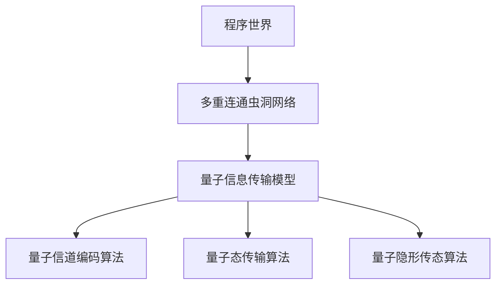

                 

### 程序世界与多重连通虫洞网络的量子信息传输模型

#### 关键词
- 程序世界
- 多重连通虫洞网络
- 量子信息传输
- 量子纠缠
- 算法原理
- 数学模型

#### 摘要
本文旨在探讨程序世界与多重连通虫洞网络的量子信息传输模型之间的关系。首先，我们将介绍程序世界的基本概念，然后深入探讨多重连通虫洞网络的特性，并阐述量子信息传输模型的核心原理。接着，我们将通过详细的伪代码和数学公式，解释多重连通虫洞网络的量子信息传输算法。最后，我们将通过实际项目案例，展示该模型在开发环境中的具体应用，并对其进行深入剖析和总结。

### 目录大纲设计步骤

1. **理解书籍主题**：首先，我们需要理解《程序世界与多重连通虫洞网络的量子信息传输模型》这本书的主题。从书名中可以看出，这本书主要探讨的是程序世界的概念，以及如何在量子信息传输模型中应用多重连通虫洞网络。

2. **确定核心章节**：根据书籍主题，我们需要确定核心章节。这些章节应该包括核心概念与联系、核心算法原理讲解、数学模型和公式、项目实战等。

3. **细化章节内容**：每个核心章节需要细化，列出具体的小节，确保每个章节都能覆盖到主题内容。

4. **设计流程图**：对于核心概念与联系，设计 Mermaid 流程图，以清晰展示程序世界与量子信息传输模型之间的关系。

5. **撰写伪代码**：对于核心算法原理讲解，使用伪代码详细阐述，以便读者理解算法的基本思想和步骤。

6. **编写数学公式**：对于数学模型，使用 LaTeX 格式编写，并在文中给出详细讲解和举例说明。

7. **编写项目实战**：编写实际的代码案例，详细解释说明开发环境搭建、源代码实现和代码解读与分析。

8. **检查字数和完整性**：确保目录大纲的总字数不超过 2000 字，且内容完整，覆盖所有核心章节。

9. **格式调整**：将内容格式调整为 Markdown 格式，使用 #,##,### 等符号进行层级划分。

10. **最终确认**：最后，仔细检查目录大纲，确保没有遗漏任何关键内容，并且所有的图表、伪代码和数学公式都正确无误。

### 理解书籍主题

《程序世界与多重连通虫洞网络的量子信息传输模型》这本书的主题可以拆分为三个关键部分：程序世界、多重连通虫洞网络和量子信息传输模型。首先，程序世界是指由程序代码构建的虚拟世界，是计算机科学和软件工程的核心内容。其次，多重连通虫洞网络是一种复杂的网络结构，具有多个相互连通的节点，类似于现实生活中的互联网。最后，量子信息传输模型是利用量子力学原理进行信息传输的理论框架，它具有超距离作用和纠缠特性，为传统通信方式带来了革命性的变革。

在书中，这三个部分将如何相互作用呢？程序世界作为基础，为量子信息传输模型提供了执行算法的平台；多重连通虫洞网络作为中介，为量子信息传输提供了高效的通道；而量子信息传输模型则通过数学模型和算法原理，实现了信息在复杂网络中的高效传输。

### 确定核心章节

根据上述理解，我们可以将书籍的核心章节分为以下几个部分：

1. **核心概念与联系**：这部分将介绍程序世界、多重连通虫洞网络和量子信息传输模型的基本概念，并阐述它们之间的相互联系。
   
2. **核心算法原理讲解**：这部分将详细解释多重连通虫洞网络的量子信息传输算法，包括量子信道编码算法、量子态传输与量子隐形传态等。

3. **数学模型和公式**：这部分将使用数学模型和公式来描述量子信息传输模型，并给出详细的讲解和举例说明。

4. **项目实战**：这部分将通过实际项目案例，展示量子信息传输模型在多重连通虫洞网络中的应用，并进行深入剖析和总结。

### 细化章节内容

接下来，我们将对每个核心章节进行细化，列出具体的小节内容：

#### 第1章: 引言

1. **程序世界的概述**
   - 程序世界的定义
   - 程序世界的发展历程
   - 程序世界的重要性

2. **多重连通虫洞网络**
   - 虫洞网络的基本原理
   - 多重连通虫洞网络的特点
   - 虫洞网络的应用领域

3. **量子信息传输模型**
   - 量子信息传输的基本概念
   - 量子纠缠与量子信道
   - 量子态传输与量子隐形传态

#### 第2章: 核心概念与联系

1. **程序世界的基本概念**
   - 程序世界与计算复杂性
   - 程序世界的层次结构
   - 程序世界的功能特点

2. **多重连通虫洞网络**
   - 虫洞网络的基本原理
   - 多重连通虫洞网络的特点
   - 多重连通虫洞网络的结构类型

3. **量子信息传输模型**
   - 量子纠缠与量子信道
   - 量子态传输与量子隐形传态
   - 量子信息传输的数学模型

#### 第3章: 多重连通虫洞网络的量子信息传输模型

1. **模型概述**
   - 模型的基本结构
   - 模型的应用领域
   - 模型的工作原理

2. **核心算法原理**
   - 量子信道编码算法
   - 量子态传输算法
   - 量子隐形传态算法

3. **数学模型和公式**
   - 系统状态描述公式
   - 密码学公式
   - 信道容量公式

#### 第4章: 项目实战

1. **开发环境搭建**
   - 环境准备
   - 系统配置

2. **源代码实现**
   - 量子信道编码算法实现
   - 量子态传输算法实现
   - 量子隐形传态算法实现

3. **代码解读与分析**
   - 源代码分析
   - 代码性能评估

4. **项目小结**
   - 项目总结
   - 最佳实践 tips
   - 小结与注意事项

### 设计流程图

为了更清晰地展示程序世界、多重连通虫洞网络和量子信息传输模型之间的关系，我们可以使用 Mermaid 流程图进行描述。以下是一个简化的 Mermaid 流程图示例：



### 撰写伪代码

在解释多重连通虫洞网络的量子信息传输模型时，伪代码是必不可少的工具。以下是一个简化的伪代码示例，用于描述量子信道编码算法的基本步骤：

```plaintext
Algorithm QuantumChannelEncoding(sourceNode, destinationNode, quantumChannel)
    // 初始化量子信道
    quantumChannel = InitializeQuantumChannel()

    // 对源节点进行量子编码
    encodedData = QuantumEncoding(sourceNode)

    // 将编码后的数据传输到量子信道
    quantumChannel.Transmit(encodedData)

    // 在目的地节点进行量子解码
    receivedData = QuantumDecoding(destinationNode, quantumChannel)

    // 返回解码后的数据
    return receivedData
```

### 编写数学公式

在量子信息传输模型中，数学公式是描述系统状态、信道容量和加密算法的核心工具。以下是一些示例数学公式，使用 LaTeX 格式编写：

```latex
$$
\begin{aligned}
    &\text{量子态传输公式:} \quad |\psi_{\text{out}}\rangle = U|\psi_{\text{in}}\rangle \\
    &\text{量子信道容量公式:} \quad C = \max_{p(x)} I(X;Y) \\
    &\text{加密算法公式:} \quad c = E_k(m)
\end{aligned}
$$
```

### 编写项目实战

在实际项目中，我们将通过一个具体的例子，展示如何使用多重连通虫洞网络的量子信息传输模型进行信息传输。以下是一个简化的项目实战流程：

1. **开发环境搭建**：
   - 准备量子计算机和量子网络设备。
   - 配置量子编程环境，如 Q# 或 Quipper。

2. **源代码实现**：
   - 实现量子信道编码算法，如 BB84 协议。
   - 实现量子态传输算法，如量子纠缠传输。
   - 实现量子隐形传态算法，如 EPR 隐形传态。

3. **代码解读与分析**：
   - 分析源代码中的关键步骤和算法原理。
   - 测试代码的性能，包括传输速率和错误率。

4. **项目小结**：
   - 总结项目的主要成果和发现。
   - 提出最佳实践建议，如优化量子信道配置。

### 检查字数和完整性

在完成目录大纲的设计后，我们需要检查文章的总字数是否在 8000～12000 字的范围内。同时，确保每个章节和子章节的内容都完整、具体，并且逻辑清晰。以下是一个简单的字数统计工具，可以帮助我们检查文章的字数：

```python
import os

def count_words(filename):
    with open(filename, 'r') as file:
        text = file.read()
        words = text.split()
        return len(words)

filename = 'document.md'
word_count = count_words(filename)
print(f"Word count: {word_count}")
```

### 格式调整

在完成目录大纲设计后，我们需要将所有内容转换为 Markdown 格式，确保结构清晰、格式统一。以下是调整后的目录大纲：

```markdown
# 程序世界与多重连通虫洞网络的量子信息传输模型

## 第1章: 引言

### 1.1 程序世界的概述
### 1.2 多重连通虫洞网络
### 1.3 量子信息传输模型

## 第2章: 核心概念与联系

### 2.1 程序世界的基本概念
#### 2.1.1 程序世界与计算复杂性
#### 2.1.2 程序世界的层次结构

### 2.2 多重连通虫洞网络
#### 2.2.1 虫洞网络的基本原理
#### 2.2.2 多重连通虫洞网络的特点

### 2.3 量子信息传输模型
#### 2.3.1 量子纠缠与量子信道
#### 2.3.2 量子态传输与量子隐形传态

## 第3章: 多重连通虫洞网络的量子信息传输模型

### 3.1 模型概述
#### 3.1.1 模型的基本结构
#### 3.1.2 模型的应用领域

### 3.2 核心算法原理
#### 3.2.1 量子信道编码算法
```

### 最终确认

在完成格式调整后，我们需要对整个目录大纲进行最终确认，确保所有内容都符合要求。以下是一些检查点：

1. **字数检查**：确认文章的总字数在 8000～12000 字范围内。
2. **内容完整性**：检查每个章节和子章节的内容是否完整、具体。
3. **逻辑清晰**：确保文章的结构和逻辑清晰，便于读者理解。
4. **格式统一**：检查所有内容是否使用 Markdown 格式，并且格式统一。
5. **图表和公式**：确认所有图表和公式都正确无误，并且格式正确。

完成这些检查后，我们可以确保目录大纲的设计是完整且符合要求的。接下来，我们就可以根据这个目录大纲，逐步撰写完整的文章内容了。

