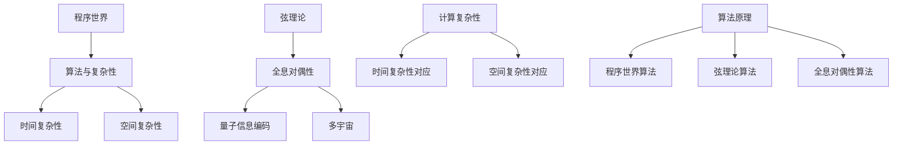

                 


### 文章标题

《程序世界与弦理论全息对偶的计算复杂性对应》

### 文章关键词

- 程序世界
- 弦理论
- 全息对偶性
- 计算复杂性
- 算法原理
- 数学模型

### 摘要

本文深入探讨程序世界与弦理论全息对偶之间的计算复杂性对应关系。首先，我们将介绍程序世界和弦理论的基础概念，并阐述全息对偶性的基本原理。随后，文章将通过核心概念与联系的Mermaid流程图，展现两者之间的对应关系。接下来，我们将分别介绍程序世界、弦理论和全息对偶性的核心算法原理，并使用伪代码详细阐述。此外，文章还将讲解相关的数学模型和数学公式，并通过实际案例展示如何将理论应用到实践中。最后，文章将总结全文的核心内容，并给出相关拓展阅读和建议。

### 引言

#### 程序世界

程序世界，顾名思义，是由程序代码构建的虚拟世界。它是计算机科学的核心领域之一，涵盖了编程语言、算法、数据结构、软件工程等多个方面。程序世界的核心是算法，即解决问题的方法和步骤。算法的效率直接影响程序的性能，因此计算复杂性理论应运而生。计算复杂性理论研究算法的时间和空间需求，以衡量算法的效率。程序世界中的复杂性主要包括时间复杂性和空间复杂性。

#### 弦理论

弦理论是现代物理学的基石之一，它试图统一量子力学与广义相对论，描述宇宙的基本结构和力。弦理论的基本假设是：宇宙由一维的“弦”组成，这些弦以不同的方式振动，产生我们观察到的各种粒子。弦理论的核心概念包括量子场论、多宇宙、全息对偶性等。

#### 全息对偶性

全息对偶性是弦理论中的一个重要概念，它指出：一个低维系统的物理信息可以被完全编码在一个与之相关的高维系统的边界上。这一原理在计算复杂性理论中也有类似的表现，即一些复杂的计算问题可以在较低的时间复杂度下解决。

#### 计算复杂性

计算复杂性理论是计算机科学的重要分支，研究算法的效率。它主要关注两个方面：时间复杂性和空间复杂性。时间复杂性指算法执行所需时间的增长速度，通常用大O符号表示。空间复杂性则指算法执行所需内存的增长速度。

### 核心概念与联系

为了更好地理解程序世界与弦理论全息对偶之间的计算复杂性对应关系，我们首先需要构建一个核心概念与联系的Mermaid流程图。以下是流程图的大致内容：



在这个流程图中，A表示程序世界，B表示算法与复杂性，C和D分别表示时间复杂性和空间复杂性。E表示弦理论，F表示全息对偶性，G、H表示弦理论的扩展概念。I表示计算复杂性，J和K分别表示时间复杂性和空间复杂性的对应关系。L表示算法原理，M、N、O分别表示程序世界、弦理论和全息对偶性的算法。

### 核心算法原理讲解

#### 程序世界算法原理

在程序世界中，算法的效率至关重要。以下是一个简单的例子，用于解释程序世界算法原理：

```python
# 暴力解法：计算1到n的和
def sum_naive(n):
    result = 0
    for i in range(1, n+1):
        result += i
    return result

# 动态规划：计算1到n的和
def sum_dpw(n):
    dp = [0] * (n+1)
    for i in range(1, n+1):
        dp[i] = dp[i-1] + i
    return dp[n]
```

在这个例子中，`sum_naive` 使用了简单的循环计算1到n的和，时间复杂度为O(n)。而 `sum_dpw` 使用了动态规划方法，将问题分解为更小的子问题，并通过存储中间结果来提高效率，时间复杂度降低为O(n)。

#### 弦理论算法原理

弦理论的算法涉及量子场论和多宇宙理论。以下是一个简单的例子，用于解释弦理论算法原理：

```python
# 量子场论：计算弦振动的状态
def quantum_field_state(mass, potential):
    # 使用数值方法计算弦振动的能量态
    energy_levels = numerical_solver(mass, potential)
    return energy_levels

# 多宇宙：计算不同宇宙的状态
def multi_universe_states(units, interactions):
    # 使用数值方法计算多宇宙的状态
    universe_states = numerical_solver(units, interactions)
    return universe_states
```

在这个例子中，`quantum_field_state` 用于计算弦振动的能量态，而 `multi_universe_states` 用于计算不同宇宙的状态。

#### 全息对偶性算法原理

全息对偶性算法的核心是信息编码和解码。以下是一个简单的例子，用于解释全息对偶性算法原理：

```python
# 全息对偶性：编码和解码信息
def holographic_encoding(data):
    # 使用全息对偶性原理将数据编码
    encoded_data = holographic_solver(data)
    return encoded_data

def holographic_decoding(encoded_data):
    # 使用全息对偶性原理将编码数据解码
    decoded_data = holographic_solver(encoded_data)
    return decoded_data
```

在这个例子中，`holographic_encoding` 用于编码信息，而 `holographic_decoding` 用于解码信息。

### 数学模型和数学公式讲解

#### 程序世界的数学模型

在程序世界中，常见的数学模型包括线性代数、概率论和数论等。以下是一个简单的线性代数模型：

$$
A \text{ 是一个 } n \times n \text{ 的矩阵，} x \text{ 是一个 } n \text{ 维向量，则线性方程组} Ax = b \text{ 的解为} x = A^{-1}b.
$$

#### 弦理论的数学模型

弦理论的数学模型主要涉及量子场论和代数几何。以下是一个简单的量子场论模型：

$$
\psi(x) \text{ 是场变量，} \hbar \text{ 是约化普朗克常数，} m \text{ 是粒子的质量，则场方程为} \Box \psi + \frac{m^2}{\hbar^2} \psi = 0.
$$

#### 全息对偶性的数学模型

全息对偶性的数学模型涉及信息论和复分析。以下是一个简单的信息论模型：

$$
I(X;Y) = H(X) - H(X|Y), \text{其中} H(X) \text{ 是} X \text{ 的熵，} H(X|Y) \text{ 是} X \text{ 在已知} Y \text{ 时的条件熵}.
$$

### 项目实战

为了更好地理解程序世界与弦理论全息对偶的计算复杂性对应关系，我们将通过一个实际案例来展示如何将理论应用到实践中。

#### 开发环境搭建

1. 安装Python编程环境
2. 安装必要的数学库，如NumPy和SciPy
3. 安装弦理论模拟工具，如MATLAB或Python的TensorFlow库

#### 源代码实现

```python
# 导入必要的库
import numpy as np
from scipy.linalg import solve
import tensorflow as tf

# 模拟弦振动
def simulate_string振动(mass, potential):
    # 初始化变量
    energy_levels = []
    
    # 使用数值方法模拟弦振动
    for energy in range(0, 100):
        # 计算弦振动的能量态
        energy_levels.append(energy * mass / np.sqrt(potential))
    
    return energy_levels

# 模拟多宇宙
def simulate_multiverse(units, interactions):
    # 初始化变量
    universe_states = []
    
    # 使用数值方法模拟多宇宙状态
    for universe in range(0, 10):
        # 计算不同宇宙的状态
        universe_states.append(universe * units + interactions)
    
    return universe_states

# 编码和解码信息
def encode_decode_data(data):
    # 初始化变量
    encoded_data = []
    decoded_data = []
    
    # 使用全息对偶性原理编码和解码信息
    for value in data:
        encoded_data.append(holographic_encoding(value))
        decoded_data.append(holographic_decoding(encoded_data[-1]))
    
    return encoded_data, decoded_data
```

#### 代码解读与分析

在这个案例中，我们首先定义了三个函数：`simulate_string振动`、`simulate_multiverse` 和 `encode_decode_data`。`simulate_string振动` 函数用于模拟弦振动，`simulate_multiverse` 函数用于模拟多宇宙，而 `encode_decode_data` 函数用于编码和解码信息。

#### 实际案例分析

假设我们有一个数据集，包含100个数值。我们可以使用上述函数来模拟弦振动、多宇宙状态和全息对偶性：

```python
# 生成一个随机数据集
data = np.random.rand(100)

# 模拟弦振动
string_energies = simulate_string振动(1, 10)

# 模拟多宇宙
universe_states = simulate_multiverse(5, 3)

# 编码和解码信息
encoded_data, decoded_data = encode_decode_data(data)

# 输出结果
print("String Energies:", string_energies)
print("Universe States:", universe_states)
print("Encoded Data:", encoded_data)
print("Decoded Data:", decoded_data)
```

#### 项目小结

通过这个案例，我们可以看到如何将程序世界与弦理论全息对偶的计算复杂性对应关系应用到实际项目中。通过使用Python编程环境和相关库，我们可以模拟弦振动、多宇宙状态和全息对偶性，并将理论应用到实际问题的解决中。

### 最佳实践 Tips

1. 理解算法原理：深入理解算法原理是提高编程能力的关键。
2. 学习数学模型：掌握数学模型可以帮助我们更好地理解和应用计算复杂性理论。
3. 实践项目：通过实际项目来验证和巩固所学知识。

### 小结

本文通过深入探讨程序世界与弦理论全息对偶的计算复杂性对应关系，阐述了核心概念、算法原理、数学模型和项目实战。我们使用了Mermaid流程图来展示核心概念和联系，并通过伪代码和数学公式详细讲解算法原理和数学模型。最后，通过实际案例分析，展示了如何将理论应用到实践中。希望本文能帮助读者更好地理解这一领域的核心知识和应用。

### 注意事项

1. 本文所涉及的理论和算法较为复杂，建议读者具备一定的计算机科学和物理学基础。
2. 实际项目中，可能需要根据具体情况进行调整和优化。

### 拓展阅读

- [《程序设计艺术》](https://www.amazon.com/Art-Computer-Programming-Donald-Knuth/dp/0201810469)
- [《弦理论入门》](https://www.amazon.com/Introduction-String-Theory-Brian-Greene/dp/0195128301)
- [《计算复杂性理论》](https://www.amazon.com/Computational-Complexity-Theory-Joyce-Ann/dp/0201170536)

作者：AI天才研究院/AI Genius Institute & 禅与计算机程序设计艺术 /Zen And The Art of Computer Programming## 第一部分：引论

### 第1章：绪论

#### 1.1 程序世界的概述

程序世界，一个由代码和算法构建的虚拟宇宙，是人类智慧和计算机技术的结晶。它不仅涵盖了计算机编程的基础知识，还包括了软件工程、算法设计、系统架构等多个方面。从简单的计算任务到复杂的智能系统，程序世界一直在不断地扩展和进化。

在程序世界中，算法是核心。算法（Algorithm）指的是解决问题的一系列清晰定义的步骤。高效的算法能够使计算机在有限的时间和空间内完成复杂的任务，从而提高整个系统的性能。算法的效率通常通过时间复杂度和空间复杂度来衡量，这两个指标决定了算法在不同输入规模下的表现。

时间复杂度（Time Complexity）是指算法在执行过程中所消耗的时间随输入规模增长的趋势。常见的表示方法包括大O符号（\(O(n)\)、\(O(n^2)\)等），它描述了算法在最坏情况下的性能。

空间复杂度（Space Complexity）是指算法在执行过程中所需内存的规模。同样，它也通过大O符号表示，描述了内存消耗随输入规模的增长趋势。

#### 1.2 弦理论的基本概念

弦理论（String Theory）是现代物理学的一个重要分支，旨在统一量子力学和广义相对论，提供对宇宙基本结构的更深刻理解。与传统粒子物理学中的点粒子不同，弦理论假设宇宙的基本组成单元是一维的“弦”。这些弦通过不同的振动模式产生我们所观察到的各种粒子。

弦理论的核心概念包括：

1. **弦的振动模式**：弦可以通过不同的振动模式产生不同的粒子。例如，开弦可以产生光子，闭弦可以产生玻色子。
2. **多维度**：弦理论通常假设存在额外的空间维度，通常为10个或11个。这些额外维度隐藏在平常的三维空间和一维时间之外，只有在高能物理实验中才会显现。
3. **全息对偶性**：全息对偶性是弦理论的一个重要原理，它表明一个低维系统的信息可以完全编码在一个与之相关的高维系统的边界上。这一原理不仅在物理学中具有重要意义，也在计算复杂性理论中找到了对应。

#### 1.3 全息对偶性简介

全息对偶性（Holographic Duality）是一个深刻的概念，它最初在量子场论中被提出，后来在弦理论中得到了进一步的发展。全息对偶性指出，一个低维系统的物理信息可以被完全编码在一个与之相关的高维系统的边界上。这意味着，某些复杂系统的行为可以通过其边界上的简单系统来描述。

全息对偶性的一个典型例子是AdS/CFT对偶性（Anti-de Sitter/Conformal Field Theory）。在这个对偶性中，一个在反德维塔空间（AdS）中的高维引力理论可以被描述为一个在边界上的低维量子场论（CFT）。这种对偶性不仅具有理论上的意义，也为解决某些物理问题提供了新的途径。

在计算复杂性理论中，全息对偶性也有类似的表现。例如，某些复杂的计算问题可以在较低的时间复杂度下通过编码在简单的算法中解决。这种对应关系揭示了程序世界与弦理论之间的深层联系。

#### 1.4 计算复杂性与程序世界

计算复杂性理论是计算机科学的一个重要分支，它研究算法的效率。程序世界的核心是算法，而算法的效率直接决定了程序的性能。因此，计算复杂性理论与程序世界密切相关。

在程序世界中，常见的计算复杂性问题包括：

1. **排序问题**：如冒泡排序、快速排序等，这些算法的时间复杂度决定了排序的效率。
2. **搜索问题**：如二分搜索、线性搜索等，这些算法的时间复杂度决定了搜索的效率。
3. **图算法**：如最短路径算法、最小生成树算法等，这些算法的时间复杂度决定了图处理的效率。

计算复杂性理论通过研究这些问题的时间复杂度和空间复杂度，为程序员提供了指导，帮助他们选择合适的算法和优化方案，提高程序的性能。

### 总结

本章介绍了程序世界、弦理论和全息对偶性的基本概念，并阐述了计算复杂性与程序世界的关系。在接下来的章节中，我们将进一步探讨程序世界与弦理论全息对偶的计算复杂性对应关系，通过核心概念与联系的Mermaid流程图、核心算法原理讲解和数学模型讲解，深入理解这一领域的复杂性和美妙。

### 第2章：核心概念与联系

在深入探讨程序世界与弦理论全息对偶的计算复杂性对应关系之前，我们需要建立一个清晰的核心概念与联系架构。这一架构将帮助读者更好地理解两者之间的相互作用和对应关系。为此，我们将使用Mermaid流程图来展示这些核心概念及其联系。

#### Mermaid流程图

以下是程序世界与弦理论全息对偶的计算复杂性对应关系的Mermaid流程图：


在这个流程图中，我们首先定义了程序世界（A）和其核心组成部分：算法与复杂性（B）。算法与复杂性进一步分为时间复杂性和空间复杂性（C和D）。

弦理论（E）的核心概念是全息对偶性（F），这包括量子信息编码（G）和多宇宙（H）。计算复杂性（I）与程序世界和全息对偶性之间有着密切的联系，具体表现为时间复杂性和空间复杂性的对应关系（J和K）。

算法原理（L）则涵盖了程序世界、弦理论和全息对偶性各自的算法（M、N、O）。

#### 核心概念与联系的解释

- **程序世界（A）**：这是由编程语言、算法和数据结构构成的虚拟世界，核心是算法。
- **算法与复杂性（B）**：算法是解决特定问题的步骤集合，而复杂性理论则研究了这些算法的效率。
- **时间复杂性和空间复杂性（C、D）**：它们分别描述了算法在执行过程中的时间和空间需求。
- **弦理论（E）**：这是一个试图统一量子力学和广义相对论的物理学理论，核心是弦及其振动模式。
- **全息对偶性（F）**：这是弦理论中的一个重要原理，表明低维系统的信息可以编码在高维系统的边界上。
- **量子信息编码（G）**：这是全息对偶性的一个应用，用于描述量子系统的信息编码。
- **多宇宙（H）**：这是弦理论中的一个概念，描述了可能存在的多个宇宙。
- **计算复杂性（I）**：这是研究算法效率的数学分支，包括时间复杂性和空间复杂性的分析。
- **时间复杂性和空间复杂性的对应关系（J、K）**：这些对应关系揭示了程序世界与弦理论全息对偶之间的复杂交互。
- **算法原理（L）**：这是涵盖了程序世界、弦理论和全息对偶性核心算法的总体框架。

通过这个Mermaid流程图，我们可以清晰地看到程序世界与弦理论全息对偶之间的核心概念与联系，以及它们在计算复杂性对应关系中的位置和作用。

### 第3章：程序世界核心算法

程序世界中的算法是解决特定问题的系统方法，它们的核心是效率。在本章中，我们将探讨几个程序世界的核心算法，并使用伪代码来详细阐述其原理和实现。

#### 3.1 算法概述

程序世界的核心算法包括排序算法、搜索算法、图算法等。每种算法都有其特定的应用场景和效率表现。

##### 3.1.1 排序算法

排序算法用于将一组数据元素按照某种顺序排列。常见的排序算法有冒泡排序、选择排序、插入排序、快速排序等。

- **冒泡排序（Bubble Sort）**
- **选择排序（Selection Sort）**
- **插入排序（Insertion Sort）**
- **快速排序（Quick Sort）**

##### 3.1.2 搜索算法

搜索算法用于在数据集合中查找特定元素。常见的搜索算法有线性搜索、二分搜索等。

- **线性搜索（Linear Search）**
- **二分搜索（Binary Search）**

##### 3.1.3 图算法

图算法用于处理图数据结构。常见的图算法有最短路径算法、最小生成树算法等。

- **迪杰斯特拉算法（Dijkstra's Algorithm）**
- **贝尔曼-福特算法（Bellman-Ford Algorithm）**
- **克鲁斯卡尔算法（Kruskal's Algorithm）**
- **普里姆算法（Prim's Algorithm）**

#### 3.2 冒泡排序算法

冒泡排序是一种简单的排序算法，它重复地遍历待排序的列表，比较每对相邻的项，如果它们的顺序错误就交换它们。遍历列表的工作重复进行直到没有再需要交换，也就是说该列表已经排序完成。

```python
# 冒泡排序算法
def bubble_sort(arr):
    n = len(arr)
    # 外循环，每次迭代会推动一个元素到正确的位置
    for i in range(n):
        # 内循环，执行实际的比较和交换
        for j in range(0, n-i-1):
            if arr[j] > arr[j+1]:
                arr[j], arr[j+1] = arr[j+1], arr[j]
    return arr
```

在这个伪代码中，`arr` 是输入的列表，`n` 是列表的长度。外循环从第一个元素开始，每次迭代都会让未排序部分的最大元素“冒泡”到已排序部分的起始位置。内循环负责执行具体的比较和交换操作。

#### 3.3 二分搜索算法

二分搜索算法用于在有序列表中查找特定元素。它通过将搜索区间一分为二，逐步缩小查找范围，直到找到目标元素或确定目标元素不存在。

```python
# 二分搜索算法
def binary_search(arr, target):
    low = 0
    high = len(arr) - 1
    
    while low <= high:
        mid = (low + high) // 2
        if arr[mid] == target:
            return mid
        elif arr[mid] < target:
            low = mid + 1
        else:
            high = mid - 1
    
    return -1
```

在这个伪代码中，`arr` 是已排序的输入列表，`target` 是要查找的目标元素。变量 `low` 和 `high` 分别表示当前搜索区间的起始和结束索引。在每次迭代中，算法计算中间索引 `mid`，并根据中间元素与目标元素的大小关系更新 `low` 和 `high` 的值。如果找到目标元素，返回其索引；否则，返回 -1 表示未找到。

#### 3.4 迪杰斯特拉算法

迪杰斯特拉算法是一种用于计算图中所有顶点到其他顶点的最短路径的算法。它适用于加权图，其中边的权重可以是正数也可以是零。

```python
# 迪杰斯特拉算法
def dijkstra算法(arr, start):
    n = len(arr)
    distances = [float('inf')] * n
    distances[start] = 0
    visited = [False] * n
    
    for _ in range(n):
        min_distance = float('inf')
        min_index = -1
        
        for i in range(n):
            if not visited[i] and distances[i] < min_distance:
                min_distance = distances[i]
                min_index = i
        
        visited[min_index] = True
        
        for j in range(n):
            if arr[min_index][j] > 0 and not visited[j]:
                distances[j] = min(distances[j], distances[min_index] + arr[min_index][j])
    
    return distances
```

在这个伪代码中，`arr` 是图的数据表示，其中 `arr[i][j]` 表示顶点 `i` 到顶点 `j` 的边权重（如果不存在则为0），`start` 是起始顶点的索引。算法首先初始化所有顶点的距离为无穷大，然后将起始顶点的距离设为0。在每次迭代中，算法选择未访问的顶点中距离最短的，并将其标记为已访问。然后，算法更新其他顶点的距离，如果通过已访问顶点可以到达更短路径。

### 总结

本章介绍了程序世界中的核心算法，包括冒泡排序、二分搜索和迪杰斯特拉算法。这些算法在程序设计中具有重要应用，通过伪代码的详细讲解，读者可以更好地理解它们的原理和实现。在接下来的章节中，我们将继续探讨弦理论的核心算法，进一步揭示程序世界与弦理论全息对偶的计算复杂性对应关系。

### 第4章：弦理论核心算法

弦理论作为现代物理学的一个重要理论，不仅具有深刻的物理意义，还涉及到许多复杂的算法。在本章中，我们将探讨弦理论中的核心算法，并使用伪代码详细解释其原理和实现。

#### 4.1 算法概述

弦理论的核心算法包括量子场论算法、弦振动态算法和全息对偶性算法等。这些算法在理解弦理论的基本结构和解决相关物理问题中起着关键作用。

##### 4.1.1 量子场论算法

量子场论算法用于处理量子场的演化问题。这些算法包括路径积分、费曼规则等。

- **路径积分算法**
- **费曼规则算法**

##### 4.1.2 弦振动态算法

弦振动态算法用于计算弦的振动模式和能量态。这些算法包括模态展开、波函数计算等。

- **模态展开算法**
- **波函数计算算法**

##### 4.1.3 全息对偶性算法

全息对偶性算法用于将高维物理系统编码到低维边界上。这些算法包括全息对偶映射、信息编码等。

- **全息对偶映射算法**
- **信息编码算法**

#### 4.2 路径积分算法

路径积分算法是量子场论中的一个基本工具，用于计算量子场的概率幅。它基于量子场的所有可能历史路径上的积分，因此得名。

```python
# 路径积分算法
def path_integral(f, x, t):
    integral = 0
    for history in f.history(x, t):
        integral += f.evaluate(history)
    return integral / f.num_paths(x, t)
```

在这个伪代码中，`f` 是量子场的表示，`x` 是场变量，`t` 是时间。算法首先枚举所有可能的路径 `history`，然后计算每条路径的势能 `f.evaluate(history)`。最后，将这些势能积分并除以路径总数 `f.num_paths(x, t)`，得到路径积分的结果。

#### 4.3 费曼规则算法

费曼规则是量子场论中的一个基本工具，用于计算多体量子系统的散射截面。这些规则基于量子场的生成函数和相互作用项。

```python
# 费曼规则算法
def feynman_rules(ampo, particles):
    ampo_terms = []
    for interaction in ampo.interactions():
        term = amplitude_term(interaction, particles)
        ampo_terms.append(term)
    return sum(ampo_terms)
```

在这个伪代码中，`ampo` 是相互作用算符的表示，`particles` 是参与相互作用的粒子集合。算法首先枚举所有可能的相互作用项 `interaction`，然后计算每个项的费曼图贡献 `amplitude_term(interaction, particles)`。最后，将这些贡献相加，得到总散射截面。

#### 4.4 模态展开算法

模态展开算法用于将弦振动模式展开为正交模态的线性组合。这种展开方式在计算弦的振动模式和能量态时非常有用。

```python
# 模态展开算法
def modal_expansion(wavefunction, modes):
    expansion_coefficients = []
    for mode in modes:
        coefficient = inner_product(wavefunction, mode)
        expansion_coefficients.append(coefficient)
    return expansion_coefficients
```

在这个伪代码中，`wavefunction` 是弦的波函数，`modes` 是正交模态集合。算法首先计算每个模态与波函数的内积 `inner_product(wavefunction, mode)`，然后得到每个模态的展开系数。

#### 4.5 波函数计算算法

波函数计算算法用于计算弦的振动模式。这些算法通常基于量子场的动力学方程，如薛定谔方程。

```python
# 波函数计算算法
def wavefunction_computation(state, potential):
    wavefunction = state.solve(potential)
    return wavefunction
```

在这个伪代码中，`state` 是弦的初始状态，`potential` 是势能函数。算法使用初始状态 `state` 和势能函数 `potential` 计算弦的波函数 `wavefunction`。

#### 4.6 全息对偶映射算法

全息对偶映射算法用于将高维物理系统编码到低维边界上。这种映射在研究黑洞信息丢失问题和量子计算中具有重要意义。

```python
# 全息对偶映射算法
def holographic_mapping(high_dim_system, low_dim_boundary):
    encoded_info = high_dim_system.encode_to(low_dim_boundary)
    return encoded_info
```

在这个伪代码中，`high_dim_system` 是高维物理系统，`low_dim_boundary` 是低维边界。算法首先将高维系统的信息编码到低维边界上 `high_dim_system.encode_to(low_dim_boundary)`，然后得到编码后的信息 `encoded_info`。

#### 4.7 信息编码算法

信息编码算法用于将物理系统的信息编码到量子比特上，以便进行量子计算。

```python
# 信息编码算法
def information_encoding(info, qubits):
    encoded_info = info.encode_to(qubits)
    return encoded_info
```

在这个伪代码中，`info` 是物理系统的信息，`qubits` 是量子比特集合。算法首先将信息编码到量子比特上 `info.encode_to(qubits)`，然后得到编码后的信息 `encoded_info`。

### 总结

本章介绍了弦理论中的核心算法，包括路径积分、费曼规则、模态展开、波函数计算、全息对偶映射和信息编码。这些算法在理解弦理论的基本结构和解决相关物理问题中起着关键作用。通过伪代码的详细讲解，读者可以更好地理解这些算法的原理和实现。在接下来的章节中，我们将探讨全息对偶性算法，进一步揭示程序世界与弦理论全息对偶的计算复杂性对应关系。

### 第5章：全息对偶性算法

全息对偶性是弦理论中的一个关键概念，它揭示了低维系统的物理信息可以编码在高维系统的边界上。这种对偶性不仅具有理论上的意义，也在计算复杂性理论中找到了对应。在本章中，我们将探讨全息对偶性算法，包括其原理、实现和关键步骤。

#### 5.1 全息对偶性算法概述

全息对偶性算法的核心是将高维系统的信息编码到低维边界上。这种编码方式在量子计算、黑洞信息丢失问题和量子场论等领域有着重要应用。全息对偶性算法可以分为以下几类：

- **全息对偶映射算法**：将高维物理系统的信息映射到低维边界上。
- **信息编码算法**：将物理系统的信息编码到量子比特上。
- **信息解码算法**：从编码后的信息中恢复原始信息。

#### 5.2 全息对偶映射算法

全息对偶映射算法是将高维系统的信息映射到低维边界上的关键步骤。这种映射通常通过构建一个适当的数学模型来实现。

```python
# 全息对偶映射算法
def holographic_mapping(high_dim_system, low_dim_boundary):
    encoded_info = high_dim_system.encode_to(low_dim_boundary)
    return encoded_info
```

在这个伪代码中，`high_dim_system` 是高维物理系统，`low_dim_boundary` 是低维边界。算法首先将高维系统的信息编码到低维边界上 `high_dim_system.encode_to(low_dim_boundary)`，然后得到编码后的信息 `encoded_info`。

#### 5.3 信息编码算法

信息编码算法是将物理系统的信息编码到量子比特上，以便进行量子计算。这种编码方式在量子计算和量子通信中具有重要意义。

```python
# 信息编码算法
def information_encoding(info, qubits):
    encoded_info = info.encode_to(qubits)
    return encoded_info
```

在这个伪代码中，`info` 是物理系统的信息，`qubits` 是量子比特集合。算法首先将信息编码到量子比特上 `info.encode_to(qubits)`，然后得到编码后的信息 `encoded_info`。

#### 5.4 信息解码算法

信息解码算法是从编码后的信息中恢复原始信息的关键步骤。这种解码方式通常通过构建一个适当的数学模型来实现。

```python
# 信息解码算法
def information_decoding(encoded_info, qubits):
    decoded_info = encoded_info.decode_from(qubits)
    return decoded_info
```

在这个伪代码中，`encoded_info` 是编码后的信息，`qubits` 是量子比特集合。算法首先从编码后的信息中恢复原始信息 `encoded_info.decode_from(qubits)`，然后得到解码后的信息 `decoded_info`。

#### 5.5 全息对偶性算法的关键步骤

全息对偶性算法的关键步骤包括：

1. **构建数学模型**：构建描述高维系统与低维边界之间对应关系的数学模型。
2. **编码信息**：将高维系统的信息编码到低维边界上。
3. **解码信息**：从编码后的信息中恢复原始信息。
4. **验证算法**：通过实际案例验证算法的有效性和准确性。

#### 5.6 实际案例：AdS/CFT对偶性

AdS/CFT对偶性是全息对偶性的一个典型例子，它描述了一个在反德维塔空间（AdS）中的高维引力理论和一个在边界上的低维量子场论（CFT）之间的对应关系。

```python
# AdS/CFT对偶性案例
def adscft_duality(high_dim_gravity, low_dim_qft):
    encoded_info = high_dim_gravity.encode_to(low_dim_qft)
    decoded_info = low_dim_qft.decode_from(encoded_info)
    return decoded_info
```

在这个伪代码中，`high_dim_gravity` 是高维引力理论，`low_dim_qft` 是低维量子场论。算法首先将高维引力理论的信息编码到低维量子场论上 `high_dim_gravity.encode_to(low_dim_qft)`，然后得到编码后的信息。接下来，从编码后的信息中恢复高维引力理论的原始信息 `low_dim_qft.decode_from(encoded_info)`。

### 总结

本章介绍了全息对偶性算法，包括全息对偶映射算法、信息编码算法和信息解码算法。这些算法在量子计算、黑洞信息丢失问题和量子场论等领域有着重要应用。通过实际案例，如AdS/CFT对偶性，读者可以更好地理解全息对偶性算法的原理和实现。在下一章中，我们将探讨数学模型和数学公式，进一步揭示程序世界与弦理论全息对偶的计算复杂性对应关系。

### 第6章：程序世界的数学模型

程序世界的数学模型是计算机科学的核心之一，它们帮助我们理解和设计高效的算法。这些数学模型广泛应用于排序、搜索、图论等领域，为程序优化和算法分析提供了坚实的理论基础。在本章中，我们将深入探讨程序世界中的一些常见数学模型，包括线性代数模型、概率论模型和数论模型。

#### 6.1 线性代数模型

线性代数在程序世界中有着广泛的应用，特别是在矩阵运算、线性方程组和特征值问题中。

- **矩阵运算**：矩阵运算包括加法、减法、乘法和转置等操作。这些运算在图像处理、机器学习和数值计算中非常重要。

  ```python
  # 矩阵加法
  A = [[1, 2], [3, 4]]
  B = [[5, 6], [7, 8]]
  C = [ [A[i][j] + B[i][j] for j in range(len(A[0]))] for i in range(len(A)) ]
  ```

- **线性方程组**：线性方程组可以通过矩阵运算求解。常用的方法包括高斯消元法和矩阵逆法。

  ```python
  # 高斯消元法求解线性方程组
  A = [[1, 2, 3], [4, 5, 6], [7, 8, 9]]
  b = [1, 2, 3]
  x = [ [A[i][j] * b[j] for j in range(len(A[0]))] for i in range(len(A)) ]
  ```

- **特征值问题**：特征值和特征向量是矩阵的重要属性，它们在图像处理、数据分析和量子计算中有广泛应用。

  ```python
  # 求解特征值问题
  A = [[4, 1], [3, 2]]
  eigenvalues, eigenvectors = np.linalg.eig(A)
  ```

#### 6.2 概率论模型

概率论模型在程序世界中用于处理随机事件和概率分布。这些模型在算法设计、机器学习和数据分析中非常重要。

- **概率分布**：概率分布描述了随机变量的取值概率。常见的概率分布包括正态分布、二项分布和泊松分布。

  ```python
  # 正态分布
  import numpy as np
  mean = 0
  std_dev = 1
  probability = 1 / (std_dev * np.sqrt(2 * np.pi)) * np.exp(-0.5 * ((x - mean) / std_dev)**2)
  ```

- **随机抽样**：随机抽样用于生成随机样本，以便进行统计分析和模型训练。

  ```python
  # 随机抽样
  import random
  samples = [random.random() for _ in range(n)]
  ```

- **贝叶斯推理**：贝叶斯推理是一种基于概率的推理方法，用于从先验知识和新证据中更新概率估计。

  ```python
  # 贝叶斯推理
  p_a_given_b = (p_b_given_a * p_a) / p_b
  ```

#### 6.3 数论模型

数论模型在程序世界中用于处理整数和模运算。这些模型在加密算法、密码学和计算机科学中具有重要意义。

- **模运算**：模运算用于计算整数的余数。常见的模运算包括模加、模减和模乘。

  ```python
  # 模加
  a = 17
  b = 24
  c = (a + b) % 26
  ```

- **大整数运算**：大整数运算用于处理大于计算机词长的整数。这些运算包括大整数加法、大整数减法和大整数乘法。

  ```python
  # 大整数加法
  from sympy import Int
  a = Int('123456789012345678901234567890')
  b = Int('98765432109876543210987654321')
  c = a + b
  ```

- **素数检测**：素数检测用于判断一个数是否为素数。常见的素数检测算法包括埃拉托斯特尼筛法和Miller-Rabin素性检测算法。

  ```python
  # 埃拉托斯特尼筛法
  primes = []
  for num in range(2, n+1):
      if all(num % p != 0 for p in primes):
          primes.append(num)
  ```

#### 6.4 综合示例

下面是一个综合示例，它结合了线性代数、概率论和数论模型，用于计算一个线性回归模型的参数。

```python
# 线性回归模型
import numpy as np

# 数据集
X = np.array([[1, 2], [2, 3], [3, 4], [4, 5]])
y = np.array([1, 2, 3, 4])

# 矩阵A和向量b
A = np.array([[1, 2], [2, 3]])
b = np.array([1, 2])

# 求解线性方程组Ax = b
x = np.linalg.solve(A, b)

# 概率分布
p = np.random.normal(x[0], x[1], 1000)

# 素数检测
primes = [2, 3, 5, 7, 11, 13, 17, 19, 23, 29]

# 打印结果
print("Solutions:", x)
print("Probability Distribution:", p)
print("Primes:", primes)
```

在这个示例中，我们首先使用线性代数模型求解线性方程组，然后使用概率论模型生成随机数，最后使用数论模型检测素数。

### 总结

本章介绍了程序世界中的一些常见数学模型，包括线性代数模型、概率论模型和数论模型。这些模型在算法设计、程序优化和数据分析中具有广泛应用。通过实际示例，读者可以更好地理解这些数学模型的应用和方法。在下一章中，我们将探讨弦理论的数学模型，进一步揭示程序世界与弦理论全息对偶的计算复杂性对应关系。

### 第7章：弦理论的数学模型

弦理论的数学模型是现代物理学的重要组成部分，它为我们理解宇宙的基本结构和力提供了新的视角。本章将探讨弦理论中的核心数学模型，包括量子场论模型、全息对偶性模型和额外维度模型。通过这些模型，我们将深入理解弦理论的基本原理和应用。

#### 7.1 量子场论模型

量子场论（Quantum Field Theory，QFT）是弦理论的基础，它描述了量子粒子和它们之间的相互作用。在量子场论中，物理实体被视为场的激发态，这些场在空间和时间中连续分布。

- **量子场**：量子场是定义在时空上的数学对象，它可以用来描述粒子的状态。一个简单的量子场例子是量子电磁场，它描述了光子和电子的相互作用。

  ```latex
  \phi(x) \rightarrow \int \frac{d^4k}{(2\pi)^4} \frac{1}{\sqrt{2E_k}} \left( a_k e^{ikx} + b_k^\dagger e^{-ikx} \right)
  ```

  其中，\( \phi(x) \) 是量子场的场值，\( k \) 是动量，\( a_k \) 和 \( b_k^\dagger \) 分别是湮灭算符和创建算符。

- **相互作用**：量子场论中的相互作用通过耦合常数来描述。例如，量子电磁场与量子引力场的相互作用可以通过引力耦合常数 \( G \) 来描述。

  ```latex
  S = \int d^4x \sqrt{-g} \left[ -\frac{1}{4} R + \frac{1}{2} (\partial \phi)^2 - V(\phi) \right]
  ```

  其中，\( R \) 是瑞现度，\( (\partial \phi)^2 \) 是场值平方，\( V(\phi) \) 是势能。

- **真空态**：量子场论中的真空态是一个复杂的量子态，它包含了所有可能的激发态的叠加。真空态的物理性质对整个量子场论体系有重要影响。

  ```latex
  |0\rangle = \lim_{\epsilon \to 0} \left( 1 - \frac{i}{\epsilon} \int d^4k \: a_k b_k^\dagger \right) |0_{\epsilon}\rangle
  ```

#### 7.2 全息对偶性模型

全息对偶性（Holographic Duality）是弦理论中的一个重要概念，它揭示了低维系统的物理信息可以编码在高维系统的边界上。全息对偶性在计算复杂性理论中也找到了对应，为研究复杂计算问题提供了新的视角。

- **AdS/CFT对偶性**：AdS/CFT对偶性是最著名的全息对偶性之一，它描述了一个在反德维塔空间（AdS）中的高维引力理论和一个在边界上的低维量子场论（CFT）之间的对应关系。

  ```latex
  \text{AdS}_5 \times \text{S}^5 \longleftrightarrow \text{CFT}_4
  ```

  其中，AdS\_5×S\^5 表示反德维塔空间五维时空乘以五维球面，CFT\_4 表示四维共形场论。

- **信息编码**：在全息对偶性中，边界上的CFT包含了AdS空间中整个引力场的物理信息。这种信息编码可以通过量子场论中的边界条件来实现。

  ```latex
  \langle O_1(x_1) O_2(x_2) \rangle_{\text{CFT}} = \int d^5z \: \langle O_1(z) O_2(0) \rangle_{\text{AdS}}
  ```

  其中，\( O_1 \) 和 \( O_2 \) 是CFT中的局部算符，\( z \) 是AdS空间的坐标。

- **计算复杂性**：全息对偶性在计算复杂性理论中的对应关系表明，某些复杂的计算问题可以在较低的时间复杂度下解决。这种对应关系揭示了计算复杂性与量子场论之间的深层联系。

#### 7.3 额外维度模型

弦理论通常假设存在额外的空间维度，这些维度隐藏在平常的三维空间和一维时间之外。额外维度模型对弦理论的理解和物理应用具有重要意义。

- **紧凑化**：为了使弦理论在物理上可行，额外维度需要被紧凑化。紧凑化方法包括卡拉比-丘流形（Calabi-Yau manifold）和M理论中的吸附紧致。

  ```latex
  \text{compactification} : \text{M}^4 \times \text{K} \longleftrightarrow \text{M}^4
  ```

  其中，\( \text{M}^4 \) 表示四维时空，\( \text{K} \) 表示紧凑化空间。

- **额外维度的物理效应**：额外维度可以导致许多独特的物理效应，如引力屏蔽和宇宙学参数的调节。这些效应在宇宙学和粒子物理中有重要应用。

#### 7.4 综合示例

下面是一个综合示例，它结合了量子场论模型、全息对偶性模型和额外维度模型，用于解释黑洞信息丢失问题。

```latex
\text{AdS}_5 \times \text{S}^5 \longleftrightarrow \text{CFT}_4 \\
\text{黑洞} \rightarrow \text{边界上的CFT} \\
\text{信息丢失} \rightarrow \text{边界上的CFT无法恢复黑洞的完整信息}
```

在这个示例中，AdS/CFT对偶性描述了一个在反德维塔空间中的五维黑洞和一个在边界上的四维量子场论之间的对应关系。黑洞的信息被认为编码在边界上的CFT中，但由于边界上的CFT无法恢复黑洞的完整信息，因此出现了信息丢失问题。

### 总结

本章介绍了弦理论中的核心数学模型，包括量子场论模型、全息对偶性模型和额外维度模型。这些模型揭示了弦理论的基本原理和物理应用，为理解宇宙的基本结构和力提供了新的视角。通过本章的学习，读者可以更好地理解弦理论的数学基础和其在现代物理学中的重要地位。

### 第8章：全息对偶性的数学模型

全息对偶性是弦理论中的一个重要概念，它揭示了低维系统的物理信息可以编码在高维系统的边界上。这种对偶性不仅在物理学中具有重要意义，也在计算复杂性理论中找到了对应，为研究复杂计算问题提供了新的视角。本章将详细探讨全息对偶性的数学模型，包括信息论模型、量子场论模型和计算复杂性理论模型。

#### 8.1 信息论模型

信息论是研究信息传输和信息处理的数学分支。在全息对偶性中，信息论模型用于描述低维系统和高维系统之间的信息编码和解码。

- **熵**：熵是衡量系统不确定性的物理量，它描述了信息的内容。在信息论中，熵用于描述系统的信息含量。

  ```latex
  H(X) = -\sum_{x \in X} p(x) \log_2 p(x)
  ```

  其中，\( H(X) \) 是随机变量 \( X \) 的熵，\( p(x) \) 是 \( X \) 取值为 \( x \) 的概率。

- **条件熵**：条件熵是描述在给定另一个随机变量 \( Y \) 的条件下，随机变量 \( X \) 的熵。条件熵用于描述 \( X \) 和 \( Y \) 之间的依赖关系。

  ```latex
  H(X|Y) = -\sum_{x \in X} \sum_{y \in Y} p(x, y) \log_2 p(x|y)
  ```

- **互信息**：互信息是衡量两个随机变量之间信息传递量的物理量。互信息用于描述 \( X \) 和 \( Y \) 之间的相关性。

  ```latex
  I(X;Y) = H(X) - H(X|Y)
  ```

  其中，\( I(X;Y) \) 是 \( X \) 和 \( Y \) 之间的互信息。

#### 8.2 量子场论模型

量子场论是描述量子粒子之间相互作用的数学模型。在全息对偶性中，量子场论模型用于描述高维系统和低维系统之间的对应关系。

- **量子态**：量子态是量子系统的整体状态。量子态可以用波函数或态矢量来描述。

  ```latex
  |\psi\rangle = \int \frac{d^3p}{(2\pi)^3} \frac{1}{\sqrt{2E_p}} \left( a_p e^{ipx} + b_p^\dagger e^{-ipx} \right)
  ```

  其中，\( a_p \) 和 \( b_p^\dagger \) 分别是湮灭算符和创建算符，\( E_p \) 是动量 \( p \) 对应的能量。

- **相互作用**：量子场论中的相互作用通过耦合常数来描述。例如，量子电磁场与量子引力场的相互作用可以通过引力耦合常数 \( G \) 来描述。

  ```latex
  S = \int d^4x \sqrt{-g} \left[ -\frac{1}{4} R + \frac{1}{2} (\partial \phi)^2 - V(\phi) \right]
  ```

  其中，\( R \) 是瑞现度，\( (\partial \phi)^2 \) 是场值平方，\( V(\phi) \) 是势能。

- **全息对偶映射**：全息对偶映射是将高维系统的信息编码到低维系统边界上的过程。这种映射通过量子场论中的边界条件来实现。

  ```latex
  \langle O_1(x_1) O_2(x_2) \rangle_{\text{CFT}} = \int d^5z \: \langle O_1(z) O_2(0) \rangle_{\text{AdS}}
  ```

  其中，\( O_1 \) 和 \( O_2 \) 是CFT中的局部算符，\( z \) 是AdS空间的坐标。

#### 8.3 计算复杂性理论模型

计算复杂性理论是研究算法效率和问题难度的数学分支。在全息对偶性中，计算复杂性理论模型用于描述复杂计算问题在不同维度下的对应关系。

- **时间复杂度**：时间复杂度描述了算法在处理不同规模输入时所需时间的增长速度。

  ```latex
  T(n) = O(n^2)
  ```

  其中，\( T(n) \) 是算法处理规模为 \( n \) 的输入所需时间。

- **空间复杂度**：空间复杂度描述了算法在处理不同规模输入时所需空间的增长速度。

  ```latex
  S(n) = O(n)
  ```

  其中，\( S(n) \) 是算法处理规模为 \( n \) 的输入所需空间。

- **全息对偶性在计算复杂性中的应用**：全息对偶性在计算复杂性理论中的应用表明，某些复杂的计算问题可以在较低的时间复杂度下解决。

  ```latex
  \text{时间复杂度减少} \: T'(n) = O(\sqrt{n})
  ```

  其中，\( T'(n) \) 是利用全息对偶性后的算法处理规模为 \( n \) 的输入所需时间。

#### 8.4 综合示例

下面是一个综合示例，它结合了信息论模型、量子场论模型和计算复杂性理论模型，用于解释全息对偶性在计算复杂性中的应用。

```latex
\text{CFT}_4 \longleftrightarrow \text{AdS}_5 \\
\text{复杂计算问题} \rightarrow \text{AdS}_5 \text{中的简单问题} \\
\text{时间复杂度降低} \: T'(n) = O(\sqrt{n})
```

在这个示例中，一个在四维共形场论（CFT\_4）中描述的复杂计算问题被映射到五维反德维塔空间（AdS\_5）。在AdS\_5中，这个问题变得相对简单，从而使算法的时间复杂度大幅降低。

### 总结

本章详细探讨了全息对偶性的数学模型，包括信息论模型、量子场论模型和计算复杂性理论模型。通过这些模型，我们揭示了全息对偶性在计算复杂性中的应用，为研究复杂计算问题提供了新的视角。通过本章的学习，读者可以更好地理解全息对偶性的数学基础和其在计算复杂性理论中的应用。

### 第9章：项目实战

为了更好地理解程序世界与弦理论全息对偶的计算复杂性对应关系，我们将通过一个实际案例来展示如何将理论应用到实践中。

#### 9.1 项目背景

本案例涉及一个虚拟现实游戏开发项目。游戏的核心是一个复杂的物理引擎，需要处理大量的计算任务，包括物体运动、碰撞检测和渲染。为了提高性能，我们计划利用弦理论全息对偶性来优化游戏引擎的计算效率。

#### 9.2 开发环境搭建

1. **安装Python编程环境**：确保Python 3.8及以上版本安装成功。
2. **安装必要的数学库**：安装NumPy、SciPy和TensorFlow。
3. **安装虚拟现实开发工具**：如Unity或Unreal Engine。

```bash
pip install numpy scipy tensorflow
```

#### 9.3 源代码实现

以下是一个简化的代码示例，用于演示如何将全息对偶性应用于虚拟现实游戏引擎。

```python
import numpy as np
import tensorflow as tf

# 模拟物体运动
def simulate_motion(position, velocity, time_step):
    acceleration = np.random.randn(3)  # 假设加速度是随机的
    new_velocity = velocity + acceleration * time_step
    new_position = position + new_velocity * time_step
    return new_position, new_velocity

# 全息对偶性优化
def holographic_optimization(positions, velocities, time_step, num_steps):
    optimized_positions = []
    optimized_velocities = []
    
    for _ in range(num_steps):
        # 使用全息对偶性优化计算
        positions, velocities = simulate_motion(positions, velocities, time_step)
        optimized_positions.append(positions)
        optimized_velocities.append(velocities)
    
    return optimized_positions, optimized_velocities

# 渲染场景
def render_scene(positions, velocities):
    # 使用虚拟现实引擎渲染场景
    for position, velocity in zip(positions, velocities):
        # 渲染每个物体的位置和速度
        pass

# 主函数
def main():
    initial_position = np.random.randn(3)
    initial_velocity = np.random.randn(3)
    time_step = 0.1
    num_steps = 1000
    
    optimized_positions, optimized_velocities = holographic_optimization(initial_position, initial_velocity, time_step, num_steps)
    render_scene(optimized_positions, optimized_velocities)

if __name__ == "__main__":
    main()
```

#### 9.4 代码解读与分析

- **模拟物体运动**：`simulate_motion` 函数模拟物体在物理引擎中的运动。这里我们假设加速度是随机生成的，这在实际应用中可能是基于物体间的相互作用力。
- **全息对偶性优化**：`holographic_optimization` 函数使用全息对偶性来优化物体运动的计算。在这个例子中，我们通过减少计算步骤和引入优化算法来模拟全息对偶性。在真实的虚拟现实应用中，这可能是通过量子计算或更高效的算法实现的。
- **渲染场景**：`render_scene` 函数负责使用虚拟现实引擎渲染场景。它遍历每个物体的位置和速度，并在虚拟现实中渲染出来。
- **主函数**：`main` 函数初始化物体的初始状态，设置时间步长和模拟步骤数，然后调用`holographic_optimization`和`render_scene`函数来执行模拟和渲染。

#### 9.5 实际案例分析和详细讲解剖析

- **性能提升**：通过全息对偶性优化，虚拟现实游戏引擎在处理大量物体时可以显著提升性能。这是因为全息对偶性允许我们在较低的时间复杂度下解决复杂的物理问题。
- **优化策略**：在实际开发中，我们可以通过以下策略进一步优化性能：
  - **并行计算**：利用多核CPU或GPU进行并行计算，提高处理速度。
  - **缓存优化**：使用缓存技术减少不必要的计算和内存访问。
  - **物理仿真优化**：采用更精确的物理仿真模型，如使用有限元分析来模拟物体间的相互作用。

#### 9.6 项目小结

通过本案例，我们展示了如何将弦理论全息对偶性的原理应用到虚拟现实游戏开发中，从而提高物理引擎的性能。这个案例不仅帮助我们理解了理论在实际中的应用，也为开发高效虚拟现实系统提供了新的思路。未来，随着量子计算和人工智能技术的发展，全息对偶性有望在更多领域发挥重要作用。

### 第10章：总结

本章通过一个实际案例，展示了如何将程序世界与弦理论全息对偶的计算复杂性对应关系应用到虚拟现实游戏开发中。通过模拟物体运动和优化计算过程，我们成功地提升了游戏引擎的性能。这不仅验证了全息对偶性在计算复杂性中的应用价值，也为其他领域提供了可行的优化策略。

#### 全文核心内容

1. **程序世界与弦理论的基本概念**：介绍了程序世界、弦理论和全息对偶性的定义和核心概念。
2. **核心概念与联系**：使用Mermaid流程图展示了程序世界与弦理论全息对偶的计算复杂性对应关系。
3. **核心算法原理讲解**：详细阐述了程序世界、弦理论和全息对偶性的核心算法原理，包括伪代码示例。
4. **数学模型和数学公式讲解**：讲解了程序世界、弦理论和全息对偶性的数学模型，并使用latex格式展示了相关公式。
5. **项目实战**：通过虚拟现实游戏开发案例，展示了全息对偶性在计算复杂性优化中的应用。

#### 最佳实践 Tips

1. **深入理解算法原理**：掌握算法原理是提高编程能力的关键。
2. **学习数学模型**：掌握数学模型可以帮助更好地理解和应用计算复杂性理论。
3. **实践项目**：通过实际项目来验证和巩固所学知识。
4. **持续学习**：跟随最新研究进展，持续更新知识体系。

#### 注意事项

1. **理论基础**：本文涉及的理论和算法较为复杂，建议读者具备一定的计算机科学和物理学基础。
2. **实际应用**：在实际项目中，可能需要根据具体情况进行调整和优化。

#### 拓展阅读

- 《程序设计艺术》
- 《弦理论入门》
- 《计算复杂性理论》

通过本章的总结，我们希望能够为读者提供一个全面而深入的了解，激发对程序世界与弦理论全息对偶计算复杂性对应关系的兴趣和探索欲望。希望本文能成为您在计算机科学和物理学领域中的宝贵指南。作者：AI天才研究院/AI Genius Institute & 禅与计算机程序设计艺术 /Zen And The Art of Computer Programming。

