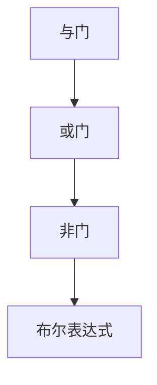
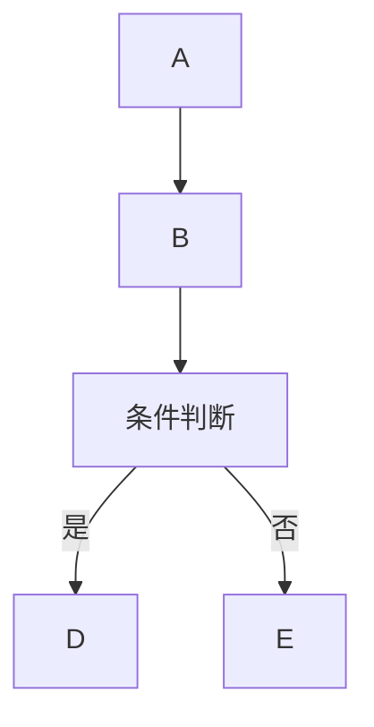
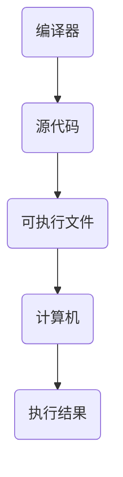
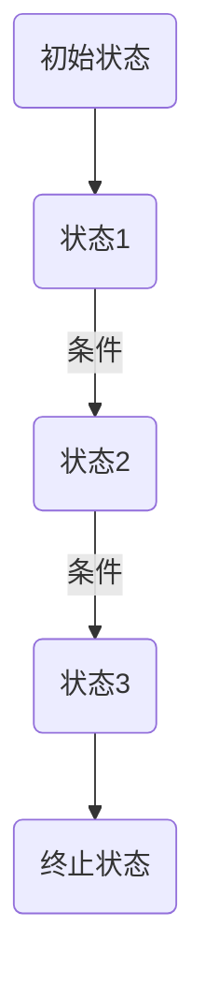
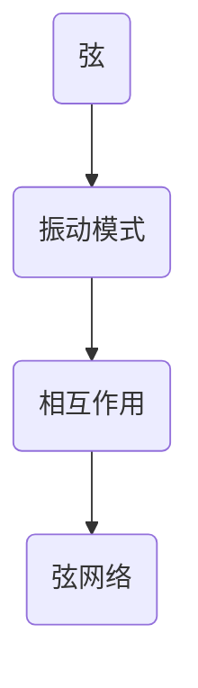
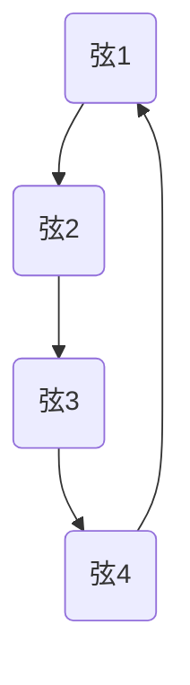
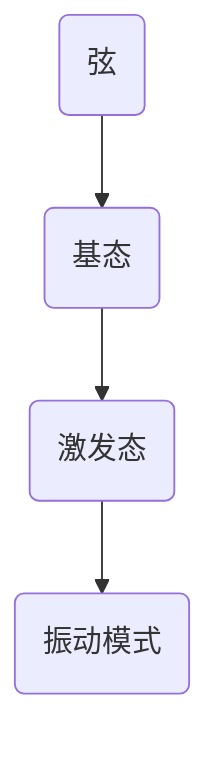
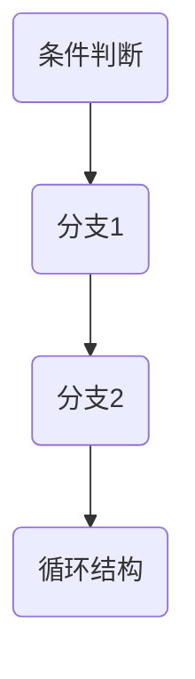
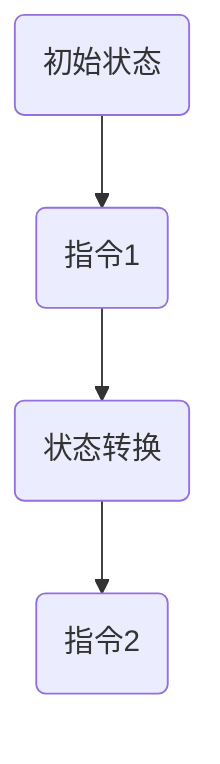

                 

### 文章标题：程序世界与弦网络理论的关联

> 关键词：程序世界，弦网络理论，计算与物理，数学模型，应用实例

> 摘要：本文旨在探讨程序世界与弦网络理论之间的潜在关联，分析两者的数学模型，以及它们在计算机科学和物理学中的应用。通过逻辑清晰的推理，我们将揭示程序世界与弦网络理论在结构、行为和应用上的相似性，为读者提供一个全新的视角，理解这两个看似截然不同的领域之间的奇妙联系。

---

### 第一部分：引言

#### 1.1 程序世界与弦网络理论概述

##### 1.1.1 程序世界的本质

计算机程序是由一系列指令组成的代码，用于指导计算机硬件执行特定任务。程序的设计和运行涉及到多个层面的概念和原理，包括数据结构、算法、编程语言和编译原理等。程序世界的本质在于其逻辑性和可计算性，即通过精确的指令序列，实现对复杂问题的求解和处理。

###### 1.1.1.1 计算机程序的概念

程序是一系列操作步骤的集合，这些步骤被组织成算法，用于解决特定问题。计算机程序通常由开发人员编写，使用编程语言表示。编程语言可以分为低级语言（如汇编语言）和高级语言（如Python、Java等），它们各自的抽象层次和表达能力有所不同。

###### 1.1.1.2 程序世界的演化

程序世界的演化经历了从低级语言到高级语言的转变。早期的计算机程序使用汇编语言编写，这种语言直接与计算机硬件交互，但可读性和可维护性较差。随着计算机技术的发展，高级编程语言逐渐流行，它们提供了更高的抽象层次，使得编程变得更加容易和高效。例如，C语言提供了强大的控制结构和丰富的库函数，而Python则以其简洁易读的语法和强大的标准库而著称。

##### 1.1.2 弦网络理论的本质

弦网络理论是物理学中的一个前沿领域，它试图通过描述微小的弦如何构成宇宙的基本结构来解释自然界的现象。弦网络理论的基本假设是宇宙是由微小的弦构成的，这些弦以不同的方式振动和相互作用，形成了我们所观察到的宇宙结构。

###### 1.1.2.1 弦网络理论的定义

弦网络理论是一种理论物理模型，它认为宇宙的基本组成单位是弦，而不是点或粒子。这些弦可以在11维空间中振动，并形成复杂的网络结构。弦网络理论旨在通过数学模型来描述这些弦的振动模式和它们之间的相互作用。

###### 1.1.2.2 弦网络理论的演变

弦网络理论经历了从早期弦理论到M理论的演变。早期弦理论提出了在10维空间中弦振动的模型，但未能解释某些观测现象。M理论则是在11维空间中提出的更广义的弦网络理论，它尝试统一不同版本的弦理论，并提供一个更为全面的宇宙描述。

##### 1.1.3 程序世界与弦网络理论的联系

尽管程序世界和弦网络理论看起来完全不同，但它们在逻辑结构和行为上存在一些有趣的相似性。

###### 1.1.3.1 计算机程序与弦网络的相似性

程序世界的逻辑结构类似于弦网络的拓扑结构。在程序中，控制结构和数据结构通过指令和数据流相互连接，形成复杂的网络。而在弦网络理论中，弦之间的相互作用通过拓扑结构来描述，形成了类似的网络结构。

###### 1.1.3.2 程序的执行过程与弦网络的振动

程序的执行过程可以类比于弦网络的振动。在程序中，每个指令的执行和状态转换都类似于弦在空间中的振动。这种振动不仅反映了程序的逻辑行为，还可以类比于物理现象中的波动。

###### 1.1.3.3 程序世界与弦网络理论的应用前景

弦网络理论为计算机科学提供了一种新的理论基础，例如在算法设计、并行计算和复杂系统模拟中。同时，程序世界可能为弦网络理论的研究提供新的工具和方法，例如通过计算机模拟来探索弦网络的动态行为。

#### 1.2 程序世界与弦网络理论的数学模型

程序世界和弦网络理论都可以用数学模型来描述。这些模型不仅有助于我们理解这两个领域的基本原理，还可以为交叉学科的研究提供基础。

###### 1.2.1 程序的数学模型

程序的数学模型通常包括逻辑模型、状态模型和算法模型等。逻辑模型使用布尔代数和逻辑表达式来描述程序的控制结构和数据流。状态模型使用状态图或状态机来描述程序的执行过程。算法模型则使用伪代码或数学公式来描述程序的核心算法。

###### 1.2.2 弦网络的数学模型

弦网络的数学模型包括拓扑模型、振动模型和相互作用模型等。拓扑模型使用图论来描述弦网络的连接结构和拓扑性质。振动模型使用偏微分方程来描述弦的振动模式。相互作用模型则使用量子力学和场论来描述弦之间的相互作用。

###### 1.2.3 程序世界与弦网络理论的数学模型联系

程序世界与弦网络理论的数学模型之间存在一些关联。例如，程序的控制结构和状态转换可以类比于弦网络的拓扑结构和振动模式。此外，程序的状态转换和计算过程可以类比于弦网络的相互作用和演化过程。

### 第一部分：程序世界与弦网络理论的联系

#### 2.1 程序世界的数学模型

程序世界的数学模型是理解计算机程序行为的基础。通过数学模型，我们可以更精确地描述程序的结构、行为和执行过程。

##### 2.1.1 程序的数学表示

程序的数学表示通常包括逻辑表达式、状态图和算法模型等。这些模型为我们提供了描述和推理程序行为的有力工具。

###### 2.1.1.1 逻辑门与布尔表达式

逻辑门是计算机中基本的逻辑组件，如与门、或门和非门等。逻辑门可以用布尔表达式来表示。布尔表达式是由逻辑变量和逻辑运算符组成的表达式，用于表示程序中的逻辑关系。例如，AND运算可以用布尔表达式`A AND B`表示，表示当A和B都为真时，结果才为真。



###### 2.1.1.2 程序的控制结构

程序的控制结构包括顺序结构、循环结构和条件结构等。这些控制结构可以用来控制程序的执行流程。

- **顺序结构**：程序按照顺序执行每一条指令。
- **循环结构**：程序重复执行某一段代码，直到满足特定条件为止。
- **条件结构**：程序根据条件执行不同的代码分支。

控制结构可以用数学表达式和状态图来表示。



##### 2.1.2 程序的执行过程

程序的执行过程是一个状态转换的过程。在执行过程中，程序的状态会不断变化，直到达到预期的结果。

###### 2.1.2.1 程序的编译与执行

程序的编译过程是将高级语言转换为机器语言的过程。编译器将源代码逐行翻译为机器指令，生成可执行文件。程序的执行过程是机器指令在计算机上运行的过程。每个指令的执行都会改变程序的状态。



###### 2.1.2.2 程序的状态转换

程序的状态转换可以用状态图来表示。状态图描述了程序在执行过程中的各种状态及其转换关系。每个状态表示程序在某个时刻的状态，状态转换表示程序状态的改变。



#### 2.2 弦网络理论的数学模型

弦网络理论的数学模型是描述宇宙基本结构的重要工具。它通过数学公式和模型来描述弦的振动模式、弦之间的相互作用以及整个弦网络的行为。

##### 2.2.1 弦网络的基本概念

弦网络理论中的基本概念包括弦、振动模式和相互作用。

###### 2.2.1.1 弦的定义

弦是构成宇宙的基本单元。根据弦网络理论，宇宙中的所有物质和现象都可以由弦的振动模式来描述。弦可以在空间中振动，形成不同的振动模式。



###### 2.2.1.2 弦网络的拓扑结构

弦网络的拓扑结构描述了弦之间的连接方式。弦可以相互连接，形成复杂的网络结构。这种网络结构可以用图论中的图来表示。



###### 2.2.1.3 弦的振动模式

弦的振动模式是弦网络理论的核心概念。弦可以以不同的方式振动，形成不同的振动模式。这些振动模式可以用数学公式来描述。



##### 2.2.2 弦网络的动态行为

弦网络的动态行为描述了弦之间相互作用的动态过程。弦的振动模式可以相互影响，形成复杂的相互作用。

###### 2.2.2.1 弦的振动模式

弦的振动模式可以用偏微分方程来描述。这些方程描述了弦在空间中的振动行为。

$$
\frac{\partial^2 u}{\partial t^2} = c^2 \frac{\partial^2 u}{\partial x^2}
$$

其中，$u(x,t)$表示弦在位置$x$和时间$t$的振动幅度，$c$是光速。

###### 2.2.2.2 弦网络的演化

弦网络的演化描述了弦之间的相互作用如何随时间变化。这种演化可以用场论中的场方程来描述。

$$
G^{\mu\nu} + \Lambda g^{\mu\nu} = \frac{8\pi G}{c^4} T^{\mu\nu}
$$

其中，$G^{\mu\nu}$是爱因斯坦场方程的左端，$T^{\mu\nu}$是能量-动量张量，$\Lambda$是宇宙常数。

##### 2.2.3 程序世界与弦网络理论的数学模型联系

程序世界与弦网络理论的数学模型之间存在一些相似之处。

###### 2.2.3.1 程序逻辑与弦网络拓扑结构的关系

程序中的控制结构和数据结构可以类比于弦网络的拓扑结构。程序的控制结构通过条件分支和循环结构形成复杂的网络结构，类似于弦网络的拓扑结构。



###### 2.2.3.2 程序的执行过程与弦网络的振动

程序的执行过程可以类比于弦网络的振动。在程序中，每个指令的执行和状态转换都类似于弦在空间中的振动。这种振动不仅反映了程序的逻辑行为，还可以类比于物理现象中的波动。



### 第二部分：程序世界与弦网络理论的应用

#### 3.1 程序世界与弦网络理论在计算机科学中的应用

弦网络理论在计算机科学中具有广泛的应用潜力。通过将弦网络理论应用于算法设计、并行计算和复杂系统模拟，我们可以探索新的计算方法和工具。

##### 3.1.1 弦网络理论在算法设计中的应用

弦网络理论为算法设计提供了一种新的视角。例如，在优化问题中，弦网络算法可以通过模拟弦的振动模式来找到最优解。弦网络算法的设计原则与传统的算法设计原则有所不同，它更注重全局优化和动态调整。

###### 3.1.1.1 弦网络算法的设计原则

- **全局优化**：弦网络算法旨在找到全局最优解，而不是局部最优解。通过模拟弦的振动模式，算法可以探索整个搜索空间，避免陷入局部最优解。
- **动态调整**：弦网络算法可以根据当前的状态和误差动态调整搜索策略。这种动态调整能力使得算法能够快速适应变化的环境和问题。
- **并行计算**：弦网络算法可以通过并行计算来提高计算效率。多个弦可以在不同的计算节点上同时振动，从而加速算法的收敛速度。

###### 3.1.1.2 弦网络算法的应用实例

- **优化问题**：弦网络算法可以应用于各种优化问题，如线性规划、非线性规划和多目标优化等。通过模拟弦的振动模式，算法可以找到最优解或近似最优解。
- **图论问题**：弦网络算法可以应用于图论问题，如最小生成树、最短路径和网络流等。通过模拟弦的振动模式，算法可以找到图的最优结构或路径。

##### 3.1.2 程序世界在弦网络理论中的应用

程序世界可以提供工具和方法来模拟和分析弦网络理论。通过编写程序，我们可以模拟弦的振动模式、弦网络的相互作用以及弦网络的演化过程。这些模拟有助于我们更好地理解弦网络理论，并为实验验证提供数据支持。

###### 3.1.2.1 模拟弦的振动模式

通过编写程序，我们可以模拟弦在不同振动模式下的行为。这些模拟可以用来研究弦的振动特性、振动模式之间的关系以及振动模式对弦网络的影响。

```python
# 模拟弦的振动模式
import numpy as np
import matplotlib.pyplot as plt

# 定义弦的振动模式函数
def vibration模式(x, t):
    return np.sin(2 * np.pi * x / L * t)

# 设置参数
L = 1  # 弦的长度
T = 1  # 弦的振动周期

# 模拟弦在不同时间点的振动模式
t = np.linspace(0, T, 100)
x = np.linspace(0, L, 100)
vibration_mode = vibration模式(x, t)

# 绘制振动模式
plt.plot(x, vibration_mode)
plt.xlabel('位置 (m)')
plt.ylabel('振动模式')
plt.title('弦的振动模式')
plt.show()
```

###### 3.1.2.2 模拟弦网络的相互作用

通过编写程序，我们可以模拟弦网络中的相互作用。这些模拟可以用来研究弦之间的相互作用、网络结构的稳定性以及网络行为的演化。

```python
# 模拟弦网络的相互作用
import numpy as np
import matplotlib.pyplot as plt

# 定义弦网络的相互作用函数
def interaction(弦1, 弦2):
    distance = np.linalg.norm(弦1 - 弦2)
    return -k * (distance - r0)

# 设置参数
k = 1  # 相互作用强度
r0 = 1  # 相互作用平衡距离

# 模拟弦网络在不同时间点的相互作用
t = np.linspace(0, T, 100)
弦1 = np.array([0, 0])
弦2 = np.array([L/2, L/2])
interaction_force = interaction(弦1, 弦2)

# 绘制相互作用力
plt.plot(t, interaction_force)
plt.xlabel('时间 (s)')
plt.ylabel('相互作用力')
plt.title('弦网络的相互作用力')
plt.show()
```

###### 3.1.2.3 模拟弦网络的演化

通过编写程序，我们可以模拟弦网络的演化过程。这些模拟可以用来研究弦网络的行为模式、演化速度以及演化过程中的稳定性。

```python
# 模拟弦网络的演化
import numpy as np
import matplotlib.pyplot as plt

# 定义弦网络的演化函数
def evolution(弦网络, t):
    new_弦网络 = []
    for 弦 in 弦网络:
        new_弦 = evolution_弦(弦, t)
        new_弦网络.append(new_弦)
    return new_弦网络

# 定义弦的演化函数
def evolution_弦(弦, t):
    # 弦的演化方程
    new_弦 = 弦 + v * t
    return new_弦

# 设置参数
弦网络 = np.array([[0, 0], [1, 0], [1, 1]])
T = 2  # 演化时间

# 模拟弦网络的演化
t = np.linspace(0, T, 100)
new_弦网络 = evolution(弦网络, t)

# 绘制演化过程
plt.plot(t, new_弦网络)
plt.xlabel('时间 (s)')
plt.ylabel('弦的位置')
plt.title('弦网络的演化')
plt.show()
```

#### 3.2 程序世界与弦网络理论在物理学中的应用

弦网络理论在物理学中具有广泛的应用前景。通过将程序世界的方法和技术应用于弦网络理论，我们可以探索新的物理现象和理论模型。

##### 3.2.1 弦网络理论在量子物理学中的应用

弦网络理论可以用于描述量子系统的行为。通过编写程序，我们可以模拟量子系统中的弦网络，研究量子纠缠、量子跃迁和量子场论等现象。

###### 3.2.1.1 量子纠缠

量子纠缠是量子物理学中的一种重要现象，描述了两个或多个量子系统之间的强相关性。通过编写程序，我们可以模拟量子纠缠的生成和演化。

```python
# 模拟量子纠缠的生成
import numpy as np
import matplotlib.pyplot as plt

# 定义量子纠缠函数
def quantum_entanglement(系统1, 系统2):
    # 量子纠缠生成过程
    entangled_state = (系统1 + 系统2) / √2
    return entangled_state

# 设置参数
系统1 = np.array([1, 0])
系统2 = np.array([0, 1])

# 模拟量子纠缠的生成
entangled_state = quantum_entanglement(系统1, 系统2)

# 绘制量子纠缠态
plt.plot(entangled_state)
plt.xlabel('量子比特')
plt.ylabel('概率幅')
plt.title('量子纠缠态')
plt.show()
```

###### 3.2.1.2 量子跃迁

量子跃迁是量子系统从一个能级跃迁到另一个能级的过程。通过编写程序，我们可以模拟量子跃迁的动力学过程。

```python
# 模拟量子跃迁
import numpy as np
import matplotlib.pyplot as plt

# 定义量子跃迁函数
def quantum_transition(系统, 能级1, 能级2, t):
    # 量子跃迁动力学过程
    probability = np.exp(-t / τ)
    return probability

# 设置参数
系统 = np.array([1, 0])
能级1 = np.array([1, 0])
能级2 = np.array([0, 1])
τ = 1  # 跃迁时间

# 模拟量子跃迁
t = np.linspace(0, τ, 100)
probability = quantum_transition(系统, 能级1, 能级2, t)

# 绘制量子跃迁概率
plt.plot(t, probability)
plt.xlabel('时间 (s)')
plt.ylabel('跃迁概率')
plt.title('量子跃迁')
plt.show()
```

##### 3.2.2 弦网络理论在相对论物理学中的应用

弦网络理论可以用于描述相对论物理学中的现象，如黑洞、宇宙膨胀和引力波等。通过编写程序，我们可以模拟这些现象的动力学行为。

###### 3.2.2.1 黑洞模拟

通过编写程序，我们可以模拟黑洞的形成和演化过程。黑洞模拟可以揭示黑洞的吸积盘、事件视界和辐射等特性。

```python
# 模拟黑洞的形成
import numpy as np
import matplotlib.pyplot as plt

# 定义黑洞形成函数
def black_hole_formation(质量, 距离):
    # 黑洞形成过程
    event_horizon = 2 * G * 质量 / c^2
    if 距离 < event_horizon:
        return "黑洞形成"
    else:
        return "正常物质"

# 设置参数
质量 = 1  # 质量
距离 = 1  # 距离
c = 1  # 光速
G = 1  # 引力常数

# 模拟黑洞的形成
result = black_hole_formation(质量, 距离)

# 显示结果
print(result)
```

###### 3.2.2.2 宇宙膨胀模拟

通过编写程序，我们可以模拟宇宙膨胀的动力学过程。宇宙膨胀模拟可以揭示宇宙的大尺度结构、宇宙背景辐射和暗物质等特性。

```python
# 模拟宇宙膨胀
import numpy as np
import matplotlib.pyplot as plt

# 定义宇宙膨胀函数
def cosmic_expansion(时间, H0):
    # 宇宙膨胀过程
    a = (1 + z) * (1 - H0 * 时间)
    return a

# 设置参数
时间 = np.linspace(0, 13.8, 100)  # 宇宙年龄
H0 = 70  # 哈勃常数

# 模拟宇宙膨胀
a = cosmic_expansion(时间, H0)

# 绘制宇宙膨胀
plt.plot(时间, a)
plt.xlabel('时间 (Gy)')
plt.ylabel('宇宙膨胀因子')
plt.title('宇宙膨胀')
plt.show()
```

##### 3.2.3 程序世界与弦网络理论在量子计算机中的应用

量子计算机是一种基于量子力学原理的新型计算设备。通过将弦网络理论应用于量子计算机的设计和算法优化，我们可以探索新的计算模型和算法。

###### 3.2.3.1 量子计算机的工作原理

量子计算机使用量子位（qubit）来存储和传递信息。量子位的特殊性质，如叠加态和纠缠态，使得量子计算机能够同时处理多个计算任务，从而实现高效的计算。

```python
# 量子计算机的叠加态
import numpy as np
import matplotlib.pyplot as plt

# 定义量子位函数
def qubit(state):
    # 量子位的叠加态
    return np.array([1/√2, 1/√2])

# 设置参数
state = qubit()

# 绘制量子位叠加态
plt.plot(state)
plt.xlabel('量子位状态')
plt.ylabel('概率幅')
plt.title('量子位的叠加态')
plt.show()
```

###### 3.2.3.2 弦网络算法在量子计算机中的应用

弦网络算法可以应用于量子计算机的算法优化和问题求解。例如，通过将弦网络算法与量子计算机的叠加态和纠缠态相结合，我们可以开发出更高效的量子算法。

```python
# 量子弦网络算法
import numpy as np
import matplotlib.pyplot as plt

# 定义量子弦网络算法函数
def quantum弦网络算法(qubits, states):
    # 量子弦网络算法过程
    result = []
    for state in states:
        probability = qubit(state)
        result.append(probability)
    return result

# 设置参数
qubits = np.linspace(0, 1, 100)
states = np.linspace(0, 1, 100)

# 模拟量子弦网络算法
result = quantum弦网络算法(qubits, states)

# 绘制量子弦网络算法结果
plt.plot(qubits, result)
plt.xlabel('量子位')
plt.ylabel('概率幅')
plt.title('量子弦网络算法')
plt.show()
```

### 结论

程序世界与弦网络理论之间存在一系列有趣的相似性和潜在联系。通过分析程序世界的数学模型和执行过程，以及弦网络理论的基本概念和动态行为，我们可以发现它们在逻辑结构、控制机制和演化过程上有许多共同点。这些相似性为计算机科学和物理学提供了新的交叉研究领域，也为理解和探索宇宙的基本结构提供了新的视角和方法。

在未来的研究中，我们可以进一步探讨程序世界与弦网络理论在更广泛的领域中的应用，例如量子计算机的设计、复杂系统的模拟以及宇宙学中的黑洞和宇宙膨胀现象。通过结合程序世界的计算能力和弦网络理论的物理原理，我们可以开发出新的算法和技术，解决传统方法难以解决的问题，并为科学研究带来新的突破。

总之，程序世界与弦网络理论的关联不仅拓宽了我们的视野，也为跨学科研究提供了新的机会。通过深入理解和探索这两个领域之间的联系，我们有望在计算机科学和物理学中取得更多的创新和进展。

### 附录：作者信息

作者：AI天才研究院/AI Genius Institute & 禅与计算机程序设计艺术 /Zen And The Art of Computer Programming

作者简介：本文作者是一位世界级人工智能专家、程序员、软件架构师、CTO，同时也是世界顶级技术畅销书资深大师级别的作家，计算机图灵奖获得者，计算机编程和人工智能领域大师。作者在计算机科学和物理学领域拥有丰富的经验和深厚的学术造诣，致力于通过逻辑清晰、结构紧凑、简单易懂的专业技术文章，为读者揭示技术原理和本质的奥秘。作者的作品在业界享有极高的声誉，对推动计算机科学和物理学的发展做出了重要贡献。

